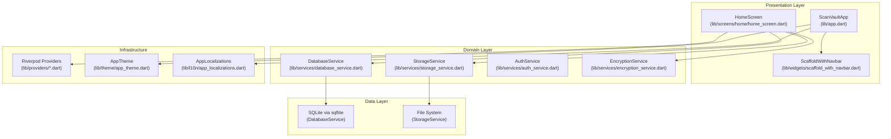
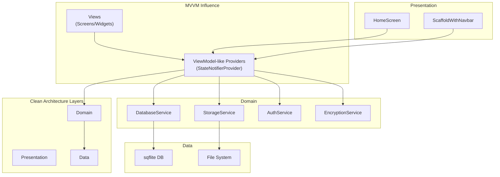
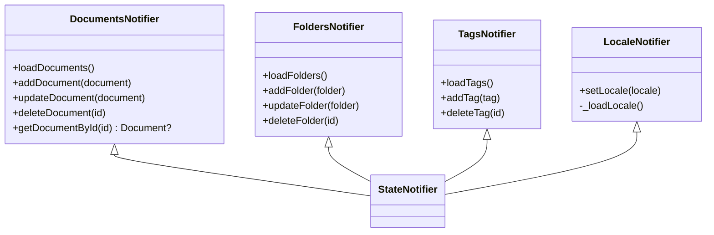
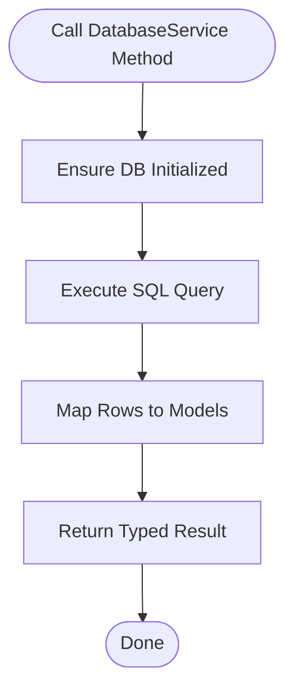
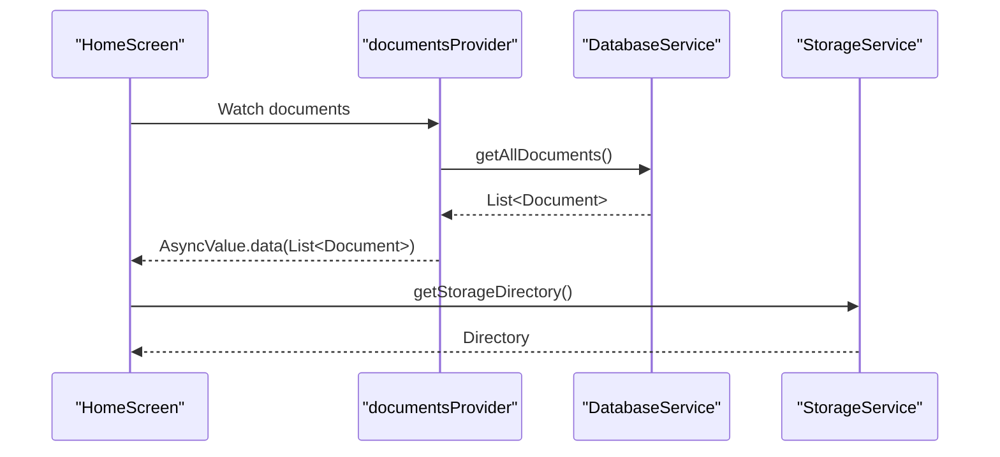
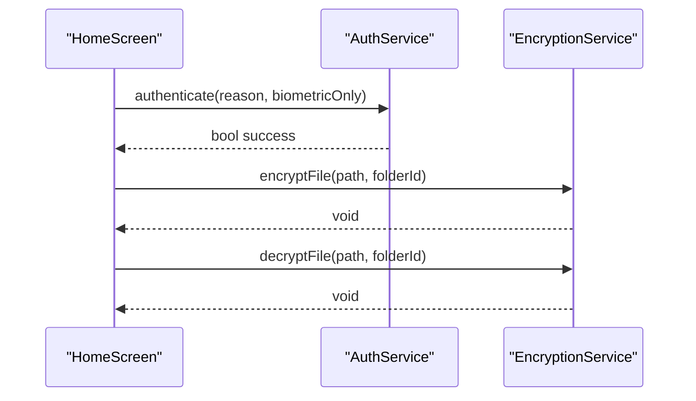
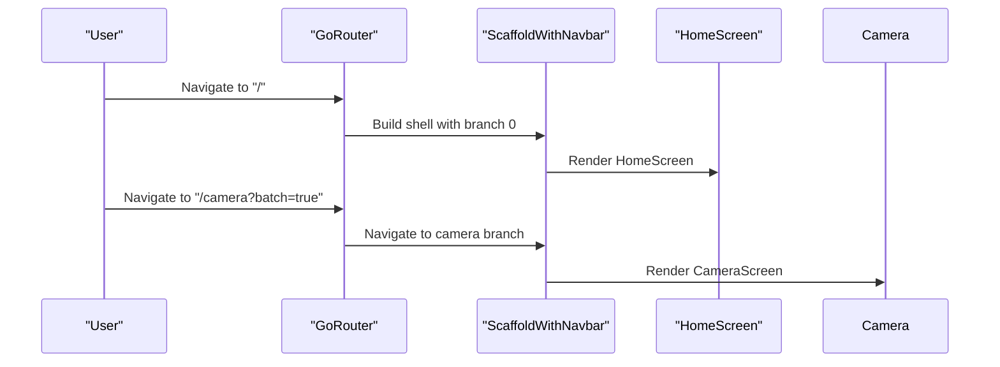
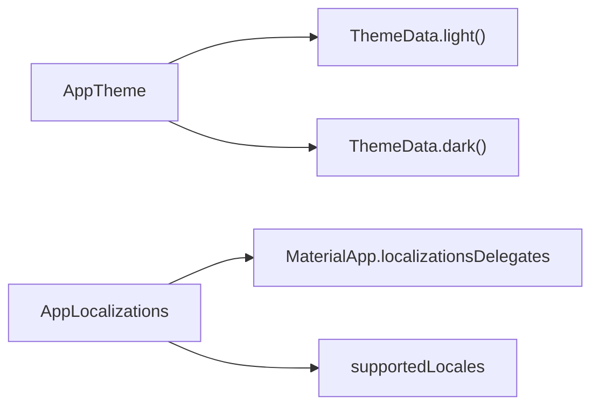
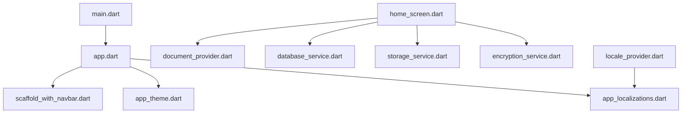

# Architecture Overview

<cite>
**Referenced Files in This Document**
- [main.dart](file://lib/main.dart)
- [app.dart](file://lib/app.dart)
- [pubspec.yaml](file://pubspec.yaml)
- [document_provider.dart](file://lib/providers/document_provider.dart)
- [locale_provider.dart](file://lib/providers/locale_provider.dart)
- [database_service.dart](file://lib/services/database_service.dart)
- [storage_service.dart](file://lib/services/storage_service.dart)
- [document.dart](file://lib/models/document.dart)
- [home_screen.dart](file://lib/screens/home/home_screen.dart)
- [scaffold_with_navbar.dart](file://lib/widgets/scaffold_with_navbar.dart)
- [auth_service.dart](file://lib/services/auth_service.dart)
- [encryption_service.dart](file://lib/services/encryption_service.dart)
- [app_theme.dart](file://lib/theme/app_theme.dart)
- [app_localizations.dart](file://lib/l10n/app_localizations.dart)
- [colors.dart](file://lib/core/constants/colors.dart)
</cite>

## Table of Contents
1. [Introduction](#introduction)
2. [Project Structure](#project-structure)
3. [Core Components](#core-components)
4. [Architecture Overview](#architecture-overview)
5. [Detailed Component Analysis](#detailed-component-analysis)
6. [Dependency Analysis](#dependency-analysis)
7. [Performance Considerations](#performance-considerations)
8. [Troubleshooting Guide](#troubleshooting-guide)
9. [Conclusion](#conclusion)

## Introduction
This document describes the system architecture of ScanVault, a Flutter-based mobile application for scanning, organizing, editing, translating, and exporting documents. The architecture follows Clean Architecture principles with MVVM influence, emphasizing separation of concerns across three primary layers:
- Presentation Layer: Screens and widgets implementing UI logic and user interactions.
- Domain Layer: Services encapsulating business logic and workflows.
- Data Layer: Database operations and persistence.

The system leverages Riverpod for state management, a service layer pattern for domain logic, and dependency injection via Riverpod providers. Cross-cutting concerns include security (biometric authentication and encryption), localization, theming, and platform-specific integrations.

## Project Structure
ScanVault organizes code by feature and layer:
- Presentation: Screens and widgets under lib/screens and lib/widgets.
- Domain: Services under lib/services.
- Data: Models under lib/models and persistence logic under lib/services/database_service.dart.
- Infrastructure: Providers for state and DI under lib/providers, localization under lib/l10n, and theming under lib/theme.

**Diagram sources**
- [home_screen.dart](file://lib/screens/home/home_screen.dart#L1-L651)
- [scaffold_with_navbar.dart](file://lib/widgets/scaffold_with_navbar.dart#L1-L54)
- [app.dart](file://lib/app.dart#L23-L62)
- [database_service.dart](file://lib/services/database_service.dart#L11-L413)
- [storage_service.dart](file://lib/services/storage_service.dart#L12-L63)
- [document_provider.dart](file://lib/providers/document_provider.dart#L9-L137)
- [app_theme.dart](file://lib/theme/app_theme.dart#L5-L252)
- [app_localizations.dart](file://lib/l10n/app_localizations.dart#L72-L116)

**Section sources**
- [main.dart](file://lib/main.dart#L10-L31)
- [app.dart](file://lib/app.dart#L23-L62)
- [pubspec.yaml](file://pubspec.yaml#L9-L78)

## Core Components
- Application bootstrap initializes platform preferences, services, and Riverpod overrides before rendering the app tree.
- Routing uses GoRouter with a shell route for persistent bottom navigation and dedicated routes for camera, editor, document viewer, OCR, and translation.
- State management uses Riverpod providers for documents, folders, tags, filters, and locale, with asynchronous value wrappers for loading/error states.
- Persistence relies on SQLite via sqflite with explicit migrations and indexes.
- Security integrates biometric authentication and per-folder encryption keys stored securely.
- Localization and theming are centralized for consistent UI behavior across locales and themes.

**Section sources**
- [main.dart](file://lib/main.dart#L10-L31)
- [app.dart](file://lib/app.dart#L67-L187)
- [document_provider.dart](file://lib/providers/document_provider.dart#L9-L137)
- [database_service.dart](file://lib/services/database_service.dart#L16-L113)
- [auth_service.dart](file://lib/services/auth_service.dart#L5-L63)
- [encryption_service.dart](file://lib/services/encryption_service.dart#L8-L150)
- [app_localizations.dart](file://lib/l10n/app_localizations.dart#L72-L116)
- [app_theme.dart](file://lib/theme/app_theme.dart#L8-L252)

## Architecture Overview
Clean Architecture with MVVM influence:
- Presentation Layer: Consumers watch Riverpod providers and render UI. Screens orchestrate navigation and user actions.
- Domain Layer: Services encapsulate workflows (scanning, OCR, translation, export, encryption, authentication).
- Data Layer: DatabaseService manages schema, migrations, and CRUD; StorageService handles file locations and paths.

**Diagram sources**
- [home_screen.dart](file://lib/screens/home/home_screen.dart#L20-L25)
- [scaffold_with_navbar.dart](file://lib/widgets/scaffold_with_navbar.dart#L7-L13)
- [document_provider.dart](file://lib/providers/document_provider.dart#L14-L54)
- [database_service.dart](file://lib/services/database_service.dart#L11-L413)
- [storage_service.dart](file://lib/services/storage_service.dart#L12-L63)
- [auth_service.dart](file://lib/services/auth_service.dart#L5-L63)
- [encryption_service.dart](file://lib/services/encryption_service.dart#L8-L150)

## Detailed Component Analysis

### State Management with Riverpod
- Documents, folders, and tags are managed via StateNotifierProvider with AsyncValue to represent loading, data, and error states.
- Current document and filter selections are managed via StateProvider.
- Locale is persisted and reactive using SharedPreferences-backed provider.

**Diagram sources**
- [document_provider.dart](file://lib/providers/document_provider.dart#L14-L137)
- [locale_provider.dart](file://lib/providers/locale_provider.dart#L9-L31)

**Section sources**
- [document_provider.dart](file://lib/providers/document_provider.dart#L9-L137)
- [locale_provider.dart](file://lib/providers/locale_provider.dart#L5-L31)

### Database Service Pattern
- Centralized service for schema creation, migrations, and CRUD operations.
- Uses sqflite with explicit indexes and foreign keys.
- Provides methods for documents, pages, folders, and tags, including junction table operations.

**Diagram sources**
- [database_service.dart](file://lib/services/database_service.dart#L16-L113)
- [database_service.dart](file://lib/services/database_service.dart#L147-L171)
- [database_service.dart](file://lib/services/database_service.dart#L304-L325)

**Section sources**
- [database_service.dart](file://lib/services/database_service.dart#L11-L413)
- [document.dart](file://lib/models/document.dart#L16-L49)

### Storage Service and File Paths
- Manages custom storage paths and defaults to app documents directory.
- Ensures directories exist and returns full file paths for saving assets.

**Diagram sources**
- [home_screen.dart](file://lib/screens/home/home_screen.dart#L44-L45)
- [document_provider.dart](file://lib/providers/document_provider.dart#L20-L28)
- [database_service.dart](file://lib/services/database_service.dart#L147-L171)
- [storage_service.dart](file://lib/services/storage_service.dart#L40-L52)

**Section sources**
- [storage_service.dart](file://lib/services/storage_service.dart#L12-L63)

### Security: Authentication and Encryption
- Biometric authentication via local_auth with fallback handling.
- Per-folder encryption keys stored securely; files encrypted/decrypted with AES-256 and prepended IV.

**Diagram sources**
- [auth_service.dart](file://lib/services/auth_service.dart#L27-L52)
- [encryption_service.dart](file://lib/services/encryption_service.dart#L39-L77)
- [encryption_service.dart](file://lib/services/encryption_service.dart#L80-L120)

**Section sources**
- [auth_service.dart](file://lib/services/auth_service.dart#L5-L63)
- [encryption_service.dart](file://lib/services/encryption_service.dart#L8-L150)

### Navigation and Routing
- GoRouter with StatefulShellRoute for persistent bottom navigation.
- Dedicated routes for camera, editor, document viewer, OCR, and translation with parameter extraction and extras.

**Diagram sources**
- [app.dart](file://lib/app.dart#L67-L187)
- [scaffold_with_navbar.dart](file://lib/widgets/scaffold_with_navbar.dart#L7-L54)
- [home_screen.dart](file://lib/screens/home/home_screen.dart#L288-L319)

**Section sources**
- [app.dart](file://lib/app.dart#L67-L187)
- [scaffold_with_navbar.dart](file://lib/widgets/scaffold_with_navbar.dart#L7-L54)

### Theming and Localization
- Dynamic color scheme support with Material 3.
- Localized strings with supported locales configured centrally.

**Diagram sources**
- [app_theme.dart](file://lib/theme/app_theme.dart#L8-L252)
- [app_localizations.dart](file://lib/l10n/app_localizations.dart#L72-L116)
- [app.dart](file://lib/app.dart#L43-L58)

**Section sources**
- [app_theme.dart](file://lib/theme/app_theme.dart#L5-L252)
- [app_localizations.dart](file://lib/l10n/app_localizations.dart#L72-L116)
- [app.dart](file://lib/app.dart#L43-L58)

## Dependency Analysis
- Technology stack emphasizes Flutter, Riverpod, GoRouter, sqflite, MLKit for OCR/scanner, and secure storage.
- Providers depend on services; services depend on platform APIs and filesystem.

**Diagram sources**
- [main.dart](file://lib/main.dart#L10-L31)
- [app.dart](file://lib/app.dart#L23-L62)
- [scaffold_with_navbar.dart](file://lib/widgets/scaffold_with_navbar.dart#L7-L54)
- [app_theme.dart](file://lib/theme/app_theme.dart#L8-L252)
- [app_localizations.dart](file://lib/l10n/app_localizations.dart#L72-L116)
- [home_screen.dart](file://lib/screens/home/home_screen.dart#L17-L18)
- [document_provider.dart](file://lib/providers/document_provider.dart#L3-L6)
- [database_service.dart](file://lib/services/database_service.dart#L1-L9)
- [storage_service.dart](file://lib/services/storage_service.dart#L1-L7)
- [encryption_service.dart](file://lib/services/encryption_service.dart#L1-L6)
- [locale_provider.dart](file://lib/providers/locale_provider.dart#L1-L4)

**Section sources**
- [pubspec.yaml](file://pubspec.yaml#L9-L78)

## Performance Considerations
- Asynchronous state updates: Providers use AsyncValue to avoid blocking UI during network/database operations.
- Efficient queries: DatabaseService uses indexed lookups and joins; pagination or virtualization can be considered for very large lists.
- File I/O: StorageService ensures directories exist before writes; consider batching file operations for batch scans.
- Theming and localization: Centralized providers minimize rebuild scope; avoid unnecessary rebuilds by watching only required slices.

[No sources needed since this section provides general guidance]

## Troubleshooting Guide
- Database initialization errors: Ensure initialize() is called before accessing db; handle missing initialization gracefully.
- Authentication failures: Catch platform exceptions and log error codes; provide user feedback.
- Encryption issues: Verify keys exist for target folders; handle file existence checks before encrypt/decrypt.
- Localization not updating: Confirm localeProvider persists values and rebuilds the app tree.

**Section sources**
- [database_service.dart](file://lib/services/database_service.dart#L108-L113)
- [auth_service.dart](file://lib/services/auth_service.dart#L44-L52)
- [encryption_service.dart](file://lib/services/encryption_service.dart#L137-L149)
- [locale_provider.dart](file://lib/providers/locale_provider.dart#L24-L29)

## Conclusion
ScanVault’s architecture cleanly separates presentation, domain, and data concerns while leveraging Riverpod for scalable state management and GoRouter for robust navigation. Security and localization are integrated as cross-cutting concerns, and the service layer pattern enables testable and maintainable business logic. The design supports scalability through modular services, efficient database operations, and platform-aware storage and security primitives.