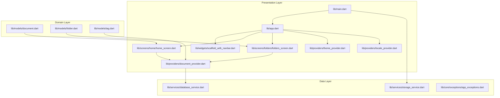
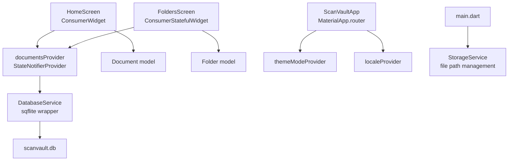
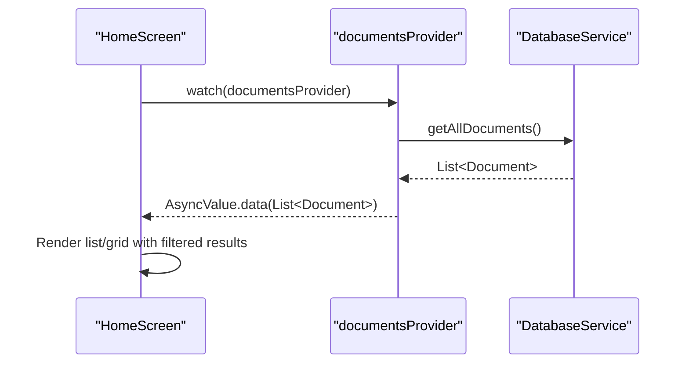
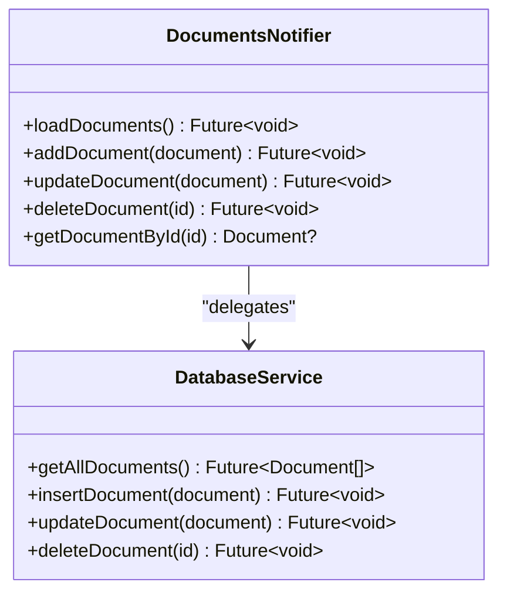
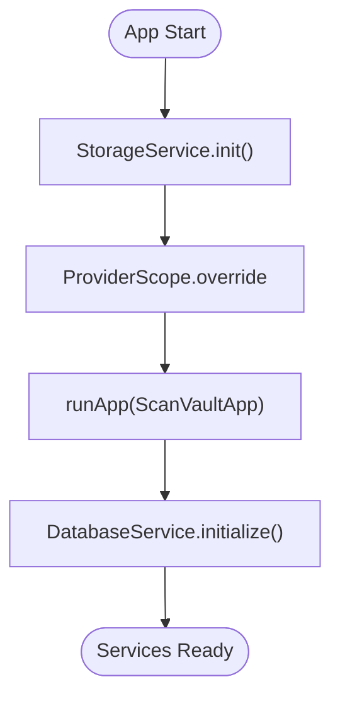
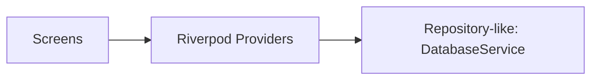
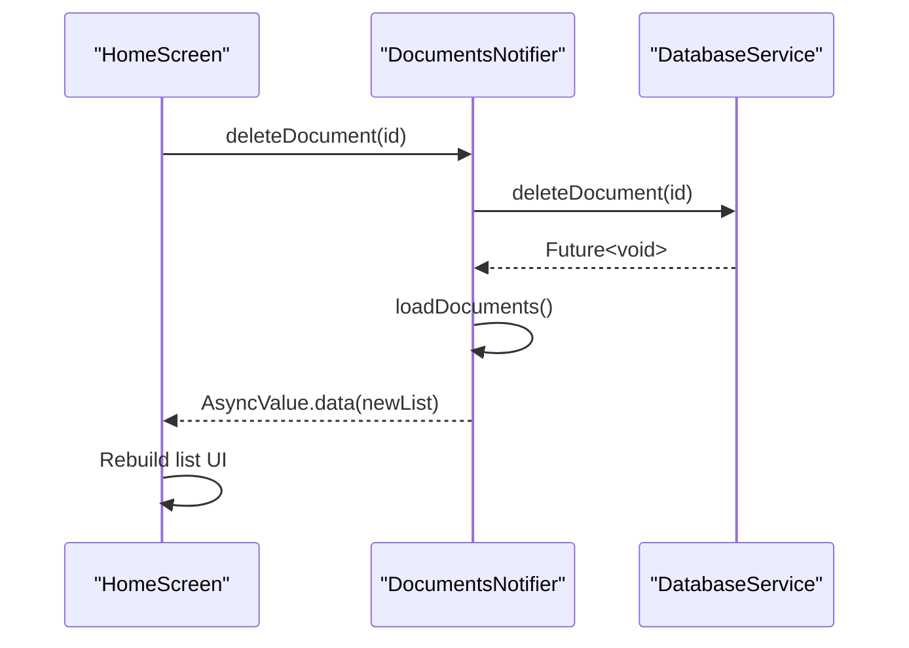
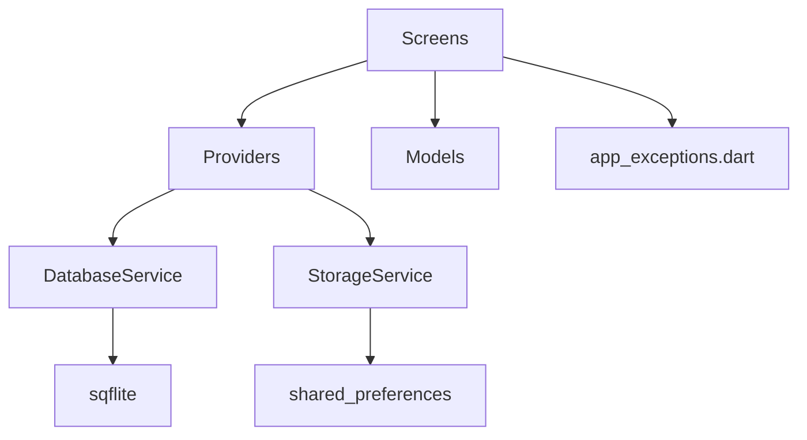

# Clean Architecture & Design Patterns

<cite>
**Referenced Files in This Document**
- [main.dart](file://lib/main.dart)
- [app.dart](file://lib/app.dart)
- [scaffold_with_navbar.dart](file://lib/widgets/scaffold_with_navbar.dart)
- [home_screen.dart](file://lib/screens/home/home_screen.dart)
- [folders_screen.dart](file://lib/screens/folders/folders_screen.dart)
- [document_provider.dart](file://lib/providers/document_provider.dart)
- [locale_provider.dart](file://lib/providers/locale_provider.dart)
- [theme_provider.dart](file://lib/providers/theme_provider.dart)
- [database_service.dart](file://lib/services/database_service.dart)
- [storage_service.dart](file://lib/services/storage_service.dart)
- [document.dart](file://lib/models/document.dart)
- [folder.dart](file://lib/models/folder.dart)
- [tag.dart](file://lib/models/tag.dart)
- [app_exceptions.dart](file://lib/core/exceptions/app_exceptions.dart)
</cite>

## Table of Contents
1. [Introduction](#introduction)
2. [Project Structure](#project-structure)
3. [Core Components](#core-components)
4. [Architecture Overview](#architecture-overview)
5. [Detailed Component Analysis](#detailed-component-analysis)
6. [Dependency Analysis](#dependency-analysis)
7. [Performance Considerations](#performance-considerations)
8. [Troubleshooting Guide](#troubleshooting-guide)
9. [Conclusion](#conclusion)

## Introduction
This document explains how ScanVault implements Clean Architecture principles and several design patterns to achieve separation of concerns, testability, and maintainability in a complex document management application. The app is structured into three primary layers:
- Presentation layer: UI screens and Riverpod providers for state management
- Domain layer: Models and enums representing business entities
- Data layer: Services encapsulating persistence and external integrations

Additional patterns observed:
- MVVM influence in the UI layer via ConsumerWidget/ConsumerStatefulWidget and Riverpod providers
- Provider pattern for reactive state management
- Factory pattern for service instantiation and initialization
- Repository-like abstraction through provider-to-service orchestration (not a formal interface, but a clear dependency inversion)

These patterns enable:
- Clear separation between UI and data logic
- Easy substitution of underlying data stores and services
- Reactive updates without tight coupling
- Testable business logic and UI components

## Project Structure
ScanVault follows a feature-centric layout with clear boundaries:
- lib/main.dart initializes platform and services, then runs the app
- lib/app.dart defines routing and theme/localization wiring
- lib/widgets contains reusable UI scaffolding
- lib/screens host feature-specific UIs
- lib/providers encapsulate reactive state using Riverpod
- lib/services implement data access and external integrations
- lib/models define domain entities and enums
- lib/core holds shared utilities and exceptions

**Diagram sources**
- [main.dart](file://lib/main.dart#L10-L31)
- [app.dart](file://lib/app.dart#L23-L61)
- [scaffold_with_navbar.dart](file://lib/widgets/scaffold_with_navbar.dart#L7-L53)
- [home_screen.dart](file://lib/screens/home/home_screen.dart#L20-L320)
- [folders_screen.dart](file://lib/screens/folders/folders_screen.dart#L14-L282)
- [document_provider.dart](file://lib/providers/document_provider.dart#L9-L136)
- [theme_provider.dart](file://lib/providers/theme_provider.dart#L5-L28)
- [locale_provider.dart](file://lib/providers/locale_provider.dart#L5-L30)
- [database_service.dart](file://lib/services/database_service.dart#L11-L412)
- [storage_service.dart](file://lib/services/storage_service.dart#L12-L62)
- [document.dart](file://lib/models/document.dart#L16-L48)
- [folder.dart](file://lib/models/folder.dart#L7-L20)
- [tag.dart](file://lib/models/tag.dart#L7-L16)

**Section sources**
- [main.dart](file://lib/main.dart#L10-L31)
- [app.dart](file://lib/app.dart#L23-L61)

## Core Components
- Application bootstrap and service initialization
  - Initializes platform orientation and services, then wraps the app in Riverpod’s ProviderScope
  - Overrides a storage service provider with a pre-initialized instance
  - See [main.dart](file://lib/main.dart#L10-L31)

- Routing and shell navigation
  - Defines a shell route with a persistent bottom navigation and nested routes for Home, Folders, Settings, plus full-screen routes for Camera, Editor, Document Viewer, OCR, and Translation
  - See [app.dart](file://lib/app.dart#L67-L186)

- Reactive state providers
  - Documents, folders, tags, current document, and filter type managed via Riverpod StateNotifierProvider and StateProvider
  - Providers delegate to DatabaseService for persistence
  - See [document_provider.dart](file://lib/providers/document_provider.dart#L9-L136)

- Theme and locale providers
  - ThemeModeNotifier and SystemColorNotifier manage theme preferences
  - LocaleNotifier persists and restores locale using SharedPreferences
  - See [theme_provider.dart](file://lib/providers/theme_provider.dart#L5-L28), [locale_provider.dart](file://lib/providers/locale_provider.dart#L5-L30)

- Data access and storage
  - DatabaseService encapsulates sqflite operations and schema migrations
  - StorageService manages file storage paths and defaults
  - See [database_service.dart](file://lib/services/database_service.dart#L11-L412), [storage_service.dart](file://lib/services/storage_service.dart#L12-L62)

- Domain models
  - Document, Folder, Tag with Freezed-generated equality and serialization
  - FilterType enum supports image enhancement
  - See [document.dart](file://lib/models/document.dart#L6-L48), [folder.dart](file://lib/models/folder.dart#L6-L20), [tag.dart](file://lib/models/tag.dart#L6-L16)

**Section sources**
- [main.dart](file://lib/main.dart#L10-L31)
- [app.dart](file://lib/app.dart#L67-L186)
- [document_provider.dart](file://lib/providers/document_provider.dart#L9-L136)
- [theme_provider.dart](file://lib/providers/theme_provider.dart#L5-L28)
- [locale_provider.dart](file://lib/providers/locale_provider.dart#L5-L30)
- [database_service.dart](file://lib/services/database_service.dart#L11-L412)
- [storage_service.dart](file://lib/services/storage_service.dart#L12-L62)
- [document.dart](file://lib/models/document.dart#L6-L48)
- [folder.dart](file://lib/models/folder.dart#L6-L20)
- [tag.dart](file://lib/models/tag.dart#L6-L16)

## Architecture Overview
Clean Architecture separates concerns into layers:
- Presentation depends on domain abstractions and orchestrates UI updates via Riverpod
- Domain consists of immutable models and enums
- Data implements persistence and external integrations behind a cohesive service façade

**Diagram sources**
- [home_screen.dart](file://lib/screens/home/home_screen.dart#L20-L320)
- [folders_screen.dart](file://lib/screens/folders/folders_screen.dart#L14-L282)
- [document_provider.dart](file://lib/providers/document_provider.dart#L9-L136)
- [database_service.dart](file://lib/services/database_service.dart#L11-L412)
- [app.dart](file://lib/app.dart#L23-L61)
- [theme_provider.dart](file://lib/providers/theme_provider.dart#L5-L28)
- [locale_provider.dart](file://lib/providers/locale_provider.dart#L5-L30)
- [main.dart](file://lib/main.dart#L10-L31)
- [storage_service.dart](file://lib/services/storage_service.dart#L12-L62)

## Detailed Component Analysis

### MVVM Influence in the UI Layer
- View: Screens such as HomeScreen and FoldersScreen render lists, grids, dialogs, and bottom sheets
- ViewModel equivalent: Riverpod providers (StateNotifierProvider/StateProvider) manage state transitions and expose AsyncValue streams
- Model: Domain models (Document, Folder, Tag) represent business data

**Diagram sources**
- [home_screen.dart](file://lib/screens/home/home_screen.dart#L44-L233)
- [document_provider.dart](file://lib/providers/document_provider.dart#L9-L54)
- [database_service.dart](file://lib/services/database_service.dart#L146-L171)

**Section sources**
- [home_screen.dart](file://lib/screens/home/home_screen.dart#L20-L320)
- [document_provider.dart](file://lib/providers/document_provider.dart#L9-L54)

### Provider Pattern for Reactive State Management
- DocumentsNotifier loads, inserts, updates, deletes documents by delegating to DatabaseService and refreshing state
- FoldersNotifier and TagsNotifier follow the same pattern
- Theme and locale providers encapsulate preferences and persistence

**Diagram sources**
- [document_provider.dart](file://lib/providers/document_provider.dart#L14-L54)
- [database_service.dart](file://lib/services/database_service.dart#L118-L247)

**Section sources**
- [document_provider.dart](file://lib/providers/document_provider.dart#L14-L54)
- [theme_provider.dart](file://lib/providers/theme_provider.dart#L9-L28)
- [locale_provider.dart](file://lib/providers/locale_provider.dart#L9-L30)

### Factory Pattern for Service Instantiation
- StorageService.init creates and returns a configured instance
- main.dart overrides the StorageService provider with the initialized instance
- DatabaseService.initialize opens and migrates the database

**Diagram sources**
- [storage_service.dart](file://lib/services/storage_service.dart#L18-L21)
- [main.dart](file://lib/main.dart#L20-L29)
- [database_service.dart](file://lib/services/database_service.dart#L16-L28)

**Section sources**
- [storage_service.dart](file://lib/services/storage_service.dart#L18-L21)
- [main.dart](file://lib/main.dart#L20-L29)
- [database_service.dart](file://lib/services/database_service.dart#L16-L28)

### Repository Pattern Influence (Repository-like Abstraction)
- While a formal interface is not present, the provider-to-service relationship mirrors a repository pattern:
  - UI depends on providers (abstractions)
  - Providers depend on DatabaseService (concrete implementation)
  - This inversion allows swapping implementations later (e.g., cloud-backed service) without changing UI

**Diagram sources**
- [home_screen.dart](file://lib/screens/home/home_screen.dart#L44-L233)
- [document_provider.dart](file://lib/providers/document_provider.dart#L9-L54)
- [database_service.dart](file://lib/services/database_service.dart#L11-L412)

**Section sources**
- [document_provider.dart](file://lib/providers/document_provider.dart#L9-L54)
- [database_service.dart](file://lib/services/database_service.dart#L11-L412)

### UI Decoupling from Business Logic
- Screens observe AsyncValue from providers and reactively rebuild UI
- Actions (e.g., delete, move, lock/unlock) call provider notifiers, which delegate to services
- Example: HomeScreen triggers deletion via ref.read(documentsProvider.notifier).deleteDocument(...)

**Diagram sources**
- [home_screen.dart](file://lib/screens/home/home_screen.dart#L362-L366)
- [document_provider.dart](file://lib/providers/document_provider.dart#L42-L46)
- [database_service.dart](file://lib/services/database_service.dart#L244-L247)

**Section sources**
- [home_screen.dart](file://lib/screens/home/home_screen.dart#L362-L366)
- [document_provider.dart](file://lib/providers/document_provider.dart#L42-L46)

## Dependency Analysis
- UI depends on providers and models
- Providers depend on services (DatabaseService, StorageService)
- Services depend on third-party libraries (sqflite, path_provider, shared_preferences)
- Exceptions module centralizes error semantics

**Diagram sources**
- [home_screen.dart](file://lib/screens/home/home_screen.dart#L17-L17)
- [folders_screen.dart](file://lib/screens/folders/folders_screen.dart#L1-L12)
- [document_provider.dart](file://lib/providers/document_provider.dart#L3-L6)
- [database_service.dart](file://lib/services/database_service.dart#L1-L8)
- [storage_service.dart](file://lib/services/storage_service.dart#L1-L6)
- [app_exceptions.dart](file://lib/core/exceptions/app_exceptions.dart#L1-L69)

**Section sources**
- [document_provider.dart](file://lib/providers/document_provider.dart#L3-L6)
- [database_service.dart](file://lib/services/database_service.dart#L1-L8)
- [storage_service.dart](file://lib/services/storage_service.dart#L1-L6)
- [app_exceptions.dart](file://lib/core/exceptions/app_exceptions.dart#L1-L69)

## Performance Considerations
- Asynchronous state updates: Providers wrap operations in AsyncValue to avoid blocking the UI thread
- Lazy loading: Providers fetch data on creation and refresh after mutations
- Efficient queries: DatabaseService uses indexed lookups and joins for folders and tags
- UI rendering: HomeScreen/FoldersScreen conditionally render loading and error states to minimize unnecessary work

[No sources needed since this section provides general guidance]

## Troubleshooting Guide
Common issues and remedies:
- Database not initialized
  - Symptom: Accessing db before initialization throws an error
  - Fix: Ensure DatabaseService.initialize is awaited during startup
  - Reference: [database_service.dart](file://lib/services/database_service.dart#L16-L28), [main.dart](file://lib/main.dart#L20-L21)

- Storage path misconfiguration
  - Symptom: Files saved to unexpected locations
  - Fix: Use StorageService.getStorageDirectory to resolve the effective path
  - Reference: [storage_service.dart](file://lib/services/storage_service.dart#L40-L52)

- Locale not persisting
  - Symptom: Locale resets after restart
  - Fix: LocaleNotifier writes to SharedPreferences on setLocale
  - Reference: [locale_provider.dart](file://lib/providers/locale_provider.dart#L24-L29)

- Theme mode not applying
  - Symptom: Theme changes not reflected
  - Fix: themeModeProvider and systemColorProvider must be watched by the app widget
  - Reference: [theme_provider.dart](file://lib/providers/theme_provider.dart#L9-L28), [app.dart](file://lib/app.dart#L28-L29)

**Section sources**
- [database_service.dart](file://lib/services/database_service.dart#L16-L28)
- [storage_service.dart](file://lib/services/storage_service.dart#L40-L52)
- [locale_provider.dart](file://lib/providers/locale_provider.dart#L24-L29)
- [theme_provider.dart](file://lib/providers/theme_provider.dart#L9-L28)
- [app.dart](file://lib/app.dart#L28-L29)

## Conclusion
ScanVault’s Clean Architecture and design patterns deliver:
- Separation of concerns across presentation, domain, and data layers
- Reactive, testable UI driven by Riverpod providers
- Clear dependency inversion enabling future extensibility (e.g., pluggable persistence)
- Practical patterns (MVVM influence, Provider, Factory) that scale for a complex document management app

[No sources needed since this section summarizes without analyzing specific files]