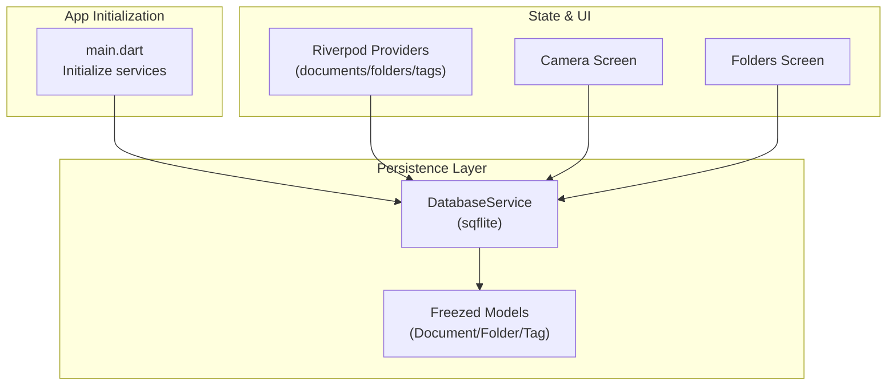
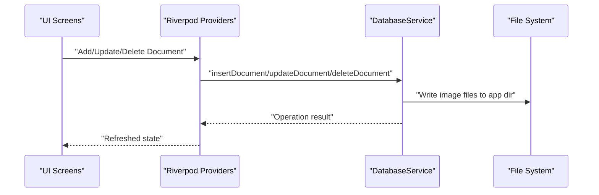
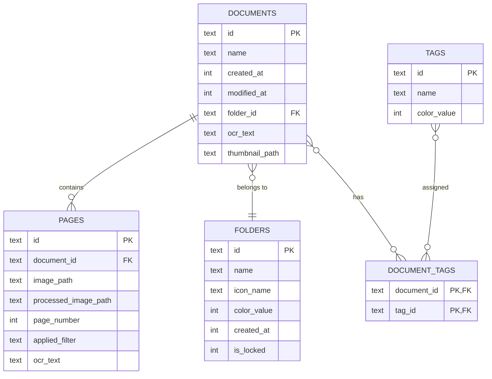
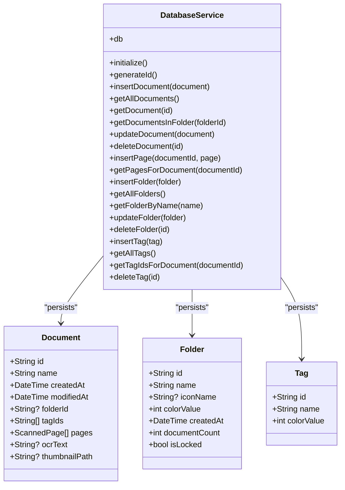
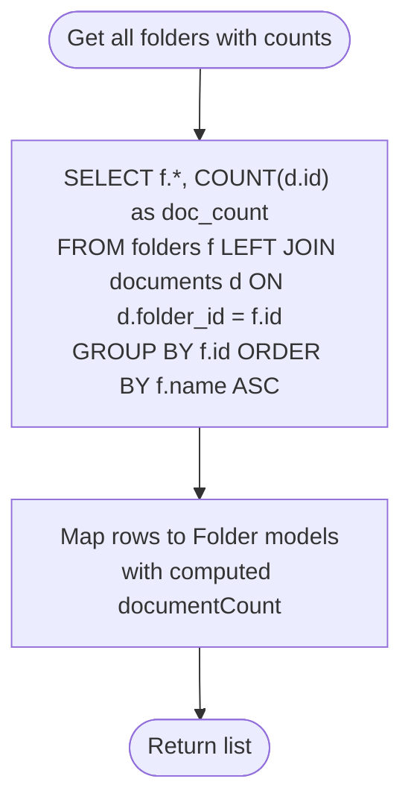
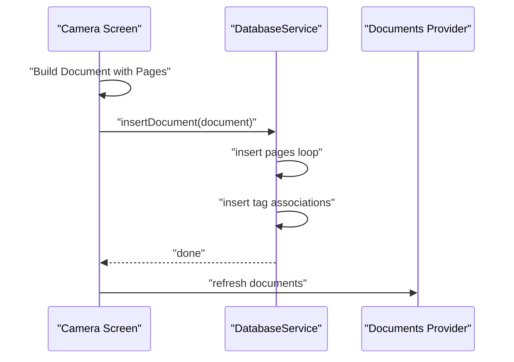
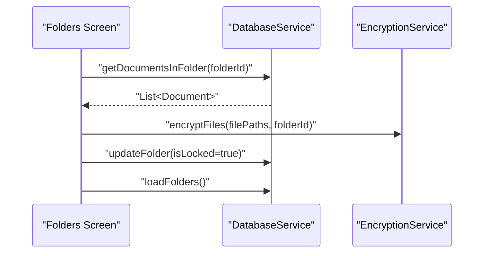
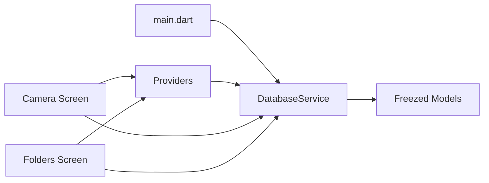

# Data Persistence Architecture

<cite>
**Referenced Files in This Document**
- [main.dart](file://lib/main.dart)
- [database_service.dart](file://lib/services/database_service.dart)
- [document.dart](file://lib/models/document.dart)
- [document.freezed.dart](file://lib/models/document.freezed.dart)
- [folder.dart](file://lib/models/folder.dart)
- [folder.freezed.dart](file://lib/models/folder.freezed.dart)
- [tag.dart](file://lib/models/tag.dart)
- [tag.freezed.dart](file://lib/models/tag.freezed.dart)
- [document_provider.dart](file://lib/providers/document_provider.dart)
- [camera_screen.dart](file://lib/screens/camera/camera_screen.dart)
- [folders_screen.dart](file://lib/screens/folders/folders_screen.dart)
</cite>

## Table of Contents
1. [Introduction](#introduction)
2. [Project Structure](#project-structure)
3. [Core Components](#core-components)
4. [Architecture Overview](#architecture-overview)
5. [Detailed Component Analysis](#detailed-component-analysis)
6. [Dependency Analysis](#dependency-analysis)
7. [Performance Considerations](#performance-considerations)
8. [Troubleshooting Guide](#troubleshooting-guide)
9. [Conclusion](#conclusion)

## Introduction
This document explains ScanVault’s data persistence architecture built on SQLite via sqflite. It covers the database schema, entity relationships, repository-style service layer, CRUD operations, migrations, transactions, and the integration between Freezed immutable models and database entities. It also outlines complex queries, synchronization considerations, performance optimizations, data integrity safeguards, backup strategies, and offline-first design for mobile document management.

## Project Structure
ScanVault organizes persistence-related code into a small set of focused modules:
- A singleton service that initializes and manages the SQLite database
- Freezed model classes that define domain entities and serialization
- Riverpod providers that expose state and orchestrate reads/writes
- Screens that trigger persistence operations and coordinate with services

**Diagram sources**
- [main.dart](file://lib/main.dart#L10-L31)
- [database_service.dart](file://lib/services/database_service.dart#L11-L28)
- [document.dart](file://lib/models/document.dart#L16-L32)
- [folder.dart](file://lib/models/folder.dart#L7-L17)
- [tag.dart](file://lib/models/tag.dart#L6-L13)
- [document_provider.dart](file://lib/providers/document_provider.dart#L9-L54)
- [camera_screen.dart](file://lib/screens/camera/camera_screen.dart#L100-L216)
- [folders_screen.dart](file://lib/screens/folders/folders_screen.dart#L540-L620)

**Section sources**
- [main.dart](file://lib/main.dart#L10-L31)
- [database_service.dart](file://lib/services/database_service.dart#L11-L28)

## Core Components
- DatabaseService: Singleton that opens the SQLite database, creates tables, runs migrations, and exposes typed CRUD operations for documents, pages, folders, and tags.
- Freezed Models: Immutable data classes for Document, Folder, Tag, and ScannedPage with automatic serialization/deserialization support.
- Riverpod Providers: State containers that fetch data from DatabaseService and surface it to UI layers.
- Screens: Trigger persistence operations and coordinate with services for tasks like OCR, encryption, and folder locking.

Key responsibilities:
- Schema creation and upgrades
- CRUD for documents, pages, folders, tags
- Junction table management for document-tag relations
- Index-backed queries for performance
- Integration with Freezed models for seamless persistence

**Section sources**
- [database_service.dart](file://lib/services/database_service.dart#L11-L116)
- [document.dart](file://lib/models/document.dart#L16-L48)
- [folder.dart](file://lib/models/folder.dart#L7-L17)
- [tag.dart](file://lib/models/tag.dart#L6-L13)
- [document_provider.dart](file://lib/providers/document_provider.dart#L9-L54)

## Architecture Overview
The persistence architecture follows a repository-like pattern encapsulated by DatabaseService. UI components and providers call into this service for all database operations. Freezed models are used for both in-memory representation and JSON serialization, enabling easy conversion between domain objects and database rows.

**Diagram sources**
- [document_provider.dart](file://lib/providers/document_provider.dart#L30-L46)
- [database_service.dart](file://lib/services/database_service.dart#L120-L144)
- [camera_screen.dart](file://lib/screens/camera/camera_screen.dart#L136-L183)

## Detailed Component Analysis

### Database Schema and Entity Relationships
The schema supports:
- Documents: top-level container with metadata, timestamps, optional folder foreign key, OCR text, and thumbnail path
- Pages: per-document pages with image paths, processed image path, page number, applied filter, and OCR text
- Folders: organizational units with metadata and a lock flag
- Tags: categorization items
- Document-Tag junction: many-to-many relationship

**Diagram sources**
- [database_service.dart](file://lib/services/database_service.dart#L33-L90)

**Section sources**
- [database_service.dart](file://lib/services/database_service.dart#L33-L97)
- [database_service.dart](file://lib/services/database_service.dart#L99-L105)

### Repository Pattern Implementation
DatabaseService acts as a repository:
- Initialization and lifecycle management
- Typed CRUD methods for each entity
- Composite operations (e.g., inserting a document inserts pages and tag associations)
- Queries with indexes for performance
- Migration handling

**Diagram sources**
- [database_service.dart](file://lib/services/database_service.dart#L11-L412)
- [document.dart](file://lib/models/document.dart#L16-L32)
- [folder.dart](file://lib/models/folder.dart#L7-L17)
- [tag.dart](file://lib/models/tag.dart#L6-L13)

**Section sources**
- [database_service.dart](file://lib/services/database_service.dart#L115-L144)
- [database_service.dart](file://lib/services/database_service.dart#L146-L247)
- [database_service.dart](file://lib/services/database_service.dart#L251-L287)
- [database_service.dart](file://lib/services/database_service.dart#L291-L372)
- [database_service.dart](file://lib/services/database_service.dart#L376-L411)

### Freezed Models and Database Entities
Freezed models provide immutability and JSON serialization:
- Document, Folder, Tag, and ScannedPage are annotated with @freezed and include generated serialization code
- DatabaseService maps database rows to these models and vice versa
- Enum values (e.g., FilterType) are stored as names and reconstructed during reads

Integration highlights:
- ScannedPage.appliedFilter is persisted as a string and restored via FilterType.values.byName
- Timestamps are stored as milliseconds and reconstructed into DateTime
- Many-to-many relationships are handled via separate queries for tag IDs

**Section sources**
- [document.dart](file://lib/models/document.dart#L16-L48)
- [document.freezed.dart](file://lib/models/document.freezed.dart#L221-L324)
- [document.freezed.dart](file://lib/models/document.freezed.dart#L535-L609)
- [folder.dart](file://lib/models/folder.dart#L7-L17)
- [folder.freezed.dart](file://lib/models/folder.freezed.dart#L193-L275)
- [tag.dart](file://lib/models/tag.dart#L6-L13)
- [tag.freezed.dart](file://lib/models/tag.freezed.dart#L127-L178)
- [database_service.dart](file://lib/services/database_service.dart#L264-L287)
- [database_service.dart](file://lib/services/database_service.dart#L397-L406)

### Data Access Patterns and Transactions
Current patterns:
- Single-operation writes (insert/update/delete) are executed as individual statements
- Composite writes (insertDocument) perform multiple inserts sequentially
- No explicit BEGIN/COMMIT blocks are used in the service

Recommendations for transactions:
- Wrap composite operations (e.g., insertDocument) in a transaction to ensure atomicity
- Use batched writes for bulk imports to reduce overhead

**Section sources**
- [database_service.dart](file://lib/services/database_service.dart#L120-L144)

### Complex Queries and Indexes
- Folder listing with document counts uses a grouped JOIN and aggregation
- Indexes on foreign keys and frequently queried columns improve performance
- Case-insensitive folder lookup uses LOWER(name)

**Diagram sources**
- [database_service.dart](file://lib/services/database_service.dart#L304-L325)

**Section sources**
- [database_service.dart](file://lib/services/database_service.dart#L304-L325)
- [database_service.dart](file://lib/services/database_service.dart#L327-L351)
- [database_service.dart](file://lib/services/database_service.dart#L92-L97)

### Data Synchronization Strategies
Offline-first approach:
- All user actions (capture, edit, organize) are persisted locally first
- UI updates are immediate via Riverpod state
- Remote synchronization is out of scope in the current codebase

Recommended sync patterns:
- Track local-only changes with a pending flag
- Batch uploads with conflict resolution (e.g., last-writer-wins or merge)
- Use a queue to retry transient failures

[No sources needed since this section provides general guidance]

### Integration Examples

#### Saving a Document with Pages and Tags

**Diagram sources**
- [camera_screen.dart](file://lib/screens/camera/camera_screen.dart#L136-L183)
- [database_service.dart](file://lib/services/database_service.dart#L120-L144)
- [document_provider.dart](file://lib/providers/document_provider.dart#L30-L34)

**Section sources**
- [camera_screen.dart](file://lib/screens/camera/camera_screen.dart#L136-L183)
- [database_service.dart](file://lib/services/database_service.dart#L120-L144)
- [document_provider.dart](file://lib/providers/document_provider.dart#L30-L34)

#### Folder Locking/Unlocking with Encryption

**Diagram sources**
- [folders_screen.dart](file://lib/screens/folders/folders_screen.dart#L590-L620)
- [database_service.dart](file://lib/services/database_service.dart#L196-L226)

**Section sources**
- [folders_screen.dart](file://lib/screens/folders/folders_screen.dart#L590-L620)
- [database_service.dart](file://lib/services/database_service.dart#L196-L226)

## Dependency Analysis
- main.dart initializes DatabaseService and StorageService at startup
- Providers depend on DatabaseService for all data operations
- Screens depend on providers and DatabaseService for specific queries
- Freezed models are consumed by DatabaseService and returned to UI

**Diagram sources**
- [main.dart](file://lib/main.dart#L10-L31)
- [document_provider.dart](file://lib/providers/document_provider.dart#L9-L54)
- [camera_screen.dart](file://lib/screens/camera/camera_screen.dart#L100-L216)
- [folders_screen.dart](file://lib/screens/folders/folders_screen.dart#L540-L620)

**Section sources**
- [main.dart](file://lib/main.dart#L10-L31)
- [document_provider.dart](file://lib/providers/document_provider.dart#L9-L54)

## Performance Considerations
- Indexes: Foreign-key indexes on documents(folder_id) and pages(document_id) improve join and filtering performance
- Queries: Prefer indexed columns in WHERE clauses and ORDER BY
- Batch operations: Use transactions for composite writes to reduce WAL overhead
- Memory: Avoid loading entire document graphs when not needed; load lazily or paginate
- I/O: Minimize repeated filesystem copies; reuse processed images when possible

**Section sources**
- [database_service.dart](file://lib/services/database_service.dart#L92-L97)
- [database_service.dart](file://lib/services/database_service.dart#L120-L144)

## Troubleshooting Guide
Common issues and mitigations:
- Database not initialized: Ensure DatabaseService.initialize() is called before any operation
- Missing data after navigation: Providers refresh state after write operations; verify provider reloads
- Incorrect enum mapping: Applied filter values are stored as names; ensure enum values match names
- Large document loads: Consider pagination or lazy loading of pages

**Section sources**
- [database_service.dart](file://lib/services/database_service.dart#L107-L113)
- [document_provider.dart](file://lib/providers/document_provider.dart#L19-L28)
- [database_service.dart](file://lib/services/database_service.dart#L280-L283)

## Conclusion
ScanVault’s persistence layer cleanly separates concerns through a repository-style DatabaseService, Freezed models, and Riverpod state management. The schema supports core document management with robust relationships and indexes. While the current implementation focuses on local operations, the architecture is ready to adopt transactions, batch operations, and synchronization strategies to support advanced offline-first workflows and remote sync.