# Service Layer Architecture

<cite>
**Referenced Files in This Document**
- [main.dart](file://lib/main.dart)
- [app.dart](file://lib/app.dart)
- [database_service.dart](file://lib/services/database_service.dart)
- [ocr_service.dart](file://lib/services/ocr_service.dart)
- [translation_service.dart](file://lib/services/translation_service.dart)
- [storage_service.dart](file://lib/services/storage_service.dart)
- [encryption_service.dart](file://lib/services/encryption_service.dart)
- [camera_service.dart](file://lib/services/camera_service.dart)
- [auth_service.dart](file://lib/services/auth_service.dart)
- [pdf_service.dart](file://lib/services/pdf_service.dart)
- [docx_service.dart](file://lib/services/docx_service.dart)
- [document_provider.dart](file://lib/providers/document_provider.dart)
- [theme_provider.dart](file://lib/providers/theme_provider.dart)
- [locale_provider.dart](file://lib/providers/locale_provider.dart)
</cite>

## Table of Contents
1. [Introduction](#introduction)
2. [Project Structure](#project-structure)
3. [Core Components](#core-components)
4. [Architecture Overview](#architecture-overview)
5. [Detailed Component Analysis](#detailed-component-analysis)
6. [Dependency Analysis](#dependency-analysis)
7. [Performance Considerations](#performance-considerations)
8. [Troubleshooting Guide](#troubleshooting-guide)
9. [Conclusion](#conclusion)
10. [Appendices](#appendices)

## Introduction
This document explains ScanVault’s service layer architecture and dependency injection patterns. It focuses on how services encapsulate business logic, abstract platform-specific implementations, and interact with the UI via Riverpod providers. It also covers the service factory pattern, DI strategies, lifecycle management, separation between core business services (database, OCR, translation) and utility services (storage, encryption), and testing strategies with mocks for unit tests.

## Project Structure
ScanVault organizes its service layer under lib/services and integrates with Riverpod providers under lib/providers. The application initializes core services early in the app lifecycle and exposes them to the UI through scoped providers.

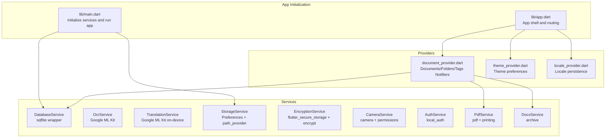

**Diagram sources**
- [main.dart](file://lib/main.dart#L10-L31)
- [app.dart](file://lib/app.dart#L23-L61)
- [database_service.dart](file://lib/services/database_service.dart#L11-L28)
- [storage_service.dart](file://lib/services/storage_service.dart#L18-L21)
- [document_provider.dart](file://lib/providers/document_provider.dart#L9-L12)
- [theme_provider.dart](file://lib/providers/theme_provider.dart#L5-L7)
- [locale_provider.dart](file://lib/providers/locale_provider.dart#L5-L7)

**Section sources**
- [main.dart](file://lib/main.dart#L10-L31)
- [app.dart](file://lib/app.dart#L23-L61)

## Core Components
This section outlines the primary service categories and their responsibilities.

- Core business services
  - DatabaseService: Local relational storage for documents, pages, folders, tags; handles initialization, migrations, and CRUD operations.
  - OcrService: Text recognition using Google ML Kit; supports single/multi-image extraction and structured block results.
  - TranslationService: On-device translation using Google ML Kit; manages language models and translation sessions.
- Utility services
  - StorageService: Manages custom storage paths and default directories using SharedPreferences and path_provider.
  - EncryptionService: Per-folder encryption/decryption using AES with secure random keys stored via flutter_secure_storage.
- Platform integration services
  - CameraService: Camera controller lifecycle, permissions, capture, flash, zoom, focus.
  - AuthService: Biometric/PIN authentication via local_auth.

These services isolate platform specifics behind stable interfaces, enabling UI independence and testability.

**Section sources**
- [database_service.dart](file://lib/services/database_service.dart#L11-L28)
- [ocr_service.dart](file://lib/services/ocr_service.dart#L6-L18)
- [translation_service.dart](file://lib/services/translation_service.dart#L7-L90)
- [storage_service.dart](file://lib/services/storage_service.dart#L12-L21)
- [encryption_service.dart](file://lib/services/encryption_service.dart#L8-L36)
- [camera_service.dart](file://lib/services/camera_service.dart#L10-L71)
- [auth_service.dart](file://lib/services/auth_service.dart#L5-L52)

## Architecture Overview
ScanVault follows a layered architecture:
- UI (Screens) consumes Riverpod providers for state.
- Providers orchestrate service calls and manage async state.
- Services encapsulate business logic and platform integrations.
- Persistence and external libraries are abstracted behind service boundaries.

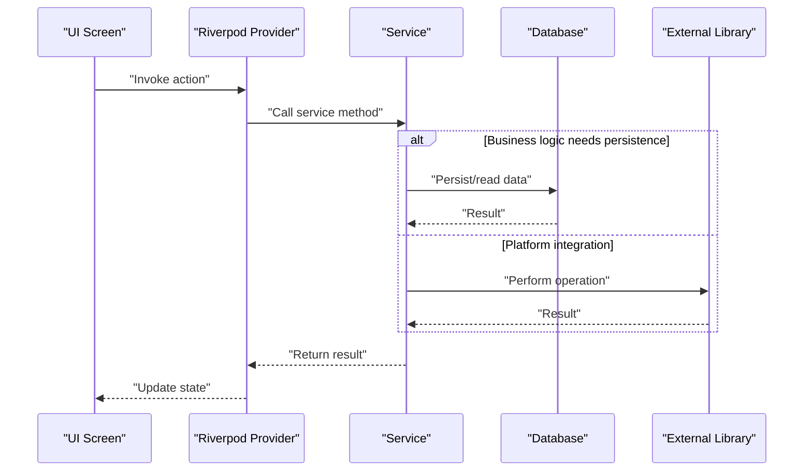

[No sources needed since this diagram shows conceptual workflow, not actual code structure]

## Detailed Component Analysis

### DatabaseService
Responsibilities:
- Initialize local database, create tables, and handle migrations.
- Provide CRUD operations for documents, pages, folders, and tags.
- Manage relationships and indexes.

Key behaviors:
- Singleton-like initialization and access via a getter.
- Uses sqflite with explicit migrations and indexes.
- Converts between domain models and database rows.

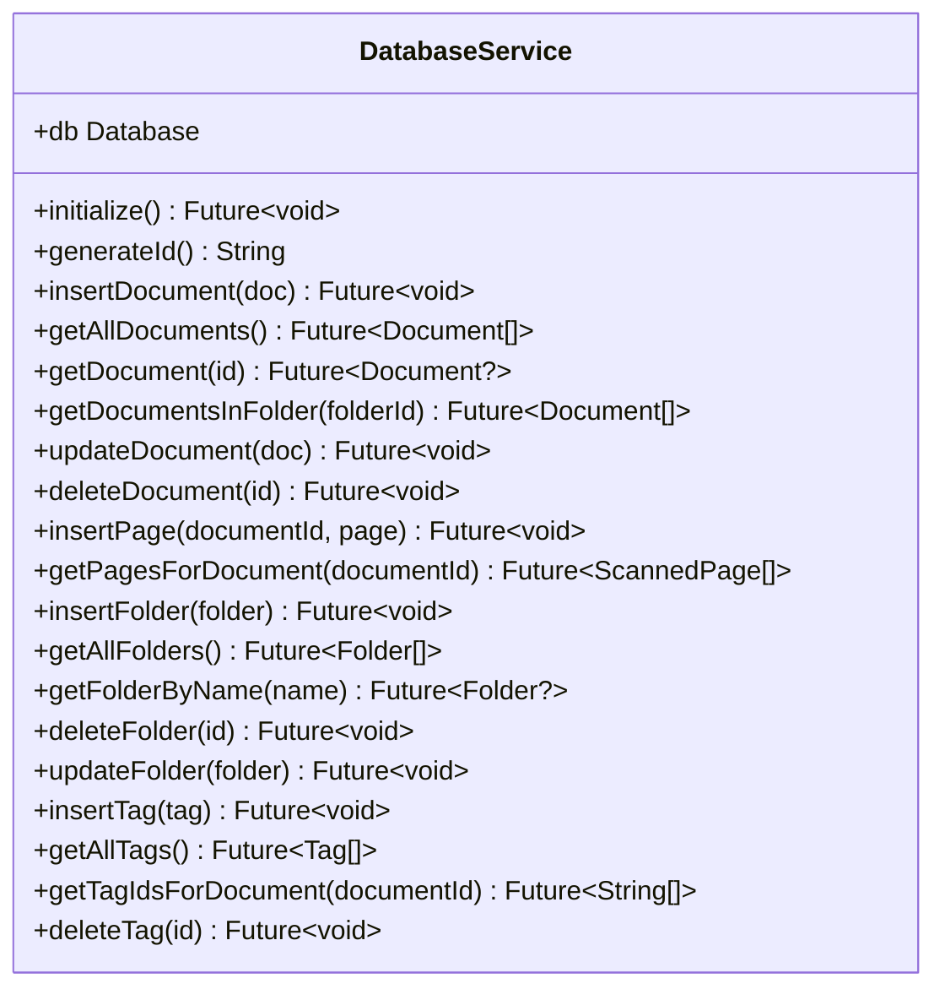

**Diagram sources**
- [database_service.dart](file://lib/services/database_service.dart#L11-L412)

**Section sources**
- [database_service.dart](file://lib/services/database_service.dart#L11-L28)
- [database_service.dart](file://lib/services/database_service.dart#L108-L113)
- [database_service.dart](file://lib/services/database_service.dart#L120-L144)
- [database_service.dart](file://lib/services/database_service.dart#L264-L287)
- [database_service.dart](file://lib/services/database_service.dart#L291-L372)
- [database_service.dart](file://lib/services/database_service.dart#L376-L411)

### OcrService
Responsibilities:
- Extract text from single or multiple images.
- Provide structured results with blocks and lines.
- Manage resource lifecycle for the underlying text recognizer.

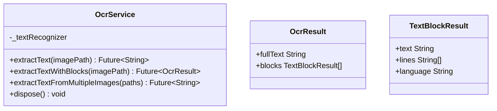

**Diagram sources**
- [ocr_service.dart](file://lib/services/ocr_service.dart#L6-L68)
- [ocr_service.dart](file://lib/services/ocr_service.dart#L71-L92)

**Section sources**
- [ocr_service.dart](file://lib/services/ocr_service.dart#L6-L18)
- [ocr_service.dart](file://lib/services/ocr_service.dart#L20-L48)
- [ocr_service.dart](file://lib/services/ocr_service.dart#L50-L62)
- [ocr_service.dart](file://lib/services/ocr_service.dart#L64-L68)

### TranslationService
Responsibilities:
- Manage on-device translation models and sessions.
- Provide language lists and model lifecycle.
- Translate text between languages with automatic model downloads.

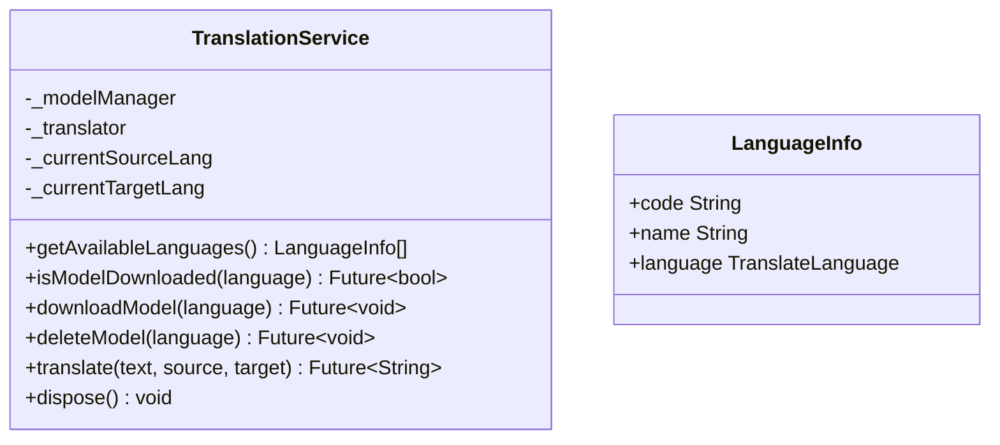

**Diagram sources**
- [translation_service.dart](file://lib/services/translation_service.dart#L7-L90)
- [translation_service.dart](file://lib/services/translation_service.dart#L158-L169)

**Section sources**
- [translation_service.dart](file://lib/services/translation_service.dart#L15-L25)
- [translation_service.dart](file://lib/services/translation_service.dart#L27-L48)
- [translation_service.dart](file://lib/services/translation_service.dart#L50-L84)
- [translation_service.dart](file://lib/services/translation_service.dart#L86-L90)

### StorageService
Responsibilities:
- Persist and resolve custom storage paths.
- Provide default application directory fallback.
- Offer helpers to compute file paths.

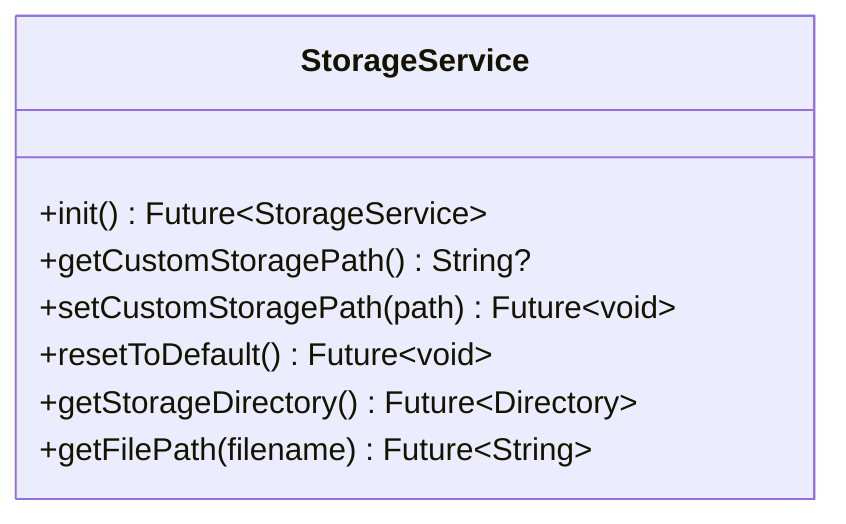

**Diagram sources**
- [storage_service.dart](file://lib/services/storage_service.dart#L12-L62)

**Section sources**
- [storage_service.dart](file://lib/services/storage_service.dart#L18-L21)
- [storage_service.dart](file://lib/services/storage_service.dart#L23-L37)
- [storage_service.dart](file://lib/services/storage_service.dart#L39-L61)

### EncryptionService
Responsibilities:
- Generate per-folder encryption keys and store securely.
- Encrypt/decrypt files with AES and prepend IV.
- Detect encrypted files heuristically.

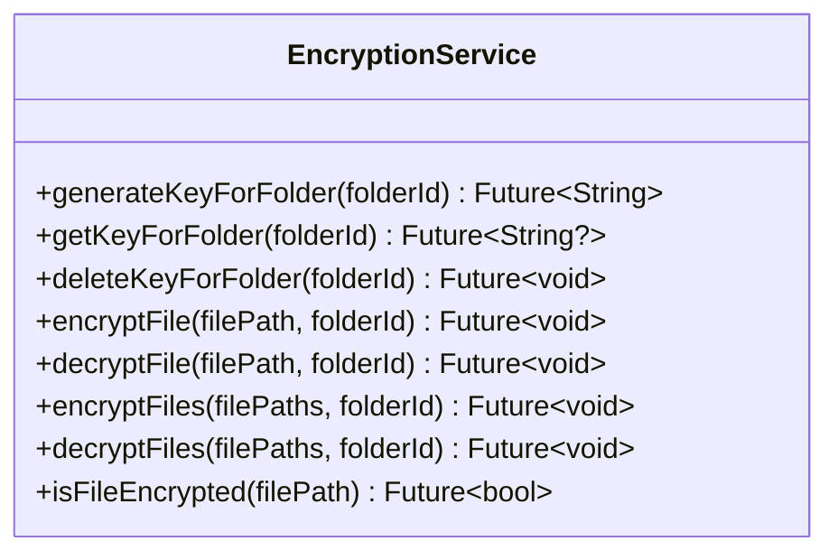

**Diagram sources**
- [encryption_service.dart](file://lib/services/encryption_service.dart#L8-L36)
- [encryption_service.dart](file://lib/services/encryption_service.dart#L38-L134)
- [encryption_service.dart](file://lib/services/encryption_service.dart#L136-L149)

**Section sources**
- [encryption_service.dart](file://lib/services/encryption_service.dart#L15-L36)
- [encryption_service.dart](file://lib/services/encryption_service.dart#L38-L134)
- [encryption_service.dart](file://lib/services/encryption_service.dart#L136-L149)

### CameraService
Responsibilities:
- Manage camera lifecycle, permissions, and capture.
- Control flash, zoom, and focus programmatically.
- Provide safe initialization and disposal.

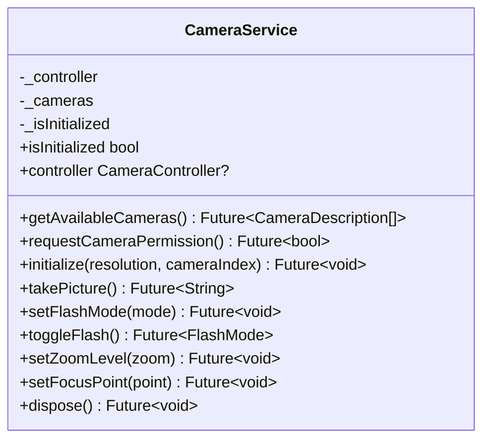

**Diagram sources**
- [camera_service.dart](file://lib/services/camera_service.dart#L10-L139)

**Section sources**
- [camera_service.dart](file://lib/services/camera_service.dart#L15-L71)
- [camera_service.dart](file://lib/services/camera_service.dart#L73-L85)
- [camera_service.dart](file://lib/services/camera_service.dart#L87-L139)

### AuthService
Responsibilities:
- Check biometric availability and capabilities.
- Authenticate users with flexible options.
- Safely stop ongoing authentication.

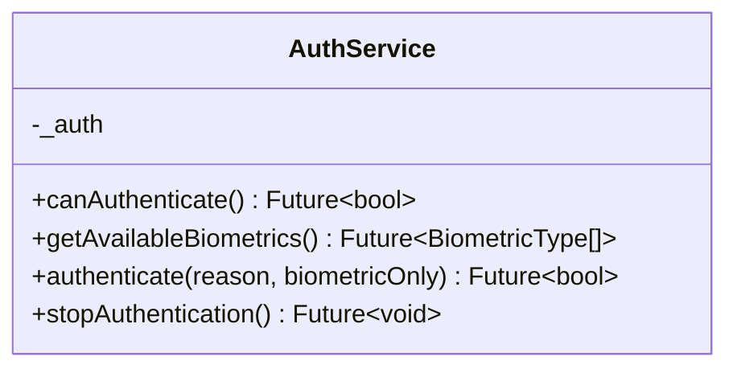

**Diagram sources**
- [auth_service.dart](file://lib/services/auth_service.dart#L5-L62)

**Section sources**
- [auth_service.dart](file://lib/services/auth_service.dart#L8-L24)
- [auth_service.dart](file://lib/services/auth_service.dart#L26-L52)
- [auth_service.dart](file://lib/services/auth_service.dart#L54-L61)

### Export Services (PDF and DOCX)
Responsibilities:
- Generate PDFs and DOCX files from scanned pages.
- Optionally embed OCR text and maintain page order.
- Support sharing and printing for PDFs.

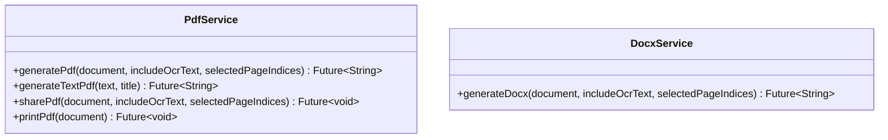

**Diagram sources**
- [pdf_service.dart](file://lib/services/pdf_service.dart#L12-L96)
- [docx_service.dart](file://lib/services/docx_service.dart#L10-L134)

**Section sources**
- [pdf_service.dart](file://lib/services/pdf_service.dart#L15-L96)
- [docx_service.dart](file://lib/services/docx_service.dart#L14-L134)

### Service Factory Pattern and Lifecycle Management
- Factory-style services: Each service is a cohesive unit with static methods or private constructors, acting as factories for platform resources (recognizers, translators, controllers).
- Lifecycle management:
  - OCR and translation services manage long-lived resources and expose a dispose method.
  - CameraService manages a CameraController lifecycle with initialize/dispose.
  - StorageService is initialized once and reused via Riverpod provider.
  - DatabaseService is initialized once and accessed via a singleton-like getter.

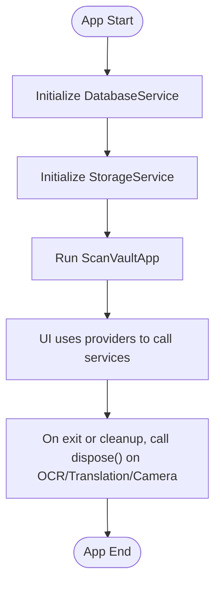

**Diagram sources**
- [main.dart](file://lib/main.dart#L20-L21)
- [ocr_service.dart](file://lib/services/ocr_service.dart#L64-L67)
- [translation_service.dart](file://lib/services/translation_service.dart#L86-L90)
- [camera_service.dart](file://lib/services/camera_service.dart#L131-L138)

**Section sources**
- [ocr_service.dart](file://lib/services/ocr_service.dart#L64-L68)
- [translation_service.dart](file://lib/services/translation_service.dart#L86-L90)
- [camera_service.dart](file://lib/services/camera_service.dart#L131-L139)

### Dependency Injection Strategies and Provider Integration
- Early initialization: DatabaseService and StorageService are initialized in main and exposed via Riverpod ProviderScope overrides.
- Provider-driven consumption: UI screens depend on Riverpod providers that call services internally.
- Example providers:
  - Documents/Folders/Tags notifiers call DatabaseService for persistence.
  - Theme and locale providers manage UI preferences independently.

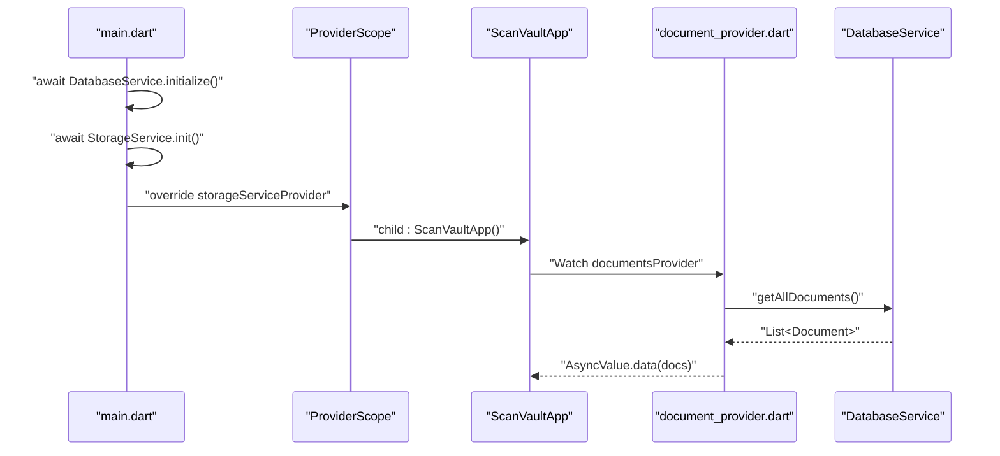

**Diagram sources**
- [main.dart](file://lib/main.dart#L20-L29)
- [document_provider.dart](file://lib/providers/document_provider.dart#L19-L28)
- [database_service.dart](file://lib/services/database_service.dart#L146-L171)

**Section sources**
- [main.dart](file://lib/main.dart#L20-L29)
- [document_provider.dart](file://lib/providers/document_provider.dart#L9-L12)
- [document_provider.dart](file://lib/providers/document_provider.dart#L19-L28)

### Service Interactions with UI Layer
- Screens trigger actions via Riverpod providers.
- Providers call services (e.g., DatabaseService for persistence, PdfService/DocxService for exports).
- UI reacts to AsyncValue updates from providers.

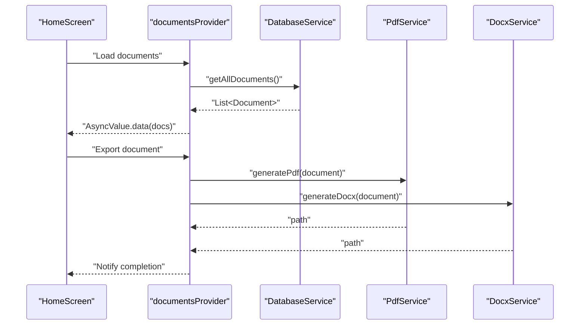

**Diagram sources**
- [document_provider.dart](file://lib/providers/document_provider.dart#L19-L28)
- [pdf_service.dart](file://lib/services/pdf_service.dart#L15-L96)
- [docx_service.dart](file://lib/services/docx_service.dart#L14-L134)

**Section sources**
- [document_provider.dart](file://lib/providers/document_provider.dart#L19-L28)
- [pdf_service.dart](file://lib/services/pdf_service.dart#L15-L96)
- [docx_service.dart](file://lib/services/docx_service.dart#L14-L134)

### Testing Strategies and Mock Implementations
Recommended patterns for unit testing:
- Isolate service behavior behind interfaces or abstract classes where possible.
- Replace external dependencies with mocks:
  - OcrService: Mock Google ML Kit calls to return controlled text or errors.
  - TranslationService: Mock model manager and translator to simulate downloads and translations.
  - CameraService: Mock CameraController to simulate capture and errors.
  - StorageService: Inject a mock SharedPreferences instance for path retrieval.
  - EncryptionService: Mock flutter_secure_storage and file operations to validate key handling and file IO.
- Use Riverpod’s ProviderScope to override service providers with test doubles during tests.

[No sources needed since this section provides general guidance]

## Dependency Analysis
This section maps service-to-service and provider-to-service dependencies.

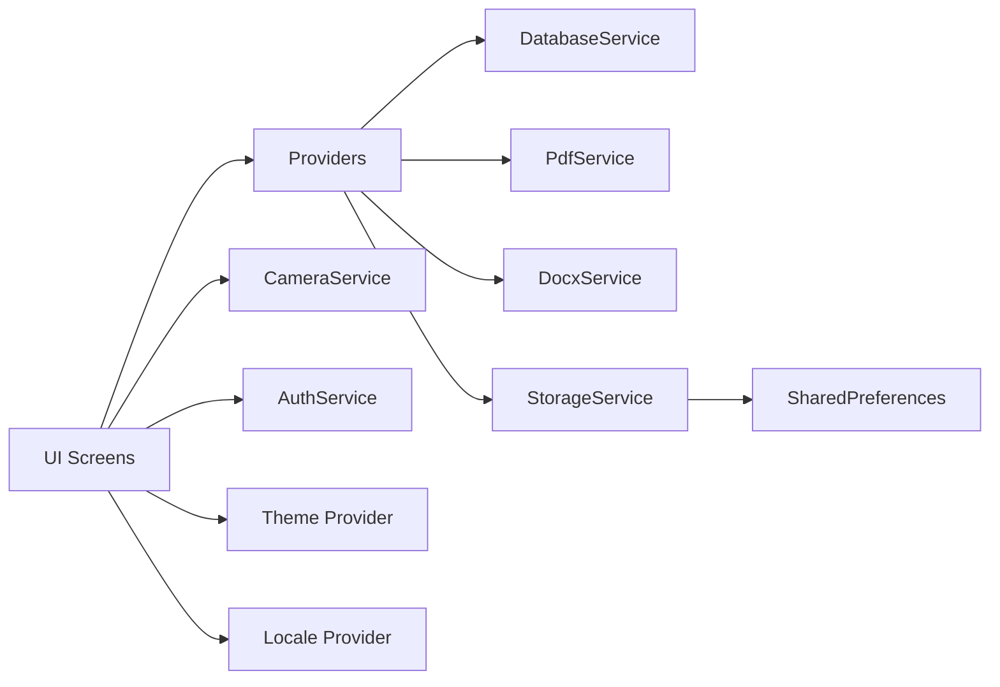

**Diagram sources**
- [document_provider.dart](file://lib/providers/document_provider.dart#L9-L12)
- [pdf_service.dart](file://lib/services/pdf_service.dart#L12-L96)
- [docx_service.dart](file://lib/services/docx_service.dart#L10-L134)
- [storage_service.dart](file://lib/services/storage_service.dart#L12-L21)
- [theme_provider.dart](file://lib/providers/theme_provider.dart#L5-L7)
- [locale_provider.dart](file://lib/providers/locale_provider.dart#L5-L7)

**Section sources**
- [document_provider.dart](file://lib/providers/document_provider.dart#L9-L12)
- [pdf_service.dart](file://lib/services/pdf_service.dart#L12-L96)
- [docx_service.dart](file://lib/services/docx_service.dart#L10-L134)
- [storage_service.dart](file://lib/services/storage_service.dart#L12-L21)
- [theme_provider.dart](file://lib/providers/theme_provider.dart#L5-L7)
- [locale_provider.dart](file://lib/providers/locale_provider.dart#L5-L7)

## Performance Considerations
- DatabaseService
  - Indexes on foreign keys improve query performance for documents and pages.
  - Batch operations (e.g., inserting pages) are performed in loops; consider batching writes for large datasets.
- OcrService and TranslationService
  - Reuse recognizers/translators across calls; dispose only when no longer needed.
  - Model downloads can be expensive; pre-download models when appropriate.
- CameraService
  - Avoid frequent controller recreation; reuse when possible.
  - Clamp zoom and limit focus operations to reduce overhead.
- StorageService and EncryptionService
  - Ensure directories exist before writing; create recursively only when necessary.
  - Encryption/decryption involves IO and crypto; process files in batches and avoid unnecessary re-encryptions.

[No sources needed since this section provides general guidance]

## Troubleshooting Guide
Common issues and resolutions:
- Database not initialized
  - Symptom: Accessing db getter before initialize throws an error.
  - Fix: Ensure DatabaseService.initialize is called during app startup.
- OCR/Translation failures
  - Symptom: Exceptions thrown when processing images or translating text.
  - Fix: Wrap calls with try-catch and surface user-friendly errors; verify external library readiness.
- Camera initialization errors
  - Symptom: Permission denied or no cameras available.
  - Fix: Check permissions and handle exceptions gracefully; retry initialization after granting permissions.
- Encryption errors
  - Symptom: Missing keys or corrupted encrypted files.
  - Fix: Validate key existence and file presence; handle exceptions and rethrow with context.

**Section sources**
- [database_service.dart](file://lib/services/database_service.dart#L108-L113)
- [ocr_service.dart](file://lib/services/ocr_service.dart#L15-L18)
- [translation_service.dart](file://lib/services/translation_service.dart#L81-L84)
- [camera_service.dart](file://lib/services/camera_service.dart#L40-L48)
- [encryption_service.dart](file://lib/services/encryption_service.dart#L42-L44)

## Conclusion
ScanVault’s service layer cleanly separates business logic from platform specifics, with Riverpod providers mediating UI interactions. Services are designed as cohesive factories with explicit lifecycles, enabling robust testing and maintainability. The architecture supports extensibility while keeping UI decoupled from persistence and platform integrations.

## Appendices
- Initialization order and provider overrides are defined in the application entry point and app shell.
- Providers encapsulate async state and delegate to services, ensuring predictable UI updates.

**Section sources**
- [main.dart](file://lib/main.dart#L20-L29)
- [app.dart](file://lib/app.dart#L23-L61)