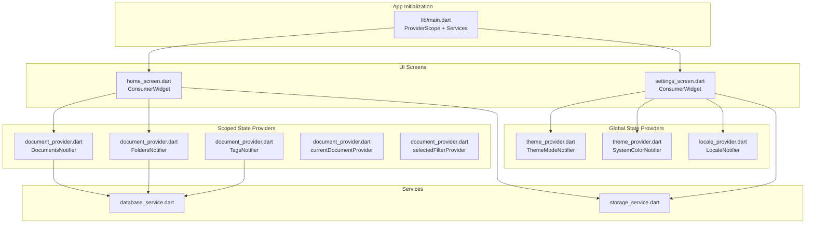
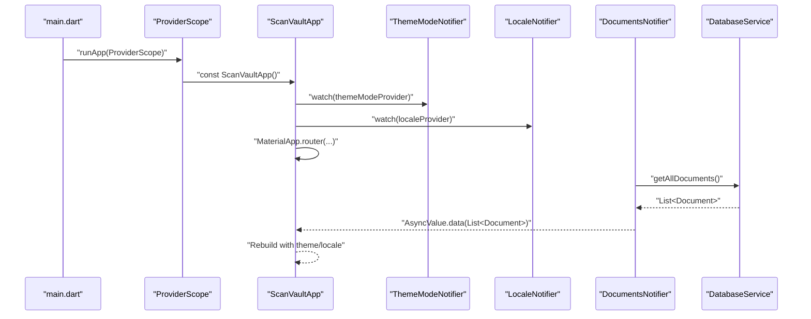
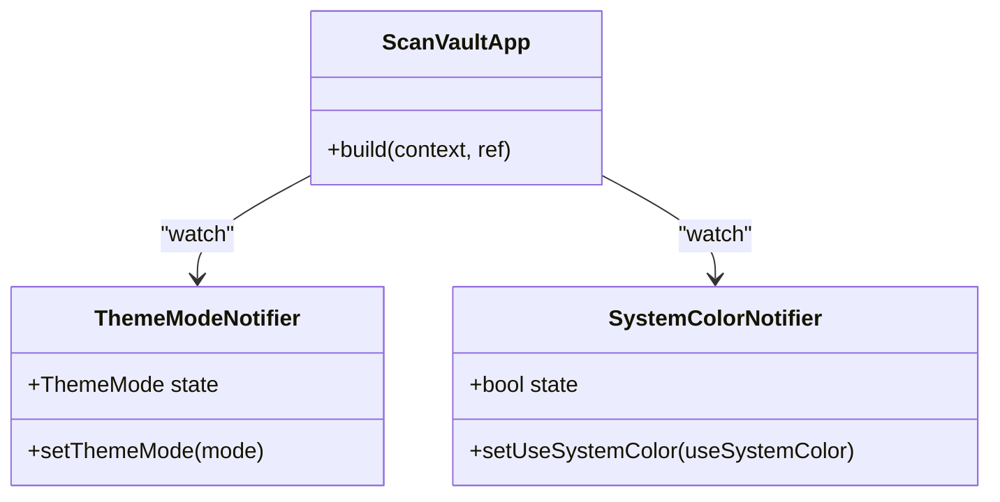
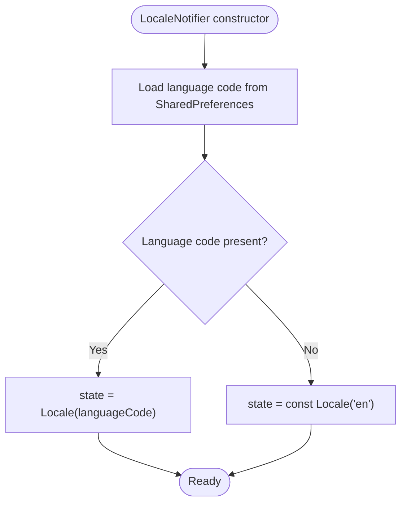
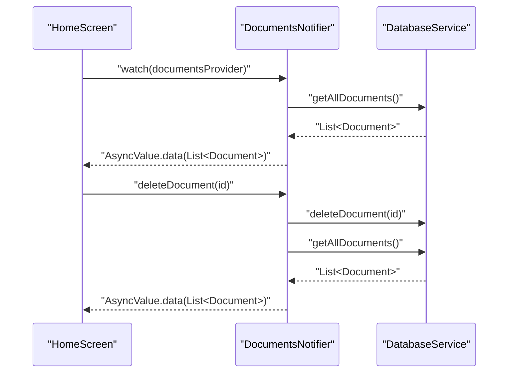
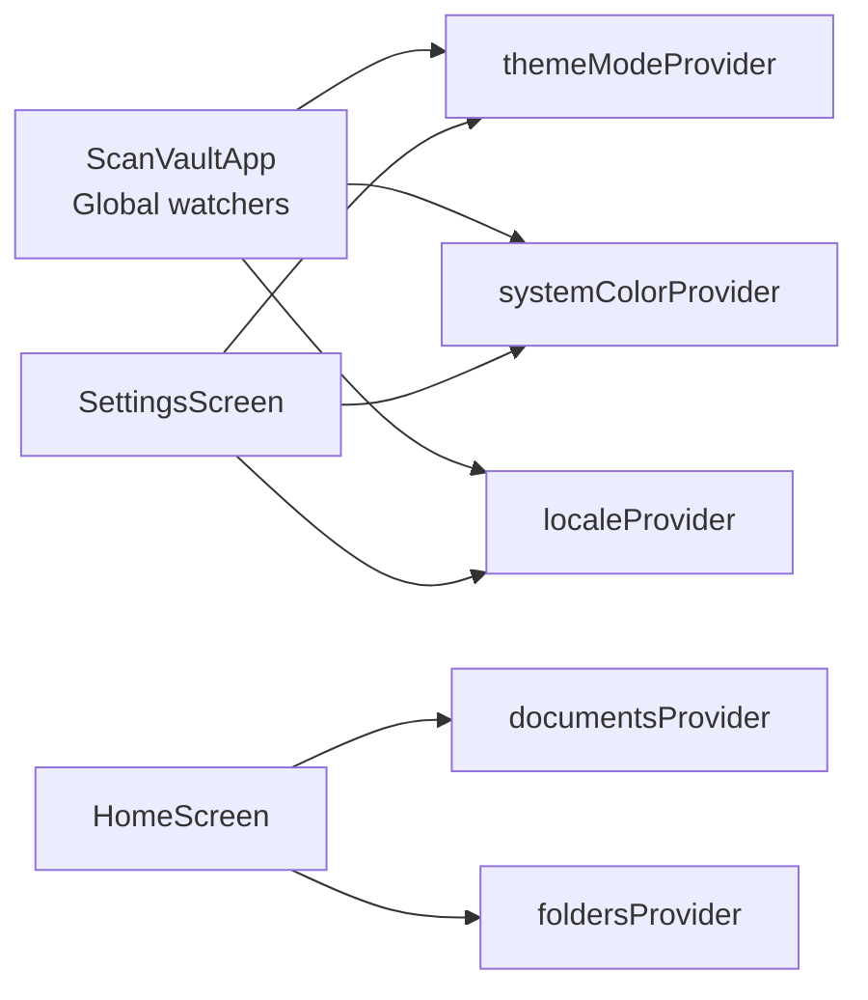
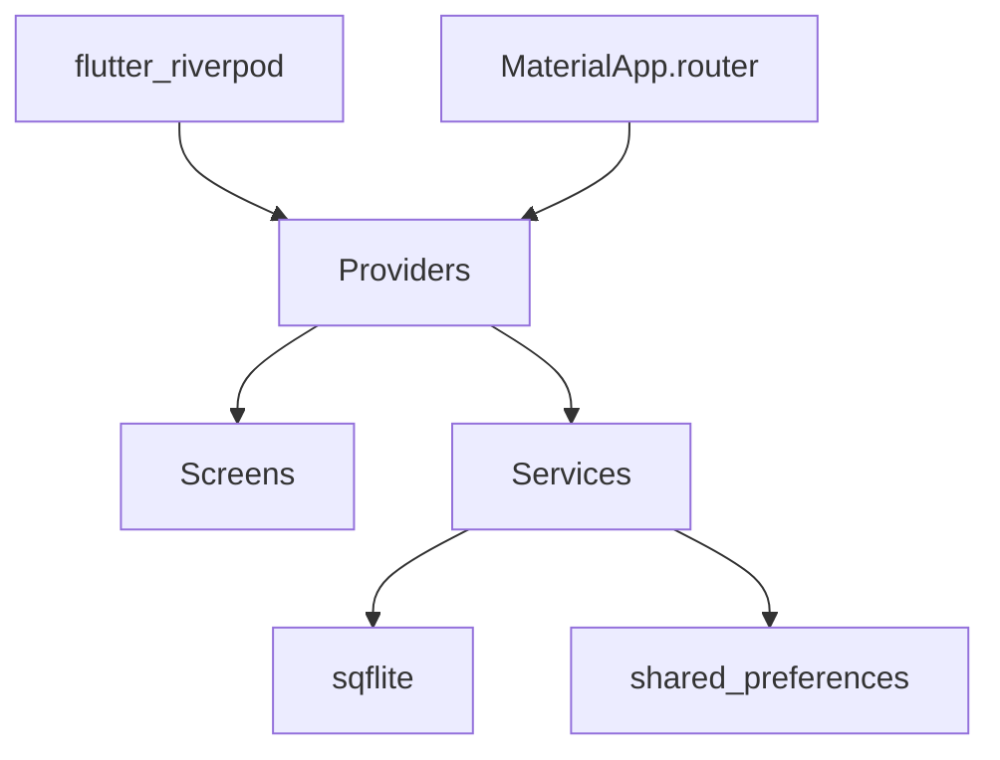

# State Management Architecture

<cite>
**Referenced Files in This Document**
- [main.dart](file://lib/main.dart)
- [app.dart](file://lib/app.dart)
- [theme_provider.dart](file://lib/providers/theme_provider.dart)
- [locale_provider.dart](file://lib/providers/locale_provider.dart)
- [document_provider.dart](file://lib/providers/document_provider.dart)
- [home_screen.dart](file://lib/screens/home/home_screen.dart)
- [settings_screen.dart](file://lib/screens/settings/settings_screen.dart)
- [database_service.dart](file://lib/services/database_service.dart)
- [document.dart](file://lib/models/document.dart)
- [app_theme.dart](file://lib/theme/app_theme.dart)
- [scaffold_with_navbar.dart](file://lib/widgets/scaffold_with_navbar.dart)
- [storage_service.dart](file://lib/services/storage_service.dart)
- [pubspec.yaml](file://pubspec.yaml)
</cite>

## Table of Contents
1. [Introduction](#introduction)
2. [Project Structure](#project-structure)
3. [Core Components](#core-components)
4. [Architecture Overview](#architecture-overview)
5. [Detailed Component Analysis](#detailed-component-analysis)
6. [Dependency Analysis](#dependency-analysis)
7. [Performance Considerations](#performance-considerations)
8. [Troubleshooting Guide](#troubleshooting-guide)
9. [Conclusion](#conclusion)

## Introduction
This document explains ScanVault's Riverpod-based state management architecture. It focuses on how the provider pattern is implemented to manage global state (theme and locale) and scoped state (documents, folders, tags), how reactive updates propagate through the UI, and how the architecture scales across multiple screens and services while maintaining type safety and testability.

## Project Structure
ScanVault organizes state management under the providers directory, with each provider encapsulating a distinct concern:
- Global state: theme mode and system color preferences, plus locale
- Scoped state: documents, folders, tags, and transient UI state (current document, selected filter)

**Diagram sources**
- [main.dart](file://lib/main.dart#L23-L31)
- [theme_provider.dart](file://lib/providers/theme_provider.dart#L5-L28)
- [locale_provider.dart](file://lib/providers/locale_provider.dart#L5-L30)
- [document_provider.dart](file://lib/providers/document_provider.dart#L9-L136)
- [home_screen.dart](file://lib/screens/home/home_screen.dart#L44-L45)
- [settings_screen.dart](file://lib/screens/settings/settings_screen.dart#L18-L19)
- [database_service.dart](file://lib/services/database_service.dart#L11-L413)
- [storage_service.dart](file://lib/services/storage_service.dart#L8-L37)

**Section sources**
- [main.dart](file://lib/main.dart#L23-L31)
- [pubspec.yaml](file://pubspec.yaml#L14-L16)

## Core Components
- Global state providers:
  - Theme mode provider: manages ThemeMode and exposes a setter to change modes
  - System color provider: toggles whether to use dynamic/system color schemes
  - Locale provider: persists and loads the user's language preference
- Scoped state providers:
  - Documents provider: async list of documents with CRUD operations and reload
  - Folders provider: async list of folders with CRUD operations and reload
  - Tags provider: async list of tags with CRUD operations and reload
  - Current document provider: transient UI state for the document currently viewed/edited
  - Selected filter provider: transient UI state for the current filter type

These providers are consumed by ConsumerWidget screens and services, enabling reactive updates across the app.

**Section sources**
- [theme_provider.dart](file://lib/providers/theme_provider.dart#L5-L28)
- [locale_provider.dart](file://lib/providers/locale_provider.dart#L5-L30)
- [document_provider.dart](file://lib/providers/document_provider.dart#L9-L136)

## Architecture Overview
The app initializes Riverpod’s ProviderScope, injects services, and mounts the main app tree. The app builds a MaterialApp.router that watches global providers for theme, locale, and dynamic color schemes. Screens consume scoped providers for documents, folders, and tags, and update state via notifier methods.

**Diagram sources**
- [main.dart](file://lib/main.dart#L23-L31)
- [app.dart](file://lib/app.dart#L27-L61)
- [document_provider.dart](file://lib/providers/document_provider.dart#L19-L28)
- [database_service.dart](file://lib/services/database_service.dart#L146-L171)

## Detailed Component Analysis

### Global State Providers

#### Theme Provider Pattern
- Provider: ThemeModeNotifier wraps ThemeMode and exposes setThemeMode
- Provider: SystemColorNotifier wraps a boolean and exposes setUseSystemColor
- Consumers watch both in the main app to rebuild the theme and apply dynamic color schemes

**Diagram sources**
- [theme_provider.dart](file://lib/providers/theme_provider.dart#L9-L28)
- [app.dart](file://lib/app.dart#L27-L61)

**Section sources**
- [theme_provider.dart](file://lib/providers/theme_provider.dart#L5-L28)
- [app_theme.dart](file://lib/theme/app_theme.dart#L9-L250)
- [app.dart](file://lib/app.dart#L33-L60)

#### Locale Provider Pattern
- Provider: LocaleNotifier wraps Locale, loads persisted language code from shared preferences, and exposes setLocale
- Consumers watch locale to rebuild localization delegates and supported locales

**Diagram sources**
- [locale_provider.dart](file://lib/providers/locale_provider.dart#L12-L22)

**Section sources**
- [locale_provider.dart](file://lib/providers/locale_provider.dart#L5-L30)
- [app.dart](file://lib/app.dart#L49-L58)

### Scoped State Providers

#### Documents Provider Pattern
- Provider: DocumentsNotifier manages AsyncValue<List<Document>>
- Lifecycle: On creation, triggers loadDocuments
- Operations: addDocument, updateDocument, deleteDocument, getDocumentById
- Reload: After mutations, refreshes data from DatabaseService

**Diagram sources**
- [document_provider.dart](file://lib/providers/document_provider.dart#L19-L46)
- [database_service.dart](file://lib/services/database_service.dart#L146-L171)

**Section sources**
- [document_provider.dart](file://lib/providers/document_provider.dart#L9-L54)
- [home_screen.dart](file://lib/screens/home/home_screen.dart#L44-L45)
- [database_service.dart](file://lib/services/database_service.dart#L146-L171)

#### Folders and Tags Providers
- Both FoldersNotifier and TagsNotifier mirror the DocumentsNotifier pattern:
  - AsyncValue loading state on initialization
  - Load operations backed by DatabaseService
  - CRUD operations that refresh data after mutation

**Section sources**
- [document_provider.dart](file://lib/providers/document_provider.dart#L56-L95)
- [document_provider.dart](file://lib/providers/document_provider.dart#L103-L136)
- [database_service.dart](file://lib/services/database_service.dart#L303-L372)
- [database_service.dart](file://lib/services/database_service.dart#L385-L411)

#### Transient UI State Providers
- currentDocumentProvider: StateProvider<Document?>
- selectedFilterProvider: StateProvider<FilterType>
- Used for UI-only state that does not require persistence

**Section sources**
- [document_provider.dart](file://lib/providers/document_provider.dart#L97-L101)

### Reactive Updates and UI Rebuilds
- Global state changes (theme, locale) trigger MaterialApp rebuilds via ConsumerWidget in ScanVaultApp
- Scoped state changes (documents, folders, tags) trigger rebuilds in screens that watch the respective providers
- Screens use ref.watch for reactive reads and ref.read for imperative writes (notifiers)

Examples of subscription patterns:
- Watching documents: [home_screen.dart](file://lib/screens/home/home_screen.dart#L44-L45)
- Watching theme and locale: [app.dart](file://lib/app.dart#L28-L31)
- Imperative write to theme: [settings_screen.dart](file://lib/screens/settings/settings_screen.dart#L156-L157)
- Imperative write to locale: [settings_screen.dart](file://lib/screens/settings/settings_screen.dart#L298-L299)

**Section sources**
- [home_screen.dart](file://lib/screens/home/home_screen.dart#L44-L45)
- [app.dart](file://lib/app.dart#L28-L31)
- [settings_screen.dart](file://lib/screens/settings/settings_screen.dart#L156-L157)
- [settings_screen.dart](file://lib/screens/settings/settings_screen.dart#L298-L299)

### Provider Hierarchies and Separation of Concerns
- Global providers are consumed by the root app widget to configure theme and locale
- Scoped providers are consumed by feature screens:
  - HomeScreen consumes documentsProvider and foldersProvider
  - SettingsScreen consumes themeProvider, systemColorProvider, and localeProvider
- Services (DatabaseService, StorageService) are injected via ProviderScope and accessed by providers

**Diagram sources**
- [app.dart](file://lib/app.dart#L27-L61)
- [home_screen.dart](file://lib/screens/home/home_screen.dart#L44-L45)
- [settings_screen.dart](file://lib/screens/settings/settings_screen.dart#L18-L19)

**Section sources**
- [app.dart](file://lib/app.dart#L27-L61)
- [home_screen.dart](file://lib/screens/home/home_screen.dart#L44-L45)
- [settings_screen.dart](file://lib/screens/settings/settings_screen.dart#L18-L19)

## Dependency Analysis
- Riverpod: flutter_riverpod and riverpod_annotation power the provider ecosystem
- Navigation: go_router integrates with Riverpod for routing and state
- Persistence: shared_preferences stores locale and storage path
- Database: sqflite with path_provider for local document storage
- Theming: dynamic_color integrates with Material 3 color schemes

**Diagram sources**
- [pubspec.yaml](file://pubspec.yaml#L14-L16)
- [pubspec.yaml](file://pubspec.yaml#L39-L42)
- [pubspec.yaml](file://pubspec.yaml#L57-L59)

**Section sources**
- [pubspec.yaml](file://pubspec.yaml#L14-L64)

## Performance Considerations
- Asynchronous state management: Documents, Folders, and Tags providers use AsyncValue to represent loading/error/data states, preventing unnecessary UI work during network/database operations
- Minimal rebuild scope: Consumers watch only the providers they need, reducing unnecessary rebuilds
- Efficient mutations: After CRUD operations, providers reload data from DatabaseService to keep state consistent
- Transient state: currentDocumentProvider and selectedFilterProvider minimize persistent state overhead
- Service initialization: DatabaseService and StorageService are initialized early in main to avoid runtime errors

[No sources needed since this section provides general guidance]

## Troubleshooting Guide
Common issues and resolutions:
- Database not initialized: Ensure DatabaseService.initialize is called before accessing providers that depend on it
  - Reference: [main.dart](file://lib/main.dart#L20-L21)
- Locale persistence not applied: Verify SharedPreferences key and setLocale invocation
  - Reference: [locale_provider.dart](file://lib/providers/locale_provider.dart#L24-L29)
- Theme not updating: Confirm ref.watch usage in the root app and that setThemeMode is invoked
  - Reference: [app.dart](file://lib/app.dart#L28-L31), [theme_provider.dart](file://lib/providers/theme_provider.dart#L12-L14)
- UI not rebuilding after mutation: Ensure ref.read is used for imperative writes and ref.watch for reactive reads
  - References: [home_screen.dart](file://lib/screens/home/home_screen.dart#L362-L366), [settings_screen.dart](file://lib/screens/settings/settings_screen.dart#L156-L157)

**Section sources**
- [main.dart](file://lib/main.dart#L20-L21)
- [locale_provider.dart](file://lib/providers/locale_provider.dart#L24-L29)
- [app.dart](file://lib/app.dart#L28-L31)
- [theme_provider.dart](file://lib/providers/theme_provider.dart#L12-L14)
- [home_screen.dart](file://lib/screens/home/home_screen.dart#L362-L366)
- [settings_screen.dart](file://lib/screens/settings/settings_screen.dart#L156-L157)

## Conclusion
ScanVault’s Riverpod-based architecture cleanly separates global and scoped state, enabling reactive UI updates across screens while maintaining type safety and testability. Global providers (theme, locale) drive app-wide configuration, while scoped providers (documents, folders, tags) encapsulate feature-specific state with asynchronous loading and robust CRUD operations. The integration with services and navigation ensures scalability and maintainability across multiple screens and services.