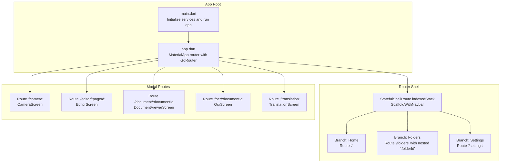
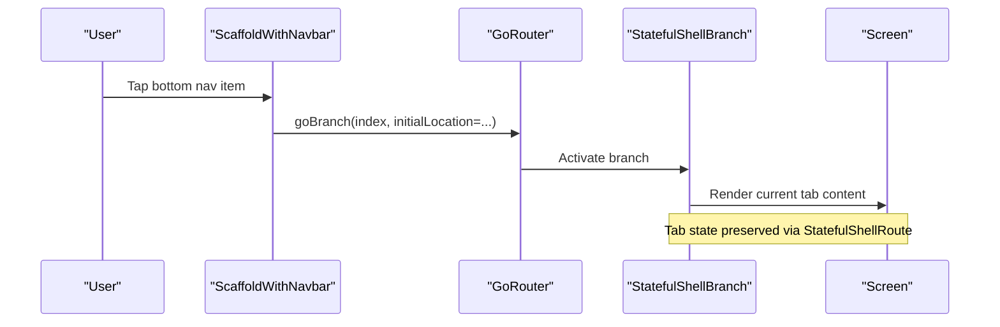
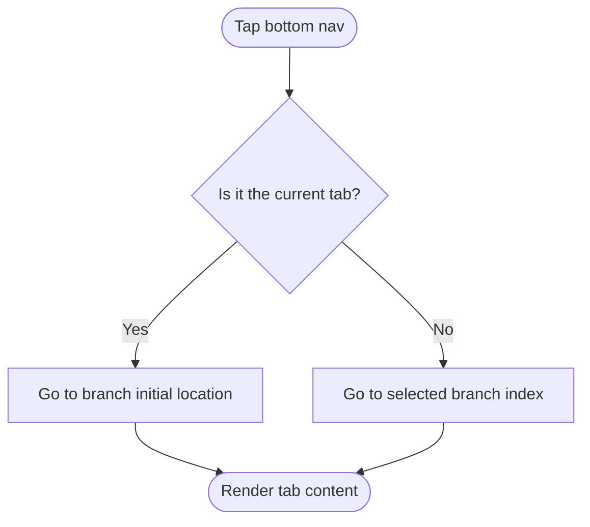
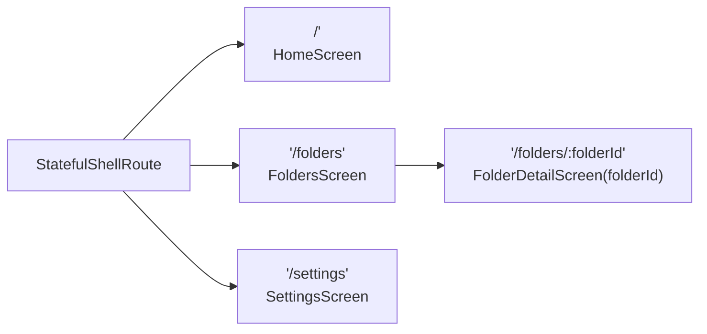
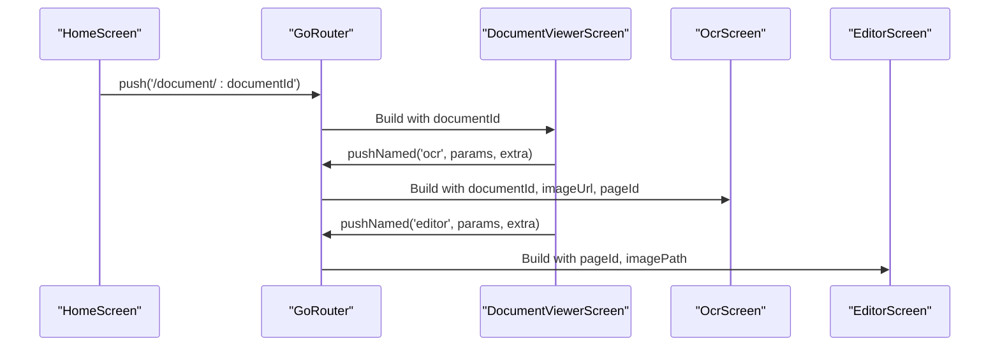
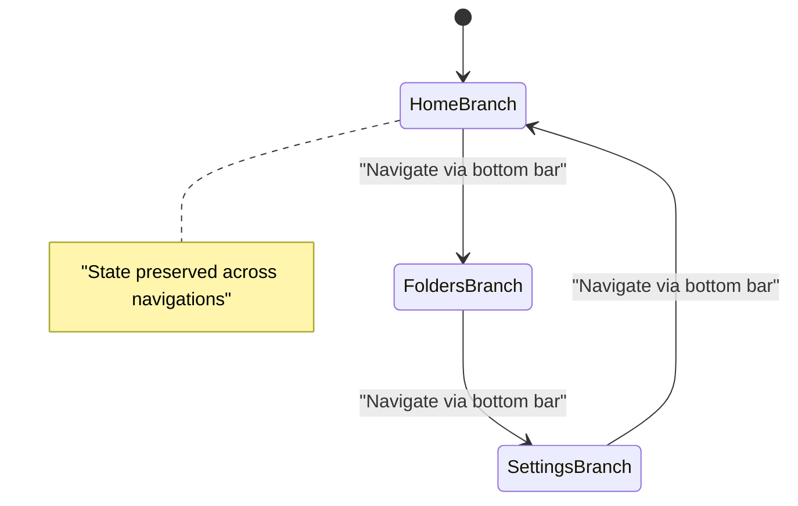
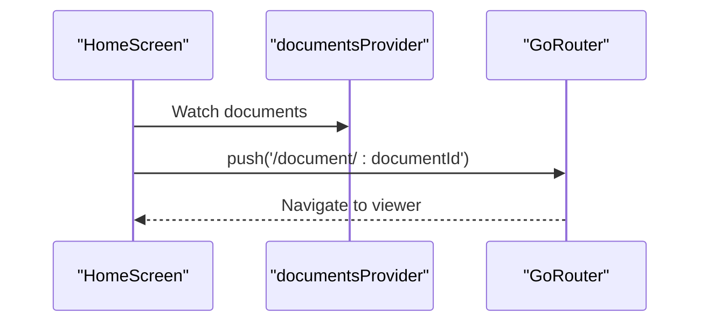
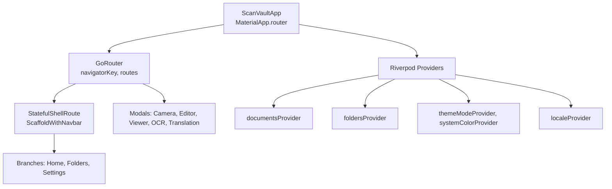

# UI Navigation Architecture

<cite>
**Referenced Files in This Document**
- [main.dart](file://lib/main.dart)
- [app.dart](file://lib/app.dart)
- [scaffold_with_navbar.dart](file://lib/widgets/scaffold_with_navbar.dart)
- [home_screen.dart](file://lib/screens/home/home_screen.dart)
- [folders_screen.dart](file://lib/screens/folders/folders_screen.dart)
- [folder_detail_screen.dart](file://lib/screens/folders/folder_detail_screen.dart)
- [settings_screen.dart](file://lib/screens/settings/settings_screen.dart)
- [camera_screen.dart](file://lib/screens/camera/camera_screen.dart)
- [document_viewer_screen.dart](file://lib/screens/document_viewer/document_viewer_screen.dart)
- [editor_screen.dart](file://lib/screens/editor/editor_screen.dart)
- [ocr_screen.dart](file://lib/screens/ocr/ocr_screen.dart)
- [translation_screen.dart](file://lib/screens/translation/translation_screen.dart)
- [document_provider.dart](file://lib/providers/document_provider.dart)
- [locale_provider.dart](file://lib/providers/locale_provider.dart)
- [theme_provider.dart](file://lib/providers/theme_provider.dart)
</cite>

## Table of Contents
1. [Introduction](#introduction)
2. [Project Structure](#project-structure)
3. [Core Components](#core-components)
4. [Architecture Overview](#architecture-overview)
5. [Detailed Component Analysis](#detailed-component-analysis)
6. [Dependency Analysis](#dependency-analysis)
7. [Performance Considerations](#performance-considerations)
8. [Troubleshooting Guide](#troubleshooting-guide)
9. [Conclusion](#conclusion)

## Introduction
This document explains ScanVault’s navigation architecture built with GoRouter and StatefulShellRoute. It covers the persistent bottom navigation shell, branch-based navigation patterns, deep linking support, and how navigation integrates with screen lifecycle and Riverpod state. It also details tabbed navigation for main sections and modal-style navigation for detailed views, along with programmatic navigation, route parameters handling, and navigation state preservation. Finally, it addresses performance, memory management, and UX considerations for smooth transitions across document management workflows.

## Project Structure
ScanVault organizes navigation under a single router configuration that defines:
- A StatefulShellRoute with three branches for persistent bottom navigation (Home, Folders, Settings)
- Full-screen routes for camera, editor, document viewer, OCR, and translation
- Nested routes for folder detail viewing

**Diagram sources**
- [main.dart](file://lib/main.dart#L10-L31)
- [app.dart](file://lib/app.dart#L67-L186)
- [scaffold_with_navbar.dart](file://lib/widgets/scaffold_with_navbar.dart#L7-L53)

**Section sources**
- [main.dart](file://lib/main.dart#L10-L31)
- [app.dart](file://lib/app.dart#L67-L186)

## Core Components
- Router configuration: Centralized in the router variable with navigator keys, initial location, and route definitions.
- Shell scaffold: A persistent bottom navigation wrapper around the navigation shell.
- Branches: Three StatefulShellBranch instances representing the main tabs.
- Modal routes: Full-screen routes for camera, editor, viewer, OCR, and translation.
- Navigation helpers: Programmatic navigation via context extension methods and named routes.

Key responsibilities:
- StatefulShellRoute preserves tab state across navigations.
- Modal routes overlay the shell and are excluded from tab persistence.
- Route parameters and extras carry context for detailed views.

**Section sources**
- [app.dart](file://lib/app.dart#L67-L186)
- [scaffold_with_navbar.dart](file://lib/widgets/scaffold_with_navbar.dart#L7-L53)

## Architecture Overview
The navigation architecture combines:
- Persistent bottom navigation via StatefulShellRoute
- Branch-based routing for main sections
- Full-screen modals for detailed workflows
- Deep links via path parameters and extras
- Riverpod-driven state for documents, folders, and UI preferences

**Diagram sources**
- [scaffold_with_navbar.dart](file://lib/widgets/scaffold_with_navbar.dart#L15-L23)
- [app.dart](file://lib/app.dart#L72-L118)

## Detailed Component Analysis

### Shell Route and Bottom Navigation
- The shell wraps the navigation shell with a bottom navigation bar.
- Tapping a destination navigates to the corresponding branch.
- When tapping the currently active tab, it navigates to the initial location of that branch.

**Diagram sources**
- [scaffold_with_navbar.dart](file://lib/widgets/scaffold_with_navbar.dart#L15-L23)

**Section sources**
- [scaffold_with_navbar.dart](file://lib/widgets/scaffold_with_navbar.dart#L7-L53)
- [app.dart](file://lib/app.dart#L72-L118)

### Branch-Based Navigation Patterns
- Home branch: Root route renders the Home screen.
- Folders branch: Root route lists folders; nested route resolves a folder detail screen using a path parameter.
- Settings branch: Root route renders the Settings screen.

**Diagram sources**
- [app.dart](file://lib/app.dart#L76-L118)
- [folder_detail_screen.dart](file://lib/screens/folders/folder_detail_screen.dart#L15-L21)

**Section sources**
- [app.dart](file://lib/app.dart#L76-L118)
- [folders_screen.dart](file://lib/screens/folders/folders_screen.dart#L14-L79)
- [folder_detail_screen.dart](file://lib/screens/folders/folder_detail_screen.dart#L15-L97)

### Modal Navigation for Detailed Views
Modal routes overlay the shell and are declared with a parent navigator key to ensure they appear above the bottom navigation.

- Camera route: Full-screen camera scanning with optional batch mode.
- Editor route: Full-screen image editing with filters and saving.
- Document viewer route: Full-screen document viewing with page navigation and actions.
- OCR route: Full-screen text extraction and editing with optional translation.
- Translation route: Full-screen translation interface.

**Diagram sources**
- [home_screen.dart](file://lib/screens/home/home_screen.dart#L401-L403)
- [document_viewer_screen.dart](file://lib/screens/document_viewer/document_viewer_screen.dart#L123-L144)
- [document_viewer_screen.dart](file://lib/screens/document_viewer/document_viewer_screen.dart#L408-L412)
- [ocr_screen.dart](file://lib/screens/ocr/ocr_screen.dart#L11-L23)
- [editor_screen.dart](file://lib/screens/editor/editor_screen.dart#L16-L24)

**Section sources**
- [app.dart](file://lib/app.dart#L120-L185)
- [camera_screen.dart](file://lib/screens/camera/camera_screen.dart#L21-L31)
- [document_viewer_screen.dart](file://lib/screens/document_viewer/document_viewer_screen.dart#L24-L34)
- [ocr_screen.dart](file://lib/screens/ocr/ocr_screen.dart#L11-L23)
- [editor_screen.dart](file://lib/screens/editor/editor_screen.dart#L16-L24)
- [translation_screen.dart](file://lib/screens/translation/translation_screen.dart#L7-L17)

### Route Parameters and Extras Handling
- Path parameters: Used to pass identifiers such as documentId and folderId.
- Extras: Used to pass transient data such as batch mode flags, image paths, and OCR arguments.

Examples:
- Document viewer route uses documentId from path parameters.
- OCR route uses documentId and optional pageId and image path via extra.
- Editor route uses pageId and image path via extra.
- Camera route uses a boolean extra for batch mode.

**Section sources**
- [app.dart](file://lib/app.dart#L96-L101)
- [app.dart](file://lib/app.dart#L134-L140)
- [app.dart](file://lib/app.dart#L146-L151)
- [app.dart](file://lib/app.dart#L157-L172)
- [app.dart](file://lib/app.dart#L177-L183)

### Navigation State Preservation and Lifecycle
- StatefulShellRoute preserves the state of each tab branch independently.
- Bottom navigation tap behavior supports returning to the initial location of the active tab.
- Modal routes are full-screen and do not participate in tab state preservation.

**Diagram sources**
- [scaffold_with_navbar.dart](file://lib/widgets/scaffold_with_navbar.dart#L15-L23)
- [app.dart](file://lib/app.dart#L72-L118)

**Section sources**
- [scaffold_with_navbar.dart](file://lib/widgets/scaffold_with_navbar.dart#L15-L23)
- [app.dart](file://lib/app.dart#L72-L118)

### Integration Between Navigation State and Screen Lifecycle
- Screens use Riverpod providers to manage UI state and data.
- The Home screen builds lists and handles actions that trigger navigation.
- The Document Viewer screen manages page navigation and triggers editor and OCR flows.
- The Folders screen navigates to folder detail using named routes with path parameters.

**Diagram sources**
- [home_screen.dart](file://lib/screens/home/home_screen.dart#L44-L46)
- [home_screen.dart](file://lib/screens/home/home_screen.dart#L401-L403)
- [document_provider.dart](file://lib/providers/document_provider.dart#L9-L17)

**Section sources**
- [home_screen.dart](file://lib/screens/home/home_screen.dart#L20-L320)
- [document_provider.dart](file://lib/providers/document_provider.dart#L9-L54)

### Programmatic Navigation Examples
- From Home to Document Viewer: Uses path parameterized route.
- From Document Viewer to OCR: Uses named route with extra payload.
- From Document Viewer to Editor: Uses named route with path parameter and extra.
- From Home to Camera: Uses push with extra for batch mode.

**Section sources**
- [home_screen.dart](file://lib/screens/home/home_screen.dart#L300-L318)
- [document_viewer_screen.dart](file://lib/screens/document_viewer/document_viewer_screen.dart#L123-L144)
- [document_viewer_screen.dart](file://lib/screens/document_viewer/document_viewer_screen.dart#L408-L412)
- [camera_screen.dart](file://lib/screens/camera/camera_screen.dart#L300-L318)

### Deep Linking Support
- The router supports deep linking via path parameters (e.g., /document/:documentId, /folders/:folderId).
- Named routes enable structured navigation for OCR and editor flows.

**Section sources**
- [app.dart](file://lib/app.dart#L96-L101)
- [app.dart](file://lib/app.dart#L146-L151)
- [app.dart](file://lib/app.dart#L157-L172)
- [app.dart](file://lib/app.dart#L134-L140)

## Dependency Analysis
The navigation system depends on:
- GoRouter for routing and navigation
- Riverpod for state management
- Material App configuration for localization and theming

**Diagram sources**
- [app.dart](file://lib/app.dart#L43-L58)
- [app.dart](file://lib/app.dart#L67-L186)
- [document_provider.dart](file://lib/providers/document_provider.dart#L9-L17)
- [theme_provider.dart](file://lib/providers/theme_provider.dart#L5-L15)
- [locale_provider.dart](file://lib/providers/locale_provider.dart#L5-L7)

**Section sources**
- [app.dart](file://lib/app.dart#L43-L58)
- [document_provider.dart](file://lib/providers/document_provider.dart#L9-L137)
- [theme_provider.dart](file://lib/providers/theme_provider.dart#L5-L28)
- [locale_provider.dart](file://lib/providers/locale_provider.dart#L5-L30)

## Performance Considerations
- StatefulShellRoute preserves tab state, reducing rebuild costs when switching tabs.
- Modal routes avoid unnecessary shell rebuilds by rendering above the shell.
- Use minimal rebuilds in screens by watching only required providers.
- Avoid heavy work in build methods; defer to initState or callbacks.
- Dispose of controllers and resources in screen dispose hooks.
- Consider lazy-loading heavy assets and deferring OCR until needed.

## Troubleshooting Guide
Common issues and resolutions:
- Navigation not working after state changes: Ensure proper use of context extensions and named routes.
- State not preserved on tab switch: Confirm usage of StatefulShellRoute and correct branch indices.
- Route parameters missing: Verify path parameters are passed correctly when pushing routes.
- Modal route overlaps bottom navigation: Confirm parentNavigatorKey is set for modal routes.
- Excess rebuilds: Reduce provider subscriptions to only what is needed in each screen.

**Section sources**
- [scaffold_with_navbar.dart](file://lib/widgets/scaffold_with_navbar.dart#L15-L23)
- [app.dart](file://lib/app.dart#L120-L185)
- [home_screen.dart](file://lib/screens/home/home_screen.dart#L401-L403)

## Conclusion
ScanVault’s navigation architecture leverages GoRouter’s StatefulShellRoute to deliver a responsive, state-preserving bottom navigation experience. Branch-based routing cleanly separates main sections, while modal routes provide focused workflows for scanning, editing, viewing, OCR, and translation. Deep linking via path parameters and extras ensures robust navigation across document management tasks. Combined with Riverpod state management, the system balances performance, maintainability, and a smooth user experience.