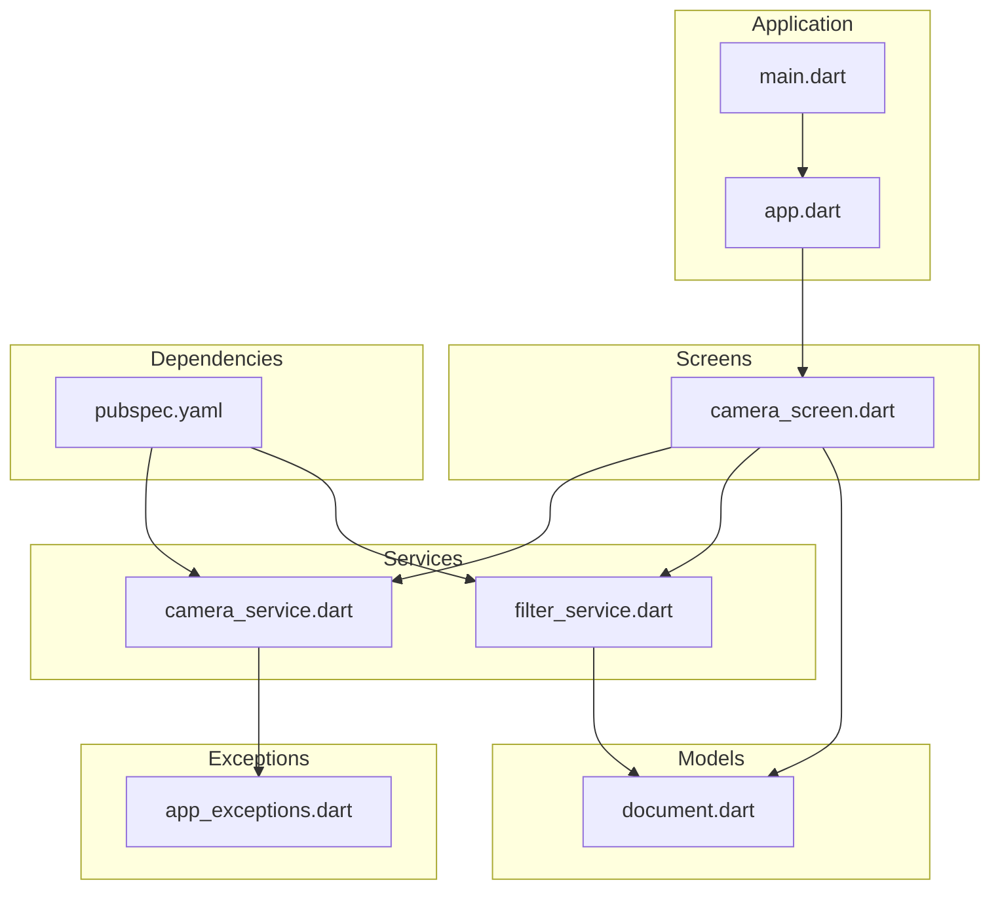
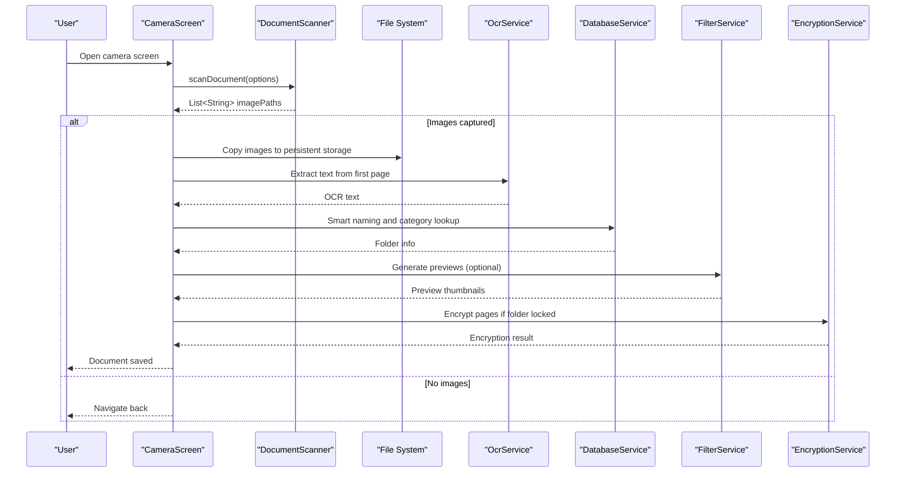
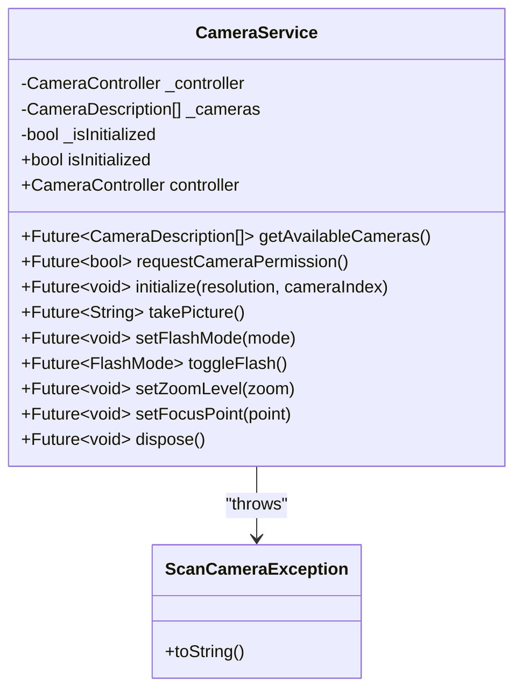
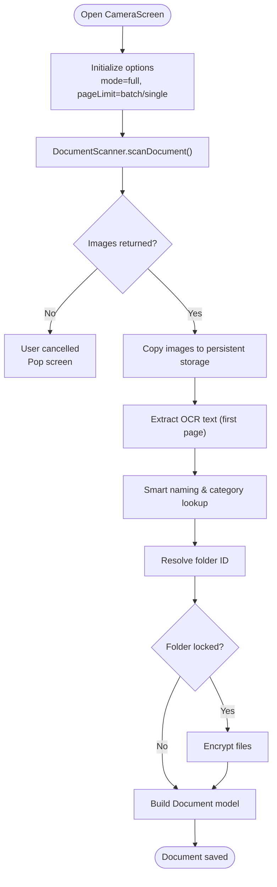
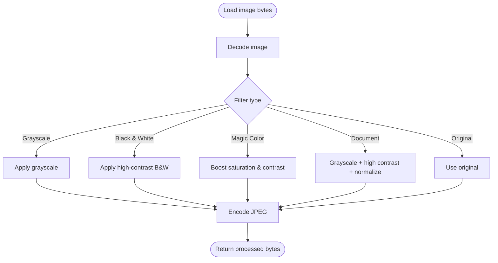
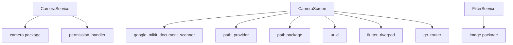

# Camera Service

<cite>
**Referenced Files in This Document**
- [camera_service.dart](file://lib/services/camera_service.dart)
- [camera_screen.dart](file://lib/screens/camera/camera_screen.dart)
- [app_exceptions.dart](file://lib/core/exceptions/app_exceptions.dart)
- [document.dart](file://lib/models/document.dart)
- [filter_service.dart](file://lib/services/filter_service.dart)
- [pubspec.yaml](file://pubspec.yaml)
- [main.dart](file://lib/main.dart)
- [app.dart](file://lib/app.dart)
</cite>

## Table of Contents
1. [Introduction](#introduction)
2. [Project Structure](#project-structure)
3. [Core Components](#core-components)
4. [Architecture Overview](#architecture-overview)
5. [Detailed Component Analysis](#detailed-component-analysis)
6. [Dependency Analysis](#dependency-analysis)
7. [Performance Considerations](#performance-considerations)
8. [Troubleshooting Guide](#troubleshooting-guide)
9. [Conclusion](#conclusion)
10. [Appendices](#appendices)

## Introduction
This document provides comprehensive documentation for the Camera Service implementation in the ScanVault project. It covers camera integration with platform-specific APIs, permission handling, device compatibility, image capture workflows, preview rendering, and real-time processing capabilities. It also documents camera configuration options, resolution settings, focus mechanisms, image enhancement techniques, lighting optimization, quality improvement algorithms, error handling, batch capture operations, image processing pipelines, and integration with the document scanning workflow. Examples of camera initialization, custom configurations, and troubleshooting common issues are included, along with cross-platform camera differences and platform-specific optimizations.

## Project Structure
The camera functionality is primarily implemented in a dedicated service and integrated into the camera screen. Supporting components include exception handling, document models, and image filtering utilities. The application entry point initializes global services and sets orientation preferences.

**Diagram sources**
- [main.dart](file://lib/main.dart#L10-L31)
- [app.dart](file://lib/app.dart#L67-L186)
- [camera_service.dart](file://lib/services/camera_service.dart#L1-L139)
- [camera_screen.dart](file://lib/screens/camera/camera_screen.dart#L1-L242)
- [filter_service.dart](file://lib/services/filter_service.dart#L1-L105)
- [document.dart](file://lib/models/document.dart#L1-L49)
- [app_exceptions.dart](file://lib/core/exceptions/app_exceptions.dart#L1-L70)
- [pubspec.yaml](file://pubspec.yaml#L9-L65)

**Section sources**
- [main.dart](file://lib/main.dart#L10-L31)
- [app.dart](file://lib/app.dart#L67-L186)
- [camera_service.dart](file://lib/services/camera_service.dart#L1-L139)
- [camera_screen.dart](file://lib/screens/camera/camera_screen.dart#L1-L242)
- [filter_service.dart](file://lib/services/filter_service.dart#L1-L105)
- [document.dart](file://lib/models/document.dart#L1-L49)
- [app_exceptions.dart](file://lib/core/exceptions/app_exceptions.dart#L1-L70)
- [pubspec.yaml](file://pubspec.yaml#L9-L65)

## Core Components
- CameraService: Provides camera lifecycle management, permission handling, initialization with configurable resolution and camera index, flash control, zoom, focus, and disposal.
- CameraScreen: Orchestrates document scanning via Google ML Kit Document Scanner, handles batch/single-page modes, saves scanned images to persistent storage, performs OCR-based smart naming and categorization, and integrates encryption for locked folders.
- FilterService: Applies image enhancement filters (grayscale, black-and-white, magic color, document-optimized) and generates preview thumbnails.
- Document model: Defines filter types and document/page structures used throughout the scanning and editing pipeline.
- App exceptions: Centralized exception types for camera, image processing, OCR, translation, export, database, and storage errors.

**Section sources**
- [camera_service.dart](file://lib/services/camera_service.dart#L10-L139)
- [camera_screen.dart](file://lib/screens/camera/camera_screen.dart#L20-L242)
- [filter_service.dart](file://lib/services/filter_service.dart#L6-L105)
- [document.dart](file://lib/models/document.dart#L6-L49)
- [app_exceptions.dart](file://lib/core/exceptions/app_exceptions.dart#L4-L70)

## Architecture Overview
The camera workflow integrates Flutter’s camera plugin with Google ML Kit Document Scanner for real-time document detection and cropping. The captured images are copied to persistent storage, optionally encrypted if the target folder is locked, and then indexed into a document with metadata and OCR text.

**Diagram sources**
- [camera_screen.dart](file://lib/screens/camera/camera_screen.dart#L45-L216)
- [filter_service.dart](file://lib/services/filter_service.dart#L69-L93)

**Section sources**
- [camera_screen.dart](file://lib/screens/camera/camera_screen.dart#L45-L216)
- [filter_service.dart](file://lib/services/filter_service.dart#L69-L93)

## Detailed Component Analysis

### CameraService
The CameraService encapsulates camera lifecycle and controls:
- Permission handling via permission_handler.
- Camera discovery and selection.
- Initialization with configurable resolution preset and camera index.
- Flash toggling and zoom control.
- Focus point setting with auto-focus mode.
- Safe disposal of the camera controller.

**Diagram sources**
- [camera_service.dart](file://lib/services/camera_service.dart#L10-L139)
- [app_exceptions.dart](file://lib/core/exceptions/app_exceptions.dart#L15-L21)

**Section sources**
- [camera_service.dart](file://lib/services/camera_service.dart#L10-L139)
- [app_exceptions.dart](file://lib/core/exceptions/app_exceptions.dart#L15-L21)

### CameraScreen
The CameraScreen integrates Google ML Kit Document Scanner to capture and process documents:
- Supports batch mode (multiple pages) and single-page mode.
- Copies temporary scanner images to persistent storage.
- Performs OCR-based smart naming and categorization.
- Generates document metadata and thumbnails.
- Optionally encrypts pages if the target folder is locked.
- Handles localization and user feedback via snackbars.

**Diagram sources**
- [camera_screen.dart](file://lib/screens/camera/camera_screen.dart#L45-L216)

**Section sources**
- [camera_screen.dart](file://lib/screens/camera/camera_screen.dart#L20-L242)

### FilterService
The FilterService applies image enhancement filters and generates preview thumbnails:
- Grayscale, black-and-white, magic color, and document-optimized filters.
- Thumbnail generation for faster preview rendering.
- Human-readable filter names for UI display.

**Diagram sources**
- [filter_service.dart](file://lib/services/filter_service.dart#L10-L93)
- [document.dart](file://lib/models/document.dart#L6-L13)

**Section sources**
- [filter_service.dart](file://lib/services/filter_service.dart#L6-L105)
- [document.dart](file://lib/models/document.dart#L6-L13)

### Document Model
Defines filter types and document/page structures used across the scanning and editing pipeline.

**Section sources**
- [document.dart](file://lib/models/document.dart#L6-L49)

### Exception Handling
Centralized exception types for robust error reporting and recovery.

**Section sources**
- [app_exceptions.dart](file://lib/core/exceptions/app_exceptions.dart#L4-L70)

## Dependency Analysis
The project relies on several key dependencies for camera and image processing:
- camera: Camera plugin for Flutter.
- permission_handler: Cross-platform permission requests.
- google_mlkit_document_scanner: Real-time document scanning and cropping.
- image: Image processing and encoding.
- path_provider and path: Persistent storage and path manipulation.
- uuid: Unique identifiers for documents and pages.
- flutter_riverpod and go_router: State management and routing.

**Diagram sources**
- [pubspec.yaml](file://pubspec.yaml#L21-L56)
- [camera_service.dart](file://lib/services/camera_service.dart#L1-L7)
- [camera_screen.dart](file://lib/screens/camera/camera_screen.dart#L1-L18)
- [filter_service.dart](file://lib/services/filter_service.dart#L1-L4)

**Section sources**
- [pubspec.yaml](file://pubspec.yaml#L9-L65)
- [camera_service.dart](file://lib/services/camera_service.dart#L1-L7)
- [camera_screen.dart](file://lib/screens/camera/camera_screen.dart#L1-L18)
- [filter_service.dart](file://lib/services/filter_service.dart#L1-L4)

## Performance Considerations
- Resolution presets: Use appropriate resolution presets to balance quality and performance. Lower resolutions reduce memory usage and improve responsiveness on lower-end devices.
- Thumbnail generation: Generate smaller thumbnails for preview rendering to minimize memory footprint and improve UI responsiveness.
- Batch processing: Limit page limits in batch mode to avoid excessive memory consumption during OCR and encryption operations.
- Image format: Prefer JPEG for capturing and processing to maintain a good balance between quality and file size.
- Disposal: Always dispose of camera controllers and temporary files to prevent memory leaks and storage bloat.

## Troubleshooting Guide
Common issues and resolutions:
- Camera permission denied: Ensure the app requests camera permissions at runtime. Handle denial gracefully and guide users to grant permissions in system settings.
- No cameras available: Verify device camera availability and handle cases where no cameras are detected.
- Camera initialization failures: Catch and log initialization errors, and rethrow them as ScanCameraException for consistent error handling.
- Flash mode errors: Log failures when setting flash mode and continue operation without flash.
- Zoom and focus errors: Clamp zoom values within min/max bounds and handle focus point setting exceptions.
- OCR extraction failures: Continue saving documents even if OCR fails; smart naming and categorization can still be performed later.
- Encryption failures: Proceed with document saving if encryption fails; notify users and allow manual encryption later.

**Section sources**
- [camera_service.dart](file://lib/services/camera_service.dart#L38-L71)
- [camera_service.dart](file://lib/services/camera_service.dart#L88-L129)
- [camera_screen.dart](file://lib/screens/camera/camera_screen.dart#L65-L74)
- [camera_screen.dart](file://lib/screens/camera/camera_screen.dart#L195-L200)
- [app_exceptions.dart](file://lib/core/exceptions/app_exceptions.dart#L15-L21)

## Conclusion
The Camera Service implementation provides a robust foundation for camera integration, permission handling, and device compatibility. It leverages Google ML Kit Document Scanner for efficient document capture and integrates seamlessly with image enhancement, OCR-based smart naming, and secure storage workflows. Proper error handling, performance considerations, and cross-platform optimizations ensure reliable operation across diverse devices and environments.

## Appendices

### Camera Initialization Example
- Initialize camera with a specific resolution preset and camera index.
- Request camera permission before initialization.
- Handle initialization failures and rethrow as ScanCameraException.

**Section sources**
- [camera_service.dart](file://lib/services/camera_service.dart#L34-L71)

### Custom Configuration Options
- Resolution presets: Configure resolution preset during initialization.
- Camera index: Select front or rear camera by specifying cameraIndex.
- Flash modes: Toggle between off and torch modes.
- Zoom levels: Set zoom within min/max bounds.
- Focus points: Set focus point and enable auto-focus mode.

**Section sources**
- [camera_service.dart](file://lib/services/camera_service.dart#L34-L129)

### Image Enhancement Techniques
- Grayscale: Convert images to grayscale for neutral tones.
- Black and white: Apply high-contrast thresholding for crisp text.
- Magic color: Boost saturation and contrast for vibrant colors.
- Document-optimized: Grayscale + high contrast + normalization for readability.

**Section sources**
- [filter_service.dart](file://lib/services/filter_service.dart#L29-L67)
- [document.dart](file://lib/models/document.dart#L6-L13)

### Lighting Optimization and Quality Improvement
- Use torch mode in low-light conditions.
- Adjust zoom to frame documents precisely.
- Utilize focus points for sharp text and edges.
- Apply document-optimized filters for improved readability.

**Section sources**
- [camera_service.dart](file://lib/services/camera_service.dart#L88-L129)
- [filter_service.dart](file://lib/services/filter_service.dart#L58-L67)

### Batch Capture Operations
- Configure pageLimit to support multiple pages in batch mode.
- Copy temporary scanner images to persistent storage.
- Generate previews and thumbnails for faster UI rendering.
- Encrypt pages if the target folder is locked.

**Section sources**
- [camera_screen.dart](file://lib/screens/camera/camera_screen.dart#L47-L51)
- [camera_screen.dart](file://lib/screens/camera/camera_screen.dart#L139-L166)
- [camera_screen.dart](file://lib/screens/camera/camera_screen.dart#L190-L200)

### Integration with Document Scanning Workflow
- DocumentScanner captures and crops documents.
- OCR extracts text for smart naming and categorization.
- DatabaseService manages folders and document metadata.
- EncryptionService secures pages in locked folders.

**Section sources**
- [camera_screen.dart](file://lib/screens/camera/camera_screen.dart#L47-L54)
- [camera_screen.dart](file://lib/screens/camera/camera_screen.dart#L90-L122)
- [camera_screen.dart](file://lib/screens/camera/camera_screen.dart#L185-L200)

### Cross-Platform Camera Differences
- Android/iOS camera plugins provide unified APIs for camera operations.
- Permissions differ by platform; ensure proper handling of camera permissions.
- Orientation preferences can be set globally to enforce portrait mode.

**Section sources**
- [pubspec.yaml](file://pubspec.yaml#L21-L28)
- [pubspec.yaml](file://pubspec.yaml#L54)
- [main.dart](file://lib/main.dart#L13-L17)