# Core Services

<cite>
**Referenced Files in This Document**
- [main.dart](file://lib/main.dart)
- [app.dart](file://lib/app.dart)
- [database_service.dart](file://lib/services/database_service.dart)
- [ocr_service.dart](file://lib/services/ocr_service.dart)
- [translation_service.dart](file://lib/services/translation_service.dart)
- [export_service.dart](file://lib/services/export_service.dart)
- [storage_service.dart](file://lib/services/storage_service.dart)
- [camera_service.dart](file://lib/services/camera_service.dart)
- [encryption_service.dart](file://lib/services/encryption_service.dart)
- [pdf_service.dart](file://lib/services/pdf_service.dart)
- [docx_service.dart](file://lib/services/docx_service.dart)
- [document.dart](file://lib/models/document.dart)
- [document_provider.dart](file://lib/providers/document_provider.dart)
- [camera_screen.dart](file://lib/screens/camera/camera_screen.dart)
- [ocr_screen.dart](file://lib/screens/ocr/ocr_screen.dart)
- [editor_screen.dart](file://lib/screens/editor/editor_screen.dart)
- [app_exceptions.dart](file://lib/core/exceptions/app_exceptions.dart)
</cite>

## Table of Contents
1. [Introduction](#introduction)
2. [Project Structure](#project-structure)
3. [Core Components](#core-components)
4. [Architecture Overview](#architecture-overview)
5. [Detailed Component Analysis](#detailed-component-analysis)
6. [Dependency Analysis](#dependency-analysis)
7. [Performance Considerations](#performance-considerations)
8. [Troubleshooting Guide](#troubleshooting-guide)
9. [Conclusion](#conclusion)

## Introduction
This document describes the core service layer of ScanVault, focusing on the service architecture pattern, lifecycle management, and inter-service communication. It covers the responsibilities, contracts, and operational characteristics of each major service, including initialization, dependency injection, error handling, and performance considerations. Practical usage patterns are illustrated via screen integrations and provider-driven state management.

## Project Structure
ScanVault organizes services under lib/services, models under lib/models, state management via Riverpod providers under lib/providers, and UI screens under lib/screens. The application bootstraps by initializing the database and storage services, then wiring them into the Riverpod ProviderScope for dependency injection.

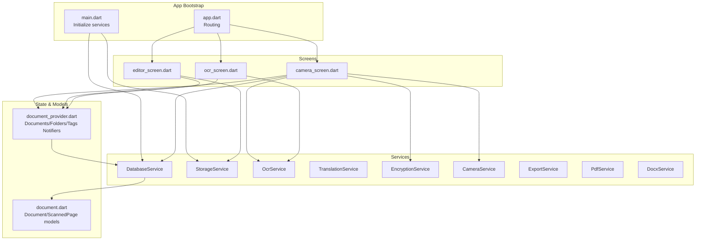

**Diagram sources**
- [main.dart](file://lib/main.dart#L10-L31)
- [app.dart](file://lib/app.dart#L66-L186)
- [database_service.dart](file://lib/services/database_service.dart#L11-L28)
- [storage_service.dart](file://lib/services/storage_service.dart#L18-L21)
- [ocr_service.dart](file://lib/services/ocr_service.dart#L6-L68)
- [translation_service.dart](file://lib/services/translation_service.dart#L7-L90)
- [encryption_service.dart](file://lib/services/encryption_service.dart#L8-L36)
- [camera_service.dart](file://lib/services/camera_service.dart#L10-L71)
- [export_service.dart](file://lib/services/export_service.dart#L6-L41)
- [pdf_service.dart](file://lib/services/pdf_service.dart#L12-L96)
- [docx_service.dart](file://lib/services/docx_service.dart#L10-L134)
- [document_provider.dart](file://lib/providers/document_provider.dart#L8-L54)
- [document.dart](file://lib/models/document.dart#L16-L48)
- [camera_screen.dart](file://lib/screens/camera/camera_screen.dart#L14-L216)
- [ocr_screen.dart](file://lib/screens/ocr/ocr_screen.dart#L11-L112)
- [editor_screen.dart](file://lib/screens/editor/editor_screen.dart#L15-L185)

**Section sources**
- [main.dart](file://lib/main.dart#L10-L31)
- [app.dart](file://lib/app.dart#L66-L186)

## Core Components
This section outlines each core service’s responsibilities, initialization, contracts, and integration points.

- DatabaseService
  - Purpose: Local SQLite persistence for documents, pages, folders, tags, and relationships.
  - Initialization: Static initialization with database creation and migrations.
  - Contracts:
    - Document CRUD: insertDocument, getDocument, getAllDocuments, getDocumentsInFolder, updateDocument, deleteDocument.
    - Page CRUD: insertPage, getPagesForDocument.
    - Folder CRUD: insertFolder, getAllFolders, getFolderByName, updateFolder, deleteFolder.
    - Tag CRUD: insertTag, getAllTags, getTagIdsForDocument, deleteTag.
    - Utilities: db accessor, generateId.
  - Error handling: Throws if not initialized; delegates SQL errors to callers.
  - Complexity: Relational queries with indexes; pagination via ordering; joins for counts.

- OcrService
  - Purpose: Text recognition from images using Google ML Kit.
  - Contracts:
    - extractText(imagePath): returns recognized text.
    - extractTextWithBlocks(imagePath): structured result with blocks and lines.
    - extractTextFromMultipleImages(paths): concatenates page text.
    - dispose(): closes recognizer.
  - Error handling: Wraps failures in OcrException.

- TranslationService
  - Purpose: On-device translation using Google ML Kit with model lifecycle management.
  - Contracts:
    - getAvailableLanguages(), isModelDownloaded(lang), downloadModel(lang), deleteModel(lang).
    - translate(text, source, target): translates text with lazy translator creation and model checks.
    - dispose(): closes translator.
  - Error handling: Wraps failures in TranslationException.

- ExportService
  - Purpose: Share multiple images from a document.
  - Contracts:
    - shareImages(document, selectedPageIndices?, shareText?): shares processed or original page images.

- StorageService
  - Purpose: Persistent storage path management and file path generation.
  - Contracts:
    - init(): static initializer returning StorageService instance.
    - getCustomStoragePath(), setCustomStoragePath(path), resetToDefault().
    - getStorageDirectory(): resolves to custom or default app directory.
    - getFilePath(filename): ensures directory exists and returns full path.
  - DI: Provided via Riverpod provider override in main.

- CameraService
  - Purpose: Camera initialization, permissions, capture, and controls.
  - Contracts:
    - getAvailableCameras(), requestCameraPermission(), initialize(resolution, cameraIndex).
    - takePicture(), setFlashMode(mode), toggleFlash(), setZoomLevel(zoom), setFocusPoint(point).
    - dispose(): disposes controller.
  - Error handling: Wraps failures in ScanCameraException.

- EncryptionService
  - Purpose: Per-folder encryption/decryption of files using AES with secure random IV and key storage.
  - Contracts:
    - generateKeyForFolder(folderId), getKeyForFolder(folderId), deleteKeyForFolder(folderId).
    - encryptFile(filePath, folderId), decryptFile(filePath, folderId).
    - encryptFiles(files, folderId), decryptFiles(files, folderId).
    - isFileEncrypted(filePath): heuristic check based on file size.
  - Security: Uses FlutterSecureStorage for keys; prepends IV to encrypted files.

- PdfService
  - Purpose: Export documents to PDF with optional OCR text inclusion and sharing/printing.
  - Contracts:
    - generatePdf(document, includeOcrText?, selectedPageIndices?): returns file path.
    - generateTextPdf(text, title): returns file path.
    - sharePdf(document, includeOcrText?, selectedPageIndices?).
    - printPdf(document).

- DocxService
  - Purpose: Export documents to DOCX with images and optional OCR text, maintaining page order.
  - Contracts:
    - generateDocx(document, includeOcrText?, selectedPageIndices?): returns file path.
  - Implementation: Builds WordprocessingML XML and packages as ZIP.

**Section sources**
- [database_service.dart](file://lib/services/database_service.dart#L11-L412)
- [ocr_service.dart](file://lib/services/ocr_service.dart#L6-L92)
- [translation_service.dart](file://lib/services/translation_service.dart#L7-L170)
- [export_service.dart](file://lib/services/export_service.dart#L6-L41)
- [storage_service.dart](file://lib/services/storage_service.dart#L12-L62)
- [camera_service.dart](file://lib/services/camera_service.dart#L10-L139)
- [encryption_service.dart](file://lib/services/encryption_service.dart#L8-L149)
- [pdf_service.dart](file://lib/services/pdf_service.dart#L12-L186)
- [docx_service.dart](file://lib/services/docx_service.dart#L10-L346)

## Architecture Overview
ScanVault follows a layered architecture:
- UI Screens orchestrate workflows and call services.
- Providers manage reactive state and coordinate service calls.
- Services encapsulate domain capabilities and handle platform integrations.
- Models define data contracts for persistence and transport.

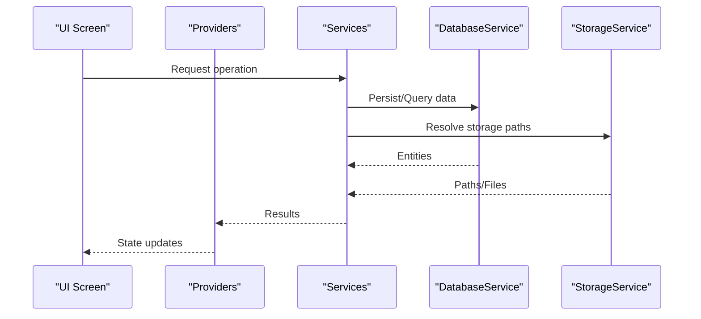

**Diagram sources**
- [camera_screen.dart](file://lib/screens/camera/camera_screen.dart#L76-L216)
- [ocr_screen.dart](file://lib/screens/ocr/ocr_screen.dart#L52-L112)
- [editor_screen.dart](file://lib/screens/editor/editor_screen.dart#L113-L185)
- [document_provider.dart](file://lib/providers/document_provider.dart#L19-L53)
- [database_service.dart](file://lib/services/database_service.dart#L120-L247)
- [storage_service.dart](file://lib/services/storage_service.dart#L39-L61)

## Detailed Component Analysis

### DatabaseService
- Initialization and schema
  - Initializes SQLite database, creates tables, indexes, and handles migrations.
  - Exposes a static db accessor guarded by initialization.
- Document operations
  - Inserts documents with nested pages and tag associations.
  - Retrieves documents with denormalized page lists and tag IDs.
- Page operations
  - CRUD for pages with filter enumeration mapping.
- Folder and Tag operations
  - Folders include document counts via SQL aggregation.
  - Tags support association via junction table.
- Concurrency and safety
  - Single database instance; callers must ensure initialization before use.

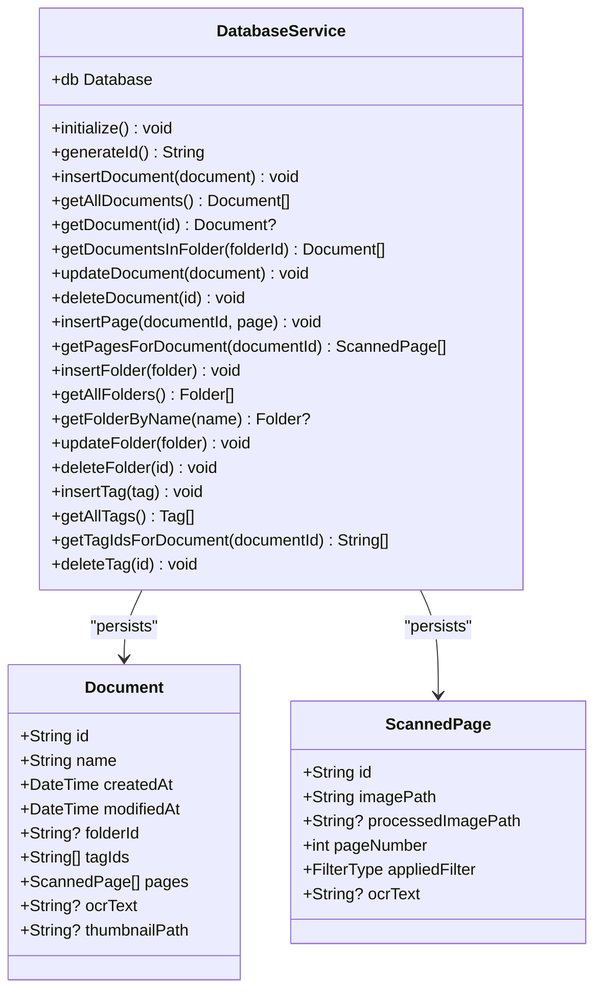

**Diagram sources**
- [database_service.dart](file://lib/services/database_service.dart#L11-L412)
- [document.dart](file://lib/models/document.dart#L16-L48)

**Section sources**
- [database_service.dart](file://lib/services/database_service.dart#L11-L412)
- [document.dart](file://lib/models/document.dart#L16-L48)

### OcrService
- Contracts
  - extractText(imagePath): returns recognized text.
  - extractTextWithBlocks(imagePath): structured blocks and lines.
  - extractTextFromMultipleImages(paths): concatenates page text with separators.
  - dispose(): closes recognizer.
- Error handling
  - Wraps exceptions in OcrException.

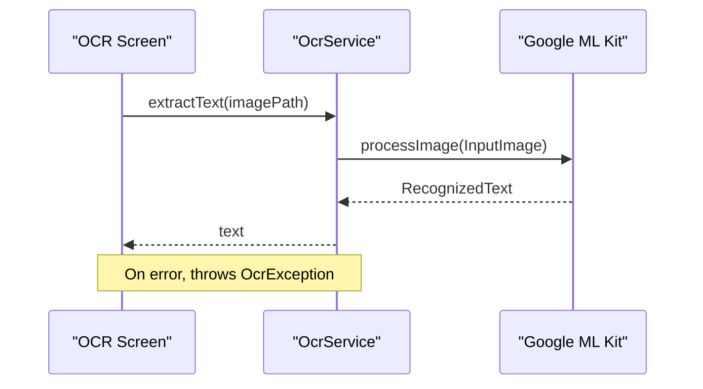

**Diagram sources**
- [ocr_screen.dart](file://lib/screens/ocr/ocr_screen.dart#L52-L70)
- [ocr_service.dart](file://lib/services/ocr_service.dart#L9-L18)

**Section sources**
- [ocr_service.dart](file://lib/services/ocr_service.dart#L6-L92)
- [ocr_screen.dart](file://lib/screens/ocr/ocr_screen.dart#L52-L70)

### TranslationService
- Contracts
  - getAvailableLanguages(), isModelDownloaded(lang), downloadModel(lang), deleteModel(lang).
  - translate(text, source, target): manages translator lifecycle and model downloads.
  - dispose(): closes translator.
- Error handling
  - Wraps failures in TranslationException.

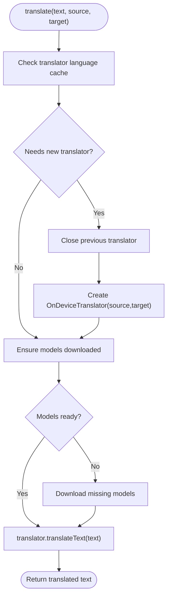

**Diagram sources**
- [translation_service.dart](file://lib/services/translation_service.dart#L50-L84)

**Section sources**
- [translation_service.dart](file://lib/services/translation_service.dart#L7-L170)

### ExportService
- Contracts
  - shareImages(document, selectedPageIndices?, shareText?): collects page images and shares via SharePlus.

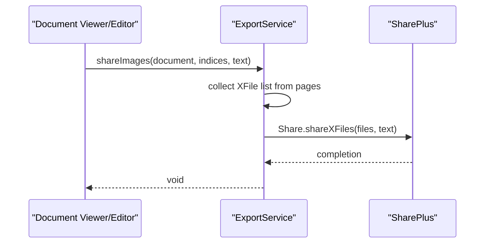

**Diagram sources**
- [export_service.dart](file://lib/services/export_service.dart#L9-L40)

**Section sources**
- [export_service.dart](file://lib/services/export_service.dart#L6-L41)

### StorageService
- Contracts
  - init(): returns initialized StorageService.
  - getCustomStoragePath(), setCustomStoragePath(path), resetToDefault().
  - getStorageDirectory(): resolves to custom or default app directory.
  - getFilePath(filename): ensures directory exists and returns full path.
- Dependency injection
  - Provided via ProviderScope override in main.

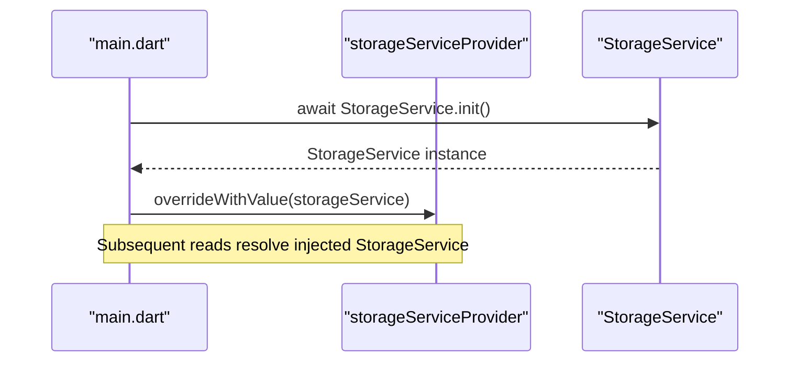

**Diagram sources**
- [main.dart](file://lib/main.dart#L20-L27)
- [storage_service.dart](file://lib/services/storage_service.dart#L18-L21)

**Section sources**
- [storage_service.dart](file://lib/services/storage_service.dart#L8-L62)
- [main.dart](file://lib/main.dart#L20-L27)

### CameraService
- Contracts
  - getAvailableCameras(), requestCameraPermission(), initialize(resolution, cameraIndex).
  - takePicture(), setFlashMode(mode), toggleFlash(), setZoomLevel(zoom), setFocusPoint(point).
  - dispose(): disposes controller.
- Error handling
  - Wraps failures in ScanCameraException.

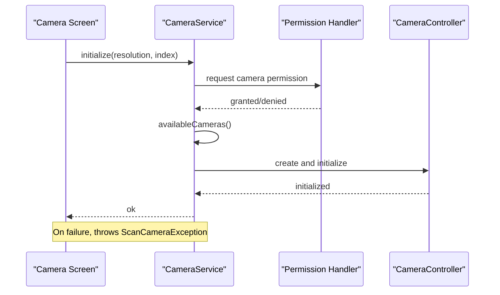

**Diagram sources**
- [camera_service.dart](file://lib/services/camera_service.dart#L33-L71)
- [camera_screen.dart](file://lib/screens/camera/camera_screen.dart#L45-L74)

**Section sources**
- [camera_service.dart](file://lib/services/camera_service.dart#L10-L139)
- [camera_screen.dart](file://lib/screens/camera/camera_screen.dart#L45-L74)

### EncryptionService
- Contracts
  - generateKeyForFolder(folderId), getKeyForFolder(folderId), deleteKeyForFolder(folderId).
  - encryptFile(filePath, folderId), decryptFile(filePath, folderId).
  - encryptFiles(files, folderId), decryptFiles(files, folderId).
  - isFileEncrypted(filePath): heuristic check.
- Security
  - Uses AES-256 with secure random IV; stores base64-encoded key via FlutterSecureStorage.

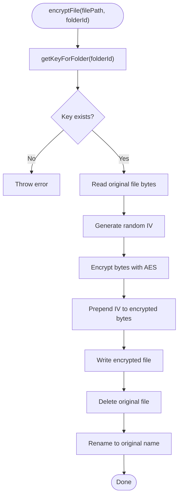

**Diagram sources**
- [encryption_service.dart](file://lib/services/encryption_service.dart#L38-L77)

**Section sources**
- [encryption_service.dart](file://lib/services/encryption_service.dart#L8-L149)

### PdfService
- Contracts
  - generatePdf(document, includeOcrText?, selectedPageIndices?): returns file path.
  - generateTextPdf(text, title): returns file path.
  - sharePdf(document, includeOcrText?, selectedPageIndices?).
  - printPdf(document).

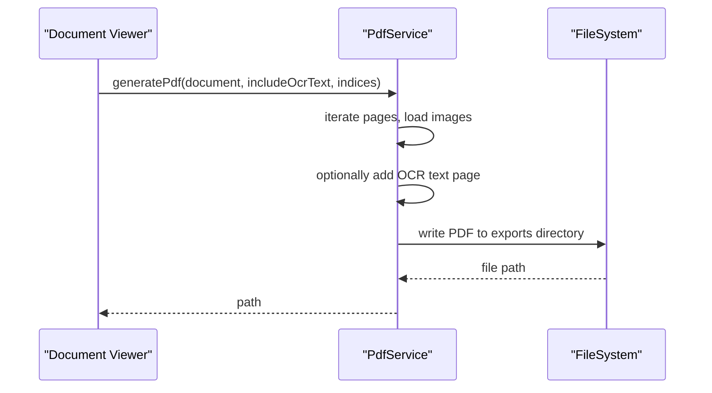

**Diagram sources**
- [pdf_service.dart](file://lib/services/pdf_service.dart#L15-L96)

**Section sources**
- [pdf_service.dart](file://lib/services/pdf_service.dart#L12-L186)

### DocxService
- Contracts
  - generateDocx(document, includeOcrText?, selectedPageIndices?): returns file path.
- Implementation highlights
  - Builds WordprocessingML XML, relationship files, and media assets; packages as ZIP.

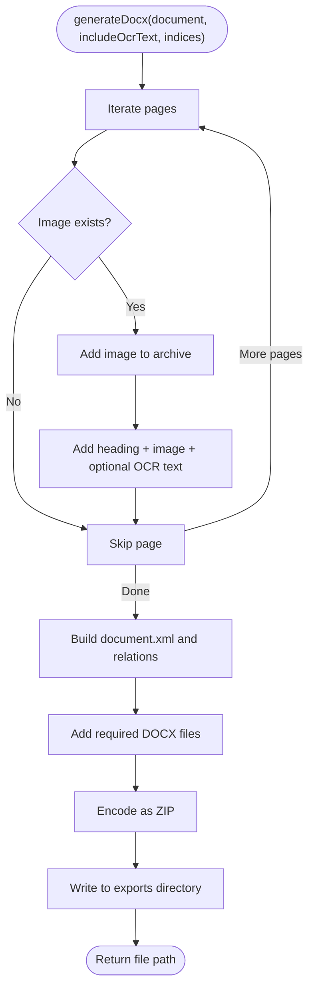

**Diagram sources**
- [docx_service.dart](file://lib/services/docx_service.dart#L20-L134)

**Section sources**
- [docx_service.dart](file://lib/services/docx_service.dart#L10-L346)

## Dependency Analysis
- Initialization order
  - DatabaseService.initialize() and StorageService.init() are called in main before runApp.
  - StorageService is overridden into ProviderScope for DI.
- Provider-driven state
  - DocumentsNotifier/FoldersNotifier/TagsNotifier depend on DatabaseService for persistence.
- Screen-to-service integration
  - CameraScreen orchestrates camera capture, OCR, smart naming, and encryption.
  - OcrScreen uses OcrService for text extraction.
  - EditorScreen uses StorageService for persisted file paths and FilterService for previews.

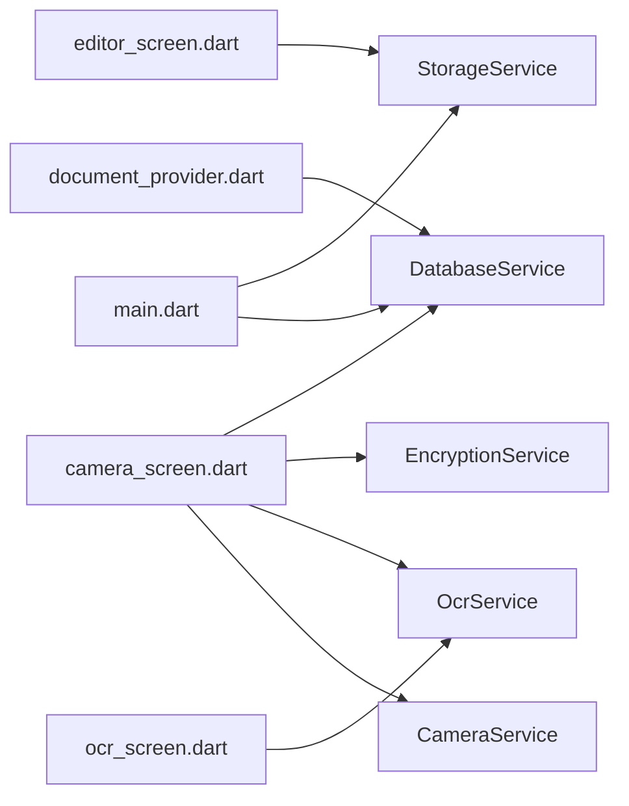

**Diagram sources**
- [main.dart](file://lib/main.dart#L19-L27)
- [camera_screen.dart](file://lib/screens/camera/camera_screen.dart#L14-L216)
- [ocr_screen.dart](file://lib/screens/ocr/ocr_screen.dart#L11-L112)
- [editor_screen.dart](file://lib/screens/editor/editor_screen.dart#L15-L185)
- [document_provider.dart](file://lib/providers/document_provider.dart#L8-L54)

**Section sources**
- [main.dart](file://lib/main.dart#L19-L27)
- [document_provider.dart](file://lib/providers/document_provider.dart#L8-L54)

## Performance Considerations
- Database
  - Use indexed queries (folder_id, document_id) and avoid N+1 selects by batching retrieval.
  - Prefer incremental migrations and minimal schema churn.
- OCR/Translation
  - Reuse recognizers/translators when language pair remains unchanged to avoid cold-start overhead.
  - Download language models proactively to reduce latency on first use.
- Encryption
  - Batch encrypt/decrypt operations where possible; avoid repeated key reads.
  - Use streaming I/O for large files when feasible.
- Export
  - Generate PDF/DOCX incrementally and write to a dedicated exports directory to minimize UI blocking.
- Camera
  - Initialize camera once per session; reuse controller to avoid re-initialization costs.
- Storage
  - Ensure directories exist before writes; cache resolved paths when iterating multiple pages.

## Troubleshooting Guide
- Exceptions
  - ScanVaultException hierarchy centralizes error semantics across services.
  - Specific exceptions: ScanCameraException, OcrException, TranslationException, ExportException, DatabaseException, StorageException.
- Diagnosing failures
  - Wrap service calls in try/catch and surface localized messages to users.
  - Log stack traces for developer diagnostics without exposing sensitive details.
- Common issues
  - Camera permission denied: requestCameraPermission must succeed before initialize.
  - OCR/Translation failures: verify model downloads and network availability.
  - Encryption failures: ensure folder key exists and file paths are valid.
  - Export failures: confirm exports directory creation and file existence.

**Section sources**
- [app_exceptions.dart](file://lib/core/exceptions/app_exceptions.dart#L4-L70)
- [camera_service.dart](file://lib/services/camera_service.dart#L66-L70)
- [ocr_service.dart](file://lib/services/ocr_service.dart#L15-L18)
- [translation_service.dart](file://lib/services/translation_service.dart#L36-L38)
- [encryption_service.dart](file://lib/services/encryption_service.dart#L40-L44)
- [pdf_service.dart](file://lib/services/pdf_service.dart#L93-L95)
- [docx_service.dart](file://lib/services/docx_service.dart#L130-L133)

## Conclusion
ScanVault’s core services implement a clean separation of concerns with explicit contracts, robust error handling, and DI via Riverpod. The service layer integrates tightly with UI screens and providers, enabling responsive workflows for scanning, editing, translating, exporting, and securing documents. Following the patterns documented here ensures maintainability, testability, and predictable performance across platforms.