# Database Service

<cite>
**Referenced Files in This Document**
- [database_service.dart](file://lib/services/database_service.dart)
- [document.dart](file://lib/models/document.dart)
- [folder.dart](file://lib/models/folder.dart)
- [tag.dart](file://lib/models/tag.dart)
- [document_provider.dart](file://lib/providers/document_provider.dart)
- [main.dart](file://lib/main.dart)
- [app_exceptions.dart](file://lib/core/exceptions/app_exceptions.dart)
</cite>

## Table of Contents
1. [Introduction](#introduction)
2. [Project Structure](#project-structure)
3. [Core Components](#core-components)
4. [Architecture Overview](#architecture-overview)
5. [Detailed Component Analysis](#detailed-component-analysis)
6. [Dependency Analysis](#dependency-analysis)
7. [Performance Considerations](#performance-considerations)
8. [Troubleshooting Guide](#troubleshooting-guide)
9. [Conclusion](#conclusion)

## Introduction
This document provides comprehensive documentation for the DatabaseService implementation in the ScanVault project. It covers the SQLite database architecture, schema design, table relationships, CRUD operations for documents, folders, and tags, database initialization and migration strategies, transaction handling, concurrency patterns, data consistency mechanisms, query optimization techniques, indexing strategies, error handling, rollback procedures, and recovery mechanisms. Practical examples of database operations, bulk operations, and complex queries are included, along with data integrity constraints and referential integrity enforcement.

## Project Structure
The database service is implemented as a centralized singleton class that manages SQLite database operations using the sqflite package. The service initializes the database, creates tables, handles migrations, and provides CRUD operations for documents, pages, folders, and tags. The models define the data structures for documents, pages, folders, and tags, while Riverpod providers orchestrate state management and database interactions.

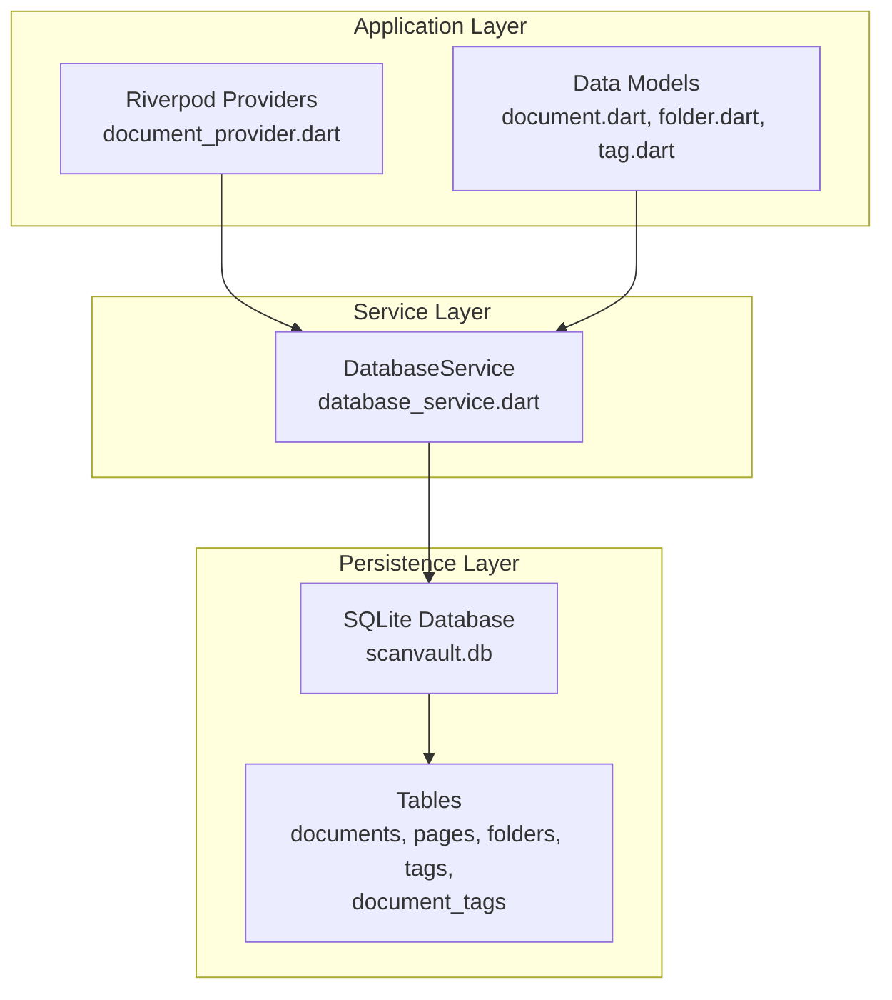

**Diagram sources**
- [database_service.dart](file://lib/services/database_service.dart#L10-L28)
- [document_provider.dart](file://lib/providers/document_provider.dart#L1-L137)
- [document.dart](file://lib/models/document.dart#L1-L49)
- [folder.dart](file://lib/models/folder.dart#L1-L21)
- [tag.dart](file://lib/models/tag.dart#L1-L17)

**Section sources**
- [database_service.dart](file://lib/services/database_service.dart#L1-L413)
- [document_provider.dart](file://lib/providers/document_provider.dart#L1-L137)
- [main.dart](file://lib/main.dart#L10-L31)

## Core Components
The DatabaseService class serves as the central orchestrator for all database operations. It maintains a static database instance, provides initialization routines, defines table schemas, and exposes CRUD methods for documents, pages, folders, and tags. The service generates UUIDs for entity identifiers and manages foreign key relationships through explicit constraints.

Key responsibilities include:
- Database initialization and version management
- Schema creation and migration handling
- CRUD operations for all entity types
- Index management for query optimization
- Foreign key constraint enforcement
- Error handling and recovery mechanisms

**Section sources**
- [database_service.dart](file://lib/services/database_service.dart#L11-L116)

## Architecture Overview
The database architecture follows a layered approach with clear separation of concerns between the application layer (Riverpod providers and models), service layer (DatabaseService), and persistence layer (SQLite). The service encapsulates all database logic, providing a clean API for the rest of the application.

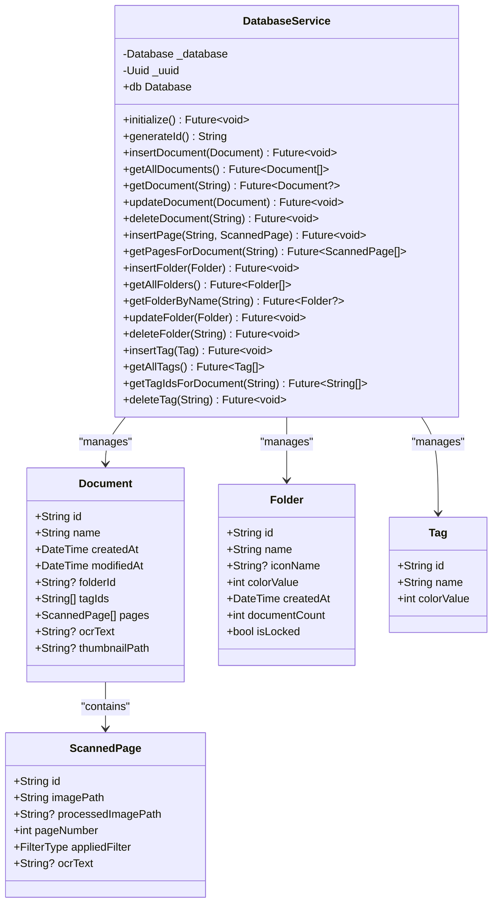

**Diagram sources**
- [database_service.dart](file://lib/services/database_service.dart#L11-L412)
- [document.dart](file://lib/models/document.dart#L16-L48)
- [folder.dart](file://lib/models/folder.dart#L7-L20)
- [tag.dart](file://lib/models/tag.dart#L6-L16)

**Section sources**
- [database_service.dart](file://lib/services/database_service.dart#L11-L412)
- [document.dart](file://lib/models/document.dart#L16-L48)
- [folder.dart](file://lib/models/folder.dart#L7-L20)
- [tag.dart](file://lib/models/tag.dart#L6-L16)

## Detailed Component Analysis

### Database Initialization and Migration
The DatabaseService initializes the SQLite database during application startup and manages version upgrades through the migration system.

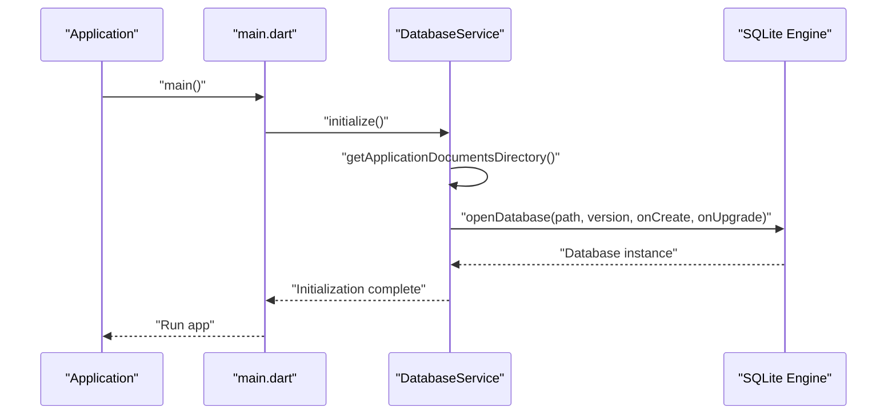

**Diagram sources**
- [main.dart](file://lib/main.dart#L20-L20)
- [database_service.dart](file://lib/services/database_service.dart#L16-L28)

Key initialization features:
- Database path resolution using path_provider
- Version management (currently v2)
- Schema creation callback
- Migration handling for version upgrades
- UUID generation for entity identifiers

**Section sources**
- [database_service.dart](file://lib/services/database_service.dart#L16-L28)
- [main.dart](file://lib/main.dart#L20-L20)

### Schema Design and Table Relationships
The database schema consists of five core tables with explicit foreign key relationships and constraints.

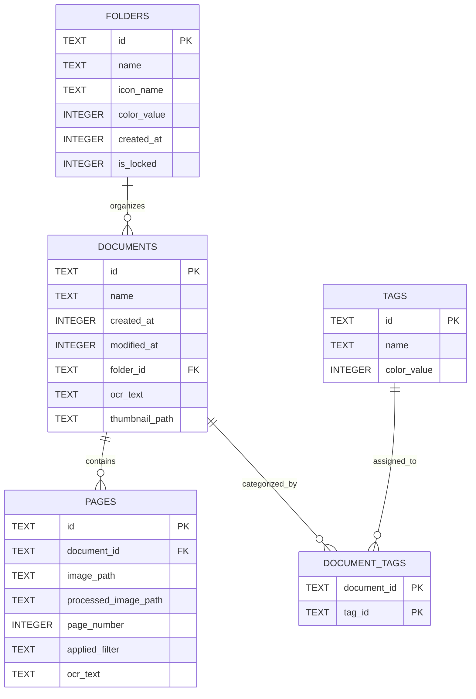

**Diagram sources**
- [database_service.dart](file://lib/services/database_service.dart#L33-L90)

Table-specific design decisions:
- **Documents table**: Primary key on id, foreign key to folders with ON DELETE SET NULL
- **Pages table**: Composite primary key (id), foreign key to documents with ON DELETE CASCADE
- **Folders table**: Primary key on id, includes is_locked flag for security
- **Tags table**: Primary key on id, stores color information for UI
- **Document_tags junction**: Composite primary key enforcing many-to-many relationship

**Section sources**
- [database_service.dart](file://lib/services/database_service.dart#L33-L90)

### CRUD Operations

#### Document Operations
Document CRUD operations involve multiple steps due to the hierarchical nature of documents containing pages and tag associations.

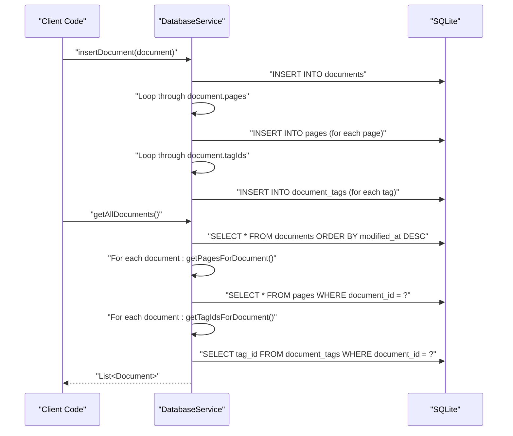

**Diagram sources**
- [database_service.dart](file://lib/services/database_service.dart#L120-L144)
- [database_service.dart](file://lib/services/database_service.dart#L147-L171)

Key implementation details:
- Document insertion triggers cascading inserts for pages and tag associations
- Retrieval operations combine multiple queries to reconstruct complete objects
- Modified timestamps are stored as epoch milliseconds for timezone independence
- Thumbnail paths are stored for quick preview generation

**Section sources**
- [database_service.dart](file://lib/services/database_service.dart#L120-L144)
- [database_service.dart](file://lib/services/database_service.dart#L147-L171)

#### Page Operations
Page operations are straightforward due to the denormalized design that stores page metadata directly in the pages table.

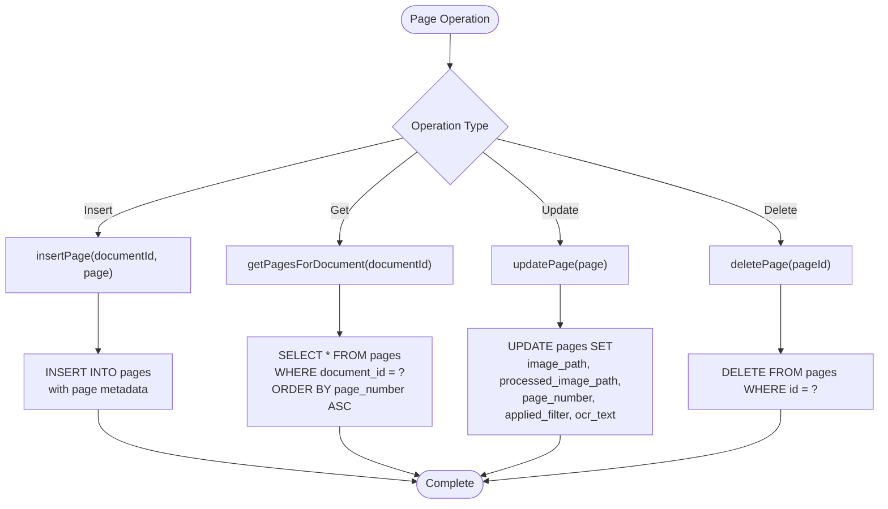

**Diagram sources**
- [database_service.dart](file://lib/services/database_service.dart#L251-L287)

**Section sources**
- [database_service.dart](file://lib/services/database_service.dart#L251-L287)

#### Folder Operations
Folder operations include specialized queries for document counting and case-insensitive name lookups.

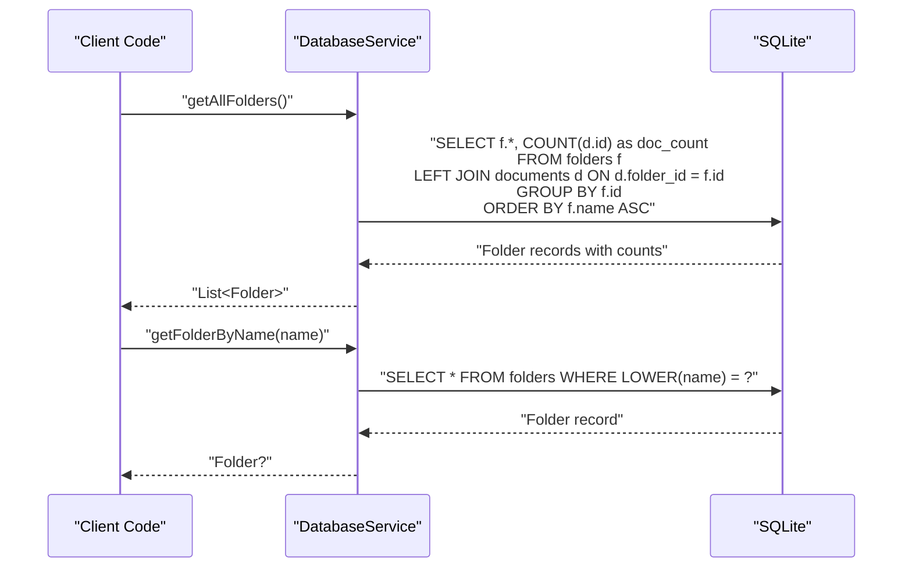

**Diagram sources**
- [database_service.dart](file://lib/services/database_service.dart#L304-L351)

**Section sources**
- [database_service.dart](file://lib/services/database_service.dart#L291-L351)

#### Tag Operations
Tag operations are simplified due to the many-to-many relationship through the document_tags junction table.

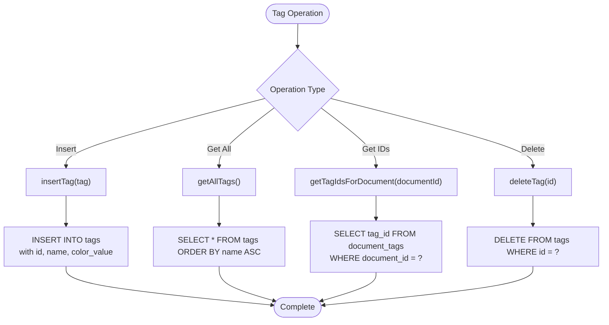

**Diagram sources**
- [database_service.dart](file://lib/services/database_service.dart#L376-L411)

**Section sources**
- [database_service.dart](file://lib/services/database_service.dart#L376-L411)

### Transaction Handling and Concurrency
The DatabaseService does not implement explicit transaction blocks. Instead, it relies on the atomic nature of individual SQL operations provided by sqflite. For operations that require multiple related inserts (like document creation), the service performs sequential operations that are executed within the same database connection context.

Concurrency considerations:
- Single database connection instance maintained as a static field
- All operations occur on the main isolate thread
- No explicit locking mechanisms implemented
- Batch operations are performed sequentially

**Section sources**
- [database_service.dart](file://lib/services/database_service.dart#L11-L13)
- [database_service.dart](file://lib/services/database_service.dart#L120-L144)

### Data Integrity and Referential Integrity
The database enforces referential integrity through foreign key constraints:

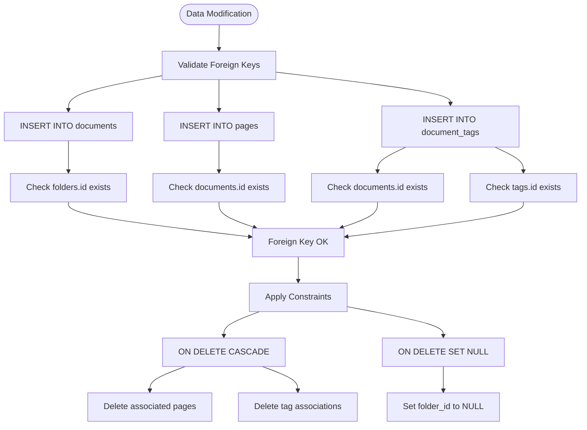

**Diagram sources**
- [database_service.dart](file://lib/services/database_service.dart#L42-L89)

Constraint enforcement mechanisms:
- **Documents to Folders**: ON DELETE SET NULL when folder is deleted
- **Pages to Documents**: ON DELETE CASCADE when document is deleted
- **Document_tags to Documents/TAGS**: ON DELETE CASCADE for both sides
- **Primary Keys**: Enforce uniqueness and identity
- **Unique Constraints**: Composite primary keys on junction table

**Section sources**
- [database_service.dart](file://lib/services/database_service.dart#L42-L89)

### Query Optimization and Indexing
The database implements strategic indexing to optimize common query patterns:

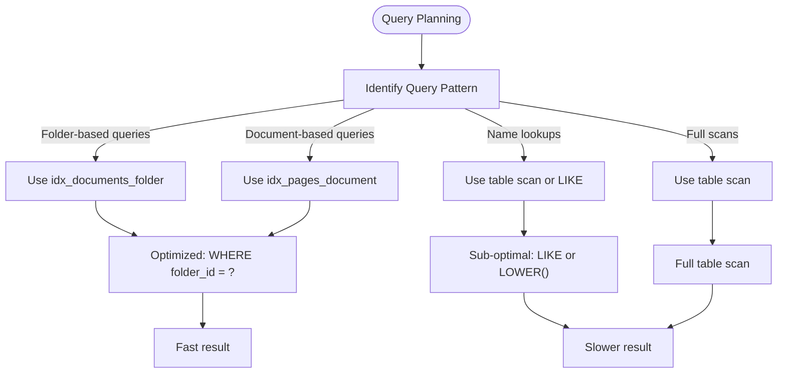

**Diagram sources**
- [database_service.dart](file://lib/services/database_service.dart#L93-L96)
- [database_service.dart](file://lib/services/database_service.dart#L197-L203)

Current indexing strategy:
- **idx_documents_folder**: Optimizes folder-based document queries
- **idx_pages_document**: Optimates page retrieval by document
- **Missing indexes**: Could benefit from indexes on created_at, modified_at, and tag name columns

**Section sources**
- [database_service.dart](file://lib/services/database_service.dart#L93-L96)
- [database_service.dart](file://lib/services/database_service.dart#L197-L203)

### Migration Strategies and Version Management
The database uses a version-based migration system with explicit upgrade handling:

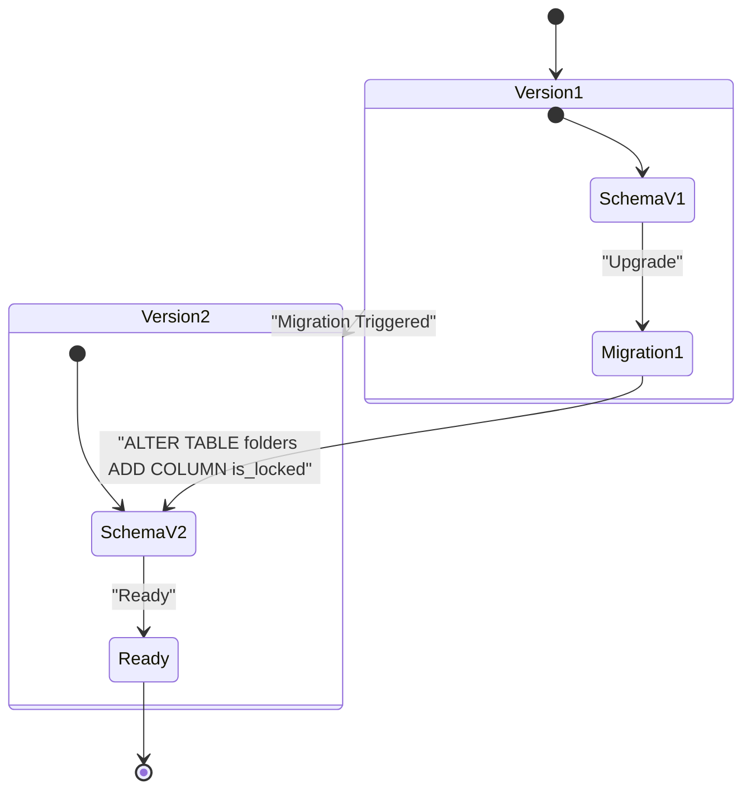

**Diagram sources**
- [database_service.dart](file://lib/services/database_service.dart#L24-L27)
- [database_service.dart](file://lib/services/database_service.dart#L100-L105)

Migration implementation:
- Current version: 2
- Migration from 1→2: Adds is_locked column to folders table
- Default value: 0 (unlocked)
- Backward compatibility: Newer schema can handle older data

**Section sources**
- [database_service.dart](file://lib/services/database_service.dart#L24-L27)
- [database_service.dart](file://lib/services/database_service.dart#L100-L105)

### Error Handling and Recovery Mechanisms
Error handling in the DatabaseService follows a defensive approach:

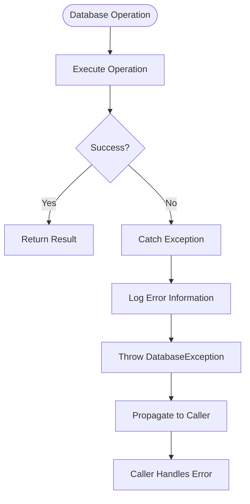

**Diagram sources**
- [database_service.dart](file://lib/services/database_service.dart#L108-L113)
- [app_exceptions.dart](file://lib/core/exceptions/app_exceptions.dart#L56-L61)

Error handling characteristics:
- **Database not initialized**: Throws StateError with initialization guidance
- **DatabaseException**: Specific exception type for database-related failures
- **Caller responsibility**: Exceptions bubble up to Riverpod providers for UI handling
- **No automatic retry**: Application-level retry logic not implemented

**Section sources**
- [database_service.dart](file://lib/services/database_service.dart#L108-L113)
- [app_exceptions.dart](file://lib/core/exceptions/app_exceptions.dart#L56-L61)

## Dependency Analysis
The DatabaseService has minimal external dependencies and clear internal relationships:

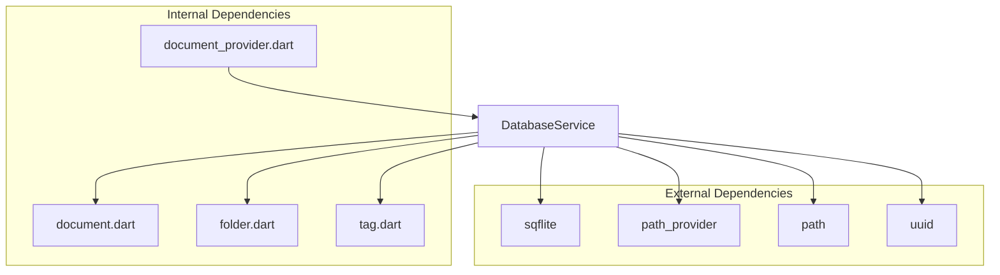

**Diagram sources**
- [database_service.dart](file://lib/services/database_service.dart#L1-L8)
- [document_provider.dart](file://lib/providers/document_provider.dart#L1-L6)

Dependency relationships:
- **sqflite**: Core database operations
- **path_provider**: File system path resolution
- **path**: Path manipulation utilities
- **uuid**: Unique identifier generation
- **Models**: Data structure definitions
- **Providers**: State management integration

**Section sources**
- [database_service.dart](file://lib/services/database_service.dart#L1-L8)
- [document_provider.dart](file://lib/providers/document_provider.dart#L1-L6)

## Performance Considerations
Several optimization opportunities exist for improving database performance:

### Current Performance Characteristics
- **Query patterns**: Most queries use equality conditions on indexed columns
- **Join complexity**: Queries are relatively simple with minimal joins
- **Data volume**: Document-centric design keeps related data together
- **Index coverage**: Strategic indexing on foreign key columns

### Recommended Optimizations
1. **Add additional indexes**:
   - `idx_documents_created_at` for chronological queries
   - `idx_documents_modified_at` for sorting by modification date
   - `idx_tags_name` for tag-based searches
   - `idx_folders_name` for folder name lookups

2. **Optimize LIKE queries**:
   - Replace `LOWER(name) = ?` with case-insensitive collation
   - Consider full-text search capabilities for OCR text

3. **Batch operations**:
   - Implement batch insert for multiple documents/pages
   - Use transactions for multi-entity operations

4. **Connection pooling**:
   - Consider connection reuse for high-frequency operations
   - Implement connection timeout handling

5. **Memory management**:
   - Stream large result sets instead of loading all at once
   - Implement pagination for document lists

[No sources needed since this section provides general guidance]

## Troubleshooting Guide
Common issues and their resolutions:

### Database Initialization Issues
**Problem**: Database not initialized error
**Solution**: Ensure `DatabaseService.initialize()` is called before any database operations
**Prevention**: Call initialization in application startup

### Migration Failures
**Problem**: Migration errors when upgrading
**Solution**: Verify migration script correctness and database backup
**Prevention**: Test migrations on staging environments

### Query Performance Issues
**Problem**: Slow queries on large datasets
**Solution**: Add appropriate indexes and optimize query patterns
**Prevention**: Monitor query execution plans

### Data Consistency Problems
**Problem**: Referential integrity violations
**Solution**: Review foreign key constraints and cascade rules
**Prevention**: Implement proper transaction boundaries

**Section sources**
- [database_service.dart](file://lib/services/database_service.dart#L108-L113)
- [app_exceptions.dart](file://lib/core/exceptions/app_exceptions.dart#L56-L61)

## Conclusion
The DatabaseService provides a robust foundation for the ScanVault application's data persistence needs. The schema design effectively balances normalization with practical query patterns, while foreign key constraints ensure data integrity. The service demonstrates good architectural practices through clear separation of concerns, comprehensive CRUD operations, and thoughtful indexing strategies.

Key strengths include:
- Well-designed schema with appropriate foreign key relationships
- Strategic indexing for common query patterns
- Comprehensive CRUD operations for all entity types
- Clean initialization and migration handling
- Defensive error handling with clear exception types

Areas for potential improvement include additional indexing for performance optimization, batch operation support, and enhanced query optimization for complex scenarios. The current implementation provides a solid foundation that can scale with application growth while maintaining data integrity and performance.