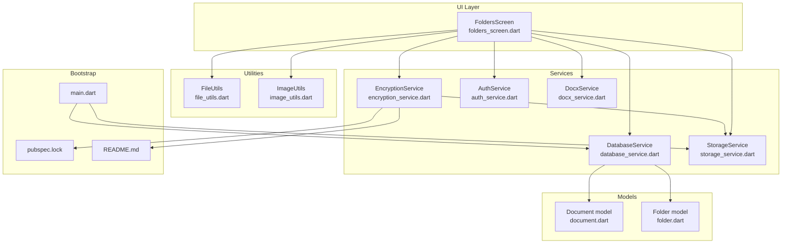
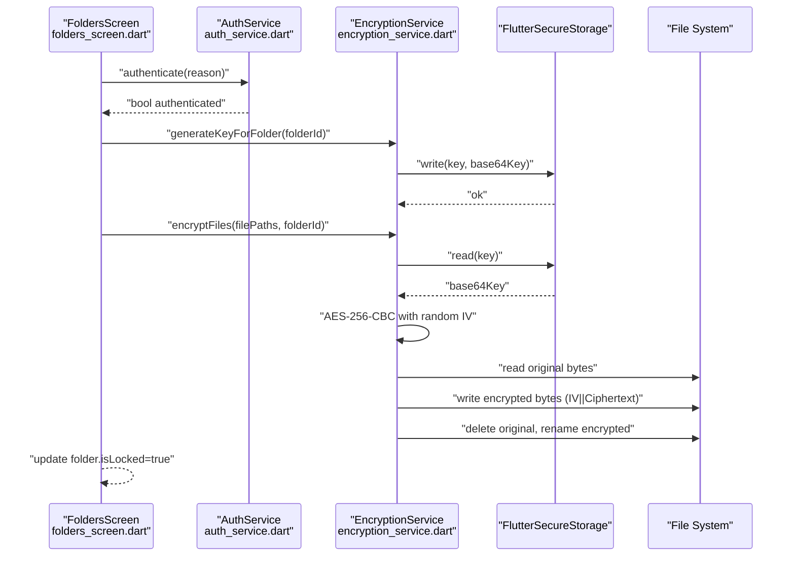
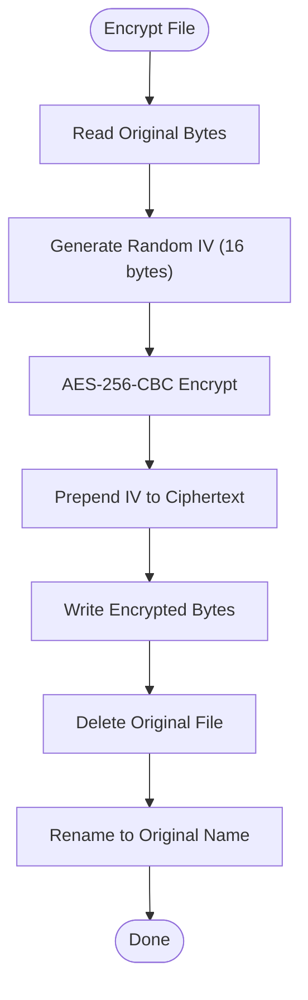
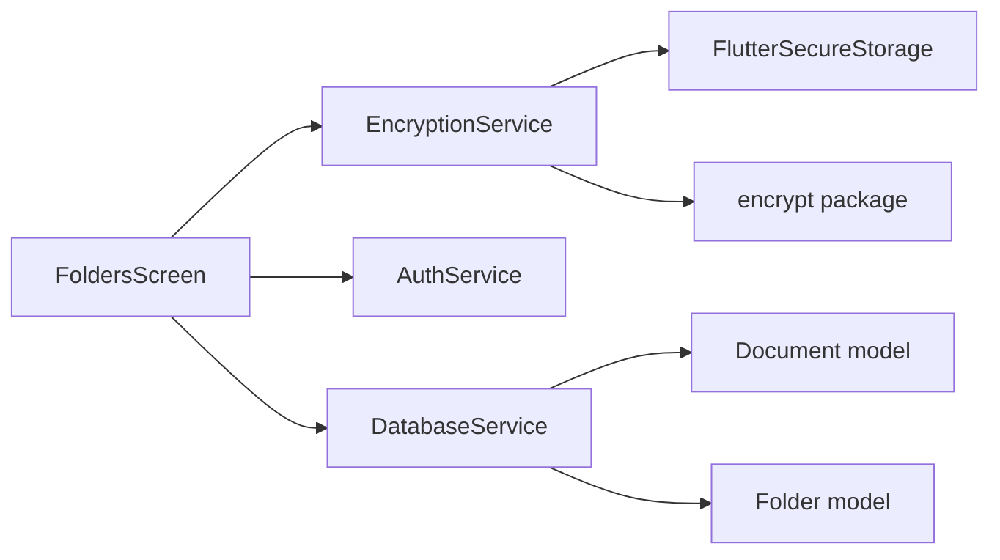

# Encryption Service

<cite>
**Referenced Files in This Document**
- [encryption_service.dart](file://lib/services/encryption_service.dart)
- [auth_service.dart](file://lib/services/auth_service.dart)
- [folders_screen.dart](file://lib/screens/folders/folders_screen.dart)
- [database_service.dart](file://lib/services/database_service.dart)
- [storage_service.dart](file://lib/services/storage_service.dart)
- [file_utils.dart](file://lib/core/utils/file_utils.dart)
- [image_utils.dart](file://lib/core/utils/image_utils.dart)
- [document.dart](file://lib/models/document.dart)
- [folder.dart](file://lib/models/folder.dart)
- [docx_service.dart](file://lib/services/docx_service.dart)
- [main.dart](file://lib/main.dart)
- [pubspec.lock](file://pubspec.lock)
- [README.md](file://README.md)
</cite>

## Table of Contents
1. [Introduction](#introduction)
2. [Project Structure](#project-structure)
3. [Core Components](#core-components)
4. [Architecture Overview](#architecture-overview)
5. [Detailed Component Analysis](#detailed-component-analysis)
6. [Dependency Analysis](#dependency-analysis)
7. [Performance Considerations](#performance-considerations)
8. [Troubleshooting Guide](#troubleshooting-guide)
9. [Security Best Practices and Compliance](#security-best-practices-and-compliance)
10. [Conclusion](#conclusion)
11. [Appendices](#appendices)

## Introduction
This document provides comprehensive technical documentation for the Encryption Service implementation in the project. It explains the cryptographic algorithms used for protecting stored content, the key management and secure storage mechanisms, and the encryption workflows for documents and images. It also covers password-based strategies, salt generation, performance optimization for large files, error handling, security best practices, compliance considerations, and integration with storage and authentication systems.

## Project Structure
The encryption service is part of a Flutter application focused on scanned document management with optional locking and encryption for folders. The relevant components are organized as follows:
- Services: encryption_service.dart, auth_service.dart, database_service.dart, storage_service.dart, docx_service.dart
- UI Screens: folders_screen.dart orchestrates folder locking/unlocking and triggers encryption/decryption
- Models: document.dart, folder.dart define the data structures for documents and folders
- Utilities: file_utils.dart, image_utils.dart handle file and image operations
- Application bootstrap: main.dart initializes services and routes
- Dependencies: pubspec.lock and README.md enumerate cryptographic and security-related packages

**Diagram sources**
- [folders_screen.dart](file://lib/screens/folders/folders_screen.dart#L536-L620)
- [encryption_service.dart](file://lib/services/encryption_service.dart#L1-L150)
- [auth_service.dart](file://lib/services/auth_service.dart#L1-L63)
- [database_service.dart](file://lib/services/database_service.dart#L1-L413)
- [storage_service.dart](file://lib/services/storage_service.dart#L1-L63)
- [docx_service.dart](file://lib/services/docx_service.dart#L1-L347)
- [document.dart](file://lib/models/document.dart#L1-L49)
- [folder.dart](file://lib/models/folder.dart#L1-L21)
- [file_utils.dart](file://lib/core/utils/file_utils.dart#L1-L59)
- [image_utils.dart](file://lib/core/utils/image_utils.dart#L1-L62)
- [main.dart](file://lib/main.dart#L10-L31)
- [pubspec.lock](file://pubspec.lock#L429-L470)
- [README.md](file://README.md#L128-L194)

**Section sources**
- [encryption_service.dart](file://lib/services/encryption_service.dart#L1-L150)
- [folders_screen.dart](file://lib/screens/folders/folders_screen.dart#L536-L620)
- [database_service.dart](file://lib/services/database_service.dart#L1-L413)
- [storage_service.dart](file://lib/services/storage_service.dart#L1-L63)
- [file_utils.dart](file://lib/core/utils/file_utils.dart#L1-L59)
- [image_utils.dart](file://lib/core/utils/image_utils.dart#L1-L62)
- [main.dart](file://lib/main.dart#L10-L31)
- [pubspec.lock](file://pubspec.lock#L429-L470)
- [README.md](file://README.md#L128-L194)

## Core Components
- EncryptionService: Implements AES-256-CBC encryption with per-folder keys, IV prepending, and secure key storage via FlutterSecureStorage. Provides encryptFile, decryptFile, batch operations, and encrypted-file detection.
- AuthService: Handles biometric and device credential authentication for folder lock/unlock operations.
- DatabaseService: Manages document and folder metadata, including folder locking state and document-page relationships.
- StorageService: Determines storage location for files and integrates with shared preferences for custom storage paths.
- FoldersScreen: Orchestrates user interactions to lock/unlock folders, generating keys and invoking encryption/decryption on folder contents.
- Models: Document and Folder encapsulate metadata and folder lock state used by encryption workflows.
- Utilities: FileUtils and ImageUtils support file operations and image processing used in document workflows.

**Section sources**
- [encryption_service.dart](file://lib/services/encryption_service.dart#L1-L150)
- [auth_service.dart](file://lib/services/auth_service.dart#L1-L63)
- [database_service.dart](file://lib/services/database_service.dart#L1-L413)
- [storage_service.dart](file://lib/services/storage_service.dart#L1-L63)
- [folders_screen.dart](file://lib/screens/folders/folders_screen.dart#L536-L620)
- [document.dart](file://lib/models/document.dart#L1-L49)
- [folder.dart](file://lib/models/folder.dart#L1-L21)
- [file_utils.dart](file://lib/core/utils/file_utils.dart#L1-L59)
- [image_utils.dart](file://lib/core/utils/image_utils.dart#L1-L62)

## Architecture Overview
The encryption architecture centers on per-folder AES-256 keys stored securely and used to encrypt individual file contents. The UI triggers authentication and encryption operations, while the database tracks folder lock state and document metadata.

**Diagram sources**
- [folders_screen.dart](file://lib/screens/folders/folders_screen.dart#L572-L620)
- [auth_service.dart](file://lib/services/auth_service.dart#L26-L52)
- [encryption_service.dart](file://lib/services/encryption_service.dart#L15-L77)
- [encryption_service.dart](file://lib/services/encryption_service.dart#L9-L13)

## Detailed Component Analysis

### EncryptionService
- Cryptographic primitives:
  - AES-256 in CBC mode using the encrypt package.
  - Random IV generation per encryption operation.
  - IV prepended to ciphertext for deterministic decryption.
- Key management:
  - Keys are 32-byte (256-bit) random values.
  - Stored as base64-encoded strings in FlutterSecureStorage under keys prefixed by folder identifiers.
  - Keys persist per folder and are deleted when the folder’s key is removed.
- File encryption workflow:
  - Reads file bytes, generates a random IV, encrypts, writes IV||Ciphertext, deletes original, renames to original name.
- File decryption workflow:
  - Reads file bytes, extracts IV (first 16 bytes), extracts ciphertext, decrypts, writes decrypted file, deletes encrypted, renames to original name.
- Batch operations:
  - encryptFiles and decryptFiles iterate over lists of file paths.
- Encrypted file detection:
  - isFileEncrypted checks if a file has at least 17 bytes (IV + at least one byte of data).

**Diagram sources**
- [encryption_service.dart](file://lib/services/encryption_service.dart#L38-L77)

**Section sources**
- [encryption_service.dart](file://lib/services/encryption_service.dart#L1-L150)

### AuthService
- Provides biometric and device credential authentication.
- Used to authorize folder lock/unlock actions before key generation or encryption/decryption.

**Section sources**
- [auth_service.dart](file://lib/services/auth_service.dart#L1-L63)

### DatabaseService and Models
- DatabaseService manages documents, pages, folders, and tags, including the folder is_locked flag.
- Models Document and Folder carry metadata used by encryption workflows (e.g., folderId, page image paths).

**Section sources**
- [database_service.dart](file://lib/services/database_service.dart#L1-L413)
- [document.dart](file://lib/models/document.dart#L1-L49)
- [folder.dart](file://lib/models/folder.dart#L1-L21)

### StorageService and File/Image Utilities
- StorageService determines storage directories and persists custom storage paths.
- FileUtils and ImageUtils support saving, copying, resizing, rotating, and thumbnail generation for scanned images.

**Section sources**
- [storage_service.dart](file://lib/services/storage_service.dart#L1-L63)
- [file_utils.dart](file://lib/core/utils/file_utils.dart#L1-L59)
- [image_utils.dart](file://lib/core/utils/image_utils.dart#L1-L62)

### FoldersScreen Integration
- Locks a folder by authenticating the user, generating a folder-specific key, and encrypting all page image paths belonging to that folder.
- Unlocks a folder by authenticating the user and decrypting all page image paths.

**Section sources**
- [folders_screen.dart](file://lib/screens/folders/folders_screen.dart#L536-L620)

### DOCX Export Service
- DocxService generates exportable documents from scanned pages and optional OCR text, independent of encryption. It does not encrypt exported content.

**Section sources**
- [docx_service.dart](file://lib/services/docx_service.dart#L1-L347)

## Dependency Analysis
- External cryptography and secure storage:
  - encrypt package for AES-256-CBC.
  - flutter_secure_storage for platform-backed secure key storage.
- Internal dependencies:
  - EncryptionService depends on FlutterSecureStorage for key persistence.
  - FoldersScreen depends on AuthService and EncryptionService for folder lifecycle.
  - DatabaseService provides folder/document metadata used by encryption workflows.

**Diagram sources**
- [encryption_service.dart](file://lib/services/encryption_service.dart#L1-L150)
- [auth_service.dart](file://lib/services/auth_service.dart#L1-L63)
- [folders_screen.dart](file://lib/screens/folders/folders_screen.dart#L536-L620)
- [database_service.dart](file://lib/services/database_service.dart#L1-L413)
- [document.dart](file://lib/models/document.dart#L1-L49)
- [folder.dart](file://lib/models/folder.dart#L1-L21)

**Section sources**
- [pubspec.lock](file://pubspec.lock#L429-L470)
- [README.md](file://README.md#L128-L194)

## Performance Considerations
- Large file handling:
  - Current implementation reads entire files into memory before encryption/decryption. For very large files, consider streaming encryption/decryption to reduce peak memory usage.
- IV management:
  - IVs are randomly generated per file and prepended to the ciphertext. This avoids the need for external IV storage but increases ciphertext size by 16 bytes per file.
- Batch operations:
  - encryptFiles and decryptFiles iterate sequentially. For large batches, consider concurrent processing with controlled concurrency limits to balance throughput and resource usage.
- File I/O:
  - Temporary intermediate files are written during encryption/decryption. Ensure sufficient disk space and avoid unnecessary copies by renaming in place where feasible.
- Image processing:
  - ImageUtils performs decoding and encoding operations. For high-throughput scenarios, consider caching decoded images and reusing buffers to minimize allocations.

[No sources needed since this section provides general guidance]

## Troubleshooting Guide
- Encryption key not found:
  - Symptom: Exception thrown when attempting to encrypt/decrypt without a folder key.
  - Resolution: Ensure the folder is locked (key generated) before encryption; verify key retrieval via getKeyForFolder.
- Decryption failure:
  - Symptom: Decryption errors when IV extraction or ciphertext parsing fails.
  - Resolution: Confirm the file is encrypted (IV prepended) and the correct folderId is used; verify key integrity.
- Authentication failures:
  - Symptom: Unable to lock/unlock folder due to authentication errors.
  - Resolution: Check biometric availability and device support; handle platform exceptions gracefully.
- File existence and permissions:
  - Symptom: Errors when reading/writing files.
  - Resolution: Verify file paths, existence, and write permissions; ensure storage directories are created.

**Section sources**
- [encryption_service.dart](file://lib/services/encryption_service.dart#L40-L44)
- [encryption_service.dart](file://lib/services/encryption_service.dart#L82-L85)
- [auth_service.dart](file://lib/services/auth_service.dart#L44-L51)
- [folders_screen.dart](file://lib/screens/folders/folders_screen.dart#L536-L620)

## Security Best Practices and Compliance
- Cryptographic algorithms:
  - AES-256-CBC with random IVs is used. Ensure IVs are never reused with the same key for the same plaintext.
- Key management:
  - Keys are stored securely via FlutterSecureStorage. Avoid logging or exposing keys. Consider periodic key rotation by generating new keys and re-encrypting stored data.
- Salt generation:
  - No password-derived keys are used in the current implementation. If password-based encryption is introduced, use a strong KDF (e.g., PBKDF2, Argon2) with a random salt per key derivation.
- Password-based strategies:
  - If adding password-based encryption, derive keys from user passwords using a slow, memory-hard KDF and store salts alongside keys.
- Secure deletion:
  - The current implementation deletes original files after encryption. For secure deletion, overwrite files with random data before deletion to prevent recovery.
- Audit and monitoring:
  - Log encryption/decryption events with timestamps and folder IDs for audit trails. Avoid logging sensitive data.
- Compliance:
  - Align key lifecycle policies with applicable regulations (e.g., data-at-rest protection). Ensure biometric enrollment and consent mechanisms meet policy requirements.

[No sources needed since this section provides general guidance]

## Conclusion
The Encryption Service implements robust per-folder AES-256-CBC encryption with secure key storage and integrates tightly with authentication and document management. While the current design focuses on file content protection, future enhancements could include password-based encryption, key rotation, and secure deletion mechanisms to further strengthen security posture.

[No sources needed since this section summarizes without analyzing specific files]

## Appendices

### Example Workflows

- Lock a folder:
  - Authenticate user.
  - Generate folder key and store it securely.
  - Retrieve all document page image paths for the folder.
  - Encrypt all page images in-place.
  - Update folder lock state.

- Unlock a folder:
  - Authenticate user.
  - Retrieve folder key.
  - Decrypt all page images in-place.
  - Update folder lock state.

- Export a document to DOCX:
  - Collect page images and optional OCR text.
  - Package into a DOCX archive without encryption.

**Section sources**
- [folders_screen.dart](file://lib/screens/folders/folders_screen.dart#L572-L620)
- [docx_service.dart](file://lib/services/docx_service.dart#L20-L134)

### Integration Points
- Bootstrap initialization ensures database and storage services are ready before UI interactions.
- EncryptionService relies on FlutterSecureStorage and the encrypt package for cryptographic operations.

**Section sources**
- [main.dart](file://lib/main.dart#L10-L31)
- [encryption_service.dart](file://lib/services/encryption_service.dart#L1-L150)
- [pubspec.lock](file://pubspec.lock#L429-L470)
- [README.md](file://README.md#L128-L194)