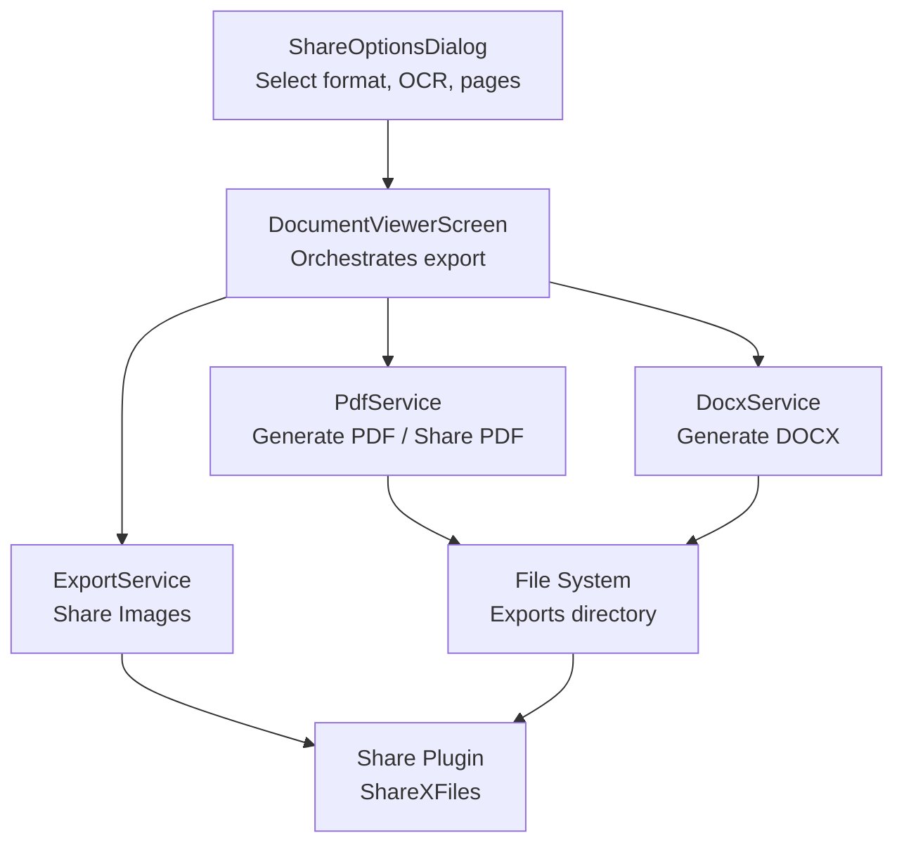
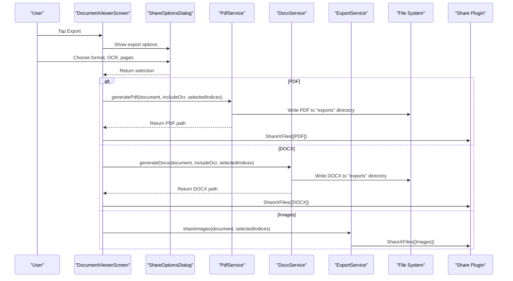
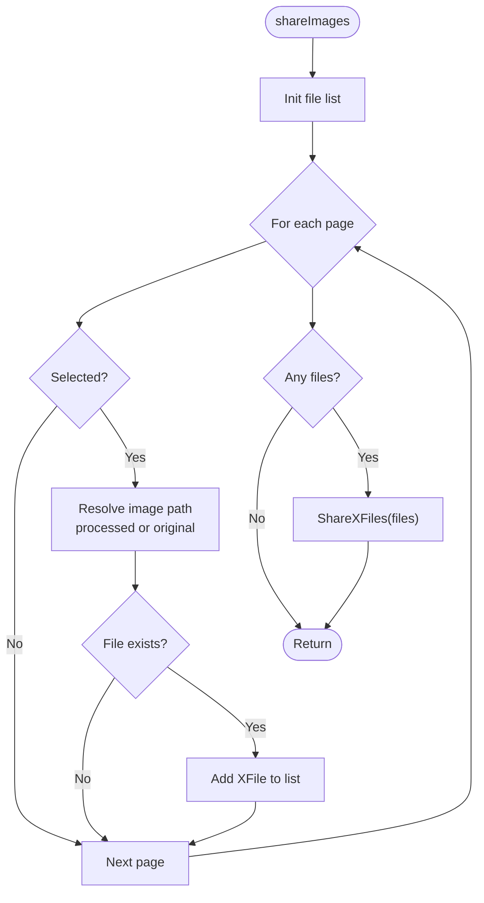
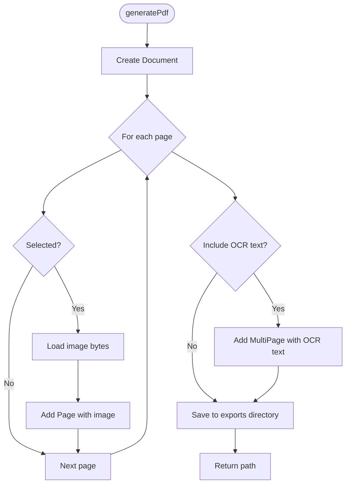
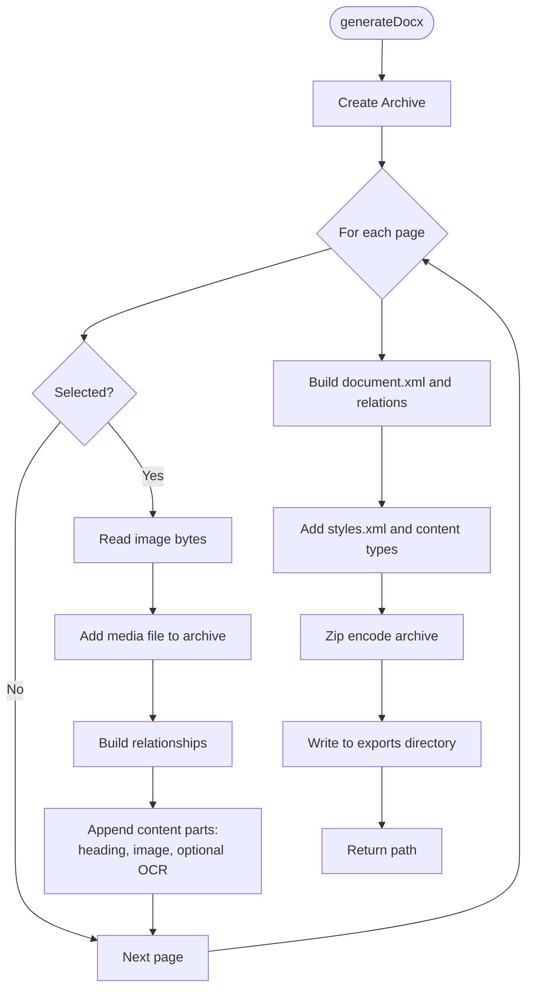
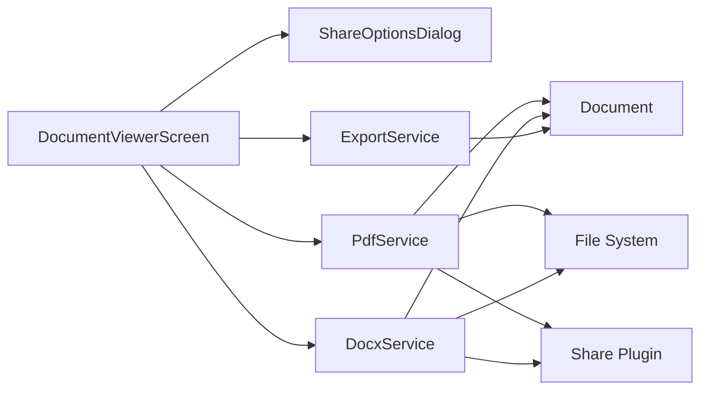

# Export Service

<cite>
**Referenced Files in This Document**
- [export_service.dart](file://lib/services/export_service.dart)
- [pdf_service.dart](file://lib/services/pdf_service.dart)
- [docx_service.dart](file://lib/services/docx_service.dart)
- [document.dart](file://lib/models/document.dart)
- [share_options_dialog.dart](file://lib/screens/document_viewer/share_options_dialog.dart)
- [document_viewer_screen.dart](file://lib/screens/document_viewer/document_viewer_screen.dart)
- [app_exceptions.dart](file://lib/core/exceptions/app_exceptions.dart)
- [storage_service.dart](file://lib/services/storage_service.dart)
- [filter_service.dart](file://lib/services/filter_service.dart)
- [app_en.arb](file://lib/l10n/app_en.arb)
</cite>

## Table of Contents
1. [Introduction](#introduction)
2. [Project Structure](#project-structure)
3. [Core Components](#core-components)
4. [Architecture Overview](#architecture-overview)
5. [Detailed Component Analysis](#detailed-component-analysis)
6. [Dependency Analysis](#dependency-analysis)
7. [Performance Considerations](#performance-considerations)
8. [Troubleshooting Guide](#troubleshooting-guide)
9. [Conclusion](#conclusion)
10. [Appendices](#appendices)

## Introduction
This document describes the Export Service implementation for transforming scanned documents into multiple formats. It covers supported export formats (PDF, DOCX, and Images), batch export operations, quality and compression strategies, document assembly and page ordering, metadata handling, file naming and directory management, conflict resolution, performance optimization, error handling, and integration with sharing systems. It also outlines customization options and format-specific features.

## Project Structure
The export functionality spans several services and UI components:
- Services: ExportService (image sharing), PdfService (PDF generation and sharing), DocxService (DOCX generation)
- Models: Document and ScannedPage define the document structure and page metadata
- UI: ShareOptionsDialog (selection of format, OCR inclusion, and page indices), DocumentViewerScreen (orchestrates export)
- Exceptions: ExportException centralizes export-related errors
- Storage: StorageService manages storage locations and file paths
- Filters: FilterService provides image enhancement used by export pipeline

**Diagram sources**
- [share_options_dialog.dart](file://lib/screens/document_viewer/share_options_dialog.dart#L1-L197)
- [document_viewer_screen.dart](file://lib/screens/document_viewer/document_viewer_screen.dart#L147-L200)
- [pdf_service.dart](file://lib/services/pdf_service.dart#L16-L96)
- [docx_service.dart](file://lib/services/docx_service.dart#L20-L134)
- [export_service.dart](file://lib/services/export_service.dart#L10-L40)

**Section sources**
- [share_options_dialog.dart](file://lib/screens/document_viewer/share_options_dialog.dart#L1-L197)
- [document_viewer_screen.dart](file://lib/screens/document_viewer/document_viewer_screen.dart#L147-L200)
- [pdf_service.dart](file://lib/services/pdf_service.dart#L1-L187)
- [docx_service.dart](file://lib/services/docx_service.dart#L1-L347)
- [export_service.dart](file://lib/services/export_service.dart#L1-L42)

## Core Components
- ExportService: Shares selected images directly via platform sharing APIs.
- PdfService: Builds PDFs from scanned pages, optionally includes OCR text as an additional page, and supports sharing or printing.
- DocxService: Generates DOCX by assembling pages with images and optional OCR text, maintaining page order and relationships.
- Document and ScannedPage: Define document metadata, page numbering, and image paths (original and processed).
- ShareOptionsDialog: Provides UI to select export format, include OCR text, and choose pages.
- StorageService: Manages storage directory and file path creation.
- FilterService: Supplies processed images used by export pipeline.

**Section sources**
- [export_service.dart](file://lib/services/export_service.dart#L6-L42)
- [pdf_service.dart](file://lib/services/pdf_service.dart#L12-L187)
- [docx_service.dart](file://lib/services/docx_service.dart#L11-L347)
- [document.dart](file://lib/models/document.dart#L16-L49)
- [share_options_dialog.dart](file://lib/screens/document_viewer/share_options_dialog.dart#L5-L24)
- [storage_service.dart](file://lib/services/storage_service.dart#L12-L62)
- [filter_service.dart](file://lib/services/filter_service.dart#L7-L106)

## Architecture Overview
The export workflow begins in the Document Viewer UI. Users select export options, after which the appropriate service generates the file and shares it. PDF and DOCX generation write to an exports directory under the application’s documents directory. Image sharing uses platform sharing APIs directly with file paths.

**Diagram sources**
- [document_viewer_screen.dart](file://lib/screens/document_viewer/document_viewer_screen.dart#L147-L200)
- [share_options_dialog.dart](file://lib/screens/document_viewer/share_options_dialog.dart#L19-L197)
- [pdf_service.dart](file://lib/services/pdf_service.dart#L16-L96)
- [docx_service.dart](file://lib/services/docx_service.dart#L20-L134)
- [export_service.dart](file://lib/services/export_service.dart#L10-L40)

## Detailed Component Analysis

### ExportService (Images)
Responsibilities:
- Share selected images from a document.
- Supports selective page indices.
- Uses platform sharing APIs to share files.

Key behaviors:
- Iterates over pages, checks selection, resolves to processed or original image path, validates existence, and shares via XFile.
- Does not perform compression or quality adjustments; relies on existing image paths.

**Diagram sources**
- [export_service.dart](file://lib/services/export_service.dart#L10-L40)

**Section sources**
- [export_service.dart](file://lib/services/export_service.dart#L6-L42)

### PdfService (PDF)
Responsibilities:
- Generate PDF from scanned pages.
- Optionally include OCR text as a separate page.
- Support sharing and printing.

Generation process:
- Iterates pages, selects by index, loads image bytes, adds as a centered page.
- Optionally adds a multi-page text section with header/footer.
- Writes to an exports directory under the application documents directory.

Quality and compression:
- Uses image bytes loaded from disk; no explicit compression performed during PDF generation.
- PDF library constructs the document; no additional compression step is implemented.

Page ordering and metadata:
- Pages are appended in document order.
- OCR text page is appended after images if requested.
- No document-level metadata (title, author) is set in the PDF.

**Diagram sources**
- [pdf_service.dart](file://lib/services/pdf_service.dart#L16-L96)

**Section sources**
- [pdf_service.dart](file://lib/services/pdf_service.dart#L12-L187)
- [document.dart](file://lib/models/document.dart#L35-L49)

### DocxService (DOCX)
Responsibilities:
- Generate DOCX from scanned pages with images and optional OCR text.
- Maintain page order and relationships.
- Assemble required DOCX structure (XML parts, relationships, content types).

Generation process:
- Iterates pages, selects by index, reads image bytes, assigns unique image filenames, builds relationships.
- Creates document XML with title, page breaks, and optional OCR text blocks.
- Adds minimal styles and content types, encodes as ZIP archive.

Quality and compression:
- Images are embedded as-is from the document; no additional compression is applied.
- DOCX is a container format; no further compression step is implemented.

Page ordering and metadata:
- Pages are ordered as in the document.
- OCR text appears below the image per page when included.
- No document-level metadata is set in the generated DOCX.

**Diagram sources**
- [docx_service.dart](file://lib/services/docx_service.dart#L20-L134)

**Section sources**
- [docx_service.dart](file://lib/services/docx_service.dart#L11-L347)
- [document.dart](file://lib/models/document.dart#L35-L49)

### Document and ScannedPage Models
- Document: Contains document-level metadata, pages list, optional OCR text, and thumbnail path.
- ScannedPage: Holds image paths (original and processed), page number, applied filter, and optional OCR text.

These models drive export by providing:
- Page ordering and indices for batch operations.
- Image paths for PDF/DOCX generation and image sharing.
- OCR text availability for inclusion in PDF/DOCX.

**Section sources**
- [document.dart](file://lib/models/document.dart#L16-L49)

### ShareOptionsDialog (Selection UI)
- Allows choosing export format (PDF, DOCX, Images).
- Toggles inclusion of OCR text (disabled for Images).
- Enables selecting specific pages or all pages.
- Returns selection to the viewer for orchestration.

**Section sources**
- [share_options_dialog.dart](file://lib/screens/document_viewer/share_options_dialog.dart#L5-L24)
- [share_options_dialog.dart](file://lib/screens/document_viewer/share_options_dialog.dart#L40-L197)
- [app_en.arb](file://lib/l10n/app_en.arb#L83-L95)

### DocumentViewerScreen (Orchestration)
- Presents ShareOptionsDialog and executes export based on user selection.
- Calls PdfService, DocxService, or ExportService accordingly.
- Handles errors and updates UI state during processing.

**Section sources**
- [document_viewer_screen.dart](file://lib/screens/document_viewer/document_viewer_screen.dart#L147-L200)

### StorageService (Directory Management)
- Provides storage directory resolution (default or custom).
- Ensures export directory exists under the resolved storage path.
- Offers helpers to compute file paths.

Note: PDF and DOCX generation write to an exports subdirectory under the application documents directory, while StorageService manages a different base path. This separation avoids conflicts and keeps export artifacts organized.

**Section sources**
- [storage_service.dart](file://lib/services/storage_service.dart#L12-L62)
- [pdf_service.dart](file://lib/services/pdf_service.dart#L78-L92)
- [docx_service.dart](file://lib/services/docx_service.dart#L114-L130)

### FilterService (Image Enhancement)
- Supplies processed images used by export pipeline.
- Applies filters and returns JPEG-encoded bytes with quality settings.
- Used indirectly by export services when processed images are available.

**Section sources**
- [filter_service.dart](file://lib/services/filter_service.dart#L10-L27)
- [filter_service.dart](file://lib/services/filter_service.dart#L69-L93)

## Dependency Analysis
- DocumentViewerScreen depends on ShareOptionsDialog, PdfService, DocxService, and ExportService.
- PdfService and DocxService depend on Document model and file system utilities.
- ExportService depends on platform sharing APIs.
- StorageService provides storage directory abstraction.
- FilterService supplies processed images used by export pipeline.

**Diagram sources**
- [document_viewer_screen.dart](file://lib/screens/document_viewer/document_viewer_screen.dart#L147-L200)
- [pdf_service.dart](file://lib/services/pdf_service.dart#L16-L96)
- [docx_service.dart](file://lib/services/docx_service.dart#L20-L134)
- [export_service.dart](file://lib/services/export_service.dart#L10-L40)
- [document.dart](file://lib/models/document.dart#L16-L49)

**Section sources**
- [document_viewer_screen.dart](file://lib/screens/document_viewer/document_viewer_screen.dart#L147-L200)
- [pdf_service.dart](file://lib/services/pdf_service.dart#L12-L187)
- [docx_service.dart](file://lib/services/docx_service.dart#L11-L347)
- [export_service.dart](file://lib/services/export_service.dart#L6-L42)
- [document.dart](file://lib/models/document.dart#L16-L49)

## Performance Considerations
- Large document exports:
  - PDF/DOCX generation load image bytes into memory; for very large documents, consider streaming or chunking strategies if feasible within the PDF/DOCX libraries used.
  - Batch operations: Use selected page indices to limit work to required pages.
- Memory management:
  - Avoid retaining large image buffers longer than necessary; release references after writing to disk.
  - Prefer decoding images once and reusing where possible.
- Compression:
  - PDF generation does not apply additional compression; images are embedded as loaded.
  - DOCX embeds images as-is; no extra compression is performed.
  - FilterService applies JPEG encoding with fixed quality; tune quality if needed for smaller files.
- Progress tracking:
  - Current implementation does not expose progress callbacks; integrate progress reporting if needed for long-running exports.
- I/O:
  - Ensure the exports directory exists before writing; the services handle creation automatically.

[No sources needed since this section provides general guidance]

## Troubleshooting Guide
Common issues and resolutions:
- Export failures:
  - Errors are wrapped in ExportException; surface user-friendly messages and log original errors.
- File system permissions:
  - Ensure the app has permission to write to the target directory; the services create the exports directory if missing.
- Format-specific limitations:
  - Images export shares raw image files; ensure the chosen images exist and are readable.
  - DOCX requires valid image bytes and proper relationships; malformed pages are skipped.
  - PDF OCR text page is only added if OCR text is present and requested.
- Localization:
  - Export failure messages are localized via resources.

**Section sources**
- [app_exceptions.dart](file://lib/core/exceptions/app_exceptions.dart#L47-L53)
- [pdf_service.dart](file://lib/services/pdf_service.dart#L93-L96)
- [docx_service.dart](file://lib/services/docx_service.dart#L130-L134)
- [export_service.dart](file://lib/services/export_service.dart#L26-L32)
- [app_en.arb](file://lib/l10n/app_en.arb#L45-L45)

## Conclusion
The Export Service provides a cohesive mechanism to export scanned documents to PDF, DOCX, and Images. It supports batch operations via page selection, optional OCR inclusion, and preserves page order. Quality and compression are handled by the underlying libraries and image processing pipeline. The system writes exports to a dedicated directory and integrates with platform sharing. Error handling is centralized, and UI components guide users through selection and feedback.

[No sources needed since this section summarizes without analyzing specific files]

## Appendices

### Supported Export Formats and Generation Processes
- PDF
  - Assembles pages with images and optional OCR text as a separate page.
  - Uses a PDF library to construct pages and margins.
  - Writes to an exports directory under the application documents directory.
- DOCX
  - Builds document XML, relationships, and required structure files.
  - Embeds images and optionally includes OCR text per page.
  - Encodes as a ZIP archive and writes to the exports directory.
- Images
  - Shares selected images directly via platform sharing APIs.
  - Uses either processed or original image paths.

**Section sources**
- [pdf_service.dart](file://lib/services/pdf_service.dart#L16-L96)
- [docx_service.dart](file://lib/services/docx_service.dart#L20-L134)
- [export_service.dart](file://lib/services/export_service.dart#L10-L40)

### Batch Export Operations
- Selected page indices control which pages are exported.
- OCR inclusion toggles whether extracted text is appended as a page or included inline (DOCX).
- UI enables selecting all or specific pages.

**Section sources**
- [share_options_dialog.dart](file://lib/screens/document_viewer/share_options_dialog.dart#L20-L29)
- [share_options_dialog.dart](file://lib/screens/document_viewer/share_options_dialog.dart#L177-L191)
- [pdf_service.dart](file://lib/services/pdf_service.dart#L24-L27)
- [docx_service.dart](file://lib/services/docx_service.dart#L34-L37)

### Quality Optimization and Compression Strategies
- PDF: Images are embedded as loaded; no additional compression is applied.
- DOCX: Images are embedded as loaded; no additional compression is applied.
- FilterService: Applies JPEG encoding with fixed quality; can be tuned if needed.

**Section sources**
- [pdf_service.dart](file://lib/services/pdf_service.dart#L38-L39)
- [docx_service.dart](file://lib/services/docx_service.dart#L47-L48)
- [filter_service.dart](file://lib/services/filter_service.dart#L26-L26)

### Document Assembly, Page Ordering, and Metadata Preservation
- Page ordering follows the order in the Document model.
- OCR text is appended as a separate page in PDF and included inline in DOCX when requested.
- No document-level metadata (author/title) is set in generated files.

**Section sources**
- [pdf_service.dart](file://lib/services/pdf_service.dart#L55-L76)
- [docx_service.dart](file://lib/services/docx_service.dart#L68-L72)
- [document.dart](file://lib/models/document.dart#L16-L49)

### File Naming Conventions and Directory Structure Management
- Exports directory:
  - PDF: Uses sanitized document name plus timestamp suffix.
  - DOCX: Uses sanitized document name plus timestamp suffix.
  - Created automatically if missing.
- Storage base path:
  - StorageService manages a configurable base path; default falls back to application documents directory plus a subfolder.

**Section sources**
- [pdf_service.dart](file://lib/services/pdf_service.dart#L79-L92)
- [docx_service.dart](file://lib/services/docx_service.dart#L114-L130)
- [storage_service.dart](file://lib/services/storage_service.dart#L39-L61)

### Conflict Resolution Strategies
- Timestamp suffixes in file names prevent collisions.
- Exports directory is created recursively if absent.
- Skips missing pages or unreadable images gracefully.

**Section sources**
- [pdf_service.dart](file://lib/services/pdf_service.dart#L83-L87)
- [docx_service.dart](file://lib/services/docx_service.dart#L120-L124)
- [pdf_service.dart](file://lib/services/pdf_service.dart#L34-L36)
- [docx_service.dart](file://lib/services/docx_service.dart#L43-L45)

### Examples of Export Workflows
- Export PDF with OCR text:
  - Select PDF format, enable OCR inclusion, choose pages, generate and share.
- Export DOCX with OCR text:
  - Select DOCX format, enable OCR inclusion, choose pages, generate and share.
- Share Images:
  - Select Images format, choose pages, share via platform sharing.

**Section sources**
- [document_viewer_screen.dart](file://lib/screens/document_viewer/document_viewer_screen.dart#L165-L190)
- [share_options_dialog.dart](file://lib/screens/document_viewer/share_options_dialog.dart#L54-L79)

### Integration with Sharing Systems
- PDF and DOCX are written to disk and shared via platform sharing APIs.
- Images are shared directly using file paths.

**Section sources**
- [pdf_service.dart](file://lib/services/pdf_service.dart#L165-L169)
- [docx_service.dart](file://lib/services/docx_service.dart#L179-L181)
- [export_service.dart](file://lib/services/export_service.dart#L35-L39)

### Custom Formatting Options
- PDF:
  - Page format and margins are fixed; header/footer can be added for OCR text page.
- DOCX:
  - Minimal styles are included; images are centered with fixed dimensions.
- Images:
  - No custom formatting; shares as-is.

**Section sources**
- [pdf_service.dart](file://lib/services/pdf_service.dart#L42-L51)
- [pdf_service.dart](file://lib/services/pdf_service.dart#L106-L134)
- [docx_service.dart](file://lib/services/docx_service.dart#L175-L220)