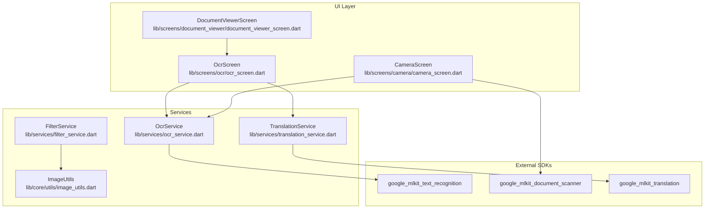
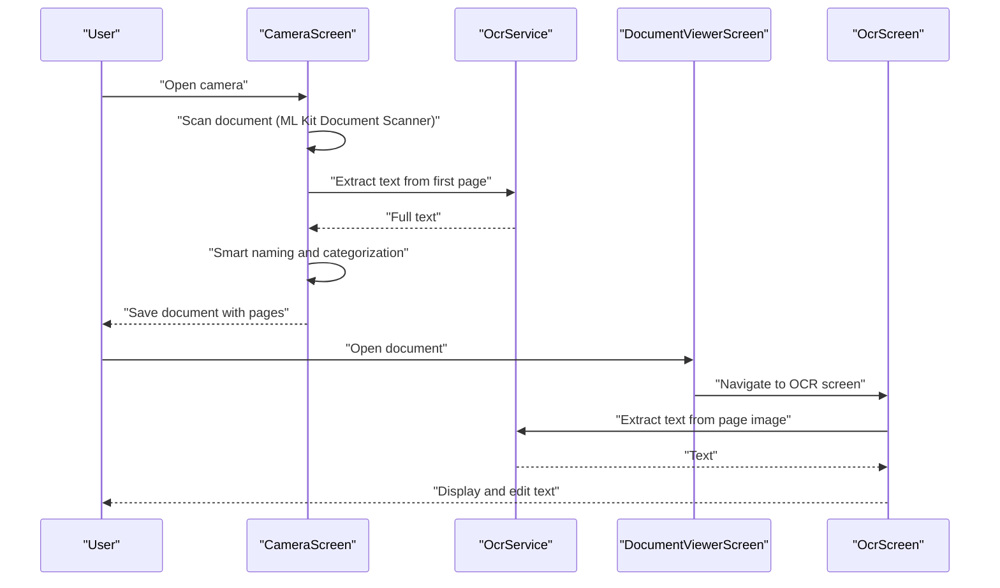
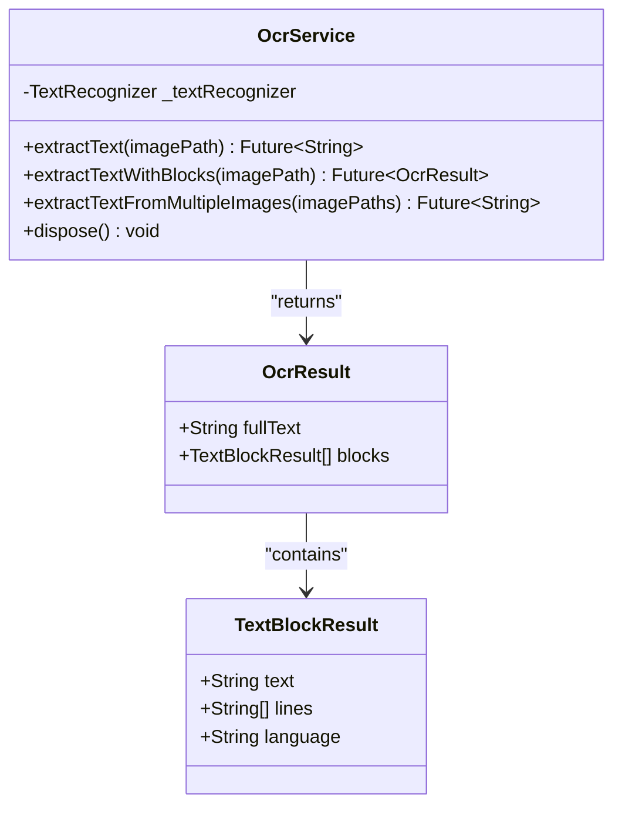
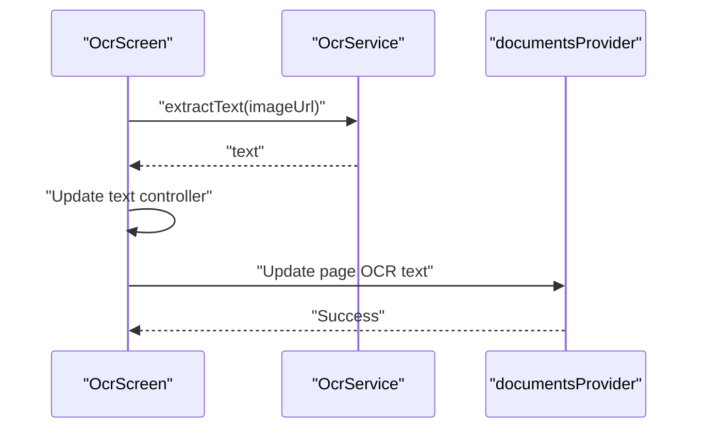
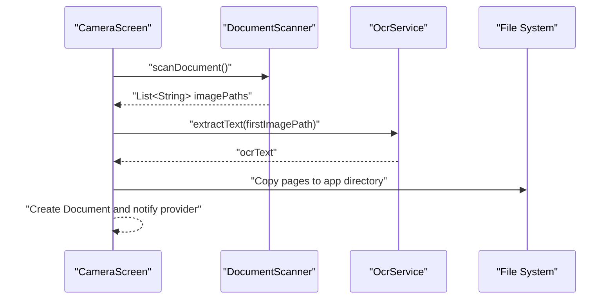
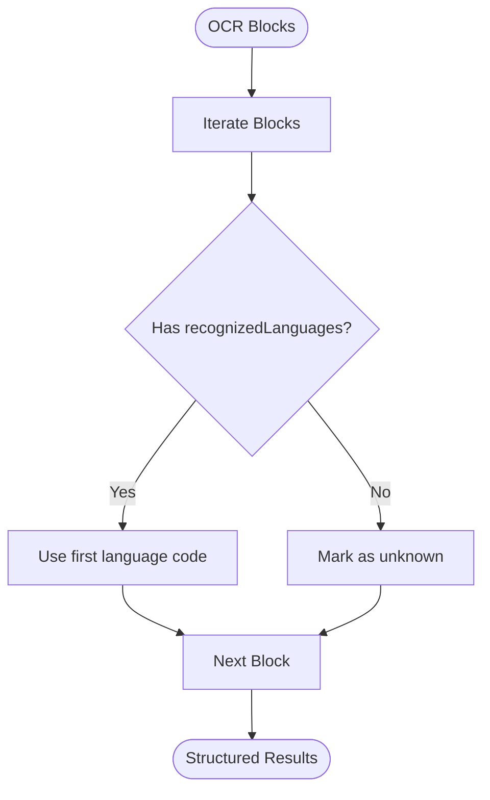
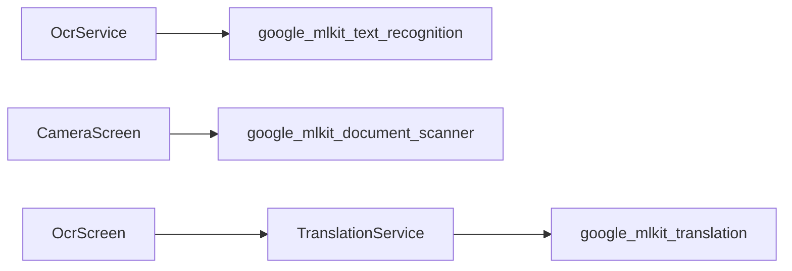

# OCR Service

<cite>
**Referenced Files in This Document**
- [ocr_service.dart](file://lib/services/ocr_service.dart)
- [ocr_screen.dart](file://lib/screens/ocr/ocr_screen.dart)
- [camera_screen.dart](file://lib/screens/camera/camera_screen.dart)
- [app_exceptions.dart](file://lib/core/exceptions/app_exceptions.dart)
- [pubspec.yaml](file://pubspec.yaml)
- [image_utils.dart](file://lib/core/utils/image_utils.dart)
- [filter_service.dart](file://lib/services/filter_service.dart)
- [translation_service.dart](file://lib/services/translation_service.dart)
- [document_viewer_screen.dart](file://lib/screens/document_viewer/document_viewer_screen.dart)
- [app.dart](file://lib/app.dart)
</cite>

## Table of Contents
1. [Introduction](#introduction)
2. [Project Structure](#project-structure)
3. [Core Components](#core-components)
4. [Architecture Overview](#architecture-overview)
5. [Detailed Component Analysis](#detailed-component-analysis)
6. [Dependency Analysis](#dependency-analysis)
7. [Performance Considerations](#performance-considerations)
8. [Troubleshooting Guide](#troubleshooting-guide)
9. [Conclusion](#conclusion)
10. [Appendices](#appendices)

## Introduction
This document explains the OCR Service implementation in the ScanVault project, focusing on Google ML Kit Text Recognition integration. It covers initialization, configuration, model management, text detection and preprocessing, multi-language support, text extraction, bounding boxes, text block organization, performance optimization, batch processing, memory management, error handling, offline/online processing modes, and practical OCR workflows.

## Project Structure
The OCR capability is implemented as a service layer with a dedicated screen for user interaction and integration points with camera capture and document viewer flows. Supporting services handle image enhancement and resizing prior to OCR.

**Diagram sources**
- [ocr_service.dart](file://lib/services/ocr_service.dart#L1-L92)
- [ocr_screen.dart](file://lib/screens/ocr/ocr_screen.dart#L1-L178)
- [camera_screen.dart](file://lib/screens/camera/camera_screen.dart#L1-L242)
- [filter_service.dart](file://lib/services/filter_service.dart#L1-L106)
- [image_utils.dart](file://lib/core/utils/image_utils.dart#L1-L62)
- [translation_service.dart](file://lib/services/translation_service.dart#L1-L170)
- [document_viewer_screen.dart](file://lib/screens/document_viewer/document_viewer_screen.dart#L135-L163)
- [pubspec.yaml](file://pubspec.yaml#L28-L32)

**Section sources**
- [ocr_service.dart](file://lib/services/ocr_service.dart#L1-L92)
- [ocr_screen.dart](file://lib/screens/ocr/ocr_screen.dart#L1-L178)
- [camera_screen.dart](file://lib/screens/camera/camera_screen.dart#L1-L242)
- [filter_service.dart](file://lib/services/filter_service.dart#L1-L106)
- [image_utils.dart](file://lib/core/utils/image_utils.dart#L1-L62)
- [translation_service.dart](file://lib/services/translation_service.dart#L1-L170)
- [document_viewer_screen.dart](file://lib/screens/document_viewer/document_viewer_screen.dart#L135-L163)
- [pubspec.yaml](file://pubspec.yaml#L28-L32)

## Core Components
- OcrService: Provides OCR extraction APIs using Google ML Kit Text Recognition, including raw text extraction, block-aware extraction, multi-image processing, and resource cleanup.
- OcrResult and TextBlockResult: Structured results for full text and organized blocks with language metadata.
- OcrScreen: UI for displaying extracted text, saving to a document, translating, copying, and sharing.
- CameraScreen: Integrates document scanning and triggers OCR for smart naming and categorization.
- FilterService and ImageUtils: Preprocessing utilities to enhance image quality before OCR.
- TranslationService: Optional post-processing translation leveraging on-device models.
- Exceptions: Centralized OcrException wrapping OCR failures.

**Section sources**
- [ocr_service.dart](file://lib/services/ocr_service.dart#L1-L92)
- [ocr_screen.dart](file://lib/screens/ocr/ocr_screen.dart#L1-L178)
- [camera_screen.dart](file://lib/screens/camera/camera_screen.dart#L1-L242)
- [filter_service.dart](file://lib/services/filter_service.dart#L1-L106)
- [image_utils.dart](file://lib/core/utils/image_utils.dart#L1-L62)
- [translation_service.dart](file://lib/services/translation_service.dart#L1-L170)
- [app_exceptions.dart](file://lib/core/exceptions/app_exceptions.dart#L1-L70)

## Architecture Overview
The OCR pipeline integrates camera capture, optional preprocessing, OCR processing, and optional translation. The UI routes connect to OCR and translation screens, and OCR results can be saved to document pages.

**Diagram sources**
- [camera_screen.dart](file://lib/screens/camera/camera_screen.dart#L45-L127)
- [ocr_service.dart](file://lib/services/ocr_service.dart#L10-L18)
- [document_viewer_screen.dart](file://lib/screens/document_viewer/document_viewer_screen.dart#L135-L144)
- [ocr_screen.dart](file://lib/screens/ocr/ocr_screen.dart#L52-L70)

## Detailed Component Analysis

### OcrService
- Initialization and lifecycle:
  - Creates a singleton TextRecognizer instance for efficient reuse.
  - Exposes a dispose method to close the recognizer and release resources.
- Text extraction:
  - extractText: Converts a file path to InputImage and processes via TextRecognizer to return plain text.
  - extractTextWithBlocks: Returns structured OcrResult with blocks and lines, plus the primary language detected per block.
- Batch processing:
  - extractTextFromMultipleImages: Iterates over a list of image paths, extracts text per image, and concatenates with page separators.
- Error handling:
  - Wraps exceptions in OcrException with contextual messages.

**Diagram sources**
- [ocr_service.dart](file://lib/services/ocr_service.dart#L6-L67)
- [ocr_service.dart](file://lib/services/ocr_service.dart#L71-L92)

**Section sources**
- [ocr_service.dart](file://lib/services/ocr_service.dart#L1-L92)
- [app_exceptions.dart](file://lib/core/exceptions/app_exceptions.dart#L31-L37)

### OcrScreen
- Behavior:
  - Initializes a text controller with optional initial text.
  - Automatically triggers OCR extraction if no initial text is present and an image URL is provided.
  - Supports saving extracted text to a document page, translating, copying, and sharing.
- Error handling:
  - Displays localized error messages via SnackBar when OCR fails.

**Diagram sources**
- [ocr_screen.dart](file://lib/screens/ocr/ocr_screen.dart#L52-L112)
- [ocr_service.dart](file://lib/services/ocr_service.dart#L10-L18)

**Section sources**
- [ocr_screen.dart](file://lib/screens/ocr/ocr_screen.dart#L1-L178)

### CameraScreen Integration
- Uses google_mlkit_document_scanner to capture documents and obtain page images.
- Optionally runs OCR on the first page to derive content for smart naming and categorization.
- Saves pages to persistent storage and updates the document provider.

**Diagram sources**
- [camera_screen.dart](file://lib/screens/camera/camera_screen.dart#L45-L127)
- [ocr_service.dart](file://lib/services/ocr_service.dart#L10-L18)

**Section sources**
- [camera_screen.dart](file://lib/screens/camera/camera_screen.dart#L1-L242)

### Image Preprocessing and Enhancement
- ImageUtils:
  - Resizing images while preserving aspect ratio.
  - Generating thumbnails.
  - Rotating images.
  - Loading and saving image bytes.
- FilterService:
  - Grayscale conversion.
  - Black-and-white thresholding with high contrast.
  - Magic color enhancement (saturation, contrast, brightness).
  - Document-optimized filter (grayscale, contrast, normalization).
  - Preview generation for filter types.

These utilities enable preprocessing before OCR to improve accuracy, especially for scanned documents.

**Section sources**
- [image_utils.dart](file://lib/core/utils/image_utils.dart#L1-L62)
- [filter_service.dart](file://lib/services/filter_service.dart#L1-L106)

### Multi-language Support and Language Detection
- The OCR service reads the first recognized language from block.recognizedLanguages for each detected block.
- TranslationService demonstrates on-device model management for translation, including downloading and deleting models, and creating translators with source/target languages.

**Diagram sources**
- [ocr_service.dart](file://lib/services/ocr_service.dart#L35-L37)

**Section sources**
- [ocr_service.dart](file://lib/services/ocr_service.dart#L35-L37)
- [translation_service.dart](file://lib/services/translation_service.dart#L27-L48)

### Text Extraction, Bounding Boxes, and Block Organization
- extractTextWithBlocks organizes results into:
  - Full text.
  - Blocks with constituent lines.
  - Per-block language metadata.
- Bounding boxes are handled internally by the ML Kit TextRecognizer; the current implementation focuses on text and block structure rather than pixel coordinates.

**Section sources**
- [ocr_service.dart](file://lib/services/ocr_service.dart#L21-L48)

### Offline vs Online Processing and Model Caching
- OCR processing uses the TextRecognizer initialized in the service, which relies on device-side models managed by the ML Kit plugin.
- TranslationService demonstrates explicit on-device model management via OnDeviceTranslatorModelManager, including checking, downloading, and deleting models. This pattern can be adapted for OCR model lifecycle if needed.

**Section sources**
- [translation_service.dart](file://lib/services/translation_service.dart#L8-L48)
- [ocr_service.dart](file://lib/services/ocr_service.dart#L7)

### Batch Processing and Memory Management
- extractTextFromMultipleImages iterates over a list of image paths and concatenates results with page separators.
- Resource management:
  - OcrService.dispose closes the TextRecognizer to release resources.
  - TranslationService manages translator instances and ensures models are downloaded before translation.

**Section sources**
- [ocr_service.dart](file://lib/services/ocr_service.dart#L51-L67)
- [translation_service.dart](file://lib/services/translation_service.dart#L86-L90)

## Dependency Analysis
The OCR Service depends on the google_mlkit_text_recognition package. The camera and translation services depend on their respective ML Kit packages. The UI navigates to OCR and translation screens.

**Diagram sources**
- [pubspec.yaml](file://pubspec.yaml#L28-L32)
- [ocr_service.dart](file://lib/services/ocr_service.dart#L1)
- [camera_screen.dart](file://lib/screens/camera/camera_screen.dart#L6)
- [translation_service.dart](file://lib/services/translation_service.dart#L2)

**Section sources**
- [pubspec.yaml](file://pubspec.yaml#L28-L32)

## Performance Considerations
- Preprocess images to improve OCR accuracy:
  - Resize large images to reduce processing time.
  - Apply document-optimized filters (grayscale, contrast, normalization).
- Batch processing:
  - Use extractTextFromMultipleImages to process multiple pages efficiently.
- Resource lifecycle:
  - Call OcrService.dispose after OCR work completes to free resources.
- Translation model caching:
  - Ensure models are downloaded once and reused to avoid repeated downloads.

[No sources needed since this section provides general guidance]

## Troubleshooting Guide
Common failure scenarios and handling:
- Unsupported or corrupted image formats:
  - OcrService wraps errors in OcrException with a contextual message.
- Translation model not available:
  - TranslationService checks model availability and downloads if missing; failures are wrapped in TranslationException.
- UI feedback:
  - OcrScreen displays localized error messages via SnackBar when OCR fails.

Recommended steps:
- Verify image paths and file accessibility.
- Ensure sufficient storage and permissions.
- Retry OCR after applying preprocessing filters.
- Confirm translation models are downloaded before translating.

**Section sources**
- [app_exceptions.dart](file://lib/core/exceptions/app_exceptions.dart#L31-L37)
- [translation_service.dart](file://lib/services/translation_service.dart#L27-L48)
- [ocr_screen.dart](file://lib/screens/ocr/ocr_screen.dart#L62-L69)

## Conclusion
The OCR Service integrates seamlessly with the document scanning and editing workflow. It leverages Google ML Kit for robust text recognition, supports structured block extraction, and provides batch processing capabilities. With preprocessing utilities and optional translation, the system delivers a practical solution for scanned document text extraction and post-processing.

[No sources needed since this section summarizes without analyzing specific files]

## Appendices

### OCR Workflows and Integration Patterns
- Single-page OCR:
  - Navigate to the OCR screen with an image URL; the screen automatically extracts text and displays it.
- Multi-page OCR:
  - Use extractTextFromMultipleImages to process a list of page images and combine results.
- Smart naming during capture:
  - CameraScreen runs OCR on the first page to suggest document name and category.
- Post-processing:
  - Apply filters via FilterService and ImageUtils before OCR to improve accuracy.

**Section sources**
- [ocr_screen.dart](file://lib/screens/ocr/ocr_screen.dart#L52-L70)
- [camera_screen.dart](file://lib/screens/camera/camera_screen.dart#L91-L127)
- [filter_service.dart](file://lib/services/filter_service.dart#L10-L27)
- [image_utils.dart](file://lib/core/utils/image_utils.dart#L9-L26)

### Example Routes and Navigation
- OCR route:
  - Path: /ocr/:documentId
  - Parameters: imageUrl, initialText, pageId
- Translation route:
  - Path: /translation
  - Parameter: initialText (optional)

**Section sources**
- [app.dart](file://lib/app.dart#L155-L186)