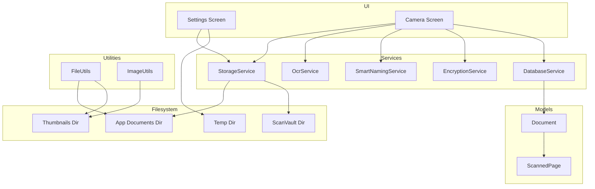
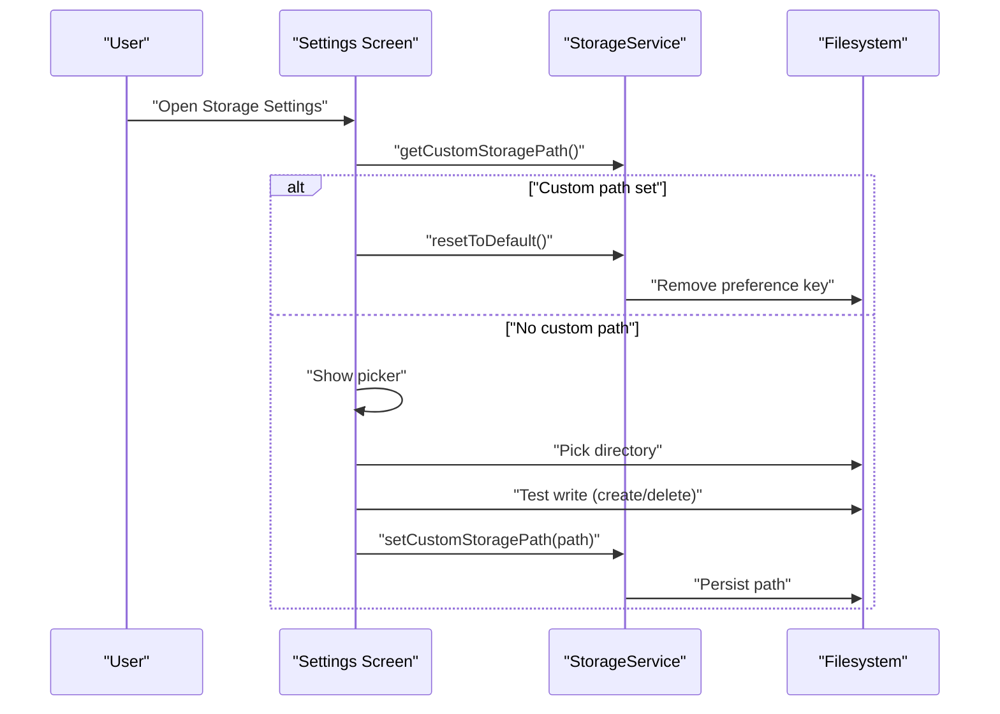
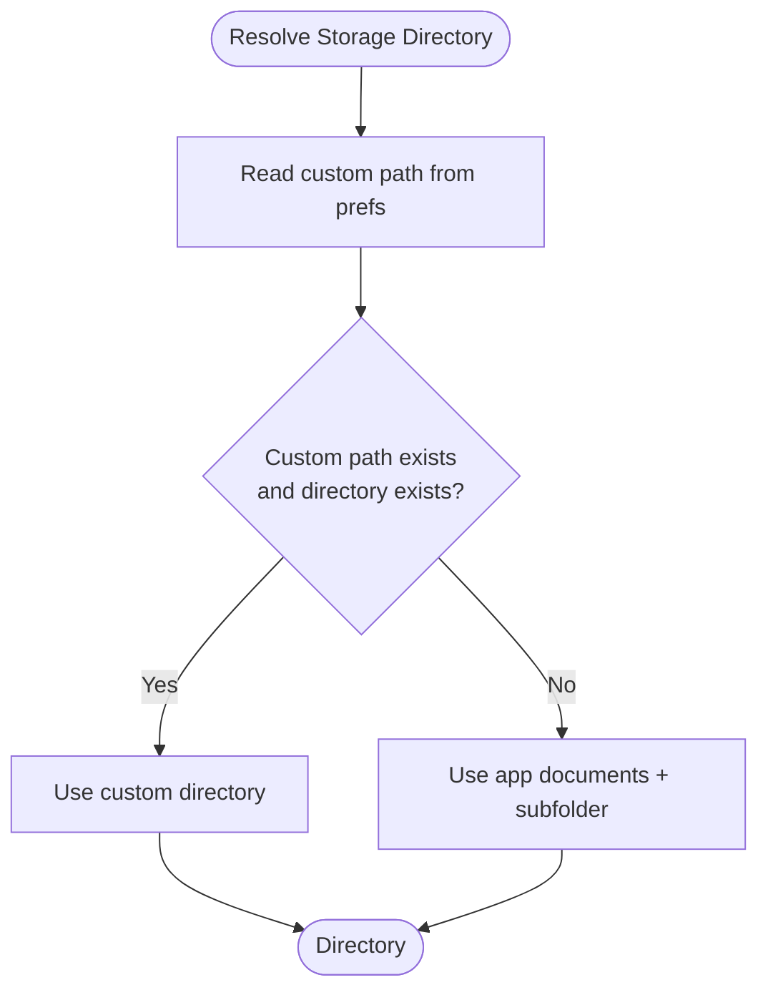
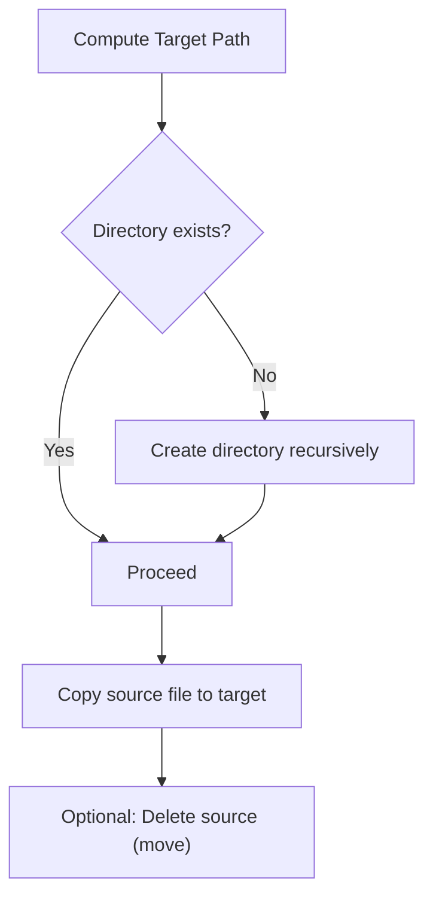
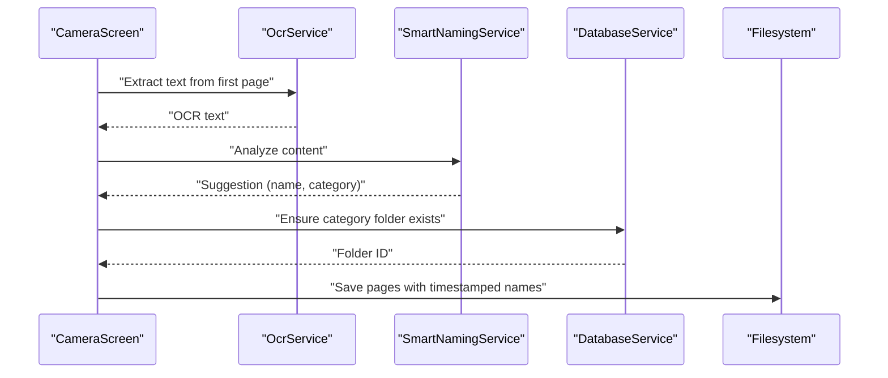
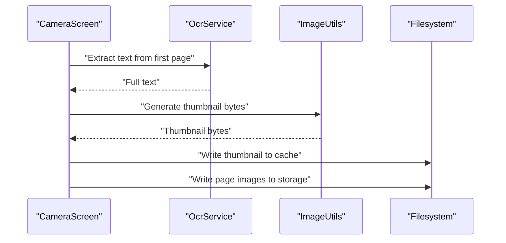
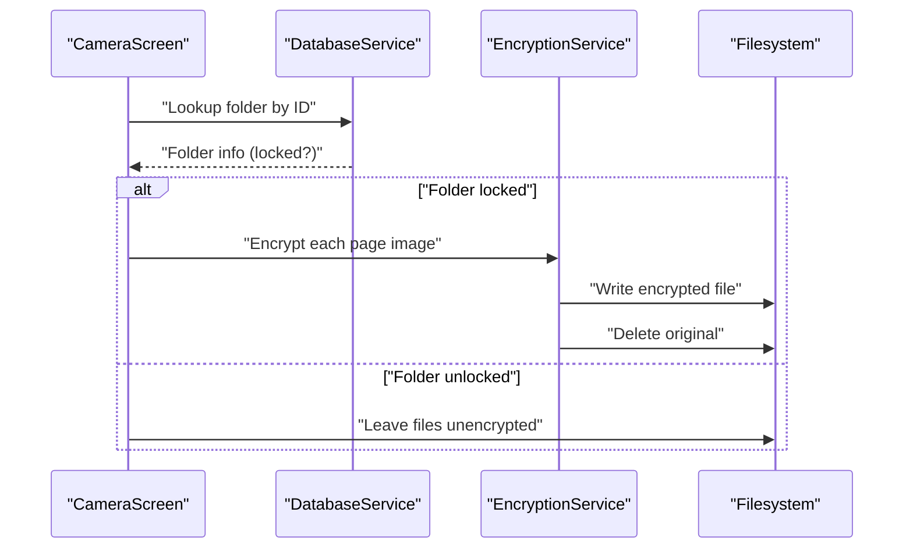
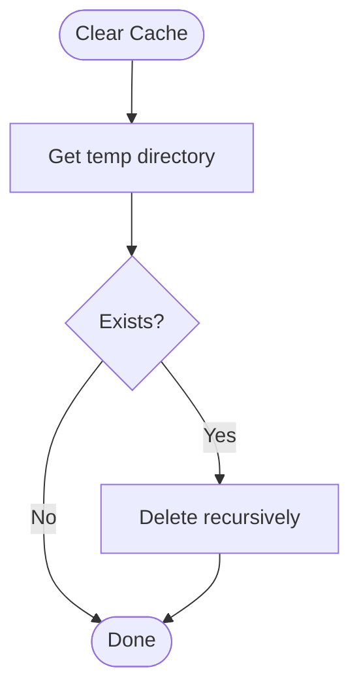
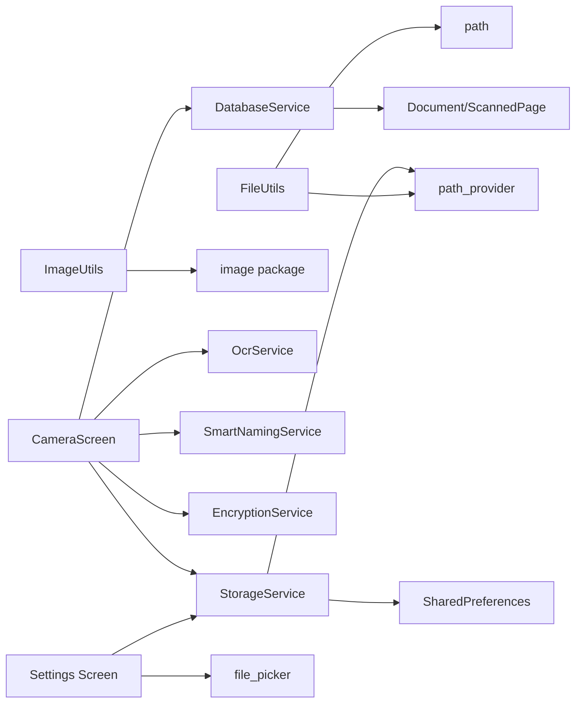

# Storage Service

<cite>
**Referenced Files in This Document**
- [storage_service.dart](file://lib/services/storage_service.dart)
- [file_utils.dart](file://lib/core/utils/file_utils.dart)
- [image_utils.dart](file://lib/core/utils/image_utils.dart)
- [camera_screen.dart](file://lib/screens/camera/camera_screen.dart)
- [settings_screen.dart](file://lib/screens/settings/settings_screen.dart)
- [database_service.dart](file://lib/services/database_service.dart)
- [encryption_service.dart](file://lib/services/encryption_service.dart)
- [ocr_service.dart](file://lib/services/ocr_service.dart)
- [smart_naming_service.dart](file://lib/services/smart_naming_service.dart)
- [document.dart](file://lib/models/document.dart)
</cite>

## Table of Contents
1. [Introduction](#introduction)
2. [Project Structure](#project-structure)
3. [Core Components](#core-components)
4. [Architecture Overview](#architecture-overview)
5. [Detailed Component Analysis](#detailed-component-analysis)
6. [Dependency Analysis](#dependency-analysis)
7. [Performance Considerations](#performance-considerations)
8. [Troubleshooting Guide](#troubleshooting-guide)
9. [Conclusion](#conclusion)
10. [Appendices](#appendices)

## Introduction
This document explains the Storage Service implementation in the application, focusing on file system organization, directory structure, storage path management across platforms, file operations, naming strategies, conflict resolution, quotas and cleanup, format validation, metadata extraction, thumbnail generation, security, permissions, and cross-platform compatibility. It also covers integration with external storage systems via user-selected directories and how the app manages persistent and temporary assets.

## Project Structure
The storage-related logic spans several modules:
- Storage path management and persistence
- File operations (creation, deletion, copying)
- Naming and categorization
- Thumbnails and image processing
- OCR and metadata extraction
- Encryption for protected folders
- Database-backed document model and page indexing
- Settings UI for storage location selection and cache clearing

**Diagram sources**
- [storage_service.dart](file://lib/services/storage_service.dart#L18-L61)
- [file_utils.dart](file://lib/core/utils/file_utils.dart#L9-L27)
- [image_utils.dart](file://lib/core/utils/image_utils.dart#L28-L38)
- [camera_screen.dart](file://lib/screens/camera/camera_screen.dart#L76-L216)
- [settings_screen.dart](file://lib/screens/settings/settings_screen.dart#L60-L93)
- [database_service.dart](file://lib/services/database_service.dart#L15-L28)
- [ocr_service.dart](file://lib/services/ocr_service.dart#L9-L18)
- [smart_naming_service.dart](file://lib/services/smart_naming_service.dart#L7-L43)
- [encryption_service.dart](file://lib/services/encryption_service.dart#L38-L77)
- [document.dart](file://lib/models/document.dart#L16-L48)

**Section sources**
- [storage_service.dart](file://lib/services/storage_service.dart#L18-L61)
- [file_utils.dart](file://lib/core/utils/file_utils.dart#L9-L27)
- [image_utils.dart](file://lib/core/utils/image_utils.dart#L28-L38)
- [camera_screen.dart](file://lib/screens/camera/camera_screen.dart#L76-L216)
- [settings_screen.dart](file://lib/screens/settings/settings_screen.dart#L60-L93)
- [database_service.dart](file://lib/services/database_service.dart#L15-L28)
- [ocr_service.dart](file://lib/services/ocr_service.dart#L9-L18)
- [smart_naming_service.dart](file://lib/services/smart_naming_service.dart#L7-L43)
- [encryption_service.dart](file://lib/services/encryption_service.dart#L38-L77)
- [document.dart](file://lib/models/document.dart#L16-L48)

## Core Components
- StorageService: Manages custom storage path persistence and resolves the effective storage directory. Provides helpers to compute file paths under the chosen storage root.
- FileUtils: Provides utilities for app-scoped documents and thumbnails directories, unique filename generation, copying files into app storage, safe deletion, and human-readable sizes.
- ImageUtils: Handles resizing, thumbnail generation, rotation, and saving/loading image bytes.
- CameraScreen: Orchestrates scanning, saves pages to the resolved storage directory, generates thumbnails, and optionally encrypts files if the target folder is locked.
- Settings Screen: Allows users to select a custom storage directory and verifies write access before persisting the choice.
- DatabaseService: Stores document metadata, page references, and folder information; integrates with storage paths for persisted assets.
- OcrService: Extracts text from images to support smart naming and metadata enrichment.
- SmartNamingService: Analyzes OCR text to suggest document names and categories.
- EncryptionService: Encrypts/decrypts files stored under locked folders using secure storage for keys.

**Section sources**
- [storage_service.dart](file://lib/services/storage_service.dart#L12-L61)
- [file_utils.dart](file://lib/core/utils/file_utils.dart#L6-L58)
- [image_utils.dart](file://lib/core/utils/image_utils.dart#L6-L61)
- [camera_screen.dart](file://lib/screens/camera/camera_screen.dart#L76-L216)
- [settings_screen.dart](file://lib/screens/settings/settings_screen.dart#L60-L93)
- [database_service.dart](file://lib/services/database_service.dart#L11-L413)
- [ocr_service.dart](file://lib/services/ocr_service.dart#L6-L93)
- [smart_naming_service.dart](file://lib/services/smart_naming_service.dart#L4-L104)
- [encryption_service.dart](file://lib/services/encryption_service.dart#L8-L150)
- [document.dart](file://lib/models/document.dart#L16-L48)

## Architecture Overview
The storage architecture centers around a configurable storage root:
- Default: Application documents directory under a dedicated subfolder.
- Custom: User-selected directory validated for write access and persisted via preferences.

Persistent assets (documents, pages, thumbnails) are stored under this root. Temporary assets (cache) are stored under the platform’s temporary directory and can be cleared from the settings UI.

**Diagram sources**
- [settings_screen.dart](file://lib/screens/settings/settings_screen.dart#L245-L268)
- [storage_service.dart](file://lib/services/storage_service.dart#L23-L37)

**Section sources**
- [settings_screen.dart](file://lib/screens/settings/settings_screen.dart#L60-L93)
- [settings_screen.dart](file://lib/screens/settings/settings_screen.dart#L245-L268)
- [storage_service.dart](file://lib/services/storage_service.dart#L23-L37)

## Detailed Component Analysis

### Storage Path Management
- Custom path persistence: Stored in preferences with a dedicated key. Retrieval returns null when using default internal storage.
- Resolution order:
  - If a custom path exists and the directory exists, use it.
  - Otherwise, resolve to the application documents directory plus a fixed subfolder.
- Path computation helper ensures the directory exists and returns a full path for a new file.

**Diagram sources**
- [storage_service.dart](file://lib/services/storage_service.dart#L40-L52)

**Section sources**
- [storage_service.dart](file://lib/services/storage_service.dart#L23-L37)
- [storage_service.dart](file://lib/services/storage_service.dart#L40-L61)

### File Operations
- Creation: Ensures the storage directory exists before computing a file path.
- Deletion: Safe deletion checks existence before removing.
- Copying: Copies scanned/temporary files into app storage using unique filenames.
- Moving: Not explicitly implemented; copying followed by deletion achieves move semantics.

**Diagram sources**
- [storage_service.dart](file://lib/services/storage_service.dart#L54-L61)
- [file_utils.dart](file://lib/core/utils/file_utils.dart#L35-L42)

**Section sources**
- [storage_service.dart](file://lib/services/storage_service.dart#L54-L61)
- [file_utils.dart](file://lib/core/utils/file_utils.dart#L35-L50)

### File Naming Strategies and Conflict Resolution
- Unique filenames: Generated using a timestamp-based scheme to avoid collisions.
- Smart naming: OCR is used to infer document type and optional date; categories drive folder creation.
- Conflict resolution: Timestamp-based naming prevents overwrites; folder creation is idempotent.

**Diagram sources**
- [camera_screen.dart](file://lib/screens/camera/camera_screen.dart#L88-L127)
- [ocr_service.dart](file://lib/services/ocr_service.dart#L9-L18)
- [smart_naming_service.dart](file://lib/services/smart_naming_service.dart#L7-L43)
- [database_service.dart](file://lib/services/database_service.dart#L291-L351)

**Section sources**
- [file_utils.dart](file://lib/core/utils/file_utils.dart#L29-L33)
- [camera_screen.dart](file://lib/screens/camera/camera_screen.dart#L88-L127)
- [smart_naming_service.dart](file://lib/services/smart_naming_service.dart#L7-L43)
- [database_service.dart](file://lib/services/database_service.dart#L291-L351)

### Thumbnail Generation and Metadata Extraction
- Thumbnails: Generated from image bytes and cached in a temporary directory. Used as document previews.
- Metadata: OCR extracts full text and block-level information; first page OCR text is often attached to the document for quick access.

**Diagram sources**
- [camera_screen.dart](file://lib/screens/camera/camera_screen.dart#L91-L104)
- [ocr_service.dart](file://lib/services/ocr_service.dart#L20-L48)
- [image_utils.dart](file://lib/core/utils/image_utils.dart#L28-L38)

**Section sources**
- [image_utils.dart](file://lib/core/utils/image_utils.dart#L28-L38)
- [ocr_service.dart](file://lib/services/ocr_service.dart#L20-L48)
- [camera_screen.dart](file://lib/screens/camera/camera_screen.dart#L136-L171)

### Security, Permissions, and Access Control
- Encryption: Files under locked folders are encrypted/decrypted using per-folder keys stored securely. Keys are not exposed to the filesystem directly.
- Access control: Folders can be marked locked; on save, if the destination folder is locked, all page images are encrypted.
- Permissions: Camera captures produce temporary files; the app copies them into persistent storage after scanning.

**Diagram sources**
- [camera_screen.dart](file://lib/screens/camera/camera_screen.dart#L186-L200)
- [encryption_service.dart](file://lib/services/encryption_service.dart#L38-L77)
- [database_service.dart](file://lib/services/database_service.dart#L304-L351)

**Section sources**
- [encryption_service.dart](file://lib/services/encryption_service.dart#L15-L36)
- [encryption_service.dart](file://lib/services/encryption_service.dart#L38-L77)
- [camera_screen.dart](file://lib/screens/camera/camera_screen.dart#L186-L200)
- [database_service.dart](file://lib/services/database_service.dart#L291-L351)

### Storage Quotas, Disk Space Monitoring, and Cleanup
- Quota management: Not implemented in the current codebase.
- Disk space monitoring: Not implemented in the current codebase.
- Cleanup operations:
  - Clear cache: Deletes the temporary directory recursively from the settings UI.
  - File deletion: Safe deletion utility deletes files only if they exist.

**Diagram sources**
- [settings_screen.dart](file://lib/screens/settings/settings_screen.dart#L164-L200)
- [file_utils.dart](file://lib/core/utils/file_utils.dart#L44-L50)

**Section sources**
- [settings_screen.dart](file://lib/screens/settings/settings_screen.dart#L164-L200)
- [file_utils.dart](file://lib/core/utils/file_utils.dart#L44-L50)

### Cross-Platform Compatibility and Platform-Specific Optimizations
- Default storage roots:
  - Uses platform-appropriate application documents directory.
  - Temporary cache uses platform-appropriate temporary directory.
- Custom storage: Users can pick any directory; the app writes a test file to verify permissions before persisting the choice.
- File naming: Timestamp-based naming avoids platform-specific restrictions.
- Image processing: Uses a cross-platform image library for resizing, cropping, and rotation.

**Section sources**
- [storage_service.dart](file://lib/services/storage_service.dart#L40-L52)
- [file_utils.dart](file://lib/core/utils/file_utils.dart#L9-L27)
- [settings_screen.dart](file://lib/screens/settings/settings_screen.dart#L245-L268)
- [image_utils.dart](file://lib/core/utils/image_utils.dart#L9-L26)

## Dependency Analysis
The following diagram highlights key dependencies among storage-related components:

**Diagram sources**
- [storage_service.dart](file://lib/services/storage_service.dart#L1-L10)
- [file_utils.dart](file://lib/core/utils/file_utils.dart#L1-L6)
- [image_utils.dart](file://lib/core/utils/image_utils.dart#L1-L6)
- [camera_screen.dart](file://lib/screens/camera/camera_screen.dart#L1-L19)
- [settings_screen.dart](file://lib/screens/settings/settings_screen.dart#L1-L11)
- [database_service.dart](file://lib/services/database_service.dart#L1-L9)
- [document.dart](file://lib/models/document.dart#L1-L5)

**Section sources**
- [storage_service.dart](file://lib/services/storage_service.dart#L1-L10)
- [file_utils.dart](file://lib/core/utils/file_utils.dart#L1-L6)
- [image_utils.dart](file://lib/core/utils/image_utils.dart#L1-L6)
- [camera_screen.dart](file://lib/screens/camera/camera_screen.dart#L1-L19)
- [settings_screen.dart](file://lib/screens/settings/settings_screen.dart#L1-L11)
- [database_service.dart](file://lib/services/database_service.dart#L1-L9)
- [document.dart](file://lib/models/document.dart#L1-L5)

## Performance Considerations
- Batch operations: The camera supports batch scanning with a page limit; saving multiple pages benefits from efficient copying and minimal IO overhead.
- Thumbnail generation: Generating thumbnails from decoded image bytes reduces memory pressure compared to operating on full-resolution images.
- Encryption overhead: Encrypting many files adds CPU and IO cost; consider batching and progress feedback for large batches.
- Database writes: Document and page inserts are performed per document; batching inserts can reduce transaction overhead if extended.

[No sources needed since this section provides general guidance]

## Troubleshooting Guide
- Custom storage write failure: When selecting a custom directory, the app writes a test file and deletes it to verify permissions. Failures surface as errors in the settings UI.
- File not found during save: If a temporary file disappears before copying, the save routine skips that page and continues.
- Encryption failures: Encryption errors are caught and logged; the document save proceeds without encryption for that batch.
- Cache clear failures: Deleting the temporary directory recursively is wrapped in error handling; failures are surfaced via snack bars.

**Section sources**
- [settings_screen.dart](file://lib/screens/settings/settings_screen.dart#L245-L268)
- [camera_screen.dart](file://lib/screens/camera/camera_screen.dart#L146-L149)
- [camera_screen.dart](file://lib/screens/camera/camera_screen.dart#L194-L198)
- [settings_screen.dart](file://lib/screens/settings/settings_screen.dart#L188-L200)

## Conclusion
The Storage Service provides a flexible, cross-platform foundation for managing scanned documents. It supports default and custom storage roots, safe file operations, intelligent naming and categorization, thumbnail caching, and optional encryption for protected folders. While quota management and disk monitoring are not implemented, the system offers practical cleanup mechanisms and robust error handling. The integration with OCR, database, and UI components enables a smooth user experience across platforms.

[No sources needed since this section summarizes without analyzing specific files]

## Appendices

### Storage Workflows

- Save a scanned document:
  - Scan pages and receive temporary file paths.
  - Resolve storage directory and ensure it exists.
  - Copy each page into storage with timestamped names.
  - Generate a thumbnail from the first page.
  - Persist document metadata and page references.
  - Optionally encrypt page images if the destination folder is locked.

- Change storage location:
  - Open settings and choose “Custom”.
  - Pick a directory and confirm write access.
  - Persist the path; future saves use the new location.

- Clear cache:
  - Open settings and choose “Clear Cache”.
  - Recursively delete the temporary directory.

**Section sources**
- [camera_screen.dart](file://lib/screens/camera/camera_screen.dart#L76-L216)
- [settings_screen.dart](file://lib/screens/settings/settings_screen.dart#L60-L93)
- [settings_screen.dart](file://lib/screens/settings/settings_screen.dart#L164-L200)