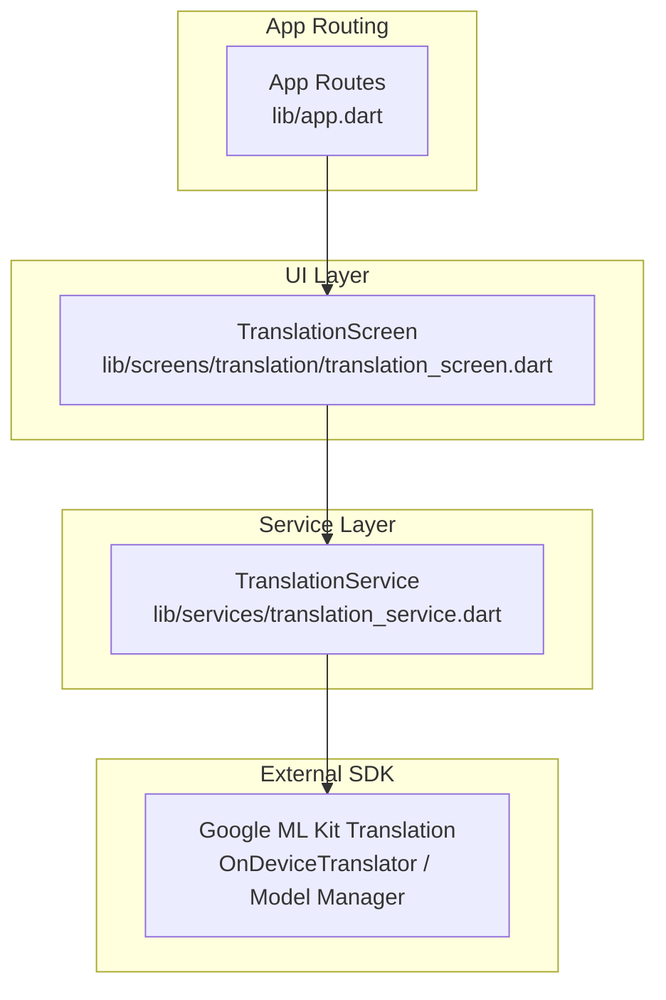
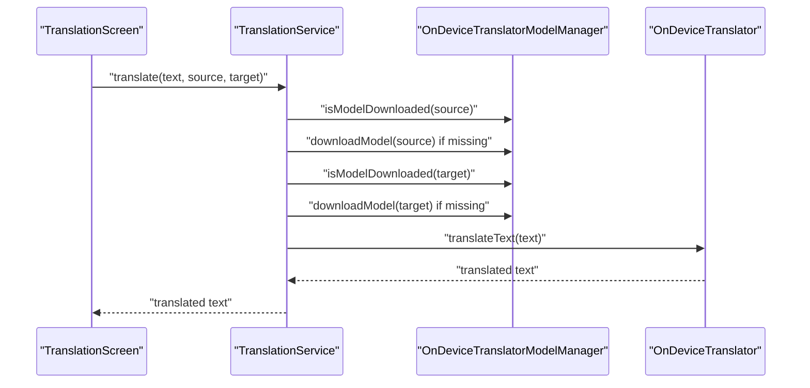
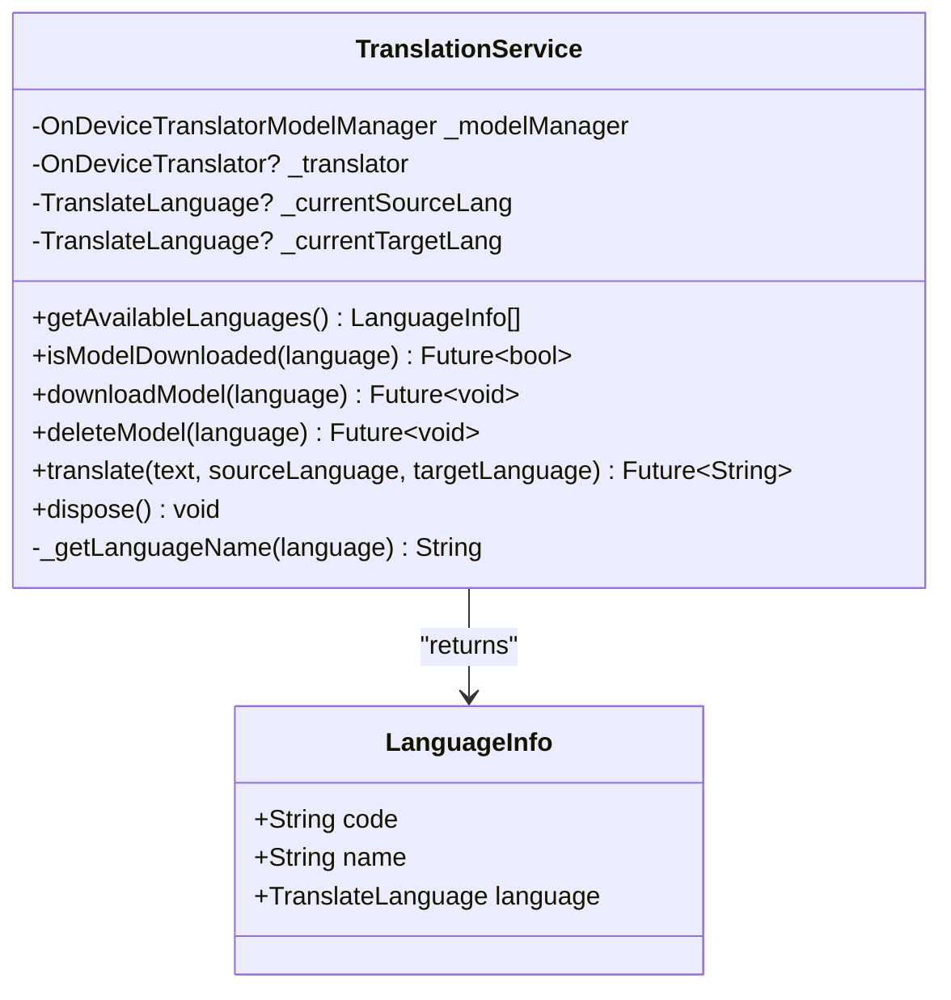
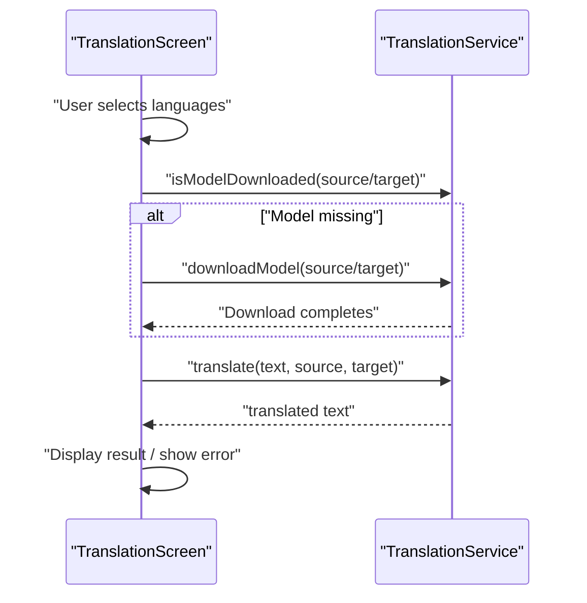
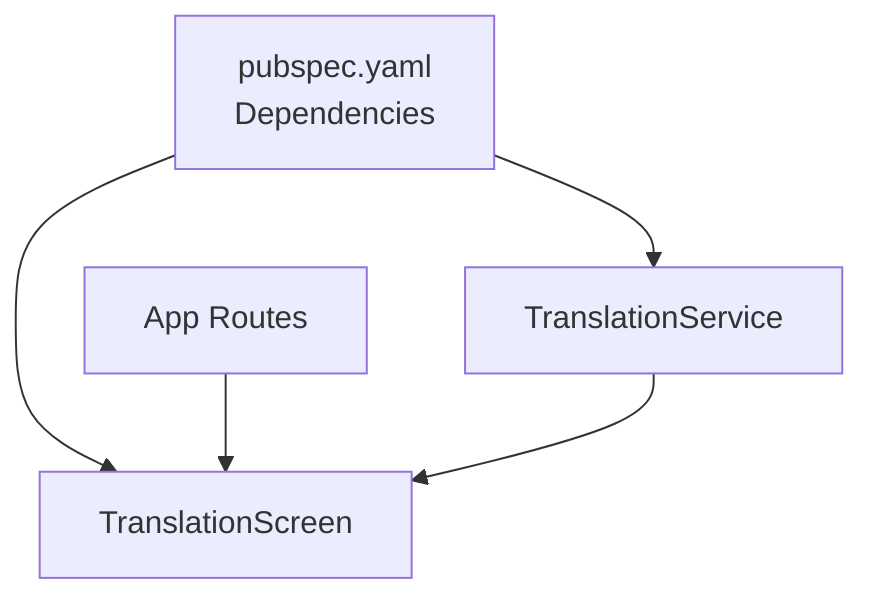

# Translation Service

<cite>
**Referenced Files in This Document**
- [translation_service.dart](file://lib/services/translation_service.dart)
- [translation_screen.dart](file://lib/screens/translation/translation_screen.dart)
- [app.dart](file://lib/app.dart)
- [pubspec.yaml](file://pubspec.yaml)
- [app_exceptions.dart](file://lib/core/exceptions/app_exceptions.dart)
- [ocr_service.dart](file://lib/services/ocr_service.dart)
- [app_localizations.dart](file://lib/l10n/app_localizations.dart)
</cite>

## Table of Contents
1. [Introduction](#introduction)
2. [Project Structure](#project-structure)
3. [Core Components](#core-components)
4. [Architecture Overview](#architecture-overview)
5. [Detailed Component Analysis](#detailed-component-analysis)
6. [Dependency Analysis](#dependency-analysis)
7. [Performance Considerations](#performance-considerations)
8. [Troubleshooting Guide](#troubleshooting-guide)
9. [Conclusion](#conclusion)
10. [Appendices](#appendices)

## Introduction
This document explains the Translation Service implementation powered by Google ML Kit’s on-device translation capabilities. It covers how the service initializes and manages language models, performs real-time translation, handles model downloads and lifecycle, and integrates with the UI. It also outlines supported languages, offline translation behavior, error handling, and operational guidance for performance and reliability.

## Project Structure
The translation feature spans a service layer and a UI screen:
- Service: Provides translation orchestration, model lifecycle, and language metadata.
- Screen: Presents a user interface for selecting languages, entering source text, triggering translation, and displaying results.
- Routing: Exposes the translation screen via a named route.
- Dependencies: Google ML Kit Translation SDK is declared in the project configuration.

**Diagram sources**
- [translation_screen.dart](file://lib/screens/translation/translation_screen.dart#L1-L285)
- [translation_service.dart](file://lib/services/translation_service.dart#L1-L170)
- [app.dart](file://lib/app.dart#L175-L184)

**Section sources**
- [translation_service.dart](file://lib/services/translation_service.dart#L1-L170)
- [translation_screen.dart](file://lib/screens/translation/translation_screen.dart#L1-L285)
- [app.dart](file://lib/app.dart#L175-L184)
- [pubspec.yaml](file://pubspec.yaml#L30-L32)

## Core Components
- TranslationService: Central orchestrator for translation operations, model management, and language metadata.
- TranslationScreen: Interactive UI for language selection, text input, translation trigger, and result display.
- Route definition: Named route to launch the translation screen with optional pre-filled text.
- Exceptions: Dedicated exception type for translation errors.
- OCR integration: OCR service exists for text extraction; translation can be chained after OCR.

Key responsibilities:
- Enumerate available languages and present human-friendly names.
- Manage on-device translation models (download, delete, existence checks).
- Create and reuse an on-device translator instance per language pair.
- Translate text with robust error handling and user feedback.

**Section sources**
- [translation_service.dart](file://lib/services/translation_service.dart#L6-L170)
- [translation_screen.dart](file://lib/screens/translation/translation_screen.dart#L1-L285)
- [app.dart](file://lib/app.dart#L175-L184)
- [app_exceptions.dart](file://lib/core/exceptions/app_exceptions.dart#L39-L45)
- [ocr_service.dart](file://lib/services/ocr_service.dart#L1-L93)

## Architecture Overview
The translation workflow connects the UI to the service and the underlying ML Kit translation engine. The UI triggers translation, the service ensures models are available, and the translator performs on-device translation.

**Diagram sources**
- [translation_screen.dart](file://lib/screens/translation/translation_screen.dart#L51-L90)
- [translation_service.dart](file://lib/services/translation_service.dart#L27-L84)

## Detailed Component Analysis

### TranslationService
Responsibilities:
- Provide a list of available languages with human-readable names.
- Check, download, and delete on-device translation models.
- Create or reuse an on-device translator for the current language pair.
- Translate text and propagate errors via a dedicated exception type.

Implementation highlights:
- Static singleton-like behavior to manage a single translator instance per language pair.
- Automatic model availability checks before translation.
- Graceful error propagation using TranslationException.

**Diagram sources**
- [translation_service.dart](file://lib/services/translation_service.dart#L6-L170)

**Section sources**
- [translation_service.dart](file://lib/services/translation_service.dart#L6-L170)
- [app_exceptions.dart](file://lib/core/exceptions/app_exceptions.dart#L39-L45)

### TranslationScreen
Responsibilities:
- Present language selectors for source and target languages.
- Allow manual translation initiation and display progress indicators.
- Swap languages and swap text between input and output fields.
- Show error messages and provide copy-to-clipboard for results.

Behavior:
- Automatically checks and downloads missing models before translating.
- Uses a progress indicator during model downloads.
- Displays translated text in a read-only field and supports copying.

**Diagram sources**
- [translation_screen.dart](file://lib/screens/translation/translation_screen.dart#L51-L90)
- [translation_service.dart](file://lib/services/translation_service.dart#L27-L84)

**Section sources**
- [translation_screen.dart](file://lib/screens/translation/translation_screen.dart#L1-L285)
- [app.dart](file://lib/app.dart#L175-L184)

### Supported Languages and Language Metadata
- Available languages are derived from the TranslateLanguage enumeration.
- Human-readable names are provided via an internal mapping method.
- LanguageInfo encapsulates code, name, and the underlying language enum value.

Operational note:
- The service sorts languages alphabetically by name for UI presentation.

**Section sources**
- [translation_service.dart](file://lib/services/translation_service.dart#L16-L25)
- [translation_service.dart](file://lib/services/translation_service.dart#L92-L155)

### Offline Translation Capabilities
- On-device translation is used via OnDeviceTranslator.
- Models are managed by OnDeviceTranslatorModelManager.
- The service checks model availability and downloads missing models automatically before translation.

Implications:
- Offline translation is feasible once models are downloaded.
- Network connectivity is required only for model downloads.

**Section sources**
- [translation_service.dart](file://lib/services/translation_service.dart#L8-L9)
- [translation_service.dart](file://lib/services/translation_service.dart#L27-L48)
- [translation_service.dart](file://lib/services/translation_service.dart#L50-L84)

### Real-Time Translation Processing
- The UI triggers translation on demand (e.g., button press).
- The service ensures models are ready before performing translation.
- The translator instance is reused when the language pair remains unchanged.

Considerations:
- Reuse of the translator reduces initialization overhead.
- Empty input is handled gracefully by returning an empty string.

**Section sources**
- [translation_screen.dart](file://lib/screens/translation/translation_screen.dart#L51-L90)
- [translation_service.dart](file://lib/services/translation_service.dart#L50-L84)

### Batch Translation Operations
- The current implementation focuses on single-text translation.
- There is no built-in batch translation API within TranslationService.
- OCR service exists for extracting text from images; translation can be applied to extracted text.

Guidance:
- To support batch translation, extend TranslationService to accept lists of texts and iterate with model checks and translation calls.
- Consider chunking long texts to respect memory and latency constraints.

**Section sources**
- [translation_service.dart](file://lib/services/translation_service.dart#L50-L84)
- [ocr_service.dart](file://lib/services/ocr_service.dart#L1-L93)

### Caching Mechanisms
- The service maintains a single OnDeviceTranslator instance per language pair to avoid repeated initialization.
- Dispose method closes the translator when translation is no longer needed.

Recommendations:
- Close the translator when leaving the translation screen or when the app is backgrounded to free resources.
- Consider adding explicit model cleanup for infrequently used language pairs.

**Section sources**
- [translation_service.dart](file://lib/services/translation_service.dart#L11-L13)
- [translation_service.dart](file://lib/services/translation_service.dart#L86-L90)

### Language Detection, Text Segmentation, and Context Preservation
- Language detection: The service does not implement automatic language detection; users select source and target languages.
- Text segmentation: The service translates entire input strings as-is; there is no built-in segmentation logic.
- Context preservation: The service does not implement context-aware translation; it translates the provided text without external context.

Recommendations:
- Integrate OCR language detection results to prefill source language.
- For long documents, segment text into logical units (sentences/paragraphs) and translate incrementally to preserve coherence.
- Maintain sentence boundaries and whitespace to improve readability.

**Section sources**
- [translation_service.dart](file://lib/services/translation_service.dart#L50-L84)
- [ocr_service.dart](file://lib/services/ocr_service.dart#L20-L48)

### Translation Quality Metrics and Accuracy Improvements
- The repository does not define quality metrics or evaluation procedures for translations.
- Recommendations:
  - Implement post-translation checks (e.g., coherence, terminology consistency).
  - Provide user feedback mechanisms to rate translations.
  - Consider iterative refinement by segmenting text and aligning segments across languages.

[No sources needed since this section provides general guidance]

### Model Download Strategies
- The service checks model availability and downloads missing models before translation.
- Downloads occur per language independently for source and target.

Best practices:
- Pre-download frequently used language pairs during app startup or idle periods.
- Provide user controls to manually download/delete models.
- Monitor storage usage and offer cleanup options for unused models.

**Section sources**
- [translation_service.dart](file://lib/services/translation_service.dart#L27-L48)
- [translation_service.dart](file://lib/services/translation_service.dart#L72-L78)

### Integration Patterns
- Route-based integration: The translation screen is reachable via a named route with optional initial text.
- UI-driven invocation: Users select languages and initiate translation from the screen.
- Extensibility: TranslationService can be extended to integrate with OCR results or document processing pipelines.

**Section sources**
- [app.dart](file://lib/app.dart#L175-L184)
- [translation_screen.dart](file://lib/screens/translation/translation_screen.dart#L1-L285)

## Dependency Analysis
The translation feature depends on the Google ML Kit Translation SDK and the app’s routing system.

**Diagram sources**
- [pubspec.yaml](file://pubspec.yaml#L30-L32)
- [translation_service.dart](file://lib/services/translation_service.dart#L1-L2)
- [translation_screen.dart](file://lib/screens/translation/translation_screen.dart#L1-L5)
- [app.dart](file://lib/app.dart#L175-L184)

**Section sources**
- [pubspec.yaml](file://pubspec.yaml#L30-L32)
- [translation_service.dart](file://lib/services/translation_service.dart#L1-L2)
- [translation_screen.dart](file://lib/screens/translation/translation_screen.dart#L1-L5)
- [app.dart](file://lib/app.dart#L175-L184)

## Performance Considerations
- Translator reuse: The service reuses a single translator instance for the same language pair to minimize initialization overhead.
- Model readiness: Ensuring models are downloaded avoids runtime delays during translation.
- Memory management: Close the translator when done to release resources.
- Large documents: Segment long texts into smaller chunks to reduce memory pressure and latency.
- Network efficiency: Pre-download models to avoid repeated downloads; batch model operations when possible.

[No sources needed since this section provides general guidance]

## Troubleshooting Guide
Common scenarios and handling:
- Unsupported languages: The service relies on TranslateLanguage enumeration; ensure the desired language is included.
- Model failures: TranslationException is thrown when model download or translation fails; surface user-friendly messages.
- Connectivity issues: Model downloads require network; handle offline scenarios by pre-downloading models.
- UI feedback: The screen displays progress during downloads and shows errors returned by the service.

**Section sources**
- [translation_service.dart](file://lib/services/translation_service.dart#L33-L38)
- [translation_service.dart](file://lib/services/translation_service.dart#L81-L83)
- [translation_screen.dart](file://lib/screens/translation/translation_screen.dart#L60-L89)
- [app_exceptions.dart](file://lib/core/exceptions/app_exceptions.dart#L39-L45)

## Conclusion
The Translation Service provides a clean, on-device translation layer powered by Google ML Kit. It manages models, reuses translators, and integrates smoothly with the UI. While the current implementation focuses on single-text translation and manual model management, the architecture supports extension for batch processing, improved segmentation, and advanced quality assurance.

## Appendices

### Example Workflows
- Real-time translation:
  - User selects languages and enters text.
  - The screen checks and downloads models if needed.
  - TranslationService translates the text and returns the result.
- OCR-to-translation pipeline:
  - Extract text from images using OCR service.
  - Pass extracted text to TranslationService for translation.

**Section sources**
- [translation_screen.dart](file://lib/screens/translation/translation_screen.dart#L51-L90)
- [translation_service.dart](file://lib/services/translation_service.dart#L50-L84)
- [ocr_service.dart](file://lib/services/ocr_service.dart#L10-L18)

### Custom Model Usage
- The service uses OnDeviceTranslator and OnDeviceTranslatorModelManager.
- Extend the service to support custom model paths or advanced model management as needed.

**Section sources**
- [translation_service.dart](file://lib/services/translation_service.dart#L8-L9)
- [translation_service.dart](file://lib/services/translation_service.dart#L33-L48)

### Localization Notes
- UI strings for translation actions and labels are localized via AppLocalizations.

**Section sources**
- [app_localizations.dart](file://lib/l10n/app_localizations.dart#L201-L205)