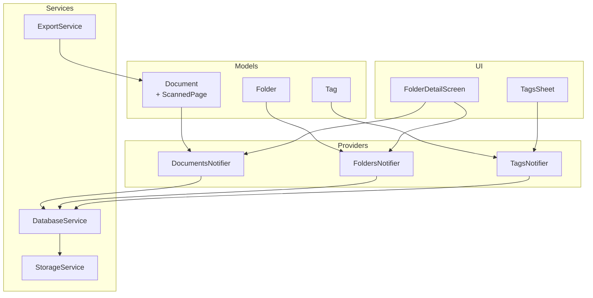
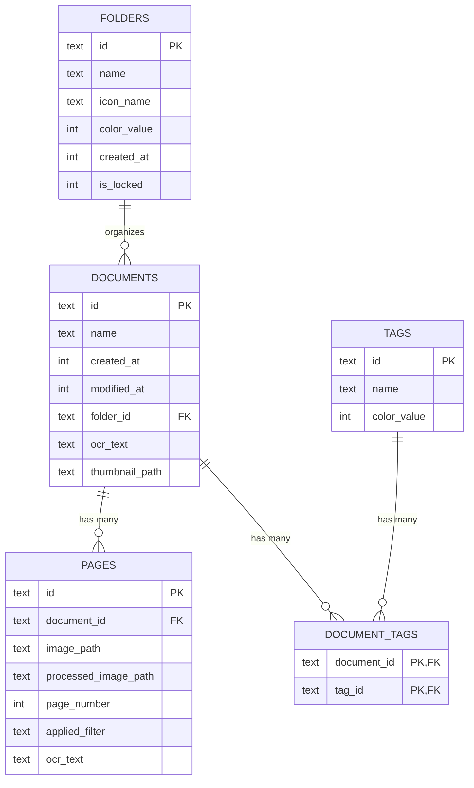
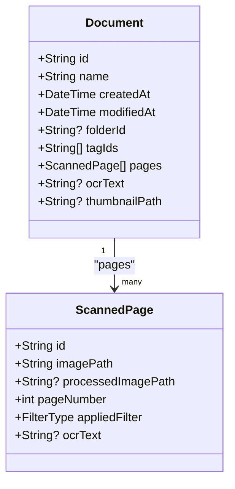
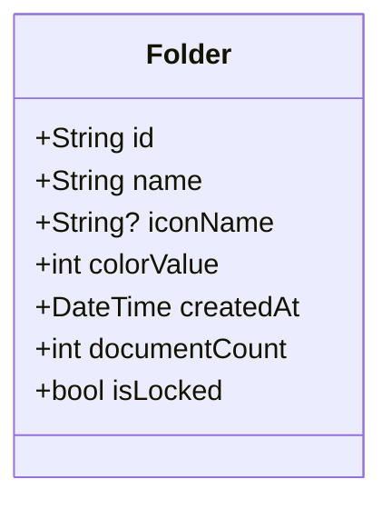
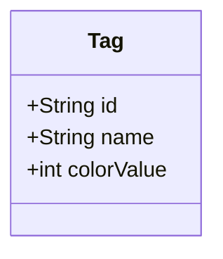
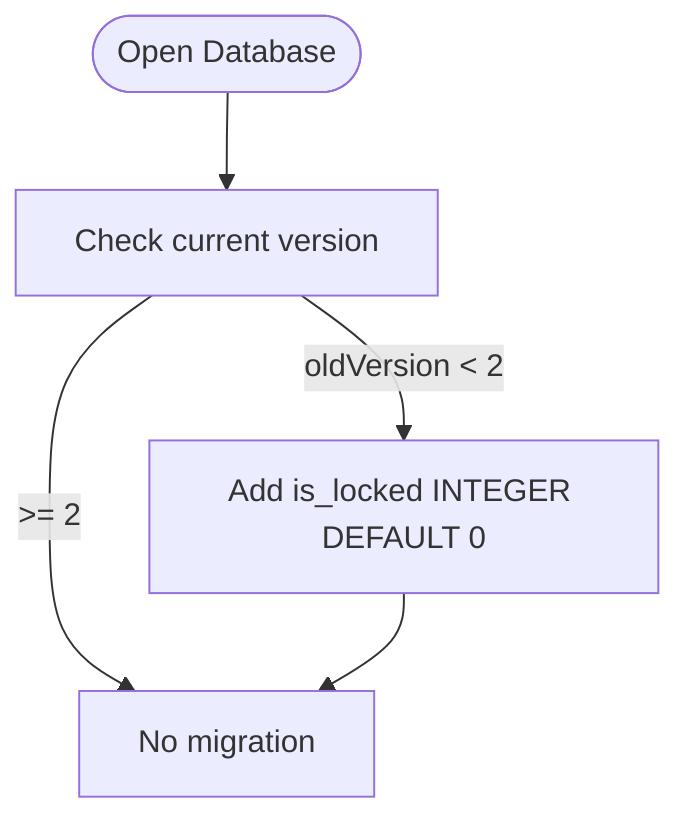
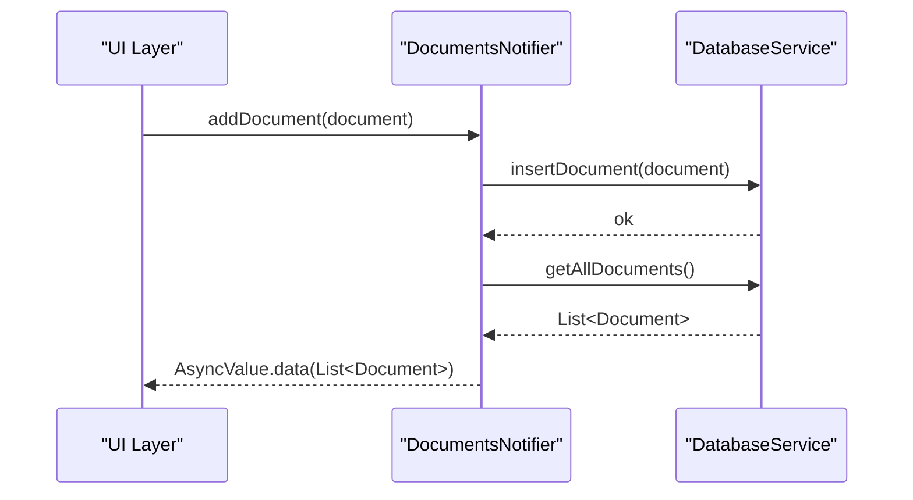
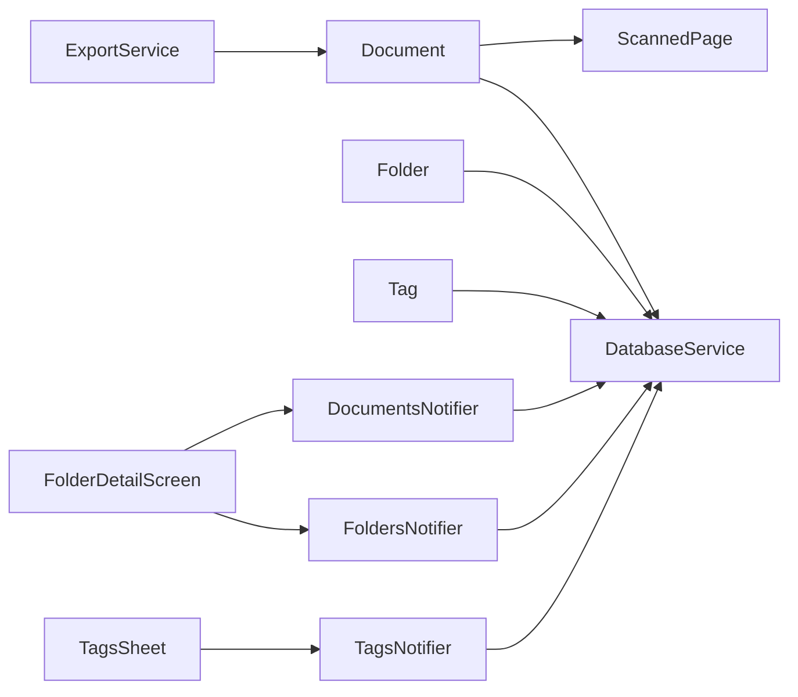

# Data Models & Persistence

<cite>
**Referenced Files in This Document**
- [document.dart](file://lib/models/document.dart)
- [document.freezed.dart](file://lib/models/document.freezed.dart)
- [document.g.dart](file://lib/models/document.g.dart)
- [folder.dart](file://lib/models/folder.dart)
- [folder.freezed.dart](file://lib/models/folder.freezed.dart)
- [folder.g.dart](file://lib/models/folder.g.dart)
- [tag.dart](file://lib/models/tag.dart)
- [tag.freezed.dart](file://lib/models/tag.freezed.dart)
- [tag.g.dart](file://lib/models/tag.g.dart)
- [database_service.dart](file://lib/services/database_service.dart)
- [document_provider.dart](file://lib/providers/document_provider.dart)
- [folder_icons.dart](file://lib/utils/folder_icons.dart)
- [folder_detail_screen.dart](file://lib/screens/folders/folder_detail_screen.dart)
- [tags_sheet.dart](file://lib/screens/tags/tags_sheet.dart)
- [storage_service.dart](file://lib/services/storage_service.dart)
- [export_service.dart](file://lib/services/export_service.dart)
</cite>

## Table of Contents
1. [Introduction](#introduction)
2. [Project Structure](#project-structure)
3. [Core Components](#core-components)
4. [Architecture Overview](#architecture-overview)
5. [Detailed Component Analysis](#detailed-component-analysis)
6. [Dependency Analysis](#dependency-analysis)
7. [Performance Considerations](#performance-considerations)
8. [Troubleshooting Guide](#troubleshooting-guide)
9. [Conclusion](#conclusion)
10. [Appendices](#appendices)

## Introduction
This document describes ScanVault’s persistent data models and their persistence layer. It covers:
- Document model: metadata, page management, and content organization
- Folder model: hierarchical-like organization, icon system, and locking mechanism
- Tag model: categorization and many-to-many association with documents
- Immutable data structures via Freezed, serialization via built_value/g.dart, and validation rules
- Sqflite schema design, relationships, indexing, CRUD operations, migrations, and backup/restore considerations
- Data lifecycle, retention, and performance guidance
- Examples of model usage across the UI and integration with the service layer

## Project Structure
The data model layer is composed of:
- Models: immutable DTOs with serialization support
- Providers: Riverpod state management for reactive UI updates
- Services: database operations, storage paths, and export utilities
- Utilities: icon inference for folders

**Diagram sources**
- [document.dart](file://lib/models/document.dart#L15-L48)
- [folder.dart](file://lib/models/folder.dart#L6-L17)
- [tag.dart](file://lib/models/tag.dart#L6-L13)
- [document_provider.dart](file://lib/providers/document_provider.dart#L8-L136)
- [database_service.dart](file://lib/services/database_service.dart#L11-L412)
- [folder_detail_screen.dart](file://lib/screens/folders/folder_detail_screen.dart#L14-L244)
- [tags_sheet.dart](file://lib/screens/tags/tags_sheet.dart#L9-L175)
- [storage_service.dart](file://lib/services/storage_service.dart#L12-L62)
- [export_service.dart](file://lib/services/export_service.dart#L6-L41)

**Section sources**
- [document.dart](file://lib/models/document.dart#L1-L49)
- [folder.dart](file://lib/models/folder.dart#L1-L21)
- [tag.dart](file://lib/models/tag.dart#L1-L17)
- [document_provider.dart](file://lib/providers/document_provider.dart#L1-L137)
- [database_service.dart](file://lib/services/database_service.dart#L1-L413)

## Core Components
- Document: top-level entity representing a scanned document with metadata, optional OCR text, thumbnail path, and a list of pages. It also tracks tag associations and optional parent folder linkage.
- ScannedPage: immutable page representation with image paths, processed image path, page number, applied filter, and optional OCR text.
- Folder: organizational unit with name, optional icon name, color value, creation timestamp, document count aggregation, and a lock flag.
- Tag: lightweight categorization entity with name and color value.

All models are generated as immutable records using Freezed and support serialization via g.dart.

**Section sources**
- [document.dart](file://lib/models/document.dart#L15-L48)
- [document.freezed.dart](file://lib/models/document.freezed.dart#L220-L324)
- [folder.dart](file://lib/models/folder.dart#L6-L17)
- [folder.freezed.dart](file://lib/models/folder.freezed.dart#L193-L275)
- [tag.dart](file://lib/models/tag.dart#L6-L13)
- [tag.freezed.dart](file://lib/models/tag.freezed.dart#L127-L177)

## Architecture Overview
The persistence architecture centers around Sqflite with explicit foreign keys and indexes. The service layer encapsulates CRUD and joins, while Riverpod providers expose reactive lists to the UI.

**Diagram sources**
- [database_service.dart](file://lib/services/database_service.dart#L32-L96)

**Section sources**
- [database_service.dart](file://lib/services/database_service.dart#L32-L96)

## Detailed Component Analysis

### Document Model
- Fields:
  - id, name, createdAt, modifiedAt
  - folderId: optional parent folder reference
  - tagIds: list of tag identifiers (many-to-many via junction)
  - pages: list of ScannedPage entries
  - ocrText, thumbnailPath: optional content metadata
- Immutability and serialization:
  - Generated via Freezed with deep equality and unmodifiable views for collections
  - Built-in toJson/fromJson via g.dart
- Page management:
  - Pages stored in a separate table with a foreign key to the document
  - Pages are ordered by page_number ascending
- Content organization:
  - Documents can be grouped by folderId
  - Tag associations maintained via document_tags junction table

**Diagram sources**
- [document.dart](file://lib/models/document.dart#L15-L48)
- [document.freezed.dart](file://lib/models/document.freezed.dart#L220-L324)

**Section sources**
- [document.dart](file://lib/models/document.dart#L15-L48)
- [document.freezed.dart](file://lib/models/document.freezed.dart#L220-L324)

### Folder Model
- Fields:
  - id, name, iconName, colorValue, createdAt, documentCount, isLocked
- Organization and locking:
  - Documents reference folderId to group under a folder
  - isLocked enables access control; UI enforces authentication before rendering locked folders
- Icon system:
  - Icon inference based on folder name keywords
  - Optional custom icon name persisted in the model

**Diagram sources**
- [folder.dart](file://lib/models/folder.dart#L6-L17)
- [folder.freezed.dart](file://lib/models/folder.freezed.dart#L193-L275)
- [folder_icons.dart](file://lib/utils/folder_icons.dart#L4-L217)

**Section sources**
- [folder.dart](file://lib/models/folder.dart#L6-L17)
- [folder.freezed.dart](file://lib/models/folder.freezed.dart#L193-L275)
- [folder_icons.dart](file://lib/utils/folder_icons.dart#L4-L217)
- [folder_detail_screen.dart](file://lib/screens/folders/folder_detail_screen.dart#L47-L96)

### Tag Model
- Fields:
  - id, name, colorValue
- Association logic:
  - Many-to-many relationship with documents via document_tags junction table
  - UI supports creating, selecting, and deleting tags

**Diagram sources**
- [tag.dart](file://lib/models/tag.dart#L6-L13)
- [tag.freezed.dart](file://lib/models/tag.freezed.dart#L127-L177)

**Section sources**
- [tag.dart](file://lib/models/tag.dart#L6-L13)
- [tag.freezed.dart](file://lib/models/tag.freezed.dart#L127-L177)
- [tags_sheet.dart](file://lib/screens/tags/tags_sheet.dart#L29-L73)

### Database Schema and Migrations
- Tables and indexes:
  - documents: primary key id; foreign key folder_id references folders(id) with ON DELETE SET NULL
  - pages: primary key id; foreign key document_id references documents(id) with ON DELETE CASCADE
  - folders: primary key id; optional is_locked column introduced in migration
  - tags: primary key id
  - document_tags: composite primary key (document_id, tag_id); foreign keys to documents and tags with CASCADE
  - Indexes: documents(folder_id), pages(document_id)
- Migration:
  - Version bump to 2 adds is_locked to folders with default 0

**Diagram sources**
- [database_service.dart](file://lib/services/database_service.dart#L99-L105)

**Section sources**
- [database_service.dart](file://lib/services/database_service.dart#L31-L97)
- [database_service.dart](file://lib/services/database_service.dart#L99-L105)

### CRUD Operations and Data Access Patterns
- Document CRUD:
  - Insert: persists document row, inserts all pages, and creates tag associations
  - Retrieve: fetches document with joined pages and tagIds; supports by-id, all, and by-folder queries
  - Update/Delete: updates metadata or deletes document (pages cascade)
- Page CRUD:
  - Insert/get by document_id with ordering by page_number
- Folder CRUD:
  - Insert/get all with documentCount aggregation via SQL GROUP BY
  - Update/delete with isLocked toggle
- Tag CRUD:
  - Insert/get all; delete removes tag and orphaned associations (no extra cleanup needed due to CASCADE)

**Diagram sources**
- [document_provider.dart](file://lib/providers/document_provider.dart#L30-L46)
- [database_service.dart](file://lib/services/database_service.dart#L120-L144)
- [database_service.dart](file://lib/services/database_service.dart#L146-L171)

**Section sources**
- [database_service.dart](file://lib/services/database_service.dart#L120-L247)
- [database_service.dart](file://lib/services/database_service.dart#L251-L287)
- [database_service.dart](file://lib/services/database_service.dart#L291-L372)
- [database_service.dart](file://lib/services/database_service.dart#L376-L411)
- [document_provider.dart](file://lib/providers/document_provider.dart#L14-L54)

### Serialization and Validation Rules
- Serialization:
  - Freezed-generated toJson/fromJson via g.dart
  - Collections exposed as unmodifiable views to maintain immutability
- Validation rules:
  - Required fields enforced at model construction (non-nullable fields)
  - Enum appliedFilter serialized as string; deserialization falls back to a safe default if unknown
  - Timestamps stored as milliseconds since epoch

**Section sources**
- [document.freezed.dart](file://lib/models/document.freezed.dart#L250-L265)
- [document.freezed.dart](file://lib/models/document.freezed.dart#L558-L559)
- [database_service.dart](file://lib/services/database_service.dart#L280-L283)

### Data Lifecycle Management and Retention
- Lifecycle:
  - Creation timestamps tracked via createdAt; modification via modifiedAt
  - Deletion of a document triggers cascading deletion of pages and tag associations
  - Deleting a folder does not remove documents; folder_id is set to NULL per foreign key constraint
- Retention:
  - No explicit retention policy in code; implement at application level by filtering older documents or adding a retention date field if needed

**Section sources**
- [database_service.dart](file://lib/services/database_service.dart#L42-L43)
- [database_service.dart](file://lib/services/database_service.dart#L56)
- [database_service.dart](file://lib/services/database_service.dart#L245-L247)
- [database_service.dart](file://lib/services/database_service.dart#L354-L357)

### Backup and Restore
- Local database location:
  - Database file resides under the app’s documents directory
- Backup:
  - Copy the database file from the documents directory to a secure location
- Restore:
  - Replace the database file in the documents directory with the backed-up file
- Notes:
  - Ensure the app is closed during backup/restore
  - After restore, re-open the app to reinitialize the database connection

**Section sources**
- [database_service.dart](file://lib/services/database_service.dart#L19-L27)
- [storage_service.dart](file://lib/services/storage_service.dart#L40-L52)

### Integration Patterns with the Service Layer
- UI integration:
  - FolderDetailScreen filters documents by folderId and enforces folder lock checks
  - TagsSheet manages tag creation/deletion and selection
- Service integration:
  - ExportService consumes Document to share page images
  - StorageService provides configurable storage paths for files

**Section sources**
- [folder_detail_screen.dart](file://lib/screens/folders/folder_detail_screen.dart#L14-L244)
- [tags_sheet.dart](file://lib/screens/tags/tags_sheet.dart#L29-L73)
- [export_service.dart](file://lib/services/export_service.dart#L9-L40)
- [storage_service.dart](file://lib/services/storage_service.dart#L18-L62)

## Dependency Analysis
- Model dependencies:
  - Document depends on ScannedPage and FilterType
  - Folder and Tag are standalone entities
- Provider dependencies:
  - DocumentsNotifier/FoldersNotifier/TemplatesNotifier depend on DatabaseService
- UI dependencies:
  - Screens depend on Riverpod providers and services

**Diagram sources**
- [document.dart](file://lib/models/document.dart#L35-L48)
- [document_provider.dart](file://lib/providers/document_provider.dart#L8-L136)
- [folder_detail_screen.dart](file://lib/screens/folders/folder_detail_screen.dart#L14-L244)
- [tags_sheet.dart](file://lib/screens/tags/tags_sheet.dart#L9-L175)
- [export_service.dart](file://lib/services/export_service.dart#L6-L41)

**Section sources**
- [document.dart](file://lib/models/document.dart#L35-L48)
- [document_provider.dart](file://lib/providers/document_provider.dart#L8-L136)
- [folder_detail_screen.dart](file://lib/screens/folders/folder_detail_screen.dart#L14-L244)
- [tags_sheet.dart](file://lib/screens/tags/tags_sheet.dart#L9-L175)
- [export_service.dart](file://lib/services/export_service.dart#L6-L41)

## Performance Considerations
- Indexes:
  - documents(folder_id) and pages(document_id) improve filtering and join performance
- Queries:
  - Prefer filtered queries (by folder_id, by document_id) to limit result sets
  - Aggregate counts (e.g., documentCount) are computed server-side with GROUP BY
- Immutability:
  - Freezed-generated models reduce accidental mutations and enable efficient equality checks
- Pagination:
  - Consider adding LIMIT/OFFSET for large lists of documents/pages
- Thumbnails:
  - Store thumbnail paths and lazy-load images to reduce memory footprint

[No sources needed since this section provides general guidance]

## Troubleshooting Guide
- Database not initialized:
  - Ensure initialize() is called before accessing db; otherwise, a StateError is thrown
- Migration issues:
  - Verify version bump and migration script executed; check is_locked column presence
- Foreign key constraints:
  - Deleting a folder does not delete documents; folder_id becomes NULL
  - Deleting a document deletes pages and tag associations automatically
- Locking:
  - Locked folders require authentication before rendering; ensure AuthService is wired properly

**Section sources**
- [database_service.dart](file://lib/services/database_service.dart#L108-L113)
- [database_service.dart](file://lib/services/database_service.dart#L100-L105)
- [folder_detail_screen.dart](file://lib/screens/folders/folder_detail_screen.dart#L47-L96)

## Conclusion
ScanVault’s data model is designed around immutable records, explicit relationships, and pragmatic indexing for efficient queries. The service layer cleanly separates persistence concerns, while Riverpod providers deliver reactive UI updates. The schema supports robust CRUD, cascading deletes, and flexible categorization via tags. For production hardening, consider adding explicit retention policies, pagination, and robust error handling around file operations.

[No sources needed since this section summarizes without analyzing specific files]

## Appendices

### Appendix A: Example Usage Scenarios
- Create a document with pages and tags:
  - Construct Document with pages and tagIds
  - Persist via DocumentsNotifier.addDocument
- Organize documents into folders:
  - Create Folder, then update Document.folderId
  - Enforce folder locks in UI before rendering
- Categorize with tags:
  - Create Tag via TagsNotifier.addTag
  - Select tags in UI and persist associations

**Section sources**
- [document_provider.dart](file://lib/providers/document_provider.dart#L30-L46)
- [folder_detail_screen.dart](file://lib/screens/folders/folder_detail_screen.dart#L171-L206)
- [tags_sheet.dart](file://lib/screens/tags/tags_sheet.dart#L29-L48)