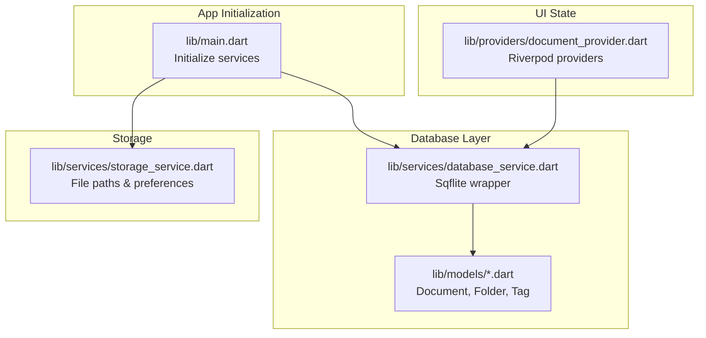
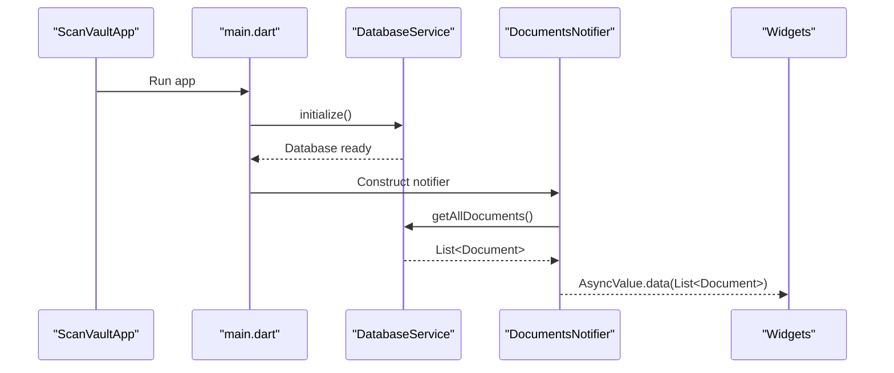
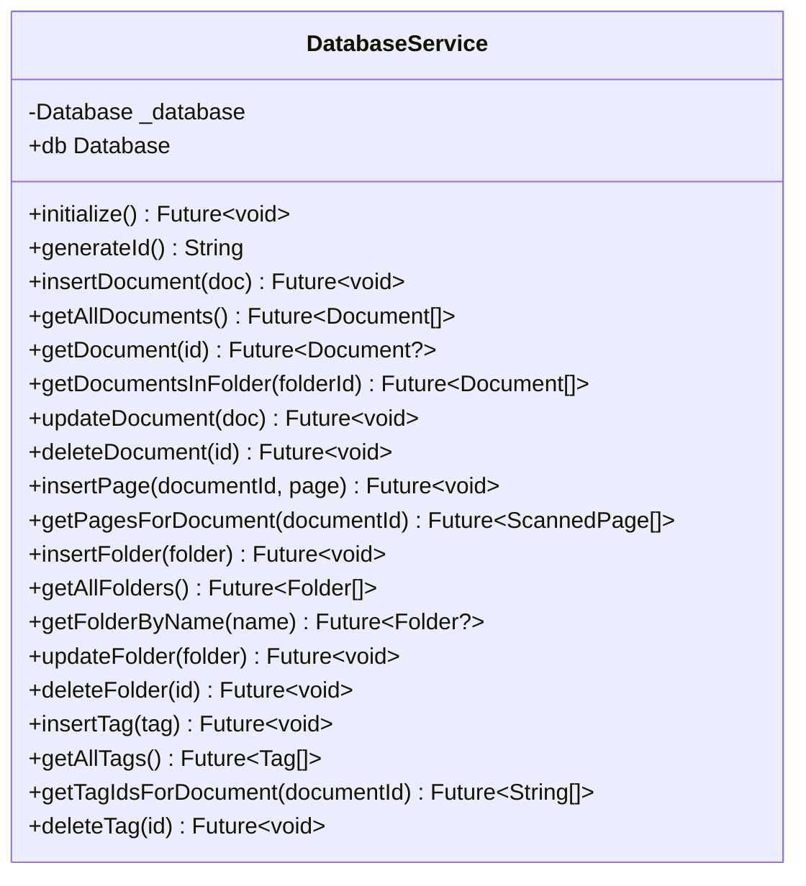
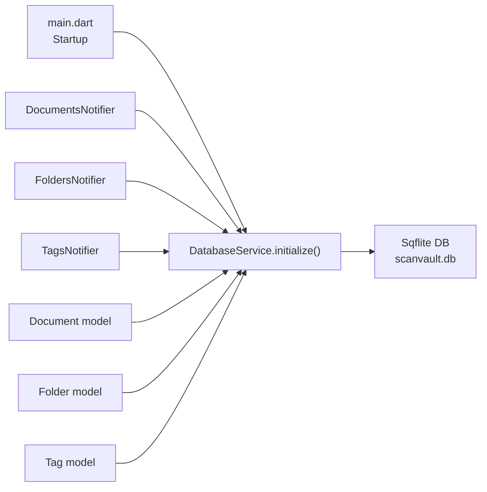
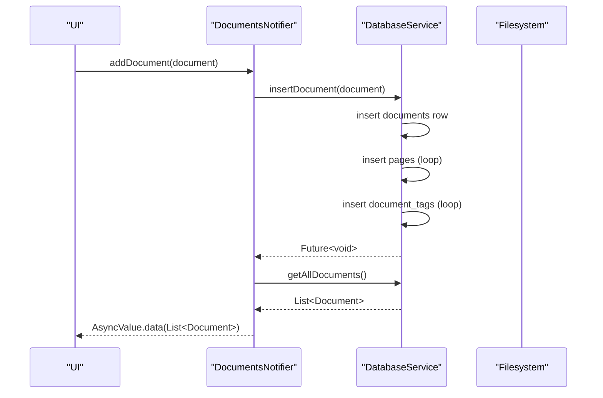
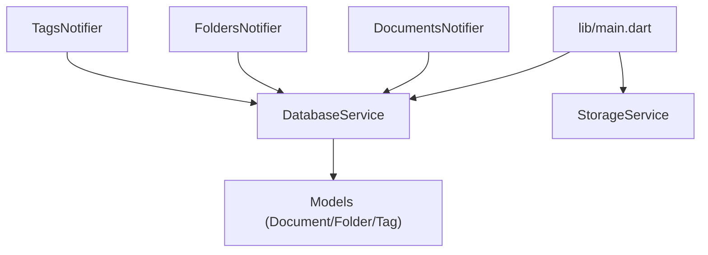

# Database Integration

<cite>
**Referenced Files in This Document**
- [main.dart](file://lib/main.dart)
- [database_service.dart](file://lib/services/database_service.dart)
- [document_provider.dart](file://lib/providers/document_provider.dart)
- [document.dart](file://lib/models/document.dart)
- [folder.dart](file://lib/models/folder.dart)
- [tag.dart](file://lib/models/tag.dart)
- [storage_service.dart](file://lib/services/storage_service.dart)
- [app_exceptions.dart](file://lib/core/exceptions/app_exceptions.dart)
</cite>

## Table of Contents
1. [Introduction](#introduction)
2. [Project Structure](#project-structure)
3. [Core Components](#core-components)
4. [Architecture Overview](#architecture-overview)
5. [Detailed Component Analysis](#detailed-component-analysis)
6. [Dependency Analysis](#dependency-analysis)
7. [Performance Considerations](#performance-considerations)
8. [Troubleshooting Guide](#troubleshooting-guide)
9. [Conclusion](#conclusion)

## Introduction
This document explains the database integration layer built on Sqflite for local persistence. It covers database initialization, schema definition, CRUD operations across models (Document, Folder, Tag), query patterns, migration and versioning, indexing, transactions, error handling, and performance considerations. It also outlines how the database is wired into the application lifecycle and how Riverpod integrates with the service for reactive UI updates.

## Project Structure
The database layer is encapsulated in a centralized service that initializes the database, manages schema creation and migrations, and exposes typed CRUD methods. Providers consume this service to keep UI state synchronized.

**Diagram sources**
- [main.dart](file://lib/main.dart#L10-L31)
- [database_service.dart](file://lib/services/database_service.dart#L15-L28)
- [document_provider.dart](file://lib/providers/document_provider.dart#L9-L12)

**Section sources**
- [main.dart](file://lib/main.dart#L10-L31)
- [database_service.dart](file://lib/services/database_service.dart#L15-L28)
- [document_provider.dart](file://lib/providers/document_provider.dart#L9-L12)

## Core Components
- DatabaseService: Singleton that opens the database, creates tables, applies migrations, and exposes CRUD methods for all models.
- Models: Freezed data classes representing persisted entities and their relationships.
- Providers: Riverpod notifiers that call DatabaseService and refresh UI state.
- StorageService: Manages file storage paths independent of the database but complementary to document/page assets.
- Exceptions: Typed exceptions for robust error handling.

Key responsibilities:
- Database initialization and connection lifecycle
- Schema creation and versioned migrations
- CRUD operations with proper joins and relations
- Indexing for performance
- Error propagation via exceptions

**Section sources**
- [database_service.dart](file://lib/services/database_service.dart#L11-L116)
- [document.dart](file://lib/models/document.dart#L16-L48)
- [folder.dart](file://lib/models/folder.dart#L7-L20)
- [tag.dart](file://lib/models/tag.dart#L7-L16)
- [document_provider.dart](file://lib/providers/document_provider.dart#L14-L54)
- [storage_service.dart](file://lib/services/storage_service.dart#L12-L62)
- [app_exceptions.dart](file://lib/core/exceptions/app_exceptions.dart#L55-L61)

## Architecture Overview
The app initializes services early in startup. DatabaseService opens the Sqflite database and ensures schema readiness. UI components use Riverpod providers to fetch and mutate data via DatabaseService.

**Diagram sources**
- [main.dart](file://lib/main.dart#L20-L28)
- [database_service.dart](file://lib/services/database_service.dart#L147-L171)
- [document_provider.dart](file://lib/providers/document_provider.dart#L19-L28)

## Detailed Component Analysis

### DatabaseService
Responsibilities:
- Initialize database with version and callbacks
- Create tables and indexes
- Apply migrations on version upgrade
- Provide CRUD helpers for Documents, Pages, Folders, Tags
- Resolve relations (pages, tags) for composite reads

Initialization and schema:
- Opens database at a fixed path under application documents directory
- Version set to 2; migration adds a column to folders
- Creates tables with primary keys, foreign keys, defaults, and indexes

Transactions and consistency:
- No explicit transaction blocks are used in the current implementation
- Foreign keys are enforced with cascading and SET NULL behaviors to maintain referential integrity

Indexes:
- Indexes on foreign keys to speed up joins and filtering

Error handling:
- Throws a state error if accessed before initialization
- Consumers should wrap calls in try/catch and propagate domain exceptions

**Diagram sources**
- [database_service.dart](file://lib/services/database_service.dart#L11-L116)
- [database_service.dart](file://lib/services/database_service.dart#L120-L144)
- [database_service.dart](file://lib/services/database_service.dart#L251-L287)
- [database_service.dart](file://lib/services/database_service.dart#L291-L301)
- [database_service.dart](file://lib/services/database_service.dart#L376-L383)
- [database_service.dart](file://lib/services/database_service.dart#L385-L411)

**Section sources**
- [database_service.dart](file://lib/services/database_service.dart#L15-L28)
- [database_service.dart](file://lib/services/database_service.dart#L31-L97)
- [database_service.dart](file://lib/services/database_service.dart#L99-L105)
- [database_service.dart](file://lib/services/database_service.dart#L107-L116)
- [database_service.dart](file://lib/services/database_service.dart#L120-L144)
- [database_service.dart](file://lib/services/database_service.dart#L251-L287)
- [database_service.dart](file://lib/services/database_service.dart#L291-L301)
- [database_service.dart](file://lib/services/database_service.dart#L376-L383)
- [database_service.dart](file://lib/services/database_service.dart#L385-L411)

### Models
Models define the shape of persisted entities and their relationships:
- Document: Composite entity with pages and tagIds
- ScannedPage: Per-page metadata and OCR
- Folder: Organizational unit with optional lock flag
- Tag: Categorization label

These models are used by DatabaseService to map rows to Dart objects and vice versa.

**Section sources**
- [document.dart](file://lib/models/document.dart#L16-L48)
- [folder.dart](file://lib/models/folder.dart#L7-L20)
- [tag.dart](file://lib/models/tag.dart#L7-L16)

### Providers
Providers orchestrate UI state and delegate to DatabaseService:
- DocumentsNotifier loads, inserts, updates, deletes documents
- FoldersNotifier loads, inserts, updates, deletes folders
- TagsNotifier loads, inserts, deletes tags

They wrap calls in try/catch and surface AsyncValue errors to UI.

**Section sources**
- [document_provider.dart](file://lib/providers/document_provider.dart#L14-L54)
- [document_provider.dart](file://lib/providers/document_provider.dart#L62-L94)
- [document_provider.dart](file://lib/providers/document_provider.dart#L109-L136)

### StorageService
While not part of the database layer, StorageService complements it by managing file system paths for scanned images and other assets. It persists a user-selected storage path in SharedPreferences and resolves a working directory for saving files.

**Section sources**
- [storage_service.dart](file://lib/services/storage_service.dart#L12-L62)

## Architecture Overview

**Diagram sources**
- [main.dart](file://lib/main.dart#L20-L28)
- [database_service.dart](file://lib/services/database_service.dart#L15-L28)
- [document_provider.dart](file://lib/providers/document_provider.dart#L19-L28)

## Detailed Component Analysis

### Database Initialization and Connection Handling
- Initializes the database at app startup
- Ensures singleton access via a getter
- Throws if accessed before initialization

Best practices:
- Always call initialize() before any database operation
- Keep the database reference static to avoid multiple connections

**Section sources**
- [main.dart](file://lib/main.dart#L20-L20)
- [database_service.dart](file://lib/services/database_service.dart#L15-L28)
- [database_service.dart](file://lib/services/database_service.dart#L107-L113)

### Schema Management and Migrations
Schema:
- documents: primary key id, name, timestamps, optional folder_id, OCR text, thumbnail path
- pages: primary key id, document_id foreign key, image paths, page number, applied filter, OCR text
- folders: primary key id, name, icon, color, created_at, is_locked
- tags: primary key id, name, color
- document_tags: junction table with composite primary key and cascade deletes

Indexes:
- documents(folder_id)
- pages(document_id)

Migrations:
- Version 1 to 2: Adds is_locked column to folders with default value

Backward compatibility:
- New columns are added with defaults
- Existing data preserved during ALTER TABLE

**Section sources**
- [database_service.dart](file://lib/services/database_service.dart#L31-L97)
- [database_service.dart](file://lib/services/database_service.dart#L99-L105)

### CRUD Operations

#### Documents
- Insert: Inserts document row, then inserts all pages, then inserts tag associations
- Read: getAllDocuments orders by modified_at desc; getDocument by id; getDocumentsInFolder by folder_id
- Update: Updates name, timestamps, folder_id, OCR text, thumbnail path
- Delete: Deletes document (foreign key cascade handles pages; tag associations handled by cascade)

**Diagram sources**
- [document_provider.dart](file://lib/providers/document_provider.dart#L30-L34)
- [database_service.dart](file://lib/services/database_service.dart#L120-L144)
- [database_service.dart](file://lib/services/database_service.dart#L147-L171)

**Section sources**
- [database_service.dart](file://lib/services/database_service.dart#L120-L144)
- [database_service.dart](file://lib/services/database_service.dart#L147-L171)
- [database_service.dart](file://lib/services/database_service.dart#L173-L194)
- [database_service.dart](file://lib/services/database_service.dart#L196-L226)
- [database_service.dart](file://lib/services/database_service.dart#L228-L247)

#### Pages
- Insert: insertPage associates a page with a document
- Read: getPagesForDocument retrieves ordered pages by page_number

**Section sources**
- [database_service.dart](file://lib/services/database_service.dart#L251-L262)
- [database_service.dart](file://lib/services/database_service.dart#L264-L287)

#### Folders
- Insert: insertFolder
- Read: getAllFolders (with document count via SQL GROUP BY), getFolderByName (case-insensitive)
- Update: updateFolder
- Delete: deleteFolder

Note: getAllFolders uses a raw SQL query to compute document counts per folder.

**Section sources**
- [database_service.dart](file://lib/services/database_service.dart#L291-L301)
- [database_service.dart](file://lib/services/database_service.dart#L303-L325)
- [database_service.dart](file://lib/services/database_service.dart#L327-L351)
- [database_service.dart](file://lib/services/database_service.dart#L354-L372)

#### Tags
- Insert: insertTag
- Read: getAllTags
- Association: getTagIdsForDocument via junction table
- Delete: deleteTag

**Section sources**
- [database_service.dart](file://lib/services/database_service.dart#L376-L383)
- [database_service.dart](file://lib/services/database_service.dart#L385-L395)
- [database_service.dart](file://lib/services/database_service.dart#L397-L406)
- [database_service.dart](file://lib/services/database_service.dart#L408-L411)

### Query Patterns and Data Retrieval Strategies
- Composite reads: For Document, fetch pages and tagIds separately and assemble the model
- Aggregation: For Folder, use SQL GROUP BY to compute document counts efficiently
- Filtering: Use WHERE clauses with indexed foreign keys (folder_id, document_id)
- Ordering: Order by modified_at desc for documents; page_number asc for pages

**Section sources**
- [database_service.dart](file://lib/services/database_service.dart#L147-L171)
- [database_service.dart](file://lib/services/database_service.dart#L196-L226)
- [database_service.dart](file://lib/services/database_service.dart#L264-L287)
- [database_service.dart](file://lib/services/database_service.dart#L303-L325)

### Transactions and Data Consistency
Current implementation does not wrap multi-step writes (document + pages + tags) in a single transaction. This can lead to partial writes if an error occurs mid-operation. Recommended improvements:
- Wrap insertDocument in a transaction to ensure atomicity
- Consider transaction blocks around bulk operations

Foreign key constraints:
- documents.folder_id references folders.id with ON DELETE SET NULL
- pages.document_id references documents.id with ON DELETE CASCADE
- document_tags links to both with ON DELETE CASCADE

**Section sources**
- [database_service.dart](file://lib/services/database_service.dart#L31-L97)
- [database_service.dart](file://lib/services/database_service.dart#L120-L144)

### Error Handling Strategies
- Initialization guard: Accessing db before initialize throws a state error
- Provider error propagation: Notifiers catch exceptions and surface AsyncValue.error
- Domain exceptions: Use DatabaseException for database-related failures

Recommendations:
- Wrap database calls in try/catch
- Convert low-level errors to DatabaseException
- Surface user-friendly messages in UI

**Section sources**
- [database_service.dart](file://lib/services/database_service.dart#L107-L113)
- [document_provider.dart](file://lib/providers/document_provider.dart#L22-L27)
- [app_exceptions.dart](file://lib/core/exceptions/app_exceptions.dart#L55-L61)

### Performance Optimization and Indexing
- Indexes: documents(folder_id), pages(document_id)
- Ordering: Use indexes to support ORDER BY clauses
- Queries: Prefer indexed filters; avoid SELECT * when not needed
- Batch operations: Consider batching inserts for pages and tags

**Section sources**
- [database_service.dart](file://lib/services/database_service.dart#L92-L97)
- [database_service.dart](file://lib/services/database_service.dart#L147-L171)

### Backup and Restore
- Database location: Application documents directory
- Backup: Copy the database file from the computed path
- Restore: Replace the database file with a backed-up copy

Note: The current code does not include explicit backup/restore functions; implementers should use the resolved database path.

**Section sources**
- [database_service.dart](file://lib/services/database_service.dart#L19-L20)

### Data Integrity Constraints and Relationships
- Primary keys: documents.id, pages.id, folders.id, tags.id
- Junction table: document_tags (composite PK on (document_id, tag_id))
- Foreign keys: enforce referential integrity with appropriate actions

**Section sources**
- [database_service.dart](file://lib/services/database_service.dart#L31-L97)

### Examples of Complex Queries and Batch Operations
- Complex query: getAllFolders uses a LEFT JOIN with GROUP BY to compute counts
- Batch operations: insertDocument loops over pages and tagIds; consider wrapping in a transaction for atomicity

**Section sources**
- [database_service.dart](file://lib/services/database_service.dart#L303-L325)
- [database_service.dart](file://lib/services/database_service.dart#L120-L144)

## Dependency Analysis

**Diagram sources**
- [main.dart](file://lib/main.dart#L20-L28)
- [document_provider.dart](file://lib/providers/document_provider.dart#L19-L28)
- [database_service.dart](file://lib/services/database_service.dart#L11-L116)

**Section sources**
- [main.dart](file://lib/main.dart#L20-L28)
- [document_provider.dart](file://lib/providers/document_provider.dart#L19-L28)
- [database_service.dart](file://lib/services/database_service.dart#L11-L116)

## Performance Considerations
- Use indexes on foreign keys for filtering and joins
- Minimize N+1 queries by fetching related data in separate queries and assembling in memory
- Consider pagination for large lists
- Avoid unnecessary conversions; pass primitives directly to database
- Batch inserts for pages and tags when possible

[No sources needed since this section provides general guidance]

## Troubleshooting Guide
Common issues and resolutions:
- Database not initialized: Ensure initialize() is called before any db access
- AsyncValue.error in UI: Indicates an exception occurred in a provider; inspect caught error
- Migration errors: Verify version increments and ALTER TABLE correctness
- Foreign key constraint violations: Check referential integrity before inserts/deletes

**Section sources**
- [database_service.dart](file://lib/services/database_service.dart#L107-L113)
- [document_provider.dart](file://lib/providers/document_provider.dart#L22-L27)
- [database_service.dart](file://lib/services/database_service.dart#L99-L105)

## Conclusion
The database integration leverages Sqflite with a clean service abstraction, clear schema design, and Riverpod-driven state management. While the current implementation is functional, adding explicit transaction blocks would improve data consistency for multi-step writes. Indexing and query strategies are aligned with the models’ relationships. Extending the service with backup/restore and transaction support would further harden the layer for production use.