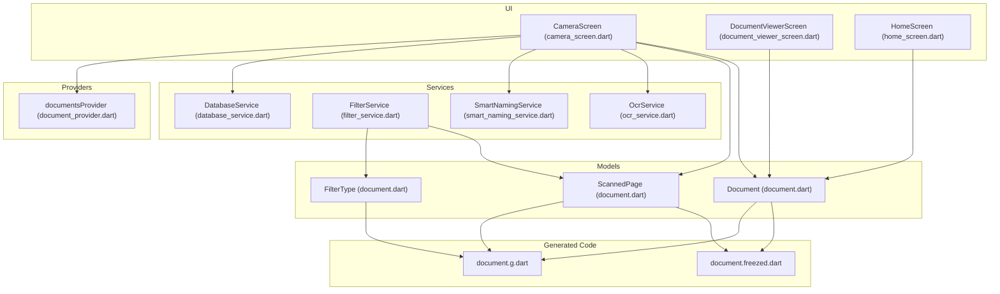
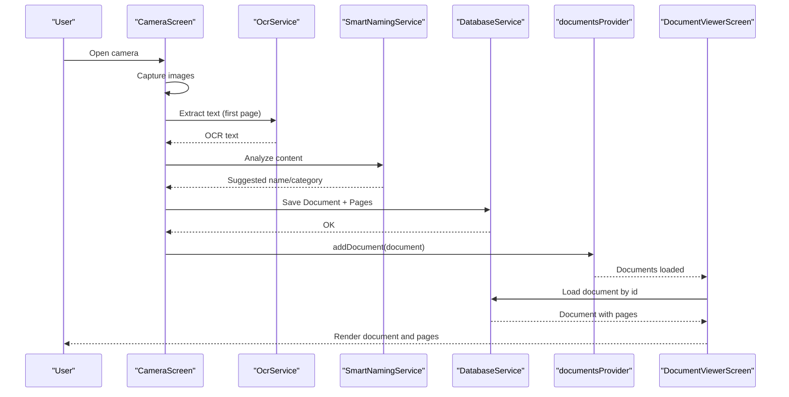
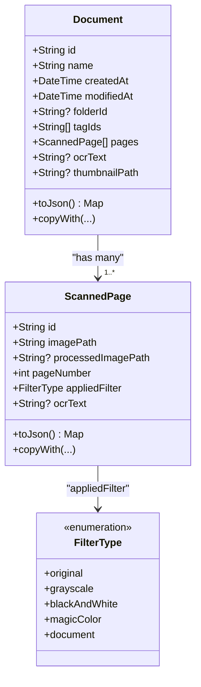
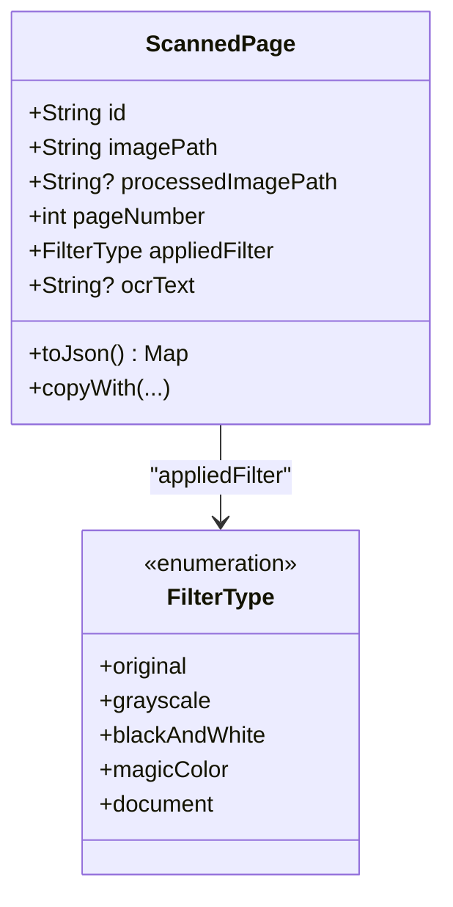
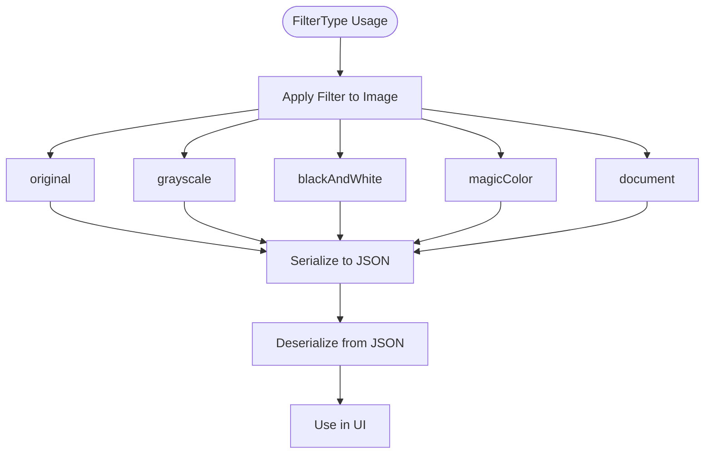
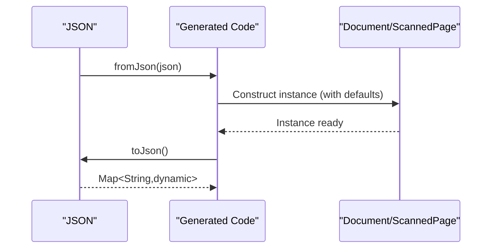
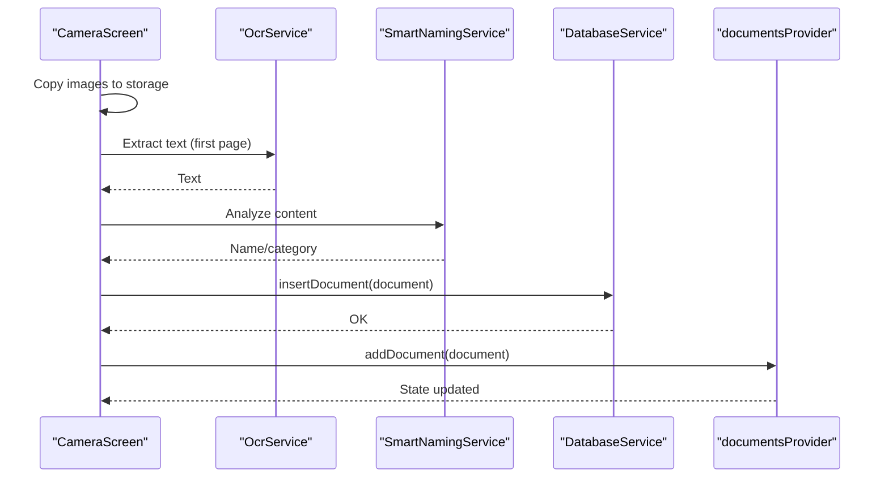
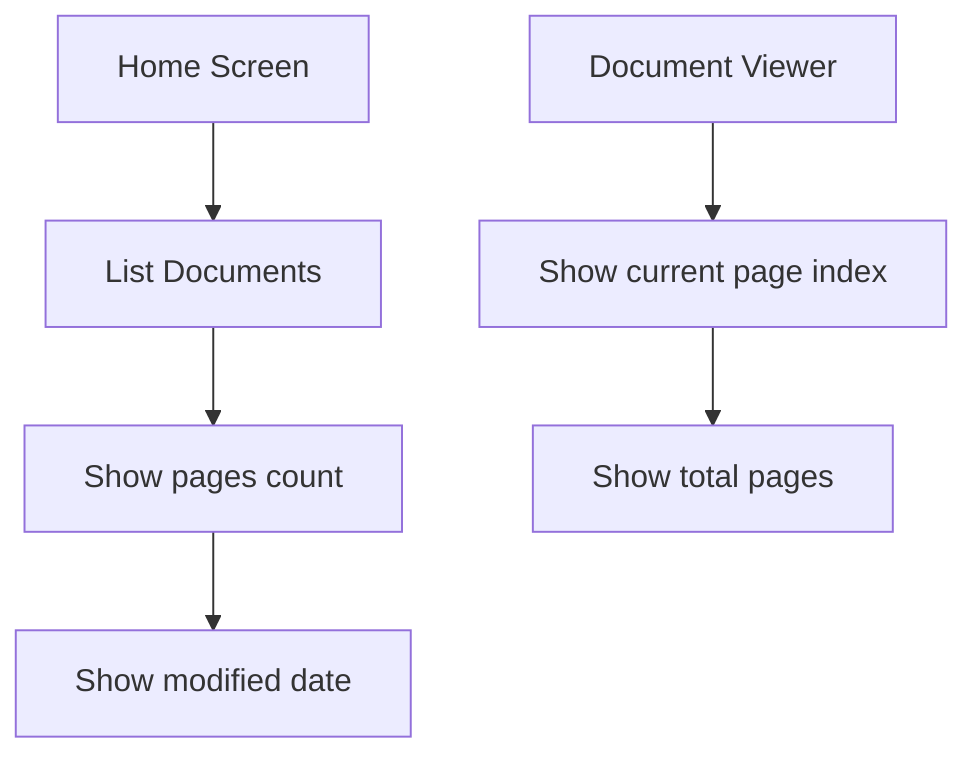
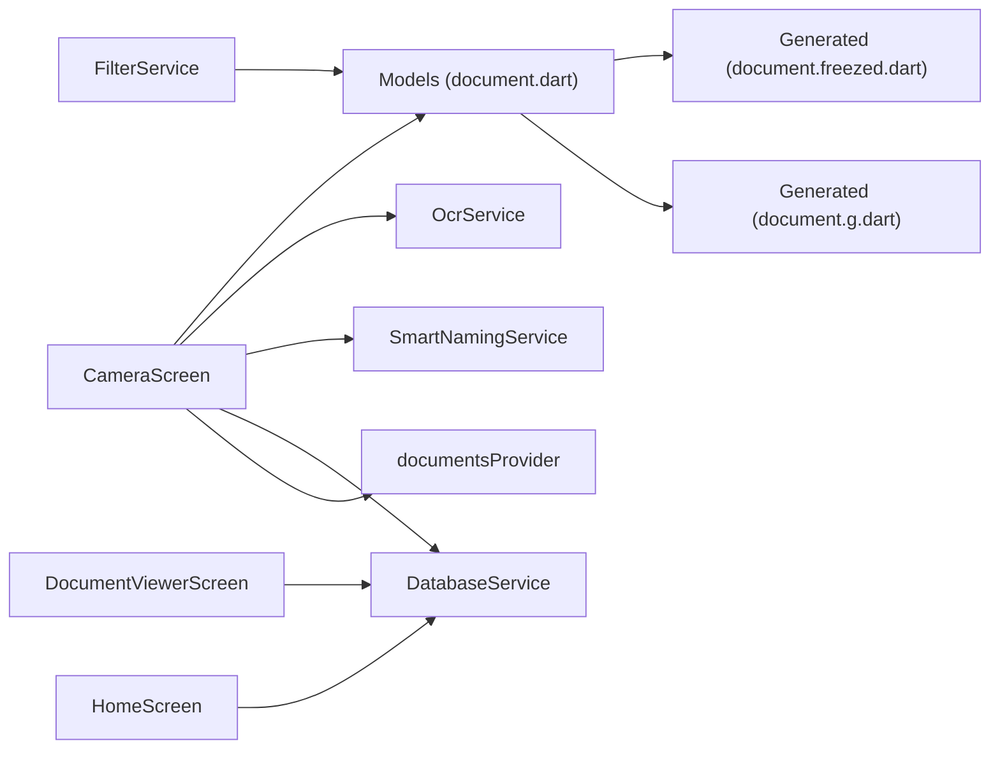

# Document Model

<cite>
**Referenced Files in This Document**
- [document.dart](file://lib/models/document.dart)
- [document.freezed.dart](file://lib/models/document.freezed.dart)
- [document.g.dart](file://lib/models/document.g.dart)
- [camera_screen.dart](file://lib/screens/camera/camera_screen.dart)
- [document_provider.dart](file://lib/providers/document_provider.dart)
- [database_service.dart](file://lib/services/database_service.dart)
- [filter_service.dart](file://lib/services/filter_service.dart)
- [ocr_service.dart](file://lib/services/ocr_service.dart)
- [smart_naming_service.dart](file://lib/services/smart_naming_service.dart)
- [document_viewer_screen.dart](file://lib/screens/document_viewer/document_viewer_screen.dart)
- [home_screen.dart](file://lib/screens/home/home_screen.dart)
</cite>

## Table of Contents
1. [Introduction](#introduction)
2. [Project Structure](#project-structure)
3. [Core Components](#core-components)
4. [Architecture Overview](#architecture-overview)
5. [Detailed Component Analysis](#detailed-component-analysis)
6. [Dependency Analysis](#dependency-analysis)
7. [Performance Considerations](#performance-considerations)
8. [Troubleshooting Guide](#troubleshooting-guide)
9. [Conclusion](#conclusion)

## Introduction
This document explains the Document model and ScannedPage entity used to represent scanned documents and their pages. It covers the Freezed immutable data structure, JSON serialization/deserialization, default value handling, and the FilterType enumeration for image enhancement. It also describes how documents are created, how pages are added, and how data flows through the system from scanning to persistence and viewing.

## Project Structure
The relevant models and their generated code live under lib/models. The scanning workflow creates documents and pages, which are persisted via the database service and exposed to UI through Riverpod providers.

**Diagram sources**
- [document.dart](file://lib/models/document.dart#L1-L49)
- [document.freezed.dart](file://lib/models/document.freezed.dart#L1-L644)
- [document.g.dart](file://lib/models/document.g.dart#L1-L72)
- [camera_screen.dart](file://lib/screens/camera/camera_screen.dart#L1-L242)
- [document_viewer_screen.dart](file://lib/screens/document_viewer/document_viewer_screen.dart#L366-L386)
- [home_screen.dart](file://lib/screens/home/home_screen.dart#L365-L407)
- [database_service.dart](file://lib/services/database_service.dart#L120-L249)
- [filter_service.dart](file://lib/services/filter_service.dart#L1-L105)
- [ocr_service.dart](file://lib/services/ocr_service.dart#L1-L93)
- [smart_naming_service.dart](file://lib/services/smart_naming_service.dart#L1-L104)
- [document_provider.dart](file://lib/providers/document_provider.dart#L1-L137)

**Section sources**
- [document.dart](file://lib/models/document.dart#L1-L49)
- [document.freezed.dart](file://lib/models/document.freezed.dart#L1-L644)
- [document.g.dart](file://lib/models/document.g.dart#L1-L72)
- [camera_screen.dart](file://lib/screens/camera/camera_screen.dart#L1-L242)
- [document_provider.dart](file://lib/providers/document_provider.dart#L1-L137)
- [database_service.dart](file://lib/services/database_service.dart#L120-L249)
- [filter_service.dart](file://lib/services/filter_service.dart#L1-L105)
- [ocr_service.dart](file://lib/services/ocr_service.dart#L1-L93)
- [smart_naming_service.dart](file://lib/services/smart_naming_service.dart#L1-L104)
- [document_viewer_screen.dart](file://lib/screens/document_viewer/document_viewer_screen.dart#L366-L386)
- [home_screen.dart](file://lib/screens/home/home_screen.dart#L365-L407)

## Core Components
- Document: Immutable model representing a scanned document with metadata, optional folder association, tag identifiers, and a collection of pages. It supports JSON serialization and copy-with semantics via Freezed.
- ScannedPage: Immutable model representing a single page with image paths, processing state, page number, applied filter, and optional OCR text.
- FilterType: Enumeration of supported image enhancement filters used by ScannedPage.
- JSON serialization: Generated via JsonSerializable and JsonEnum to convert between Dart objects and JSON maps, including enum mapping and ISO date formatting.
- Defaults: Freezed @Default annotations ensure empty lists and original filter are used when omitted.

Key characteristics:
- Immutability: Freezed generates immutable classes with copyWith support.
- Serialization: toJson/fromJson generated for both Document and ScannedPage.
- Defaults: Lists default to empty; appliedFilter defaults to original.
- Collections: Document.pages holds ScannedPage instances; tagIds is a list of identifiers.

**Section sources**
- [document.dart](file://lib/models/document.dart#L6-L48)
- [document.freezed.dart](file://lib/models/document.freezed.dart#L220-L324)
- [document.g.dart](file://lib/models/document.g.dart#L9-L63)

## Architecture Overview
The scanning pipeline creates a Document with multiple ScannedPage entries, persists them, and exposes them to the UI through Riverpod. Filtering and OCR enhance and enrich the data.

**Diagram sources**
- [camera_screen.dart](file://lib/screens/camera/camera_screen.dart#L76-L216)
- [ocr_service.dart](file://lib/services/ocr_service.dart#L9-L18)
- [smart_naming_service.dart](file://lib/services/smart_naming_service.dart#L8-L43)
- [database_service.dart](file://lib/services/database_service.dart#L120-L194)
- [document_provider.dart](file://lib/providers/document_provider.dart#L30-L34)
- [document_viewer_screen.dart](file://lib/screens/document_viewer/document_viewer_screen.dart#L325-L334)

## Detailed Component Analysis

### Document Model
- Required fields: id, name, createdAt, modifiedAt.
- Optional associations: folderId, tagIds (default empty list), pages (default empty list).
- Additional fields: ocrText, thumbnailPath.
- Copy semantics: copyWith generated by Freezed; JSON via generated toJson/fromJson.
- Equality and hashing: Deep equality for collections; hash computed from all fields.

**Diagram sources**
- [document.dart](file://lib/models/document.dart#L16-L48)
- [document.freezed.dart](file://lib/models/document.freezed.dart#L220-L324)
- [document.g.dart](file://lib/models/document.g.dart#L9-L41)

**Section sources**
- [document.dart](file://lib/models/document.dart#L16-L32)
- [document.freezed.dart](file://lib/models/document.freezed.dart#L220-L324)
- [document.g.dart](file://lib/models/document.g.dart#L9-L41)

### ScannedPage Model
- Required fields: id, imagePath, pageNumber.
- Optional fields: processedImagePath, ocrText.
- Applied filter: FilterType with default original.
- JSON mapping: Enum serialized to string; pageNumber stored as integer.

**Diagram sources**
- [document.dart](file://lib/models/document.dart#L35-L48)
- [document.freezed.dart](file://lib/models/document.freezed.dart#L535-L609)
- [document.g.dart](file://lib/models/document.g.dart#L43-L63)

**Section sources**
- [document.dart](file://lib/models/document.dart#L35-L48)
- [document.freezed.dart](file://lib/models/document.freezed.dart#L535-L609)
- [document.g.dart](file://lib/models/document.g.dart#L43-L63)

### FilterType Enumeration
- Values: original, grayscale, blackAndWhite, magicColor, document.
- Used by ScannedPage.appliedFilter.
- Serialized to/from JSON using a generated enum map.

**Diagram sources**
- [document.dart](file://lib/models/document.dart#L7-L13)
- [document.g.dart](file://lib/models/document.g.dart#L65-L71)
- [filter_service.dart](file://lib/services/filter_service.dart#L18-L27)

**Section sources**
- [document.dart](file://lib/models/document.dart#L7-L13)
- [document.g.dart](file://lib/models/document.g.dart#L65-L71)
- [filter_service.dart](file://lib/services/filter_service.dart#L1-L105)

### JSON Serialization and Deserialization
- Document:
  - Fields: id, name, createdAt (ISO string), modifiedAt (ISO string), folderId, tagIds, pages, ocrText, thumbnailPath.
  - Pages deserialized as ScannedPage instances.
- ScannedPage:
  - Fields: id, imagePath, processedImagePath, pageNumber, appliedFilter (string), ocrText.
  - appliedFilter deserializes with default fallback to original if missing or unknown.
- Enum mapping:
  - FilterType serialized to lowercase string; deserialization uses a generated map with a safe default.

**Diagram sources**
- [document.g.dart](file://lib/models/document.g.dart#L9-L63)
- [document.freezed.dart](file://lib/models/document.freezed.dart#L18-L20)
- [document.freezed.dart](file://lib/models/document.freezed.dart#L369-L371)

**Section sources**
- [document.g.dart](file://lib/models/document.g.dart#L9-L63)
- [document.freezed.dart](file://lib/models/document.freezed.dart#L18-L20)
- [document.freezed.dart](file://lib/models/document.freezed.dart#L369-L371)

### Data Transformation Workflows

#### Document Creation and Page Addition
- Camera captures images and copies them to persistent storage.
- First page OCR extracts text for smart naming and initial document OCR text.
- Pages are created with ids, image paths, page numbers, and default original filter.
- Document is assembled with metadata, pages, optional folderId, and thumbnail path.
- Saved via DatabaseService and exposed through documentsProvider.

**Diagram sources**
- [camera_screen.dart](file://lib/screens/camera/camera_screen.dart#L76-L216)
- [ocr_service.dart](file://lib/services/ocr_service.dart#L9-L18)
- [smart_naming_service.dart](file://lib/services/smart_naming_service.dart#L8-L43)
- [database_service.dart](file://lib/services/database_service.dart#L120-L143)
- [document_provider.dart](file://lib/providers/document_provider.dart#L30-L34)

**Section sources**
- [camera_screen.dart](file://lib/screens/camera/camera_screen.dart#L76-L216)
- [ocr_service.dart](file://lib/services/ocr_service.dart#L9-L18)
- [smart_naming_service.dart](file://lib/services/smart_naming_service.dart#L8-L43)
- [database_service.dart](file://lib/services/database_service.dart#L120-L143)
- [document_provider.dart](file://lib/providers/document_provider.dart#L30-L34)

#### Pagination and Content Organization
- Home screen displays documents with page counts and last modified dates.
- Document viewer shows current page index and total pages.
- Documents can be filtered by folder and tagged; tags are managed separately.

**Diagram sources**
- [home_screen.dart](file://lib/screens/home/home_screen.dart#L365-L407)
- [document_viewer_screen.dart](file://lib/screens/document_viewer/document_viewer_screen.dart#L366-L386)

**Section sources**
- [home_screen.dart](file://lib/screens/home/home_screen.dart#L365-L407)
- [document_viewer_screen.dart](file://lib/screens/document_viewer/document_viewer_screen.dart#L366-L386)

## Dependency Analysis
- Models depend on Freezed and built-in JSON generation.
- UI depends on Riverpod for state and routes to navigate between screens.
- Services encapsulate OCR, filtering, and persistence.
- DatabaseService orchestrates insertion and retrieval of documents and pages.

**Diagram sources**
- [document.dart](file://lib/models/document.dart#L1-L49)
- [document.freezed.dart](file://lib/models/document.freezed.dart#L1-L644)
- [document.g.dart](file://lib/models/document.g.dart#L1-L72)
- [camera_screen.dart](file://lib/screens/camera/camera_screen.dart#L1-L242)
- [document_provider.dart](file://lib/providers/document_provider.dart#L1-L137)
- [database_service.dart](file://lib/services/database_service.dart#L120-L249)
- [filter_service.dart](file://lib/services/filter_service.dart#L1-L105)
- [ocr_service.dart](file://lib/services/ocr_service.dart#L1-L93)
- [smart_naming_service.dart](file://lib/services/smart_naming_service.dart#L1-L104)
- [document_viewer_screen.dart](file://lib/screens/document_viewer/document_viewer_screen.dart#L325-L334)
- [home_screen.dart](file://lib/screens/home/home_screen.dart#L365-L407)

**Section sources**
- [document.dart](file://lib/models/document.dart#L1-L49)
- [document.freezed.dart](file://lib/models/document.freezed.dart#L1-L644)
- [document.g.dart](file://lib/models/document.g.dart#L1-L72)
- [camera_screen.dart](file://lib/screens/camera/camera_screen.dart#L1-L242)
- [document_provider.dart](file://lib/providers/document_provider.dart#L1-L137)
- [database_service.dart](file://lib/services/database_service.dart#L120-L249)
- [filter_service.dart](file://lib/services/filter_service.dart#L1-L105)
- [ocr_service.dart](file://lib/services/ocr_service.dart#L1-L93)
- [smart_naming_service.dart](file://lib/services/smart_naming_service.dart#L1-L104)
- [document_viewer_screen.dart](file://lib/screens/document_viewer/document_viewer_screen.dart#L325-L334)
- [home_screen.dart](file://lib/screens/home/home_screen.dart#L365-L407)

## Performance Considerations
- Prefer immutable models to reduce accidental mutations and simplify concurrency.
- Use copyWith for incremental updates to minimize recomputation.
- Keep pages ordered and paginated in UI to avoid rendering large lists.
- Defer heavy operations (OCR, encryption) to background tasks and cache results where appropriate.
- Use thumbnails for quick previews and lazy-load full-resolution images.

## Troubleshooting Guide
- JSON parsing errors:
  - Ensure dates are ISO strings and enums match the generated map keys.
  - appliedFilter defaults to original if missing or unknown.
- Missing or invalid image paths:
  - Verify copied files exist before constructing ScannedPage.
  - Confirm thumbnail path is set for the first page.
- State synchronization:
  - After adding/updating/deleting documents, refresh the provider state to reflect changes.
- Filter previews:
  - If previews fail, ensure the image decodes correctly and generate thumbnails with a safe size.

**Section sources**
- [document.g.dart](file://lib/models/document.g.dart#L43-L53)
- [camera_screen.dart](file://lib/screens/camera/camera_screen.dart#L146-L154)
- [document_provider.dart](file://lib/providers/document_provider.dart#L30-L46)
- [filter_service.dart](file://lib/services/filter_service.dart#L70-L93)

## Conclusion
The Document and ScannedPage models provide a robust, immutable foundation for representing scanned documents and their pages. Freezed and generated JSON code ensure type-safe serialization and convenient copy semantics. The scanning workflow integrates OCR and smart naming to enrich documents, while the UI and providers enable efficient browsing and editing. The FilterType enumeration and FilterService support flexible image enhancement, and the database service maintains reliable persistence.