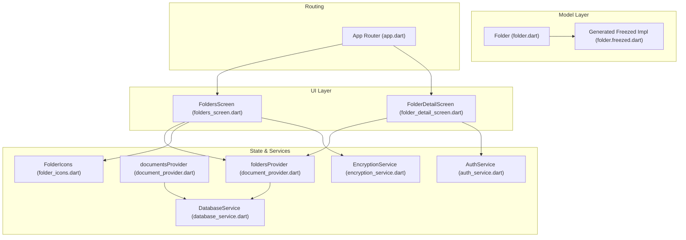
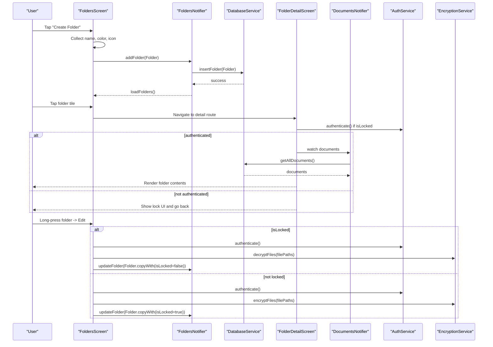
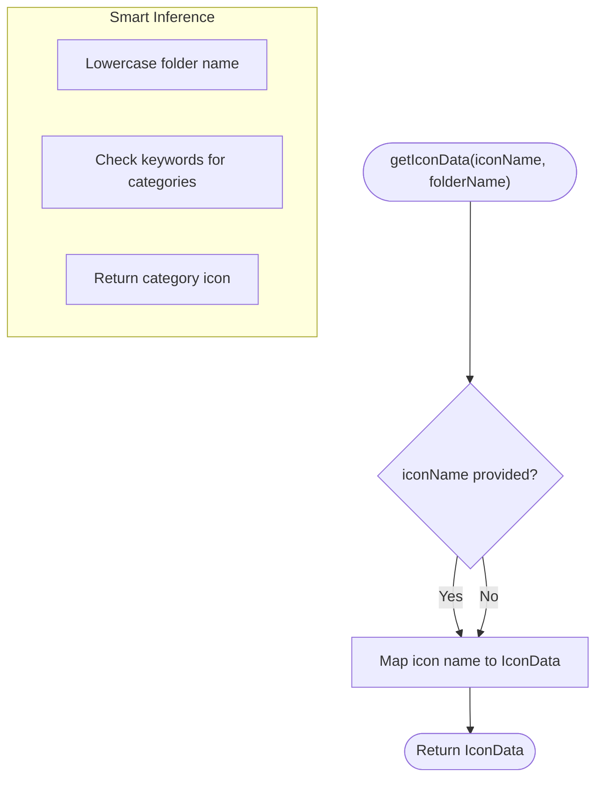
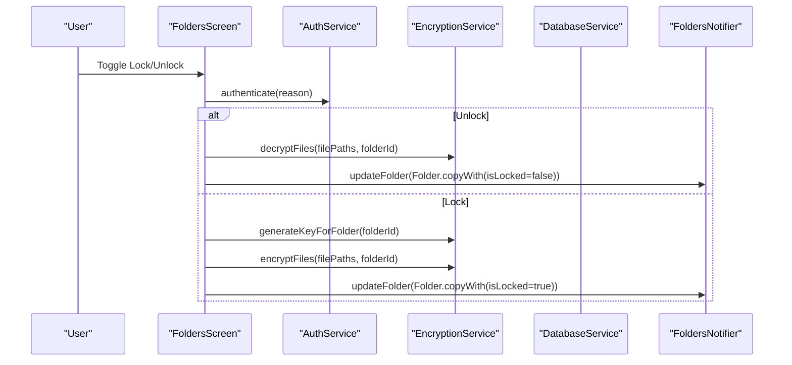
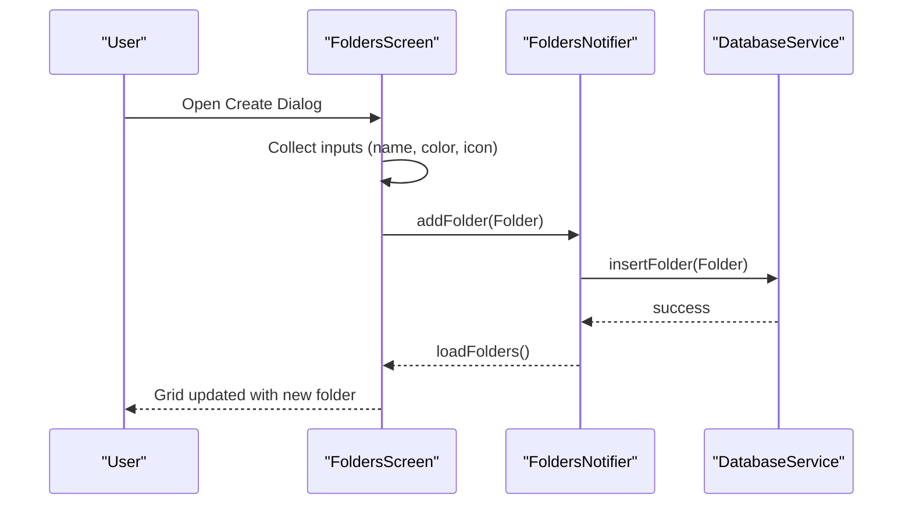
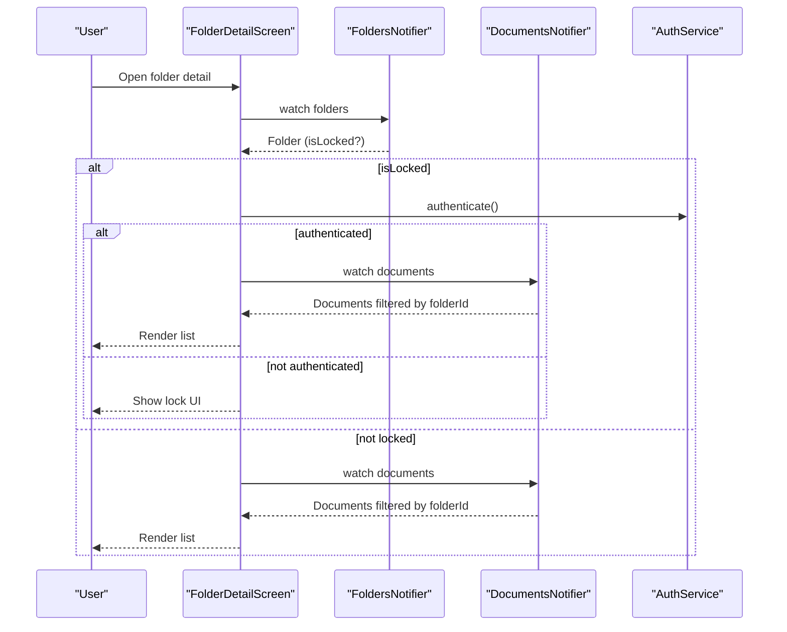
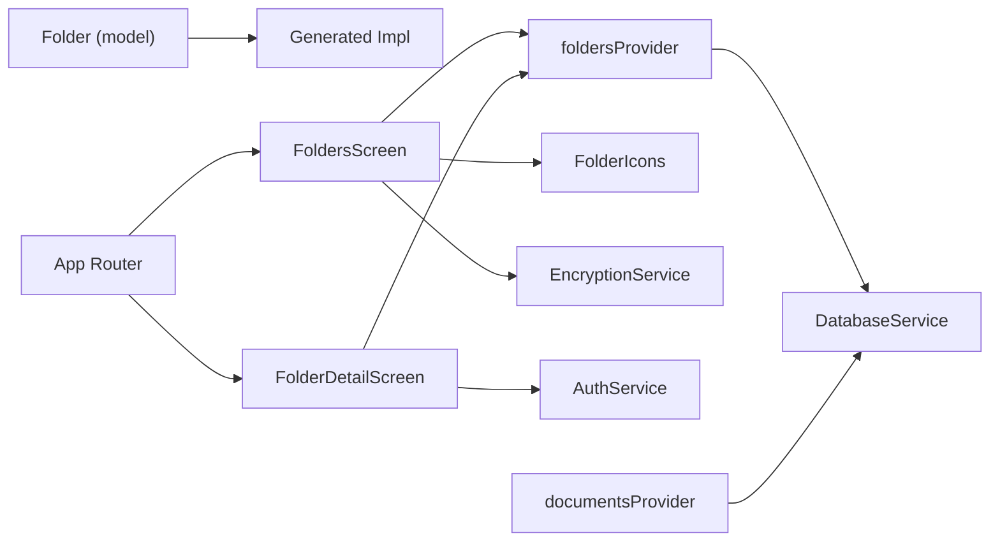

# Folder Model

<cite>
**Referenced Files in This Document**
- [folder.dart](file://lib/models/folder.dart)
- [folder.freezed.dart](file://lib/models/folder.freezed.dart)
- [folder_icons.dart](file://lib/utils/folder_icons.dart)
- [folders_screen.dart](file://lib/screens/folders/folders_screen.dart)
- [folder_detail_screen.dart](file://lib/screens/folders/folder_detail_screen.dart)
- [document_provider.dart](file://lib/providers/document_provider.dart)
- [database_service.dart](file://lib/services/database_service.dart)
- [encryption_service.dart](file://lib/services/encryption_service.dart)
- [auth_service.dart](file://lib/services/auth_service.dart)
- [app.dart](file://lib/app.dart)
- [document.dart](file://lib/models/document.dart)
</cite>

## Table of Contents
1. [Introduction](#introduction)
2. [Project Structure](#project-structure)
3. [Core Components](#core-components)
4. [Architecture Overview](#architecture-overview)
5. [Detailed Component Analysis](#detailed-component-analysis)
6. [Dependency Analysis](#dependency-analysis)
7. [Performance Considerations](#performance-considerations)
8. [Troubleshooting Guide](#troubleshooting-guide)
9. [Conclusion](#conclusion)

## Introduction
This document provides comprehensive technical documentation for the Folder model implementation in the ScanVault application. It explains the hierarchical folder structure, icon system for visual organization, and locking mechanisms for security. It details folder relationship patterns with documents, the Freezed immutable implementation, serialization patterns, and default configurations. It also covers examples of folder creation, organization workflows, security features, navigation patterns, and integration with the document management system. Finally, it documents the folder icons utility and customization options for user interface consistency.

## Project Structure
The Folder model and its ecosystem are organized across several layers:
- Model definition and Freezed code generation
- UI screens for folder management and detail views
- Providers for reactive state management
- Services for persistence, encryption, and authentication
- Routing configuration for navigation



**Diagram sources**
- [folder.dart](file://lib/models/folder.dart#L1-L21)
- [folder.freezed.dart](file://lib/models/folder.freezed.dart#L193-L275)
- [folders_screen.dart](file://lib/screens/folders/folders_screen.dart#L1-L680)
- [folder_detail_screen.dart](file://lib/screens/folders/folder_detail_screen.dart#L1-L290)
- [document_provider.dart](file://lib/providers/document_provider.dart#L56-L95)
- [database_service.dart](file://lib/services/database_service.dart#L289-L372)
- [encryption_service.dart](file://lib/services/encryption_service.dart#L1-L150)
- [auth_service.dart](file://lib/services/auth_service.dart#L1-L63)
- [app.dart](file://lib/app.dart#L66-L118)

**Section sources**
- [folder.dart](file://lib/models/folder.dart#L1-L21)
- [folder.freezed.dart](file://lib/models/folder.freezed.dart#L193-L275)
- [folders_screen.dart](file://lib/screens/folders/folders_screen.dart#L1-L680)
- [folder_detail_screen.dart](file://lib/screens/folders/folder_detail_screen.dart#L1-L290)
- [document_provider.dart](file://lib/providers/document_provider.dart#L56-L95)
- [database_service.dart](file://lib/services/database_service.dart#L289-L372)
- [encryption_service.dart](file://lib/services/encryption_service.dart#L1-L150)
- [auth_service.dart](file://lib/services/auth_service.dart#L1-L63)
- [app.dart](file://lib/app.dart#L66-L118)

## Core Components
- Folder model: Immutable record with Freezed, including defaults for color, document count, and lock state.
- Folder icons utility: Smart icon inference from folder name and explicit icon selection.
- Folder screens: Grid view for creation/editing and detail view for browsing documents.
- Providers: Reactive state for folders and documents.
- Services: Persistence, encryption, and authentication for secure folder operations.
- Routing: Navigation between folders list and folder detail.

**Section sources**
- [folder.dart](file://lib/models/folder.dart#L6-L20)
- [folder.freezed.dart](file://lib/models/folder.freezed.dart#L193-L275)
- [folder_icons.dart](file://lib/utils/folder_icons.dart#L1-L218)
- [folders_screen.dart](file://lib/screens/folders/folders_screen.dart#L1-L680)
- [folder_detail_screen.dart](file://lib/screens/folders/folder_detail_screen.dart#L1-L290)
- [document_provider.dart](file://lib/providers/document_provider.dart#L56-L95)
- [database_service.dart](file://lib/services/database_service.dart#L289-L372)
- [encryption_service.dart](file://lib/services/encryption_service.dart#L1-L150)
- [auth_service.dart](file://lib/services/auth_service.dart#L1-L63)
- [app.dart](file://lib/app.dart#L66-L118)

## Architecture Overview
The Folder model integrates with the document management system through:
- Parent-child relationships: Documents carry a folderId that references a Folder’s id.
- Hierarchical organization: Folders are displayed in a grid and navigated to a detail view.
- Security: Locking toggles encryption/decryption of document images and requires authentication.
- Visual consistency: Icons inferred from folder names or explicitly chosen.



**Diagram sources**
- [folders_screen.dart](file://lib/screens/folders/folders_screen.dart#L81-L281)
- [folder_detail_screen.dart](file://lib/screens/folders/folder_detail_screen.dart#L24-L97)
- [document_provider.dart](file://lib/providers/document_provider.dart#L56-L95)
- [database_service.dart](file://lib/services/database_service.dart#L291-L372)
- [encryption_service.dart](file://lib/services/encryption_service.dart#L38-L134)
- [auth_service.dart](file://lib/services/auth_service.dart#L26-L52)
- [app.dart](file://lib/app.dart#L94-L104)

## Detailed Component Analysis

### Folder Model and Freezed Implementation
- Immutable record: Uses Freezed to define Folder with a sealed class and generated implementation.
- Defaults: Color defaults to a teal tone, documentCount starts at zero, isLocked defaults to false.
- Serialization: Generated code handles JSON serialization/deserialization via JsonSerializable.
- Equality and hashing: Generated implementation ensures structural equality and hash computation.
- Copy semantics: copyWith allows immutable updates to fields.

```mermaid
classDiagram
class Folder {
+String id
+String name
+String? iconName
+int colorValue
+DateTime createdAt
+int documentCount
+bool isLocked
+toJson() Map
+copyWith(...) Folder
}
class _$FolderImpl {
+String id
+String name
+String? iconName
+int colorValue
+DateTime createdAt
+int documentCount
+bool isLocked
+toString() String
+operator==(Object) bool
+hashCode int
+toJson() Map
+copyWith(...) _$FolderImpl
}
Folder <|-- _$FolderImpl : "generated implementation"
```

**Diagram sources**
- [folder.dart](file://lib/models/folder.dart#L6-L20)
- [folder.freezed.dart](file://lib/models/folder.freezed.dart#L193-L275)

**Section sources**
- [folder.dart](file://lib/models/folder.dart#L6-L20)
- [folder.freezed.dart](file://lib/models/folder.freezed.dart#L193-L275)

### Folder Relationship Patterns and Document Associations
- Parent-child relationship: Documents include a folderId field referencing a Folder’s id.
- Filtering: The detail screen filters documents by folderId to display only those belonging to the selected folder.
- Counting: The database query groups folders with document counts for efficient UI rendering.

```mermaid
erDiagram
FOLDERS {
string id PK
string name
string? icon_name
int color_value
int created_at
int is_locked
}
DOCUMENTS {
string id PK
string name
int created_at
int modified_at
string? folder_id FK
string[] tag_ids
string[] page_paths
string? thumbnail_path
}
FOLDERS ||--o{ DOCUMENTS : "contains"
```

**Diagram sources**
- [database_service.dart](file://lib/services/database_service.dart#L304-L325)
- [document.dart](file://lib/models/document.dart#L16-L32)

**Section sources**
- [document.dart](file://lib/models/document.dart#L16-L32)
- [database_service.dart](file://lib/services/database_service.dart#L304-L325)
- [folder_detail_screen.dart](file://lib/screens/folders/folder_detail_screen.dart#L131-L168)

### Folder Icons Utility and Customization
- Smart inference: If no explicit icon is set, the utility infers an icon based on keywords in the folder name (e.g., financial, legal, medical, personal, work, school, travel, shopping, home, insurance, important, archive).
- Explicit selection: Users can pick from a curated list of available icons; the utility exposes a map of icon names to IconData and reverse lookup helpers.
- UI integration: The grid item displays the icon with the folder’s color and shows a lock badge when the folder is locked.



**Diagram sources**
- [folder_icons.dart](file://lib/utils/folder_icons.dart#L8-L164)

**Section sources**
- [folder_icons.dart](file://lib/utils/folder_icons.dart#L1-L218)
- [folders_screen.dart](file://lib/screens/folders/folders_screen.dart#L314-L336)

### Security: Locking Mechanisms and Encryption
- Lock toggle: Toggling a folder’s isLocked flag triggers encryption or decryption of all image files in that folder.
- Authentication: Biometric/PIN authentication is required before unlocking or locking a folder.
- Key management: A per-folder encryption key is stored securely and used to encrypt/decrypt files.
- Workflow: On lock, a key is generated, files are encrypted, and the folder is marked locked. On unlock, files are decrypted and the folder is marked unlocked.



**Diagram sources**
- [folders_screen.dart](file://lib/screens/folders/folders_screen.dart#L534-L620)
- [auth_service.dart](file://lib/services/auth_service.dart#L26-L52)
- [encryption_service.dart](file://lib/services/encryption_service.dart#L15-L134)
- [database_service.dart](file://lib/services/database_service.dart#L354-L372)

**Section sources**
- [folders_screen.dart](file://lib/screens/folders/folders_screen.dart#L534-L620)
- [auth_service.dart](file://lib/services/auth_service.dart#L1-L63)
- [encryption_service.dart](file://lib/services/encryption_service.dart#L1-L150)
- [database_service.dart](file://lib/services/database_service.dart#L354-L372)

### Folder Creation and Organization Workflows
- Creation: The folders screen presents a dialog to enter a name, select a color, and choose an icon (auto or explicit). A new Folder is created with defaults and inserted via the provider.
- Editing: Long-pressing a folder opens an edit dialog allowing renaming, color/icon changes, and lock/unlock toggling.
- Navigation: The app router defines nested routes for the folders list and individual folder detail screens.



**Diagram sources**
- [folders_screen.dart](file://lib/screens/folders/folders_screen.dart#L81-L281)
- [document_provider.dart](file://lib/providers/document_provider.dart#L78-L82)
- [database_service.dart](file://lib/services/database_service.dart#L291-L301)

**Section sources**
- [folders_screen.dart](file://lib/screens/folders/folders_screen.dart#L81-L281)
- [document_provider.dart](file://lib/providers/document_provider.dart#L56-L95)
- [database_service.dart](file://lib/services/database_service.dart#L291-L301)
- [app.dart](file://lib/app.dart#L94-L104)

### Folder Detail View and Document Association
- Access control: If a folder is locked, the detail screen requests authentication before showing contents.
- Content display: Filters documents by folderId and renders a list with thumbnails and metadata.
- UI indicators: Shows a lock icon in the app bar and empty state visuals when no documents are present.



**Diagram sources**
- [folder_detail_screen.dart](file://lib/screens/folders/folder_detail_screen.dart#L24-L97)
- [document_provider.dart](file://lib/providers/document_provider.dart#L9-L17)
- [auth_service.dart](file://lib/services/auth_service.dart#L26-L52)

**Section sources**
- [folder_detail_screen.dart](file://lib/screens/folders/folder_detail_screen.dart#L1-L290)
- [document_provider.dart](file://lib/providers/document_provider.dart#L9-L17)

## Dependency Analysis
- Model depends on Freezed for immutability and code generation.
- Screens depend on providers for reactive state and on services for persistence and security.
- Providers depend on DatabaseService for CRUD operations.
- Locking workflow depends on EncryptionService and AuthService.
- Routing depends on GoRouter for nested navigation.



**Diagram sources**
- [folder.dart](file://lib/models/folder.dart#L1-L21)
- [folder.freezed.dart](file://lib/models/folder.freezed.dart#L193-L275)
- [folders_screen.dart](file://lib/screens/folders/folders_screen.dart#L1-L680)
- [folder_detail_screen.dart](file://lib/screens/folders/folder_detail_screen.dart#L1-L290)
- [document_provider.dart](file://lib/providers/document_provider.dart#L56-L95)
- [database_service.dart](file://lib/services/database_service.dart#L289-L372)
- [encryption_service.dart](file://lib/services/encryption_service.dart#L1-L150)
- [auth_service.dart](file://lib/services/auth_service.dart#L1-L63)
- [app.dart](file://lib/app.dart#L66-L118)

**Section sources**
- [folder.dart](file://lib/models/folder.dart#L1-L21)
- [folder.freezed.dart](file://lib/models/folder.freezed.dart#L193-L275)
- [folders_screen.dart](file://lib/screens/folders/folders_screen.dart#L1-L680)
- [folder_detail_screen.dart](file://lib/screens/folders/folder_detail_screen.dart#L1-L290)
- [document_provider.dart](file://lib/providers/document_provider.dart#L56-L95)
- [database_service.dart](file://lib/services/database_service.dart#L289-L372)
- [encryption_service.dart](file://lib/services/encryption_service.dart#L1-L150)
- [auth_service.dart](file://lib/services/auth_service.dart#L1-L63)
- [app.dart](file://lib/app.dart#L66-L118)

## Performance Considerations
- Immutable updates: Freezed copyWith avoids deep cloning overhead and enables efficient UI updates.
- Reactive state: Riverpod providers minimize rebuilds by watching only necessary slices of state.
- Database queries: Grouped SQL query for folders with document counts reduces N+1 queries.
- Encryption batch operations: Encrypt/decrypt all files in a folder in sequence to reduce repeated IO overhead.
- UI rendering: Grid layout with lazy loading and minimal recomposition for folder tiles.

[No sources needed since this section provides general guidance]

## Troubleshooting Guide
- Authentication failures: If biometric/PIN authentication fails during lock/unlock, the UI shows an error message and prevents state changes.
- Encryption errors: If encryption/decryption fails, the UI surfaces an error message and leaves the folder state unchanged.
- Missing keys: If a folder key is missing during unlock, the operation fails gracefully and informs the user.
- Navigation issues: Ensure the nested route for folder detail is configured correctly in the router.

**Section sources**
- [folders_screen.dart](file://lib/screens/folders/folders_screen.dart#L534-L620)
- [folder_detail_screen.dart](file://lib/screens/folders/folder_detail_screen.dart#L48-L93)
- [encryption_service.dart](file://lib/services/encryption_service.dart#L38-L134)
- [auth_service.dart](file://lib/services/auth_service.dart#L26-L52)
- [app.dart](file://lib/app.dart#L94-L104)

## Conclusion
The Folder model in ScanVault is a robust, immutable, and secure representation of organizational units for documents. Through Freezed, it achieves immutability and efficient serialization. The FolderIcons utility provides smart and customizable visual organization. The locking mechanism integrates biometric authentication and encryption to protect sensitive content. The UI screens and providers enable intuitive creation, editing, and navigation workflows, while the database service optimizes performance with grouped queries. Together, these components deliver a cohesive folder management experience.