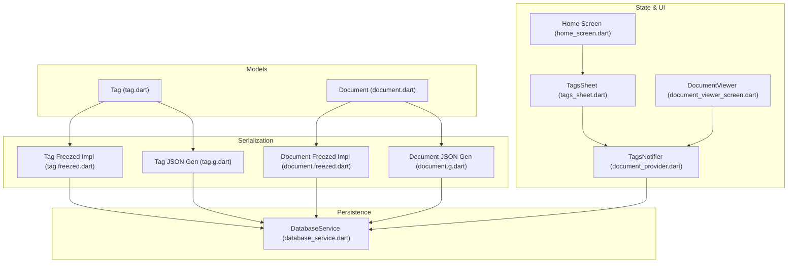
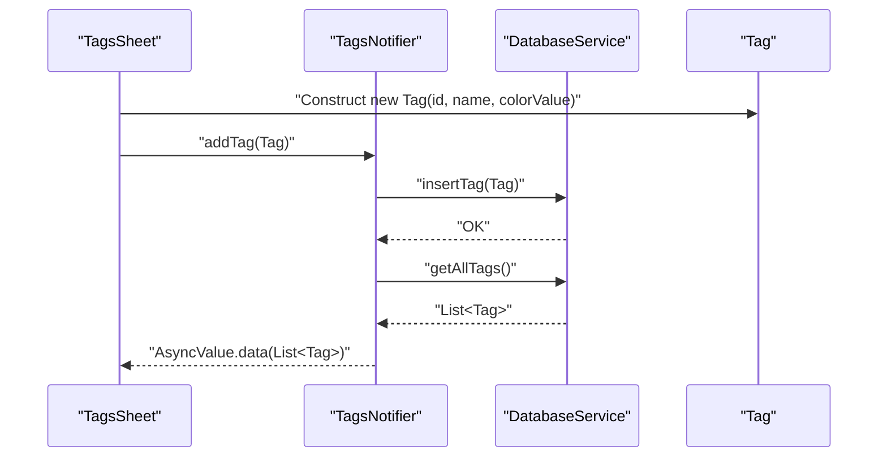
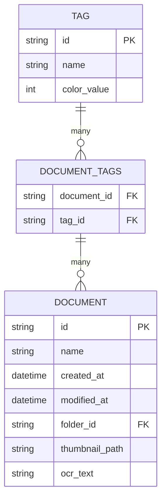
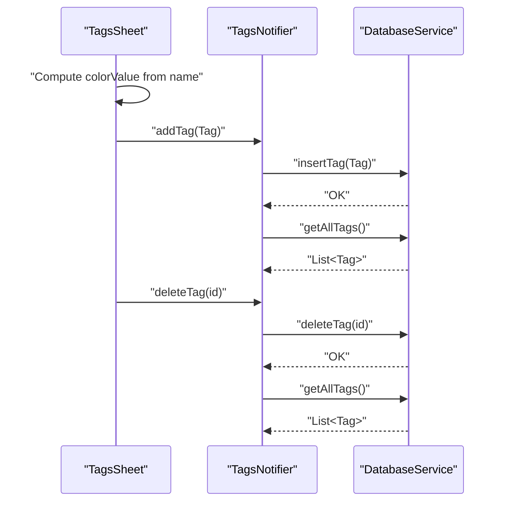
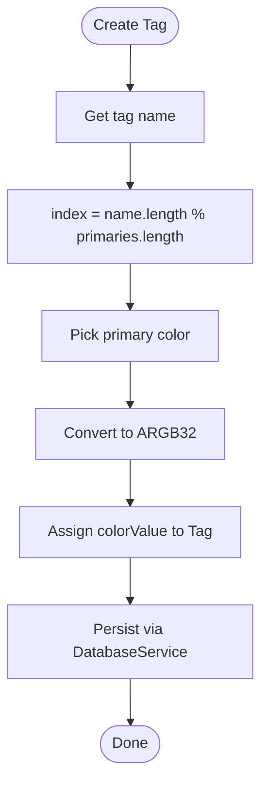
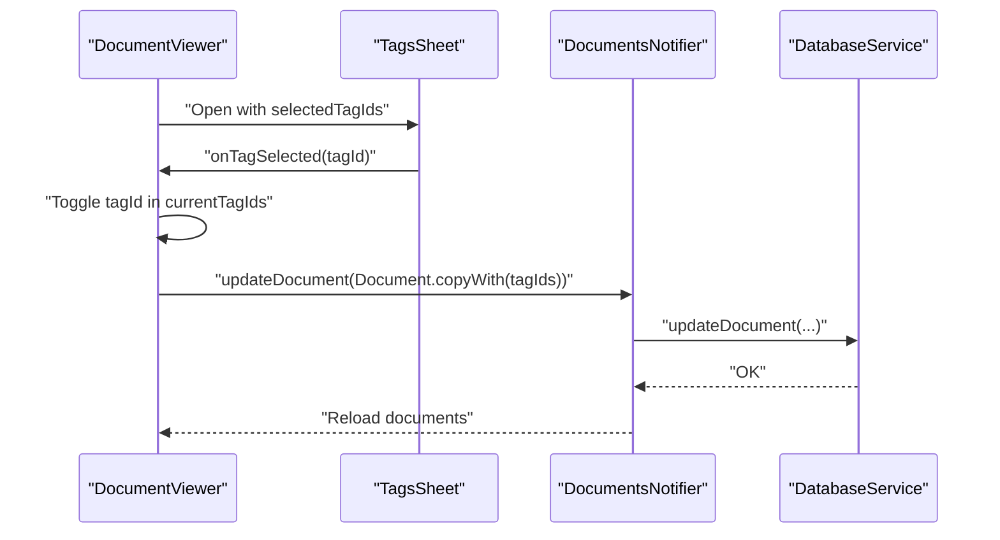
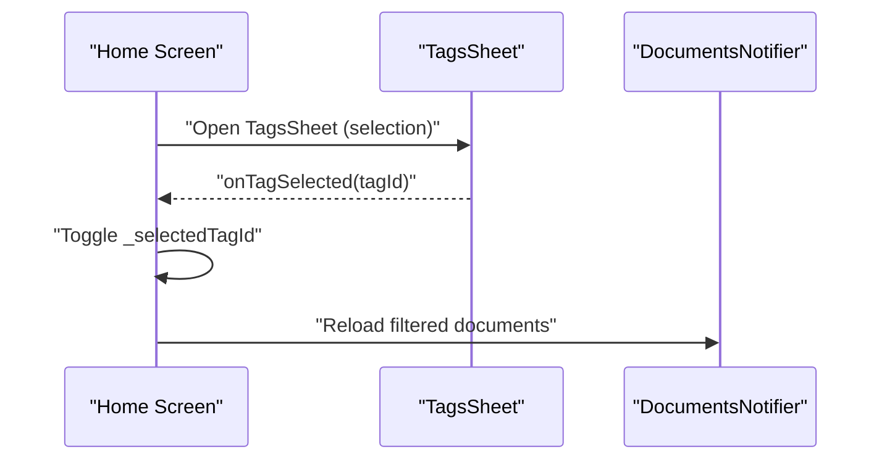
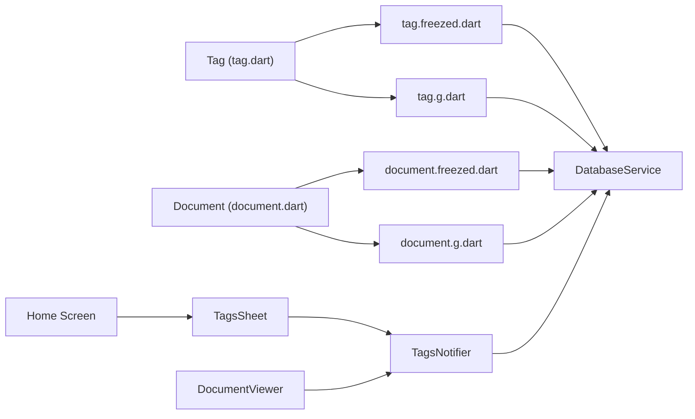

# Tag Model

<cite>
**Referenced Files in This Document**
- [tag.dart](file://lib/models/tag.dart)
- [tag.freezed.dart](file://lib/models/tag.freezed.dart)
- [tag.g.dart](file://lib/models/tag.g.dart)
- [document.dart](file://lib/models/document.dart)
- [document.freezed.dart](file://lib/models/document.freezed.dart)
- [document.g.dart](file://lib/models/document.g.dart)
- [database_service.dart](file://lib/services/database_service.dart)
- [document_provider.dart](file://lib/providers/document_provider.dart)
- [tags_sheet.dart](file://lib/screens/tags/tags_sheet.dart)
- [document_viewer_screen.dart](file://lib/screens/document_viewer/document_viewer_screen.dart)
- [home_screen.dart](file://lib/screens/home/home_screen.dart)
</cite>

## Table of Contents
1. [Introduction](#introduction)
2. [Project Structure](#project-structure)
3. [Core Components](#core-components)
4. [Architecture Overview](#architecture-overview)
5. [Detailed Component Analysis](#detailed-component-analysis)
6. [Dependency Analysis](#dependency-analysis)
7. [Performance Considerations](#performance-considerations)
8. [Troubleshooting Guide](#troubleshooting-guide)
9. [Conclusion](#conclusion)

## Introduction
This document explains the Tag model and the categorization system used to organize documents. It covers the tag structure, color management, many-to-many relationships with documents via tagIds collections, Freezed immutable patterns, serialization, lifecycle management, and UI integration. It also provides workflows for creating tags, assigning them to documents, and filtering/searching by tags.

## Project Structure
The tag system spans model definitions, persistence, state management, and UI components:
- Models define Tag and Document structures with Freezed immutability and JSON serialization.
- DatabaseService persists tags and manages the document-tags junction table.
- Providers manage tag state and integrate with UI.
- Screens render tag selection and apply tag assignments to documents.



**Diagram sources**
- [tag.dart](file://lib/models/tag.dart#L1-L16)
- [tag.freezed.dart](file://lib/models/tag.freezed.dart#L127-L178)
- [tag.g.dart](file://lib/models/tag.g.dart#L9-L19)
- [document.dart](file://lib/models/document.dart#L16-L32)
- [document.freezed.dart](file://lib/models/document.freezed.dart#L222-L324)
- [document.g.dart](file://lib/models/document.g.dart#L9-L41)
- [database_service.dart](file://lib/services/database_service.dart#L31-L96)
- [document_provider.dart](file://lib/providers/document_provider.dart#L103-L136)
- [tags_sheet.dart](file://lib/screens/tags/tags_sheet.dart#L9-L176)
- [document_viewer_screen.dart](file://lib/screens/document_viewer/document_viewer_screen.dart#L303-L323)
- [home_screen.dart](file://lib/screens/home/home_screen.dart#L96-L112)

**Section sources**
- [tag.dart](file://lib/models/tag.dart#L1-L16)
- [document.dart](file://lib/models/document.dart#L16-L32)
- [database_service.dart](file://lib/services/database_service.dart#L31-L96)
- [document_provider.dart](file://lib/providers/document_provider.dart#L103-L136)
- [tags_sheet.dart](file://lib/screens/tags/tags_sheet.dart#L9-L176)
- [document_viewer_screen.dart](file://lib/screens/document_viewer/document_viewer_screen.dart#L303-L323)
- [home_screen.dart](file://lib/screens/home/home_screen.dart#L96-L112)

## Core Components
- Tag: Immutable model with id, name, and colorValue. Freezed-generated equality, hash, and copyWith support. JSON serialization handled by generated code.
- Document: Immutable model with tagIds collection representing many-to-many association with tags.
- DatabaseService: Creates tags and document-tags junction table, queries tags, tagIds for documents, and deletes tags.
- TagsNotifier: Loads, adds, and deletes tags via DatabaseService and exposes AsyncValue<List<Tag>> to UI.
- UI integration: TagsSheet renders tag list, allows creation and deletion; integrates with document viewer and home screen filters.

**Section sources**
- [tag.dart](file://lib/models/tag.dart#L6-L16)
- [tag.freezed.dart](file://lib/models/tag.freezed.dart#L127-L178)
- [tag.g.dart](file://lib/models/tag.g.dart#L9-L19)
- [document.dart](file://lib/models/document.dart#L16-L32)
- [database_service.dart](file://lib/services/database_service.dart#L72-L96)
- [database_service.dart](file://lib/services/database_service.dart#L385-L412)
- [document_provider.dart](file://lib/providers/document_provider.dart#L109-L136)
- [tags_sheet.dart](file://lib/screens/tags/tags_sheet.dart#L29-L73)

## Architecture Overview
The tag system follows a layered architecture:
- Model layer defines immutable data structures with Freezed and JSON generation.
- Persistence layer stores tags and document-tag associations in SQLite.
- State layer manages tag state with Riverpod.
- UI layer presents tag management and selection experiences.



**Diagram sources**
- [tags_sheet.dart](file://lib/screens/tags/tags_sheet.dart#L29-L48)
- [document_provider.dart](file://lib/providers/document_provider.dart#L125-L129)
- [database_service.dart](file://lib/services/database_service.dart#L385-L395)

## Detailed Component Analysis

### Tag Model and Serialization
- Structure: Tag has required id, name, and colorValue with a default ARGB integer value.
- Immutability: Freezed generates an internal implementation class with sealed constructors and getters.
- Equality and hashing: Generated equals and hash based on identity/runtimeType plus field values.
- Copy semantics: copyWith supports field replacement while preserving immutability.
- JSON: Generated fromJson/toJson handle id, name, and colorValue.

```mermaid
classDiagram
class Tag {
+String id
+String name
+int colorValue
+copyWith(...)
+toString()
+operator==(...)
+hashCode
}
class _$TagImpl {
+String id
+String name
+int colorValue
+toJson()
+copyWith(...)
+toString()
+operator==(...)
+hashCode
}
Tag <|.. _$TagImpl : "generated impl"
```

**Diagram sources**
- [tag.dart](file://lib/models/tag.dart#L8-L13)
- [tag.freezed.dart](file://lib/models/tag.freezed.dart#L127-L178)
- [tag.g.dart](file://lib/models/tag.g.dart#L9-L19)

**Section sources**
- [tag.dart](file://lib/models/tag.dart#L6-L16)
- [tag.freezed.dart](file://lib/models/tag.freezed.dart#L151-L177)
- [tag.g.dart](file://lib/models/tag.g.dart#L9-L19)

### Document-Tag Association and Many-to-Many Pattern
- Association: Document holds tagIds as a List<String>, forming a many-to-many relationship with Tag.
- Unmodifiable views: tagIds and pages are exposed as unmodifiable lists via EqualUnmodifiableListView wrappers.
- Persistence: DatabaseService maintains a document_tags junction table and provides getTagIdsForDocument.



**Diagram sources**
- [database_service.dart](file://lib/services/database_service.dart#L72-L90)
- [document.dart](file://lib/models/document.dart#L24-L28)
- [document.freezed.dart](file://lib/models/document.freezed.dart#L249-L265)

**Section sources**
- [document.dart](file://lib/models/document.dart#L24-L28)
- [document.freezed.dart](file://lib/models/document.freezed.dart#L249-L265)
- [database_service.dart](file://lib/services/database_service.dart#L397-L406)

### Tag Lifecycle Management
- Creation: TagsSheet constructs a Tag with a fresh UUID and assigns a color derived from the name length and primary palette.
- Persistence: TagsNotifier delegates addTag/deleteTag to DatabaseService and refreshes state by reloading tags.
- Deletion: DatabaseService deletes a tag from the tags table; tag removal cascades to document_tags via foreign keys.



**Diagram sources**
- [tags_sheet.dart](file://lib/screens/tags/tags_sheet.dart#L29-L48)
- [document_provider.dart](file://lib/providers/document_provider.dart#L125-L135)
- [database_service.dart](file://lib/services/database_service.dart#L408-L411)

**Section sources**
- [tags_sheet.dart](file://lib/screens/tags/tags_sheet.dart#L29-L73)
- [document_provider.dart](file://lib/providers/document_provider.dart#L109-L136)
- [database_service.dart](file://lib/services/database_service.dart#L385-L412)

### Color Coding System
- Color assignment: TagsSheet computes colorValue using a primary color mapped by name length, converted to ARGB32.
- UI rendering: TagsSheet displays a CircleAvatar with backgroundColor set to tag.colorValue, enabling visual tag identification.



**Diagram sources**
- [tags_sheet.dart](file://lib/screens/tags/tags_sheet.dart#L36-L40)

**Section sources**
- [tags_sheet.dart](file://lib/screens/tags/tags_sheet.dart#L36-L40)

### Tag Assignment Workflow to Documents
- Selection: Users open TagsSheet in selection mode from the document viewer or home screen.
- Toggle: Tapping a tag toggles its presence in the document’s tagIds.
- Update: The document is updated atomically with the new tagIds list, persisted, and reloaded.



**Diagram sources**
- [document_viewer_screen.dart](file://lib/screens/document_viewer/document_viewer_screen.dart#L303-L323)
- [document_provider.dart](file://lib/providers/document_provider.dart#L36-L40)

**Section sources**
- [document_viewer_screen.dart](file://lib/screens/document_viewer/document_viewer_screen.dart#L303-L323)
- [document_provider.dart](file://lib/providers/document_provider.dart#L36-L40)

### Search and Filter by Tags
- Home filter: The home screen opens TagsSheet in selection mode and toggles _selectedTagId, enabling quick tag-based filtering of documents.
- Document viewer: Allows applying/removing tags per document, effectively organizing and discovering documents by categories.



**Diagram sources**
- [home_screen.dart](file://lib/screens/home/home_screen.dart#L96-L112)

**Section sources**
- [home_screen.dart](file://lib/screens/home/home_screen.dart#L96-L112)

## Dependency Analysis
- Tag depends on Freezed for immutability and equality; JSON serialization is generated.
- Document depends on Freezed and exposes tagIds as an unmodifiable list wrapper.
- DatabaseService encapsulates schema, queries, and relationships for tags and document-tags.
- TagsNotifier depends on DatabaseService to load/add/delete tags and exposes AsyncValue<List<Tag>>.
- UI components depend on Riverpod providers and Freezed models.



**Diagram sources**
- [tag.dart](file://lib/models/tag.dart#L1-L16)
- [tag.freezed.dart](file://lib/models/tag.freezed.dart#L127-L178)
- [tag.g.dart](file://lib/models/tag.g.dart#L9-L19)
- [document.dart](file://lib/models/document.dart#L16-L32)
- [document.freezed.dart](file://lib/models/document.freezed.dart#L222-L324)
- [document.g.dart](file://lib/models/document.g.dart#L9-L41)
- [database_service.dart](file://lib/services/database_service.dart#L31-L96)
- [document_provider.dart](file://lib/providers/document_provider.dart#L103-L136)
- [tags_sheet.dart](file://lib/screens/tags/tags_sheet.dart#L9-L176)
- [document_viewer_screen.dart](file://lib/screens/document_viewer/document_viewer_screen.dart#L303-L323)
- [home_screen.dart](file://lib/screens/home/home_screen.dart#L96-L112)

**Section sources**
- [document_provider.dart](file://lib/providers/document_provider.dart#L103-L136)
- [database_service.dart](file://lib/services/database_service.dart#L31-L96)

## Performance Considerations
- Freezed immutability reduces accidental mutations and simplifies equality checks.
- Unmodifiable list wrappers for tagIds and pages prevent external mutation and ensure predictable iteration.
- JSON serialization is generated, minimizing boilerplate and potential errors.
- Database queries for tagIds and tag lists are efficient with indexed tables and simple joins.

[No sources needed since this section provides general guidance]

## Troubleshooting Guide
- Tag not appearing after creation: Verify TagsNotifier.loadTags completes successfully and AsyncValue settles to data. Check DatabaseService.getAllTags for errors.
- Tag deletion does not remove associations: Confirm foreign key cascade on document_tags; ensure deleteTag removes the tag row and cascades to associations.
- Color not applied in UI: Ensure colorValue is correctly computed and passed to the CircleAvatar; verify tag.colorValue is used for backgroundColor.
- Tag toggle not reflected in document: Ensure onTagSelected updates the document’s tagIds and calls updateDocument; verify reload occurs afterward.

**Section sources**
- [document_provider.dart](file://lib/providers/document_provider.dart#L114-L123)
- [database_service.dart](file://lib/services/database_service.dart#L385-L412)
- [tags_sheet.dart](file://lib/screens/tags/tags_sheet.dart#L114-L133)
- [document_viewer_screen.dart](file://lib/screens/document_viewer/document_viewer_screen.dart#L309-L320)

## Conclusion
The Tag model and categorization system leverage Freezed immutability, robust JSON serialization, and a clean many-to-many association via tagIds. DatabaseService enforces referential integrity through a dedicated junction table. Riverpod providers and UI components deliver a seamless experience for creating, assigning, and filtering documents by tags, enabling effective organization and discovery.