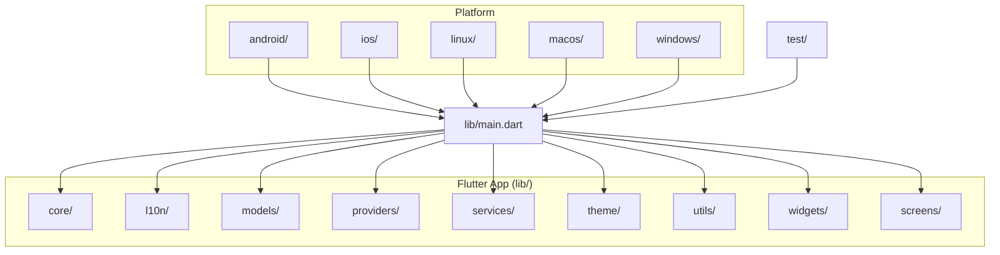
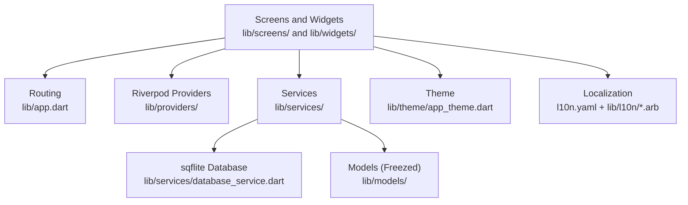
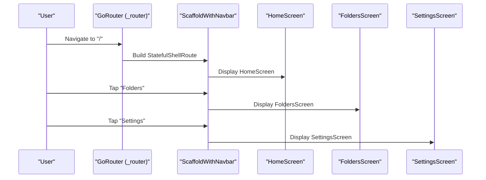
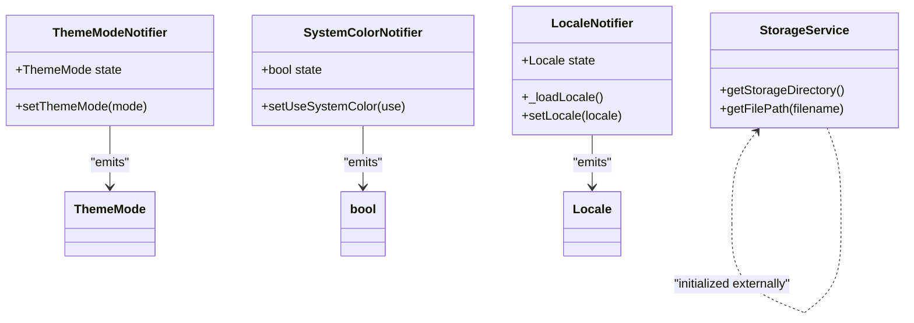
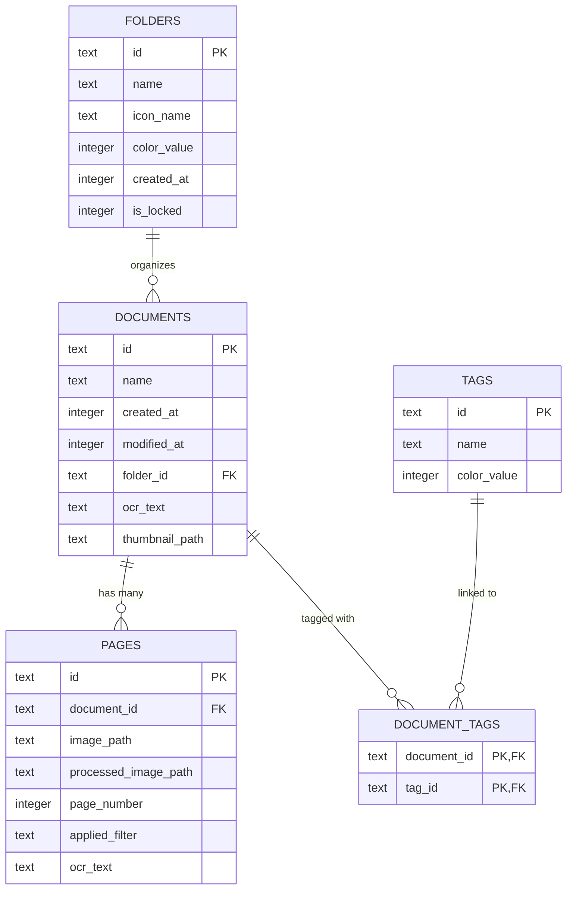
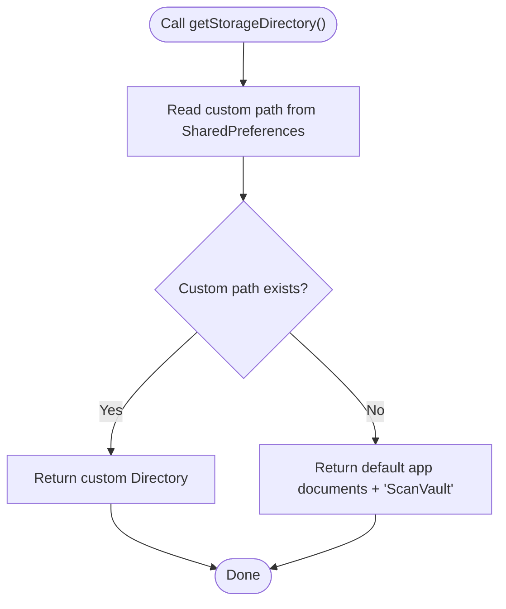
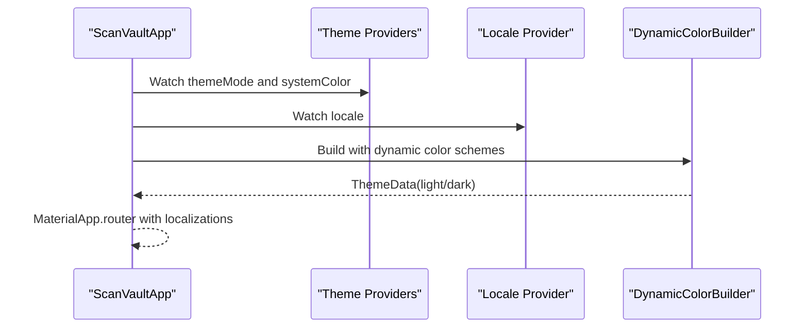
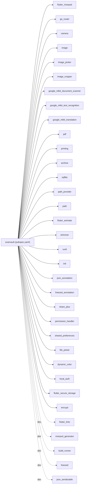

# Developer Guidelines

<cite>
**Referenced Files in This Document**
- [README.md](file://README.md)
- [analysis_options.yaml](file://analysis_options.yaml)
- [pubspec.yaml](file://pubspec.yaml)
- [l10n.yaml](file://l10n.yaml)
- [lib/main.dart](file://lib/main.dart)
- [lib/app.dart](file://lib/app.dart)
- [lib/core/constants/colors.dart](file://lib/core/constants/colors.dart)
- [lib/core/constants/strings.dart](file://lib/core/constants/strings.dart)
- [lib/theme/app_theme.dart](file://lib/theme/app_theme.dart)
- [lib/providers/theme_provider.dart](file://lib/providers/theme_provider.dart)
- [lib/providers/locale_provider.dart](file://lib/providers/locale_provider.dart)
- [lib/services/database_service.dart](file://lib/services/database_service.dart)
- [lib/models/document.dart](file://lib/models/document.dart)
- [lib/models/folder.dart](file://lib/models/folder.dart)
- [lib/models/tag.dart](file://lib/models/tag.dart)
- [lib/services/storage_service.dart](file://lib/services/storage_service.dart)
- [lib/widgets/scaffold_with_navbar.dart](file://lib/widgets/scaffold_with_navbar.dart)
- [test/widget_test.dart](file://test/widget_test.dart)
</cite>

## Table of Contents
1. [Introduction](#introduction)
2. [Project Structure](#project-structure)
3. [Core Components](#core-components)
4. [Architecture Overview](#architecture-overview)
5. [Detailed Component Analysis](#detailed-component-analysis)
6. [Dependency Analysis](#dependency-analysis)
7. [Performance Considerations](#performance-considerations)
8. [Troubleshooting Guide](#troubleshooting-guide)
9. [Development Workflow](#development-workflow)
10. [Code Review Guidelines](#code-review-guidelines)
11. [Testing Requirements](#testing-requirements)
12. [Quality Assurance Standards](#quality-assurance-standards)
13. [Contribution Guidelines](#contribution-guidelines)
14. [Accessibility, Internationalization, and Cross-Platform Compatibility](#accessibility-internationalization-and-cross-platform-compatibility)
15. [Conclusion](#conclusion)

## Introduction
This document provides comprehensive developer guidelines and contribution standards for ScanVault. It consolidates coding standards, naming conventions, architectural patterns, project structure, development workflow, testing, quality assurance, and best practices for contributing to the project. The goal is to ensure consistent, maintainable, and high-quality development across all platforms supported by the Flutter application.

## Project Structure
ScanVault follows a feature-centric, layered organization:
- Core platform integrations and shared resources live under android/, ios/, linux/, macos/, windows/.
- The Flutter application resides under lib/, organized by domain layers:
  - core: constants, exceptions, utilities
  - l10n: localization ARB files and generated localization delegates
  - models: Freezed immutable models with code-generated JSON serialization
  - providers: Riverpod state providers for theme, locale, and others
  - services: business logic services for database, storage, OCR, export, etc.
  - theme: Material 3 theme definitions and color schemes
  - utils: small utilities
  - widgets: reusable UI components
  - screens: feature screens wired via go_router
- Tests are colocated under test/.



**Diagram sources**
- [lib/main.dart](file://lib/main.dart#L1-L32)
- [lib/app.dart](file://lib/app.dart#L1-L187)

**Section sources**
- [README.md](file://README.md#L1-L249)
- [lib/main.dart](file://lib/main.dart#L1-L32)
- [lib/app.dart](file://lib/app.dart#L1-L187)

## Core Components
- Application bootstrap initializes orientation, services, and Riverpod overrides before launching the app shell.
- Routing uses go_router with a stateful shell for persistent bottom navigation and dedicated routes for full-screen flows.
- State management leverages Riverpod with providers for theme mode, system color preference, and locale.
- Theming is centralized with Material 3 light/dark themes and dynamic color support.
- Localization is configured via ARB files and generated delegates.
- Data persistence uses sqflite with explicit migrations and indexes.
- Models are immutable with freezed and JSON serialization.

**Section sources**
- [lib/main.dart](file://lib/main.dart#L10-L31)
- [lib/app.dart](file://lib/app.dart#L22-L62)
- [lib/app.dart](file://lib/app.dart#L67-L187)
- [lib/providers/theme_provider.dart](file://lib/providers/theme_provider.dart#L1-L29)
- [lib/providers/locale_provider.dart](file://lib/providers/locale_provider.dart#L1-L31)
- [lib/theme/app_theme.dart](file://lib/theme/app_theme.dart#L1-L252)
- [l10n.yaml](file://l10n.yaml#L1-L4)
- [lib/services/database_service.dart](file://lib/services/database_service.dart#L10-L113)
- [lib/models/document.dart](file://lib/models/document.dart#L1-L49)
- [lib/models/folder.dart](file://lib/models/folder.dart#L1-L21)
- [lib/models/tag.dart](file://lib/models/tag.dart#L1-L17)

## Architecture Overview
The app follows a layered architecture:
- Presentation layer: Screens and widgets, routed via go_router, consuming Riverpod providers.
- Domain layer: Services encapsulate business logic (database, storage, OCR, export).
- Persistence layer: sqflite with migrations and indexes.
- Shared resources: Constants, utilities, and localization.



**Diagram sources**
- [lib/app.dart](file://lib/app.dart#L67-L187)
- [lib/providers/theme_provider.dart](file://lib/providers/theme_provider.dart#L1-L29)
- [lib/providers/locale_provider.dart](file://lib/providers/locale_provider.dart#L1-L31)
- [lib/services/database_service.dart](file://lib/services/database_service.dart#L10-L113)
- [lib/theme/app_theme.dart](file://lib/theme/app_theme.dart#L1-L252)
- [l10n.yaml](file://l10n.yaml#L1-L4)

## Detailed Component Analysis

### Routing and Navigation
- Uses go_router with a stateful shell route for persistent bottom navigation.
- Dedicated full-screen routes for camera, editor, document viewer, OCR, and translation.
- Navigation destinations are localized via AppLocalizations.



**Diagram sources**
- [lib/app.dart](file://lib/app.dart#L67-L187)
- [lib/widgets/scaffold_with_navbar.dart](file://lib/widgets/scaffold_with_navbar.dart#L1-L54)

**Section sources**
- [lib/app.dart](file://lib/app.dart#L67-L187)
- [lib/widgets/scaffold_with_navbar.dart](file://lib/widgets/scaffold_with_navbar.dart#L1-L54)

### State Management with Riverpod
- Theme mode provider manages ThemeMode and supports toggling system color usage.
- Locale provider persists language preference via SharedPreferences and loads on startup.
- A provider override wires a pre-initialized StorageService into the app graph.



**Diagram sources**
- [lib/providers/theme_provider.dart](file://lib/providers/theme_provider.dart#L9-L28)
- [lib/providers/locale_provider.dart](file://lib/providers/locale_provider.dart#L9-L30)
- [lib/services/storage_service.dart](file://lib/services/storage_service.dart#L12-L62)

**Section sources**
- [lib/providers/theme_provider.dart](file://lib/providers/theme_provider.dart#L1-L29)
- [lib/providers/locale_provider.dart](file://lib/providers/locale_provider.dart#L1-L31)
- [lib/main.dart](file://lib/main.dart#L20-L30)

### Database Layer (sqflite)
- Centralized initialization and migrations.
- Tables: documents, pages, folders, tags, and a junction table for document-tags.
- Indexes on foreign keys for efficient queries.
- CRUD helpers for documents, pages, folders, and tags.



**Diagram sources**
- [lib/services/database_service.dart](file://lib/services/database_service.dart#L32-L97)
- [lib/services/database_service.dart](file://lib/services/database_service.dart#L118-L412)

**Section sources**
- [lib/services/database_service.dart](file://lib/services/database_service.dart#L10-L113)
- [lib/services/database_service.dart](file://lib/services/database_service.dart#L30-L97)
- [lib/services/database_service.dart](file://lib/services/database_service.dart#L118-L412)

### Models (Freezed + JSON)
- Immutable models with code-generated serialization.
- Enums for filter types.
- Default values for optional fields.

```mermaid
classDiagram
class Document {
    +String id
    +String name
    +DateTime createdAt
    +DateTime modifiedAt
    +String? folderId
    +String[] tagIds
    +ScannedPage[] pages
    +String? ocrText
    +String? thumbnailPath
}
class ScannedPage {
    +String id
    +String imagePath
    +String? processedImagePath
    +int pageNumber
    +FilterType appliedFilter
    +String? ocrText
}
class Folder {
    +String id
    +String name
    +String? iconName
    +int colorValue
    +DateTime createdAt
    +int documentCount
    +bool isLocked
}
class Tag {
    +String id
    +String name
    +int colorValue
}
enum FilterType {
    original
    grayscale
    blackAndWhite
    magicColor
    document
}
Document --> ScannedPage : "contains"
Document --> Tag : "tagged with"
Folder --> Document : "organizes"
```

**Diagram sources**
- [lib/models/document.dart](file://lib/models/document.dart#L16-L48)
- [lib/models/folder.dart](file://lib/models/folder.dart#L7-L20)
- [lib/models/tag.dart](file://lib/models/tag.dart#L7-L16)

**Section sources**
- [lib/models/document.dart](file://lib/models/document.dart#L1-L49)
- [lib/models/folder.dart](file://lib/models/folder.dart#L1-L21)
- [lib/models/tag.dart](file://lib/models/tag.dart#L1-L17)

### Storage Service
- Manages custom storage path via SharedPreferences with fallback to default app documents directory.
- Ensures directories exist before writing.



**Diagram sources**
- [lib/services/storage_service.dart](file://lib/services/storage_service.dart#L39-L52)

**Section sources**
- [lib/services/storage_service.dart](file://lib/services/storage_service.dart#L1-L63)

### Theme and Localization
- DynamicColorBuilder adapts to system color schemes on supported platforms.
- Theme configurations define Material 3 components for light/dark modes.
- Localization delegates and supported locales are configured in the app router.



**Diagram sources**
- [lib/app.dart](file://lib/app.dart#L27-L61)
- [lib/providers/theme_provider.dart](file://lib/providers/theme_provider.dart#L1-L29)
- [lib/providers/locale_provider.dart](file://lib/providers/locale_provider.dart#L1-L31)
- [lib/theme/app_theme.dart](file://lib/theme/app_theme.dart#L1-L252)

**Section sources**
- [lib/app.dart](file://lib/app.dart#L22-L62)
- [lib/theme/app_theme.dart](file://lib/theme/app_theme.dart#L1-L252)
- [lib/providers/locale_provider.dart](file://lib/providers/locale_provider.dart#L1-L31)

## Dependency Analysis
- Core framework: Flutter, Dart SDK constraints.
- State management: flutter_riverpod, riverpod_annotation.
- Navigation: go_router.
- Camera and image: camera, image, image_picker, image_cropper.
- OCR and translation: google_mlkit_text_recognition, google_mlkit_translation, google_mlkit_document_scanner.
- PDF and export: pdf, printing, archive.
- Local storage: sqflite, path_provider, path.
- UI enhancements: flutter_animate, shimmer.
- Utilities: uuid, intl, json_annotation, freezed_annotation, share_plus, permission_handler, shared_preferences, file_picker, dynamic_color.
- Security/authentication: local_auth, flutter_secure_storage, encrypt.
- Development: flutter_lints, riverpod_generator, build_runner, freezed, json_serializable.



**Diagram sources**
- [pubspec.yaml](file://pubspec.yaml#L9-L78)

**Section sources**
- [pubspec.yaml](file://pubspec.yaml#L1-L78)

## Performance Considerations
- Prefer immutable models (Freezed) to reduce mutation-related bugs and improve cacheability.
- Use Riverpod providers for granular, reactive updates to minimize rebuilds.
- Keep database queries efficient with indexes on foreign keys and selective columns.
- Avoid unnecessary deep rebuilds by isolating state and using ProviderScope overrides judiciously.
- Use lazy loading and pagination for lists of documents and pages.
- Compress images and thumbnails appropriately to balance quality and performance.
- Cache frequently accessed data (e.g., locale, theme preferences) in memory and SharedPreferences.

## Troubleshooting Guide
- Orientation lock: Ensure portrait orientation is enforced during app initialization.
- Database not initialized: Call initialize() before accessing db getters; handle StateError if missed.
- Storage path issues: Validate custom path existence and fall back to default app documents directory.
- Localization not updating: Confirm localeProvider writes to SharedPreferences and rebuilds the app tree.
- Theme not applying: Verify themeModeProvider and systemColorProvider values and DynamicColorBuilder availability.

**Section sources**
- [lib/main.dart](file://lib/main.dart#L14-L17)
- [lib/services/database_service.dart](file://lib/services/database_service.dart#L108-L113)
- [lib/services/storage_service.dart](file://lib/services/storage_service.dart#L40-L52)
- [lib/providers/locale_provider.dart](file://lib/providers/locale_provider.dart#L24-L29)
- [lib/app.dart](file://lib/app.dart#L33-L61)

## Development Workflow
- Branching strategy:
  - Use feature branches prefixed with feature/, fix/, chore/, docs/ for isolation.
  - Merge via pull requests after review.
- Commit messages:
  - Use imperative mood: "Add feature", "Fix bug", "Refactor component".
  - Keep subject concise (< 50 chars), separate subject from body by blank line.
  - Reference issue numbers in the footer when applicable.
- Pull requests:
  - Describe changes, link related issues, and ensure tests pass.
  - Request reviews from maintainers; address comments promptly.
- Code generation:
  - Run code generation tools as configured in dev_dependencies and pubspec.yaml.
  - Ensure generated files are committed alongside source changes.

**Section sources**
- [pubspec.yaml](file://pubspec.yaml#L66-L78)
- [analysis_options.yaml](file://analysis_options.yaml#L10-L29)

## Code Review Guidelines
- Follow existing naming conventions and file organization.
- Ensure new features integrate cleanly with routing, providers, and services.
- Verify database migrations preserve data and add indexes for new queries.
- Test localization updates and ensure ARB files are regenerated.
- Validate platform-specific permissions and runtime checks.
- Confirm performance impact of new features; avoid blocking UI thread.

## Testing Requirements
- Widget tests: Validate app launch and basic UI presence.
- Unit tests: Cover providers, services, and utility functions.
- Integration tests: Validate end-to-end flows (routing, navigation, state changes).
- Accessibility tests: Ensure sufficient color contrast and semantic labeling.
- Cross-platform tests: Validate behavior on Android, Linux, macOS, Windows where applicable.

**Section sources**
- [test/widget_test.dart](file://test/widget_test.dart#L1-L14)

## Quality Assurance Standards
- Static analysis: Enforce linter rules via flutter_lints.
- Code style: Prefer single quotes, avoid print statements in production, and keep functions pure where possible.
- Documentation: Update README and inline comments for significant changes.
- Security: Avoid logging sensitive data; use secure storage for credentials.
- Internationalization: Provide translations for all user-facing strings; regenerate localization files.

**Section sources**
- [analysis_options.yaml](file://analysis_options.yaml#L10-L29)
- [l10n.yaml](file://l10n.yaml#L1-L4)

## Contribution Guidelines
- New features:
  - Create a feature branch; implement routing, screens, providers, and services.
  - Add or update models with Freezed; regenerate code.
  - Add tests and ensure CI passes.
- Bug fixes:
  - Reproduce locally; write targeted tests.
  - Provide clear descriptions and screenshots if UI-related.
- Documentation improvements:
  - Update README and inline comments; ensure accuracy and clarity.

## Accessibility, Internationalization, and Cross-Platform Compatibility
- Accessibility:
  - Use semantic widgets and sufficient color contrast.
  - Ensure focus order and keyboard navigation where applicable.
- Internationalization:
  - Add new ARB entries and regenerate localization files.
  - Avoid hardcoded strings; use AppLocalizations for all user-facing text.
- Cross-platform:
  - Validate behavior on Android, Linux, macOS, Windows.
  - Respect platform-specific permissions and capabilities.

**Section sources**
- [lib/app.dart](file://lib/app.dart#L51-L58)
- [l10n.yaml](file://l10n.yaml#L1-L4)

## Coding Standards and Naming Conventions
- File naming:
  - Feature-based files: lower_snake_case for Dart files.
  - Constants: UpperCamelCase for classes (e.g., AppColors, AppStrings).
  - Providers: lower_snake_case with _provider suffix (e.g., themeModeProvider).
  - Services: UpperCamelCase (e.g., DatabaseService, StorageService).
  - Screens: PascalCase with _screen suffix (e.g., HomeScreen, CameraScreen).
- Variables and functions:
  - Use lowerCamelCase for variables and functions.
  - Use UPPER_SNAKE_CASE for constants (e.g., static final fields).
- Classes and enums:
  - Use UpperCamelCase for classes and enums.
- Directories:
  - Group related files under models/, providers/, services/, screens/, widgets/, theme/, core/, l10n/.

**Section sources**
- [lib/core/constants/colors.dart](file://lib/core/constants/colors.dart#L4-L24)
- [lib/core/constants/strings.dart](file://lib/core/constants/strings.dart#L2-L49)
- [lib/providers/theme_provider.dart](file://lib/providers/theme_provider.dart#L5-L7)
- [lib/providers/locale_provider.dart](file://lib/providers/locale_provider.dart#L5-L7)
- [lib/services/database_service.dart](file://lib/services/database_service.dart#L11-L13)
- [lib/services/storage_service.dart](file://lib/services/storage_service.dart#L8-L10)
- [lib/models/document.dart](file://lib/models/document.dart#L16-L32)
- [lib/models/folder.dart](file://lib/models/folder.dart#L7-L19)
- [lib/models/tag.dart](file://lib/models/tag.dart#L7-L15)

## Dependency Management and Code Generation
- Dependencies:
  - Keep dependencies aligned with Flutter SDK constraints.
  - Use dev_dependencies for code generation tools.
- Code generation:
  - Run build_runner to generate Freezed and JSON serializers.
  - Regenerate localization files when ARB files change.

**Section sources**
- [pubspec.yaml](file://pubspec.yaml#L66-L78)
- [l10n.yaml](file://l10n.yaml#L1-L4)

## Version Control Best Practices
- Commit early and often; keep commits focused.
- Use meaningful commit messages; reference issues.
- Rebase feature branches onto the latest main before opening PRs.
- Squash or reword commits prior to merging.

## Debugging Techniques and Local Environment Setup
- Enable debug prints sparingly; remove or gate with debug flag.
- Use Flutter DevTools for profiling and inspecting providers.
- Validate database state using SQL queries during development.
- Test localization changes by switching locales via settings.

**Section sources**
- [lib/app.dart](file://lib/app.dart#L31-L31)
- [lib/providers/locale_provider.dart](file://lib/providers/locale_provider.dart#L24-L29)

## Examples of Implementation Patterns and Anti-Patterns
- Good patterns:
  - Immutable models with Freezed and JSON serialization.
  - Riverpod providers for state with SharedPreferences persistence.
  - Centralized database initialization and migrations.
  - Localized strings via ARB and generated delegates.
- Anti-patterns to avoid:
  - Mutating state outside of providers.
  - Hardcoding strings; always use AppLocalizations.
  - Performing heavy work on the UI thread.
  - Storing secrets in plain text; use secure storage.

## Conclusion
These guidelines consolidate the architectural patterns, coding standards, and development practices used in ScanVault. By following these conventions and workflows, contributors can ensure consistent, maintainable, and high-quality code across all supported platforms.