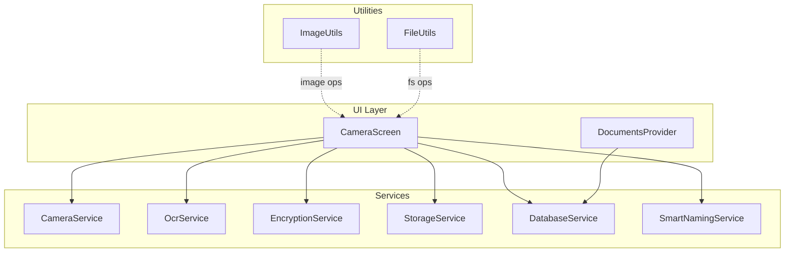
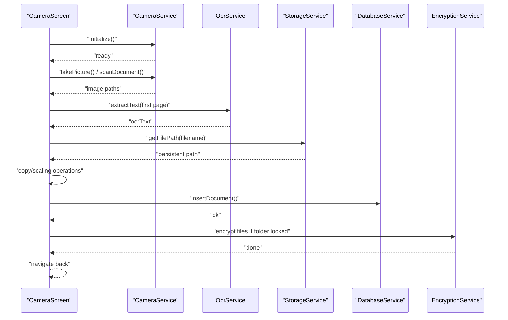
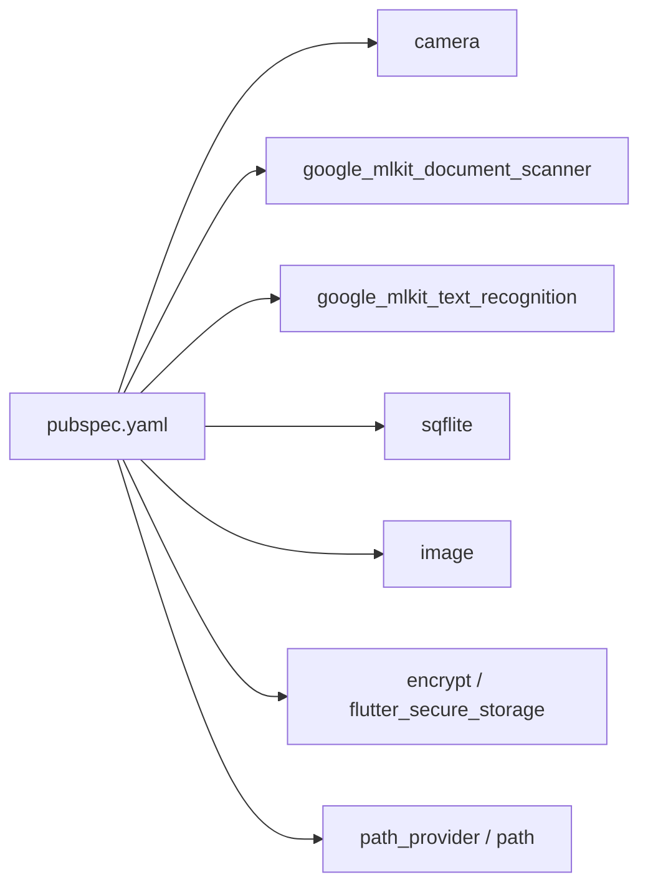

# Performance & Optimization

<cite>
**Referenced Files in This Document**
- [image_utils.dart](file://lib/core/utils/image_utils.dart)
- [file_utils.dart](file://lib/core/utils/file_utils.dart)
- [storage_service.dart](file://lib/services/storage_service.dart)
- [database_service.dart](file://lib/services/database_service.dart)
- [camera_service.dart](file://lib/services/camera_service.dart)
- [ocr_service.dart](file://lib/services/ocr_service.dart)
- [camera_screen.dart](file://lib/screens/camera/camera_screen.dart)
- [document_provider.dart](file://lib/providers/document_provider.dart)
- [encryption_service.dart](file://lib/services/encryption_service.dart)
- [smart_naming_service.dart](file://lib/services/smart_naming_service.dart)
- [pubspec.yaml](file://pubspec.yaml)
- [build.gradle.kts](file://android/app/build.gradle.kts)
- [Info.plist](file://ios/Runner/Info.plist)
</cite>

## Table of Contents
1. [Introduction](#introduction)
2. [Project Structure](#project-structure)
3. [Core Components](#core-components)
4. [Architecture Overview](#architecture-overview)
5. [Detailed Component Analysis](#detailed-component-analysis)
6. [Dependency Analysis](#dependency-analysis)
7. [Performance Considerations](#performance-considerations)
8. [Troubleshooting Guide](#troubleshooting-guide)
9. [Conclusion](#conclusion)
10. [Appendices](#appendices)

## Introduction
This document provides a comprehensive performance optimization guide for ScanVault’s mobile application. It focuses on memory management during image processing, efficient file system operations, database query tuning, and UI responsiveness. It also covers threading and asynchronous patterns, platform-specific optimizations for Android, iOS, and desktop, and practical benchmarking and profiling strategies tailored to mobile document processing workflows.

## Project Structure
ScanVault is a Flutter application with platform-specific configurations and modular Dart services. The most relevant areas for performance optimization include:
- Image processing utilities and camera pipeline
- File system and storage management
- Local database operations and indexing
- OCR and smart naming services
- UI state management and screen-level workflows

**Diagram sources**
- [camera_screen.dart](file://lib/screens/camera/camera_screen.dart#L1-L242)
- [camera_service.dart](file://lib/services/camera_service.dart#L1-L140)
- [ocr_service.dart](file://lib/services/ocr_service.dart#L1-L93)
- [storage_service.dart](file://lib/services/storage_service.dart#L1-L63)
- [database_service.dart](file://lib/services/database_service.dart#L1-L413)
- [encryption_service.dart](file://lib/services/encryption_service.dart#L1-L150)
- [smart_naming_service.dart](file://lib/services/smart_naming_service.dart#L1-L104)
- [image_utils.dart](file://lib/core/utils/image_utils.dart#L1-L62)
- [file_utils.dart](file://lib/core/utils/file_utils.dart#L1-L59)
- [document_provider.dart](file://lib/providers/document_provider.dart#L1-L137)

**Section sources**
- [camera_screen.dart](file://lib/screens/camera/camera_screen.dart#L1-L242)
- [pubspec.yaml](file://pubspec.yaml#L1-L78)

## Core Components
- Image processing utilities: resizing, thumbnails, rotation, and file I/O for images.
- File utilities: document storage directories, thumbnails cache, filename generation, and safe deletion.
- Storage service: configurable storage path, default app directory fallback, and path composition.
- Database service: local SQLite via sqflite with normalized schema, indexes, and CRUD operations.
- Camera service: camera initialization, permissions, capture, focus, zoom, and lifecycle management.
- OCR service: Google ML Kit text recognition with structured block extraction.
- Encryption service: AES encryption/decryption for files in locked folders with secure key storage.
- Smart naming service: heuristic-based document naming and categorization using OCR text.
- Providers: Riverpod-based state management for documents, folders, tags, and filters.

**Section sources**
- [image_utils.dart](file://lib/core/utils/image_utils.dart#L1-L62)
- [file_utils.dart](file://lib/core/utils/file_utils.dart#L1-L59)
- [storage_service.dart](file://lib/services/storage_service.dart#L1-L63)
- [database_service.dart](file://lib/services/database_service.dart#L1-L413)
- [camera_service.dart](file://lib/services/camera_service.dart#L1-L140)
- [ocr_service.dart](file://lib/services/ocr_service.dart#L1-L93)
- [encryption_service.dart](file://lib/services/encryption_service.dart#L1-L150)
- [smart_naming_service.dart](file://lib/services/smart_naming_service.dart#L1-L104)
- [document_provider.dart](file://lib/providers/document_provider.dart#L1-L137)

## Architecture Overview
The document capture flow integrates camera scanning, OCR analysis, storage, and persistence. UI remains responsive by offloading heavy work to background threads and minimizing UI thread work.

**Diagram sources**
- [camera_screen.dart](file://lib/screens/camera/camera_screen.dart#L45-L216)
- [camera_service.dart](file://lib/services/camera_service.dart#L34-L85)
- [ocr_service.dart](file://lib/services/ocr_service.dart#L9-L18)
- [storage_service.dart](file://lib/services/storage_service.dart#L54-L61)
- [database_service.dart](file://lib/services/database_service.dart#L120-L144)
- [encryption_service.dart](file://lib/services/encryption_service.dart#L122-L127)

## Detailed Component Analysis

### Image Processing Utilities
- Resizing maintains aspect ratio and uses linear interpolation for speed.
- Thumbnail generation crops to square for consistent previews.
- Rotation leverages integer angles for minimal recomputation.
- JPEG encoding with tunable quality to balance size vs. fidelity.
- File I/O helpers avoid synchronous disk reads/writes on the UI thread.

Optimization opportunities:
- Batch resize/thumbnail generation using isolates for multi-page scans.
- Reuse decoded image buffers when applying multiple transforms.
- Pre-allocate buffers for encode operations to reduce GC pressure.
- Consider WebP for higher compression ratios on newer devices.

**Section sources**
- [image_utils.dart](file://lib/core/utils/image_utils.dart#L9-L61)

### File System and Storage
- Documents directory under app-scoped storage with automatic creation.
- Thumbnails cached in temporary directory to leverage OS cleanup.
- Unique filename generation avoids collisions and supports concurrent writes.
- Safe deletion checks existence before removal.

Optimization opportunities:
- Use streaming writes for large files to reduce peak memory.
- Implement LRU cache eviction for thumbnails.
- Defer expensive metadata operations (e.g., stat) to background.
- Consider external storage selection with scoped access on Android.

**Section sources**
- [file_utils.dart](file://lib/core/utils/file_utils.dart#L9-L58)
- [storage_service.dart](file://lib/services/storage_service.dart#L18-L62)

### Database Service and Indexing
- Normalized schema with foreign keys and junction table for tags.
- Indexes on frequently filtered columns (documents.folder_id, pages.document_id).
- UUID primary keys for distributed safety and reduced contention.
- Migrations handled cleanly for schema evolution.

Optimization opportunities:
- Use transactions for bulk inserts (documents, pages, tags).
- Consider WAL mode for improved concurrency.
- Add covering indexes for common queries (e.g., folder pagination).
- Paginate large lists and avoid loading entire datasets into memory.

**Section sources**
- [database_service.dart](file://lib/services/database_service.dart#L31-L97)
- [database_service.dart](file://lib/services/database_service.dart#L120-L144)
- [database_service.dart](file://lib/services/database_service.dart#L196-L226)

### Camera Pipeline
- Permission gating and camera discovery.
- Controlled resolution preset and image format selection.
- Focus, zoom, and flash toggles for user experience.
- Proper disposal to prevent resource leaks.

Optimization opportunities:
- Pre-warm camera controller on app idle.
- Use lower resolution for preview vs. capture.
- Avoid blocking UI thread during initialization.

**Section sources**
- [camera_service.dart](file://lib/services/camera_service.dart#L27-L71)
- [camera_service.dart](file://lib/services/camera_service.dart#L131-L139)

### OCR and Smart Naming
- Structured block extraction for granular text analysis.
- Smart naming heuristics for document naming and categorization.
- First-page OCR used to seed document-level metadata.

Optimization opportunities:
- Batch OCR asynchronously and cache results.
- Use device-side models where possible to reduce latency.
- Debounce OCR-triggered actions to avoid redundant processing.

**Section sources**
- [ocr_service.dart](file://lib/services/ocr_service.dart#L20-L48)
- [smart_naming_service.dart](file://lib/services/smart_naming_service.dart#L7-L43)

### Encryption Service
- AES-256 encryption with random IV per file.
- Secure storage for folder keys.
- Atomic rename after encryption/decryption.

Optimization opportunities:
- Parallelize encryption for multiple files in a batch.
- Use hardware-backed keystores on supported platforms.
- Avoid loading entire files into memory; stream encrypt/decrypt.

**Section sources**
- [encryption_service.dart](file://lib/services/encryption_service.dart#L38-L77)
- [encryption_service.dart](file://lib/services/encryption_service.dart#L122-L134)

### UI Responsiveness and State Management
- Camera screen defers heavy work until after scanning completes.
- Riverpod providers encapsulate async state transitions.
- UI shows appropriate loading indicators during long-running tasks.

Optimization opportunities:
- Offload image scaling and OCR to background isolates.
- Debounce frequent UI updates (e.g., progress indicators).
- Use lazy loading for document lists and thumbnails.

**Section sources**
- [camera_screen.dart](file://lib/screens/camera/camera_screen.dart#L34-L74)
- [camera_screen.dart](file://lib/screens/camera/camera_screen.dart#L76-L216)
- [document_provider.dart](file://lib/providers/document_provider.dart#L14-L54)

## Dependency Analysis
External libraries drive performance-critical features:
- Camera and document scanner for acquisition
- ML Kit for OCR
- sqflite for local persistence
- encrypt and flutter_secure_storage for encryption
- path_provider and path for filesystem paths
- image for image manipulation

**Diagram sources**
- [pubspec.yaml](file://pubspec.yaml#L21-L64)

**Section sources**
- [pubspec.yaml](file://pubspec.yaml#L21-L64)

## Performance Considerations

### Memory Management Strategies
- Decode images lazily and dispose resources promptly.
- Prefer streaming APIs for large files.
- Avoid retaining references to large bitmaps beyond UI needs.
- Use typed data buffers judiciously and clear them when done.

### Image Processing Optimization
- Resize early and aggressively to limit downstream memory.
- Use lossless transformations (rotate, crop) before compression.
- Reuse intermediate buffers across operations.
- Consider WebP for higher compression on supported devices.

### Database Performance Tuning
- Wrap bulk inserts in transactions.
- Use indexes on join/filter columns.
- Prefer covering indexes for read-heavy views.
- Paginate large result sets.

### File System Optimization
- Cache thumbnails in temporary directories.
- Generate unique filenames to avoid collisions.
- Delete stale files periodically.
- Stream writes to reduce peak memory.

### Threading and Asynchronous Patterns
- Offload CPU-intensive tasks (OCR, encryption, image transforms) to isolates or background threads.
- Use Futures and Streams for non-blocking UI updates.
- Avoid blocking the UI thread with file I/O or heavy computations.

### Platform-Specific Optimizations
- Android
  - Target modern SDK levels and use appropriate JVM targets.
  - Enable ProGuard/R8 for release builds.
  - Consider hardware-accelerated image decoding.
- iOS
  - Disable minimum frame duration on phone for smoother UI.
  - Use background modes sparingly and efficiently.
- Desktop (Linux/macOS/windows)
  - Leverage native file descriptors for large files.
  - Optimize asset bundling and caching.

### Monitoring, Profiling, and Bottleneck Identification
- Use Flutter DevTools CPU, memory, and timeline profilers.
- Measure image processing latency and memory allocations.
- Track database query times and index usage.
- Profile OCR throughput and GPU/CPU usage.

### Benchmarking Methodologies
- Capture metrics for end-to-end scanning: acquisition, OCR, storage, and persistence.
- Benchmark image transforms at typical resolutions.
- Measure database insert rates for bulk page imports.
- Evaluate encryption/decryption throughput.

### Best Practices
- Keep UI responsive by deferring heavy work.
- Use caching for repeated operations (OCR results, thumbnails).
- Minimize JSON/object churn; reuse model instances where possible.
- Validate inputs early to fail fast.

[No sources needed since this section provides general guidance]

## Troubleshooting Guide
Common issues and mitigations:
- Camera initialization failures
  - Ensure permissions are granted and cameras are available.
  - Handle exceptions and surface user-friendly messages.
- OCR failures
  - Verify image paths and file existence.
  - Retry with cleaned paths (remove file:// prefix).
- Storage errors
  - Check directory existence and create recursively when needed.
  - Validate write permissions and available disk space.
- Database errors
  - Initialize database before use.
  - Wrap bulk operations in transactions.
- Encryption errors
  - Ensure keys are present for locked folders.
  - Handle partial failures and maintain atomicity.

**Section sources**
- [camera_service.dart](file://lib/services/camera_service.dart#L34-L71)
- [camera_screen.dart](file://lib/screens/camera/camera_screen.dart#L93-L94)
- [storage_service.dart](file://lib/services/storage_service.dart#L39-L52)
- [database_service.dart](file://lib/services/database_service.dart#L16-L28)
- [encryption_service.dart](file://lib/services/encryption_service.dart#L16-L36)

## Conclusion
By combining targeted image processing optimizations, efficient file system patterns, robust database indexing, and careful threading, ScanVault can deliver a responsive and scalable mobile document processing experience. Adopting the recommended practices and continuously measuring performance will ensure smooth operation across Android, iOS, and desktop platforms.

[No sources needed since this section summarizes without analyzing specific files]

## Appendices

### Platform Build and Info References
- Android build configuration and SDK targets
- iOS Info.plist settings affecting UI behavior

**Section sources**
- [build.gradle.kts](file://android/app/build.gradle.kts#L8-L41)
- [Info.plist](file://ios/Runner/Info.plist#L44-L47)