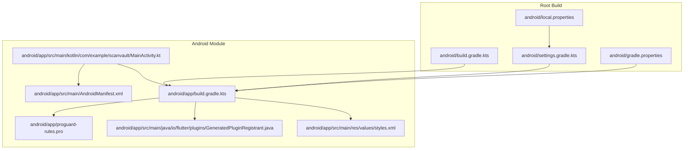
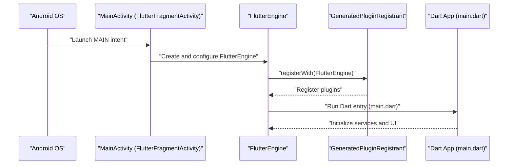
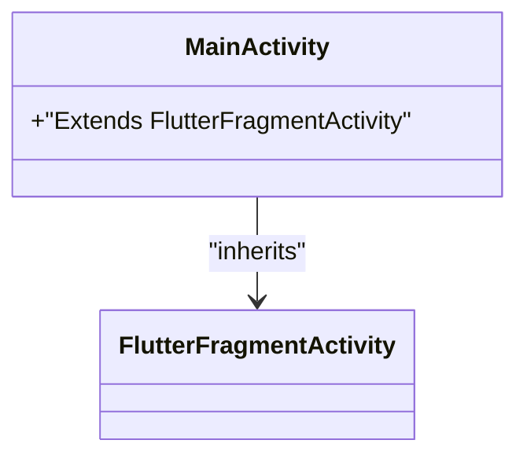
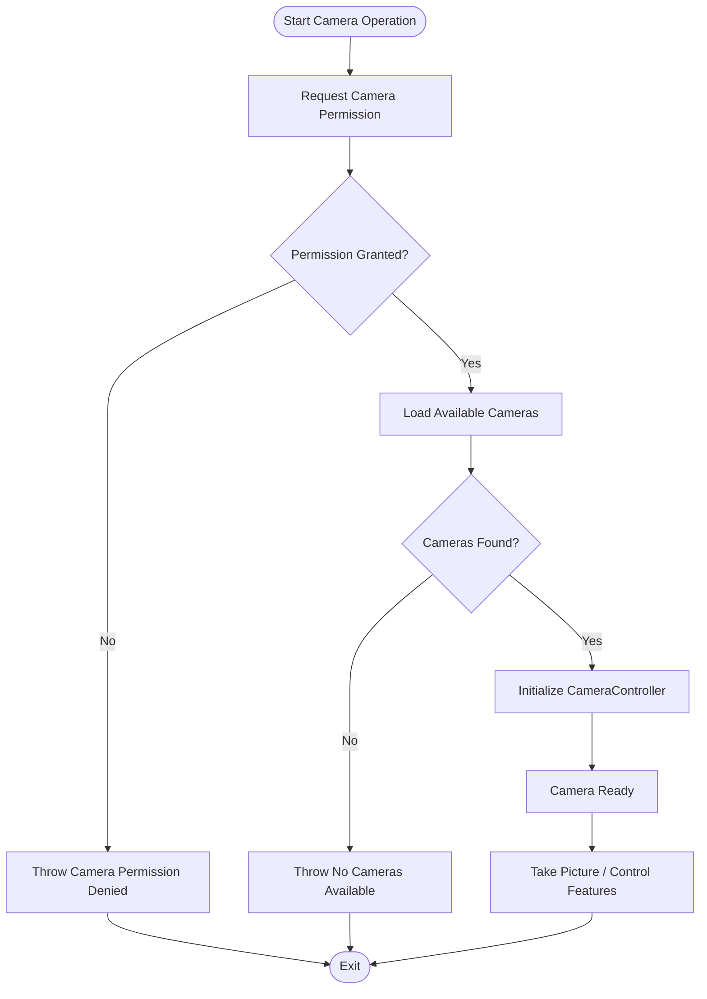
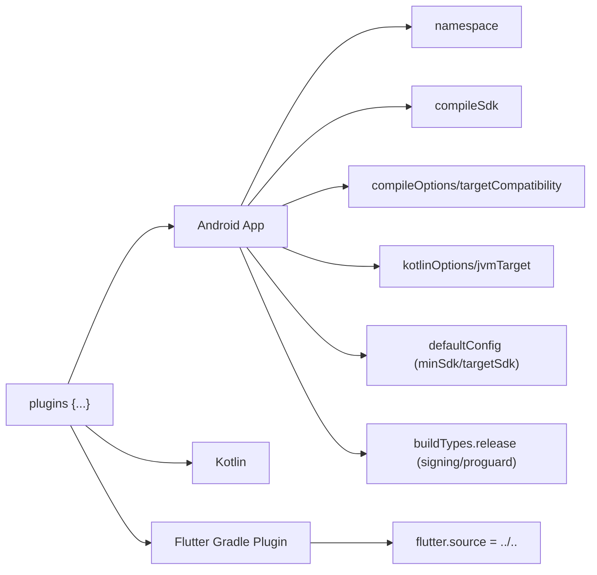
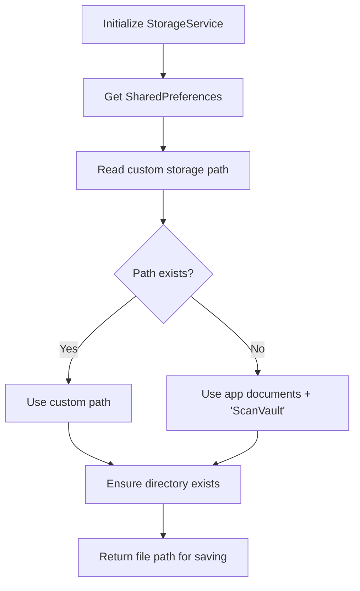
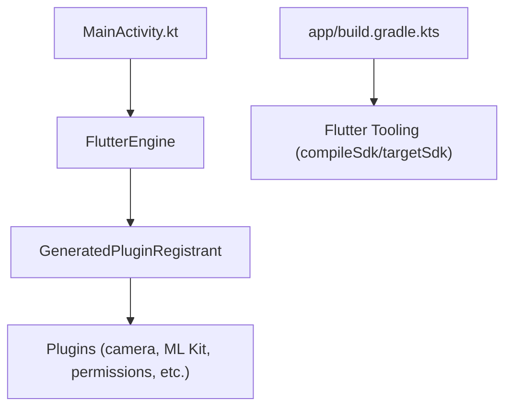

# Android Platform Implementation

<cite>
**Referenced Files in This Document**
- [MainActivity.kt](file://android/app/src/main/kotlin/com/example/scanvault/MainActivity.kt)
- [AndroidManifest.xml (main)](file://android/app/src/main/AndroidManifest.xml)
- [AndroidManifest.xml (debug)](file://android/app/src/debug/AndroidManifest.xml)
- [AndroidManifest.xml (profile)](file://android/app/src/profile/AndroidManifest.xml)
- [build.gradle.kts (app)](file://android/app/build.gradle.kts)
- [build.gradle.kts (root)](file://android/build.gradle.kts)
- [settings.gradle.kts](file://android/settings.gradle.kts)
- [gradle.properties](file://android/gradle.properties)
- [local.properties](file://android/local.properties)
- [proguard-rules.pro](file://android/app/proguard-rules.pro)
- [GeneratedPluginRegistrant.java](file://android/app/src/main/java/io/flutter/plugins/GeneratedPluginRegistrant.java)
- [styles.xml](file://android/app/src/main/res/values/styles.xml)
- [main.dart](file://lib/main.dart)
- [camera_service.dart](file://lib/services/camera_service.dart)
- [storage_service.dart](file://lib/services/storage_service.dart)
- [encryption_service.dart](file://lib/services/encryption_service.dart)
</cite>

## Table of Contents
1. [Introduction](#introduction)
2. [Project Structure](#project-structure)
3. [Core Components](#core-components)
4. [Architecture Overview](#architecture-overview)
5. [Detailed Component Analysis](#detailed-component-analysis)
6. [Dependency Analysis](#dependency-analysis)
7. [Performance Considerations](#performance-considerations)
8. [Troubleshooting Guide](#troubleshooting-guide)
9. [Conclusion](#conclusion)
10. [Appendices](#appendices)

## Introduction
This document explains the Android platform implementation for ScanVault, focusing on the Flutter-Android bridge, lifecycle management, camera permissions handling, manifest permissions, Gradle configuration, ProGuard/R8 rules, and Android-specific security and file system access patterns. It also covers Android version compatibility, target SDK requirements, and deployment strategies.

## Project Structure
The Android implementation resides under the android/ directory and integrates with Flutter via the Flutter Gradle Plugin. The main application module is configured in android/app/, with build scripts, manifests, and resources organized per standard Flutter conventions.

**Diagram sources**
- [MainActivity.kt](file://android/app/src/main/kotlin/com/example/scanvault/MainActivity.kt#L1-L6)
- [AndroidManifest.xml (main)](file://android/app/src/main/AndroidManifest.xml#L1-L58)
- [build.gradle.kts (app)](file://android/app/build.gradle.kts#L1-L46)
- [proguard-rules.pro](file://android/app/proguard-rules.pro#L1-L19)
- [GeneratedPluginRegistrant.java](file://android/app/src/main/java/io/flutter/plugins/GeneratedPluginRegistrant.java#L1-L110)
- [styles.xml](file://android/app/src/main/res/values/styles.xml#L1-L19)
- [build.gradle.kts (root)](file://android/build.gradle.kts#L1-L25)
- [settings.gradle.kts](file://android/settings.gradle.kts#L1-L69)
- [gradle.properties](file://android/gradle.properties#L1-L3)
- [local.properties](file://android/local.properties#L1-L5)

**Section sources**
- [MainActivity.kt](file://android/app/src/main/kotlin/com/example/scanvault/MainActivity.kt#L1-L6)
- [AndroidManifest.xml (main)](file://android/app/src/main/AndroidManifest.xml#L1-L58)
- [build.gradle.kts (app)](file://android/app/build.gradle.kts#L1-L46)
- [build.gradle.kts (root)](file://android/build.gradle.kts#L1-L25)
- [settings.gradle.kts](file://android/settings.gradle.kts#L1-L69)
- [gradle.properties](file://android/gradle.properties#L1-L3)
- [local.properties](file://android/local.properties#L1-L5)

## Core Components
- MainActivity.kt extends FlutterFragmentActivity, enabling Flutter’s Android embedding and lifecycle integration.
- AndroidManifest.xml declares camera and storage permissions, hardware features, and Flutter embedding metadata.
- Gradle configuration sets compile/target SDK, Java/Kotlin 17 compatibility, and release signing defaults.
- ProGuard/R8 rules preserve Flutter and ML Kit plugins and suppress warnings for optional language packs and Play Core split modules.
- GeneratedPluginRegistrant registers Flutter plugins at runtime.
- Styles define launch and normal themes for the Android window.

**Section sources**
- [MainActivity.kt](file://android/app/src/main/kotlin/com/example/scanvault/MainActivity.kt#L1-L6)
- [AndroidManifest.xml (main)](file://android/app/src/main/AndroidManifest.xml#L1-L58)
- [build.gradle.kts (app)](file://android/app/build.gradle.kts#L1-L46)
- [proguard-rules.pro](file://android/app/proguard-rules.pro#L1-L19)
- [GeneratedPluginRegistrant.java](file://android/app/src/main/java/io/flutter/plugins/GeneratedPluginRegistrant.java#L1-L110)
- [styles.xml](file://android/app/src/main/res/values/styles.xml#L1-L19)

## Architecture Overview
The Android entry point delegates to Flutter’s embedding. Permissions and camera operations are handled in Dart, while Android manifests and Gradle manage platform-level capabilities and build configuration.

**Diagram sources**
- [MainActivity.kt](file://android/app/src/main/kotlin/com/example/scanvault/MainActivity.kt#L1-L6)
- [GeneratedPluginRegistrant.java](file://android/app/src/main/java/io/flutter/plugins/GeneratedPluginRegistrant.java#L1-L110)
- [main.dart](file://lib/main.dart#L1-L32)

## Detailed Component Analysis

### MainActivity Integration and Flutter-Android Bridge
- MainActivity inherits FlutterFragmentActivity, enabling Flutter’s Android embedding v2.
- The activity is exported and configured with singleTop launch mode, hardware acceleration, and a comprehensive configChanges set for robust lifecycle handling.
- Flutter embedding metadata and plugin registration are declared in the manifest and generated at build time.

**Diagram sources**
- [MainActivity.kt](file://android/app/src/main/kotlin/com/example/scanvault/MainActivity.kt#L1-L6)

**Section sources**
- [MainActivity.kt](file://android/app/src/main/kotlin/com/example/scanvault/MainActivity.kt#L1-L6)
- [AndroidManifest.xml (main)](file://android/app/src/main/AndroidManifest.xml#L14-L45)
- [GeneratedPluginRegistrant.java](file://android/app/src/main/java/io/flutter/plugins/GeneratedPluginRegistrant.java#L1-L110)

### Lifecycle Management
- MainActivity participates in Android’s activity lifecycle through FlutterFragmentActivity.
- The app sets portrait orientation preferences in Dart’s main entry, complementing Android’s orientation handling.
- Hardware acceleration is enabled in the manifest for smoother rendering.

**Section sources**
- [MainActivity.kt](file://android/app/src/main/kotlin/com/example/scanvault/MainActivity.kt#L1-L6)
- [AndroidManifest.xml (main)](file://android/app/src/main/AndroidManifest.xml#L24-L26)
- [main.dart](file://lib/main.dart#L10-L17)

### Camera Permissions Handling
- Camera permission requests are performed in Dart using the permission_handler package.
- The CameraService manages camera initialization, permission checks, picture capture, flash, zoom, and focus operations.
- Manifest declares CAMERA and READ_MEDIA_IMAGES permissions; autofocus is optional.

**Diagram sources**
- [camera_service.dart](file://lib/services/camera_service.dart#L1-L139)
- [AndroidManifest.xml (main)](file://android/app/src/main/AndroidManifest.xml#L4-L12)

**Section sources**
- [camera_service.dart](file://lib/services/camera_service.dart#L27-L71)
- [AndroidManifest.xml (main)](file://android/app/src/main/AndroidManifest.xml#L4-L12)

### AndroidManifest.xml Permissions and Declarations
- Camera permissions: CAMERA, READ_MEDIA_IMAGES (runtime-safe for modern Android).
- Storage permissions: READ_EXTERNAL_STORAGE and WRITE_EXTERNAL_STORAGE with maxSdkVersion constraints; READ_MEDIA_IMAGES replaces broad storage access on newer platforms.
- Internet permission: Declared in debug/profile manifests for Flutter tool connectivity.
- Hardware feature: android.hardware.camera required; autofocus optional.
- Flutter embedding metadata and queries for PROCESS_TEXT action are included.

**Section sources**
- [AndroidManifest.xml (main)](file://android/app/src/main/AndroidManifest.xml#L4-L12)
- [AndroidManifest.xml (debug)](file://android/app/src/debug/AndroidManifest.xml#L6-L7)
- [AndroidManifest.xml (profile)](file://android/app/src/profile/AndroidManifest.xml#L6-L7)

### Build Configuration (Gradle)
- Plugins: com.android.application, org.jetbrains.kotlin.android, dev.flutter.flutter-gradle-plugin.
- Namespace, compileSdk, ndkVersion from Flutter tooling.
- Java/Kotlin 17 compatibility via compileOptions and kotlinOptions.
- defaultConfig: applicationId, minSdk 29, targetSdk from Flutter tooling, versionCode/versionName from Flutter.
- buildTypes.release: signingConfig defaults to debug for quick testing; ProGuard rules merged with project rules.
- Flutter source path configured to root.

**Diagram sources**
- [build.gradle.kts (app)](file://android/app/build.gradle.kts#L1-L46)

**Section sources**
- [build.gradle.kts (app)](file://android/app/build.gradle.kts#L1-L46)

### Gradle Settings and Properties
- Root build.gradle.kts centralizes repositories and redirects build output to a shared build directory.
- settings.gradle.kts loads Flutter SDK path from local.properties, configures repositories, applies Android and Kotlin plugins, and enforces namespace and JVM target compatibility for subprojects.
- gradle.properties enables AndroidX and allocates memory for builds.
- local.properties defines sdk.dir, Flutter SDK location, and default build mode/version info.

**Section sources**
- [build.gradle.kts (root)](file://android/build.gradle.kts#L1-L25)
- [settings.gradle.kts](file://android/settings.gradle.kts#L1-L69)
- [gradle.properties](file://android/gradle.properties#L1-L3)
- [local.properties](file://android/local.properties#L1-L5)

### ProGuard/R8 Rules
- Preserves Flutter wrapper classes and plugins.
- Ignores missing language modules for ML Kit Text Recognition.
- Ignores missing Play Core classes for deferred components.

**Section sources**
- [proguard-rules.pro](file://android/app/proguard-rules.pro#L1-L19)

### Android Themes and Launch Experience
- LaunchTheme and NormalTheme styles define initial splash and subsequent window appearance for the Android activity.

**Section sources**
- [styles.xml](file://android/app/src/main/res/values/styles.xml#L1-L19)

### Android-Specific Security and File System Access
- EncryptionService uses FlutterSecureStorage with AndroidOptions for secure key storage and AES-256 encryption/decryption of files.
- StorageService leverages path_provider to resolve app-specific documents directory and supports custom storage paths persisted via shared preferences.

**Diagram sources**
- [storage_service.dart](file://lib/services/storage_service.dart#L18-L62)
- [encryption_service.dart](file://lib/services/encryption_service.dart#L9-L36)

**Section sources**
- [encryption_service.dart](file://lib/services/encryption_service.dart#L1-L150)
- [storage_service.dart](file://lib/services/storage_service.dart#L1-L63)

## Dependency Analysis
- MainActivity depends on FlutterFragmentActivity and the Flutter engine.
- GeneratedPluginRegistrant registers numerous plugins including camera, ML Kit, file picker, permissions, and others.
- The app Gradle script depends on Flutter tooling for compile/target SDK and version metadata.

**Diagram sources**
- [MainActivity.kt](file://android/app/src/main/kotlin/com/example/scanvault/MainActivity.kt#L1-L6)
- [GeneratedPluginRegistrant.java](file://android/app/src/main/java/io/flutter/plugins/GeneratedPluginRegistrant.java#L1-L110)
- [build.gradle.kts (app)](file://android/app/build.gradle.kts#L1-L46)

**Section sources**
- [GeneratedPluginRegistrant.java](file://android/app/src/main/java/io/flutter/plugins/GeneratedPluginRegistrant.java#L1-L110)
- [build.gradle.kts (app)](file://android/app/build.gradle.kts#L1-L46)

## Performance Considerations
- Hardware acceleration is enabled in the manifest for smoother UI rendering.
- Java/Kotlin 17 compatibility ensures modern bytecode optimizations.
- ProGuard/R8 rules minimize code size and improve runtime performance by keeping necessary classes and ignoring optional plugin modules.
- Camera operations in Dart should be invoked on background threads where applicable to avoid UI blocking.

[No sources needed since this section provides general guidance]

## Troubleshooting Guide
- Camera permission denied: Verify camera permission is granted before initializing the CameraController; handle denied state gracefully.
- No cameras available: Ensure device has a camera and that the CAMERA hardware feature is present.
- Storage access errors: On Android 13+, rely on READ_MEDIA_IMAGES; WRITE_EXTERNAL_STORAGE is restricted; use SAF or scoped storage APIs where appropriate.
- Plugin registration failures: Confirm GeneratedPluginRegistrant is up-to-date and that the Flutter embedding metadata is present in the manifest.
- Build signing issues: Release builds currently default to debug signing; configure proper keystore and signingConfig for production.
- Orientation issues: Confirm SystemChrome orientation preferences align with Android configChanges.

**Section sources**
- [camera_service.dart](file://lib/services/camera_service.dart#L27-L71)
- [AndroidManifest.xml (main)](file://android/app/src/main/AndroidManifest.xml#L4-L12)
- [GeneratedPluginRegistrant.java](file://android/app/src/main/java/io/flutter/plugins/GeneratedPluginRegistrant.java#L1-L110)
- [build.gradle.kts (app)](file://android/app/build.gradle.kts#L33-L40)

## Conclusion
ScanVault’s Android implementation integrates Flutter with native Android capabilities through a minimal MainActivity, comprehensive manifest permissions, and a robust Gradle configuration. Camera and storage operations are handled in Dart with explicit permission checks, while Android-specific security is enforced via secure storage and encryption. The build system leverages modern SDKs and JVM targets, with ProGuard/R8 rules optimized for plugin compatibility and code shrinking.

[No sources needed since this section summarizes without analyzing specific files]

## Appendices

### Android Version Compatibility and Target SDK
- minSdk: 29
- targetSdk: managed by Flutter tooling
- compileSdk: managed by Flutter tooling
- Java/Kotlin 17 compatibility maintained across Gradle settings

**Section sources**
- [build.gradle.kts (app)](file://android/app/build.gradle.kts#L27-L30)
- [settings.gradle.kts](file://android/settings.gradle.kts#L55-L67)

### Deployment Strategies
- Use release build type with configured signingConfig for production distribution.
- Keep ProGuard/R8 rules updated with plugin changes.
- Validate camera and storage permissions on target devices; test on Android 13+ for media permissions.

**Section sources**
- [build.gradle.kts (app)](file://android/app/build.gradle.kts#L33-L40)
- [proguard-rules.pro](file://android/app/proguard-rules.pro#L1-L19)