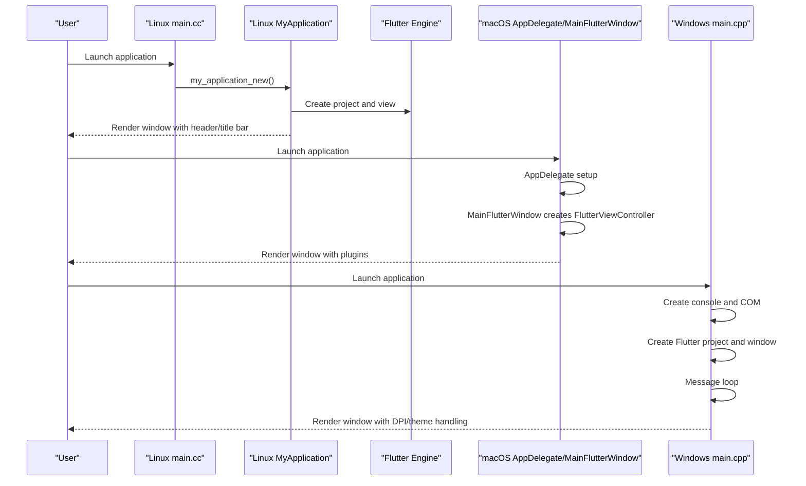
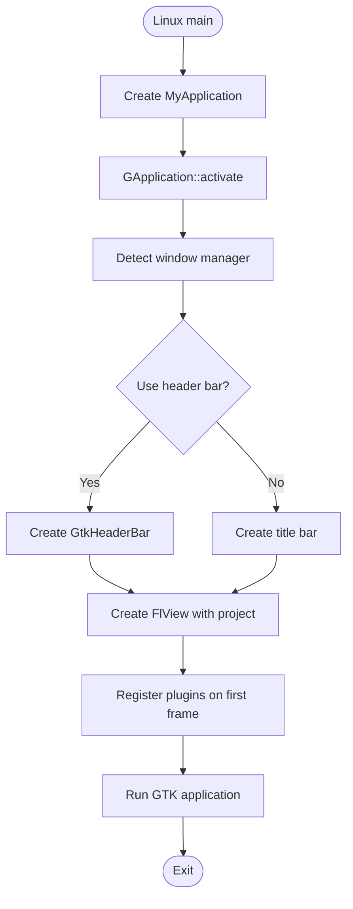
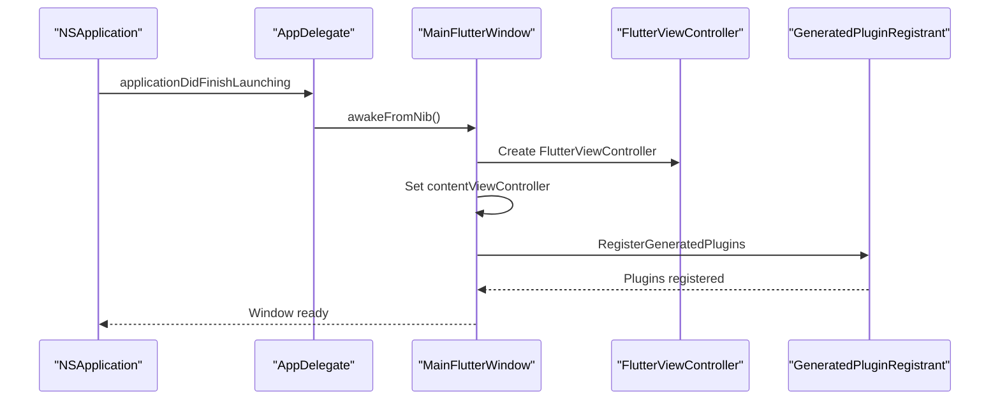
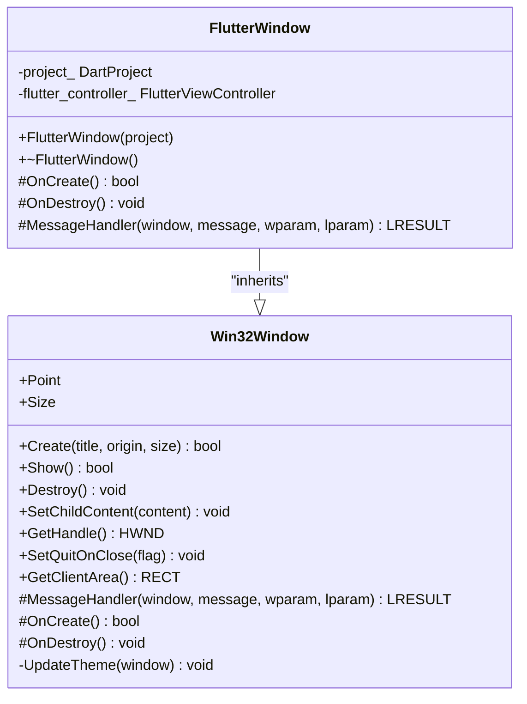
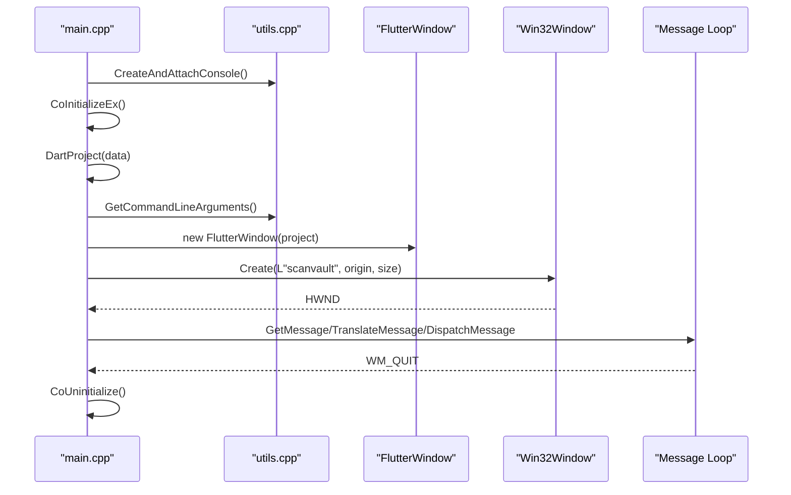
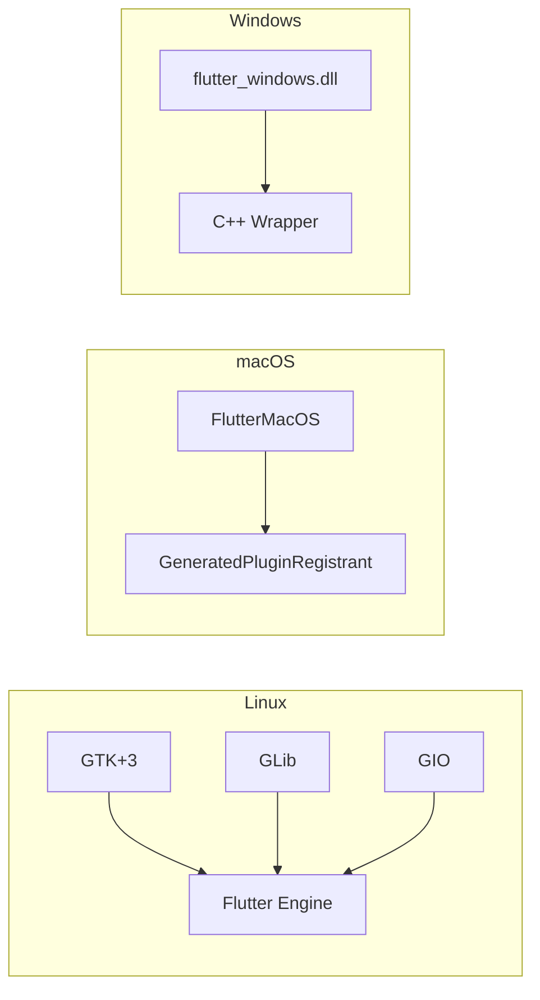

# Desktop Platforms Implementation

<cite>
**Referenced Files in This Document**
- [linux/runner/main.cc](file://linux/runner/main.cc)
- [linux/runner/my_application.cc](file://linux/runner/my_application.cc)
- [linux/runner/my_application.h](file://linux/runner/my_application.h)
- [linux/CMakeLists.txt](file://linux/CMakeLists.txt)
- [linux/flutter/CMakeLists.txt](file://linux/flutter/CMakeLists.txt)
- [macos/Runner/MainFlutterWindow.swift](file://macos/Runner/MainFlutterWindow.swift)
- [macos/Runner/AppDelegate.swift](file://macos/Runner/AppDelegate.swift)
- [macos/Runner/Info.plist](file://macos/Runner/Info.plist)
- [macos/Flutter/GeneratedPluginRegistrant.swift](file://macos/Flutter/GeneratedPluginRegistrant.swift)
- [windows/runner/main.cpp](file://windows/runner/main.cpp)
- [windows/runner/win32_window.h](file://windows/runner/win32_window.h)
- [windows/runner/win32_window.cpp](file://windows/runner/win32_window.cpp)
- [windows/runner/flutter_window.h](file://windows/runner/flutter_window.h)
- [windows/runner/utils.h](file://windows/runner/utils.h)
- [windows/runner/utils.cpp](file://windows/runner/utils.cpp)
- [windows/CMakeLists.txt](file://windows/CMakeLists.txt)
- [windows/flutter/CMakeLists.txt](file://windows/flutter/CMakeLists.txt)
</cite>

## Table of Contents
1. [Introduction](#introduction)
2. [Project Structure](#project-structure)
3. [Core Components](#core-components)
4. [Architecture Overview](#architecture-overview)
5. [Detailed Component Analysis](#detailed-component-analysis)
6. [Dependency Analysis](#dependency-analysis)
7. [Performance Considerations](#performance-considerations)
8. [Troubleshooting Guide](#troubleshooting-guide)
9. [Conclusion](#conclusion)
10. [Appendices](#appendices)

## Introduction
This document explains ScanVault’s desktop platform implementations for Linux, macOS, and Windows. It covers entry points, window management, build configurations, cross-platform considerations, deployment strategies, and platform-specific optimizations. It also highlights UI adaptations, security-related integrations, and troubleshooting tips grounded in the repository’s desktop code.

## Project Structure
ScanVault follows Flutter’s standard desktop structure:
- Linux: GTK-based windowing with a C++ runner and CMake build.
- macOS: Cocoa-based windowing with Swift entry points and Xcode integration.
- Windows: Win32-based windowing with a C++ runner and CMake build.

```mermaid
graph TB
subgraph "Linux"
LMain["linux/runner/main.cc"]
LApp["linux/runner/my_application.cc"]
LCMake["linux/CMakeLists.txt"]
LFlutterCMake["linux/flutter/CMakeLists.txt"]
end
subgraph "macOS"
MMain["macos/Runner/MainFlutterWindow.swift"]
MApp["macos/Runner/AppDelegate.swift"]
MInfo["macos/Runner/Info.plist"]
MGenReg["macos/Flutter/GeneratedPluginRegistrant.swift"]
end
subgraph "Windows"
WMain["windows/runner/main.cpp"]
WWin["windows/runner/win32_window.cpp"]
WFW["windows/runner/flutter_window.h"]
WCMake["windows/CMakeLists.txt"]
WFlutterCMake["windows/flutter/CMakeLists.txt"]
end
LMain --> LApp
LApp --> LFlutterCMake
LCMake --> LApp
MMain --> MGenReg
MApp --> MInfo
WMain --> WFW
WFW --> WWin
WWin --> WFlutterCMake
WCMake --> WMain
```

**Diagram sources**
- [linux/runner/main.cc](file://linux/runner/main.cc#L1-L7)
- [linux/runner/my_application.cc](file://linux/runner/my_application.cc#L1-L149)
- [linux/CMakeLists.txt](file://linux/CMakeLists.txt#L1-L129)
- [linux/flutter/CMakeLists.txt](file://linux/flutter/CMakeLists.txt#L1-L89)
- [macos/Runner/MainFlutterWindow.swift](file://macos/Runner/MainFlutterWindow.swift#L1-L16)
- [macos/Runner/AppDelegate.swift](file://macos/Runner/AppDelegate.swift#L1-L14)
- [macos/Runner/Info.plist](file://macos/Runner/Info.plist#L1-L33)
- [macos/Flutter/GeneratedPluginRegistrant.swift](file://macos/Flutter/GeneratedPluginRegistrant.swift#L1-L29)
- [windows/runner/main.cpp](file://windows/runner/main.cpp#L1-L44)
- [windows/runner/win32_window.cpp](file://windows/runner/win32_window.cpp#L1-L289)
- [windows/runner/flutter_window.h](file://windows/runner/flutter_window.h#L1-L34)
- [windows/CMakeLists.txt](file://windows/CMakeLists.txt#L1-L109)
- [windows/flutter/CMakeLists.txt](file://windows/flutter/CMakeLists.txt#L1-L110)

**Section sources**
- [linux/runner/main.cc](file://linux/runner/main.cc#L1-L7)
- [linux/runner/my_application.cc](file://linux/runner/my_application.cc#L1-L149)
- [linux/CMakeLists.txt](file://linux/CMakeLists.txt#L1-L129)
- [linux/flutter/CMakeLists.txt](file://linux/flutter/CMakeLists.txt#L1-L89)
- [macos/Runner/MainFlutterWindow.swift](file://macos/Runner/MainFlutterWindow.swift#L1-L16)
- [macos/Runner/AppDelegate.swift](file://macos/Runner/AppDelegate.swift#L1-L14)
- [macos/Runner/Info.plist](file://macos/Runner/Info.plist#L1-L33)
- [macos/Flutter/GeneratedPluginRegistrant.swift](file://macos/Flutter/GeneratedPluginRegistrant.swift#L1-L29)
- [windows/runner/main.cpp](file://windows/runner/main.cpp#L1-L44)
- [windows/runner/win32_window.cpp](file://windows/runner/win32_window.cpp#L1-L289)
- [windows/runner/flutter_window.h](file://windows/runner/flutter_window.h#L1-L34)
- [windows/CMakeLists.txt](file://windows/CMakeLists.txt#L1-L109)
- [windows/flutter/CMakeLists.txt](file://windows/flutter/CMakeLists.txt#L1-L110)

## Core Components
- Linux
  - Entry point initializes the GTK application and runs the Flutter engine.
  - Application class configures window title bar behavior, default size, and registers plugins after the first Flutter frame.
  - CMake defines build modes, dependencies, and installation of assets and libraries.
- macOS
  - Main window sets up a Flutter view controller and registers plugins.
  - App delegate manages lifecycle and secure state restoration.
  - Info.plist defines bundle metadata and minimum system version.
- Windows
  - Entry point attaches a console when available, initializes COM, creates a Flutter project, and runs a message loop.
  - Win32 window class handles DPI scaling, theme updates, and message routing.
  - Utilities provide console creation and UTF-16 to UTF-8 conversion for command-line arguments.

**Section sources**
- [linux/runner/main.cc](file://linux/runner/main.cc#L1-L7)
- [linux/runner/my_application.cc](file://linux/runner/my_application.cc#L1-L149)
- [linux/CMakeLists.txt](file://linux/CMakeLists.txt#L1-L129)
- [macos/Runner/MainFlutterWindow.swift](file://macos/Runner/MainFlutterWindow.swift#L1-L16)
- [macos/Runner/AppDelegate.swift](file://macos/Runner/AppDelegate.swift#L1-L14)
- [macos/Runner/Info.plist](file://macos/Runner/Info.plist#L1-L33)
- [windows/runner/main.cpp](file://windows/runner/main.cpp#L1-L44)
- [windows/runner/win32_window.cpp](file://windows/runner/win32_window.cpp#L1-L289)
- [windows/runner/utils.cpp](file://windows/runner/utils.cpp#L1-L66)

## Architecture Overview
The desktop architecture centers on platform-specific runners that embed the Flutter engine and host a Flutter view. Platform APIs are used for windowing, theming, and system integration.

**Diagram sources**
- [linux/runner/main.cc](file://linux/runner/main.cc#L1-L7)
- [linux/runner/my_application.cc](file://linux/runner/my_application.cc#L1-L149)
- [macos/Runner/AppDelegate.swift](file://macos/Runner/AppDelegate.swift#L1-L14)
- [macos/Runner/MainFlutterWindow.swift](file://macos/Runner/MainFlutterWindow.swift#L1-L16)
- [windows/runner/main.cpp](file://windows/runner/main.cpp#L1-L44)

## Detailed Component Analysis

### Linux Implementation
- Entry point
  - Initializes GTK application and starts the event loop.
- Application class
  - Determines whether to use a header bar or title bar depending on the window manager.
  - Sets default window size and background color.
  - Registers plugins after the first Flutter frame is rendered.
- Build configuration
  - Defines application ID, build type, and standard compiler settings.
  - Installs Flutter assets and AOT libraries for non-Debug builds.

**Diagram sources**
- [linux/runner/main.cc](file://linux/runner/main.cc#L1-L7)
- [linux/runner/my_application.cc](file://linux/runner/my_application.cc#L22-L79)
- [linux/CMakeLists.txt](file://linux/CMakeLists.txt#L29-L47)

**Section sources**
- [linux/runner/main.cc](file://linux/runner/main.cc#L1-L7)
- [linux/runner/my_application.cc](file://linux/runner/my_application.cc#L1-L149)
- [linux/runner/my_application.h](file://linux/runner/my_application.h#L1-L22)
- [linux/CMakeLists.txt](file://linux/CMakeLists.txt#L1-L129)
- [linux/flutter/CMakeLists.txt](file://linux/flutter/CMakeLists.txt#L1-L89)

### macOS Implementation
- Main window
  - Creates a Flutter view controller and installs it as the content view.
  - Registers plugins during awakeFromNib.
- App delegate
  - Controls termination after last window closes and secure state restoration support.
- Bundle configuration
  - Info.plist defines bundle identifiers, development region, and minimum system version.

**Diagram sources**
- [macos/Runner/AppDelegate.swift](file://macos/Runner/AppDelegate.swift#L1-L14)
- [macos/Runner/MainFlutterWindow.swift](file://macos/Runner/MainFlutterWindow.swift#L1-L16)
- [macos/Flutter/GeneratedPluginRegistrant.swift](file://macos/Flutter/GeneratedPluginRegistrant.swift#L18-L28)
- [macos/Runner/Info.plist](file://macos/Runner/Info.plist#L1-L33)

**Section sources**
- [macos/Runner/MainFlutterWindow.swift](file://macos/Runner/MainFlutterWindow.swift#L1-L16)
- [macos/Runner/AppDelegate.swift](file://macos/Runner/AppDelegate.swift#L1-L14)
- [macos/Runner/Info.plist](file://macos/Runner/Info.plist#L1-L33)
- [macos/Flutter/GeneratedPluginRegistrant.swift](file://macos/Flutter/GeneratedPluginRegistrant.swift#L1-L29)

### Windows Implementation
- Entry point
  - Attaches to a console if available or creates one under a debugger.
  - Initializes COM, constructs a Dart project with command-line arguments, and runs a message loop.
- Window management
  - Win32 window class encapsulates DPI scaling, theme updates, and message handling.
  - Provides hooks for subclassing to host a Flutter view.
- Utilities
  - Console redirection and UTF-16 to UTF-8 conversion for robust command-line handling.

**Diagram sources**
- [windows/runner/win32_window.h](file://windows/runner/win32_window.h#L1-L103)
- [windows/runner/flutter_window.h](file://windows/runner/flutter_window.h#L1-L34)

**Diagram sources**
- [windows/runner/main.cpp](file://windows/runner/main.cpp#L1-L44)
- [windows/runner/utils.cpp](file://windows/runner/utils.cpp#L1-L66)
- [windows/runner/flutter_window.h](file://windows/runner/flutter_window.h#L1-L34)
- [windows/runner/win32_window.cpp](file://windows/runner/win32_window.cpp#L123-L150)

**Section sources**
- [windows/runner/main.cpp](file://windows/runner/main.cpp#L1-L44)
- [windows/runner/win32_window.h](file://windows/runner/win32_window.h#L1-L103)
- [windows/runner/win32_window.cpp](file://windows/runner/win32_window.cpp#L1-L289)
- [windows/runner/flutter_window.h](file://windows/runner/flutter_window.h#L1-L34)
- [windows/runner/utils.h](file://windows/runner/utils.h#L1-L20)
- [windows/runner/utils.cpp](file://windows/runner/utils.cpp#L1-L66)

## Dependency Analysis
- Linux
  - GTK, GLib, and GIO are required for windowing and system integration.
  - Flutter library and ICU data are installed alongside application assets.
- macOS
  - Uses FlutterMacOS and registers plugins via GeneratedPluginRegistrant.
  - Bundle metadata is defined in Info.plist.
- Windows
  - Links against flutter_windows.dll and uses the C++ wrapper for Flutter.
  - Installs runtime libraries and assets next to the executable.

**Diagram sources**
- [linux/flutter/CMakeLists.txt](file://linux/flutter/CMakeLists.txt#L24-L69)
- [macos/Flutter/GeneratedPluginRegistrant.swift](file://macos/Flutter/GeneratedPluginRegistrant.swift#L18-L28)
- [windows/flutter/CMakeLists.txt](file://windows/flutter/CMakeLists.txt#L18-L40)

**Section sources**
- [linux/flutter/CMakeLists.txt](file://linux/flutter/CMakeLists.txt#L1-L89)
- [windows/flutter/CMakeLists.txt](file://windows/flutter/CMakeLists.txt#L1-L110)

## Performance Considerations
- Linux
  - Standard compiler flags and release optimizations are enabled outside Debug mode.
  - AOT libraries are installed for non-Debug builds to reduce startup overhead.
- Windows
  - Release builds apply stricter warning levels and exception model settings.
  - DPI scaling and theme updates are handled at the window level to maintain responsiveness.
- Cross-platform
  - Prefer embedding only necessary plugins to minimize startup time.
  - Keep asset sizes reasonable and leverage incremental asset installation.

[No sources needed since this section provides general guidance]

## Troubleshooting Guide
- Linux
  - If the window does not appear, verify GTK availability and that the application ID matches desktop entries.
  - Ensure assets are installed in the expected bundle directory.
- macOS
  - If plugins fail to register, confirm GeneratedPluginRegistrant is invoked in the main window.
  - Verify Info.plist keys for bundle identifiers and minimum system version.
- Windows
  - If the console appears unexpectedly, ensure the process is launched without a parent console or disable console attachment.
  - For DPI scaling issues, confirm monitor DPI queries and scale factor calculations.
  - If theme updates do not apply, verify registry access for preferred brightness settings.

**Section sources**
- [linux/CMakeLists.txt](file://linux/CMakeLists.txt#L78-L129)
- [macos/Runner/Info.plist](file://macos/Runner/Info.plist#L1-L33)
- [windows/runner/main.cpp](file://windows/runner/main.cpp#L10-L18)
- [windows/runner/win32_window.cpp](file://windows/runner/win32_window.cpp#L134-L135)
- [windows/runner/win32_window.cpp](file://windows/runner/win32_window.cpp#L275-L288)

## Conclusion
ScanVault’s desktop implementations leverage platform-native APIs through Flutter’s desktop runners. Linux integrates with GTK and CMake, macOS uses Cocoa and Swift with Xcode, and Windows employs Win32 with a C++ runner and CMake. The build configurations install assets and libraries appropriately per platform, and the windowing code adapts to platform conventions such as header bars, title bars, and theme preferences. Following the platform-specific guidance herein will help maintain stability, performance, and a consistent user experience.

[No sources needed since this section summarizes without analyzing specific files]

## Appendices
- Security and privacy
  - macOS local authentication and secure storage plugins are registered; ensure proper entitlements and keychain usage.
- Hardware integration
  - Camera and OCR features depend on platform capabilities; verify permissions and device availability on each OS.
- Deployment
  - Linux bundles assets and libraries into a relocatable directory.
  - macOS uses Xcode workspace and Info.plist for packaging.
  - Windows installs runtime libraries next to the executable for in-place execution.

[No sources needed since this section provides general guidance]