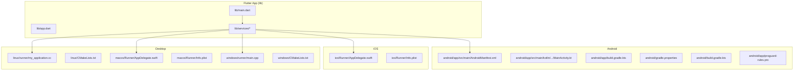
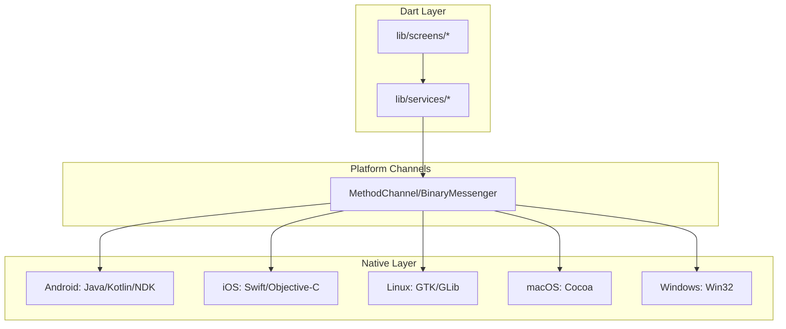
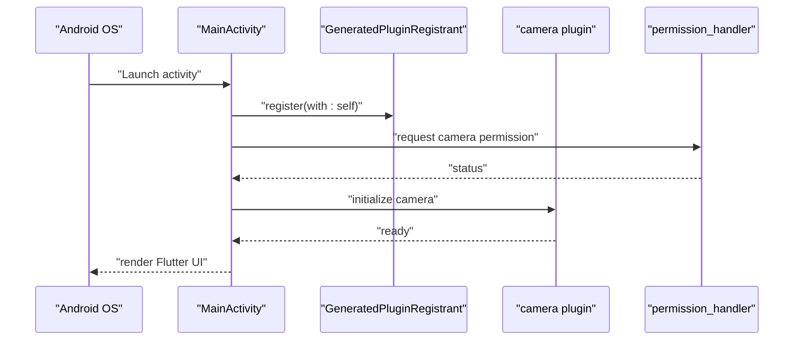
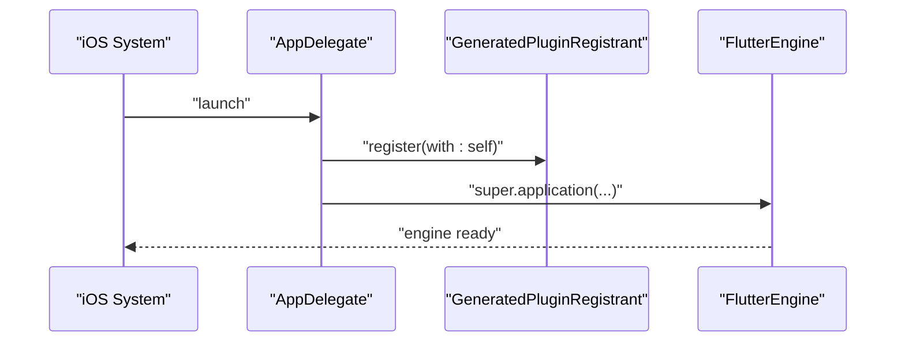
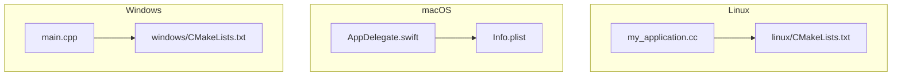
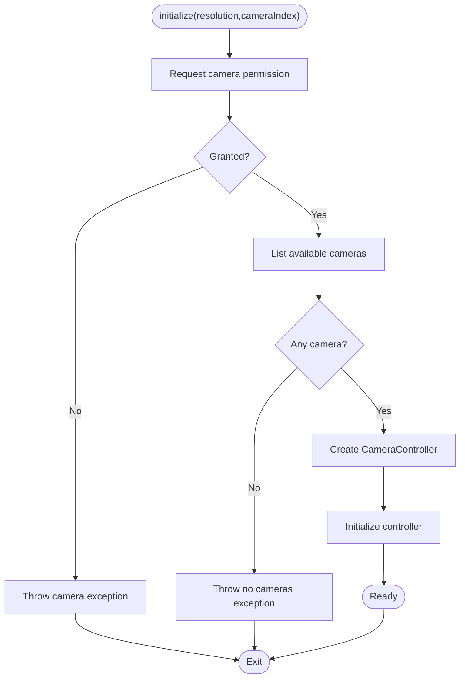
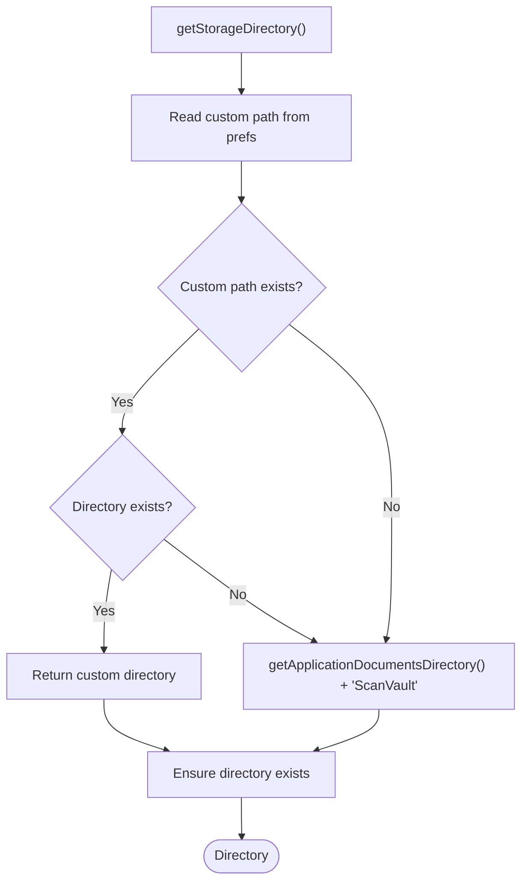
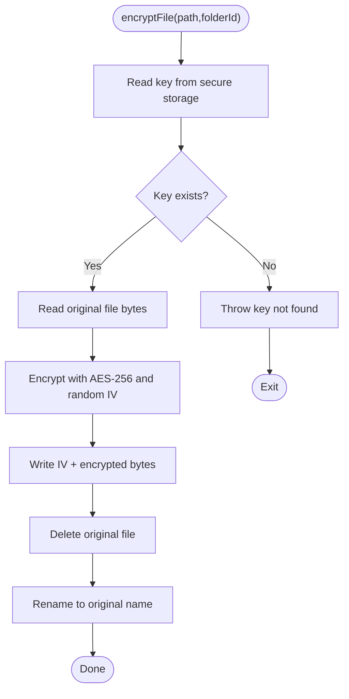
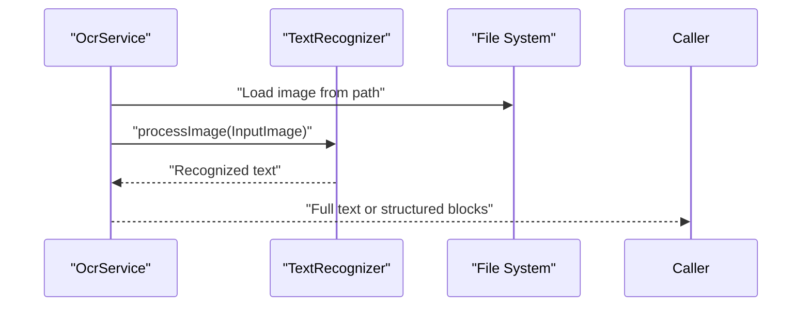
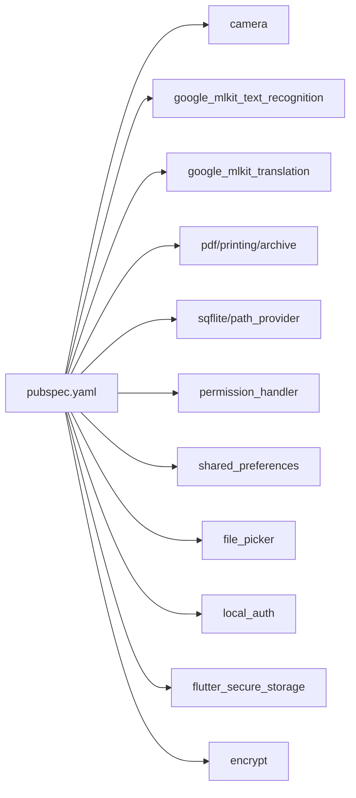

# Platform Integration

<cite>
**Referenced Files in This Document**
- [MainActivity.kt](file://android/app/src/main/kotlin/com/example/scanvault/MainActivity.kt)
- [AndroidManifest.xml](file://android/app/src/main/AndroidManifest.xml)
- [build.gradle.kts](file://android/app/build.gradle.kts)
- [gradle.properties](file://android/gradle.properties)
- [build.gradle.kts](file://android/build.gradle.kts)
- [proguard-rules.pro](file://android/app/proguard-rules.pro)
- [AppDelegate.swift](file://ios/Runner/AppDelegate.swift)
- [Info.plist](file://ios/Runner/Info.plist)
- [my_application.cc](file://linux/runner/my_application.cc)
- [CMakeLists.txt](file://linux/CMakeLists.txt)
- [AppDelegate.swift](file://macos/Runner/AppDelegate.swift)
- [Info.plist](file://macos/Runner/Info.plist)
- [main.cpp](file://windows/runner/main.cpp)
- [CMakeLists.txt](file://windows/CMakeLists.txt)
- [pubspec.yaml](file://pubspec.yaml)
- [camera_service.dart](file://lib/services/camera_service.dart)
- [storage_service.dart](file://lib/services/storage_service.dart)
- [encryption_service.dart](file://lib/services/encryption_service.dart)
- [ocr_service.dart](file://lib/services/ocr_service.dart)
</cite>

## Table of Contents
1. [Introduction](#introduction)
2. [Project Structure](#project-structure)
3. [Core Components](#core-components)
4. [Architecture Overview](#architecture-overview)
5. [Detailed Component Analysis](#detailed-component-analysis)
6. [Dependency Analysis](#dependency-analysis)
7. [Performance Considerations](#performance-considerations)
8. [Troubleshooting Guide](#troubleshooting-guide)
9. [Conclusion](#conclusion)
10. [Appendices](#appendices)

## Introduction
This document explains how ScanVault integrates across Android, iOS, and desktop platforms (Linux, macOS, Windows). It covers Android-specific setup (MainActivity, permissions, manifest, Gradle), iOS integration patterns (App Delegate, Info.plist), and desktop platform support (Linux GTK windowing, macOS Cocoa, Windows Win32). It also documents platform-specific services for camera, storage, encryption, and OCR, along with build configuration differences, deployment strategies, and troubleshooting guidance.

## Project Structure
ScanVault follows Flutter’s standard multi-platform layout with platform-specific folders under android/, ios/, linux/, macos/, and windows/. The Dart application resides under lib/ with platform-agnostic services and UI.

**Diagram sources**
- [AndroidManifest.xml](file://android/app/src/main/AndroidManifest.xml#L1-L58)
- [MainActivity.kt](file://android/app/src/main/kotlin/com/example/scanvault/MainActivity.kt#L1-L6)
- [build.gradle.kts](file://android/app/build.gradle.kts#L1-L46)
- [gradle.properties](file://android/gradle.properties#L1-L3)
- [build.gradle.kts](file://android/build.gradle.kts#L1-L25)
- [proguard-rules.pro](file://android/app/proguard-rules.pro#L1-L19)
- [AppDelegate.swift](file://ios/Runner/AppDelegate.swift#L1-L14)
- [Info.plist](file://ios/Runner/Info.plist#L1-L50)
- [my_application.cc](file://linux/runner/my_application.cc#L1-L149)
- [CMakeLists.txt](file://linux/CMakeLists.txt#L1-L129)
- [AppDelegate.swift](file://macos/Runner/AppDelegate.swift#L1-L14)
- [Info.plist](file://macos/Runner/Info.plist#L1-L33)
- [main.cpp](file://windows/runner/main.cpp#L1-L44)
- [CMakeLists.txt](file://windows/CMakeLists.txt#L1-L109)

**Section sources**
- [AndroidManifest.xml](file://android/app/src/main/AndroidManifest.xml#L1-L58)
- [MainActivity.kt](file://android/app/src/main/kotlin/com/example/scanvault/MainActivity.kt#L1-L6)
- [build.gradle.kts](file://android/app/build.gradle.kts#L1-L46)
- [gradle.properties](file://android/gradle.properties#L1-L3)
- [build.gradle.kts](file://android/build.gradle.kts#L1-L25)
- [proguard-rules.pro](file://android/app/proguard-rules.pro#L1-L19)
- [AppDelegate.swift](file://ios/Runner/AppDelegate.swift#L1-L14)
- [Info.plist](file://ios/Runner/Info.plist#L1-L50)
- [my_application.cc](file://linux/runner/my_application.cc#L1-L149)
- [CMakeLists.txt](file://linux/CMakeLists.txt#L1-L129)
- [AppDelegate.swift](file://macos/Runner/AppDelegate.swift#L1-L14)
- [Info.plist](file://macos/Runner/Info.plist#L1-L33)
- [main.cpp](file://windows/runner/main.cpp#L1-L44)
- [CMakeLists.txt](file://windows/CMakeLists.txt#L1-L109)

## Core Components
- Camera service: Handles camera permission requests, initialization, capture, flash, zoom, and focus. It uses the camera plugin and permission_handler.
- Storage service: Manages custom storage paths via shared preferences and resolves the effective directory for saving files using path_provider.
- Encryption service: Provides AES-256 encryption/decryption for files and secure key storage per folder using flutter_secure_storage with Android encrypted shared preferences.
- OCR service: Uses Google ML Kit Text Recognition to extract text from images and supports structured block extraction.

These services demonstrate platform abstraction via Flutter plugins and platform channels, while platform-specific implementations are encapsulated in platform code.

**Section sources**
- [camera_service.dart](file://lib/services/camera_service.dart#L1-L140)
- [storage_service.dart](file://lib/services/storage_service.dart#L1-L63)
- [encryption_service.dart](file://lib/services/encryption_service.dart#L1-L150)
- [ocr_service.dart](file://lib/services/ocr_service.dart#L1-L93)

## Architecture Overview
The app uses Flutter’s platform channel model:
- Dart code invokes platform-specific plugins or native code via MethodChannel.
- Android/iOS/desktop handle platform-specific tasks (permissions, UI, file system, hardware).
- Services abstract platform differences for camera, storage, encryption, and OCR.

[No sources needed since this diagram shows conceptual workflow, not actual code structure]

## Detailed Component Analysis

### Android Integration
- MainActivity extends FlutterFragmentActivity and delegates lifecycle to Flutter.
- Manifest defines camera and storage permissions, required camera hardware features, and queries for text processing.
- Gradle config sets compile/target SDK, Java 17 compatibility, minSdk 29, and Flutter Gradle plugin.
- ProGuard rules keep Flutter wrappers and ignore missing ML Kit language modules and Play Core deferred components.

**Diagram sources**
- [MainActivity.kt](file://android/app/src/main/kotlin/com/example/scanvault/MainActivity.kt#L1-L6)
- [AndroidManifest.xml](file://android/app/src/main/AndroidManifest.xml#L1-L58)
- [build.gradle.kts](file://android/app/build.gradle.kts#L1-L46)
- [camera_service.dart](file://lib/services/camera_service.dart#L1-L140)

**Section sources**
- [MainActivity.kt](file://android/app/src/main/kotlin/com/example/scanvault/MainActivity.kt#L1-L6)
- [AndroidManifest.xml](file://android/app/src/main/AndroidManifest.xml#L1-L58)
- [build.gradle.kts](file://android/app/build.gradle.kts#L1-L46)
- [gradle.properties](file://android/gradle.properties#L1-L3)
- [build.gradle.kts](file://android/build.gradle.kts#L1-L25)
- [proguard-rules.pro](file://android/app/proguard-rules.pro#L1-L19)

### iOS Integration
- AppDelegate registers plugins and defers to FlutterAppDelegate lifecycle.
- Info.plist defines supported orientations, minimum OS requirements, and Flutter-managed metadata.
- Current iOS limitations: No explicit platform channel handlers or native implementations are present in the repository snapshot; integration relies on Flutter plugins and generated registrants.

**Diagram sources**
- [AppDelegate.swift](file://ios/Runner/AppDelegate.swift#L1-L14)
- [Info.plist](file://ios/Runner/Info.plist#L1-L50)

**Section sources**
- [AppDelegate.swift](file://ios/Runner/AppDelegate.swift#L1-L14)
- [Info.plist](file://ios/Runner/Info.plist#L1-L50)

### Desktop Platforms (Linux, macOS, Windows)
- Linux: GTK-based windowing with header bar handling, window sizing, and plugin registration. The application ID and RPATH are configured for proper bundling.
- macOS: Cocoa app delegate with secure state restoration and termination behavior.
- Windows: Win32 window creation, console attachment, COM initialization, and message loop.

**Diagram sources**
- [my_application.cc](file://linux/runner/my_application.cc#L1-L149)
- [CMakeLists.txt](file://linux/CMakeLists.txt#L1-L129)
- [AppDelegate.swift](file://macos/Runner/AppDelegate.swift#L1-L14)
- [Info.plist](file://macos/Runner/Info.plist#L1-L33)
- [main.cpp](file://windows/runner/main.cpp#L1-L44)
- [CMakeLists.txt](file://windows/CMakeLists.txt#L1-L109)

**Section sources**
- [my_application.cc](file://linux/runner/my_application.cc#L1-L149)
- [CMakeLists.txt](file://linux/CMakeLists.txt#L1-L129)
- [AppDelegate.swift](file://macos/Runner/AppDelegate.swift#L1-L14)
- [Info.plist](file://macos/Runner/Info.plist#L1-L33)
- [main.cpp](file://windows/runner/main.cpp#L1-L44)
- [CMakeLists.txt](file://windows/CMakeLists.txt#L1-L109)

### Platform-Specific Services

#### Camera Service
- Requests camera permission via permission_handler.
- Initializes CameraController with preset resolution and JPEG format.
- Supports flash toggling, zoom clamping, and focus point setting.
- Throws domain-specific exceptions on failure.

**Diagram sources**
- [camera_service.dart](file://lib/services/camera_service.dart#L1-L140)

**Section sources**
- [camera_service.dart](file://lib/services/camera_service.dart#L1-L140)

#### Storage Service
- Persists a custom storage path in SharedPreferences.
- Resolves effective directory using path_provider; falls back to app documents + “ScanVault”.
- Ensures directory exists and returns full file paths.

**Diagram sources**
- [storage_service.dart](file://lib/services/storage_service.dart#L1-L63)

**Section sources**
- [storage_service.dart](file://lib/services/storage_service.dart#L1-L63)

#### Encryption Service
- Generates AES-256 keys and stores them securely per folder.
- Encrypts/decrypts files by prepending IV and renaming appropriately.
- Detects encrypted files by checking file size and IV presence.

**Diagram sources**
- [encryption_service.dart](file://lib/services/encryption_service.dart#L1-L150)

**Section sources**
- [encryption_service.dart](file://lib/services/encryption_service.dart#L1-L150)

#### OCR Service
- Uses Google ML Kit TextRecognizer to extract text from images.
- Supports structured block extraction and combining results from multiple images.
- Disposes recognizer when done.

**Diagram sources**
- [ocr_service.dart](file://lib/services/ocr_service.dart#L1-L93)

**Section sources**
- [ocr_service.dart](file://lib/services/ocr_service.dart#L1-L93)

## Dependency Analysis
- Flutter dependencies include camera, ML Kit OCR/translation, PDF/printing/archive, sqflite/path_provider, Riverpod, GoRouter, permission_handler, shared_preferences, file_picker, local_auth, flutter_secure_storage, encrypt, and others.
- Android build uses Flutter Gradle plugin, Java 17, minSdk 29, and ProGuard rules for ML Kit and Play Core.
- Desktop builds use CMake with platform-specific packaging and installation steps.

**Diagram sources**
- [pubspec.yaml](file://pubspec.yaml#L1-L78)

**Section sources**
- [pubspec.yaml](file://pubspec.yaml#L1-L78)

## Performance Considerations
- Android: Use minSdk 29 to leverage modern APIs; keep Java 17 compatibility; configure ProGuard to exclude ML Kit language modules and Play Core deferred components to reduce overhead.
- Desktop: Ensure proper RPATH and asset bundling; avoid unnecessary UI redraws; defer heavy operations (OCR, encryption) to background threads or isolate them to minimize UI stalls.
- General: Cache frequently accessed directories and keys; reuse recognizers and controllers where possible; dispose resources promptly.

[No sources needed since this section provides general guidance]

## Troubleshooting Guide
- Android camera permission denied: Verify camera permission request and manifest camera features; confirm runtime permission handling in CameraService.
- Android storage permission errors: Review READ_EXTERNAL_STORAGE vs scoped storage; ensure WRITE permission and maxSdk adjustments are appropriate for target SDK.
- Android ProGuard/ML Kit: Keep ML Kit language module ignores and Play Core ignores in proguard-rules.pro.
- iOS plugin registration: Confirm GeneratedPluginRegistrant is registered in AppDelegate.
- Desktop windowing: On Linux, header bar detection depends on window manager; on Windows, ensure COM initialization and console attachment for debugging.
- Encryption failures: Validate folder key existence and file size checks; ensure IV prepending logic is intact.

**Section sources**
- [AndroidManifest.xml](file://android/app/src/main/AndroidManifest.xml#L1-L58)
- [proguard-rules.pro](file://android/app/proguard-rules.pro#L1-L19)
- [AppDelegate.swift](file://ios/Runner/AppDelegate.swift#L1-L14)
- [my_application.cc](file://linux/runner/my_application.cc#L1-L149)
- [main.cpp](file://windows/runner/main.cpp#L1-L44)
- [encryption_service.dart](file://lib/services/encryption_service.dart#L1-L150)

## Conclusion
ScanVault integrates seamlessly across Android, iOS, and desktop through Flutter’s platform abstraction. Platform-specific concerns—permissions, manifest configuration, plugin registration, and native windowing—are isolated in platform code, while core services (camera, storage, encryption, OCR) provide a unified Dart API. Build configurations differ per platform but follow established patterns for Gradle, CMake, and plugin registration.

[No sources needed since this section summarizes without analyzing specific files]

## Appendices

### Build Configuration Differences
- Android: Flutter Gradle plugin, Java 17, minSdk 29, ProGuard rules for ML Kit and Play Core.
- Linux: GTK application, RPATH setup, asset bundling, and AOT library installation for non-Debug builds.
- macOS: Cocoa app delegate and Info.plist entries for deployment target and main nib/class.
- Windows: Win32 windowing, COM initialization, and asset bundling into the executable directory.

**Section sources**
- [build.gradle.kts](file://android/app/build.gradle.kts#L1-L46)
- [gradle.properties](file://android/gradle.properties#L1-L3)
- [CMakeLists.txt](file://linux/CMakeLists.txt#L1-L129)
- [Info.plist](file://macos/Runner/Info.plist#L1-L33)
- [CMakeLists.txt](file://windows/CMakeLists.txt#L1-L109)

### Deployment Strategies
- Android: Sign release builds; use optimized ProGuard rules; publish to stores with appropriate permissions declared.
- Desktop: Package assets and plugins; install ICU data and AOT libraries for non-Debug modes; ensure RPATH for Linux bundles.
- iOS: Register plugins and ensure Info.plist keys align with supported orientations and minimum OS.

**Section sources**
- [build.gradle.kts](file://android/app/build.gradle.kts#L33-L40)
- [CMakeLists.txt](file://linux/CMakeLists.txt#L78-L129)
- [Info.plist](file://ios/Runner/Info.plist#L1-L50)