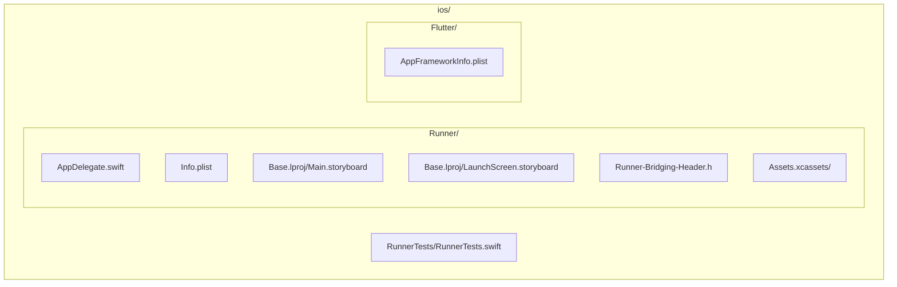
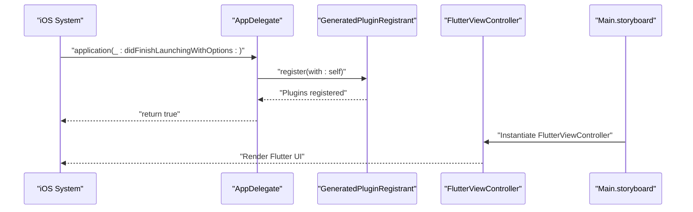
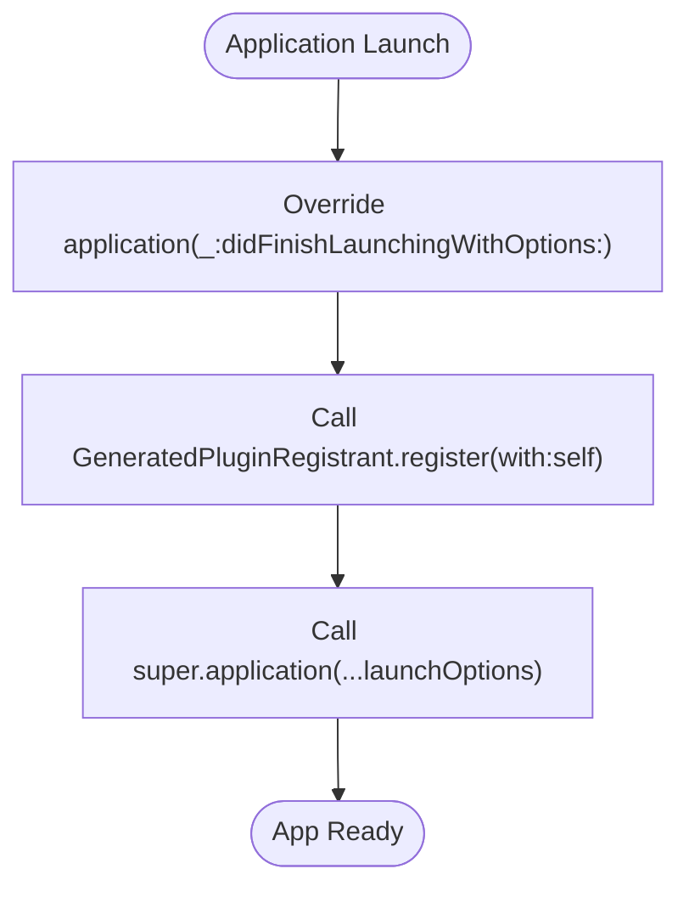
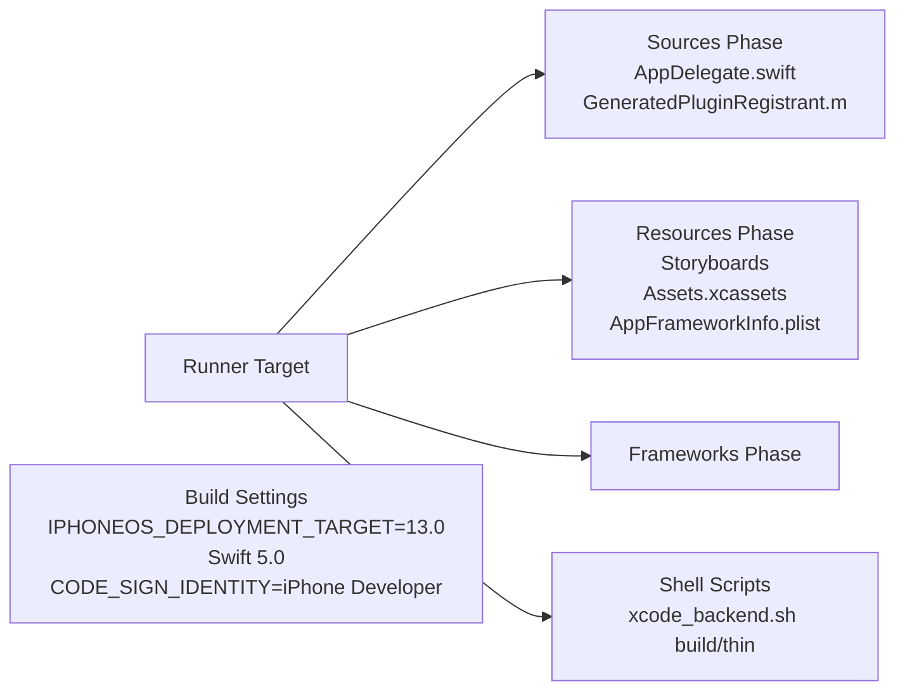
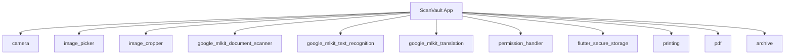

# iOS Platform Implementation

<cite>
**Referenced Files in This Document**
- [AppDelegate.swift](file://ios/Runner/AppDelegate.swift)
- [Info.plist](file://ios/Runner/Info.plist)
- [project.pbxproj](file://ios/Runner.xcodeproj/project.pbxproj)
- [AppFrameworkInfo.plist](file://ios/Flutter/AppFrameworkInfo.plist)
- [Main.storyboard](file://ios/Runner/Base.lproj/Main.storyboard)
- [LaunchScreen.storyboard](file://ios/Runner/Base.lproj/LaunchScreen.storyboard)
- [Runner-Bridging-Header.h](file://ios/Runner/Runner-Bridging-Header.h)
- [RunnerTests.swift](file://ios/RunnerTests/RunnerTests.swift)
- [pubspec.yaml](file://pubspec.yaml)
</cite>

## Table of Contents
1. [Introduction](#introduction)
2. [Project Structure](#project-structure)
3. [Core Components](#core-components)
4. [Architecture Overview](#architecture-overview)
5. [Detailed Component Analysis](#detailed-component-analysis)
6. [Dependency Analysis](#dependency-analysis)
7. [Performance Considerations](#performance-considerations)
8. [Security and Entitlements](#security-and-entitlements)
9. [iOS Version Compatibility](#ios-version-compatibility)
10. [Troubleshooting Guide](#troubleshooting-guide)
11. [Current Limitations and Roadmap](#current-limitations-and-roadmap)
12. [Conclusion](#conclusion)

## Introduction
This document provides a comprehensive overview of ScanVault's iOS platform implementation. It focuses on the Flutter-based iOS integration, including AppDelegate configuration, Info.plist settings, Xcode project structure, and iOS-specific considerations such as deployment targets, entitlements, and sandbox restrictions. The goal is to help developers understand how the iOS app boots, integrates plugins, manages lifecycle events, and aligns with Apple's platform requirements.

## Project Structure
The iOS implementation resides under the ios/ directory and follows a standard Flutter iOS project layout:
- Runner: The main iOS application target containing AppDelegate, Info.plist, storyboards, assets, and bridging header.
- Flutter: Flutter framework resources and configuration files.
- RunnerTests: Unit test target for the iOS app.

**Diagram sources**
- [AppDelegate.swift](file://ios/Runner/AppDelegate.swift#L1-L14)
- [Info.plist](file://ios/Runner/Info.plist#L1-L50)
- [Main.storyboard](file://ios/Runner/Base.lproj/Main.storyboard#L1-L27)
- [LaunchScreen.storyboard](file://ios/Runner/Base.lproj/LaunchScreen.storyboard#L1-L38)
- [Runner-Bridging-Header.h](file://ios/Runner/Runner-Bridging-Header.h#L1-L2)
- [AppFrameworkInfo.plist](file://ios/Flutter/AppFrameworkInfo.plist#L1-L27)
- [RunnerTests.swift](file://ios/RunnerTests/RunnerTests.swift#L1-L13)

**Section sources**
- [AppDelegate.swift](file://ios/Runner/AppDelegate.swift#L1-L14)
- [Info.plist](file://ios/Runner/Info.plist#L1-L50)
- [project.pbxproj](file://ios/Runner.xcodeproj/project.pbxproj#L166-L201)

## Core Components
This section documents the primary iOS components and their roles in the application lifecycle and plugin integration.

- AppDelegate.swift
  - Inherits from FlutterAppDelegate.
  - Overrides applicationDidFinishLaunching to register plugins via GeneratedPluginRegistrant.
  - Ensures Flutter engine initialization and plugin discovery during startup.

- Info.plist
  - Defines bundle metadata, display name, storyboard references, supported orientations, and runtime attributes.
  - Includes keys for minimum OS version, indirect input events support, and frame duration control.

- Main.storyboard and LaunchScreen.storyboard
  - Define the initial view controller and launch screen visuals.
  - Main.storyboard hosts the FlutterViewController that renders the Flutter UI.

- Runner-Bridging-Header.h
  - Imports GeneratedPluginRegistrant.h to expose plugin registration to Objective-C/Swift.

- AppFrameworkInfo.plist
  - Specifies Flutter framework bundle identifiers and the minimum OS version for the embedded framework.

**Section sources**
- [AppDelegate.swift](file://ios/Runner/AppDelegate.swift#L4-L12)
- [Info.plist](file://ios/Runner/Info.plist#L5-L47)
- [Main.storyboard](file://ios/Runner/Base.lproj/Main.storyboard#L8-L24)
- [LaunchScreen.storyboard](file://ios/Runner/Base.lproj/LaunchScreen.storyboard#L9-L32)
- [Runner-Bridging-Header.h](file://ios/Runner/Runner-Bridging-Header.h#L1-L1)
- [AppFrameworkInfo.plist](file://ios/Flutter/AppFrameworkInfo.plist#L23-L24)

## Architecture Overview
The iOS app bootstraps through AppDelegate, initializes the Flutter engine, registers plugins, and renders the Flutter UI via a storyboard-defined FlutterViewController.

**Diagram sources**
- [AppDelegate.swift](file://ios/Runner/AppDelegate.swift#L6-L12)
- [Main.storyboard](file://ios/Runner/Base.lproj/Main.storyboard#L11-L21)

## Detailed Component Analysis

### AppDelegate Lifecycle and Plugin Registration
- Inheritance: Uses FlutterAppDelegate to integrate with Flutter's lifecycle hooks.
- Launch callback: Calls GeneratedPluginRegistrant.register(with:) to initialize plugins before returning control to the system.
- Purpose: Centralized startup logic for Flutter and plugin initialization.

**Diagram sources**
- [AppDelegate.swift](file://ios/Runner/AppDelegate.swift#L6-L12)

**Section sources**
- [AppDelegate.swift](file://ios/Runner/AppDelegate.swift#L4-L12)

### Info.plist Configuration
Key entries and their impact:
- Bundle metadata: CFBundleDisplayName, CFBundleName, CFBundleVersion, CFBundleShortVersionString.
- App behavior: LSRequiresIPhoneOS, UILaunchStoryboardName, UIMainStoryboardFile.
- Orientation support: UISupportedInterfaceOrientations and UISupportedInterfaceOrientations~ipad.
- Performance/runtime: CADisableMinimumFrameDurationOnPhone, UIApplicationSupportsIndirectInputEvents.

These settings define the app’s identity, launch behavior, supported devices, and runtime characteristics.

**Section sources**
- [Info.plist](file://ios/Runner/Info.plist#L5-L47)

### Xcode Project Structure and Build Phases
- Targets: Runner (application) and RunnerTests (unit tests).
- Build phases:
  - Sources: AppDelegate.swift and GeneratedPluginRegistrant.m.
  - Resources: Storyboards, Assets.xcassets, and AppFrameworkInfo.plist.
  - Frameworks: Empty in current configuration; frameworks are linked via Flutter tooling.
  - Shell scripts: Flutter build and thinning steps invoked by xcode_backend.sh.
- Build settings:
  - IPHONEOS_DEPLOYMENT_TARGET set to 13.0 across configurations.
  - Swift version configured to 5.0.
  - CODE_SIGN_IDENTITY configured for iPhone Developer signing.

**Diagram sources**
- [project.pbxproj](file://ios/Runner.xcodeproj/project.pbxproj#L144-L163)
- [project.pbxproj](file://ios/Runner.xcodeproj/project.pbxproj#L224-L256)
- [project.pbxproj](file://ios/Runner.xcodeproj/project.pbxproj#L349-L354)
- [project.pbxproj](file://ios/Runner.xcodeproj/project.pbxproj#L475-L479)

**Section sources**
- [project.pbxproj](file://ios/Runner.xcodeproj/project.pbxproj#L144-L163)
- [project.pbxproj](file://ios/Runner.xcodeproj/project.pbxproj#L224-L256)
- [project.pbxproj](file://ios/Runner.xcodeproj/project.pbxproj#L349-L354)
- [project.pbxproj](file://ios/Runner.xcodeproj/project.pbxproj#L475-L479)

### Storyboard Integration
- Main.storyboard defines a FlutterViewController as the initial view controller, enabling Flutter to render the UI.
- LaunchScreen.storyboard provides the launch screen visuals until the Flutter UI is ready.

**Section sources**
- [Main.storyboard](file://ios/Runner/Base.lproj/Main.storyboard#L8-L24)
- [LaunchScreen.storyboard](file://ios/Runner/Base.lproj/LaunchScreen.storyboard#L9-L32)

### Bridging Header
- Runner-Bridging-Header.h imports GeneratedPluginRegistrant.h, exposing plugin registration to Swift/Objective-C interop.

**Section sources**
- [Runner-Bridging-Header.h](file://ios/Runner/Runner-Bridging-Header.h#L1-L1)

## Dependency Analysis
External dependencies influencing iOS behavior are declared in pubspec.yaml. Notable iOS-relevant dependencies include:
- camera, image_picker, image_cropper for camera and image handling.
- google_mlkit_document_scanner, google_mlkit_text_recognition, google_mlkit_translation for ML-powered scanning and OCR.
- permission_handler for runtime permissions.
- flutter_secure_storage for secure local storage.
- printing, pdf, archive for document export.

**Diagram sources**
- [pubspec.yaml](file://pubspec.yaml#L22-L37)
- [pubspec.yaml](file://pubspec.yaml#L54-L64)

**Section sources**
- [pubspec.yaml](file://pubspec.yaml#L9-L64)

## Performance Considerations
- Minimum frame duration: CADisableMinimumFrameDurationOnPhone is enabled, allowing the display link to fire at the natural refresh rate.
- Indirect input events: UIApplicationSupportsIndirectInputEvents is enabled to improve responsiveness for external input accessories.
- Deployment target: IPHONEOS_DEPLOYMENT_TARGET is set to 13.0 across configurations, balancing modern APIs with broad device coverage.

[No sources needed since this section provides general guidance]

## Security and Entitlements
- Sandboxing: The project does not include iOS entitlements files in the Runner directory. Entitlements are typically managed per-platform; macOS includes entitlements but iOS does not show them in the provided files.
- App Sandbox: macOS has a sandbox entitlement enabled, while iOS sandbox behavior is governed by the default iOS app sandbox model.
- Signing: CODE_SIGN_IDENTITY is configured for iPhone Developer, suitable for development and ad-hoc distribution.

Recommendations:
- Add iOS-specific entitlements if the app requires special capabilities (e.g., iCloud, HealthKit, NFC).
- Review privacy manifests for any plugins that require NSCameraUsageDescription or similar.

**Section sources**
- [project.pbxproj](file://ios/Runner.xcodeproj/project.pbxproj#L335-L335)
- [project.pbxproj](file://ios/Runner.xcodeproj/project.pbxproj#L455-L455)

## iOS Version Compatibility
- Minimum OS Version:
  - AppFrameworkInfo.plist sets MinimumOSVersion to 13.0 for the Flutter framework.
  - Runner build settings also specify IPHONEOS_DEPLOYMENT_TARGET 13.0.
- Supported Platforms: SUPPORTED_PLATFORMS is set to iphoneos.
- Device Family: TARGETED_DEVICE_FAMILY supports iPhone and iPad.

Implications:
- The app targets iOS 13.0+.
- Features requiring newer iOS versions may need conditional checks or separate deployment strategies.

**Section sources**
- [AppFrameworkInfo.plist](file://ios/Flutter/AppFrameworkInfo.plist#L23-L24)
- [project.pbxproj](file://ios/Runner.xcodeproj/project.pbxproj#L349-L354)
- [project.pbxproj](file://ios/Runner.xcodeproj/project.pbxproj#L475-L479)

## Troubleshooting Guide
Common iOS-specific issues and resolutions:

- Simulator vs Device Testing
  - Symptoms: Camera or ML features unavailable on simulator.
  - Resolution: Certain APIs (camera, ML models) require device hardware. Test on physical devices for full functionality.

- Plugin Registration Failures
  - Symptoms: Missing plugin functionality after upgrade.
  - Resolution: Ensure GeneratedPluginRegistrant is rebuilt and AppDelegate calls register(with: self).

- Build Failures Due to Deployment Target
  - Symptoms: Build errors referencing IPHONEOS_DEPLOYMENT_TARGET.
  - Resolution: Verify Xcode and Flutter toolchain versions support iOS 13.0+.

- Storyboard Issues
  - Symptoms: Blank screen or launch failures.
  - Resolution: Confirm Main.storyboard references FlutterViewController and Info.plist keys match storyboard names.

- Signing and Provisioning
  - Symptoms: Codesign errors or device installation failures.
  - Resolution: Use a valid iPhone Developer signing identity and ensure provisioning profiles match the bundle identifier.

**Section sources**
- [AppDelegate.swift](file://ios/Runner/AppDelegate.swift#L10-L10)
- [Info.plist](file://ios/Runner/Info.plist#L27-L30)
- [Main.storyboard](file://ios/Runner/Base.lproj/Main.storyboard#L11-L21)
- [project.pbxproj](file://ios/Runner.xcodeproj/project.pbxproj#L335-L335)
- [project.pbxproj](file://ios/Runner.xcodeproj/project.pbxproj#L455-L455)

## Current Limitations and Roadmap
- Current Status
  - iOS app bootstraps via FlutterAppDelegate and registers plugins automatically.
  - No iOS entitlements files are present in the repository snapshot.
  - Deployment target is 13.0; broader iOS version testing may be required for feature parity.

- iOS-Specific Limitations
  - Camera/ML features may be restricted on simulator; device testing is mandatory.
  - Entitlements and privacy descriptions are not included in the provided files; add them as needed for App Store compliance.

- Future Roadmap
  - Add iOS entitlements and privacy descriptions for camera, photos, and storage access.
  - Expand platform channels for iOS-specific features (e.g., native document scanning APIs).
  - Implement iOS-specific UI adaptations and accessibility enhancements.
  - Validate and optimize performance on older devices within the 13.0+ range.

[No sources needed since this section summarizes future plans]

## Conclusion
ScanVault’s iOS implementation leverages Flutter’s standard AppDelegate pattern, Info.plist configuration, and Xcode project structure to deliver a robust mobile experience. The current setup targets iOS 13.0+, integrates plugins via GeneratedPluginRegistrant, and relies on storyboards for UI rendering. To achieve full iOS feature parity and App Store readiness, consider adding iOS-specific entitlements, privacy descriptions, and platform channels tailored to iOS capabilities.