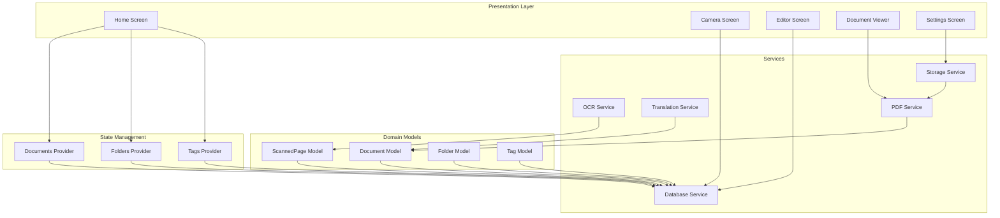
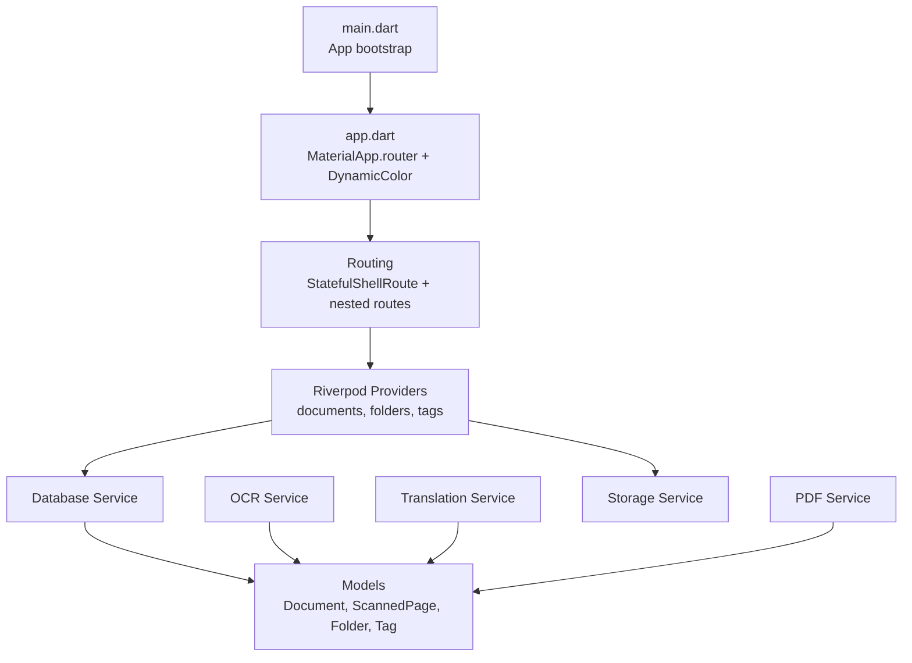
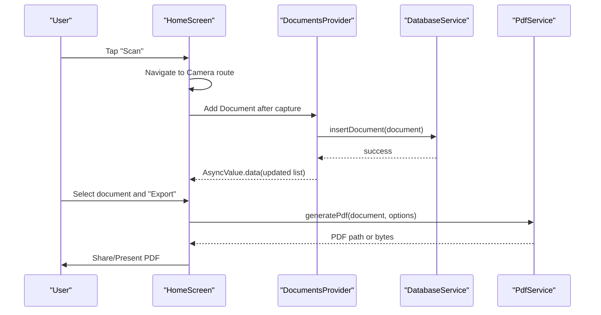
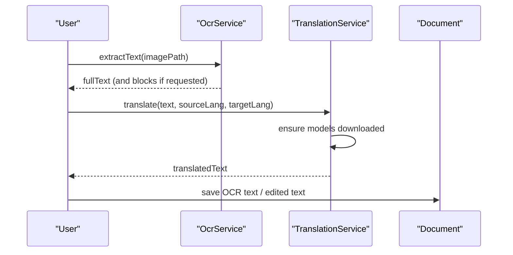
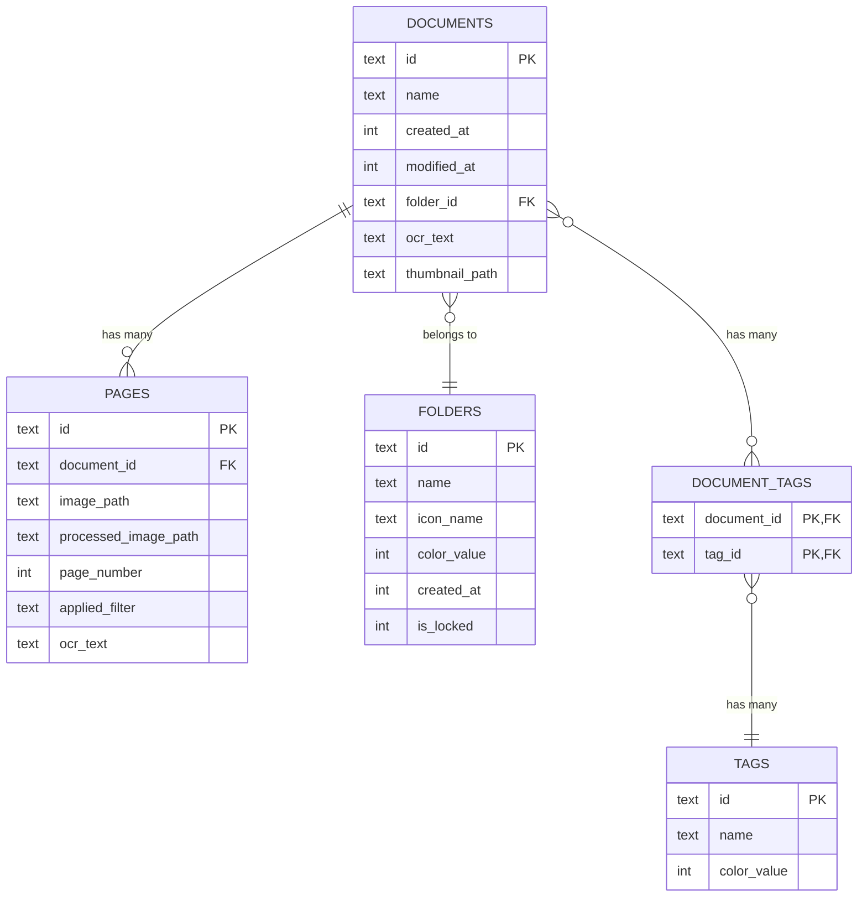
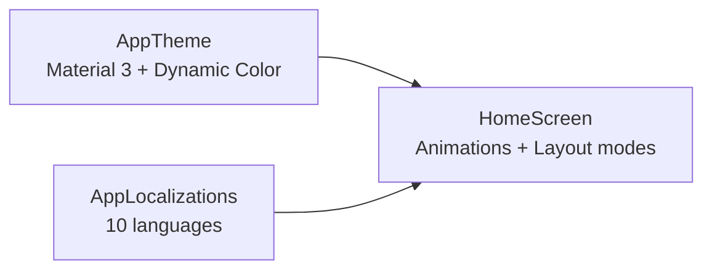
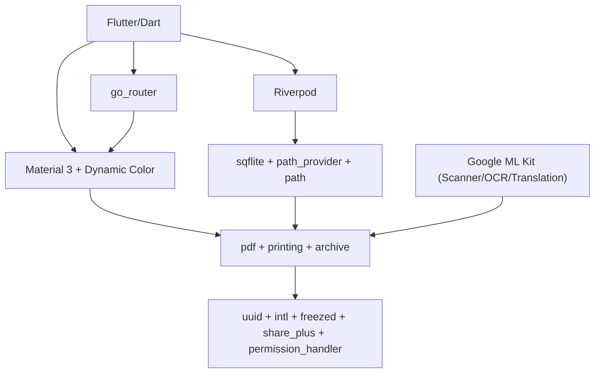

# Project Overview

<cite>
**Referenced Files in This Document**
- [README.md](file://README.md)
- [pubspec.yaml](file://pubspec.yaml)
- [lib/main.dart](file://lib/main.dart)
- [lib/app.dart](file://lib/app.dart)
- [lib/models/document.dart](file://lib/models/document.dart)
- [lib/models/folder.dart](file://lib/models/folder.dart)
- [lib/models/tag.dart](file://lib/models/tag.dart)
- [lib/services/ocr_service.dart](file://lib/services/ocr_service.dart)
- [lib/services/translation_service.dart](file://lib/services/translation_service.dart)
- [lib/services/database_service.dart](file://lib/services/database_service.dart)
- [lib/services/storage_service.dart](file://lib/services/storage_service.dart)
- [lib/services/pdf_service.dart](file://lib/services/pdf_service.dart)
- [lib/providers/document_provider.dart](file://lib/providers/document_provider.dart)
- [lib/screens/home/home_screen.dart](file://lib/screens/home/home_screen.dart)
- [lib/theme/app_theme.dart](file://lib/theme/app_theme.dart)
- [lib/l10n/app_localizations.dart](file://lib/l10n/app_localizations.dart)
- [lib/utils/folder_icons.dart](file://lib/utils/folder_icons.dart)
</cite>

## Table of Contents
1. [Introduction](#introduction)
2. [Project Structure](#project-structure)
3. [Core Components](#core-components)
4. [Architecture Overview](#architecture-overview)
5. [Detailed Component Analysis](#detailed-component-analysis)
6. [Dependency Analysis](#dependency-analysis)
7. [Performance Considerations](#performance-considerations)
8. [Troubleshooting Guide](#troubleshooting-guide)
9. [Conclusion](#conclusion)

## Introduction
ScanVault is a mobile-first document scanning application built with Flutter that transforms physical documents into searchable, secure, and shareable digital assets. Its core value proposition lies in turning paper-based workflows into efficient, cloud-ready processes through integrated OCR, translation, and robust document management. The app targets professionals, students, and organizations seeking a unified solution for capturing, organizing, editing, translating, and exporting scanned documents.

Key differentiators:
- Intelligent OCR with multi-language support and structured text extraction
- On-device translation with language model management
- Rich document lifecycle management with tagging, folders, and smart naming
- Security features including locked folders and encryption
- Multi-format export (PDF, DOCX, images) with selective page control
- Mobile-first UI with Material 3 design, responsive layouts, and internationalization

Positioning in the document management ecosystem:
ScanVault sits between traditional scanners and enterprise DMS platforms, offering a consumer-grade yet professional-grade solution for personal and small-team use. It bridges the gap between raw scanning and actionable, searchable knowledge by combining OCR, translation, and intelligent organization.

## Project Structure
The project follows a feature-based, layered structure:
- Core domain models and enums define documents, pages, folders, and tags
- Services encapsulate platform integrations (OCR, translation, storage, PDF generation)
- Providers manage reactive state with Riverpod
- Screens implement UI flows for scanning, editing, viewing, and settings
- Themes and localization provide consistent UX and global reach
- Platform-specific configurations live under android/, ios/, and web/

**Diagram sources**
- [lib/screens/home/home_screen.dart](file://lib/screens/home/home_screen.dart#L1-L651)
- [lib/providers/document_provider.dart](file://lib/providers/document_provider.dart#L1-L137)
- [lib/models/document.dart](file://lib/models/document.dart#L1-L49)
- [lib/models/folder.dart](file://lib/models/folder.dart#L1-L21)
- [lib/models/tag.dart](file://lib/models/tag.dart#L1-L17)
- [lib/services/ocr_service.dart](file://lib/services/ocr_service.dart#L1-L93)
- [lib/services/translation_service.dart](file://lib/services/translation_service.dart#L1-L170)
- [lib/services/database_service.dart](file://lib/services/database_service.dart#L1-L413)
- [lib/services/storage_service.dart](file://lib/services/storage_service.dart#L1-L63)
- [lib/services/pdf_service.dart](file://lib/services/pdf_service.dart#L1-L187)

**Section sources**
- [README.md](file://README.md#L1-L249)
- [pubspec.yaml](file://pubspec.yaml#L1-L78)
- [lib/main.dart](file://lib/main.dart#L1-L32)
- [lib/app.dart](file://lib/app.dart#L1-L187)

## Core Components
- Document and Page models represent scanned content with metadata, page order, and OCR text
- Folder and Tag models enable hierarchical organization and labeling
- OCR Service integrates Google ML Kit for accurate text extraction and block-level results
- Translation Service manages on-device translation with model lifecycle and language support
- Database Service persists documents, pages, folders, and tags locally with indexing
- Storage Service centralizes file locations and custom storage preferences
- PDF Service generates high-quality PDFs with optional OCR text layers and selective page export
- Providers orchestrate reactive state for documents, folders, tags, and UI interactions
- Home Screen coordinates search, filtering, layout modes, and export workflows

**Section sources**
- [lib/models/document.dart](file://lib/models/document.dart#L1-L49)
- [lib/models/folder.dart](file://lib/models/folder.dart#L1-L21)
- [lib/models/tag.dart](file://lib/models/tag.dart#L1-L17)
- [lib/services/ocr_service.dart](file://lib/services/ocr_service.dart#L1-L93)
- [lib/services/translation_service.dart](file://lib/services/translation_service.dart#L1-L170)
- [lib/services/database_service.dart](file://lib/services/database_service.dart#L1-L413)
- [lib/services/storage_service.dart](file://lib/services/storage_service.dart#L1-L63)
- [lib/services/pdf_service.dart](file://lib/services/pdf_service.dart#L1-L187)
- [lib/providers/document_provider.dart](file://lib/providers/document_provider.dart#L1-L137)
- [lib/screens/home/home_screen.dart](file://lib/screens/home/home_screen.dart#L1-L651)

## Architecture Overview
ScanVault adopts a layered architecture:
- Presentation: Screens and widgets driven by Riverpod providers
- Domain: Immutable models and business entities
- Services: Platform integrations and cross-cutting concerns
- Persistence: Local SQLite via sqflite with indexed queries
- Routing: Declarative navigation with go_router and shell routes for persistent bottom navigation

**Diagram sources**
- [lib/main.dart](file://lib/main.dart#L1-L32)
- [lib/app.dart](file://lib/app.dart#L1-L187)
- [lib/providers/document_provider.dart](file://lib/providers/document_provider.dart#L1-L137)
- [lib/models/document.dart](file://lib/models/document.dart#L1-L49)
- [lib/services/ocr_service.dart](file://lib/services/ocr_service.dart#L1-L93)
- [lib/services/translation_service.dart](file://lib/services/translation_service.dart#L1-L170)
- [lib/services/database_service.dart](file://lib/services/database_service.dart#L1-L413)
- [lib/services/storage_service.dart](file://lib/services/storage_service.dart#L1-L63)
- [lib/services/pdf_service.dart](file://lib/services/pdf_service.dart#L1-L187)

## Detailed Component Analysis

### Document Lifecycle and Management
The document lifecycle spans capture, enhancement, OCR, organization, and export. The Home Screen aggregates documents, applies filters, and exposes actions for export and movement. Providers load and mutate data against the Database Service, while the PDF Service generates shareable artifacts.

**Diagram sources**
- [lib/screens/home/home_screen.dart](file://lib/screens/home/home_screen.dart#L1-L651)
- [lib/providers/document_provider.dart](file://lib/providers/document_provider.dart#L1-L137)
- [lib/services/database_service.dart](file://lib/services/database_service.dart#L1-L413)
- [lib/services/pdf_service.dart](file://lib/services/pdf_service.dart#L1-L187)

**Section sources**
- [lib/screens/home/home_screen.dart](file://lib/screens/home/home_screen.dart#L1-L651)
- [lib/providers/document_provider.dart](file://lib/providers/document_provider.dart#L1-L137)
- [lib/services/database_service.dart](file://lib/services/database_service.dart#L1-L413)
- [lib/services/pdf_service.dart](file://lib/services/pdf_service.dart#L1-L187)

### OCR and Translation Workflows
OCR extracts text from single or multiple pages, optionally preserving block-level structure. Translation leverages on-device models with automatic download and language-aware translator instances.

**Diagram sources**
- [lib/services/ocr_service.dart](file://lib/services/ocr_service.dart#L1-L93)
- [lib/services/translation_service.dart](file://lib/services/translation_service.dart#L1-L170)
- [lib/models/document.dart](file://lib/models/document.dart#L1-L49)

**Section sources**
- [lib/services/ocr_service.dart](file://lib/services/ocr_service.dart#L1-L93)
- [lib/services/translation_service.dart](file://lib/services/translation_service.dart#L1-L170)
- [lib/models/document.dart](file://lib/models/document.dart#L1-L49)

### Data Models and Relationships
The data model centers around Documents composed of multiple ScannedPages, organized into Folders, and tagged with Tags. Relationships are enforced via foreign keys and junction tables.

**Diagram sources**
- [lib/services/database_service.dart](file://lib/services/database_service.dart#L32-L97)
- [lib/models/document.dart](file://lib/models/document.dart#L15-L49)
- [lib/models/folder.dart](file://lib/models/folder.dart#L6-L21)
- [lib/models/tag.dart](file://lib/models/tag.dart#L6-L17)

**Section sources**
- [lib/services/database_service.dart](file://lib/services/database_service.dart#L1-L413)
- [lib/models/document.dart](file://lib/models/document.dart#L1-L49)
- [lib/models/folder.dart](file://lib/models/folder.dart#L1-L21)
- [lib/models/tag.dart](file://lib/models/tag.dart#L1-L17)

### UI, Theming, and Internationalization
The app uses Material 3 with dynamic color adaptation, smooth animations, and a glass-like navigation bar. Localization supports ten languages with ARB-backed resources and runtime language switching.

**Diagram sources**
- [lib/theme/app_theme.dart](file://lib/theme/app_theme.dart#L1-L252)
- [lib/l10n/app_localizations.dart](file://lib/l10n/app_localizations.dart#L104-L115)
- [lib/screens/home/home_screen.dart](file://lib/screens/home/home_screen.dart#L1-L651)

**Section sources**
- [lib/theme/app_theme.dart](file://lib/theme/app_theme.dart#L1-L252)
- [lib/l10n/app_localizations.dart](file://lib/l10n/app_localizations.dart#L1-L800)
- [lib/screens/home/home_screen.dart](file://lib/screens/home/home_screen.dart#L1-L651)

## Dependency Analysis
Technology stack highlights:
- Core: Flutter, Dart, Riverpod
- UI: Material 3, Dynamic Color, go_router
- Scanning/ML: google_mlkit_document_scanner, google_mlkit_text_recognition, google_mlkit_translation
- Storage: sqflite, path_provider, path
- Export: pdf, printing, archive
- Utilities: uuid, intl, freezed/json_serializable, share_plus, permission_handler

**Diagram sources**
- [pubspec.yaml](file://pubspec.yaml#L9-L78)
- [lib/app.dart](file://lib/app.dart#L1-L187)
- [lib/services/ocr_service.dart](file://lib/services/ocr_service.dart#L1-L93)
- [lib/services/translation_service.dart](file://lib/services/translation_service.dart#L1-L170)
- [lib/services/pdf_service.dart](file://lib/services/pdf_service.dart#L1-L187)
- [lib/services/database_service.dart](file://lib/services/database_service.dart#L1-L413)

**Section sources**
- [pubspec.yaml](file://pubspec.yaml#L1-L78)
- [lib/app.dart](file://lib/app.dart#L1-L187)

## Performance Considerations
- Use selective page export to reduce PDF size and processing time
- Prefer processed images when available to minimize rendering overhead
- Cache frequently accessed lists and avoid unnecessary rebuilds by leveraging Riverpod selectors
- Compress images judiciously to balance quality and storage footprint
- Batch operations (e.g., batch scanning) improve throughput for multi-page workflows

## Troubleshooting Guide
Common issues and resolutions:
- Camera permission denied: Prompt users to grant camera access; scanning features require camera permission
- Storage permission denied: Essential for saving documents; request storage permission on first launch
- OCR failures: Ensure network availability for ML Kit features; handle exceptions gracefully and retry if appropriate
- Translation model downloads: Verify sufficient storage and network connectivity; handle model download errors
- Locked folder access: Confirm biometric hardware availability and OS enrollment; fallback to non-secured workflows

**Section sources**
- [README.md](file://README.md#L184-L241)
- [lib/services/ocr_service.dart](file://lib/services/ocr_service.dart#L1-L93)
- [lib/services/translation_service.dart](file://lib/services/translation_service.dart#L1-L170)

## Conclusion
ScanVault delivers a cohesive mobile document management experience by combining powerful OCR and translation capabilities with intuitive organization and export workflows. Its mobile-first design, cross-platform Flutter foundation, and modular architecture position it as a practical solution for individuals and teams needing a reliable, privacy-conscious scanning companion. By emphasizing searchability, multilingual support, and secure storage, ScanVault fills a meaningful niche in the document management ecosystem.