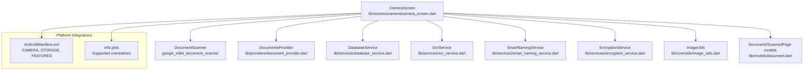
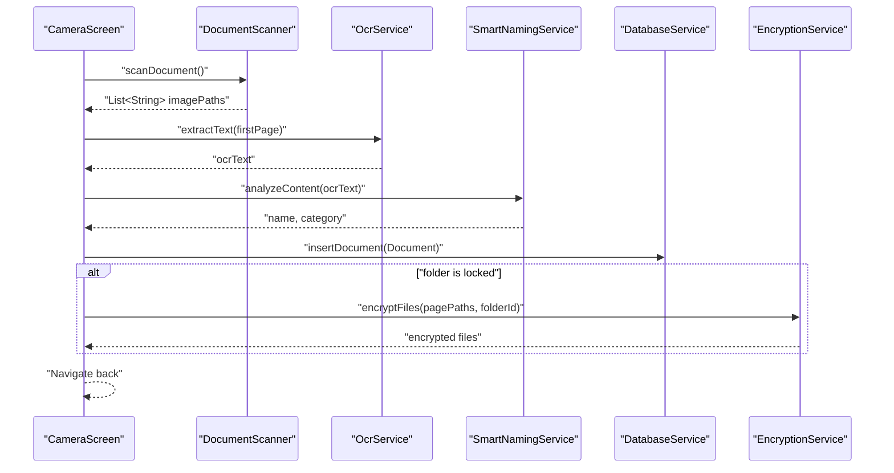
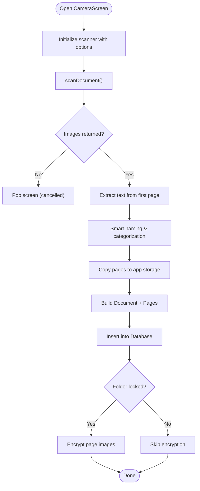
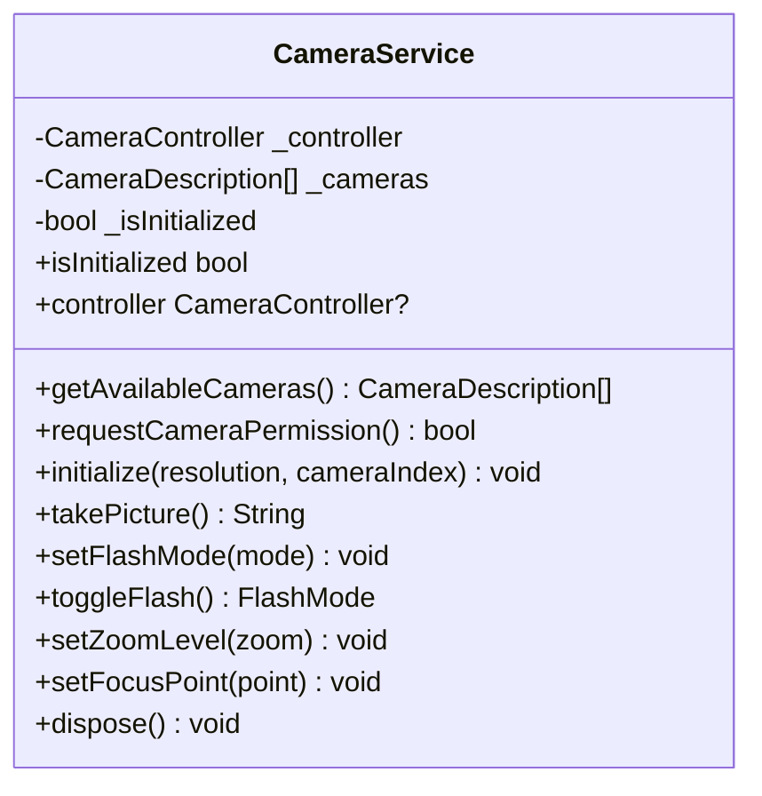
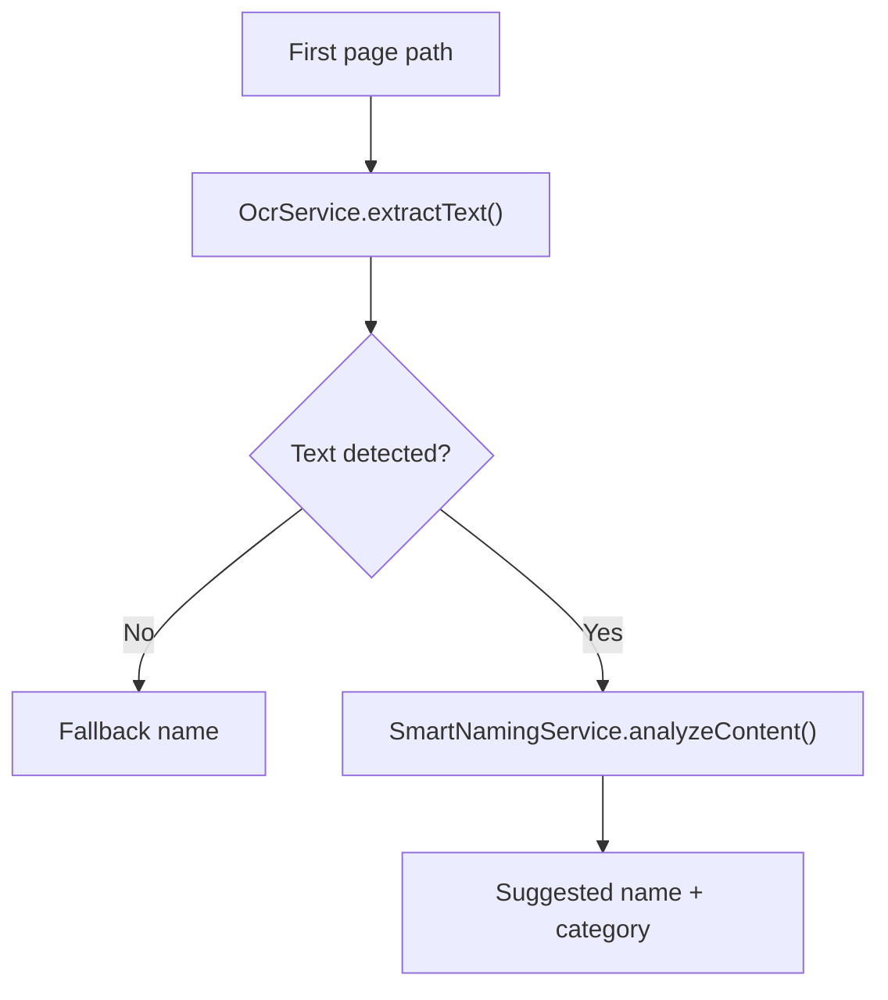
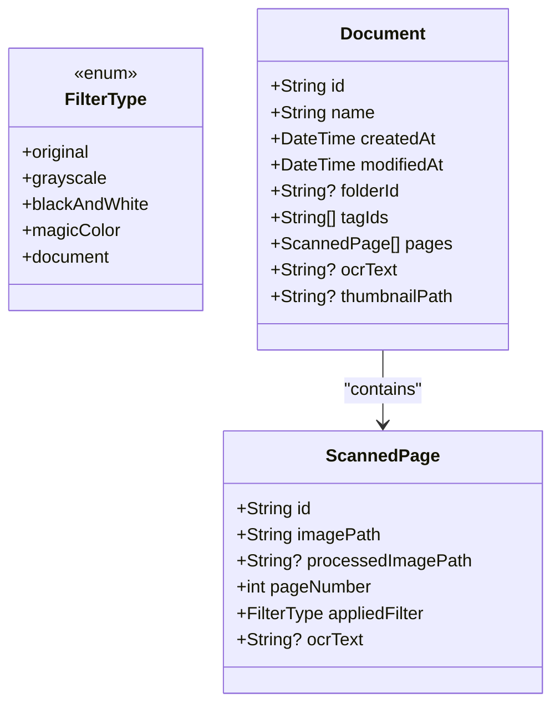
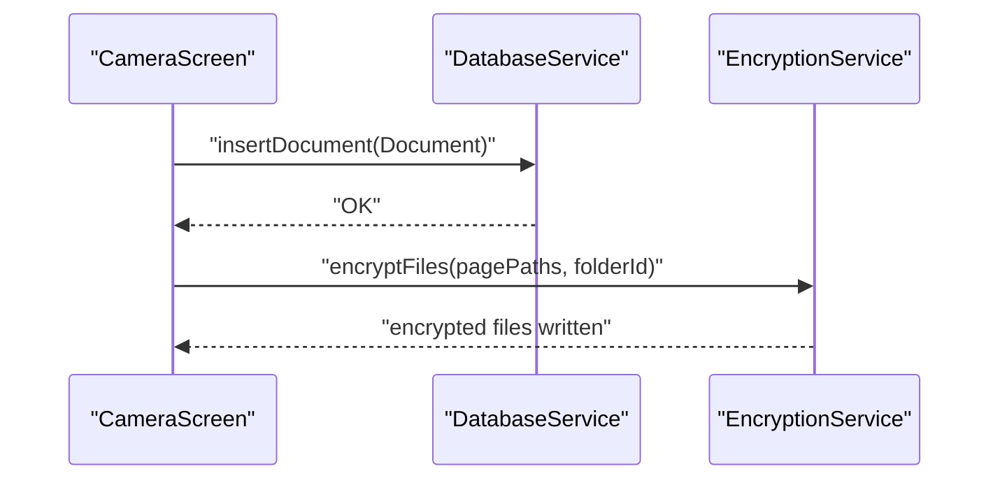
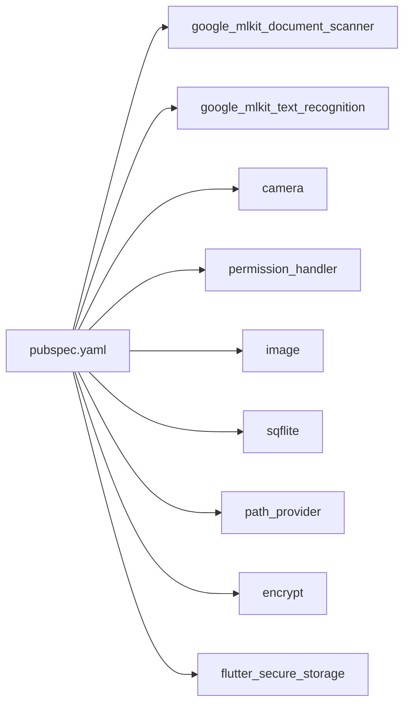

# Camera Screen

<cite>
**Referenced Files in This Document**
- [camera_screen.dart](file://lib/screens/camera/camera_screen.dart)
- [camera_service.dart](file://lib/services/camera_service.dart)
- [document.dart](file://lib/models/document.dart)
- [image_utils.dart](file://lib/core/utils/image_utils.dart)
- [ocr_service.dart](file://lib/services/ocr_service.dart)
- [smart_naming_service.dart](file://lib/services/smart_naming_service.dart)
- [database_service.dart](file://lib/services/database_service.dart)
- [encryption_service.dart](file://lib/services/encryption_service.dart)
- [app_exceptions.dart](file://lib/core/exceptions/app_exceptions.dart)
- [document_provider.dart](file://lib/providers/document_provider.dart)
- [pubspec.yaml](file://pubspec.yaml)
- [AndroidManifest.xml](file://android/app/src/main/AndroidManifest.xml)
- [Info.plist](file://ios/Runner/Info.plist)
</cite>

## Table of Contents
1. [Introduction](#introduction)
2. [Project Structure](#project-structure)
3. [Core Components](#core-components)
4. [Architecture Overview](#architecture-overview)
5. [Detailed Component Analysis](#detailed-component-analysis)
6. [Dependency Analysis](#dependency-analysis)
7. [Performance Considerations](#performance-considerations)
8. [Troubleshooting Guide](#troubleshooting-guide)
9. [Conclusion](#conclusion)
10. [Appendices](#appendices)

## Introduction
This document explains the Camera Screen component responsible for document capture. It covers camera integration via a high-level document scanner, image preview behavior, auto-focus and flash control, document detection and cropping, batch scanning and multi-page capture, OCR-driven smart naming and categorization, image enhancement filters, and end-to-end saving to local storage with optional encryption. It also documents camera permissions, device compatibility, platform-specific camera APIs, performance optimization, memory management, error handling, and guidance for customizing camera controls and integrating external camera libraries.

## Project Structure
The Camera Screen is implemented as a dedicated screen that launches a document scanner, processes captured images, and persists them into the app’s document model. Supporting services handle camera operations, OCR, smart naming, database persistence, and encryption.

**Diagram sources**
- [camera_screen.dart](file://lib/screens/camera/camera_screen.dart#L1-L242)
- [document_provider.dart](file://lib/providers/document_provider.dart#L1-L137)
- [database_service.dart](file://lib/services/database_service.dart#L1-L413)
- [ocr_service.dart](file://lib/services/ocr_service.dart#L1-L93)
- [smart_naming_service.dart](file://lib/services/smart_naming_service.dart#L1-L104)
- [encryption_service.dart](file://lib/services/encryption_service.dart#L1-L150)
- [image_utils.dart](file://lib/core/utils/image_utils.dart#L1-L62)
- [document.dart](file://lib/models/document.dart#L1-L49)
- [AndroidManifest.xml](file://android/app/src/main/AndroidManifest.xml#L1-L58)
- [Info.plist](file://ios/Runner/Info.plist#L1-L50)

**Section sources**
- [camera_screen.dart](file://lib/screens/camera/camera_screen.dart#L1-L242)
- [pubspec.yaml](file://pubspec.yaml#L1-L78)

## Core Components
- CameraScreen: Orchestrates document scanning, saves results, and integrates OCR and smart naming.
- CameraService: Low-level camera operations (permissions, initialization, capture, flash, focus, zoom).
- OcrService: Extracts text from images for smart naming and metadata.
- SmartNamingService: Suggests document names and categories based on OCR content and dates.
- DatabaseService: Manages local persistence of documents, pages, folders, and tags.
- EncryptionService: Encrypts files stored under locked folders.
- ImageUtils: Utility functions for resizing, rotating, and thumbnail generation.
- Document/ScannedPage models: Typed data structures representing documents and pages.

**Section sources**
- [camera_screen.dart](file://lib/screens/camera/camera_screen.dart#L1-L242)
- [camera_service.dart](file://lib/services/camera_service.dart#L1-L140)
- [ocr_service.dart](file://lib/services/ocr_service.dart#L1-L93)
- [smart_naming_service.dart](file://lib/services/smart_naming_service.dart#L1-L104)
- [database_service.dart](file://lib/services/database_service.dart#L1-L413)
- [encryption_service.dart](file://lib/services/encryption_service.dart#L1-L150)
- [image_utils.dart](file://lib/core/utils/image_utils.dart#L1-L62)
- [document.dart](file://lib/models/document.dart#L1-L49)

## Architecture Overview
The Camera Screen delegates to a high-level document scanner for detection and cropping, then performs OCR and smart naming to enrich metadata. Images are copied into app storage, thumbnails are generated, and the document is persisted. If the target folder is locked, pages are encrypted after saving.

**Diagram sources**
- [camera_screen.dart](file://lib/screens/camera/camera_screen.dart#L45-L216)
- [ocr_service.dart](file://lib/services/ocr_service.dart#L9-L18)
- [smart_naming_service.dart](file://lib/services/smart_naming_service.dart#L8-L43)
- [database_service.dart](file://lib/services/database_service.dart#L120-L144)
- [encryption_service.dart](file://lib/services/encryption_service.dart#L122-L127)

## Detailed Component Analysis

### CameraScreen: Document Capture and Batch Scanning
- Launches the document scanner with configurable batch mode and page limits.
- Processes captured images, copies them to app storage, builds Document and ScannedPage entries, and persists them.
- Integrates OCR on the first page to derive initial metadata and smart naming.
- Applies encryption for locked folders post-save.
- Provides localized feedback and handles cancellation gracefully.

**Diagram sources**
- [camera_screen.dart](file://lib/screens/camera/camera_screen.dart#L45-L216)
- [ocr_service.dart](file://lib/services/ocr_service.dart#L9-L18)
- [smart_naming_service.dart](file://lib/services/smart_naming_service.dart#L8-L43)
- [database_service.dart](file://lib/services/database_service.dart#L120-L144)
- [encryption_service.dart](file://lib/services/encryption_service.dart#L122-L127)

**Section sources**
- [camera_screen.dart](file://lib/screens/camera/camera_screen.dart#L20-L242)

### CameraService: Permissions, Controls, and Platform APIs
- Requests camera permission and checks availability.
- Initializes a CameraController with JPEG output and disables audio.
- Supports flash toggling and torch mode, zoom level setting, and auto focus via touch point.
- Disposes the controller cleanly and tracks initialization state.

**Diagram sources**
- [camera_service.dart](file://lib/services/camera_service.dart#L10-L140)

**Section sources**
- [camera_service.dart](file://lib/services/camera_service.dart#L1-L140)

### OCR and Smart Naming
- OcrService extracts text from images and supports structured block extraction and multi-image concatenation.
- SmartNamingService detects document categories (financial, legal, medical, personal) and attempts to extract dates to refine names.

**Diagram sources**
- [ocr_service.dart](file://lib/services/ocr_service.dart#L9-L62)
- [smart_naming_service.dart](file://lib/services/smart_naming_service.dart#L8-L95)

**Section sources**
- [ocr_service.dart](file://lib/services/ocr_service.dart#L1-L93)
- [smart_naming_service.dart](file://lib/services/smart_naming_service.dart#L1-L104)

### Image Enhancement and Storage
- ImageUtils provides resize, rotate, and thumbnail generation with quality control.
- CameraScreen copies captured images into app storage and sets the first page as thumbnail.
- FilterType enum defines supported enhancements for pages.

**Diagram sources**
- [document.dart](file://lib/models/document.dart#L6-L49)

**Section sources**
- [image_utils.dart](file://lib/core/utils/image_utils.dart#L1-L62)
- [document.dart](file://lib/models/document.dart#L1-L49)

### Persistence and Encryption
- DatabaseService manages SQLite tables for documents, pages, folders, and tags, with indexes and migrations.
- EncryptionService stores per-folder keys securely and encrypts/decrypts files by prepending IV and renaming appropriately.

**Diagram sources**
- [database_service.dart](file://lib/services/database_service.dart#L120-L144)
- [encryption_service.dart](file://lib/services/encryption_service.dart#L38-L77)

**Section sources**
- [database_service.dart](file://lib/services/database_service.dart#L1-L413)
- [encryption_service.dart](file://lib/services/encryption_service.dart#L1-L150)

## Dependency Analysis
External dependencies relevant to camera and scanning:
- google_mlkit_document_scanner: High-level document detection and cropping.
- google_mlkit_text_recognition: OCR for smart naming.
- camera: Low-level camera control (used by CameraService).
- permission_handler: Runtime permission requests.
- image: Image manipulation utilities.
- sqflite/path_provider: Local storage and database.
- encrypt/flutter_secure_storage: Encryption and secure key storage.

**Diagram sources**
- [pubspec.yaml](file://pubspec.yaml#L21-L64)

**Section sources**
- [pubspec.yaml](file://pubspec.yaml#L1-L78)

## Performance Considerations
- Image processing:
  - Prefer resizing to a maximum dimension and moderate JPEG quality to balance fidelity and storage.
  - Generate thumbnails on-demand and cache them to reduce repeated work.
- Memory management:
  - Avoid holding large image buffers in memory; stream to disk when copying and processing.
  - Dispose camera controller and close OCR resources when done.
- Batch scanning:
  - Limit pageLimit to reasonable values to avoid excessive memory usage.
  - Process pages incrementally and avoid loading all images simultaneously.
- Encryption:
  - Perform encryption after persistence to minimize I/O contention; handle failures gracefully without blocking save.

[No sources needed since this section provides general guidance]

## Troubleshooting Guide
Common issues and handling:
- Camera permission denied:
  - CameraService throws a specific exception; surface a user-friendly message and guide to app settings.
- No cameras available:
  - Initialization failure; inform the user and retry after checking device camera availability.
- Camera not initialized:
  - Attempting to capture before initialization; ensure initialize() completes successfully.
- OCR failures:
  - OcrService wraps errors; log and continue without OCR-derived metadata.
- Encryption failures:
  - EncryptionService logs and rethrows; document remains saved but pages may remain unencrypted.
- Saving errors:
  - CameraScreen catches and displays localized messages; ensures UI state is reset.

**Section sources**
- [camera_service.dart](file://lib/services/camera_service.dart#L38-L71)
- [app_exceptions.dart](file://lib/core/exceptions/app_exceptions.dart#L15-L37)
- [ocr_service.dart](file://lib/services/ocr_service.dart#L15-L17)
- [encryption_service.dart](file://lib/services/encryption_service.dart#L73-L77)
- [camera_screen.dart](file://lib/screens/camera/camera_screen.dart#L65-L74)

## Conclusion
The Camera Screen integrates a high-level document scanner with OCR, smart naming, and robust persistence. It supports batch scanning, image enhancement, and encryption for secure storage. The design separates concerns across services and models, enabling maintainability and extensibility. Following the recommendations herein will help ensure reliable performance and a smooth user experience across devices.

[No sources needed since this section summarizes without analyzing specific files]

## Appendices

### Platform-Specific Camera APIs and Compatibility
- Android:
  - Declares CAMERA, READ_MEDIA_IMAGES, WRITE_EXTERNAL_STORAGE (up to SDK 29), and INTERNET permissions.
  - Requires camera hardware feature; autofocus is optional.
- iOS:
  - Supports portrait and landscape orientations on iPhone and iPad.
  - Uses standard Flutter embedding and does not declare explicit camera permissions in Info.plist; permissions are requested at runtime.

**Section sources**
- [AndroidManifest.xml](file://android/app/src/main/AndroidManifest.xml#L1-L58)
- [Info.plist](file://ios/Runner/Info.plist#L31-L43)

### Customizing Camera Controls and Integrating External Libraries
- To customize camera controls (flash, focus, zoom):
  - Use CameraService methods for flash toggling, zoom level, and focus point.
  - For advanced UI overlays and manual capture, integrate the camera package’s CameraController directly in a custom camera view.
- To integrate alternative camera libraries:
  - Replace CameraService with a new implementation that adheres to the same interface (initialize, takePicture, setFlashMode, setZoomLevel, setFocusPoint, dispose).
  - Ensure permission handling and error wrapping align with app exceptions.

**Section sources**
- [camera_service.dart](file://lib/services/camera_service.dart#L34-L139)
- [app_exceptions.dart](file://lib/core/exceptions/app_exceptions.dart#L15-L37)