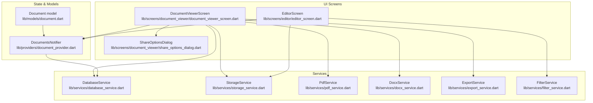
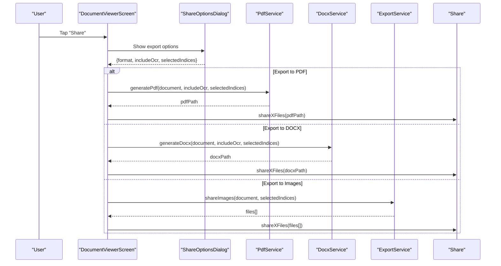
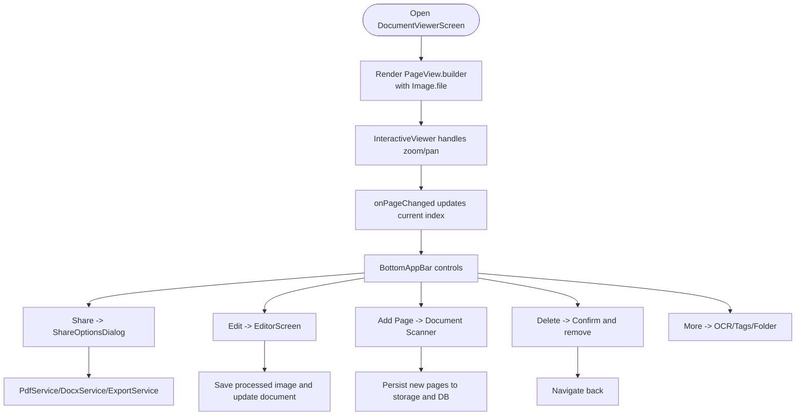
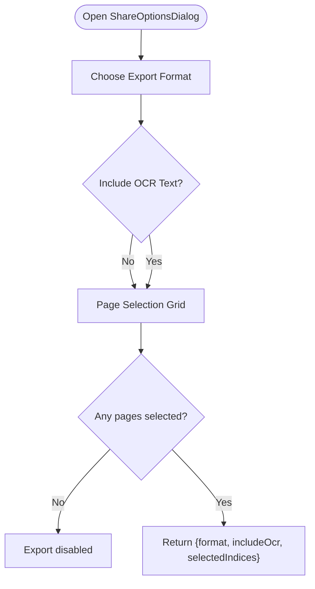
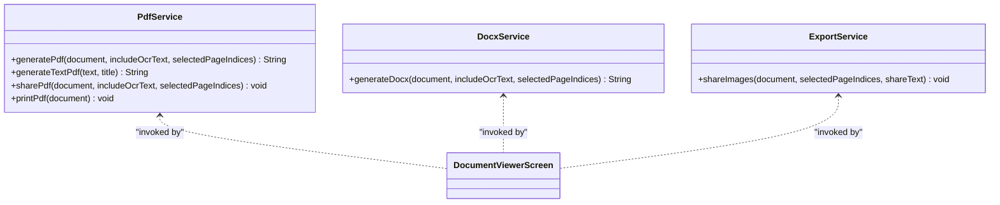
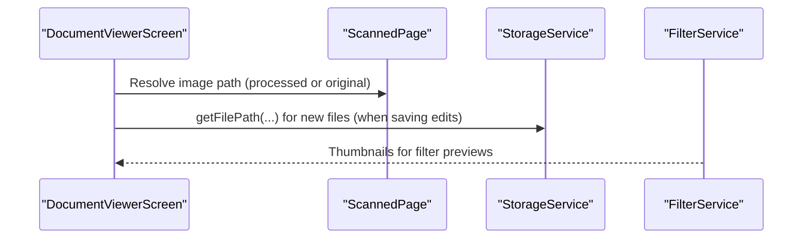
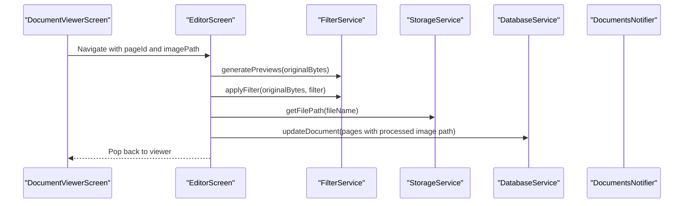
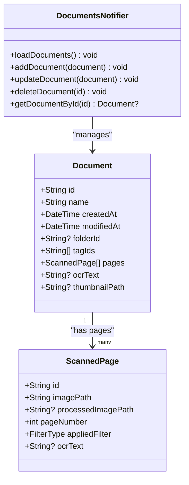
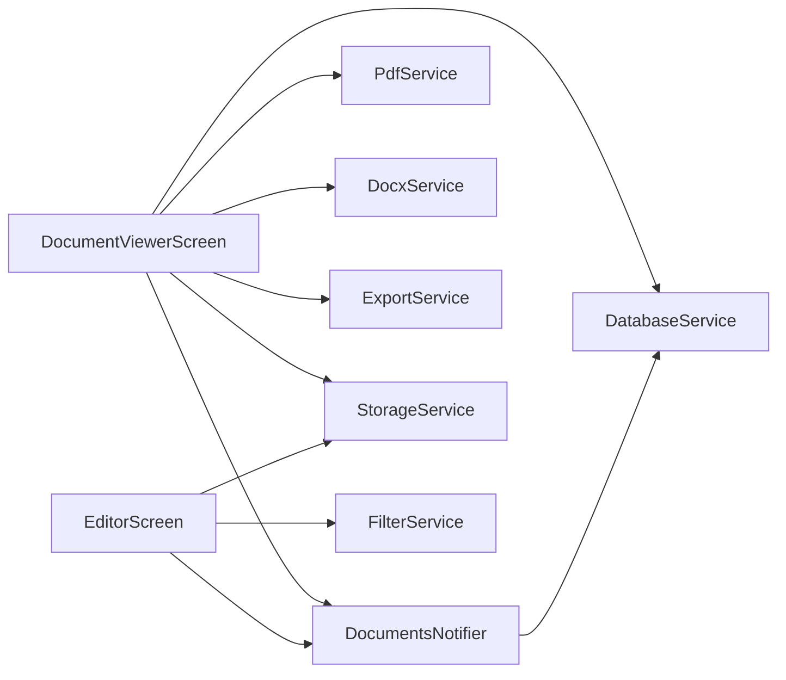

# Document Viewer

<cite>
**Referenced Files in This Document**
- [document_viewer_screen.dart](file://lib/screens/document_viewer/document_viewer_screen.dart)
- [share_options_dialog.dart](file://lib/screens/document_viewer/share_options_dialog.dart)
- [document.dart](file://lib/models/document.dart)
- [pdf_service.dart](file://lib/services/pdf_service.dart)
- [docx_service.dart](file://lib/services/docx_service.dart)
- [export_service.dart](file://lib/services/export_service.dart)
- [storage_service.dart](file://lib/services/storage_service.dart)
- [filter_service.dart](file://lib/services/filter_service.dart)
- [editor_screen.dart](file://lib/screens/editor/editor_screen.dart)
- [database_service.dart](file://lib/services/database_service.dart)
- [document_provider.dart](file://lib/providers/document_provider.dart)
- [app.dart](file://lib/app.dart)
- [main.dart](file://lib/main.dart)
- [README.md](file://README.md)
</cite>

## Table of Contents
1. [Introduction](#introduction)
2. [Project Structure](#project-structure)
3. [Core Components](#core-components)
4. [Architecture Overview](#architecture-overview)
5. [Detailed Component Analysis](#detailed-component-analysis)
6. [Dependency Analysis](#dependency-analysis)
7. [Performance Considerations](#performance-considerations)
8. [Troubleshooting Guide](#troubleshooting-guide)
9. [Conclusion](#conclusion)
10. [Appendices](#appendices)

## Introduction
This document explains the Document Viewer component responsible for displaying multi-page scanned documents, enabling navigation across pages, and integrating with editing, sharing, export, and storage systems. It covers:
- Page rendering and navigation via PageView and InteractiveViewer
- Zoom and pan behavior using InteractiveViewer
- Multi-page navigation controls and page indicator
- Document sharing options and export to PDF, DOCX, and images
- Integration with document storage and thumbnail generation
- Performance and memory considerations for large documents
- Accessibility and responsive layout handling
- Guidance on customizing viewer controls and extending format support

## Project Structure
The Document Viewer lives under the screens/document_viewer module and collaborates with services for storage, export, and OCR, and with Riverpod for state management.

**Diagram sources**
- [document_viewer_screen.dart](file://lib/screens/document_viewer/document_viewer_screen.dart#L325-L477)
- [share_options_dialog.dart](file://lib/screens/document_viewer/share_options_dialog.dart#L41-L196)
- [editor_screen.dart](file://lib/screens/editor/editor_screen.dart#L16-L281)
- [pdf_service.dart](file://lib/services/pdf_service.dart#L12-L187)
- [docx_service.dart](file://lib/services/docx_service.dart#L11-L347)
- [export_service.dart](file://lib/services/export_service.dart#L6-L42)
- [storage_service.dart](file://lib/services/storage_service.dart#L12-L63)
- [filter_service.dart](file://lib/services/filter_service.dart#L7-L106)
- [database_service.dart](file://lib/services/database_service.dart#L11-L413)
- [document_provider.dart](file://lib/providers/document_provider.dart#L9-L137)
- [document.dart](file://lib/models/document.dart#L16-L49)

**Section sources**
- [document_viewer_screen.dart](file://lib/screens/document_viewer/document_viewer_screen.dart#L1-L477)
- [app.dart](file://lib/app.dart#L67-L187)
- [main.dart](file://lib/main.dart#L10-L32)

## Core Components
- DocumentViewerScreen: Hosts the PageView for page navigation, displays current page with InteractiveViewer for zoom/pan, and provides bottom controls for share, edit, add page, delete, and more options.
- ShareOptionsDialog: Presents export format selection (PDF, DOCX, Images), OCR inclusion toggle, and per-page selection grid.
- Services:
  - PdfService: Generates PDFs from document pages and optional OCR text.
  - DocxService: Builds DOCX with embedded images and optional OCR text.
  - ExportService: Shares multiple images natively.
  - StorageService: Manages persistent storage paths and file locations.
  - FilterService: Applies image filters and generates thumbnails for the editor.
- State and Models:
  - DocumentsNotifier: Loads, updates, and manages documents and pages.
  - Document model: Defines Document and ScannedPage structures including page metadata and OCR text.

**Section sources**
- [document_viewer_screen.dart](file://lib/screens/document_viewer/document_viewer_screen.dart#L24-L477)
- [share_options_dialog.dart](file://lib/screens/document_viewer/share_options_dialog.dart#L7-L197)
- [pdf_service.dart](file://lib/services/pdf_service.dart#L12-L187)
- [docx_service.dart](file://lib/services/docx_service.dart#L11-L347)
- [export_service.dart](file://lib/services/export_service.dart#L6-L42)
- [storage_service.dart](file://lib/services/storage_service.dart#L12-L63)
- [filter_service.dart](file://lib/services/filter_service.dart#L7-L106)
- [document_provider.dart](file://lib/providers/document_provider.dart#L9-L137)
- [document.dart](file://lib/models/document.dart#L16-L49)

## Architecture Overview
The viewer composes a PageView with per-page Image rendering inside InteractiveViewer. Bottom controls trigger actions:
- Share opens ShareOptionsDialog and delegates to PdfService/DocxService/ExportService.
- Edit navigates to EditorScreen for filters and saving processed images.
- Add Page uses Google ML Kit Document Scanner to append new pages.
- Delete removes the document and navigates back.
- More Options exposes OCR, tags, and folder movement.

**Diagram sources**
- [document_viewer_screen.dart](file://lib/screens/document_viewer/document_viewer_screen.dart#L147-L200)
- [share_options_dialog.dart](file://lib/screens/document_viewer/share_options_dialog.dart#L171-L195)
- [pdf_service.dart](file://lib/services/pdf_service.dart#L16-L96)
- [docx_service.dart](file://lib/services/docx_service.dart#L20-L134)
- [export_service.dart](file://lib/services/export_service.dart#L10-L41)

## Detailed Component Analysis

### DocumentViewerScreen: Page Rendering, Navigation, and Controls
- Page rendering:
  - Uses PageView.builder with a PageController to render pages.
  - Each page renders an Image.file with BoxFit.contain.
  - First page is wrapped in Hero for thumbnail transitions.
- Zoom and pan:
  - InteractiveViewer wraps the page image to enable pinch-to-zoom and pan gestures.
- Navigation:
  - onPageChanged updates the current page index.
  - BottomAppBar provides share, edit, add page, delete, and more options.
- Actions:
  - Share: Opens ShareOptionsDialog and executes export via services.
  - Edit: Navigates to EditorScreen for filters.
  - Add Page: Invokes Google ML Kit Document Scanner and persists new pages.
  - Delete: Confirms and deletes the document.
  - More Options: OCR, tags, move to folder.

**Diagram sources**
- [document_viewer_screen.dart](file://lib/screens/document_viewer/document_viewer_screen.dart#L325-L477)
- [editor_screen.dart](file://lib/screens/editor/editor_screen.dart#L113-L185)
- [pdf_service.dart](file://lib/services/pdf_service.dart#L16-L96)
- [docx_service.dart](file://lib/services/docx_service.dart#L20-L134)
- [export_service.dart](file://lib/services/export_service.dart#L10-L41)

**Section sources**
- [document_viewer_screen.dart](file://lib/screens/document_viewer/document_viewer_screen.dart#L36-L477)

### ShareOptionsDialog: Export Options and Page Selection
- Allows selecting export format: PDF, DOCX, Images.
- Toggles whether to include OCR text (disabled for images).
- Grid-based page selection with select-all/deselect-all.
- Validates that at least one page is selected before exporting.

**Diagram sources**
- [share_options_dialog.dart](file://lib/screens/document_viewer/share_options_dialog.dart#L41-L196)

**Section sources**
- [share_options_dialog.dart](file://lib/screens/document_viewer/share_options_dialog.dart#L7-L197)

### Export Services: PDF, DOCX, and Images
- PdfService:
  - Iterates selected pages, reads image bytes, embeds into PDF, optionally adds OCR text page.
  - Saves to a dedicated exports directory and returns path.
- DocxService:
  - Builds a DOCX archive with embedded images and optional OCR text per page.
  - Adds required XML parts and relationships.
- ExportService:
  - Shares multiple images via Share.shareXFiles.

**Diagram sources**
- [pdf_service.dart](file://lib/services/pdf_service.dart#L12-L187)
- [docx_service.dart](file://lib/services/docx_service.dart#L11-L347)
- [export_service.dart](file://lib/services/export_service.dart#L6-L42)

**Section sources**
- [pdf_service.dart](file://lib/services/pdf_service.dart#L12-L187)
- [docx_service.dart](file://lib/services/docx_service.dart#L11-L347)
- [export_service.dart](file://lib/services/export_service.dart#L6-L42)

### Storage and Thumbnail Generation
- StorageService:
  - Provides configurable storage path and ensures directory exists.
  - Supplies getFilePath for new persisted files.
- Thumbnail generation:
  - FilterService generates thumbnails for filter previews in the editor.
  - DocumentViewer uses processed image path if present; otherwise falls back to original.

**Diagram sources**
- [document_viewer_screen.dart](file://lib/screens/document_viewer/document_viewer_screen.dart#L352-L368)
- [storage_service.dart](file://lib/services/storage_service.dart#L54-L62)
- [filter_service.dart](file://lib/services/filter_service.dart#L70-L93)

**Section sources**
- [storage_service.dart](file://lib/services/storage_service.dart#L12-L63)
- [filter_service.dart](file://lib/services/filter_service.dart#L7-L106)
- [document.dart](file://lib/models/document.dart#L35-L49)

### Editor Integration: Filters and Saving Processed Images
- EditorScreen loads image bytes, generates filter thumbnails, applies filters asynchronously, and saves processed images to storage.
- Updates the document’s page with processed image path and applied filter, and refreshes the viewer.

**Diagram sources**
- [editor_screen.dart](file://lib/screens/editor/editor_screen.dart#L30-L185)
- [filter_service.dart](file://lib/services/filter_service.dart#L10-L27)
- [storage_service.dart](file://lib/services/storage_service.dart#L54-L62)
- [database_service.dart](file://lib/services/database_service.dart#L228-L247)
- [document_provider.dart](file://lib/providers/document_provider.dart#L36-L46)

**Section sources**
- [editor_screen.dart](file://lib/screens/editor/editor_screen.dart#L16-L281)
- [filter_service.dart](file://lib/services/filter_service.dart#L7-L106)
- [storage_service.dart](file://lib/services/storage_service.dart#L12-L63)
- [database_service.dart](file://lib/services/database_service.dart#L228-L247)
- [document_provider.dart](file://lib/providers/document_provider.dart#L36-L46)

### Document Model and State Management
- Document and ScannedPage define page metadata, filter application, and OCR text.
- DocumentsNotifier loads documents from DatabaseService and supports CRUD operations.

**Diagram sources**
- [document.dart](file://lib/models/document.dart#L16-L49)
- [document_provider.dart](file://lib/providers/document_provider.dart#L14-L54)
- [database_service.dart](file://lib/services/database_service.dart#L146-L194)

**Section sources**
- [document.dart](file://lib/models/document.dart#L16-L49)
- [document_provider.dart](file://lib/providers/document_provider.dart#L9-L137)
- [database_service.dart](file://lib/services/database_service.dart#L146-L194)

## Dependency Analysis
- UI depends on Riverpod for reactive document state.
- Viewer depends on services for export, storage, and OCR.
- Editor depends on FilterService and StorageService.
- DatabaseService persists documents and pages.

**Diagram sources**
- [document_viewer_screen.dart](file://lib/screens/document_viewer/document_viewer_screen.dart#L1-L22)
- [editor_screen.dart](file://lib/screens/editor/editor_screen.dart#L1-L14)
- [document_provider.dart](file://lib/providers/document_provider.dart#L1-L12)
- [database_service.dart](file://lib/services/database_service.dart#L1-L28)
- [storage_service.dart](file://lib/services/storage_service.dart#L1-L10)

**Section sources**
- [document_viewer_screen.dart](file://lib/screens/document_viewer/document_viewer_screen.dart#L1-L22)
- [editor_screen.dart](file://lib/screens/editor/editor_screen.dart#L1-L14)
- [document_provider.dart](file://lib/providers/document_provider.dart#L1-L12)
- [database_service.dart](file://lib/services/database_service.dart#L1-L28)
- [storage_service.dart](file://lib/services/storage_service.dart#L1-L10)

## Performance Considerations
- Large documents:
  - Use PageController with virtualization-friendly rendering; avoid building offscreen widgets unnecessarily.
  - Prefer processed images only when needed; keep original images for fidelity.
- Memory management:
  - Avoid holding large Uint8List instances in state; pass paths to Image.file.
  - In EditorScreen, process previews separately and dispose resources after use.
- Export performance:
  - PdfService and DocxService iterate pages; limit selected indices for large batches.
  - Write to temporary or dedicated exports directory to prevent UI blocking.
- Thumbnails:
  - Generate small thumbnails for filter previews to reduce memory footprint.

[No sources needed since this section provides general guidance]

## Troubleshooting Guide
- Export failures:
  - PdfService and DocxService throw ExportException; surface user-friendly messages via SnackBars.
- OCR extraction:
  - OcrService may fail; wrap calls and show errors in UI.
- Storage issues:
  - Ensure StorageService directory exists; fallback to default app directory if custom path invalid.
- Page not found:
  - When editing, locate the owning document and page; handle missing references gracefully.

**Section sources**
- [pdf_service.dart](file://lib/services/pdf_service.dart#L93-L96)
- [docx_service.dart](file://lib/services/docx_service.dart#L130-L134)
- [export_service.dart](file://lib/services/export_service.dart#L14-L41)
- [ocr_service.dart](file://lib/services/ocr_service.dart#L10-L18)
- [storage_service.dart](file://lib/services/storage_service.dart#L40-L62)
- [document_viewer_screen.dart](file://lib/screens/document_viewer/document_viewer_screen.dart#L277-L301)

## Conclusion
The Document Viewer integrates page navigation, zoom/pan, editing, and export workflows around a robust state and storage layer. Its modular design enables straightforward extension for additional formats and viewer features while maintaining responsiveness and clarity for users.

[No sources needed since this section summarizes without analyzing specific files]

## Appendices

### Navigation Patterns and Page Transitions
- PageView with PageController drives forward/backward navigation.
- Hero animation on the first page thumbnail enhances perceived continuity.
- BottomAppBar controls provide discoverable actions.

**Section sources**
- [document_viewer_screen.dart](file://lib/screens/document_viewer/document_viewer_screen.dart#L346-L368)

### Responsive Layout Handling
- PageView.builder adapts to container size; Image.fit maintains aspect ratio.
- SafeArea and bottom padding ensure controls remain visible on various devices.

**Section sources**
- [document_viewer_screen.dart](file://lib/screens/document_viewer/document_viewer_screen.dart#L373-L394)

### Accessibility Features
- Tooltips on action buttons improve discoverability.
- Clear page indicators and bottom navigation aid orientation.
- Consider adding semantic labels and keyboard navigation for advanced scenarios.

[No sources needed since this section provides general guidance]

### Customizing Viewer Controls
- Add new actions in the BottomAppBar menu items.
- Extend ShareOptionsDialog to include additional export formats.
- Integrate annotation tools by adding annotation layers or overlays to InteractiveViewer.

[No sources needed since this section provides general guidance]

### Extending Document Format Support
- To add formats (e.g., TIFF, HEIC), implement a new service similar to PdfService/DocxService and wire it in ShareOptionsDialog.
- Ensure the service writes to the exports directory and returns a shareable path.

**Section sources**
- [pdf_service.dart](file://lib/services/pdf_service.dart#L16-L96)
- [docx_service.dart](file://lib/services/docx_service.dart#L20-L134)
- [share_options_dialog.dart](file://lib/screens/document_viewer/share_options_dialog.dart#L54-L81)

### Integration Notes
- The app initializes DatabaseService and StorageService in main and injects StorageService via Riverpod override.
- Routing is configured in app.dart with named routes for viewer, editor, and OCR screens.

**Section sources**
- [main.dart](file://lib/main.dart#L10-L32)
- [app.dart](file://lib/app.dart#L67-L187)
- [README.md](file://README.md#L54-L62)