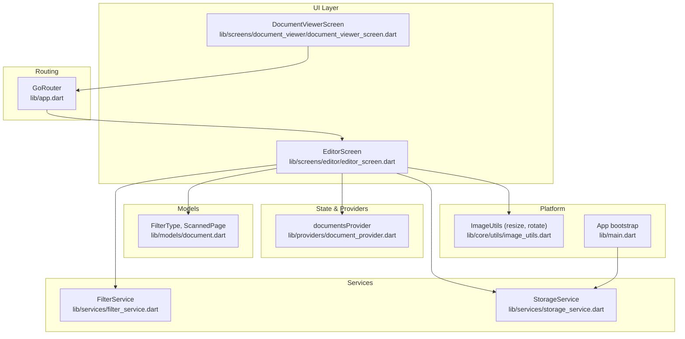
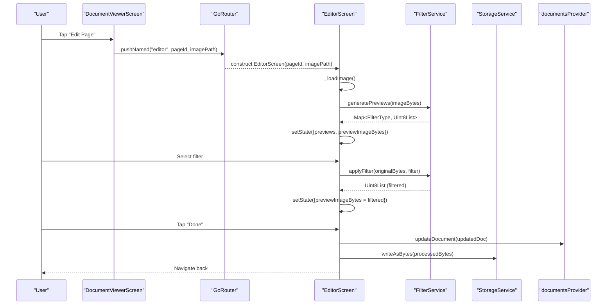
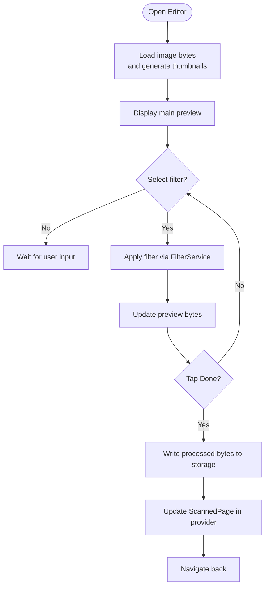
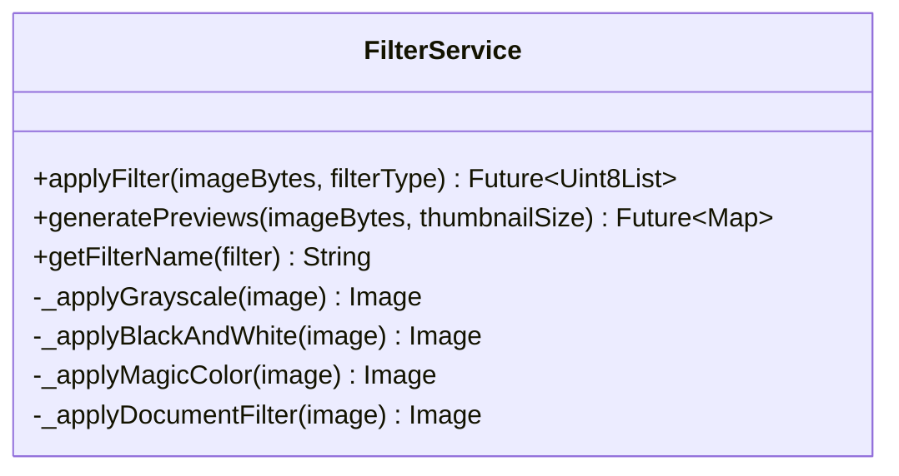
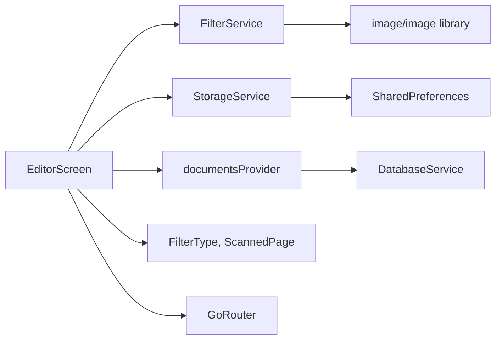

# Editor Screen

<cite>
**Referenced Files in This Document**
- [editor_screen.dart](file://lib/screens/editor/editor_screen.dart)
- [filter_service.dart](file://lib/services/filter_service.dart)
- [image_utils.dart](file://lib/core/utils/image_utils.dart)
- [document.dart](file://lib/models/document.dart)
- [document_provider.dart](file://lib/providers/document_provider.dart)
- [storage_service.dart](file://lib/services/storage_service.dart)
- [app.dart](file://lib/app.dart)
- [main.dart](file://lib/main.dart)
- [camera_screen.dart](file://lib/screens/camera/camera_screen.dart)
- [document_viewer_screen.dart](file://lib/screens/document_viewer/document_viewer_screen.dart)
</cite>

## Table of Contents
1. [Introduction](#introduction)
2. [Project Structure](#project-structure)
3. [Core Components](#core-components)
4. [Architecture Overview](#architecture-overview)
5. [Detailed Component Analysis](#detailed-component-analysis)
6. [Dependency Analysis](#dependency-analysis)
7. [Performance Considerations](#performance-considerations)
8. [Troubleshooting Guide](#troubleshooting-guide)
9. [Conclusion](#conclusion)
10. [Appendices](#appendices)

## Introduction
This document describes the Editor Screen component responsible for image enhancement and editing. It covers the implementation of filters, brightness/contrast adjustments, rotation, cropping, and correction tools. It also explains integration with image processing libraries, real-time preview functionality, and batch editing operations. The editor toolbar, tool selection, and parameter adjustment interfaces are documented, along with examples of common editing workflows, filter combinations, and quality optimization techniques. Performance considerations for real-time image processing, memory usage optimization, and platform-specific graphics APIs are addressed, and guidance is provided for adding custom filters and extending editing capabilities.

## Project Structure
The Editor Screen is part of the Flutter application and integrates with Riverpod for state management, GoRouter for navigation, and the image/image library for processing. The editor is reachable from the document viewer and is initialized with a page identifier and image path.

**Diagram sources**
- [editor_screen.dart](file://lib/screens/editor/editor_screen.dart#L1-L281)
- [filter_service.dart](file://lib/services/filter_service.dart#L1-L106)
- [image_utils.dart](file://lib/core/utils/image_utils.dart#L1-L62)
- [document.dart](file://lib/models/document.dart#L1-L49)
- [document_provider.dart](file://lib/providers/document_provider.dart#L1-L137)
- [storage_service.dart](file://lib/services/storage_service.dart#L1-L63)
- [app.dart](file://lib/app.dart#L131-L141)
- [main.dart](file://lib/main.dart#L10-L32)

**Section sources**
- [editor_screen.dart](file://lib/screens/editor/editor_screen.dart#L1-L281)
- [app.dart](file://lib/app.dart#L131-L141)

## Core Components
- EditorScreen: Orchestrates loading, preview, filter application, and saving edited images back to the document.
- FilterService: Applies filters and generates thumbnails using the image/image library.
- ImageUtils: Provides resizing and rotation utilities used elsewhere in the app.
- StorageService: Manages persistent storage paths and file creation for edited images.
- Document model and providers: Define FilterType, ScannedPage, and document state management.
- Routing: Navigates to the editor with pageId and optional imagePath.

Key responsibilities:
- Real-time preview: Thumbnails are generated for filter selection; full-size filter application updates the preview asynchronously.
- Batch editing: Multiple pages can be edited; the editor updates the ScannedPage’s processedImagePath and appliedFilter.
- Quality optimization: JPEG encoding quality is tuned per operation to balance speed and fidelity.

**Section sources**
- [editor_screen.dart](file://lib/screens/editor/editor_screen.dart#L30-L111)
- [filter_service.dart](file://lib/services/filter_service.dart#L10-L27)
- [image_utils.dart](file://lib/core/utils/image_utils.dart#L9-L26)
- [document.dart](file://lib/models/document.dart#L6-L13)
- [document_provider.dart](file://lib/providers/document_provider.dart#L9-L12)
- [storage_service.dart](file://lib/services/storage_service.dart#L54-L61)

## Architecture Overview
The Editor Screen follows a unidirectional data flow:
- UI triggers actions (load image, apply filter, save).
- Services process images and return bytes.
- Providers update document state.
- UI reflects loading, preview, and completion states.

**Diagram sources**
- [document_viewer_screen.dart](file://lib/screens/document_viewer/document_viewer_screen.dart#L406-L415)
- [app.dart](file://lib/app.dart#L131-L141)
- [editor_screen.dart](file://lib/screens/editor/editor_screen.dart#L44-L111)
- [filter_service.dart](file://lib/services/filter_service.dart#L69-L93)
- [storage_service.dart](file://lib/services/storage_service.dart#L54-L61)
- [document_provider.dart](file://lib/providers/document_provider.dart#L36-L46)

## Detailed Component Analysis

### EditorScreen
Responsibilities:
- Load image bytes from disk, generate thumbnails, and initialize preview.
- Apply filters via FilterService and update preview asynchronously.
- Persist edited images to storage and update the document’s ScannedPage with processedImagePath and appliedFilter.
- Provide a minimal toolbar with Done action and horizontal filter selector.

User interactions:
- Loading spinner during initialization and filter application.
- Horizontal list of filter thumbnails; tapping selects a filter.
- Done button saves changes and navigates back.

**Diagram sources**
- [editor_screen.dart](file://lib/screens/editor/editor_screen.dart#L44-L111)
- [filter_service.dart](file://lib/services/filter_service.dart#L10-L27)
- [storage_service.dart](file://lib/services/storage_service.dart#L54-L61)
- [document_provider.dart](file://lib/providers/document_provider.dart#L36-L46)

**Section sources**
- [editor_screen.dart](file://lib/screens/editor/editor_screen.dart#L30-L111)
- [editor_screen.dart](file://lib/screens/editor/editor_screen.dart#L187-L279)

### FilterService
Capabilities:
- Applies five filters: Original, Grayscale, Black & White, Magic Color, Document.
- Generates thumbnails for filter selection.
- Uses image/image library primitives for grayscale, contrast, luminance threshold, adjustColor, normalize.

Implementation highlights:
- Decodes incoming bytes, applies the selected transform, encodes to JPEG with tuned quality.
- Thumbnail generation resizes to a square thumbnail and encodes at a lower quality for fast UI.

**Diagram sources**
- [filter_service.dart](file://lib/services/filter_service.dart#L10-L93)

**Section sources**
- [filter_service.dart](file://lib/services/filter_service.dart#L10-L93)

### ImageUtils
Capabilities:
- Resize images while preserving aspect ratio.
- Generate thumbnails by square-cropping and resizing.
- Rotate images by 90/180/270 degrees.
- Save/load image bytes to/from files.

Usage in editor:
- Used for general image processing tasks; the editor currently relies on FilterService for transformations but ImageUtils provides reusable primitives.

**Section sources**
- [image_utils.dart](file://lib/core/utils/image_utils.dart#L9-L47)

### StorageService
Capabilities:
- Initialize storage service and manage storage directory.
- Provide a full file path for new files.
- Support custom storage path via preferences.

Behavior in editor:
- When a non-original filter is applied, the editor writes the processed image to storage and stores the path in the ScannedPage.

**Section sources**
- [storage_service.dart](file://lib/services/storage_service.dart#L18-L61)

### Document Model and Providers
- FilterType enum defines available filters.
- ScannedPage tracks imagePath, processedImagePath, appliedFilter, and pageNumber.
- documentsProvider loads, adds, updates, and deletes documents; used by the editor to persist changes.

Integration:
- Editor locates the target ScannedPage by pageId and updates its fields upon save.

**Section sources**
- [document.dart](file://lib/models/document.dart#L6-L13)
- [document.dart](file://lib/models/document.dart#L34-L48)
- [document_provider.dart](file://lib/providers/document_provider.dart#L9-L12)
- [document_provider.dart](file://lib/providers/document_provider.dart#L36-L46)

### Routing and Navigation
- The editor route is defined with pageId and optional imagePath.
- The document viewer navigates to the editor for a selected page.

**Section sources**
- [app.dart](file://lib/app.dart#L131-L141)
- [document_viewer_screen.dart](file://lib/screens/document_viewer/document_viewer_screen.dart#L406-L415)

## Dependency Analysis

**Diagram sources**
- [editor_screen.dart](file://lib/screens/editor/editor_screen.dart#L1-L14)
- [filter_service.dart](file://lib/services/filter_service.dart#L1-L4)
- [storage_service.dart](file://lib/services/storage_service.dart#L1-L6)
- [document_provider.dart](file://lib/providers/document_provider.dart#L1-L6)
- [app.dart](file://lib/app.dart#L67-L141)

**Section sources**
- [editor_screen.dart](file://lib/screens/editor/editor_screen.dart#L1-L14)
- [filter_service.dart](file://lib/services/filter_service.dart#L1-L4)
- [storage_service.dart](file://lib/services/storage_service.dart#L1-L6)
- [document_provider.dart](file://lib/providers/document_provider.dart#L1-L6)

## Performance Considerations
- Image decoding and encoding:
  - Decode once per operation and reuse decoded images where possible.
  - Use JPEG quality tuning to balance speed and fidelity (e.g., lower quality for thumbnails, higher for saved edits).
- Thumbnail generation:
  - Square-resize thumbnails for fast UI rendering; keep thumbnail quality moderate.
- Asynchronous processing:
  - Apply filters and writes occur off the UI thread; show loading indicators to avoid blocking.
- Memory usage:
  - Avoid retaining large bitmaps unnecessarily; clear previews when leaving the screen if needed.
  - Prefer streaming writes to storage rather than holding entire buffers in memory.
- Platform-specific graphics:
  - The current implementation uses Dart-based image processing. For heavy workloads, consider platform channels to native libraries or GPU-accelerated pipelines where available.
- Batch editing:
  - When editing multiple pages, process sequentially or with controlled concurrency to prevent memory spikes.

[No sources needed since this section provides general guidance]

## Troubleshooting Guide
Common issues and resolutions:
- Error loading image:
  - The editor validates the image path and existence; errors are surfaced via snack bars and navigation back to the previous screen.
- Error applying filter:
  - Decoding failures or processing errors are caught and reported; the UI remains responsive.
- Saving changes:
  - The editor searches the loaded documents for the target page; if not found, it reports an error. Ensure the document exists before invoking the editor.
- Storage path issues:
  - If a custom storage path is configured but invalid, the service falls back to the default app documents directory.

**Section sources**
- [editor_screen.dart](file://lib/screens/editor/editor_screen.dart#L66-L75)
- [editor_screen.dart](file://lib/screens/editor/editor_screen.dart#L102-L111)
- [editor_screen.dart](file://lib/screens/editor/editor_screen.dart#L133-L138)
- [storage_service.dart](file://lib/services/storage_service.dart#L40-L52)

## Conclusion
The Editor Screen provides a focused, efficient editing experience centered on filter application and saving processed results back to the document. Its architecture cleanly separates UI, state, and processing concerns, enabling straightforward extension with additional filters and tools. For advanced scenarios, consider integrating higher-performance image processing backends and optimizing memory usage for large batches.

[No sources needed since this section summarizes without analyzing specific files]

## Appendices

### Common Editing Workflows
- Quick enhancement:
  - Open editor, choose “Magic Color” for vibrant photos, then tap Done.
- Document optimization:
  - Choose “Document” for scanned text-heavy pages to improve readability.
- Combine filters:
  - Apply “Grayscale,” then “Document,” then “Black & White” to achieve high-contrast text.
- Rotation:
  - Use the camera capture pipeline to rotate images during capture; the editor focuses on filters and saving.

[No sources needed since this section provides general guidance]

### Adding Custom Filters
Steps:
- Extend FilterType with a new enum value.
- Implement a new method in FilterService to apply the desired transformation using image/image primitives.
- Optionally add a preview generation branch for the new filter.
- Update UI labels if needed.

**Section sources**
- [document.dart](file://lib/models/document.dart#L6-L13)
- [filter_service.dart](file://lib/services/filter_service.dart#L10-L27)
- [filter_service.dart](file://lib/services/filter_service.dart#L69-L93)

### Extending Editing Capabilities
- Brightness/Contrast sliders:
  - Introduce parameters to adjustColor and contrast calls; persist values alongside appliedFilter.
- Cropping:
  - Integrate a cropping utility similar to ImageUtils.rotateImage for rectangle selection and crop operations.
- Batch editing:
  - Iterate over selected pages, apply filters, and save processed images; update document metadata accordingly.

[No sources needed since this section provides general guidance]