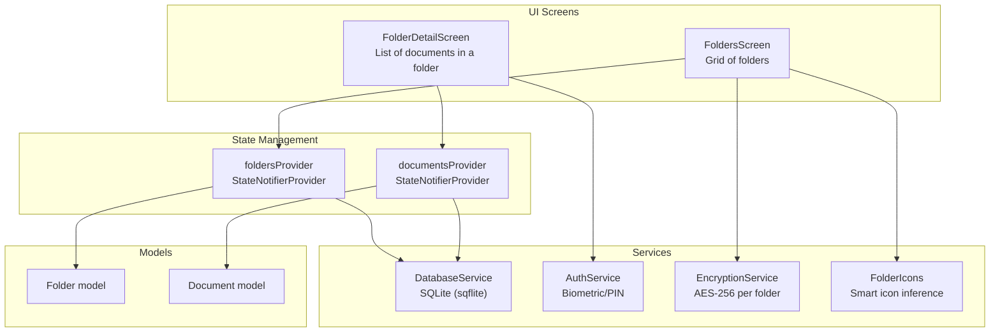
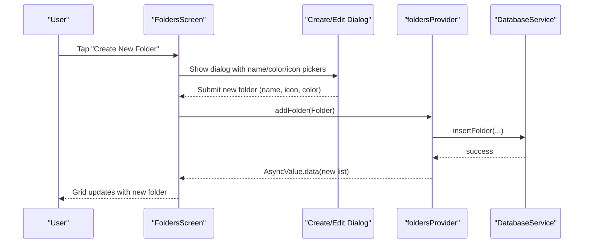
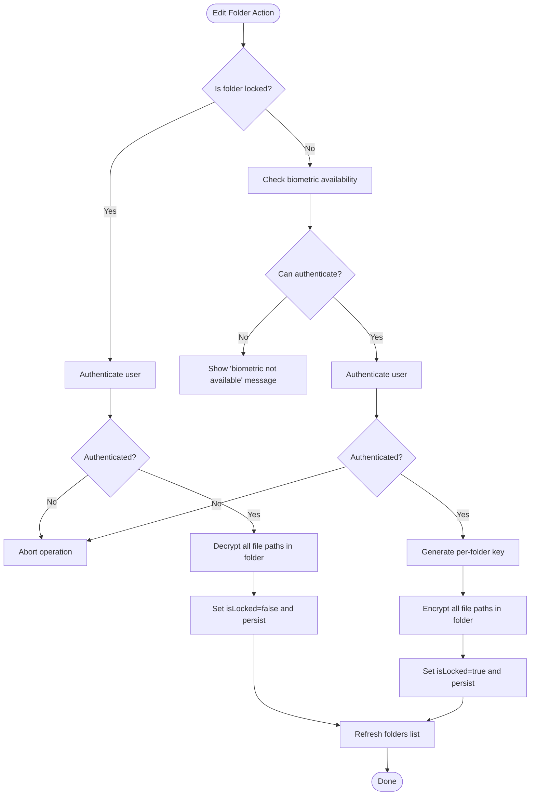
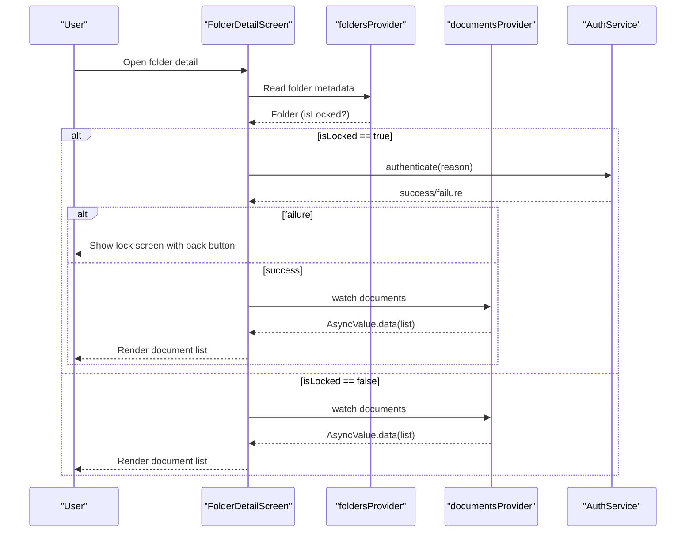
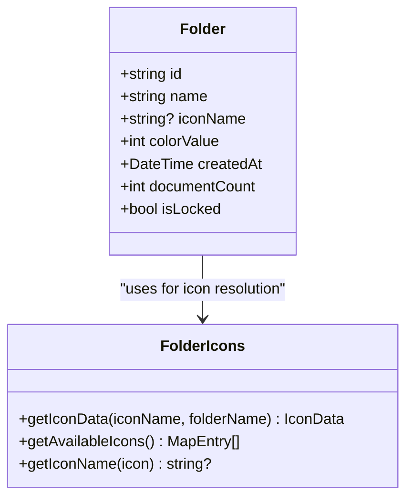
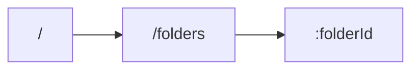
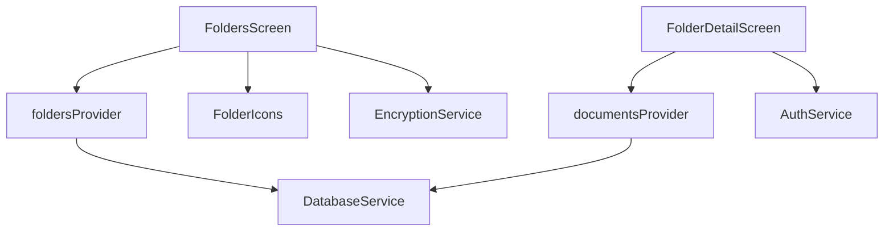

# Folders Screens

<cite>
**Referenced Files in This Document**
- [folders_screen.dart](file://lib/screens/folders/folders_screen.dart)
- [folder_detail_screen.dart](file://lib/screens/folders/folder_detail_screen.dart)
- [folder.dart](file://lib/models/folder.dart)
- [folder.freezed.dart](file://lib/models/folder.freezed.dart)
- [folder_icons.dart](file://lib/utils/folder_icons.dart)
- [document_provider.dart](file://lib/providers/document_provider.dart)
- [database_service.dart](file://lib/services/database_service.dart)
- [auth_service.dart](file://lib/services/auth_service.dart)
- [encryption_service.dart](file://lib/services/encryption_service.dart)
- [app.dart](file://lib/app.dart)
- [main.dart](file://lib/main.dart)
- [document.dart](file://lib/models/document.dart)
- [home_screen.dart](file://lib/screens/home/home_screen.dart)
- [storage_service.dart](file://lib/services/storage_service.dart)
</cite>

## Table of Contents
1. [Introduction](#introduction)
2. [Project Structure](#project-structure)
3. [Core Components](#core-components)
4. [Architecture Overview](#architecture-overview)
5. [Detailed Component Analysis](#detailed-component-analysis)
6. [Dependency Analysis](#dependency-analysis)
7. [Performance Considerations](#performance-considerations)
8. [Troubleshooting Guide](#troubleshooting-guide)
9. [Conclusion](#conclusion)
10. [Appendices](#appendices)

## Introduction
This document explains the Folders Screens component responsible for organizing and categorizing documents. It covers the hierarchical folder structure, creation and editing workflows, document assignment, locked folder protection, folder icons and visual organization, integration with document management, search behavior within folders, bulk operations, navigation and filtering examples, performance optimization for large folder structures, efficient document querying, and synchronization. Guidance is also provided for customizing folder features and extending organizational capabilities.

## Project Structure
The Folders Screens reside under the screens/folders directory and integrate with Riverpod providers, the database service, and shared utilities. Routing is configured via GoRouter to navigate between the folders list and a folder detail view.

**Diagram sources**
- [folders_screen.dart](file://lib/screens/folders/folders_screen.dart#L1-L680)
- [folder_detail_screen.dart](file://lib/screens/folders/folder_detail_screen.dart#L1-L290)
- [document_provider.dart](file://lib/providers/document_provider.dart#L1-L137)
- [database_service.dart](file://lib/services/database_service.dart#L1-L413)
- [auth_service.dart](file://lib/services/auth_service.dart#L1-L63)
- [encryption_service.dart](file://lib/services/encryption_service.dart#L1-L150)
- [folder_icons.dart](file://lib/utils/folder_icons.dart#L1-L218)
- [folder.dart](file://lib/models/folder.dart#L1-L21)
- [document.dart](file://lib/models/document.dart#L1-L49)

**Section sources**
- [folders_screen.dart](file://lib/screens/folders/folders_screen.dart#L1-L680)
- [folder_detail_screen.dart](file://lib/screens/folders/folder_detail_screen.dart#L1-L290)
- [document_provider.dart](file://lib/providers/document_provider.dart#L1-L137)
- [database_service.dart](file://lib/services/database_service.dart#L1-L413)
- [folder_icons.dart](file://lib/utils/folder_icons.dart#L1-L218)
- [app.dart](file://lib/app.dart#L66-L186)

## Core Components
- FoldersScreen: Displays folders in a grid layout, supports creating new folders with customizable color and icon, and navigates to the folder detail screen on tap.
- FolderDetailScreen: Lists documents belonging to a selected folder, enforces authentication for locked folders, and supports renaming/deleting folders.
- Folder model: Represents a folder with id, name, optional icon name, ARGB color, creation timestamp, document count, and lock status.
- FolderIcons: Provides smart icon inference based on folder name and allows manual icon selection.
- Providers: foldersProvider and documentsProvider manage asynchronous lists of folders and documents respectively.
- DatabaseService: Implements CRUD operations for folders and documents, maintains indexes, and computes document counts per folder.
- AuthService: Handles biometric/PIN authentication for locking/unlocking folders.
- EncryptionService: Generates per-folder keys and encrypts/decrypts files stored under locked folders.

**Section sources**
- [folders_screen.dart](file://lib/screens/folders/folders_screen.dart#L1-L680)
- [folder_detail_screen.dart](file://lib/screens/folders/folder_detail_screen.dart#L1-L290)
- [folder.dart](file://lib/models/folder.dart#L1-L21)
- [folder.freezed.dart](file://lib/models/folder.freezed.dart#L192-L311)
- [folder_icons.dart](file://lib/utils/folder_icons.dart#L1-L218)
- [document_provider.dart](file://lib/providers/document_provider.dart#L1-L137)
- [database_service.dart](file://lib/services/database_service.dart#L1-L413)
- [auth_service.dart](file://lib/services/auth_service.dart#L1-L63)
- [encryption_service.dart](file://lib/services/encryption_service.dart#L1-L150)

## Architecture Overview
The Folders Screens follow a reactive architecture using Riverpod for state and GoRouter for navigation. The UI reacts to asynchronous providers, while services encapsulate persistence and security.

**Diagram sources**
- [folders_screen.dart](file://lib/screens/folders/folders_screen.dart#L81-L282)
- [document_provider.dart](file://lib/providers/document_provider.dart#L56-L95)
- [database_service.dart](file://lib/services/database_service.dart#L291-L301)

## Detailed Component Analysis

### FoldersScreen: Grid, Creation, Editing, Locked Folder Protection
- Grid display: Uses a two-column grid to present folders with icon, name, and document count.
- Create folder:
  - Dialog collects name, color, and icon selection.
  - Submits a new Folder with generated id, timestamps, and lock flag set to false by default.
- Edit folder:
  - Dialog supports renaming and changing color/icon.
  - Long-press triggers edit; includes lock/unlock and delete actions.
  - Locking:
    - Requires biometric/PIN capability and authentication.
    - Generates a per-folder AES key and encrypts all file paths associated with documents in the folder.
    - Updates folder isLocked flag and refreshes folder list.
  - Unlocking:
    - Requires authentication.
    - Decrypts all files and updates folder isLocked flag.
- Visual indicators:
  - Lock badge overlays the folder icon when isLocked is true.

**Diagram sources**
- [folders_screen.dart](file://lib/screens/folders/folders_screen.dart#L360-L678)
- [auth_service.dart](file://lib/services/auth_service.dart#L26-L52)
- [encryption_service.dart](file://lib/services/encryption_service.dart#L15-L134)
- [database_service.dart](file://lib/services/database_service.dart#L354-L372)

**Section sources**
- [folders_screen.dart](file://lib/screens/folders/folders_screen.dart#L21-L282)
- [folders_screen.dart](file://lib/screens/folders/folders_screen.dart#L284-L678)
- [auth_service.dart](file://lib/services/auth_service.dart#L1-L63)
- [encryption_service.dart](file://lib/services/encryption_service.dart#L1-L150)
- [database_service.dart](file://lib/services/database_service.dart#L291-L372)

### FolderDetailScreen: Document Listing and Access Control
- Displays documents filtered by folderId from documentsProvider.
- Enforces authentication for locked folders via a FutureBuilder; if authentication fails, shows a lock screen with a back action.
- Supports renaming and deleting the folder from the toolbar.
- Shows empty state when no documents are present.

**Diagram sources**
- [folder_detail_screen.dart](file://lib/screens/folders/folder_detail_screen.dart#L14-L97)
- [auth_service.dart](file://lib/services/auth_service.dart#L26-L52)
- [document_provider.dart](file://lib/providers/document_provider.dart#L9-L54)

**Section sources**
- [folder_detail_screen.dart](file://lib/screens/folders/folder_detail_screen.dart#L14-L244)

### Folder Model and Smart Icons
- Folder model fields include id, name, optional iconName, ARGB colorValue, createdAt, documentCount, and isLocked.
- FolderIcons infers an appropriate icon based on folder name keywords and exposes a curated list of selectable icons. It also supports reverse lookup of icon names.

**Diagram sources**
- [folder.dart](file://lib/models/folder.dart#L6-L20)
- [folder.freezed.dart](file://lib/models/folder.freezed.dart#L192-L311)
- [folder_icons.dart](file://lib/utils/folder_icons.dart#L1-L218)

**Section sources**
- [folder.dart](file://lib/models/folder.dart#L1-L21)
- [folder.freezed.dart](file://lib/models/folder.freezed.dart#L192-L311)
- [folder_icons.dart](file://lib/utils/folder_icons.dart#L1-L218)

### Routing and Navigation
- GoRouter configures a StatefulShellRoute with bottom navigation, exposing the folders route and nested folder-detail route with path parameter folderId.

**Diagram sources**
- [app.dart](file://lib/app.dart#L66-L117)

**Section sources**
- [app.dart](file://lib/app.dart#L66-L117)

## Dependency Analysis
- UI depends on Riverpod providers for asynchronous data.
- Providers depend on DatabaseService for persistence.
- FolderDetailScreen integrates AuthService for locked folder access.
- EncryptionService is invoked during lock/unlock operations.
- FolderIcons is used by FoldersScreen for visual representation.

**Diagram sources**
- [folders_screen.dart](file://lib/screens/folders/folders_screen.dart#L1-L680)
- [folder_detail_screen.dart](file://lib/screens/folders/folder_detail_screen.dart#L1-L290)
- [document_provider.dart](file://lib/providers/document_provider.dart#L1-L137)
- [database_service.dart](file://lib/services/database_service.dart#L1-L413)
- [auth_service.dart](file://lib/services/auth_service.dart#L1-L63)
- [encryption_service.dart](file://lib/services/encryption_service.dart#L1-L150)
- [folder_icons.dart](file://lib/utils/folder_icons.dart#L1-L218)

**Section sources**
- [folders_screen.dart](file://lib/screens/folders/folders_screen.dart#L1-L680)
- [folder_detail_screen.dart](file://lib/screens/folders/folder_detail_screen.dart#L1-L290)
- [document_provider.dart](file://lib/providers/document_provider.dart#L1-L137)
- [database_service.dart](file://lib/services/database_service.dart#L1-L413)
- [auth_service.dart](file://lib/services/auth_service.dart#L1-L63)
- [encryption_service.dart](file://lib/services/encryption_service.dart#L1-L150)
- [folder_icons.dart](file://lib/utils/folder_icons.dart#L1-L218)

## Performance Considerations
- Efficient document querying:
  - DatabaseService queries documents ordered by modified_at and supports filtering by folder_id. An index on documents(folder_id) is created to speed up folder-specific queries.
- Folder document counts:
  - DatabaseService computes documentCount per folder using a grouped SELECT with COUNT, avoiding client-side aggregation.
- UI rendering:
  - FoldersScreen uses GridView.builder with fixed cross-axis count to efficiently render folder tiles.
  - FolderDetailScreen uses ListView.separated for document lists.
- Lock/unlock operations:
  - EncryptionService operates on file paths; ensure batch operations are performed asynchronously to avoid blocking the UI.
- Initialization:
  - DatabaseService.initialize is called in main to ensure the database is ready before UI renders.

Recommendations:
- For very large datasets, consider pagination in FolderDetailScreen to limit rendered items.
- Debounce search queries in higher-level screens to reduce unnecessary recomputation.
- Keep EncryptionService operations off the UI thread; use futures and show progress feedback.

**Section sources**
- [database_service.dart](file://lib/services/database_service.dart#L92-L97)
- [database_service.dart](file://lib/services/database_service.dart#L196-L226)
- [database_service.dart](file://lib/services/database_service.dart#L303-L325)
- [folders_screen.dart](file://lib/screens/folders/folders_screen.dart#L55-L68)
- [folder_detail_screen.dart](file://lib/screens/folders/folder_detail_screen.dart#L155-L168)
- [main.dart](file://lib/main.dart#L10-L31)

## Troubleshooting Guide
- Authentication failures:
  - If biometric authentication is unavailable or fails, the system informs the user and prevents lock/unlock operations. Verify device support and try again.
- Encryption errors:
  - EncryptionService throws if a folder key is missing or decryption fails. Ensure keys are generated before encrypting and persisted after unlocking.
- Database initialization:
  - DatabaseService requires initialization before use. Ensure initialize() is called during app startup.
- Search behavior:
  - In HomeScreen, documents inside locked folders are filtered out from the main list. Confirm folder lock status and adjust search accordingly.

**Section sources**
- [auth_service.dart](file://lib/services/auth_service.dart#L26-L52)
- [encryption_service.dart](file://lib/services/encryption_service.dart#L38-L134)
- [database_service.dart](file://lib/services/database_service.dart#L16-L28)
- [home_screen.dart](file://lib/screens/home/home_screen.dart#L171-L190)

## Conclusion
The Folders Screens component provides a robust foundation for organizing documents with a clean UI, flexible customization (icons/colors), and strong security through per-folder encryption. The architecture leverages Riverpod for reactive state, SQLite for persistence, and modular services for authentication and encryption. With indexing and computed counts, the system scales effectively for moderate to large datasets. Extending features such as hierarchical nesting, advanced search, and bulk operations is straightforward by building on the existing providers and services.

## Appendices

### Examples and Workflows

- Folder navigation:
  - From the bottom navigation, select the Folders tab to open FoldersScreen.
  - Tap a folder tile to navigate to FolderDetailScreen for that folder.

- Document filtering by folder:
  - In FolderDetailScreen, the list is filtered server-side by folderId and sorted by modified_at.

- Folder hierarchy management:
  - Current implementation does not include nested subfolders. To extend, introduce a parentId field in the Folder model and update DatabaseService to support hierarchical queries and UI traversal.

- Bulk document operations:
  - Current UI supports individual rename/delete actions. For bulk operations, add selection mode and batch actions (move, delete) leveraging documentsProvider and DatabaseService.

- Search within folders:
  - FolderDetailScreen does not implement folder-scoped search. To add it, filter documents by name within the folder’s list and debounce input for responsiveness.

- Customizing folder features:
  - Add new icons to FolderIcons._availableIcons and extend smart inference in FolderIcons._getIconFromFolderName.
  - Extend Folder model with additional attributes (e.g., description, parentId) and update DatabaseService schema and queries accordingly.

- Extending organizational capabilities:
  - Introduce tags and link them to documents via a junction table (already present in schema comments).
  - Add sorting options (by date, name, count) and grouping strategies (date buckets, tags).

[No sources needed since this section aggregates guidance without analyzing specific files]