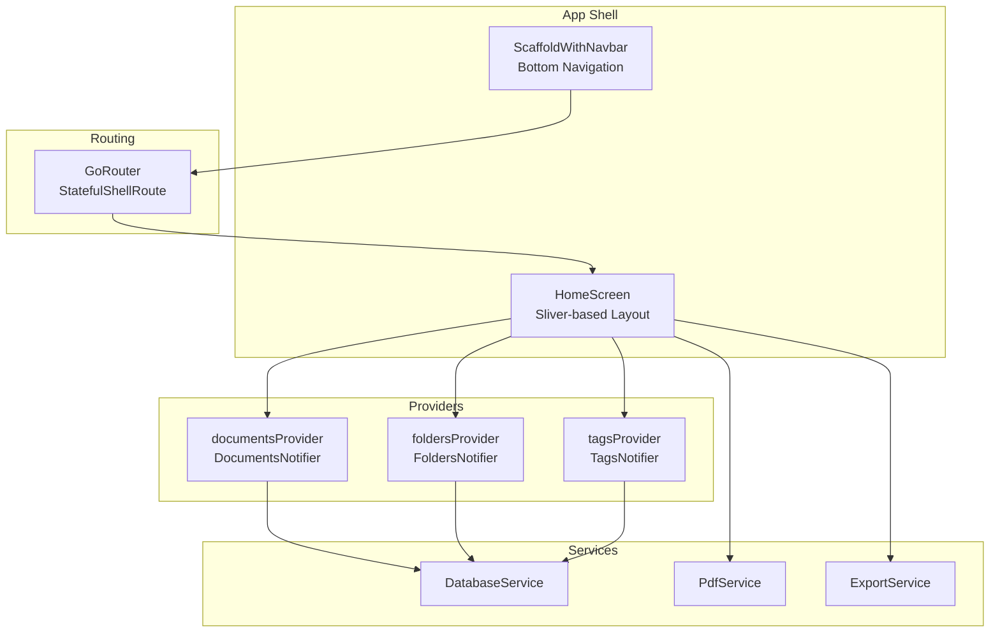
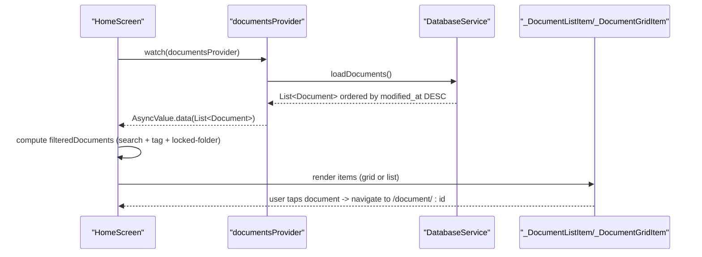
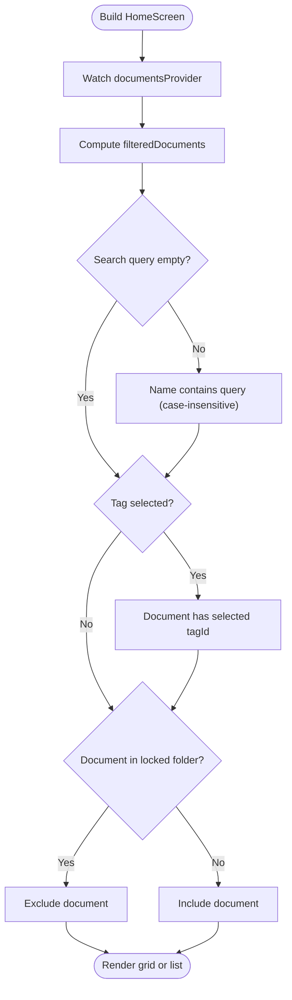
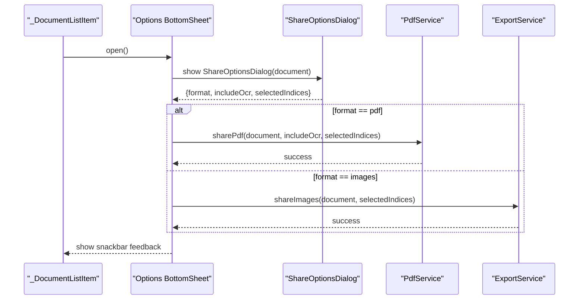
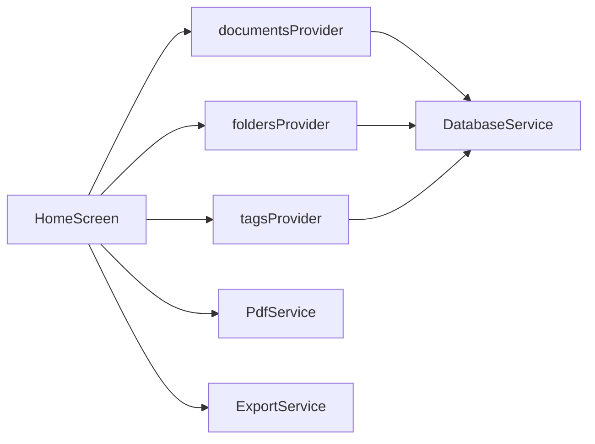

# Home Screen

<cite>
**Referenced Files in This Document**
- [home_screen.dart](file://lib/screens/home/home_screen.dart)
- [document_provider.dart](file://lib/providers/document_provider.dart)
- [document.dart](file://lib/models/document.dart)
- [database_service.dart](file://lib/services/database_service.dart)
- [tags_sheet.dart](file://lib/screens/tags/tags_sheet.dart)
- [pdf_service.dart](file://lib/services/pdf_service.dart)
- [export_service.dart](file://lib/services/export_service.dart)
- [folder.dart](file://lib/models/folder.dart)
- [folder_icons.dart](file://lib/utils/folder_icons.dart)
- [app.dart](file://lib/app.dart)
- [main.dart](file://lib/main.dart)
</cite>

## Table of Contents
1. [Introduction](#introduction)
2. [Project Structure](#project-structure)
3. [Core Components](#core-components)
4. [Architecture Overview](#architecture-overview)
5. [Detailed Component Analysis](#detailed-component-analysis)
6. [Dependency Analysis](#dependency-analysis)
7. [Performance Considerations](#performance-considerations)
8. [Troubleshooting Guide](#troubleshooting-guide)
9. [Conclusion](#conclusion)
10. [Appendices](#appendices)

## Introduction
This document explains the Home Screen component that lists scanned documents, enabling users to search, filter, switch views, and perform quick actions. It covers the document listing interface, search and filtering, quick action buttons, grid/list views, thumbnails and metadata display, sorting, reactive updates via the document provider, navigation to document details, and batch operations. It also provides guidance on performance optimization, customization, and extending functionality.

## Project Structure
The Home Screen is part of the application shell with persistent bottom navigation. Routing is configured to show the Home Screen as the default tab, while other screens (Folders, Settings) are reachable via the bottom navigation. The Home Screen integrates with Riverpod providers for reactive state and uses a local database service for persistence.

**Diagram sources**
- [app.dart](file://lib/app.dart#L66-L186)
- [home_screen.dart](file://lib/screens/home/home_screen.dart#L41-L249)
- [document_provider.dart](file://lib/providers/document_provider.dart#L9-L137)
- [database_service.dart](file://lib/services/database_service.dart#L11-L413)
- [pdf_service.dart](file://lib/services/pdf_service.dart#L12-L187)
- [export_service.dart](file://lib/services/export_service.dart#L6-L42)

**Section sources**
- [app.dart](file://lib/app.dart#L66-L186)
- [main.dart](file://lib/main.dart#L10-L31)

## Core Components
- HomeScreen: Renders the app bar with search and filter controls, empty state, and the document list/grid. Implements search, tag filtering, and view toggle.
- _DocumentListItem and _DocumentGridItem: Render individual documents in list or grid mode, including thumbnails, metadata, and actions.
- DocumentsNotifier: Reactive provider that loads, updates, and deletes documents, triggering UI refreshes.
- DatabaseService: Provides CRUD operations for documents, pages, folders, and tags, with ordering and joins.
- TagsSheet: Bottom sheet for selecting or managing tags used by the Home Screen filter.
- PdfService and ExportService: Enable exporting documents as PDF or sharing images.

**Section sources**
- [home_screen.dart](file://lib/screens/home/home_screen.dart#L20-L320)
- [document_provider.dart](file://lib/providers/document_provider.dart#L9-L137)
- [database_service.dart](file://lib/services/database_service.dart#L147-L247)
- [tags_sheet.dart](file://lib/screens/tags/tags_sheet.dart#L9-L176)
- [pdf_service.dart](file://lib/services/pdf_service.dart#L12-L187)
- [export_service.dart](file://lib/services/export_service.dart#L6-L42)

## Architecture Overview
The Home Screen uses a reactive architecture:
- Providers observe asynchronous streams of data (AsyncValue<List<Document>>).
- Filtering and view toggling are computed locally from the watched data.
- Actions (export, move, delete) trigger provider updates, which reload data from the database.

**Diagram sources**
- [home_screen.dart](file://lib/screens/home/home_screen.dart#L44-L233)
- [document_provider.dart](file://lib/providers/document_provider.dart#L19-L28)
- [database_service.dart](file://lib/services/database_service.dart#L147-L171)

## Detailed Component Analysis

### Document Listing Interface
- Sliver-based layout with a pinned app bar and flexible space for animated title and search field.
- Two rendering modes:
  - Grid: 2-column layout with cards showing thumbnails, name, page count, and modified date.
  - List: Dense list items with thumbnails, title, subtitle (pages + modified date), and action menu.
- Empty state displays a friendly illustration and message when no documents match filters.

**Section sources**
- [home_screen.dart](file://lib/screens/home/home_screen.dart#L41-L287)

### Search and Filtering
- Search:
  - Toggles a TextField in the app bar when search is activated.
  - Filters documents by case-insensitive substring match on document name.
- Tag Filter:
  - Opens a bottom sheet to select a single tag; toggles selection when tapped.
  - Filters documents by matching tagIds against the selected tag.
- Locked Folder Filter:
  - Watches folders and excludes documents whose folderId belongs to locked folders.

**Diagram sources**
- [home_screen.dart](file://lib/screens/home/home_screen.dart#L178-L190)
- [document_provider.dart](file://lib/providers/document_provider.dart#L57-L95)
- [folder.dart](file://lib/models/folder.dart#L7-L21)

**Section sources**
- [home_screen.dart](file://lib/screens/home/home_screen.dart#L28-L116)
- [home_screen.dart](file://lib/screens/home/home_screen.dart#L178-L190)
- [tags_sheet.dart](file://lib/screens/tags/tags_sheet.dart#L76-L136)

### Quick Action Buttons and Options
- Floating action button opens a bottom sheet with scanning options:
  - Single Page: navigates to camera in single mode.
  - Batch Scan: navigates to camera in batch mode.
- Per-item actions:
  - Export: opens ShareOptionsDialog to choose format and page indices, then invokes PdfService or ExportService.
  - Move to Folder: opens a dialog to select a destination folder or root.
  - Rename: placeholder for future implementation.
  - Delete: confirmation dialog followed by provider deletion.

**Diagram sources**
- [home_screen.dart](file://lib/screens/home/home_screen.dart#L408-L504)
- [pdf_service.dart](file://lib/services/pdf_service.dart#L155-L173)
- [export_service.dart](file://lib/services/export_service.dart#L9-L41)

**Section sources**
- [home_screen.dart](file://lib/screens/home/home_screen.dart#L288-L319)
- [home_screen.dart](file://lib/screens/home/home_screen.dart#L408-L584)
- [pdf_service.dart](file://lib/services/pdf_service.dart#L12-L187)
- [export_service.dart](file://lib/services/export_service.dart#L6-L42)

### Document Thumbnails, Metadata, and Sorting
- Thumbnails:
  - Grid: Image.file or fallback icon inside a card.
  - List: Hero-enabled thumbnail container with optional FileImage or fallback icon.
- Metadata:
  - Grid: name (single line), page count, modified date.
  - List: title, subtitle with page count and formatted modified date, trailing menu.
- Sorting:
  - Documents are sorted by modified_at descending order when loaded from the database.

**Section sources**
- [home_screen.dart](file://lib/screens/home/home_screen.dart#L598-L649)
- [home_screen.dart](file://lib/screens/home/home_screen.dart#L322-L406)
- [database_service.dart](file://lib/services/database_service.dart#L147-L171)
- [document.dart](file://lib/models/document.dart#L16-L32)

### Integration with Document Provider and Reactive Updates
- HomeScreen watches documentsProvider to receive AsyncValue<List<Document>>.
- Filtering and view rendering occur in the UI layer based on the latest snapshot.
- Actions call DocumentsNotifier methods (add/update/delete), which reload data from DatabaseService, causing automatic UI refresh.

**Section sources**
- [home_screen.dart](file://lib/screens/home/home_screen.dart#L44-L233)
- [document_provider.dart](file://lib/providers/document_provider.dart#L14-L54)
- [database_service.dart](file://lib/services/database_service.dart#L19-L28)

### Navigation to Document Details
- Tapping a document navigates to the document viewer route with the document id parameter.
- The route is defined in the application router and uses a dedicated screen.

**Section sources**
- [home_screen.dart](file://lib/screens/home/home_screen.dart#L401-L403)
- [app.dart](file://lib/app.dart#L144-L152)

### Batch Operation Capabilities
- Export supports selecting specific page indices for both PDF and image formats.
- Move-to-folder allows moving a single document to a target folder or root.
- Delete removes a single document after confirmation.

**Section sources**
- [home_screen.dart](file://lib/screens/home/home_screen.dart#L419-L454)
- [pdf_service.dart](file://lib/services/pdf_service.dart#L16-L20)
- [export_service.dart](file://lib/services/export_service.dart#L11-L20)
- [home_screen.dart](file://lib/screens/home/home_screen.dart#L506-L584)

## Dependency Analysis
- HomeScreen depends on:
  - documentsProvider for document list.
  - foldersProvider for locked folder detection.
  - tagsProvider for tag management and selection.
  - PdfService and ExportService for export operations.
- Providers depend on DatabaseService for persistence.
- Routing integrates HomeScreen into the shell with bottom navigation.

**Diagram sources**
- [home_screen.dart](file://lib/screens/home/home_screen.dart#L44-L116)
- [document_provider.dart](file://lib/providers/document_provider.dart#L9-L137)
- [database_service.dart](file://lib/services/database_service.dart#L11-L413)

**Section sources**
- [home_screen.dart](file://lib/screens/home/home_screen.dart#L17-L17)
- [document_provider.dart](file://lib/providers/document_provider.dart#L1-L137)
- [database_service.dart](file://lib/services/database_service.dart#L1-L413)

## Performance Considerations
- Rendering strategy:
  - Grid and list use SliverChildBuilderDelegate to render only visible items, minimizing layout overhead.
- Filtering:
  - Filtering is performed in-memory on the UI thread; keep queries short and avoid frequent re-computation by debouncing search input if needed.
- Thumbnails:
  - Using FileImage for thumbnails is straightforward; for very large collections, consider generating smaller cached thumbnails or placeholders to reduce memory pressure.
- Database sorting:
  - Documents are fetched ordered by modified_at DESC, reducing UI sorting work.
- Export:
  - PDF generation and image sharing are asynchronous; show progress feedback to the user.
- Memory management:
  - Dispose of controllers (e.g., search controller) in the HomeScreen lifecycle.
  - Avoid holding large image bitmaps unnecessarily; rely on platform image caching where possible.

[No sources needed since this section provides general guidance]

## Troubleshooting Guide
- Documents not updating after an action:
  - Ensure DocumentsNotifier.loadDocuments() is called after add/update/delete so the UI rebuilds with fresh data.
- Search yields unexpected results:
  - Verify search is case-insensitive and operates on document.name.
- Tag filter not working:
  - Confirm documents have correct tagIds populated and that the selected tagId matches.
- Locked folder documents still visible:
  - Ensure foldersProvider is loaded and lockedFolderIds set before filtering.
- Export failures:
  - Catch exceptions from PdfService and ExportService and present user-friendly messages.

**Section sources**
- [document_provider.dart](file://lib/providers/document_provider.dart#L31-L46)
- [home_screen.dart](file://lib/screens/home/home_screen.dart#L178-L190)
- [pdf_service.dart](file://lib/services/pdf_service.dart#L93-L95)
- [export_service.dart](file://lib/services/export_service.dart#L34-L40)

## Conclusion
The Home Screen provides a responsive, reactive interface for browsing documents with robust search, tag-based filtering, and flexible view modes. Its integration with Riverpod and a local database ensures smooth updates and scalability. The component supports essential operations like export, move, and delete, and can be extended with additional quick actions and performance optimizations as the collection grows.

[No sources needed since this section summarizes without analyzing specific files]

## Appendices

### Examples and Usage Notes
- Search:
  - Type in the search bar to filter by document name (case-insensitive).
- Filter by Tag:
  - Tap the filter icon, select a tag from the bottom sheet, and documents with that tag appear.
- View Toggle:
  - Switch between grid and list views using the view icon.
- Export:
  - From the document menu, choose export format and selected pages; PDF includes OCR text optionally.
- Move to Folder:
  - From the document menu, select a destination folder or root.

**Section sources**
- [home_screen.dart](file://lib/screens/home/home_screen.dart#L56-L116)
- [home_screen.dart](file://lib/screens/home/home_screen.dart#L408-L504)
- [pdf_service.dart](file://lib/services/pdf_service.dart#L155-L173)
- [export_service.dart](file://lib/services/export_service.dart#L9-L41)

### Customization Guidelines
- Layout:
  - Adjust SliverGridDelegate parameters for grid responsiveness.
  - Modify list tile layouts for additional metadata or actions.
- Quick Actions:
  - Extend the per-document options bottom sheet with new actions (e.g., rename, translate).
- Thumbnails:
  - Introduce thumbnail caching or pre-generation for improved performance on large datasets.
- Sorting:
  - Add additional sort options (e.g., by name, creation date) by updating the provider and database queries.

[No sources needed since this section provides general guidance]