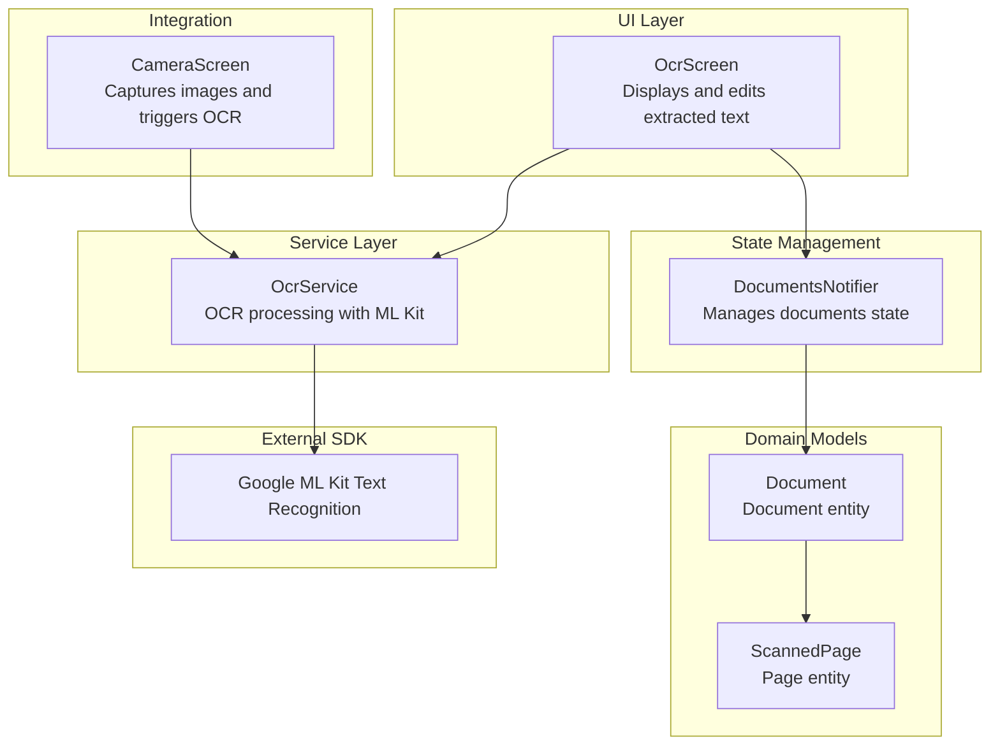
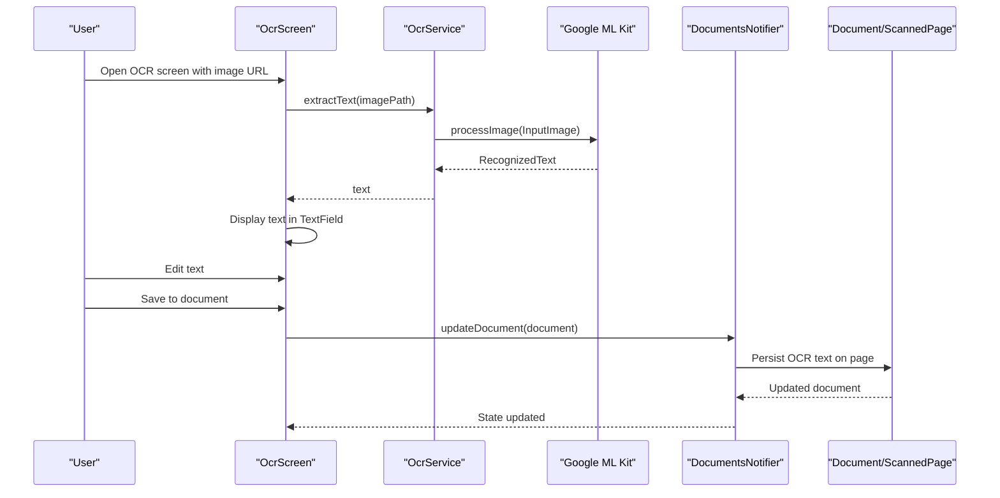
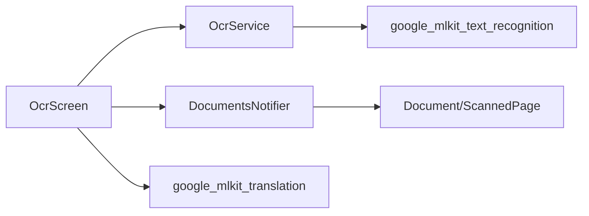
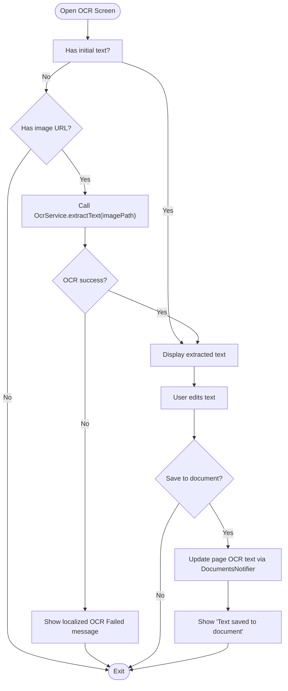

# OCR Screen

<cite>
**Referenced Files in This Document**
- [ocr_screen.dart](file://lib/screens/ocr/ocr_screen.dart)
- [ocr_service.dart](file://lib/services/ocr_service.dart)
- [document.dart](file://lib/models/document.dart)
- [document_provider.dart](file://lib/providers/document_provider.dart)
- [camera_screen.dart](file://lib/screens/camera/camera_screen.dart)
- [app_exceptions.dart](file://lib/core/exceptions/app_exceptions.dart)
- [app_localizations_en.dart](file://lib/l10n/app_localizations_en.dart)
- [pubspec.yaml](file://pubspec.yaml)
</cite>

## Table of Contents
1. [Introduction](#introduction)
2. [Project Structure](#project-structure)
3. [Core Components](#core-components)
4. [Architecture Overview](#architecture-overview)
5. [Detailed Component Analysis](#detailed-component-analysis)
6. [Dependency Analysis](#dependency-analysis)
7. [Performance Considerations](#performance-considerations)
8. [Troubleshooting Guide](#troubleshooting-guide)
9. [Conclusion](#conclusion)
10. [Appendices](#appendices)

## Introduction
This document explains the OCR Screen component responsible for text recognition and extraction. It covers integration with Google ML Kit, text detection algorithms, multi-language support, text block extraction, confidence scoring, text editing capabilities, OCR processing workflow, error handling, performance optimization, offline vs online OCR modes, model caching strategies, memory management, customization of OCR parameters, and extending language support.

## Project Structure
The OCR functionality spans several modules:
- UI: OCR screen for displaying and editing extracted text
- Service: OCR service using Google ML Kit for text recognition
- Models: Document and page models storing OCR results
- Providers: State management for documents
- Camera integration: Automatic OCR during document capture
- Exceptions and localization: Error handling and multi-language messages

**Diagram sources**
- [ocr_screen.dart](file://lib/screens/ocr/ocr_screen.dart#L1-L178)
- [ocr_service.dart](file://lib/services/ocr_service.dart#L1-L93)
- [document.dart](file://lib/models/document.dart#L15-L49)
- [document_provider.dart](file://lib/providers/document_provider.dart#L9-L54)
- [camera_screen.dart](file://lib/screens/camera/camera_screen.dart#L45-L127)

**Section sources**
- [ocr_screen.dart](file://lib/screens/ocr/ocr_screen.dart#L1-L178)
- [ocr_service.dart](file://lib/services/ocr_service.dart#L1-L93)
- [document.dart](file://lib/models/document.dart#L15-L49)
- [document_provider.dart](file://lib/providers/document_provider.dart#L9-L54)
- [camera_screen.dart](file://lib/screens/camera/camera_screen.dart#L45-L127)

## Core Components
- OcrScreen: Displays extracted text, supports editing, saving to document, translation, copying, and sharing.
- OcrService: Orchestrates OCR using Google ML Kit, exposes text extraction, block extraction, and batch processing.
- Document and ScannedPage models: Persist OCR results per page and document.
- DocumentsNotifier: Manages document state and updates OCR text.
- CameraScreen: Integrates OCR during document capture and smart naming.

Key responsibilities:
- Text extraction and display
- Structured block extraction with language metadata
- Batch processing across multiple pages
- Saving edited text back to document pages
- Multi-language UI feedback and error messages

**Section sources**
- [ocr_screen.dart](file://lib/screens/ocr/ocr_screen.dart#L11-L178)
- [ocr_service.dart](file://lib/services/ocr_service.dart#L6-L68)
- [document.dart](file://lib/models/document.dart#L15-L49)
- [document_provider.dart](file://lib/providers/document_provider.dart#L14-L54)
- [camera_screen.dart](file://lib/screens/camera/camera_screen.dart#L76-L181)

## Architecture Overview
The OCR Screen integrates with Google ML Kit to recognize text from images. The flow begins either from the OCR screen itself or from the camera screen during document capture. Extracted text is displayed for editing and can be saved back to the document’s page. The service encapsulates ML Kit usage and exposes structured results.

**Diagram sources**
- [ocr_screen.dart](file://lib/screens/ocr/ocr_screen.dart#L52-L112)
- [ocr_service.dart](file://lib/services/ocr_service.dart#L10-L18)
- [document_provider.dart](file://lib/providers/document_provider.dart#L36-L40)
- [document.dart](file://lib/models/document.dart#L15-L49)

## Detailed Component Analysis

### OcrScreen: UI and Editing Workflow
Responsibilities:
- Initialize with optional initial text or trigger OCR from an image URL
- Display extracted text in an editable TextField
- Provide actions: save to document, translate, copy to clipboard, share
- Manage loading and saving states
- Show localized error messages on OCR failure

Editing capabilities:
- Text field is read-only during save operations
- Supports multi-line editing with top alignment
- Uses Riverpod for reactive UI updates

Saving to document:
- Locates the document by ID and updates the specific page’s OCR text
- Uses DocumentsNotifier to persist changes

**Section sources**
- [ocr_screen.dart](file://lib/screens/ocr/ocr_screen.dart#L29-L178)

### OcrService: OCR Processing and Structured Results
Responsibilities:
- Create a TextRecognizer instance
- Extract text from a single image
- Extract structured text with blocks and languages
- Combine text from multiple images
- Dispose recognizer when done

Text block extraction:
- Iterates over recognized blocks and lines
- Captures block text, line texts, and primary recognized language
- Returns OcrResult with full text and structured blocks

Batch processing:
- Iterates over a list of image paths
- Concatenates results with page separators

Confidence scoring:
- The current implementation returns recognized text and block metadata
- Confidence scoring is not explicitly exposed in the current code; it can be integrated by accessing ML Kit’s confidence metrics if needed

Offline vs online:
- The current implementation uses the default ML Kit configuration
- Offline mode can be enabled by configuring the TextRecognizer with offline models
- Online mode relies on network-based models if configured

Model caching:
- The recognizer instance is reused across calls
- Dispose is provided to release resources

**Section sources**
- [ocr_service.dart](file://lib/services/ocr_service.dart#L6-L68)
- [ocr_service.dart](file://lib/services/ocr_service.dart#L70-L92)

### Document and ScannedPage Models: OCR Persistence
Responsibilities:
- Document holds document-level metadata and a list of pages
- ScannedPage stores per-page image path, page number, applied filter, and OCR text
- OCR text can be stored at the page level or document level depending on usage

Integration:
- OCR Screen saves edited text back to the page’s OCR text field
- Camera Screen pre-fills OCR text on the first page during document creation

**Section sources**
- [document.dart](file://lib/models/document.dart#L15-L49)

### DocumentsNotifier: State Management and Persistence
Responsibilities:
- Load, add, update, and delete documents
- Retrieve a document by ID for editing
- Trigger re-fetch after mutations

OCR integration:
- Used by OcrScreen to update a page’s OCR text and persist the change

**Section sources**
- [document_provider.dart](file://lib/providers/document_provider.dart#L14-L54)

### CameraScreen: OCR During Capture and Smart Naming
Responsibilities:
- Launch document scanner and receive image paths
- Optionally extract OCR from the first page for smart naming
- Save scanned pages to persistent storage and create a Document
- Encrypt pages if the destination folder is locked

OCR usage:
- Calls OcrService.extractText on the first page to infer content and category
- Stores OCR text on the first page for immediate editing

**Section sources**
- [camera_screen.dart](file://lib/screens/camera/camera_screen.dart#L45-L127)

### Multi-Language Support and Localization
- The app supports multiple locales with localized messages for OCR failures, saving, copying, and UI labels
- OCR-related strings are localized, including “Extracted Text,” “OCR Failed,” and “Text saved to document”

Extending language support:
- Add new ARB files under lib/l10n for additional locales
- Ensure keys for OCR-related messages are present

**Section sources**
- [app_localizations_en.dart](file://lib/l10n/app_localizations_en.dart#L190-L216)
- [ocr_screen.dart](file://lib/screens/ocr/ocr_screen.dart#L65-L68)

## Dependency Analysis
External dependencies relevant to OCR:
- google_mlkit_text_recognition: Core OCR engine
- google_mlkit_translation: Translation service used from the OCR screen
- flutter_riverpod: State management for documents
- go_router: Navigation to translation screen

**Diagram sources**
- [ocr_screen.dart](file://lib/screens/ocr/ocr_screen.dart#L1-L10)
- [ocr_service.dart](file://lib/services/ocr_service.dart#L1)
- [document_provider.dart](file://lib/providers/document_provider.dart#L1-L3)
- [pubspec.yaml](file://pubspec.yaml#L30-L32)

**Section sources**
- [pubspec.yaml](file://pubspec.yaml#L30-L32)
- [ocr_screen.dart](file://lib/screens/ocr/ocr_screen.dart#L1-L10)
- [ocr_service.dart](file://lib/services/ocr_service.dart#L1)

## Performance Considerations
- Reuse TextRecognizer: The service maintains a single recognizer instance to reduce initialization overhead.
- Batch processing: Combine multiple pages efficiently by iterating over image paths and concatenating results.
- Memory management: Dispose the recognizer when done to free resources.
- UI responsiveness: Perform OCR off the UI thread and show loading indicators.
- Image quality: Pre-process images (grayscale, binarization) to improve recognition accuracy before OCR.

[No sources needed since this section provides general guidance]

## Troubleshooting Guide
Common issues and resolutions:
- OCR failure: The service throws OcrException on errors. The UI displays localized error messages.
- Empty or low-quality images: Improve image preprocessing or prompt user to retake the image.
- Large documents: Use batch processing and pagination to avoid memory pressure.
- Language detection: The service captures the first recognized language per block; ensure images are clear and aligned.

Error handling flow:
- OcrService wraps exceptions and surfaces them to the UI
- OcrScreen catches errors and shows a snackbar with localized messages

**Section sources**
- [app_exceptions.dart](file://lib/core/exceptions/app_exceptions.dart#L31-L37)
- [ocr_service.dart](file://lib/services/ocr_service.dart#L15-L17)
- [ocr_screen.dart](file://lib/screens/ocr/ocr_screen.dart#L62-L69)

## Conclusion
The OCR Screen integrates seamlessly with Google ML Kit to extract and display text, supports structured block extraction with language metadata, and enables editing and saving back to documents. The service layer encapsulates OCR operations, while Riverpod manages document state. Multi-language support is built-in via localization, and performance is optimized through recognizer reuse and batch processing. Extending language support and customizing OCR parameters can be achieved by adding locales and configuring the TextRecognizer accordingly.

[No sources needed since this section summarizes without analyzing specific files]

## Appendices

### OCR Processing Workflow

**Diagram sources**
- [ocr_screen.dart](file://lib/screens/ocr/ocr_screen.dart#L39-L112)
- [ocr_service.dart](file://lib/services/ocr_service.dart#L10-L18)
- [document_provider.dart](file://lib/providers/document_provider.dart#L36-L40)

### Offline vs Online OCR Modes and Model Caching
- Current implementation uses default ML Kit configuration
- Offline mode: Configure TextRecognizer with offline models to reduce latency and enable operation without network connectivity
- Online mode: Leverage cloud-based models for improved accuracy at the cost of network dependency
- Model caching: Keep a singleton TextRecognizer instance to reuse cached models across calls; dispose when the screen is closed

[No sources needed since this section provides general guidance]

### Customizing OCR Parameters and Extending Language Support
- Customize parameters: Adjust TextRecognizer options (e.g., language whitelist, confidence thresholds) by configuring the recognizer before use
- Extend language support: Add new locales by creating ARB files and ensuring OCR-related keys are translated
- Confidence scoring: Integrate ML Kit’s confidence metrics to filter low-confidence results

[No sources needed since this section provides general guidance]