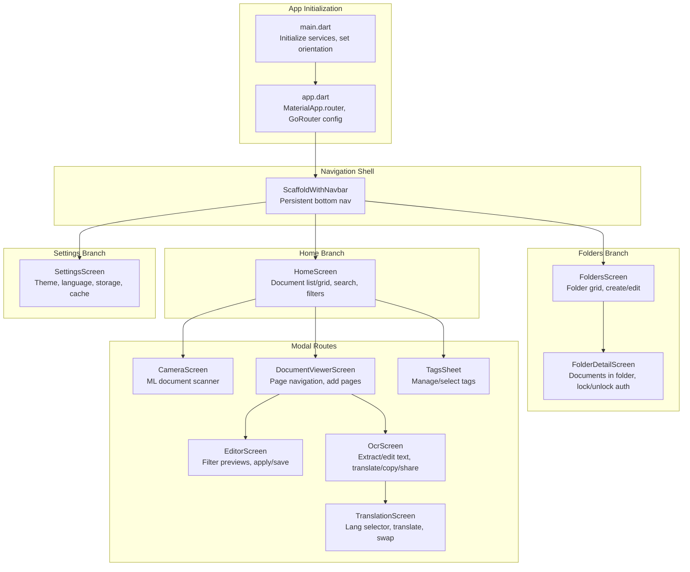
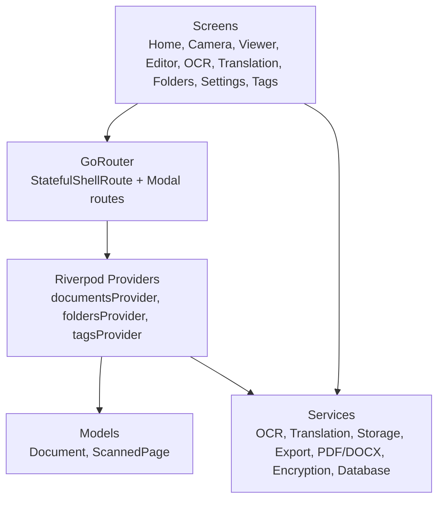
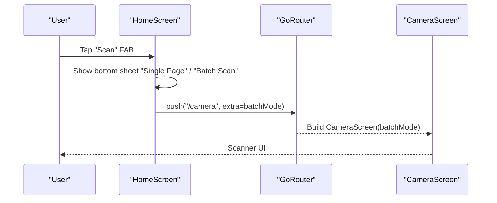
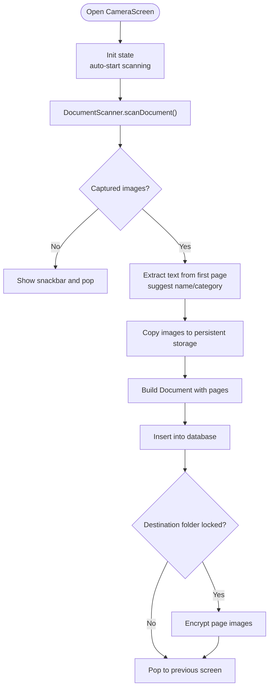
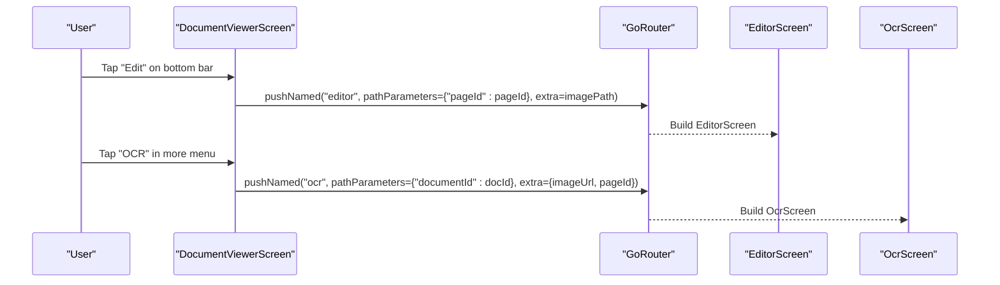
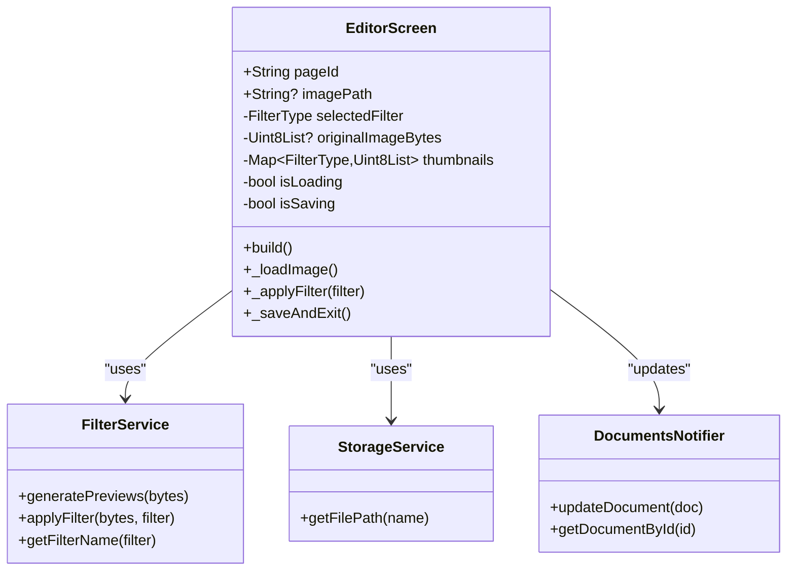
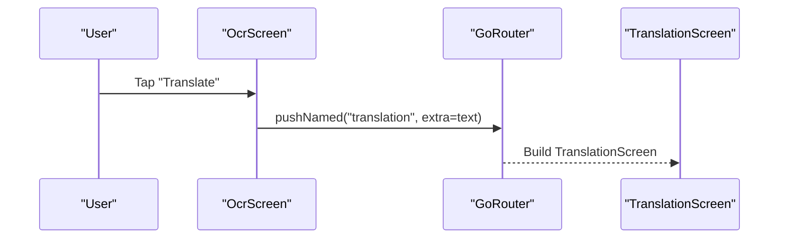
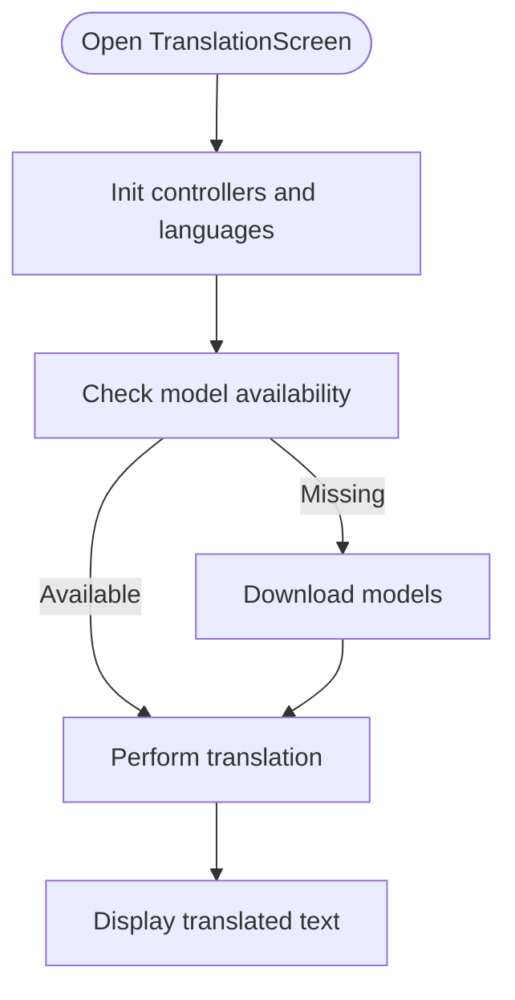
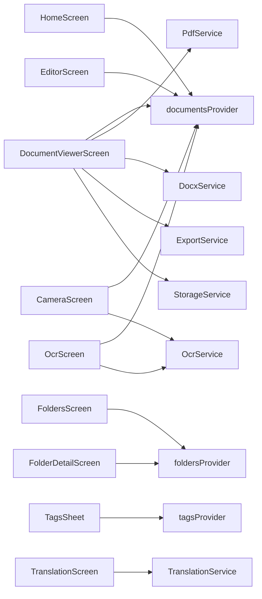

# Screen Features & Functionality

<cite>
**Referenced Files in This Document**
- [app.dart](file://lib/app.dart)
- [main.dart](file://lib/main.dart)
- [scaffold_with_navbar.dart](file://lib/widgets/scaffold_with_navbar.dart)
- [home_screen.dart](file://lib/screens/home/home_screen.dart)
- [camera_screen.dart](file://lib/screens/camera/camera_screen.dart)
- [document_viewer_screen.dart](file://lib/screens/document_viewer/document_viewer_screen.dart)
- [editor_screen.dart](file://lib/screens/editor/editor_screen.dart)
- [ocr_screen.dart](file://lib/screens/ocr/ocr_screen.dart)
- [translation_screen.dart](file://lib/screens/translation/translation_screen.dart)
- [folders_screen.dart](file://lib/screens/folders/folders_screen.dart)
- [folder_detail_screen.dart](file://lib/screens/folders/folder_detail_screen.dart)
- [settings_screen.dart](file://lib/screens/settings/settings_screen.dart)
- [tags_sheet.dart](file://lib/screens/tags/tags_sheet.dart)
- [document_provider.dart](file://lib/providers/document_provider.dart)
- [document.dart](file://lib/models/document.dart)
- [ocr_service.dart](file://lib/services/ocr_service.dart)
</cite>

## Table of Contents
1. [Introduction](#introduction)
2. [Project Structure](#project-structure)
3. [Core Components](#core-components)
4. [Architecture Overview](#architecture-overview)
5. [Detailed Component Analysis](#detailed-component-analysis)
6. [Dependency Analysis](#dependency-analysis)
7. [Performance Considerations](#performance-considerations)
8. [Troubleshooting Guide](#troubleshooting-guide)
9. [Conclusion](#conclusion)
10. [Appendices](#appendices)

## Introduction
This document explains ScanVault’s screen-based features and user workflows. It covers the Home Screen for document browsing, Camera Screen for document capture, Document Viewer for page navigation, Editor Screen for image enhancement, OCR Screen for text extraction, Translation Screen for language processing, Folders Screens for organization, Settings Screen for configuration, and Tags Sheet for categorization. It details navigation patterns, data flow between screens, user interaction workflows, lifecycle management, state preservation, performance optimization, UI patterns, gestures, and platform-specific adaptations. Integration patterns and usage examples are included for each screen component.

## Project Structure
ScanVault is a Flutter application using Riverpod for state management and GoRouter for navigation. The app initializes services, sets orientation preferences, and defines routes with a persistent bottom navigation shell. Screens are organized by feature under lib/screens, with shared UI widgets under lib/widgets and providers/services/models under lib/providers, lib/services, and lib/models respectively.



**Diagram sources**
- [main.dart](file://lib/main.dart#L10-L31)
- [app.dart](file://lib/app.dart#L67-L186)
- [scaffold_with_navbar.dart](file://lib/widgets/scaffold_with_navbar.dart#L26-L52)
- [home_screen.dart](file://lib/screens/home/home_screen.dart#L19-L320)
- [folders_screen.dart](file://lib/screens/folders/folders_screen.dart#L14-L282)
- [folder_detail_screen.dart](file://lib/screens/folders/folder_detail_screen.dart#L15-L245)
- [settings_screen.dart](file://lib/screens/settings/settings_screen.dart#L13-L389)
- [camera_screen.dart](file://lib/screens/camera/camera_screen.dart#L20-L242)
- [document_viewer_screen.dart](file://lib/screens/document_viewer/document_viewer_screen.dart#L24-L477)
- [editor_screen.dart](file://lib/screens/editor/editor_screen.dart#L15-L281)
- [ocr_screen.dart](file://lib/screens/ocr/ocr_screen.dart#L11-L178)
- [translation_screen.dart](file://lib/screens/translation/translation_screen.dart#L7-L285)
- [tags_sheet.dart](file://lib/screens/tags/tags_sheet.dart#L9-L176)

**Section sources**
- [main.dart](file://lib/main.dart#L10-L31)
- [app.dart](file://lib/app.dart#L67-L186)
- [scaffold_with_navbar.dart](file://lib/widgets/scaffold_with_navbar.dart#L26-L52)

## Core Components
- Navigation and Routing: GoRouter with StatefulShellRoute for persistent bottom navigation and modal routes for camera, editor, document viewer, OCR, and translation.
- State Management: Riverpod providers for documents, folders, tags, and UI state.
- Models: Document and ScannedPage with filter types and tagging metadata.
- Services: OCR, translation, storage, PDF/docx export, encryption, and database operations.
- UI Shell: ScaffoldWithNavbar provides bottom navigation with three branches: Home, Folders, Settings.

**Section sources**
- [app.dart](file://lib/app.dart#L67-L186)
- [document_provider.dart](file://lib/providers/document_provider.dart#L9-L137)
- [document.dart](file://lib/models/document.dart#L6-L49)

## Architecture Overview
The app follows a layered architecture:
- Presentation Layer: Screens and widgets.
- Navigation Layer: GoRouter routes and StatefulShellRoute.
- State Layer: Riverpod providers for documents, folders, tags.
- Service Layer: OCR, translation, export, storage, encryption, database.
- Model Layer: Freezed models for documents and pages.



**Diagram sources**
- [app.dart](file://lib/app.dart#L67-L186)
- [document_provider.dart](file://lib/providers/document_provider.dart#L9-L137)
- [document.dart](file://lib/models/document.dart#L16-L49)
- [ocr_service.dart](file://lib/services/ocr_service.dart#L6-L93)

## Detailed Component Analysis

### Home Screen
- Purpose: Browse documents, search, filter by tag, toggle layout, scan new documents.
- Key features:
  - Search bar with animated transitions.
  - Grid/list view toggle.
  - Tag filter via bottom sheet.
  - Empty state visuals.
  - Floating action button to choose Single Page vs Batch Scan.
- Data flow:
  - Watches documentsProvider for list updates.
  - Filters by search query, selected tag, and excludes documents inside locked folders.
  - Navigates to CameraScreen with batchMode flag.
  - Navigates to DocumentViewerScreen on tap.
  - Opens ShareOptionsDialog for export actions.
- Lifecycle and state:
  - Maintains internal state for search, grid/list, and selected tag.
  - Uses AsyncValue to render loading/error/empty states.
- Performance:
  - Efficient filtering in memory after fetching documents.
  - Animated UI for smooth UX.



**Diagram sources**
- [home_screen.dart](file://lib/screens/home/home_screen.dart#L288-L319)
- [app.dart](file://lib/app.dart#L120-L129)

**Section sources**
- [home_screen.dart](file://lib/screens/home/home_screen.dart#L19-L320)
- [document_provider.dart](file://lib/providers/document_provider.dart#L9-L54)

### Camera Screen (Batch and Single Page)
- Purpose: Capture documents using ML document scanner and auto-save to persistent storage.
- Key features:
  - Auto-start scanning on init.
  - Batch mode supports multiple pages; single mode saves quickly.
  - Smart naming and category detection via OCR and folder suggestions.
  - Thumbnail generation and encryption for locked folders.
- Data flow:
  - Uses DocumentScanner to capture images.
  - Copies captured images to app storage, builds ScannedPage entries.
  - Inserts Document into database via documentsProvider.
  - Optionally encrypts page images if destination folder is locked.
- Lifecycle:
  - initState triggers scanning; handles errors and navigates back on cancel.
- Performance:
  - Offloads heavy work to background; shows loading indicators.



**Diagram sources**
- [camera_screen.dart](file://lib/screens/camera/camera_screen.dart#L33-L216)

**Section sources**
- [camera_screen.dart](file://lib/screens/camera/camera_screen.dart#L20-L242)
- [ocr_service.dart](file://lib/services/ocr_service.dart#L9-L18)

### Document Viewer Screen
- Purpose: View document pages, navigate pages, add pages, export, edit, OCR, move to folder, manage tags.
- Key features:
  - PageView with InteractiveViewer for zoom/pan.
  - Bottom bar with share, edit, add page, delete, and more menu.
  - Add pages via scanner with pageLimit=100.
  - Export to PDF/DOCX/images with optional OCR inclusion and page selection.
  - Move to folder with lock-aware dialogs.
  - Manage tags via TagsSheet.
- Data flow:
  - Reads current document from documentsProvider.
  - Navigates to EditorScreen for page editing.
  - Navigates to OcrScreen for text extraction/editing.
  - Uses PdfService/DocxService/ExportService for export.
- Lifecycle:
  - PageController tracks current page index.
  - Shows overlay during long-running operations.



**Diagram sources**
- [document_viewer_screen.dart](file://lib/screens/document_viewer/document_viewer_screen.dart#L406-L422)
- [document_viewer_screen.dart](file://lib/screens/document_viewer/document_viewer_screen.dart#L123-L144)

**Section sources**
- [document_viewer_screen.dart](file://lib/screens/document_viewer/document_viewer_screen.dart#L24-L477)

### Editor Screen (Image Enhancement)
- Purpose: Apply filters to scanned images and persist processed versions.
- Key features:
  - Loads original image and generates filter thumbnails.
  - Applies filters asynchronously and previews results.
  - Saves processed image to storage and updates document page metadata.
  - Updates thumbnail if edited page is the first page.
- Data flow:
  - Uses FilterService to generate previews and apply filters.
  - Persists processed image via StorageService and updates document via documentsProvider.
- Lifecycle:
  - initState loads image; handles missing paths and errors.
- Performance:
  - Thumbnails reduce preview cost; writes processed image only when filter differs from original.



**Diagram sources**
- [editor_screen.dart](file://lib/screens/editor/editor_screen.dart#L15-L281)
- [document_provider.dart](file://lib/providers/document_provider.dart#L14-L54)

**Section sources**
- [editor_screen.dart](file://lib/screens/editor/editor_screen.dart#L15-L281)

### OCR Screen (Text Extraction)
- Purpose: Extract text from images, display, edit, save to document, translate, copy, share.
- Key features:
  - Auto-extract if initialText is empty.
  - Save edits back to the page’s OCR text.
  - Navigate to TranslationScreen with extracted text.
  - Copy to clipboard and share text.
- Data flow:
  - Uses OcrService to extract text from imageUrl.
  - Updates document via documentsProvider when saving.
- Lifecycle:
  - initState initializes controller and triggers extraction if needed.



**Diagram sources**
- [ocr_screen.dart](file://lib/screens/ocr/ocr_screen.dart#L132-L137)

**Section sources**
- [ocr_screen.dart](file://lib/screens/ocr/ocr_screen.dart#L11-L178)
- [ocr_service.dart](file://lib/services/ocr_service.dart#L9-L18)

### Translation Screen (Language Processing)
- Purpose: Translate text between languages with model download and swap.
- Key features:
  - Language dropdowns for source/target.
  - Download translation models if needed.
  - Swap languages and translate.
  - Copy translated text.
- Data flow:
  - Uses TranslationService to check/download models and perform translation.
- Lifecycle:
  - initState translates if initialText is provided.



**Diagram sources**
- [translation_screen.dart](file://lib/screens/translation/translation_screen.dart#L51-L90)

**Section sources**
- [translation_screen.dart](file://lib/screens/translation/translation_screen.dart#L7-L285)

### Folders Screens (Organization)
- Folders Screen:
  - Grid of folders with icons/colors.
  - Create new folder with name, color, and icon.
  - Edit folder (rename, change icon/color, lock/unlock).
  - Lock/unlock requires biometric authentication; encrypts/decrypts images.
- Folder Detail Screen:
  - Lists documents in a folder.
  - Locked folders require authentication before showing contents.
  - Rename/delete folder actions.

```mermaid
sequenceDiagram
participant U as "User"
participant FS as "FoldersScreen"
participant FD as "FolderDetailScreen"
participant AS as "AuthService"
participant ES as "EncryptionService"
U->>FS : Tap folder
FS->>FD : push("/folders/ : folderId")
alt Folder locked
FD->>AS : Authenticate(reason)
AS-->>FD : Auth result
opt Auth success
FD-->>U : Show folder contents
opt Auth failure
FD-->>U : Show lock prompt
end
else Unlocked
FD-->>U : Show folder contents
end
```

**Diagram sources**
- [folders_screen.dart](file://lib/screens/folders/folders_screen.dart#L284-L680)
- [folder_detail_screen.dart](file://lib/screens/folders/folder_detail_screen.dart#L48-L97)

**Section sources**
- [folders_screen.dart](file://lib/screens/folders/folders_screen.dart#L14-L680)
- [folder_detail_screen.dart](file://lib/screens/folders/folder_detail_screen.dart#L15-L245)

### Settings Screen (Configuration)
- Purpose: Configure theme, language, storage location, and clear cache.
- Key features:
  - Theme mode selection (system/light/dark).
  - System accent color toggle.
  - Language picker with localized names.
  - Storage location picker (default/custom) with write verification.
  - Clear cache dialog and action.
- Data flow:
  - Uses themeProvider, localeProvider, and storageProvider to apply changes.

**Section sources**
- [settings_screen.dart](file://lib/screens/settings/settings_screen.dart#L13-L389)

### Tags Sheet (Categorization)
- Purpose: Create, select, and delete tags; attach to documents.
- Key features:
  - Create new tag with color.
  - Select/deselect tags in selection mode.
  - Delete tag with confirmation.
- Data flow:
  - Uses tagsProvider to manage tag list and updates document tagIds via onTagSelected callback.

**Section sources**
- [tags_sheet.dart](file://lib/screens/tags/tags_sheet.dart#L9-L176)
- [document_provider.dart](file://lib/providers/document_provider.dart#L104-L137)

## Dependency Analysis
- Navigation dependencies:
  - app.dart defines routes and shells; ScaffoldWithNavbar hosts the bottom navigation.
- State dependencies:
  - HomeScreen, DocumentViewerScreen, Folders Screens depend on documentsProvider, foldersProvider, tagsProvider.
- Service dependencies:
  - CameraScreen depends on OCRService, SmartNamingService, EncryptionService, DatabaseService.
  - DocumentViewerScreen depends on PdfService, DocxService, ExportService, StorageService.
  - OCRScreen depends on OcrService.
  - TranslationScreen depends on TranslationService.
- Model dependencies:
  - Document and ScannedPage define page metadata and filter state.



**Diagram sources**
- [app.dart](file://lib/app.dart#L67-L186)
- [document_provider.dart](file://lib/providers/document_provider.dart#L9-L137)
- [camera_screen.dart](file://lib/screens/camera/camera_screen.dart#L11-L18)
- [document_viewer_screen.dart](file://lib/screens/document_viewer/document_viewer_screen.dart#L12-L22)
- [ocr_screen.dart](file://lib/screens/ocr/ocr_screen.dart#L7-L9)
- [translation_screen.dart](file://lib/screens/translation/translation_screen.dart#L4-L5)

**Section sources**
- [app.dart](file://lib/app.dart#L67-L186)
- [document_provider.dart](file://lib/providers/document_provider.dart#L9-L137)

## Performance Considerations
- Asynchronous rendering: Screens use AsyncValue to avoid blocking UI during data fetches.
- Lazy loading: Images loaded on demand; thumbnails for filters reduce preview cost.
- Background processing: OCR, translation, encryption, and export operations run off the UI thread.
- Minimal recompositions: Riverpod providers isolate state changes to affected widgets.
- Memory management: Dispose of controllers and close OCR resources when screens are disposed.

## Troubleshooting Guide
- Camera errors:
  - Errors caught and surfaced via SnackBar; screen pops back to prevent stuck UI.
- OCR failures:
  - Errors shown via SnackBar; fallback to manual editing.
- Translation model downloads:
  - Gracefully handle missing models and show progress indicator.
- Export failures:
  - Catch exceptions and notify user via SnackBar.
- Authentication prompts:
  - Locked folders require biometric auth; handle failure gracefully.

**Section sources**
- [camera_screen.dart](file://lib/screens/camera/camera_screen.dart#L65-L74)
- [ocr_screen.dart](file://lib/screens/ocr/ocr_screen.dart#L62-L69)
- [translation_screen.dart](file://lib/screens/translation/translation_screen.dart#L81-L89)
- [document_viewer_screen.dart](file://lib/screens/document_viewer/document_viewer_screen.dart#L191-L197)
- [folder_detail_screen.dart](file://lib/screens/folders/folder_detail_screen.dart#L54-L92)

## Conclusion
ScanVault’s screen architecture leverages Riverpod for reactive state, GoRouter for robust navigation, and modular services for specialized tasks. Users can efficiently capture, organize, enhance, process, and export documents with intuitive workflows. The design emphasizes performance, resilience, and platform-appropriate UX patterns.

## Appendices
- Usage examples:
  - Home Screen: Choose “Batch Scan” to capture multiple pages; “Single Page” for quick capture.
  - Document Viewer: Add pages via scanner; edit via filters; export to PDF/DOCX/images.
  - Editor: Preview filter thumbnails; apply and save processed image.
  - OCR: Extract text; translate via Translation Screen; copy/share.
  - Folders: Create categories; lock/unlock with biometrics; move documents.
  - Settings: Change theme/language; configure storage; clear cache.
  - Tags: Create categories; attach to documents via TagsSheet.