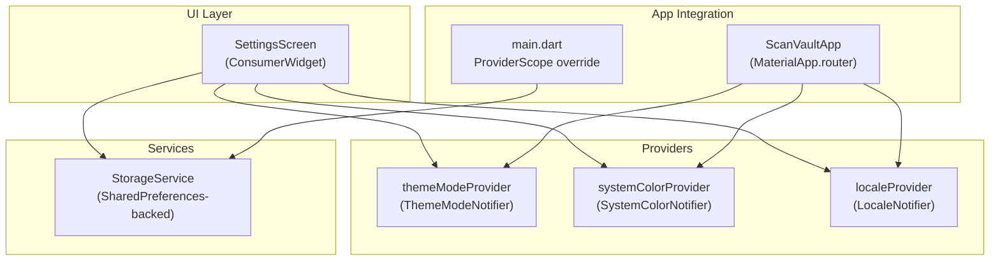
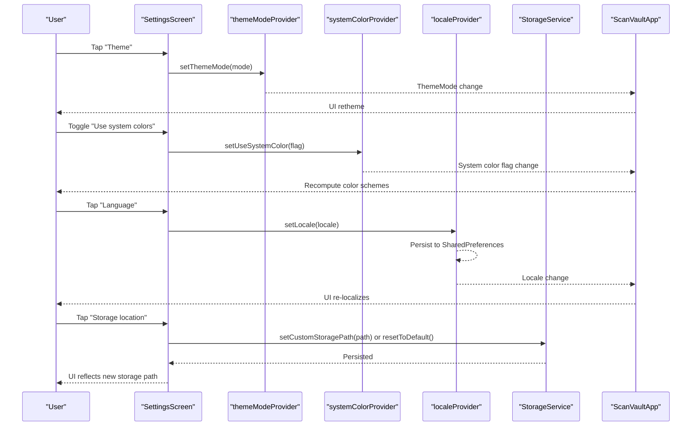
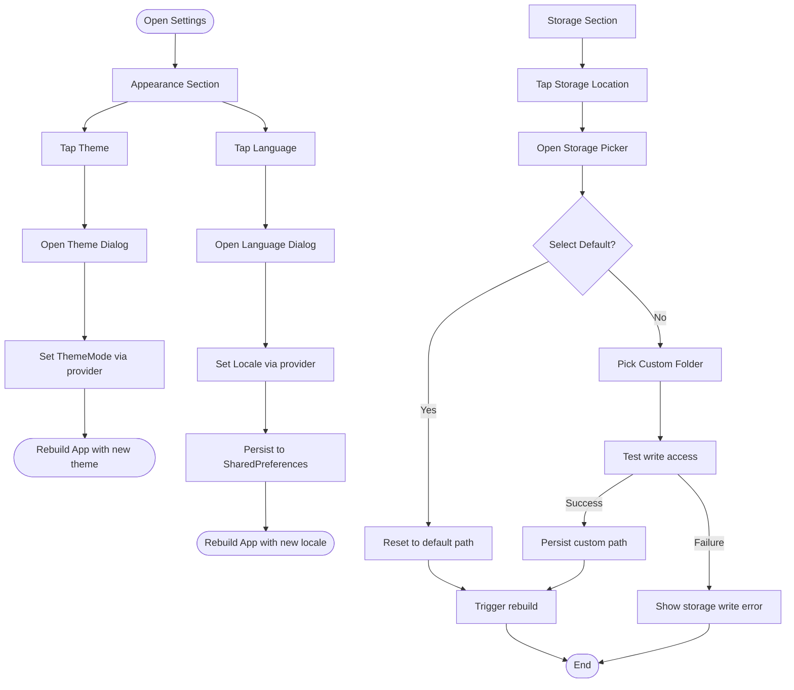
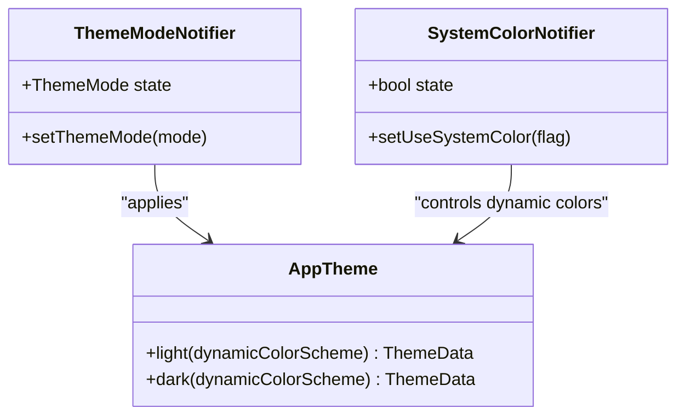
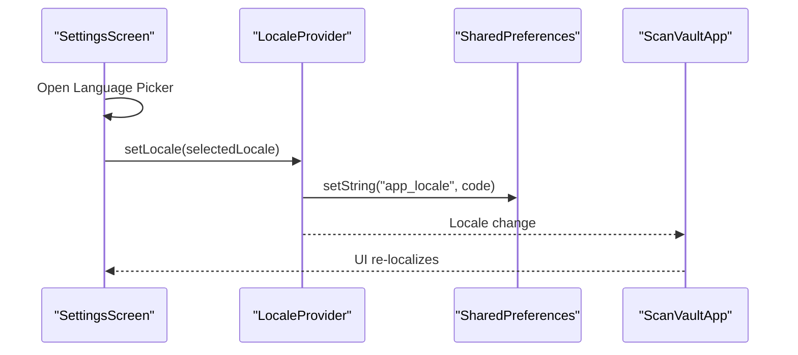
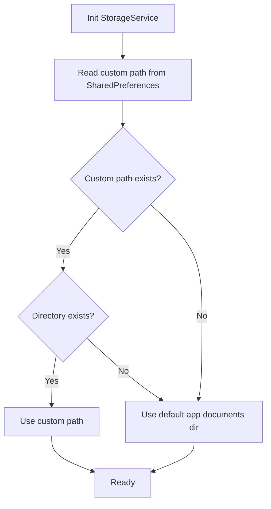
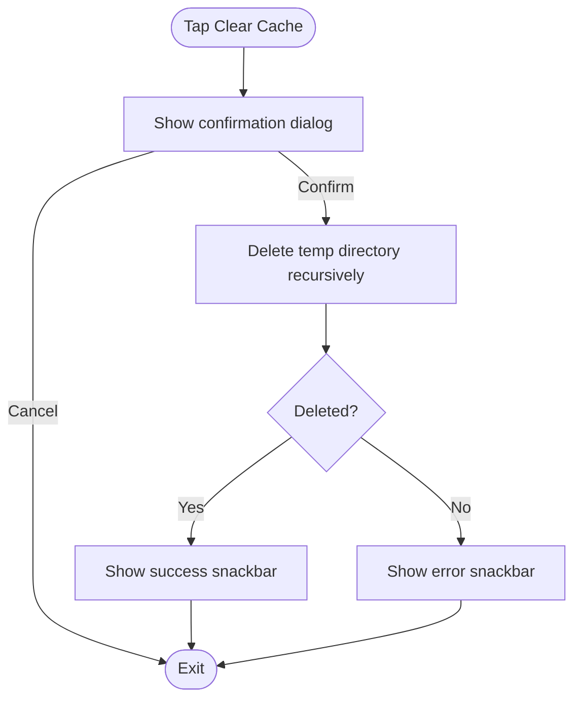
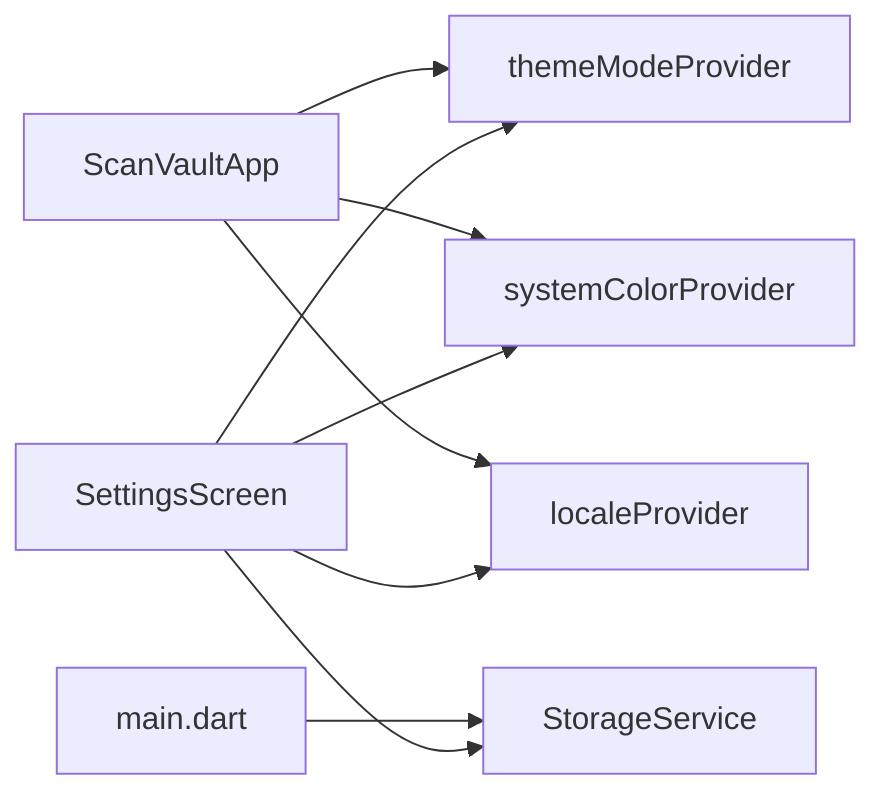

# Settings Screen

<cite>
**Referenced Files in This Document**
- [settings_screen.dart](file://lib/screens/settings/settings_screen.dart)
- [theme_provider.dart](file://lib/providers/theme_provider.dart)
- [locale_provider.dart](file://lib/providers/locale_provider.dart)
- [storage_service.dart](file://lib/services/storage_service.dart)
- [app.dart](file://lib/app.dart)
- [main.dart](file://lib/main.dart)
- [app_theme.dart](file://lib/theme/app_theme.dart)
- [color_schemes.dart](file://lib/theme/color_schemes.dart)
- [app_en.arb](file://lib/l10n/app_en.arb)
- [app_localizations.dart](file://lib/l10n/app_localizations.dart)
</cite>

## Table of Contents
1. [Introduction](#introduction)
2. [Project Structure](#project-structure)
3. [Core Components](#core-components)
4. [Architecture Overview](#architecture-overview)
5. [Detailed Component Analysis](#detailed-component-analysis)
6. [Dependency Analysis](#dependency-analysis)
7. [Performance Considerations](#performance-considerations)
8. [Troubleshooting Guide](#troubleshooting-guide)
9. [Conclusion](#conclusion)
10. [Appendices](#appendices)

## Introduction
This document describes the Settings Screen component that provides application configuration and customization options. It covers theme management, language selection, storage configuration, and performance-related settings such as cache clearing. It also explains how providers deliver reactive updates, how localization integrates with the settings UI, and how storage preferences persist across sessions. Guidance is included for extending the settings interface with new options and customizing behavior while maintaining consistency with the existing architecture.

## Project Structure
The Settings Screen is implemented as a consumer widget that reads from Riverpod providers and invokes services for persistence and IO. Providers encapsulate state for theme mode, system color usage, and locale. A storage service manages custom storage paths and default directories. Localization keys are defined centrally and consumed by the settings UI.

**Diagram sources**
- [settings_screen.dart](file://lib/screens/settings/settings_screen.dart#L13-L120)
- [theme_provider.dart](file://lib/providers/theme_provider.dart#L5-L28)
- [locale_provider.dart](file://lib/providers/locale_provider.dart#L5-L30)
- [storage_service.dart](file://lib/services/storage_service.dart#L8-L62)
- [app.dart](file://lib/app.dart#L23-L61)
- [main.dart](file://lib/main.dart#L20-L30)

**Section sources**
- [settings_screen.dart](file://lib/screens/settings/settings_screen.dart#L1-L120)
- [app.dart](file://lib/app.dart#L23-L61)
- [main.dart](file://lib/main.dart#L20-L30)

## Core Components
- SettingsScreen: Presents appearance, storage, and about sections; handles theme selection, language selection, storage location picker, and cache clearing.
- Theme provider: Manages ThemeMode and “use system colors” toggle.
- Locale provider: Loads and persists the selected language via SharedPreferences.
- Storage service: Persists custom storage path and resolves the effective storage directory.
- App integration: Registers providers and applies theme/locale to the app shell.

Key responsibilities:
- Reactive updates: Consumers watch providers and rebuild when state changes.
- Persistence: SharedPreferences stores locale and storage path.
- Localization: Centralized keys drive UI labels and dialogs.
- Theme application: DynamicColorBuilder and AppTheme apply color schemes.

**Section sources**
- [settings_screen.dart](file://lib/screens/settings/settings_screen.dart#L13-L120)
- [theme_provider.dart](file://lib/providers/theme_provider.dart#L5-L28)
- [locale_provider.dart](file://lib/providers/locale_provider.dart#L5-L30)
- [storage_service.dart](file://lib/services/storage_service.dart#L8-L62)
- [app.dart](file://lib/app.dart#L23-L61)

## Architecture Overview
The Settings Screen composes three major categories:
- Appearance: Theme mode, system colors, and language.
- Storage: Storage location and cache clearing.
- About: Version, licenses, and developer info.

**Diagram sources**
- [settings_screen.dart](file://lib/screens/settings/settings_screen.dart#L122-L161)
- [settings_screen.dart](file://lib/screens/settings/settings_screen.dart#L220-L268)
- [theme_provider.dart](file://lib/providers/theme_provider.dart#L9-L28)
- [locale_provider.dart](file://lib/providers/locale_provider.dart#L24-L29)
- [storage_service.dart](file://lib/services/storage_service.dart#L29-L37)
- [app.dart](file://lib/app.dart#L33-L61)

## Detailed Component Analysis

### SettingsScreen
Responsibilities:
- Build appearance section: language, theme, and system colors.
- Build storage section: storage location and cache clearing.
- Build about section: version, licenses, and developer info.
- React to provider changes via Consumer and ref.watch/ref.read.
- Validate storage writes before persisting.

User flows:
- Theme switching: opens a dialog with radio options; selecting a theme updates ThemeMode.
- Language switching: opens a dialog with selectable languages; selection updates Locale and persists.
- Storage location: offers default/internal or custom folder; validates write access before persisting; includes reset-to-default.
- Clear cache: confirms action and deletes temporary directory.

**Diagram sources**
- [settings_screen.dart](file://lib/screens/settings/settings_screen.dart#L122-L161)
- [settings_screen.dart](file://lib/screens/settings/settings_screen.dart#L220-L268)
- [settings_screen.dart](file://lib/screens/settings/settings_screen.dart#L164-L207)

**Section sources**
- [settings_screen.dart](file://lib/screens/settings/settings_screen.dart#L13-L120)
- [settings_screen.dart](file://lib/screens/settings/settings_screen.dart#L122-L161)
- [settings_screen.dart](file://lib/screens/settings/settings_screen.dart#L164-L207)
- [settings_screen.dart](file://lib/screens/settings/settings_screen.dart#L220-L268)

### Theme Management
- ThemeMode provider: Tracks current mode (system/light/dark) and exposes setter.
- System colors toggle: When enabled, DynamicColorBuilder supplies dynamic color schemes; otherwise, fixed color schemes are used.
- AppTheme: Provides ThemeData for light/dark modes with Material 3 configuration.

**Diagram sources**
- [theme_provider.dart](file://lib/providers/theme_provider.dart#L9-L28)
- [app_theme.dart](file://lib/theme/app_theme.dart#L8-L250)
- [color_schemes.dart](file://lib/theme/color_schemes.dart#L10-L76)

**Section sources**
- [theme_provider.dart](file://lib/providers/theme_provider.dart#L5-L28)
- [app_theme.dart](file://lib/theme/app_theme.dart#L8-L250)
- [color_schemes.dart](file://lib/theme/color_schemes.dart#L10-L76)

### Language Selection
- Locale provider: Initializes with default locale, loads persisted locale from SharedPreferences, and exposes setLocale.
- SettingsScreen: Presents a language picker dialog with localized labels and marks the selected language.
- App integration: MaterialApp.router uses AppLocalizations and supported locales.

**Diagram sources**
- [settings_screen.dart](file://lib/screens/settings/settings_screen.dart#L270-L312)
- [locale_provider.dart](file://lib/providers/locale_provider.dart#L24-L29)
- [app.dart](file://lib/app.dart#L51-L57)

**Section sources**
- [locale_provider.dart](file://lib/providers/locale_provider.dart#L5-L30)
- [settings_screen.dart](file://lib/screens/settings/settings_screen.dart#L270-L312)
- [app_localizations.dart](file://lib/l10n/app_localizations.dart#L104-L115)
- [app_en.arb](file://lib/l10n/app_en.arb#L18-L19)

### Storage Configuration
- StorageService: Initializes with SharedPreferences, persists custom path, and resolves effective storage directory.
- SettingsScreen: Allows choosing default/internal or custom folder; tests write access; supports reset-to-default; displays current storage path.
- Default behavior: Uses application documents directory with a dedicated subfolder when no custom path is set.

**Diagram sources**
- [storage_service.dart](file://lib/services/storage_service.dart#L18-L61)
- [settings_screen.dart](file://lib/screens/settings/settings_screen.dart#L220-L268)

**Section sources**
- [storage_service.dart](file://lib/services/storage_service.dart#L8-L62)
- [settings_screen.dart](file://lib/screens/settings/settings_screen.dart#L60-L93)
- [settings_screen.dart](file://lib/screens/settings/settings_screen.dart#L220-L268)

### Performance Settings: Clear Cache
- SettingsScreen triggers a confirmation dialog before clearing the temporary directory.
- On success, shows a snackbar; on failure, shows an error snackbar with details.

**Diagram sources**
- [settings_screen.dart](file://lib/screens/settings/settings_screen.dart#L164-L207)

**Section sources**
- [settings_screen.dart](file://lib/screens/settings/settings_screen.dart#L164-L207)

### Localization and Settings Categories
- Localization keys: Centralized in AppLocalizations and ARB files. Keys include settingsAppearance, settingsLanguage, settingsTheme, settingsStorageHeader, storageInternal, resetToDefault, freeUpSpace, chooseTheme, clearCacheTitle/message, clear, cacheCleared, storageLocation, storageDefault, storageCustom, storageWriteError, chooseLanguage, and useSystemColor.
- Settings categories: Appearance, Storage, About. Each category header and items are localized.

**Section sources**
- [app_localizations.dart](file://lib/l10n/app_localizations.dart#L104-L115)
- [app_en.arb](file://lib/l10n/app_en.arb#L18-L19)
- [app_en.arb](file://lib/l10n/app_en.arb#L96-L99)
- [app_en.arb](file://lib/l10n/app_en.arb#L100-L103)
- [app_en.arb](file://lib/l10n/app_en.arb#L110-L113)
- [app_en.arb](file://lib/l10n/app_en.arb#L116)

## Dependency Analysis
- SettingsScreen depends on:
  - themeModeProvider and systemColorProvider for theme state.
  - localeProvider for language state.
  - storageServiceProvider for storage configuration.
- App integration depends on:
  - themeModeProvider and systemColorProvider for theme application.
  - localeProvider for localization.
- StorageService depends on SharedPreferences and path_provider for persistence and directory resolution.

**Diagram sources**
- [settings_screen.dart](file://lib/screens/settings/settings_screen.dart#L18-L19)
- [app.dart](file://lib/app.dart#L28-L30)
- [main.dart](file://lib/main.dart#L20-L29)

**Section sources**
- [settings_screen.dart](file://lib/screens/settings/settings_screen.dart#L1-L120)
- [app.dart](file://lib/app.dart#L23-L61)
- [main.dart](file://lib/main.dart#L20-L30)

## Performance Considerations
- Theme and locale changes trigger rebuilds; keep rebuild scope minimal by watching only necessary providers in consumers.
- Storage path resolution is lightweight; avoid frequent disk checks in UI.
- Cache clearing deletes temporary files; ensure it runs off the UI thread and avoids blocking the main thread.
- Use Consumer only where needed to reduce unnecessary rebuilds.

## Troubleshooting Guide
Common issues and resolutions:
- Theme not updating: Ensure ThemeMode is set via the notifier and that the app is consuming the provider.
- Language not changing: Verify setLocale persists to SharedPreferences and that the app rebuilds with the new locale.
- Storage path not applied: Confirm custom path exists and is writable; on write failure, show the localized error message.
- Cache clear fails: Check permissions and available storage; display the localized error snackbar.

Validation and defaults:
- Default theme mode is system; default locale is English; default storage is internal app directory.
- Use reset-to-default options for theme, storage path, and potentially other settings to restore defaults.

**Section sources**
- [theme_provider.dart](file://lib/providers/theme_provider.dart#L9-L14)
- [locale_provider.dart](file://lib/providers/locale_provider.dart#L12-L22)
- [storage_service.dart](file://lib/services/storage_service.dart#L25-L37)
- [settings_screen.dart](file://lib/screens/settings/settings_screen.dart#L252-L266)
- [settings_screen.dart](file://lib/screens/settings/settings_screen.dart#L190-L206)

## Conclusion
The Settings Screen integrates tightly with Riverpod providers and services to offer a responsive, localized configuration experience. Theme, language, and storage settings are persisted reliably, and the UI reacts immediately to user changes. The architecture supports easy extension with new settings categories and options while preserving consistency with Material 3 theming and internationalization.

## Appendices

### Adding New Settings Options
Steps to add a new setting:
1. Define a new provider (StateNotifier-based) for the setting’s state.
2. Add a new section or item in SettingsScreen and wire it to the provider.
3. If persistence is needed, persist values to SharedPreferences or another storage mechanism.
4. Update localization keys and ARB files for the new UI labels.
5. Integrate the provider in the app shell if global effects are required.

Example references:
- Theme provider pattern: [theme_provider.dart](file://lib/providers/theme_provider.dart#L5-L28)
- Locale provider pattern: [locale_provider.dart](file://lib/providers/locale_provider.dart#L5-L30)
- Storage service pattern: [storage_service.dart](file://lib/services/storage_service.dart#L8-L62)
- Localization keys: [app_en.arb](file://lib/l10n/app_en.arb#L116)

**Section sources**
- [theme_provider.dart](file://lib/providers/theme_provider.dart#L5-L28)
- [locale_provider.dart](file://lib/providers/locale_provider.dart#L5-L30)
- [storage_service.dart](file://lib/services/storage_service.dart#L8-L62)
- [app_en.arb](file://lib/l10n/app_en.arb#L116)