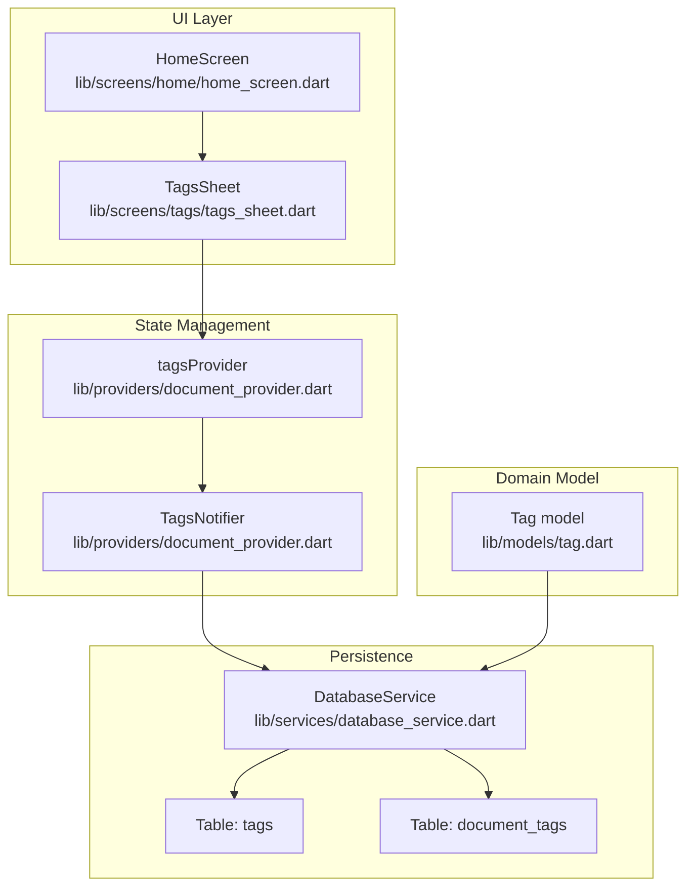
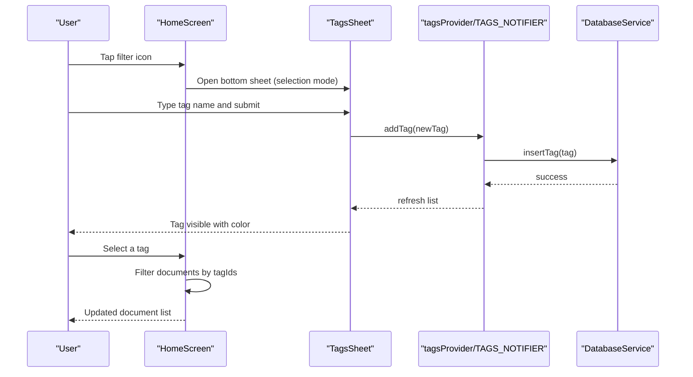
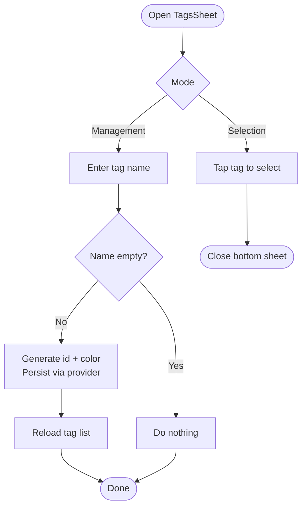
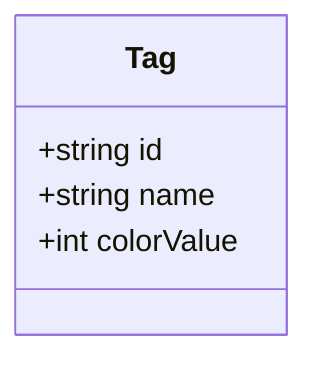
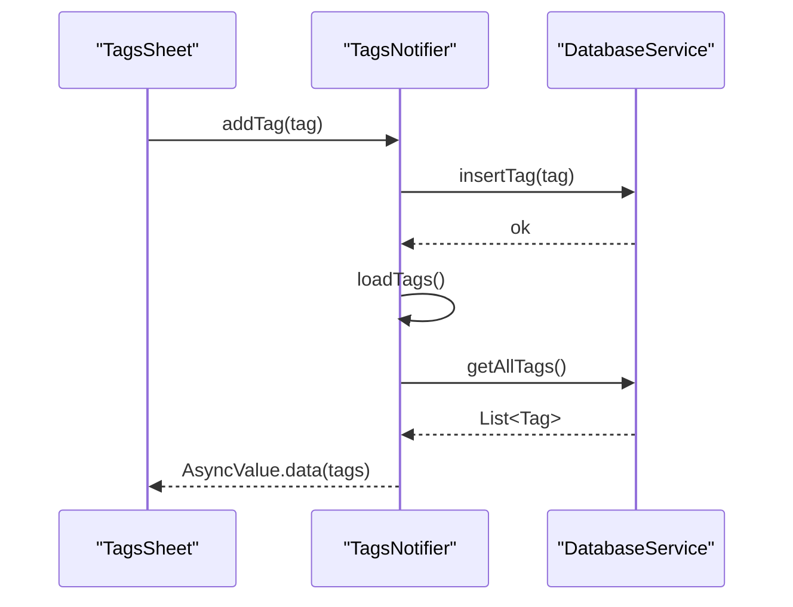
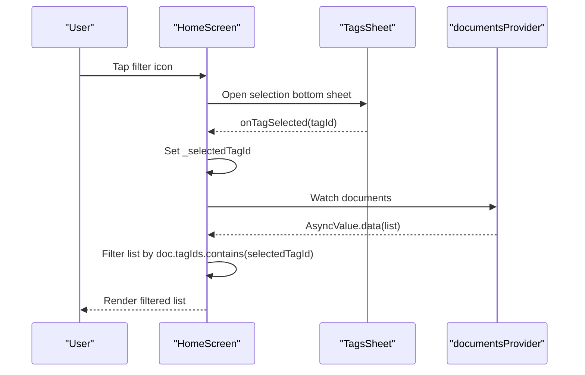
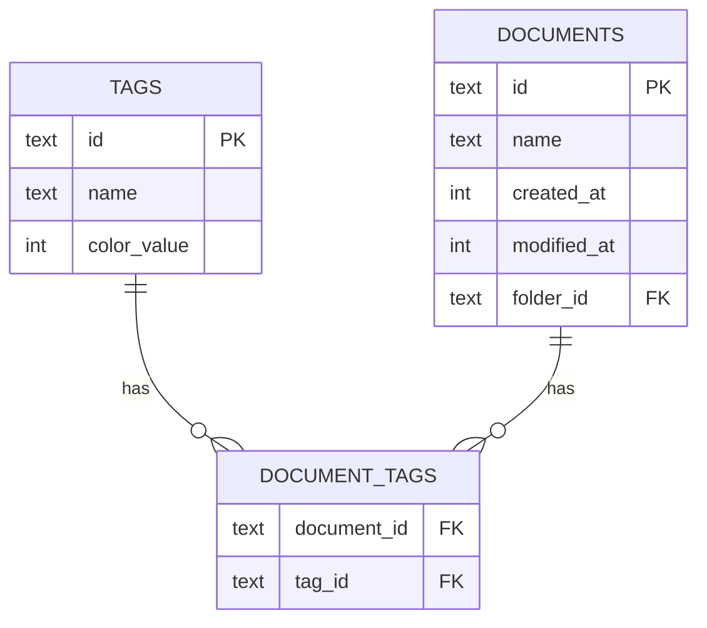
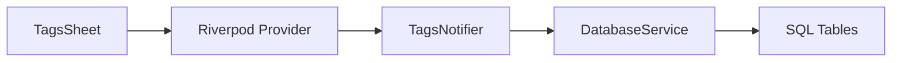

# Tags Sheet

<cite>
**Referenced Files in This Document**
- [tags_sheet.dart](file://lib/screens/tags/tags_sheet.dart)
- [tag.dart](file://lib/models/tag.dart)
- [tag.freezed.dart](file://lib/models/tag.freezed.dart)
- [tag.g.dart](file://lib/models/tag.g.dart)
- [document_provider.dart](file://lib/providers/document_provider.dart)
- [database_service.dart](file://lib/services/database_service.dart)
- [home_screen.dart](file://lib/screens/home/home_screen.dart)
- [document.dart](file://lib/models/document.dart)
</cite>

## Table of Contents
1. [Introduction](#introduction)
2. [Project Structure](#project-structure)
3. [Core Components](#core-components)
4. [Architecture Overview](#architecture-overview)
5. [Detailed Component Analysis](#detailed-component-analysis)
6. [Dependency Analysis](#dependency-analysis)
7. [Performance Considerations](#performance-considerations)
8. [Troubleshooting Guide](#troubleshooting-guide)
9. [Conclusion](#conclusion)

## Introduction
This document explains the Tags Sheet component responsible for document categorization and tagging. It covers how tags are created, colored, and associated with documents, how the tag management interface works, how tag-based filtering integrates with the document list, and how tag data is persisted. It also provides guidance on extending the tagging system, including potential enhancements for tag hierarchy, search, bulk operations, and statistics.

## Project Structure
The Tags Sheet is part of the UI layer and interacts with Riverpod providers and the database service. Tags are modeled as a lightweight entity with an identifier, name, and color value. Documents maintain a list of tag identifiers to establish many-to-many relationships with tags.

**Diagram sources**
- [tags_sheet.dart](file://lib/screens/tags/tags_sheet.dart#L1-L176)
- [home_screen.dart](file://lib/screens/home/home_screen.dart#L96-L116)
- [document_provider.dart](file://lib/providers/document_provider.dart#L103-L136)
- [tag.dart](file://lib/models/tag.dart#L6-L16)
- [database_service.dart](file://lib/services/database_service.dart#L72-L90)

**Section sources**
- [tags_sheet.dart](file://lib/screens/tags/tags_sheet.dart#L1-L176)
- [document_provider.dart](file://lib/providers/document_provider.dart#L103-L136)
- [database_service.dart](file://lib/services/database_service.dart#L72-L90)

## Core Components
- TagsSheet: A bottom sheet UI for selecting or managing tags. Supports creating new tags with auto-assigned colors and deleting existing tags. Displays tags in a scrollable list with color-coded indicators.
- TagsNotifier: A Riverpod notifier that loads, adds, and deletes tags, delegating persistence to the database service.
- Tag model: A simple immutable record with id, name, and colorValue, generated via Freezed and JSON serialization.
- DatabaseService: Provides CRUD operations for tags and resolves tag associations for documents.

Key responsibilities:
- Tag creation: Generates a unique id, computes a color from the tag name, and persists the tag.
- Tag deletion: Prompts for confirmation and removes the tag from storage.
- Tag listing: Loads all tags sorted by name for display.
- Tag association: Documents store tagIds; the database service retrieves tagIds per document.

**Section sources**
- [tags_sheet.dart](file://lib/screens/tags/tags_sheet.dart#L29-L73)
- [document_provider.dart](file://lib/providers/document_provider.dart#L109-L136)
- [tag.dart](file://lib/models/tag.dart#L6-L16)
- [database_service.dart](file://lib/services/database_service.dart#L376-L412)

## Architecture Overview
The Tags Sheet participates in two primary workflows:
- Tag management: Users create or delete tags via the bottom sheet.
- Tag-based filtering: Users pick a tag to filter documents in the Home screen.

**Diagram sources**
- [home_screen.dart](file://lib/screens/home/home_screen.dart#L96-L116)
- [tags_sheet.dart](file://lib/screens/tags/tags_sheet.dart#L29-L48)
- [document_provider.dart](file://lib/providers/document_provider.dart#L125-L129)
- [database_service.dart](file://lib/services/database_service.dart#L376-L383)

## Detailed Component Analysis

### TagsSheet UI and Interaction
- Selection mode: Opens from the Home screen, allows choosing a single tag to filter documents. Selected tag is highlighted.
- Management mode: Displays all tags with delete actions; supports creating new tags via a text field.
- Color coding: Each tag displays a circle avatar filled with its colorValue.
- Creation flow: Trims input, prevents empty names, generates a unique id, assigns a color derived from the name length, and persists the tag.
- Deletion flow: Shows a confirmation dialog; on acceptance, deletes the tag.

**Diagram sources**
- [tags_sheet.dart](file://lib/screens/tags/tags_sheet.dart#L29-L48)
- [tags_sheet.dart](file://lib/screens/tags/tags_sheet.dart#L50-L73)

**Section sources**
- [tags_sheet.dart](file://lib/screens/tags/tags_sheet.dart#L75-L170)

### Tag Model and Serialization
- Tag is a Freezed record with id, name, and colorValue.
- JSON serialization/deserialization is generated automatically.
- Default color is embedded in the model definition.

**Diagram sources**
- [tag.dart](file://lib/models/tag.dart#L8-L13)
- [tag.freezed.dart](file://lib/models/tag.freezed.dart#L180-L195)
- [tag.g.dart](file://lib/models/tag.g.dart#L9-L19)

**Section sources**
- [tag.dart](file://lib/models/tag.dart#L6-L16)
- [tag.freezed.dart](file://lib/models/tag.freezed.dart#L18-L35)
- [tag.g.dart](file://lib/models/tag.g.dart#L9-L19)

### Tag Management Provider and Persistence
- tagsProvider initializes a TagsNotifier that loads tags on creation.
- TagsNotifier exposes loadTags, addTag, and deleteTag.
- DatabaseService implements insertTag, getAllTags, getTagIdsForDocument, and deleteTag.

**Diagram sources**
- [document_provider.dart](file://lib/providers/document_provider.dart#L125-L136)
- [database_service.dart](file://lib/services/database_service.dart#L376-L395)

**Section sources**
- [document_provider.dart](file://lib/providers/document_provider.dart#L109-L136)
- [database_service.dart](file://lib/services/database_service.dart#L376-L412)

### Tag-Based Filtering in Home Screen
- The Home screen opens TagsSheet in selection mode and toggles a selected tag id.
- The document list is filtered client-side by matching document.tagIds against the selected tag id.
- Tag color is visually indicated on the filter icon when a tag is selected.

**Diagram sources**
- [home_screen.dart](file://lib/screens/home/home_screen.dart#L96-L116)
- [home_screen.dart](file://lib/screens/home/home_screen.dart#L178-L190)

**Section sources**
- [home_screen.dart](file://lib/screens/home/home_screen.dart#L92-L116)
- [home_screen.dart](file://lib/screens/home/home_screen.dart#L178-L190)

### Tag Association with Documents
- Documents store tagIds as a list.
- On document insertion, tag associations are written to the document_tags junction table.
- Retrieval of tagIds per document is supported by a dedicated query.

**Diagram sources**
- [database_service.dart](file://lib/services/database_service.dart#L72-L90)
- [database_service.dart](file://lib/services/database_service.dart#L137-L143)
- [database_service.dart](file://lib/services/database_service.dart#L397-L406)
- [document.dart](file://lib/models/document.dart#L24)

**Section sources**
- [document.dart](file://lib/models/document.dart#L16-L32)
- [database_service.dart](file://lib/services/database_service.dart#L137-L143)
- [database_service.dart](file://lib/services/database_service.dart#L397-L406)

## Dependency Analysis
- UI depends on Riverpod for reactive state and on localization for labels.
- TagsSheet depends on tagsProvider for tag lifecycle operations.
- tagsProvider depends on DatabaseService for persistence.
- DatabaseService encapsulates SQL operations and maintains indexes for performance.

**Diagram sources**
- [tags_sheet.dart](file://lib/screens/tags/tags_sheet.dart#L77)
- [document_provider.dart](file://lib/providers/document_provider.dart#L103-L136)
- [database_service.dart](file://lib/services/database_service.dart#L30-L97)

**Section sources**
- [tags_sheet.dart](file://lib/screens/tags/tags_sheet.dart#L1-L23)
- [document_provider.dart](file://lib/providers/document_provider.dart#L103-L136)
- [database_service.dart](file://lib/services/database_service.dart#L30-L97)

## Performance Considerations
- Current queries:
  - getAllTags sorts tags by name; consider adding an index on the name column if sorting becomes a bottleneck.
  - getTagIdsForDocument uses a simple indexed lookup on document_id in the junction table.
- Recommendations:
  - Add an index on tags(name) to accelerate sorting and searching.
  - Consider caching tag lists in memory if the dataset grows large.
  - Batch operations: when assigning multiple tags to many documents, batch inserts into document_tags to reduce round-trips.
  - Pagination: if tag lists grow large, paginate tag loading in the UI.
  - Debounce search: if tag search is added, debounce input to avoid frequent re-querying.

[No sources needed since this section provides general guidance]

## Troubleshooting Guide
- Tag creation fails silently:
  - Ensure the input is not empty before calling addTag.
  - Verify that the provider is mounted when unfocusing the keyboard after creation.
- Tag deletion confirmation:
  - The UI shows a confirmation dialog; ensure the notifier is called only on positive confirmation.
- Tag not appearing after creation:
  - The notifier reloads tags after insert; ensure loadTags completes successfully.
- Tag-based filtering not working:
  - Confirm that documents store tagIds and that the Home screen filters by doc.tagIds.contains(selectedTagId).

**Section sources**
- [tags_sheet.dart](file://lib/screens/tags/tags_sheet.dart#L29-L48)
- [tags_sheet.dart](file://lib/screens/tags/tags_sheet.dart#L50-L73)
- [document_provider.dart](file://lib/providers/document_provider.dart#L125-L129)
- [home_screen.dart](file://lib/screens/home/home_screen.dart#L178-L190)

## Conclusion
The Tags Sheet provides a focused, reactive interface for managing tags and filtering documents by category. Its design leverages Riverpod for state, Freezed for models, and SQLite for persistence. The current implementation supports essential workflows: creating tags with automatic color assignment, deleting tags, listing tags, associating tags with documents, and filtering documents by selected tags. Extending the system could include tag search, bulk operations, tag hierarchy, and tag statistics, while maintaining performance through indexing and efficient queries.