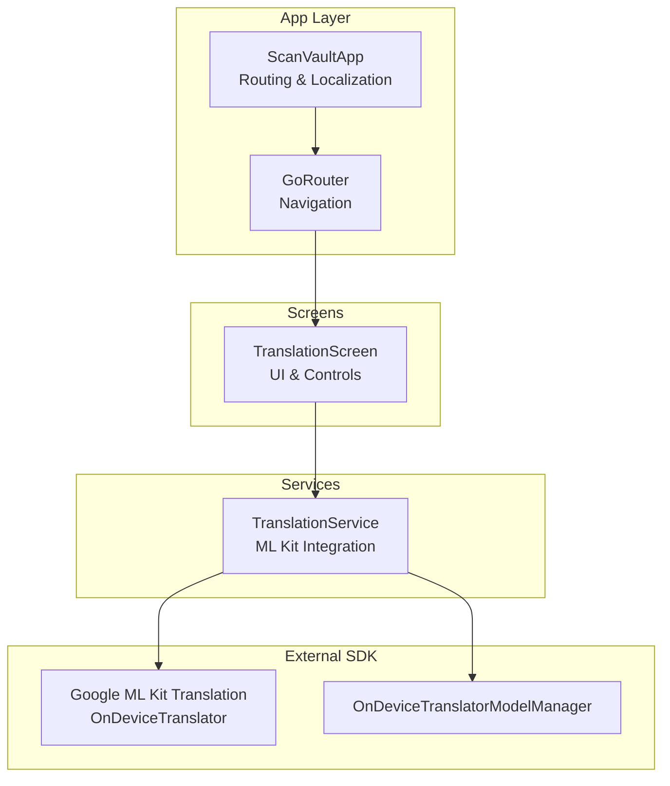
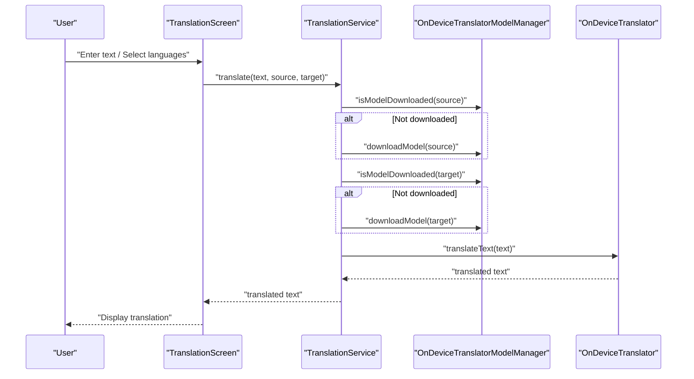
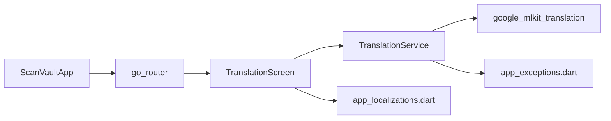

# Translation Screen

<cite>
**Referenced Files in This Document**
- [translation_screen.dart](file://lib/screens/translation/translation_screen.dart)
- [translation_service.dart](file://lib/services/translation_service.dart)
- [app_exceptions.dart](file://lib/core/exceptions/app_exceptions.dart)
- [app.dart](file://lib/app.dart)
- [AndroidManifest.xml](file://android/app/src/main/AndroidManifest.xml)
- [pubspec.yaml](file://pubspec.yaml)
- [l10n.yaml](file://l10n.yaml)
- [app_localizations.dart](file://lib/l10n/app_localizations.dart)
- [app_en.arb](file://lib/l10n/app_en.arb)
</cite>

## Table of Contents
1. [Introduction](#introduction)
2. [Project Structure](#project-structure)
3. [Core Components](#core-components)
4. [Architecture Overview](#architecture-overview)
5. [Detailed Component Analysis](#detailed-component-analysis)
6. [Dependency Analysis](#dependency-analysis)
7. [Performance Considerations](#performance-considerations)
8. [Troubleshooting Guide](#troubleshooting-guide)
9. [Conclusion](#conclusion)
10. [Appendices](#appendices)

## Introduction
This document provides comprehensive documentation for the Translation Screen component that enables multilingual translation using Google ML Kit on-device translation. It explains the integration with Google ML Kit translation APIs, language detection and model management, translation workflows, language pair selection, and offline translation support. It also covers translation engine setup, model downloading and caching mechanisms, examples of translation accuracy and supported languages, batch translation scenarios, performance optimization, memory management for language models, offline capabilities, customization of translation parameters, and extension of language support.

## Project Structure
The Translation Screen resides within the Flutter application and integrates with the Google ML Kit translation package. The translation workflow is orchestrated by a dedicated service that manages on-device models and translation instances. Localization resources provide UI strings for the translation screen.

**Diagram sources**
- [app.dart](file://lib/app.dart#L1-L187)
- [translation_screen.dart](file://lib/screens/translation/translation_screen.dart#L1-L285)
- [translation_service.dart](file://lib/services/translation_service.dart#L1-L170)

**Section sources**
- [app.dart](file://lib/app.dart#L1-L187)
- [translation_screen.dart](file://lib/screens/translation/translation_screen.dart#L1-L285)
- [translation_service.dart](file://lib/services/translation_service.dart#L1-L170)

## Core Components
- TranslationScreen: The UI component that allows users to select source and target languages, enter source text, trigger translation, swap languages, and view translated output. It handles model download progress and error display.
- TranslationService: The service layer that manages on-device translation models via OnDeviceTranslatorModelManager, creates and reuses OnDeviceTranslator instances, ensures models are downloaded, and performs translations.
- Exceptions: Custom exceptions (TranslationException) encapsulate translation errors for robust error handling.
- Routing and Localization: The app router integrates the TranslationScreen and provides localization resources for UI strings.

Key responsibilities:
- Language pair selection and swapping
- Model lifecycle management (download, reuse, close)
- Translation execution and error propagation
- UI feedback for translation and download states

**Section sources**
- [translation_screen.dart](file://lib/screens/translation/translation_screen.dart#L1-L285)
- [translation_service.dart](file://lib/services/translation_service.dart#L1-L170)
- [app_exceptions.dart](file://lib/core/exceptions/app_exceptions.dart#L1-L70)
- [app.dart](file://lib/app.dart#L175-L184)

## Architecture Overview
The Translation Screen follows a layered architecture:
- Presentation Layer: TranslationScreen renders UI controls, manages state, and triggers translation actions.
- Service Layer: TranslationService encapsulates Google ML Kit integration, model management, and translation execution.
- External Layer: Google ML Kit provides on-device translation and model management.

**Diagram sources**
- [translation_screen.dart](file://lib/screens/translation/translation_screen.dart#L51-L90)
- [translation_service.dart](file://lib/services/translation_service.dart#L50-L84)

**Section sources**
- [translation_screen.dart](file://lib/screens/translation/translation_screen.dart#L51-L90)
- [translation_service.dart](file://lib/services/translation_service.dart#L50-L84)

## Detailed Component Analysis

### TranslationScreen
Responsibilities:
- Initialize controllers and optional initial text
- Manage translation and download states
- Render language selectors, text areas, and action buttons
- Swap languages and trigger translation
- Display progress indicators and error messages

User interactions:
- Language dropdowns for source and target
- Clear and copy actions for text fields
- Translate button with disabled state during processing
- Swap button to invert language pair

State management:
- Tracks source/target languages, translation/download flags, and error messages
- Updates UI reactively using setState

Offline behavior:
- Delegates model availability checks and downloads to TranslationService

**Section sources**
- [translation_screen.dart](file://lib/screens/translation/translation_screen.dart#L1-L285)

### TranslationService
Responsibilities:
- Provide available languages derived from TranslateLanguage enum values
- Manage on-device translation models using OnDeviceTranslatorModelManager
- Create and reuse OnDeviceTranslator instances per language pair
- Ensure models are present before translation
- Translate text and propagate exceptions

Model lifecycle:
- Checks model presence before translation
- Downloads missing models on demand
- Disposes translator when no longer needed

Error handling:
- Wraps translation failures in TranslationException
- Propagates model download failures as TranslationException

**Section sources**
- [translation_service.dart](file://lib/services/translation_service.dart#L1-L170)
- [app_exceptions.dart](file://lib/core/exceptions/app_exceptions.dart#L39-L45)

### Language Pair Selection and Swapping
- LanguageInfo encapsulates code, name, and enum value for UI rendering
- Dropdowns populate from TranslationService.getAvailableLanguages()
- Swap operation exchanges languages and text between source and target fields
- Automatic translation triggers after changing languages or swapping

**Section sources**
- [translation_service.dart](file://lib/services/translation_service.dart#L15-L25)
- [translation_screen.dart](file://lib/screens/translation/translation_screen.dart#L92-L103)

### Offline Translation Support
- On-device models managed by OnDeviceTranslatorModelManager
- Models are downloaded automatically when not present
- Translation proceeds without network connectivity after models are cached locally
- Model deletion capability exposed for storage management

**Section sources**
- [translation_service.dart](file://lib/services/translation_service.dart#L27-L48)
- [translation_screen.dart](file://lib/screens/translation/translation_screen.dart#L61-L70)

### Translation Engine Setup and Model Management
- OnDeviceTranslator instantiated with selected source and target languages
- Translator reused when language pair remains unchanged
- Translator closed and recreated when language pair changes
- Model manager handles download, presence checks, and deletion

**Section sources**
- [translation_service.dart](file://lib/services/translation_service.dart#L50-L90)

### Batch Translation Scenarios
- The TranslationScreen accepts initial text via route extras, enabling batch workflows where OCR or external sources feed pre-filled text
- Users can iterate language pairs and translations without reinitializing the entire screen
- Copy-to-clipboard functionality supports exporting translated results for downstream processing

**Section sources**
- [app.dart](file://lib/app.dart#L175-L184)
- [translation_screen.dart](file://lib/screens/translation/translation_screen.dart#L208-L283)

### Supported Languages
- Available languages are derived from TranslateLanguage enum values
- LanguageInfo provides human-readable names and BCP codes
- UI dropdowns render sorted language names for selection

Note: The exact set of supported languages depends on the TranslateLanguage enum values provided by the Google ML Kit translation package.

**Section sources**
- [translation_service.dart](file://lib/services/translation_service.dart#L15-L25)
- [translation_service.dart](file://lib/services/translation_service.dart#L92-L155)

### Translation Accuracy and Quality
- Accuracy depends on the underlying Google ML Kit on-device models
- Offline models may differ slightly from cloud-based translation quality
- Users can improve perceived accuracy by selecting appropriate language pairs and ensuring adequate text context

[No sources needed since this section provides general guidance]

## Dependency Analysis
External dependencies:
- google_mlkit_translation: Provides OnDeviceTranslator and OnDeviceTranslatorModelManager
- flutter_localizations: Enables localization for UI strings
- go_router: Handles navigation to the TranslationScreen

Internal dependencies:
- TranslationScreen depends on TranslationService for translation operations
- TranslationService depends on Google ML Kit translation APIs and custom exceptions

**Diagram sources**
- [translation_screen.dart](file://lib/screens/translation/translation_screen.dart#L1-L5)
- [translation_service.dart](file://lib/services/translation_service.dart#L1-L4)
- [app_exceptions.dart](file://lib/core/exceptions/app_exceptions.dart#L1-L70)
- [app.dart](file://lib/app.dart#L1-L187)

**Section sources**
- [pubspec.yaml](file://pubspec.yaml#L30-L32)
- [translation_screen.dart](file://lib/screens/translation/translation_screen.dart#L1-L5)
- [translation_service.dart](file://lib/services/translation_service.dart#L1-L4)
- [app.dart](file://lib/app.dart#L1-L187)

## Performance Considerations
- Translator reuse: TranslationService maintains a single OnDeviceTranslator instance per language pair to avoid repeated initialization overhead.
- Lazy model downloads: Models are downloaded only when needed, reducing initial startup costs.
- UI responsiveness: Translation and download states prevent concurrent operations and provide visual feedback.
- Memory management: Translators are closed when disposed, and model manager handles local caching efficiently.

Recommendations:
- Debounce translation triggers for long texts to reduce unnecessary processing.
- Pre-download frequently used language pairs to minimize latency.
- Monitor device storage and periodically clean unused models to maintain performance.

**Section sources**
- [translation_service.dart](file://lib/services/translation_service.dart#L58-L70)
- [translation_service.dart](file://lib/services/translation_service.dart#L86-L90)
- [translation_screen.dart](file://lib/screens/translation/translation_screen.dart#L51-L90)

## Troubleshooting Guide
Common issues and resolutions:
- Translation fails: Catch TranslationException and display user-friendly messages. Verify model downloads succeeded and retry translation.
- Model download errors: Ensure internet connectivity and sufficient storage. Retry download or clear cache if necessary.
- Empty results: Confirm input text is not empty and languages are valid.
- Translator not initialized: Ensure models are downloaded before translation attempts.

Error handling patterns:
- Wrap translation operations in try-catch blocks
- Use TranslationException for consistent error reporting
- Provide UI feedback for errors and progress indicators for downloads

**Section sources**
- [translation_service.dart](file://lib/services/translation_service.dart#L80-L84)
- [translation_service.dart](file://lib/services/translation_service.dart#L32-L39)
- [translation_screen.dart](file://lib/screens/translation/translation_screen.dart#L81-L89)

## Conclusion
The Translation Screen delivers a seamless multilingual translation experience leveraging Google ML Kit’s on-device translation capabilities. It provides intuitive language selection, automatic model management, responsive UI feedback, and robust error handling. By reusing translators, managing models efficiently, and supporting offline translation, the component offers reliable performance across diverse usage scenarios.

[No sources needed since this section summarizes without analyzing specific files]

## Appendices

### Localization Integration
- Localization resources define UI strings for the translation screen, including labels for source text, translation output, and actions.
- The app configures localization delegates and supported locales to render the UI in multiple languages.

**Section sources**
- [app_localizations.dart](file://lib/l10n/app_localizations.dart#L1-L867)
- [l10n.yaml](file://l10n.yaml#L1-L4)
- [app_en.arb](file://lib/l10n/app_en.arb#L1-L118)

### Network and Permissions
- Internet permission is required for downloading translation models.
- The app declares necessary permissions in the Android manifest.

**Section sources**
- [AndroidManifest.xml](file://android/app/src/main/AndroidManifest.xml#L7-L8)

### Extending Language Support
- Add new languages by updating the TranslateLanguage enum values and ensuring corresponding on-device models are available.
- Extend UI dropdowns by refreshing the language list from TranslationService.getAvailableLanguages().
- Validate model availability and handle download failures gracefully.

**Section sources**
- [translation_service.dart](file://lib/services/translation_service.dart#L15-L25)
- [translation_service.dart](file://lib/services/translation_service.dart#L27-L48)