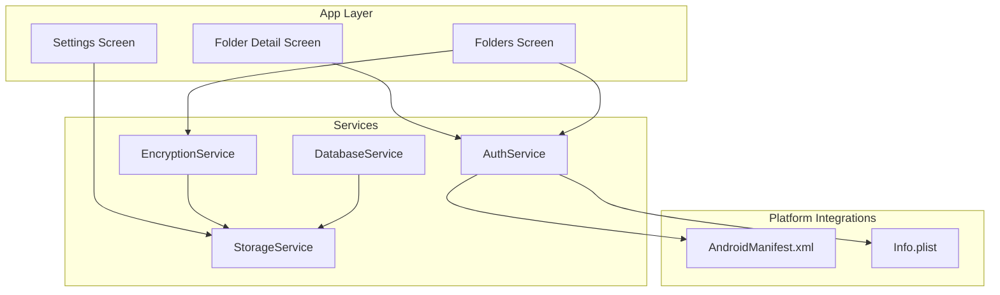
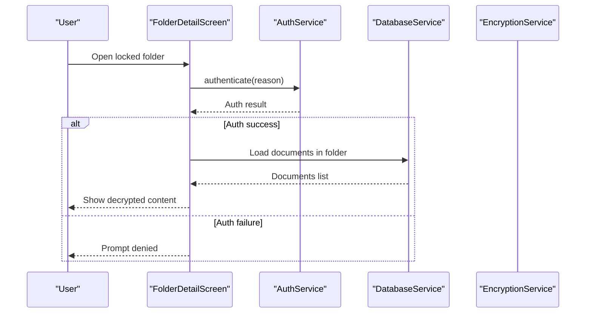
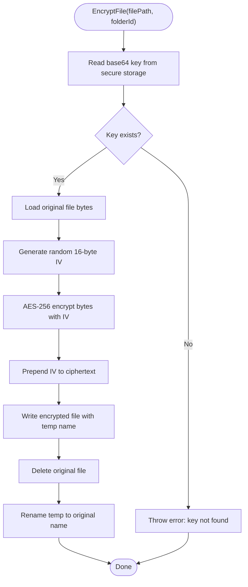
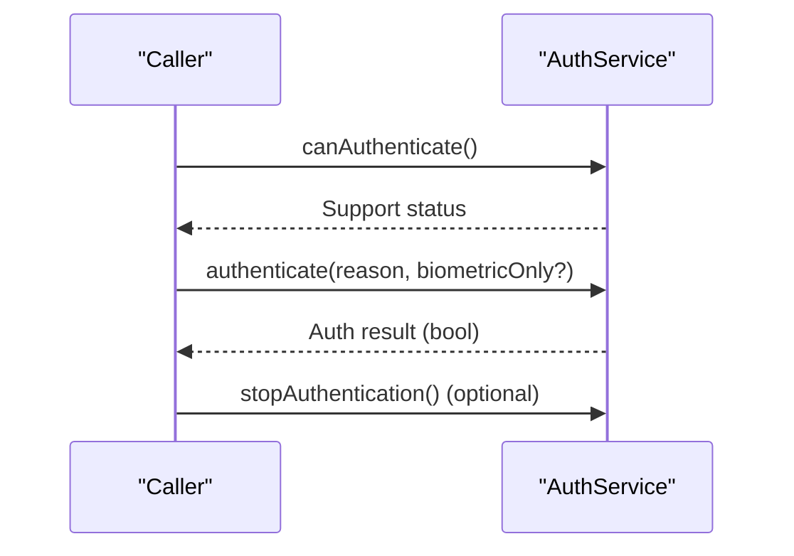
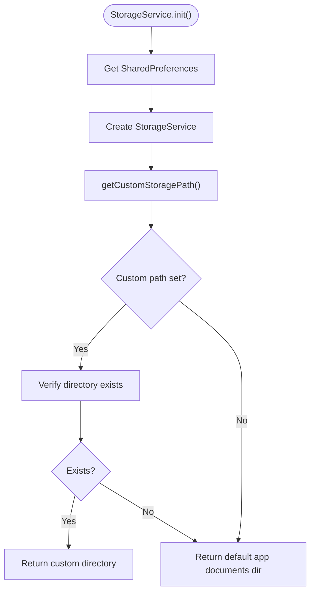
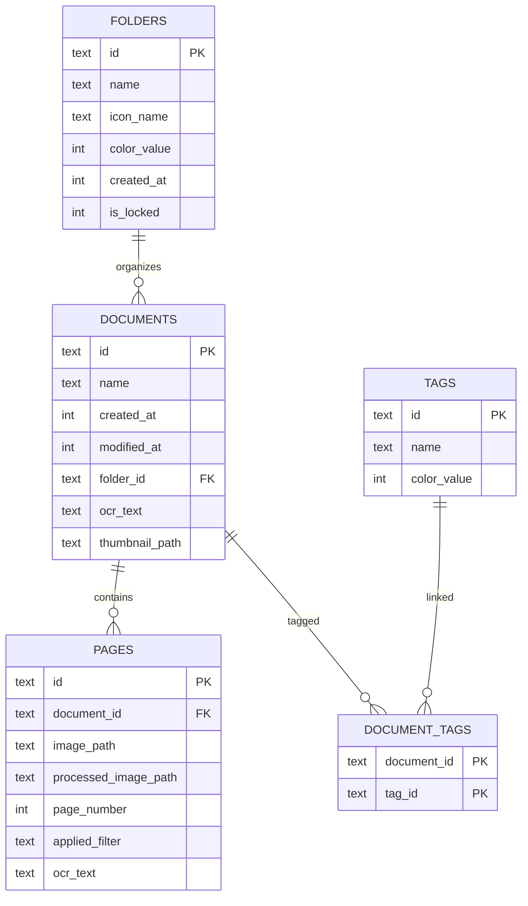
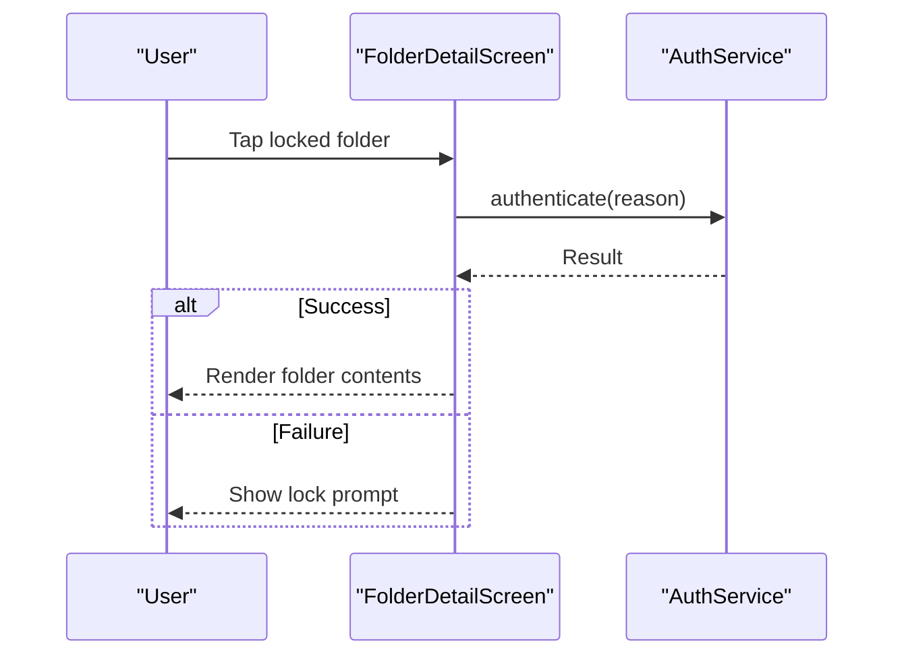
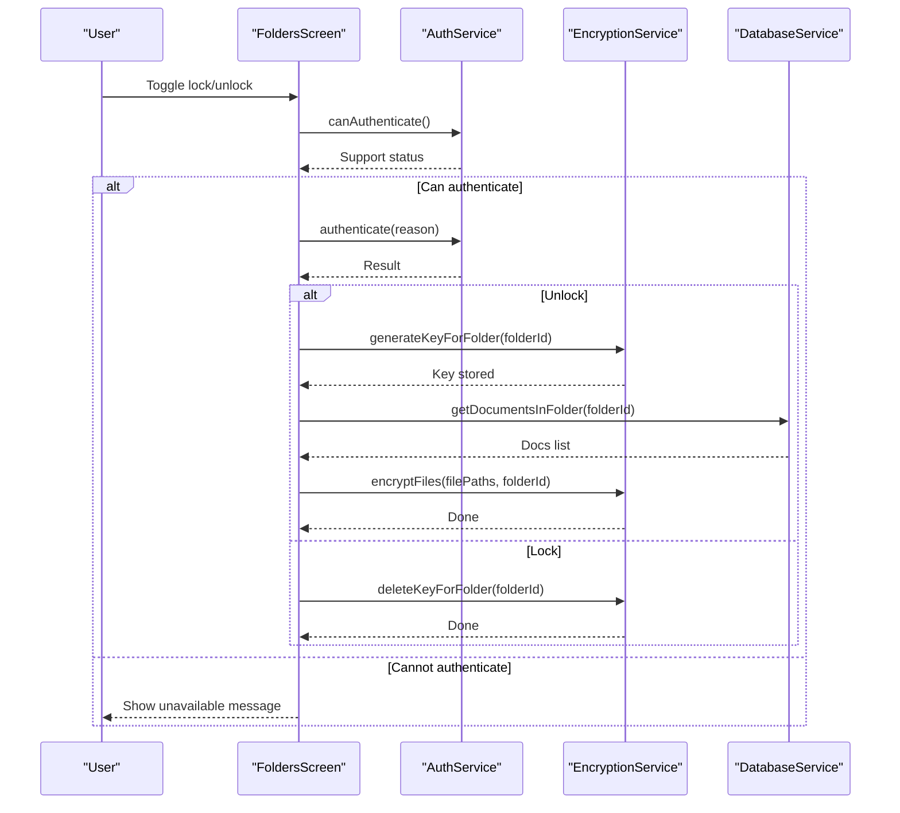
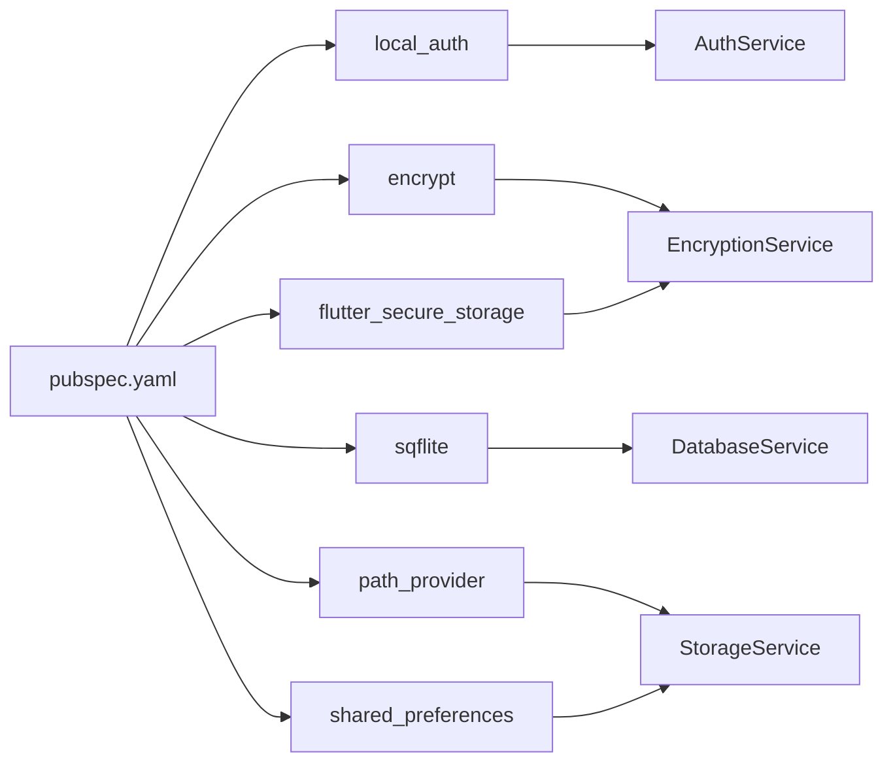

# Security & Privacy

<cite>
**Referenced Files in This Document**
- [encryption_service.dart](file://lib/services/encryption_service.dart)
- [auth_service.dart](file://lib/services/auth_service.dart)
- [storage_service.dart](file://lib/services/storage_service.dart)
- [database_service.dart](file://lib/services/database_service.dart)
- [folder_detail_screen.dart](file://lib/screens/folders/folder_detail_screen.dart)
- [folders_screen.dart](file://lib/screens/folders/folders_screen.dart)
- [settings_screen.dart](file://lib/screens/settings/settings_screen.dart)
- [document.dart](file://lib/models/document.dart)
- [folder.dart](file://lib/models/folder.dart)
- [AndroidManifest.xml](file://android/app/src/main/AndroidManifest.xml)
- [Info.plist](file://ios/Runner/Info.plist)
- [pubspec.yaml](file://pubspec.yaml)
- [main.dart](file://lib/main.dart)
</cite>

## Table of Contents
1. [Introduction](#introduction)
2. [Project Structure](#project-structure)
3. [Core Components](#core-components)
4. [Architecture Overview](#architecture-overview)
5. [Detailed Component Analysis](#detailed-component-analysis)
6. [Dependency Analysis](#dependency-analysis)
7. [Performance Considerations](#performance-considerations)
8. [Troubleshooting Guide](#troubleshooting-guide)
9. [GDPR and Privacy Compliance](#gdpr-and-privacy-compliance)
10. [Security Testing and Vulnerability Assessment](#security-testing-and-vulnerability-assessment)
11. [Incident Response Procedures](#incident-response-procedures)
12. [Best Practices for Developers](#best-practices-for-developers)
13. [Conclusion](#conclusion)

## Introduction
This document provides comprehensive security and privacy guidance for ScanVault’s data protection measures. It focuses on encryption implementation for locked folders using AES-256, secure key storage via Android Keystore-backed encrypted storage, biometric authentication integration, authentication service architecture, permission handling, and privacy-preserving data processing. It also outlines best practices for document handling, data transmission, local storage protection, GDPR considerations, data retention, user consent, security testing, vulnerability assessment, incident response, separation of sensitive vs. regular documents, encryption key management, and secure deletion processes.

## Project Structure
ScanVault is a Flutter application with platform-specific integrations. Security-relevant components include:
- Services: encryption, authentication, storage, database
- Screens: folder access control and settings
- Models: document and folder metadata
- Platform manifests: Android permissions and iOS configuration
- Dependencies: encryption libraries, biometric auth, secure storage

**Diagram sources**
- [settings_screen.dart](file://lib/screens/settings/settings_screen.dart#L60-L92)
- [folder_detail_screen.dart](file://lib/screens/folders/folder_detail_screen.dart#L47-L97)
- [folders_screen.dart](file://lib/screens/folders/folders_screen.dart#L562-L593)
- [encryption_service.dart](file://lib/services/encryption_service.dart#L1-L150)
- [auth_service.dart](file://lib/services/auth_service.dart#L1-L63)
- [storage_service.dart](file://lib/services/storage_service.dart#L1-L63)
- [database_service.dart](file://lib/services/database_service.dart#L1-L413)
- [AndroidManifest.xml](file://android/app/src/main/AndroidManifest.xml#L1-L58)
- [Info.plist](file://ios/Runner/Info.plist#L1-L50)

**Section sources**
- [settings_screen.dart](file://lib/screens/settings/settings_screen.dart#L60-L92)
- [folder_detail_screen.dart](file://lib/screens/folders/folder_detail_screen.dart#L47-L97)
- [folders_screen.dart](file://lib/screens/folders/folders_screen.dart#L562-L593)
- [encryption_service.dart](file://lib/services/encryption_service.dart#L1-L150)
- [auth_service.dart](file://lib/services/auth_service.dart#L1-L63)
- [storage_service.dart](file://lib/services/storage_service.dart#L1-L63)
- [database_service.dart](file://lib/services/database_service.dart#L1-L413)
- [AndroidManifest.xml](file://android/app/src/main/AndroidManifest.xml#L1-L58)
- [Info.plist](file://ios/Runner/Info.plist#L1-L50)

## Core Components
- EncryptionService: Implements AES-256 encryption/decryption for files in locked folders, generates per-folder keys, stores keys securely, and manages encrypted file naming.
- AuthService: Provides biometric/PIN authentication checks and triggers device biometric prompts.
- StorageService: Manages app storage location (default or custom external directory) and persists storage path preference.
- DatabaseService: Stores document metadata, pages, folders, and tags locally with foreign key relationships and indexes.
- Models: Define document and folder structures, including folder locking flag and document metadata.

**Section sources**
- [encryption_service.dart](file://lib/services/encryption_service.dart#L1-L150)
- [auth_service.dart](file://lib/services/auth_service.dart#L1-L63)
- [storage_service.dart](file://lib/services/storage_service.dart#L1-L63)
- [database_service.dart](file://lib/services/database_service.dart#L1-L413)
- [document.dart](file://lib/models/document.dart#L1-L49)
- [folder.dart](file://lib/models/folder.dart#L1-L21)

## Architecture Overview
The security architecture separates sensitive data (locked folder contents) from regular documents and enforces authentication before access. Keys are stored securely and per-folder, and encryption is applied at rest to files.

**Diagram sources**
- [folder_detail_screen.dart](file://lib/screens/folders/folder_detail_screen.dart#L47-L97)
- [auth_service.dart](file://lib/services/auth_service.dart#L26-L52)
- [database_service.dart](file://lib/services/database_service.dart#L196-L226)

**Section sources**
- [folder_detail_screen.dart](file://lib/screens/folders/folder_detail_screen.dart#L47-L97)
- [auth_service.dart](file://lib/services/auth_service.dart#L26-L52)
- [database_service.dart](file://lib/services/database_service.dart#L196-L226)

## Detailed Component Analysis

### EncryptionService
Implements AES-256 encryption for files in locked folders:
- Generates a random 32-byte key per folder and stores it securely.
- Encrypts files by prepending a random 16-byte IV to ciphertext.
- Decrypts by extracting IV from the stored data and applying AES decryption.
- Supports batch encryption/decryption and detection of encrypted files.

**Diagram sources**
- [encryption_service.dart](file://lib/services/encryption_service.dart#L38-L77)

**Section sources**
- [encryption_service.dart](file://lib/services/encryption_service.dart#L15-L36)
- [encryption_service.dart](file://lib/services/encryption_service.dart#L38-L77)
- [encryption_service.dart](file://lib/services/encryption_service.dart#L79-L120)
- [encryption_service.dart](file://lib/services/encryption_service.dart#L122-L134)
- [encryption_service.dart](file://lib/services/encryption_service.dart#L136-L149)

### AuthService
Provides biometric and device credential authentication:
- Checks device support and available biometric types.
- Initiates authentication with a localized reason and sticky options.
- Handles platform exceptions and returns boolean outcomes.

**Diagram sources**
- [auth_service.dart](file://lib/services/auth_service.dart#L8-L15)
- [auth_service.dart](file://lib/services/auth_service.dart#L26-L52)
- [auth_service.dart](file://lib/services/auth_service.dart#L54-L61)

**Section sources**
- [auth_service.dart](file://lib/services/auth_service.dart#L8-L15)
- [auth_service.dart](file://lib/services/auth_service.dart#L17-L24)
- [auth_service.dart](file://lib/services/auth_service.dart#L26-L52)
- [auth_service.dart](file://lib/services/auth_service.dart#L54-L61)

### StorageService
Manages storage location preferences and resolves the effective directory:
- Persists a custom storage path in SharedPreferences.
- Resolves to default app documents directory if none set.
- Ensures directory creation before use.

**Diagram sources**
- [storage_service.dart](file://lib/services/storage_service.dart#L18-L21)
- [storage_service.dart](file://lib/services/storage_service.dart#L23-L37)
- [storage_service.dart](file://lib/services/storage_service.dart#L39-L52)

**Section sources**
- [storage_service.dart](file://lib/services/storage_service.dart#L18-L21)
- [storage_service.dart](file://lib/services/storage_service.dart#L23-L37)
- [storage_service.dart](file://lib/services/storage_service.dart#L39-L52)

### DatabaseService
Local relational storage for documents, pages, folders, and tags:
- Creates tables with appropriate foreign keys and indexes.
- Supports CRUD operations and folder locking flag.
- Migrations add new columns when upgrading.

**Diagram sources**
- [database_service.dart](file://lib/services/database_service.dart#L32-L97)
- [database_service.dart](file://lib/services/database_service.dart#L291-L372)
- [database_service.dart](file://lib/services/database_service.dart#L376-L412)

**Section sources**
- [database_service.dart](file://lib/services/database_service.dart#L32-L97)
- [database_service.dart](file://lib/services/database_service.dart#L196-L226)
- [database_service.dart](file://lib/services/database_service.dart#L291-L372)
- [database_service.dart](file://lib/services/database_service.dart#L376-L412)

### Folder Access Control
- Locked folders trigger authentication before rendering contents.
- On successful authentication, documents are shown; otherwise, access is denied.

**Diagram sources**
- [folder_detail_screen.dart](file://lib/screens/folders/folder_detail_screen.dart#L47-L97)
- [auth_service.dart](file://lib/services/auth_service.dart#L26-L52)

**Section sources**
- [folder_detail_screen.dart](file://lib/screens/folders/folder_detail_screen.dart#L47-L97)
- [auth_service.dart](file://lib/services/auth_service.dart#L26-L52)

### Locking and Encryption Workflow
- Unlocking a folder requires authentication; on success, a per-folder key is generated and stored securely.
- Documents in the folder are then encrypted in place.

**Diagram sources**
- [folders_screen.dart](file://lib/screens/folders/folders_screen.dart#L562-L593)
- [auth_service.dart](file://lib/services/auth_service.dart#L8-L15)
- [auth_service.dart](file://lib/services/auth_service.dart#L26-L52)
- [encryption_service.dart](file://lib/services/encryption_service.dart#L15-L36)
- [encryption_service.dart](file://lib/services/encryption_service.dart#L122-L134)
- [database_service.dart](file://lib/services/database_service.dart#L196-L226)

**Section sources**
- [folders_screen.dart](file://lib/screens/folders/folders_screen.dart#L562-L593)
- [encryption_service.dart](file://lib/services/encryption_service.dart#L15-L36)
- [encryption_service.dart](file://lib/services/encryption_service.dart#L122-L134)
- [database_service.dart](file://lib/services/database_service.dart#L196-L226)

## Dependency Analysis
Security-critical dependencies and their roles:
- local_auth: Biometric and device credential authentication.
- flutter_secure_storage: Secure key storage abstraction (Android Keystore-backed).
- encrypt: AES-256 symmetric encryption library.
- sqflite: Local SQL database for metadata.
- path_provider: Access to app directories.
- shared_preferences: Persistent settings (e.g., storage path).

**Diagram sources**
- [pubspec.yaml](file://pubspec.yaml#L61-L64)
- [encryption_service.dart](file://lib/services/encryption_service.dart#L1-L6)
- [auth_service.dart](file://lib/services/auth_service.dart#L1-L2)
- [storage_service.dart](file://lib/services/storage_service.dart#L1-L6)
- [database_service.dart](file://lib/services/database_service.dart#L1-L4)

**Section sources**
- [pubspec.yaml](file://pubspec.yaml#L61-L64)
- [encryption_service.dart](file://lib/services/encryption_service.dart#L1-L6)
- [auth_service.dart](file://lib/services/auth_service.dart#L1-L2)
- [storage_service.dart](file://lib/services/storage_service.dart#L1-L6)
- [database_service.dart](file://lib/services/database_service.dart#L1-L4)

## Performance Considerations
- Encryption overhead: AES-256 CPU cost scales linearly with file size; batch operations reduce per-call overhead.
- IV generation: Random IV per encryption ensures CPA resistance; negligible performance impact.
- Key storage: Secure storage reads/writes are fast; cache keys per session if frequent access occurs.
- Database queries: Indexes on foreign keys improve folder/document retrieval performance.
- Authentication: Biometric prompts are asynchronous; avoid blocking UI threads.

[No sources needed since this section provides general guidance]

## Troubleshooting Guide
Common issues and mitigations:
- Encryption key not found: Ensure folder lock/unlock flow executed and key stored under the correct key prefix.
- Authentication failures: Verify device support and biometric enrollment; handle platform exceptions gracefully.
- Storage path errors: Validate custom directory write access before persisting; fall back to default if invalid.
- Decryption errors: Confirm file was encrypted with expected IV prepending and correct key.

**Section sources**
- [encryption_service.dart](file://lib/services/encryption_service.dart#L40-L44)
- [auth_service.dart](file://lib/services/auth_service.dart#L44-L51)
- [settings_screen.dart](file://lib/screens/settings/settings_screen.dart#L248-L268)

## GDPR and Privacy Compliance
- Lawfulness, fairness, transparency: Provide clear consent prompts for biometric usage and storage location selection.
- Purpose limitation: Use biometrics solely for folder access; do not collect or transmit personal data unnecessarily.
- Data minimization: Store only necessary metadata (IDs, timestamps, paths). Avoid retaining OCR text unless required.
- Storage location choice: Allow users to select external storage; inform risks and provide default internal storage.
- Retention: Implement explicit deletion flows for documents and keys; offer cache clearing.
- Consent mechanisms: Require user confirmation before enabling locked folders and before storing custom paths.
- Data subject rights: Provide mechanisms to export or delete personal data upon request.

[No sources needed since this section provides general guidance]

## Security Testing and Vulnerability Assessment
Recommended approaches:
- Static analysis: Review encryption key handling, secure storage usage, and authentication flows.
- Dynamic testing: Validate biometric fallbacks, authentication bypass attempts, and storage path tampering.
- Penetration testing: Assess local storage exposure, file system traversal, and key extraction vectors.
- Threat modeling: Enumerate adversaries, attack surfaces (keys, files, metadata), and mitigate risks (e.g., key rotation, secure deletion).
- Automated scanning: Use linting and dependency vulnerability scanners.

[No sources needed since this section provides general guidance]

## Incident Response Procedures
- Breach detection: Monitor logs for repeated authentication failures, unexpected key deletions, or storage anomalies.
- Containment: Immediately revoke compromised keys, disable affected folders, and notify users.
- Eradication: Remove exposed data, rotate encryption keys, and harden storage permissions.
- Recovery: Restore from backups if sanitized; re-encrypt files with fresh keys.
- Communication: Inform affected users per policy and regulatory obligations.

[No sources needed since this section provides general guidance]

## Best Practices for Developers
- Always use AES-256 with a random IV per encryption; never reuse IVs.
- Store only encrypted keys in secure storage; never log or expose raw keys.
- Enforce authentication before accessing locked folder contents.
- Validate storage paths and permissions before writing sensitive files.
- Implement secure deletion by overwriting and removing files; clear caches periodically.
- Keep dependencies updated; audit for known vulnerabilities.
- Avoid storing sensitive data in unencrypted databases or shared preferences.

[No sources needed since this section provides general guidance]

## Conclusion
ScanVault employs AES-256 encryption for locked folder contents, secure key storage via Android Keystore-backed storage, and biometric authentication to protect sensitive documents. The architecture separates sensitive data from regular documents, enforces access control, and supports configurable storage locations. By following the outlined best practices, privacy-preserving design, and incident response procedures, the app maintains strong data protection and user trust.