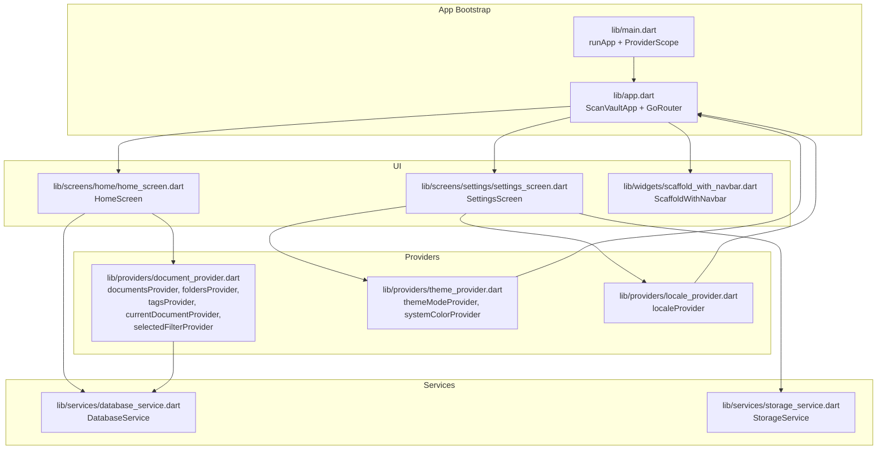
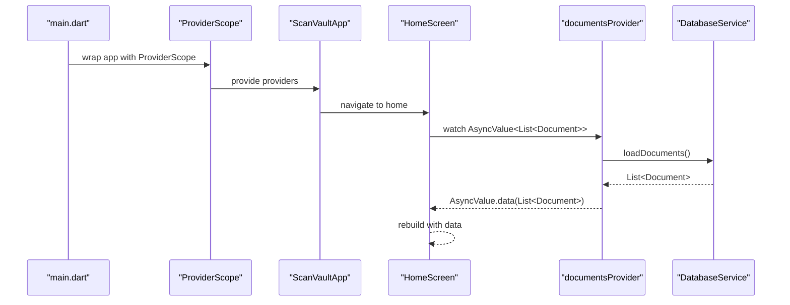
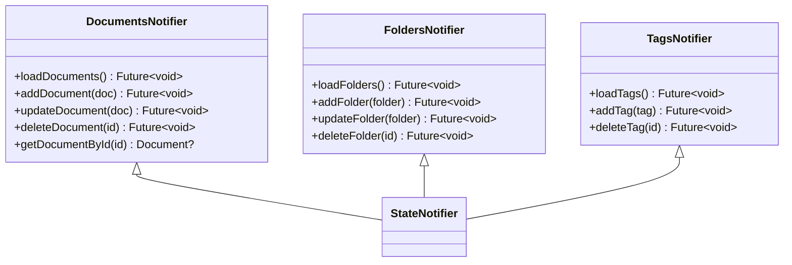
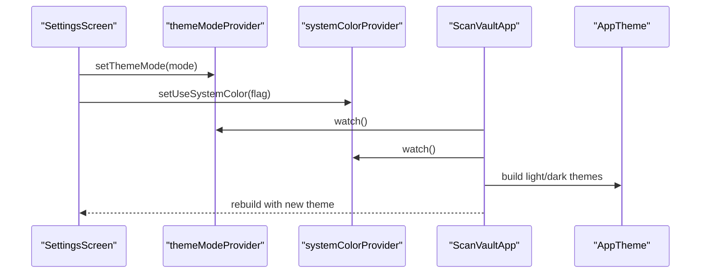
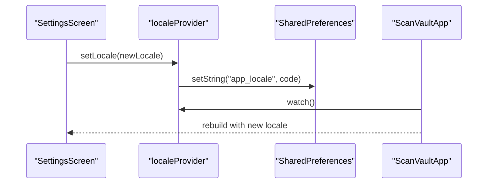
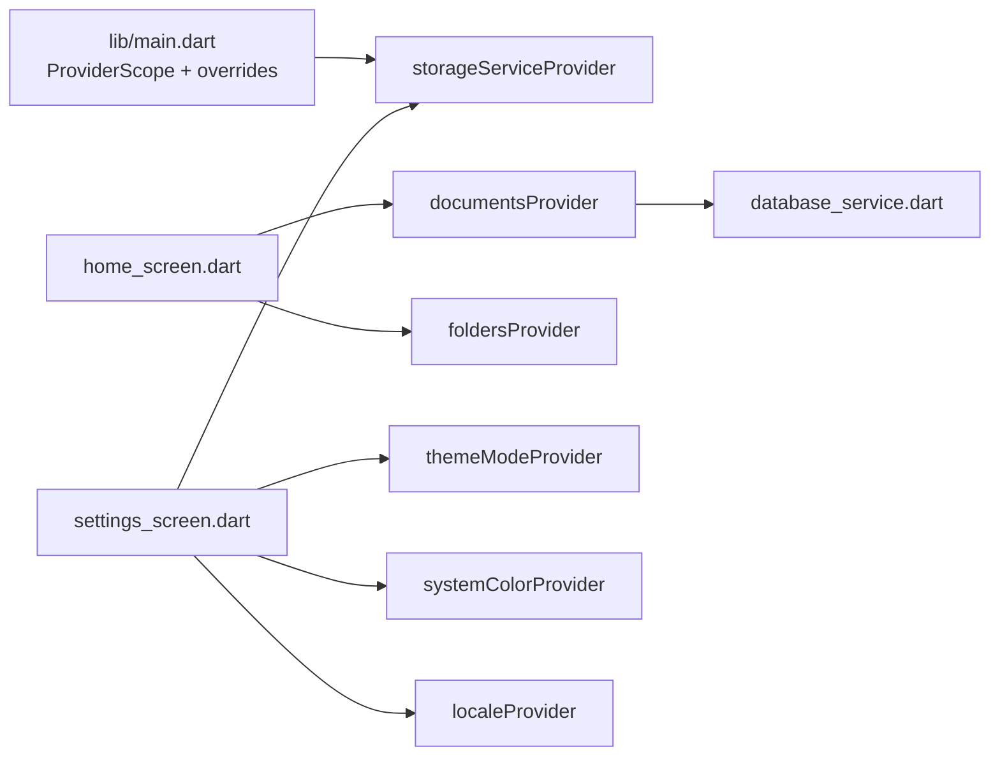
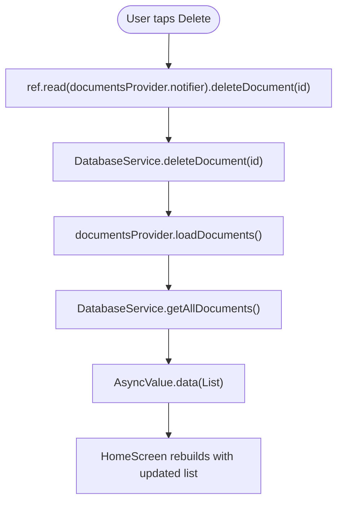
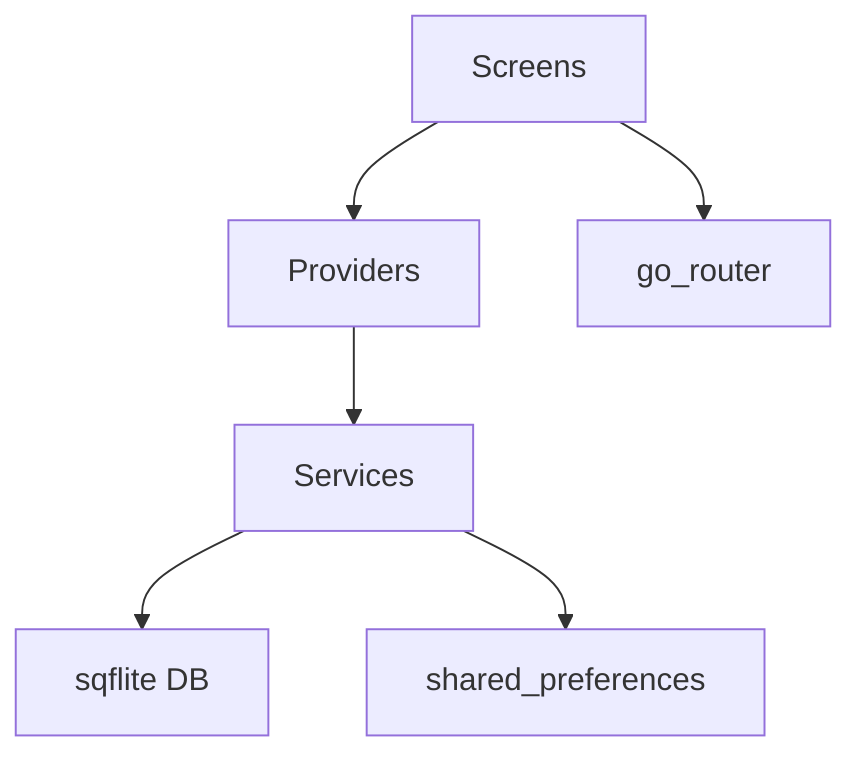

# State Management

<cite>
**Referenced Files in This Document**
- [main.dart](file://lib/main.dart)
- [app.dart](file://lib/app.dart)
- [document_provider.dart](file://lib/providers/document_provider.dart)
- [theme_provider.dart](file://lib/providers/theme_provider.dart)
- [locale_provider.dart](file://lib/providers/locale_provider.dart)
- [home_screen.dart](file://lib/screens/home/home_screen.dart)
- [settings_screen.dart](file://lib/screens/settings/settings_screen.dart)
- [app_theme.dart](file://lib/theme/app_theme.dart)
- [color_schemes.dart](file://lib/theme/color_schemes.dart)
- [database_service.dart](file://lib/services/database_service.dart)
- [storage_service.dart](file://lib/services/storage_service.dart)
- [document.dart](file://lib/models/document.dart)
- [scaffold_with_navbar.dart](file://lib/widgets/scaffold_with_navbar.dart)
</cite>

## Table of Contents
1. [Introduction](#introduction)
2. [Project Structure](#project-structure)
3. [Core Components](#core-components)
4. [Architecture Overview](#architecture-overview)
5. [Detailed Component Analysis](#detailed-component-analysis)
6. [Dependency Analysis](#dependency-analysis)
7. [Performance Considerations](#performance-considerations)
8. [Troubleshooting Guide](#troubleshooting-guide)
9. [Conclusion](#conclusion)

## Introduction
This document explains ScanVault’s Riverpod-based state management architecture. It focuses on the provider pattern, reactive updates, and synchronization across the app. It documents the three main providers—DocumentProvider for document state, ThemeProvider for UI theming, and LocaleProvider for internationalization—covering lifecycle, mutation patterns, subscriptions, composition, and testing strategies. It also connects Riverpod to Flutter’s reactive framework and offers best practices and troubleshooting guidance.

## Project Structure
ScanVault organizes state management around Riverpod providers located under lib/providers. The app bootstraps Riverpod at startup, initializes services, and wires providers into the app tree. Screens consume providers reactively and mutate state through notifier methods.

**Diagram sources**
- [main.dart](file://lib/main.dart#L10-L31)
- [app.dart](file://lib/app.dart#L23-L62)
- [document_provider.dart](file://lib/providers/document_provider.dart#L9-L137)
- [theme_provider.dart](file://lib/providers/theme_provider.dart#L5-L28)
- [locale_provider.dart](file://lib/providers/locale_provider.dart#L5-L30)
- [home_screen.dart](file://lib/screens/home/home_screen.dart#L44-L233)
- [settings_screen.dart](file://lib/screens/settings/settings_screen.dart#L17-L120)
- [database_service.dart](file://lib/services/database_service.dart#L11-L413)
- [storage_service.dart](file://lib/services/storage_service.dart#L8-L62)
- [scaffold_with_navbar.dart](file://lib/widgets/scaffold_with_navbar.dart#L7-L52)

**Section sources**
- [main.dart](file://lib/main.dart#L10-L31)
- [app.dart](file://lib/app.dart#L23-L62)

## Core Components
This section introduces the three primary providers and their roles.

- DocumentProvider
  - Manages lists of documents, folders, and tags using AsyncValue for loading/error/data states.
  - Provides mutation methods to add, update, delete, and reload entities.
  - Exposes currentDocumentProvider and selectedFilterProvider for transient UI state.

- ThemeProvider
  - Controls theme mode and whether to use system colors.
  - Integrates with Material 3 color schemes and dynamic color.

- LocaleProvider
  - Stores and persists the selected locale using shared preferences.
  - Supplies the locale to the app’s localization delegates.

**Section sources**
- [document_provider.dart](file://lib/providers/document_provider.dart#L9-L137)
- [theme_provider.dart](file://lib/providers/theme_provider.dart#L5-L28)
- [locale_provider.dart](file://lib/providers/locale_provider.dart#L5-L30)
- [document.dart](file://lib/models/document.dart#L6-L13)

## Architecture Overview
The app composes Riverpod providers at the root and exposes them to widgets via ConsumerWidget and ConsumerStatefulWidget. Providers encapsulate state and side effects (e.g., database reads/writes), while screens subscribe to providers and render UI accordingly.

**Diagram sources**
- [main.dart](file://lib/main.dart#L23-L31)
- [app.dart](file://lib/app.dart#L27-L61)
- [home_screen.dart](file://lib/screens/home/home_screen.dart#L44-L233)
- [document_provider.dart](file://lib/providers/document_provider.dart#L19-L28)
- [database_service.dart](file://lib/services/database_service.dart#L146-L171)

## Detailed Component Analysis

### DocumentProvider
DocumentProvider orchestrates document, folder, tag, and transient UI states. It uses StateNotifierProvider for asynchronous lists and StateProvider for simple values.

- Lifecycle
  - Notifiers initialize with a loading state and immediately load data.
  - Mutation methods trigger reloads to synchronize UI with the database.

- State mutation patterns
  - Add/update/delete call service methods and then refresh the list.
  - getDocumentById uses state.whenOrNull to safely extract data.

- Subscriptions
  - Screens watch AsyncValue and render loading/error/data branches.
  - Some screens also watch related providers (e.g., foldersProvider) for derived filtering.

**Diagram sources**
- [document_provider.dart](file://lib/providers/document_provider.dart#L14-L54)
- [document_provider.dart](file://lib/providers/document_provider.dart#L62-L95)
- [document_provider.dart](file://lib/providers/document_provider.dart#L109-L136)

**Section sources**
- [document_provider.dart](file://lib/providers/document_provider.dart#L9-L137)
- [home_screen.dart](file://lib/screens/home/home_screen.dart#L44-L233)
- [database_service.dart](file://lib/services/database_service.dart#L146-L171)

### ThemeProvider
ThemeProvider controls theme mode and dynamic color usage. It integrates with the app theme and dynamic color builder.

- Lifecycle
  - ThemeMode defaults to system; SystemColor defaults to false.
  - Consumers watch themeModeProvider and systemColorProvider to rebuild the UI.

- State mutation patterns
  - setThemeMode updates theme mode.
  - setUseSystemColor toggles dynamic color usage.

- Integration
  - ScanVaultApp reads these providers and applies them to MaterialApp.router and DynamicColorBuilder.

**Diagram sources**
- [settings_screen.dart](file://lib/screens/settings/settings_screen.dart#L17-L120)
- [theme_provider.dart](file://lib/providers/theme_provider.dart#L9-L28)
- [app_theme.dart](file://lib/theme/app_theme.dart#L9-L250)
- [color_schemes.dart](file://lib/theme/color_schemes.dart#L11-L76)
- [app.dart](file://lib/app.dart#L27-L61)

**Section sources**
- [theme_provider.dart](file://lib/providers/theme_provider.dart#L5-L28)
- [settings_screen.dart](file://lib/screens/settings/settings_screen.dart#L17-L120)
- [app_theme.dart](file://lib/theme/app_theme.dart#L9-L250)
- [color_schemes.dart](file://lib/theme/color_schemes.dart#L11-L76)
- [app.dart](file://lib/app.dart#L27-L61)

### LocaleProvider
LocaleProvider manages the app’s language selection and persistence.

- Lifecycle
  - Initializes with a default locale and loads persisted language code from shared preferences.
  - setLocale updates state and persists the choice.

- Integration
  - ScanVaultApp passes locale to MaterialApp.router and supplies localization delegates and supported locales.

**Diagram sources**
- [settings_screen.dart](file://lib/screens/settings/settings_screen.dart#L292-L312)
- [locale_provider.dart](file://lib/providers/locale_provider.dart#L24-L29)
- [app.dart](file://lib/app.dart#L49-L58)

**Section sources**
- [locale_provider.dart](file://lib/providers/locale_provider.dart#L5-L30)
- [settings_screen.dart](file://lib/screens/settings/settings_screen.dart#L270-L312)
- [app.dart](file://lib/app.dart#L49-L58)

### Provider Composition and Dependencies
- ProviderScope in main.dart wraps the app and injects a configured StorageService instance.
- Screens depend on providers and services:
  - HomeScreen watches documentsProvider and foldsProvider for filtering and rendering.
  - SettingsScreen depends on themeModeProvider, systemColorProvider, localeProvider, and storageServiceProvider.
- Services like DatabaseService and StorageService encapsulate persistence and file management.

**Diagram sources**
- [main.dart](file://lib/main.dart#L23-L31)
- [home_screen.dart](file://lib/screens/home/home_screen.dart#L44-L172)
- [settings_screen.dart](file://lib/screens/settings/settings_screen.dart#L17-L120)
- [document_provider.dart](file://lib/providers/document_provider.dart#L9-L137)
- [database_service.dart](file://lib/services/database_service.dart#L11-L413)
- [storage_service.dart](file://lib/services/storage_service.dart#L8-L62)

**Section sources**
- [main.dart](file://lib/main.dart#L23-L31)
- [home_screen.dart](file://lib/screens/home/home_screen.dart#L44-L172)
- [settings_screen.dart](file://lib/screens/settings/settings_screen.dart#L17-L120)

### Provider Usage Patterns in Screens and Widgets
- Subscriptions
  - HomeScreen watches documentsProvider and renders loading/error/data views.
  - SettingsScreen watches themeModeProvider and localeProvider to reflect user choices.
- Mutations
  - HomeScreen triggers deleteDocument via ref.read(documentsProvider.notifier).
  - SettingsScreen calls setThemeMode and setLocale on respective notifiers.
- Transient state
  - HomeScreen maintains local UI state (search, grid/list toggle, tag filter) alongside Riverpod-managed lists.

**Section sources**
- [home_screen.dart](file://lib/screens/home/home_screen.dart#L44-L233)
- [settings_screen.dart](file://lib/screens/settings/settings_screen.dart#L17-L120)

### State Update Flow Example

**Diagram sources**
- [home_screen.dart](file://lib/screens/home/home_screen.dart#L361-L366)
- [document_provider.dart](file://lib/providers/document_provider.dart#L42-L46)
- [database_service.dart](file://lib/services/database_service.dart#L244-L247)

## Dependency Analysis
- Coupling and cohesion
  - Providers encapsulate state and side effects, promoting low coupling between UI and persistence.
  - Screens remain thin consumers of providers.
- External dependencies
  - Riverpod for reactive state.
  - sqflite for local database.
  - shared_preferences for locale persistence.
  - go_router for navigation and persistent shell routing.
- Potential circular dependencies
  - None observed among providers and screens; services are injected via ProviderScope.

**Diagram sources**
- [document_provider.dart](file://lib/providers/document_provider.dart#L6-L6)
- [database_service.dart](file://lib/services/database_service.dart#L11-L28)
- [storage_service.dart](file://lib/services/storage_service.dart#L18-L21)
- [home_screen.dart](file://lib/screens/home/home_screen.dart#L44-L233)
- [app.dart](file://lib/app.dart#L67-L186)

**Section sources**
- [document_provider.dart](file://lib/providers/document_provider.dart#L6-L6)
- [database_service.dart](file://lib/services/database_service.dart#L11-L28)
- [storage_service.dart](file://lib/services/storage_service.dart#L18-L21)
- [app.dart](file://lib/app.dart#L67-L186)

## Performance Considerations
- Prefer StateNotifierProvider for asynchronous lists to leverage AsyncValue’s loading/error/data semantics.
- Minimize rebuild scope by watching only the necessary provider per widget.
- Use immutable models (e.g., Document) to enable efficient equality checks and avoid unnecessary rebuilds.
- Batch mutations when possible (e.g., update then reload) to reduce redundant reads.
- Cache frequently accessed derived data (e.g., locked folder sets) within the widget lifecycle to avoid repeated computations.
- Keep transient UI state (grid/list toggle, search query) local to widgets to prevent provider churn.

## Troubleshooting Guide
- Providers not updating UI
  - Ensure widgets use ConsumerWidget/ConsumerStatefulWidget and call ref.watch or ref.read appropriately.
  - Confirm state transitions occur via notifier methods (e.g., loadDocuments after add/update/delete).
- AsyncValue not rendering data
  - Verify providers initialize with loading state and transition to data after service calls.
  - Check for exceptions captured by AsyncValue.error and handle gracefully in UI.
- Locale changes not reflected
  - Confirm setLocale persists the language code and that ScanVaultApp passes locale to MaterialApp.router.
- Theme not applying
  - Ensure themeModeProvider and systemColorProvider are watched and that DynamicColorBuilder receives proper color schemes.
- Database inconsistencies
  - After mutations, call loadDocuments/loadFolders/loadTags to synchronize providers with the database.

**Section sources**
- [document_provider.dart](file://lib/providers/document_provider.dart#L19-L28)
- [locale_provider.dart](file://lib/providers/locale_provider.dart#L24-L29)
- [theme_provider.dart](file://lib/providers/theme_provider.dart#L12-L14)
- [home_screen.dart](file://lib/screens/home/home_screen.dart#L44-L233)
- [app.dart](file://lib/app.dart#L49-L58)

## Conclusion
ScanVault’s Riverpod-based state management cleanly separates UI, state, and persistence. The three main providers—DocumentProvider, ThemeProvider, and LocaleProvider—enable reactive, synchronized updates across the app. By following the documented patterns for lifecycle, mutation, subscriptions, composition, and testing, developers can maintain a scalable and predictable state layer that integrates seamlessly with Flutter’s reactive framework.