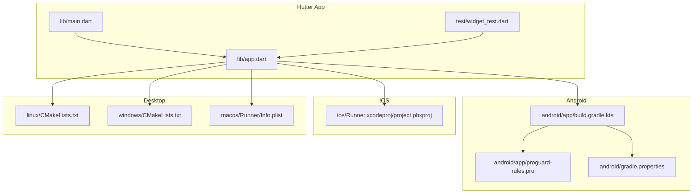
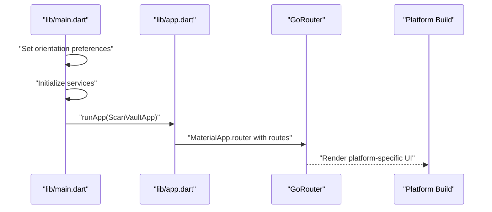
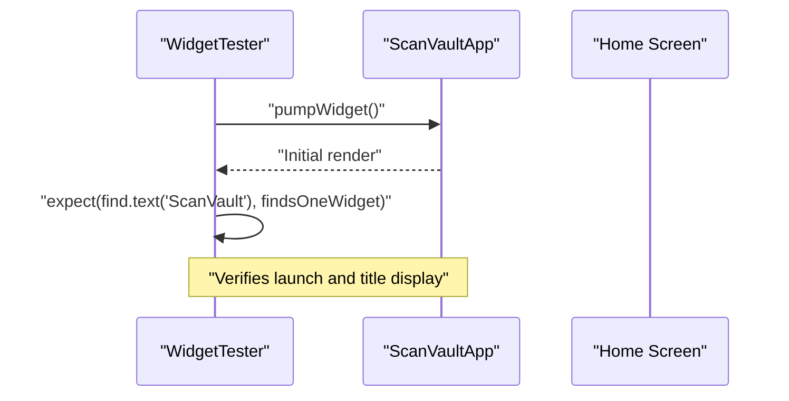
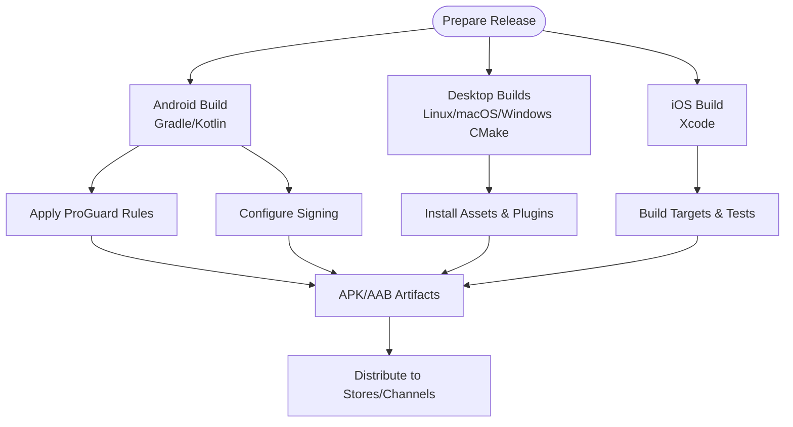
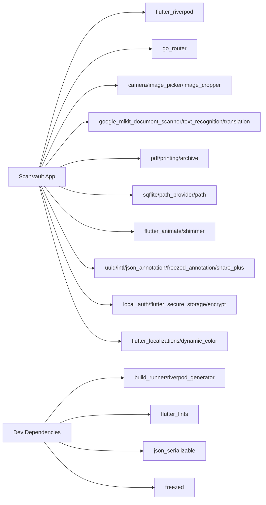

# Testing & Deployment

<cite>
**Referenced Files in This Document**
- [test/widget_test.dart](file://test/widget_test.dart)
- [analysis_options.yaml](file://analysis_options.yaml)
- [pubspec.yaml](file://pubspec.yaml)
- [android/app/build.gradle.kts](file://android/app/build.gradle.kts)
- [android/app/proguard-rules.pro](file://android/app/proguard-rules.pro)
- [android/gradle.properties](file://android/gradle.properties)
- [linux/CMakeLists.txt](file://linux/CMakeLists.txt)
- [windows/CMakeLists.txt](file://windows/CMakeLists.txt)
- [macos/Runner/Info.plist](file://macos/Runner/Info.plist)
- [ios/Runner.xcodeproj/project.pbxproj](file://ios/Runner.xcodeproj/project.pbxproj)
- [lib/main.dart](file://lib/main.dart)
- [lib/app.dart](file://lib/app.dart)
- [README.md](file://README.md)
</cite>

## Table of Contents
1. [Introduction](#introduction)
2. [Project Structure](#project-structure)
3. [Core Components](#core-components)
4. [Architecture Overview](#architecture-overview)
5. [Detailed Component Analysis](#detailed-component-analysis)
6. [Dependency Analysis](#dependency-analysis)
7. [Performance Considerations](#performance-considerations)
8. [Troubleshooting Guide](#troubleshooting-guide)
9. [Conclusion](#conclusion)
10. [Appendices](#appendices)

## Introduction
This document provides a comprehensive guide to testing and deployment for ScanVault’s development lifecycle. It covers the current testing strategy (unit and widget tests), code analysis and quality gates via analysis_options.yaml, build configuration across platforms, release preparation, distribution strategies, and guidance for continuous integration and deployment automation. It also includes practical examples from the existing widget test, mobile-specific testing approaches, performance testing, and user acceptance testing procedures. Finally, it addresses troubleshooting for common build and deployment issues.

## Project Structure
ScanVault is a Flutter application with platform-specific build configurations under android/, ios/, linux/, macos/, and windows/. The testing surface is minimal but functional, centered around a single widget test that verifies the app launches and displays the expected title. Quality is enforced through a shared analysis_options.yaml that includes Flutter’s recommended lints.

**Diagram sources**
- [lib/main.dart](file://lib/main.dart#L1-L32)
- [lib/app.dart](file://lib/app.dart#L1-L187)
- [test/widget_test.dart](file://test/widget_test.dart#L1-L14)
- [android/app/build.gradle.kts](file://android/app/build.gradle.kts#L1-L46)
- [android/app/proguard-rules.pro](file://android/app/proguard-rules.pro#L1-L19)
- [android/gradle.properties](file://android/gradle.properties#L1-L3)
- [linux/CMakeLists.txt](file://linux/CMakeLists.txt#L1-L129)
- [windows/CMakeLists.txt](file://windows/CMakeLists.txt#L1-L109)
- [macos/Runner/Info.plist](file://macos/Runner/Info.plist#L1-L33)
- [ios/Runner.xcodeproj/project.pbxproj](file://ios/Runner.xcodeproj/project.pbxproj#L1-L617)

**Section sources**
- [lib/main.dart](file://lib/main.dart#L1-L32)
- [lib/app.dart](file://lib/app.dart#L1-L187)
- [test/widget_test.dart](file://test/widget_test.dart#L1-L14)
- [android/app/build.gradle.kts](file://android/app/build.gradle.kts#L1-L46)
- [android/app/proguard-rules.pro](file://android/app/proguard-rules.pro#L1-L19)
- [android/gradle.properties](file://android/gradle.properties#L1-L3)
- [linux/CMakeLists.txt](file://linux/CMakeLists.txt#L1-L129)
- [windows/CMakeLists.txt](file://windows/CMakeLists.txt#L1-L109)
- [macos/Runner/Info.plist](file://macos/Runner/Info.plist#L1-L33)
- [ios/Runner.xcodeproj/project.pbxproj](file://ios/Runner.xcodeproj/project.pbxproj#L1-L617)

## Core Components
- Test suite: Single widget test verifying app launch and title presence.
- Code analysis: Shared analysis_options.yaml including Flutter lints and customizable rules.
- Build configuration: Platform-specific Gradle/Kotlin and CMake/Xcode configurations.
- Dependencies and dev dependencies: Defined in pubspec.yaml, including Riverpod, GoRouter, ML Kit, and localization.

Practical example reference:
- Widget test path: [test/widget_test.dart](file://test/widget_test.dart#L1-L14)

**Section sources**
- [test/widget_test.dart](file://test/widget_test.dart#L1-L14)
- [analysis_options.yaml](file://analysis_options.yaml#L1-L29)
- [pubspec.yaml](file://pubspec.yaml#L1-L78)

## Architecture Overview
The app initializes services in main.dart, sets orientation preferences, and runs the app with Riverpod providers. The app widget defines routing with GoRouter and Material 3 theming. Platform builds integrate with Flutter tooling to produce artifacts for Android, iOS, Linux, macOS, and Windows.

**Diagram sources**
- [lib/main.dart](file://lib/main.dart#L10-L31)
- [lib/app.dart](file://lib/app.dart#L43-L61)

**Section sources**
- [lib/main.dart](file://lib/main.dart#L10-L31)
- [lib/app.dart](file://lib/app.dart#L43-L61)

## Detailed Component Analysis

### Testing Strategy
Current coverage:
- Widget test: Verifies successful app launch and presence of the app title in the UI.

Recommended enhancements:
- Unit tests: Add provider and service tests using mock dependencies and Riverpod’s test utilities.
- Widget tests: Expand to cover navigation, route transitions, and screen-specific UI elements.
- Integration tests: Validate end-to-end flows such as scanning, editing, exporting, and folder creation.

Practical example reference:
- Widget test path: [test/widget_test.dart](file://test/widget_test.dart#L6-L12)

**Diagram sources**
- [test/widget_test.dart](file://test/widget_test.dart#L6-L12)
- [lib/app.dart](file://lib/app.dart#L43-L58)

**Section sources**
- [test/widget_test.dart](file://test/widget_test.dart#L1-L14)
- [lib/app.dart](file://lib/app.dart#L43-L61)

### Code Analysis and Quality Assurance
- Analysis configuration: Includes Flutter lints and allows per-project rule customization.
- Linting rules: Can enforce print removal, quote preferences, and other style rules.
- Static analysis: Run via Flutter CLI; integrates with editors that support Dart analysis.

Practical example reference:
- Analysis options path: [analysis_options.yaml](file://analysis_options.yaml#L10-L25)

Quality gates:
- Enforce analysis pass before merging.
- Configure CI to fail on lint violations or analysis errors.

**Section sources**
- [analysis_options.yaml](file://analysis_options.yaml#L1-L29)

### Build Configuration and Release Preparation
Android:
- Gradle/Kotlin configuration sets namespace, compile/target SDK, Java compatibility, signing for release, and ProGuard rules.
- ProGuard rules suppress warnings for ML Kit and Play Core components.
- Gradle JVM memory settings configured in gradle.properties.

Linux:
- CMake defines build modes, standard settings, plugin dependencies, and installation of assets and AOT libraries.

Windows:
- CMake defines build modes, compiler settings, plugin dependencies, and asset installation.

macOS:
- Info.plist defines bundle identifiers, versions, and deployment target.

iOS:
- Xcode project configuration includes targets, build phases, Swift/ObjC bridging, and test targets.

Practical example references:
- Android Gradle: [android/app/build.gradle.kts](file://android/app/build.gradle.kts#L8-L41)
- Android ProGuard: [android/app/proguard-rules.pro](file://android/app/proguard-rules.pro#L9-L19)
- Android Gradle properties: [android/gradle.properties](file://android/gradle.properties#L1-L3)
- Linux CMake: [linux/CMakeLists.txt](file://linux/CMakeLists.txt#L37-L47)
- Windows CMake: [windows/CMakeLists.txt](file://windows/CMakeLists.txt#L35-L46)
- macOS Info.plist: [macos/Runner/Info.plist](file://macos/Runner/Info.plist#L11-L22)
- iOS project: [ios/Runner.xcodeproj/project.pbxproj](file://ios/Runner.xcodeproj/project.pbxproj#L360-L378)

**Diagram sources**
- [android/app/build.gradle.kts](file://android/app/build.gradle.kts#L33-L41)
- [android/app/proguard-rules.pro](file://android/app/proguard-rules.pro#L1-L19)
- [linux/CMakeLists.txt](file://linux/CMakeLists.txt#L78-L129)
- [windows/CMakeLists.txt](file://windows/CMakeLists.txt#L61-L109)
- [macos/Runner/Info.plist](file://macos/Runner/Info.plist#L11-L22)
- [ios/Runner.xcodeproj/project.pbxproj](file://ios/Runner.xcodeproj/project.pbxproj#L144-L163)

**Section sources**
- [android/app/build.gradle.kts](file://android/app/build.gradle.kts#L1-L46)
- [android/app/proguard-rules.pro](file://android/app/proguard-rules.pro#L1-L19)
- [android/gradle.properties](file://android/gradle.properties#L1-L3)
- [linux/CMakeLists.txt](file://linux/CMakeLists.txt#L1-L129)
- [windows/CMakeLists.txt](file://windows/CMakeLists.txt#L1-L109)
- [macos/Runner/Info.plist](file://macos/Runner/Info.plist#L1-L33)
- [ios/Runner.xcodeproj/project.pbxproj](file://ios/Runner.xcodeproj/project.pbxproj#L1-L617)

### Continuous Integration and Deployment Automation
Recommended CI pipeline stages:
- Setup: Install Flutter/Dart SDK, configure JDK for Android, and cache dependencies.
- Analyze: Run static analysis and lints.
- Test: Execute unit and widget tests.
- Build: Build platform-specific artifacts (APK/AAB for Android, IPA for iOS, desktop bundles).
- Release: Publish artifacts to stores/channels and update release notes.

Notes:
- Current repository does not include CI configuration files; implement CI YAML files in your repository root or a dedicated CI directory.

[No sources needed since this section provides general guidance]

### Distribution Strategies
Android:
- APK: For internal testing and distribution.
- AAB: For Google Play Store distribution; enables Play Store optimizations.

iOS:
- IPA: For App Store submission; requires Apple Developer Program membership and proper signing certificates.

Desktop:
- Linux: Bundle and ship as a relocatable application with installed assets.
- macOS: Produce DMG or installer with proper entitlements and Info.plist configuration.
- Windows: Produce installer or portable bundle with installed assets.

[No sources needed since this section provides general guidance]

### Mobile-Specific Testing, Performance Testing, and UAT Procedures
Mobile-specific testing:
- Orientation handling: Verify portrait-only orientation behavior.
- Permissions: Test runtime permission flows for camera, storage, and biometrics.
- Camera and OCR: Validate scanning, cropping, and text extraction flows.

Performance testing:
- Measure startup time, navigation latency, and image processing throughput.
- Stress test with large documents and multiple pages.

User Acceptance Testing (UAT):
- Validate end-to-end workflows: scan → edit → export → organize.
- Verify internationalization and dynamic color behavior.

[No sources needed since this section provides general guidance]

## Dependency Analysis
The app depends on Flutter, Riverpod, GoRouter, camera/image processing, ML Kit, PDF/document generation, localization, and security utilities. Dev dependencies include code generation and linting tools.

**Diagram sources**
- [pubspec.yaml](file://pubspec.yaml#L9-L78)

**Section sources**
- [pubspec.yaml](file://pubspec.yaml#L1-L78)

## Performance Considerations
- Minimize rebuilds: Use Riverpod providers effectively to scope state updates.
- Optimize image processing: Compress and crop efficiently; avoid unnecessary recompositions.
- Navigation: Prefer lightweight route arguments and avoid heavy payloads in navigation extras.
- Asset delivery: Ensure assets are bundled appropriately for each platform.

[No sources needed since this section provides general guidance]

## Troubleshooting Guide
Common build and deployment issues:
- Android signing and release:
  - Ensure signingConfig is configured for release builds.
  - Verify ProGuard rules suppress warnings for ML Kit and Play Core.
  - Confirm gradle.properties JVM settings are sufficient for large builds.

- iOS build failures:
  - Validate Xcode project settings, Swift version, and bridging headers.
  - Ensure test targets are configured and product validation passes.

- Desktop bundling:
  - Confirm CMake install steps copy assets and AOT libraries.
  - Verify bundle directory layout matches installation expectations.

- Lint and analysis failures:
  - Review analysis_options.yaml rules and fix violations.
  - Run analyzer locally to catch issues before CI.

Practical example references:
- Android signing and ProGuard: [android/app/build.gradle.kts](file://android/app/build.gradle.kts#L33-L41), [android/app/proguard-rules.pro](file://android/app/proguard-rules.pro#L9-L19)
- iOS project configuration: [ios/Runner.xcodeproj/project.pbxproj](file://ios/Runner.xcodeproj/project.pbxproj#L360-L378)
- Linux/macOS/Windows install steps: [linux/CMakeLists.txt](file://linux/CMakeLists.txt#L78-L129), [windows/CMakeLists.txt](file://windows/CMakeLists.txt#L61-L109), [macos/Runner/Info.plist](file://macos/Runner/Info.plist#L11-L22)

**Section sources**
- [android/app/build.gradle.kts](file://android/app/build.gradle.kts#L33-L41)
- [android/app/proguard-rules.pro](file://android/app/proguard-rules.pro#L9-L19)
- [ios/Runner.xcodeproj/project.pbxproj](file://ios/Runner.xcodeproj/project.pbxproj#L360-L378)
- [linux/CMakeLists.txt](file://linux/CMakeLists.txt#L78-L129)
- [windows/CMakeLists.txt](file://windows/CMakeLists.txt#L61-L109)
- [macos/Runner/Info.plist](file://macos/Runner/Info.plist#L11-L22)

## Conclusion
ScanVault’s current testing and build setup provides a solid foundation. The testing strategy should expand to include unit and integration tests, while the CI/CD pipeline should automate analysis, testing, building, and distribution. The existing analysis_options.yaml and platform build configurations offer strong quality and portability foundations. Implementing the recommendations herein will improve reliability, maintainability, and developer velocity across the development lifecycle.

[No sources needed since this section summarizes without analyzing specific files]

## Appendices
- Platform requirements and permissions overview: [README.md](file://README.md#L160-L241)

**Section sources**
- [README.md](file://README.md#L160-L241)