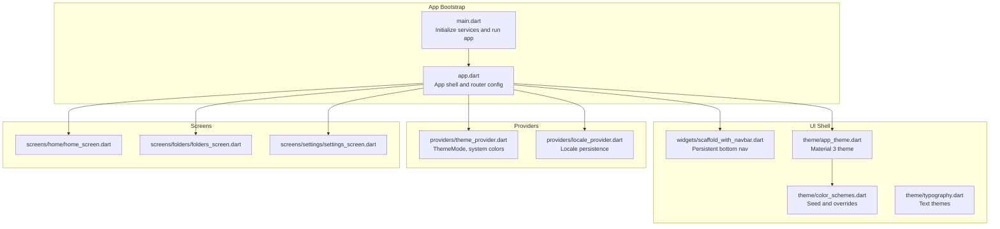
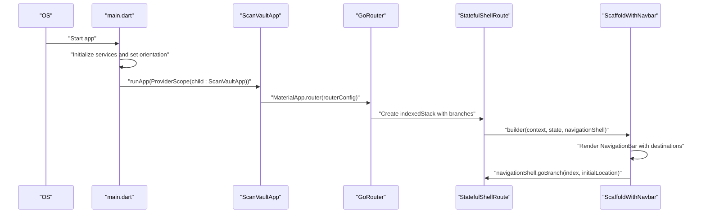
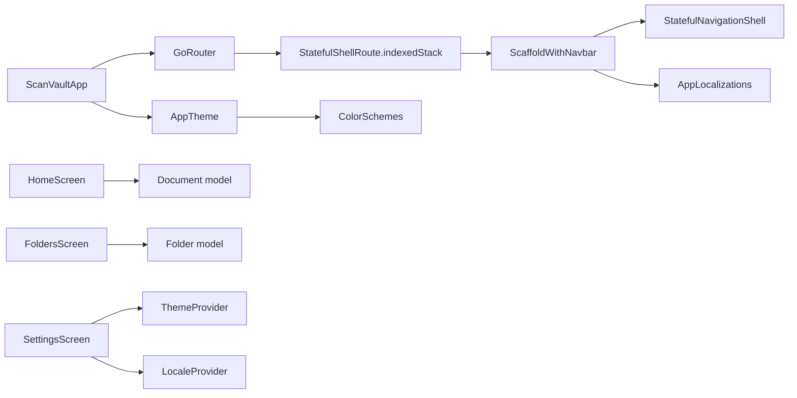

# Custom UI Components

<cite>
**Referenced Files in This Document**
- [scaffold_with_navbar.dart](file://lib/widgets/scaffold_with_navbar.dart)
- [app.dart](file://lib/app.dart)
- [main.dart](file://lib/main.dart)
- [app_theme.dart](file://lib/theme/app_theme.dart)
- [color_schemes.dart](file://lib/theme/color_schemes.dart)
- [theme_provider.dart](file://lib/providers/theme_provider.dart)
- [app_localizations.dart](file://lib/l10n/app_localizations.dart)
- [home_screen.dart](file://lib/screens/home/home_screen.dart)
- [folders_screen.dart](file://lib/screens/folders/folders_screen.dart)
- [settings_screen.dart](file://lib/screens/settings/settings_screen.dart)
- [locale_provider.dart](file://lib/providers/locale_provider.dart)
- [folder_icons.dart](file://lib/utils/folder_icons.dart)
- [document.dart](file://lib/models/document.dart)
- [folder.dart](file://lib/models/folder.dart)
- [typography.dart](file://lib/theme/typography.dart)
</cite>

## Table of Contents
1. [Introduction](#introduction)
2. [Project Structure](#project-structure)
3. [Core Components](#core-components)
4. [Architecture Overview](#architecture-overview)
5. [Detailed Component Analysis](#detailed-component-analysis)
6. [Dependency Analysis](#dependency-analysis)
7. [Performance Considerations](#performance-considerations)
8. [Accessibility and Interaction](#accessibility-and-interaction)
9. [Animation and Gesture Systems](#animation-and-gesture-systems)
10. [Customization and Theming](#customization-and-theming)
11. [Testing Strategies](#testing-strategies)
12. [Troubleshooting Guide](#troubleshooting-guide)
13. [Conclusion](#conclusion)

## Introduction
This document explains ScanVault’s custom UI components with a focus on the ScaffoldWithNavbar reusable widget. It covers navigation integration, responsive design, adaptive layouts, component composition, props and state management, accessibility, animations, gestures, customization, theming, performance, cross-platform considerations, and testing strategies. The goal is to help developers understand how the scaffold integrates with the routing shell, how themes and providers drive behavior, and how to extend and optimize the UI safely across platforms.

## Project Structure
ScanVault organizes UI around a Material 3 theme, Riverpod-based providers, and GoRouter for navigation. The ScaffoldWithNavbar wraps a StatefulNavigationShell to provide a persistent bottom navigation bar across the main app shell. Screens are organized by feature, and localization and typography are centralized.

**Diagram sources**
- [main.dart](file://lib/main.dart#L10-L31)
- [app.dart](file://lib/app.dart#L23-L62)
- [scaffold_with_navbar.dart](file://lib/widgets/scaffold_with_navbar.dart#L7-L13)
- [app_theme.dart](file://lib/theme/app_theme.dart#L9-L250)
- [color_schemes.dart](file://lib/theme/color_schemes.dart#L11-L76)
- [theme_provider.dart](file://lib/providers/theme_provider.dart#L5-L28)
- [locale_provider.dart](file://lib/providers/locale_provider.dart#L5-L30)
- [home_screen.dart](file://lib/screens/home/home_screen.dart#L20-L25)
- [folders_screen.dart](file://lib/screens/folders/folders_screen.dart#L14-L19)
- [settings_screen.dart](file://lib/screens/settings/settings_screen.dart#L13-L14)

**Section sources**
- [main.dart](file://lib/main.dart#L10-L31)
- [app.dart](file://lib/app.dart#L23-L62)

## Core Components
- ScaffoldWithNavbar: A stateless wrapper around a StatefulNavigationShell that renders a persistent bottom navigation bar and localizes tab labels.
- App theme and color schemes: Centralized Material 3 theming with dynamic color support and explicit overrides.
- Providers: ThemeMode and system color toggles, and locale persistence.
- Screens: Home, Folders, and Settings screens demonstrate composition patterns and stateful interactions.

Key responsibilities:
- Navigation integration: Uses StatefulShellRoute with indexedStack and StatefulNavigationShell to manage branch stacks.
- Localization: Uses AppLocalizations for tab labels and UI strings.
- Theming: Applies ThemeData with AppBar, NavigationBar, Cards, Inputs, Chips, and Dialog themes.

**Section sources**
- [scaffold_with_navbar.dart](file://lib/widgets/scaffold_with_navbar.dart#L7-L53)
- [app_theme.dart](file://lib/theme/app_theme.dart#L9-L250)
- [color_schemes.dart](file://lib/theme/color_schemes.dart#L11-L76)
- [theme_provider.dart](file://lib/providers/theme_provider.dart#L5-L28)
- [app_localizations.dart](file://lib/l10n/app_localizations.dart#L123-L139)

## Architecture Overview
The app initializes services, sets orientation preferences, and runs a ProviderScope-wrapped ScanVaultApp. ScanVaultApp configures a router with a StatefulShellRoute that hosts ScaffoldWithNavbar. The navbar delegates navigation to the active branch while supporting re-navigation to the initial location when tapping the current destination.

**Diagram sources**
- [main.dart](file://lib/main.dart#L10-L31)
- [app.dart](file://lib/app.dart#L67-L118)
- [scaffold_with_navbar.dart](file://lib/widgets/scaffold_with_navbar.dart#L15-L23)

**Section sources**
- [app.dart](file://lib/app.dart#L67-L118)
- [scaffold_with_navbar.dart](file://lib/widgets/scaffold_with_navbar.dart#L25-L51)

## Detailed Component Analysis

### ScaffoldWithNavbar
Purpose:
- Provide a persistent bottom navigation bar integrated with the app’s StatefulShellRoute.
- Localize tab labels and icons.
- Delegate navigation to the active branch and support re-navigating to the initial location when selecting the current tab.

Props and behavior:
- Accepts a StatefulNavigationShell and renders it as the body.
- Renders three NavigationDestination entries for Home, Folders, and Settings.
- Uses AppLocalizations for labels and Material icons for icons and selected icons.
- On destination selection, calls navigationShell.goBranch with initialLocation set when the tapped index equals the current index.

Composition patterns:
- Stateless widget composed with navigationShell and localization.
- Integrates with the router’s shell to maintain state across tabs.

State management integration:
- Reads and writes navigation state via navigationShell.currentIndex and goBranch.
- Does not manage app-wide state; relies on the shell and router.

Accessibility:
- Uses Material 3 NavigationBar with labelBehavior and icons; ensure sufficient contrast and focus indicators via theme.

Responsive/adaptable layout:
- NavigationBarTheme defines height and label behavior; suitable for phones and tablets.

**Section sources**
- [scaffold_with_navbar.dart](file://lib/widgets/scaffold_with_navbar.dart#L7-L53)
- [app_localizations.dart](file://lib/l10n/app_localizations.dart#L123-L139)

### Navigation Shell and Routing
- StatefulShellRoute.indexedStack creates a persistent shell with three branches: Home, Folders, and Settings.
- Additional routes (Camera, Editor, Document Viewer, OCR, Translation) are full-screen and do not use the navbar.
- The shell ensures the navbar persists while switching between the three main branches.

Branches:
- Home: Root path “/”.
- Folders: Path “/folders” with nested “/folders/:folderId”.
- Settings: Path “/settings”.

Navigation behavior:
- Tapping the current tab navigates to its initial location, aligning with common UX expectations.

**Section sources**
- [app.dart](file://lib/app.dart#L72-L118)
- [app.dart](file://lib/app.dart#L120-L185)

### Home Screen
Highlights:
- CustomScrollView with a SliverAppBar that expands/collapses and adapts title position and size.
- Search mode toggled via a TextField in the app bar.
- Grid/list toggle for document display.
- Filtering by tags and excluding documents in locked folders.
- Animated empty state and FAB with Flutter Animate.

Composition patterns:
- ConsumerStatefulWidget with internal state for search, grid/list, and tag filtering.
- Uses AsyncValue from Riverpod to render loading/error/data states.
- Integrates with tags and folders providers.

Accessibility:
- App bar supports keyboard focus and search input.
- Consider adding semantic labels for grid/list toggle and filters.

**Section sources**
- [home_screen.dart](file://lib/screens/home/home_screen.dart#L20-L25)
- [home_screen.dart](file://lib/screens/home/home_screen.dart#L41-L249)
- [home_screen.dart](file://lib/screens/home/home_screen.dart#L251-L287)

### Folders Screen
Highlights:
- Grid-based folder listing with color and icon selection.
- Create/edit dialogs with color pickers and icon selection.
- Lock/unlock folders with biometric authentication and encryption service integration.
- Empty state with icon and text.

Composition patterns:
- ConsumerStatefulWidget with dialogs for creation and editing.
- Uses FolderIcons utility to infer or select icons based on name or user choice.

Accessibility:
- Ensure focus order in dialogs and adequate contrast for color selections.

**Section sources**
- [folders_screen.dart](file://lib/screens/folders/folders_screen.dart#L14-L19)
- [folders_screen.dart](file://lib/screens/folders/folders_screen.dart#L21-L79)
- [folders_screen.dart](file://lib/screens/folders/folders_screen.dart#L284-L358)
- [folder_icons.dart](file://lib/utils/folder_icons.dart#L8-L21)

### Settings Screen
Highlights:
- Appearance section: language picker, theme mode picker, system color toggle.
- Storage section: custom storage path picker with write verification.
- Cache clearing with confirmation dialog.
- About section: licenses and developer info.

Composition patterns:
- Uses providers for theme mode, system color, and locale.
- Dialogs and SimpleDialogs for selections and confirmations.

Accessibility:
- Ensure radio buttons and switches are labeled and reachable via keyboard/screen reader.

**Section sources**
- [settings_screen.dart](file://lib/screens/settings/settings_screen.dart#L13-L14)
- [settings_screen.dart](file://lib/screens/settings/settings_screen.dart#L17-L120)
- [settings_screen.dart](file://lib/screens/settings/settings_screen.dart#L122-L161)
- [settings_screen.dart](file://lib/screens/settings/settings_screen.dart#L220-L268)
- [theme_provider.dart](file://lib/providers/theme_provider.dart#L5-L28)
- [locale_provider.dart](file://lib/providers/locale_provider.dart#L5-L30)

### Theming and Typography
- AppTheme defines ThemeData for light and dark modes with Material 3.
- Overrides include AppBar, Card, FloatingActionButton, NavigationBar, InputDecoration, Chip, Dialog, BottomSheet, and Divider themes.
- ColorSchemes provides seed-based light/dark schemes with explicit overrides.
- Typography provides a custom TextTheme with display/headline/title/body/label scales.

Integration:
- ScanVaultApp passes AppTheme.light/dark to MaterialApp.router.
- DynamicColorBuilder conditionally applies system color schemes when available.

**Section sources**
- [app_theme.dart](file://lib/theme/app_theme.dart#L9-L250)
- [color_schemes.dart](file://lib/theme/color_schemes.dart#L11-L76)
- [typography.dart](file://lib/theme/typography.dart#L8-L114)
- [app.dart](file://lib/app.dart#L33-L60)

## Dependency Analysis
The UI components depend on:
- Routing: GoRouter and StatefulShellRoute for navigation.
- State management: Riverpod providers for theme, locale, and document/folder data.
- Localization: AppLocalizations for UI strings.
- Theming: AppTheme and ColorSchemes.
- Models: Document and Folder for data structures.

**Diagram sources**
- [scaffold_with_navbar.dart](file://lib/widgets/scaffold_with_navbar.dart#L25-L51)
- [app_localizations.dart](file://lib/l10n/app_localizations.dart#L78-L80)
- [app.dart](file://lib/app.dart#L67-L118)
- [app_theme.dart](file://lib/theme/app_theme.dart#L9-L250)
- [color_schemes.dart](file://lib/theme/color_schemes.dart#L11-L76)
- [document.dart](file://lib/models/document.dart#L16-L32)
- [folder.dart](file://lib/models/folder.dart#L7-L20)
- [theme_provider.dart](file://lib/providers/theme_provider.dart#L5-L28)
- [locale_provider.dart](file://lib/providers/locale_provider.dart#L5-L30)

**Section sources**
- [app.dart](file://lib/app.dart#L67-L118)
- [scaffold_with_navbar.dart](file://lib/widgets/scaffold_with_navbar.dart#L7-L53)
- [document.dart](file://lib/models/document.dart#L16-L32)
- [folder.dart](file://lib/models/folder.dart#L7-L20)

## Performance Considerations
- Use IndexedStack in StatefulShellRoute to preserve branch state and avoid rebuilding heavy subtrees.
- Prefer lightweight stateless widgets (like ScaffoldWithNavbar) and move stateful logic to consumers (e.g., HomeScreen).
- Defer expensive operations (e.g., encryption/decryption) to background tasks and show progress feedback.
- Optimize lists with SliverGrid and SliverList; avoid unnecessary rebuilds by scoping setState and using keys.
- Leverage provider caching and selective subscriptions to minimize rebuilds.

[No sources needed since this section provides general guidance]

## Accessibility and Interaction
- NavigationBar provides accessible destinations; ensure labelBehavior is appropriate for your target audience.
- Use semantic labels and readable text sizes from the typography system.
- Ensure dialogs and sheets are keyboard and screen-reader friendly; provide clear focus management.
- Test contrast ratios against the theme’s onSurface/onSurfaceVariant colors.
- For gesture interactions, ensure tap targets meet minimum size guidelines.

[No sources needed since this section provides general guidance]

## Animation and Gesture Systems
- HomeScreen uses Flutter Animate for entrance effects on the empty state and FAB.
- Gesture-driven interactions include:
  - Dismissible list items with confirmation dialogs.
  - Long-press actions (e.g., folder edit).
  - Grid/list toggle and search input.
- Consider adding subtle transitions for route changes and state updates.

**Section sources**
- [home_screen.dart](file://lib/screens/home/home_screen.dart#L243-L247)
- [home_screen.dart](file://lib/screens/home/home_screen.dart#L265-L267)
- [home_screen.dart](file://lib/screens/home/home_screen.dart#L333-L366)
- [folders_screen.dart](file://lib/screens/folders/folders_screen.dart#L295-L358)

## Customization and Theming
- Customize NavigationBarTheme for height, labelBehavior, and indicator color.
- Override ColorSchemes to adjust primary/secondary/tertiary palettes and surface variants.
- Extend AppTheme to tune component-specific themes (e.g., CardTheme, FloatingActionButtonTheme).
- Use typography scales to maintain readability across breakpoints.
- Provide a “Use system colors” toggle to dynamically switch between seeded and system ColorSchemes.

**Section sources**
- [app_theme.dart](file://lib/theme/app_theme.dart#L47-L63)
- [app_theme.dart](file://lib/theme/app_theme.dart#L178-L185)
- [color_schemes.dart](file://lib/theme/color_schemes.dart#L11-L76)
- [typography.dart](file://lib/theme/typography.dart#L8-L114)
- [theme_provider.dart](file://lib/providers/theme_provider.dart#L17-L28)

## Testing Strategies
- Unit tests for provider logic (theme mode, locale, system color).
- Widget tests for ScaffoldWithNavbar rendering and navigation behavior.
- Integration tests for routing transitions and shell navigation.
- Accessibility tests for dialogs, navigation, and form controls.
- Cross-platform tests on Android/iOS to validate responsive layouts and gestures.

[No sources needed since this section provides general guidance]

## Troubleshooting Guide
Common issues and resolutions:
- Navigation not updating: Ensure the active index is bound to navigationShell.currentIndex and goBranch is called with correct index and initialLocation semantics.
- Theme not applying: Verify DynamicColorBuilder conditions and that AppTheme.light/dark receive the intended ColorScheme.
- Locale not persisting: Confirm SharedPreferences writes succeed and localeProvider emits the new Locale.
- Empty states: Ensure AsyncValue renders fallback UI and that loading/error states are handled gracefully.

**Section sources**
- [scaffold_with_navbar.dart](file://lib/widgets/scaffold_with_navbar.dart#L15-L23)
- [app.dart](file://lib/app.dart#L33-L60)
- [locale_provider.dart](file://lib/providers/locale_provider.dart#L24-L29)

## Conclusion
ScaffoldWithNavbar exemplifies a clean, reusable shell component that integrates tightly with GoRouter’s StatefulShellRoute. Combined with a robust theming system, Riverpod providers, and Material 3 components, it enables a consistent, accessible, and customizable UI across platforms. Extending the component involves respecting the shell contract, leveraging localization and theming, and ensuring smooth state transitions and interactions.