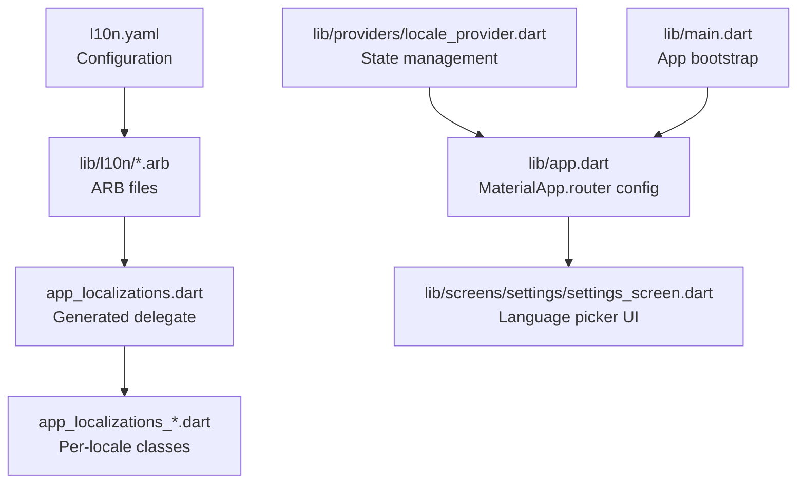
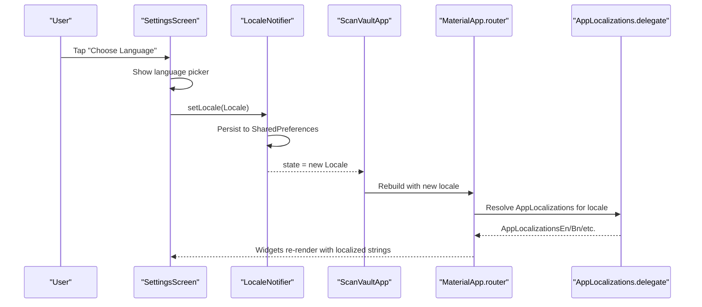
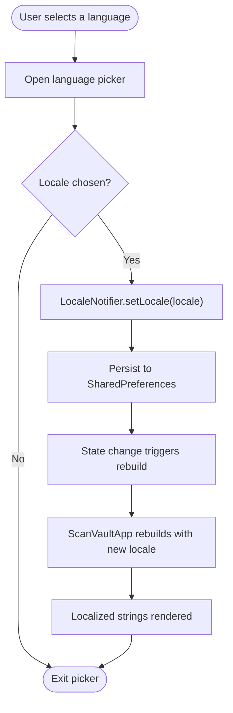
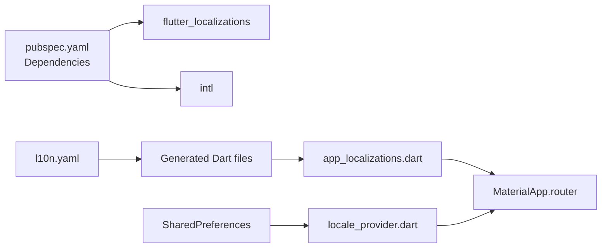

# Localization System

<cite>
**Referenced Files in This Document**
- [l10n.yaml](file://l10n.yaml)
- [pubspec.yaml](file://pubspec.yaml)
- [lib/main.dart](file://lib/main.dart)
- [lib/app.dart](file://lib/app.dart)
- [lib/providers/locale_provider.dart](file://lib/providers/locale_provider.dart)
- [lib/l10n/app_localizations.dart](file://lib/l10n/app_localizations.dart)
- [lib/l10n/app_localizations_en.dart](file://lib/l10n/app_localizations_en.dart)
- [lib/l10n/app_localizations_bn.dart](file://lib/l10n/app_localizations_bn.dart)
- [lib/l10n/app_en.arb](file://lib/l10n/app_en.arb)
- [lib/l10n/app_bn.arb](file://lib/l10n/app_bn.arb)
- [lib/screens/settings/settings_screen.dart](file://lib/screens/settings/settings_screen.dart)
</cite>

## Table of Contents
1. [Introduction](#introduction)
2. [Project Structure](#project-structure)
3. [Core Components](#core-components)
4. [Architecture Overview](#architecture-overview)
5. [Detailed Component Analysis](#detailed-component-analysis)
6. [Dependency Analysis](#dependency-analysis)
7. [Performance Considerations](#performance-considerations)
8. [Troubleshooting Guide](#troubleshooting-guide)
9. [Conclusion](#conclusion)

## Introduction
This document explains ScanVault’s internationalization (i18n) system that supports 10+ languages. It covers the ARB file structure, localization key management, runtime locale switching, and provider setup. It also describes how placeholders are used for dynamic text, how the system handles missing translations, and how to extend support to additional locales. Right-to-left (RTL) language support, date/time formatting, and number formatting are discussed conceptually, along with testing strategies and performance optimization guidance.

## Project Structure
ScanVault organizes its localization assets and code as follows:
- Configuration: l10n.yaml defines the ARB directory, template ARB filename, and generated Dart output.
- ARB files: One per supported locale under lib/l10n/, named app_<lang>.arb.
- Generated Dart: app_localizations.dart and per-locale app_localizations_<lang>.dart files.
- Runtime provider: locale_provider.dart manages the current locale state and persistence.
- App integration: app.dart configures MaterialApp.router with localization delegates and supported locales.
- Entry point: main.dart initializes services and runs the app.

**Diagram sources**
- [l10n.yaml](file://l10n.yaml#L1-L4)
- [lib/l10n/app_localizations.dart](file://lib/l10n/app_localizations.dart#L1-L115)
- [lib/providers/locale_provider.dart](file://lib/providers/locale_provider.dart#L1-L31)
- [lib/app.dart](file://lib/app.dart#L43-L58)
- [lib/screens/settings/settings_screen.dart](file://lib/screens/settings/settings_screen.dart#L270-L312)
- [lib/main.dart](file://lib/main.dart#L23-L31)

**Section sources**
- [l10n.yaml](file://l10n.yaml#L1-L4)
- [lib/l10n/app_localizations.dart](file://lib/l10n/app_localizations.dart#L1-L115)
- [lib/providers/locale_provider.dart](file://lib/providers/locale_provider.dart#L1-L31)
- [lib/app.dart](file://lib/app.dart#L43-L58)
- [lib/main.dart](file://lib/main.dart#L23-L31)

## Core Components
- ARB files: Define key-value pairs for each locale. Keys are stable identifiers used in code; values are localized strings with optional placeholders.
- Generated delegate: app_localizations.dart provides the AppLocalizations class, supportedLocales list, and a lookupAppLocalizations function to resolve the correct per-locale implementation.
- Per-locale implementations: app_localizations_<lang>.dart files override getters and methods for each key, returning localized strings.
- Locale provider: locale_provider.dart holds the current Locale in Riverpod state and persists it to shared preferences.
- App integration: app.dart passes the current locale to MaterialApp.router and registers localization delegates.

Key responsibilities:
- ARB files: Centralize translatable content and placeholders.
- Delegate and implementations: Provide strongly-typed accessors and method overloads for parameterized messages.
- Provider: Persist and propagate locale changes across the app lifecycle.
- App: Wire localization delegates and supported locales into the framework.

**Section sources**
- [lib/l10n/app_en.arb](file://lib/l10n/app_en.arb#L1-L118)
- [lib/l10n/app_bn.arb](file://lib/l10n/app_bn.arb#L1-L118)
- [lib/l10n/app_localizations.dart](file://lib/l10n/app_localizations.dart#L103-L115)
- [lib/l10n/app_localizations_en.dart](file://lib/l10n/app_localizations_en.dart#L1-L200)
- [lib/l10n/app_localizations_bn.dart](file://lib/l10n/app_localizations_bn.dart#L1-L200)
- [lib/providers/locale_provider.dart](file://lib/providers/locale_provider.dart#L9-L31)
- [lib/app.dart](file://lib/app.dart#L43-L58)

## Architecture Overview
The localization pipeline integrates ARB files, generated Dart, and runtime state management:

**Diagram sources**
- [lib/screens/settings/settings_screen.dart](file://lib/screens/settings/settings_screen.dart#L270-L312)
- [lib/providers/locale_provider.dart](file://lib/providers/locale_provider.dart#L24-L29)
- [lib/app.dart](file://lib/app.dart#L27-L61)
- [lib/l10n/app_localizations.dart](file://lib/l10n/app_localizations.dart#L82-L101)

## Detailed Component Analysis

### ARB File Structure and Key Management
- Location: lib/l10n/
- Naming convention: app_<lang>.arb
- Template: app_en.arb serves as the baseline for keys.
- Keys: Stable identifiers used in code; values are localized strings with placeholders for dynamic content.
- Placeholders: Parameterized keys (methods) accept arguments; ARB values define positional placeholders.

Examples of keys and usage:
- Static keys: appTitle, homeTab, settingsTab, save, cancel, delete, etc.
- Parameterized keys: errorScanning(error), pageCount(current, total), pagesAdded(count), etc.

Best practices:
- Keep keys concise and descriptive.
- Use consistent naming (snake_case).
- Prefer parameterized messages for dynamic content.
- Maintain parity across all ARB files.

**Section sources**
- [l10n.yaml](file://l10n.yaml#L1-L4)
- [lib/l10n/app_en.arb](file://lib/l10n/app_en.arb#L1-L118)
- [lib/l10n/app_bn.arb](file://lib/l10n/app_bn.arb#L1-L118)

### Generated Localization Delegates and Implementations
- Delegate: AppLocalizations class exposes:
  - supportedLocales: List of supported locales.
  - localizationsDelegates: Includes AppLocalizations.delegate plus global delegates.
  - lookupAppLocalizations: Resolves the correct per-locale implementation by language code.
- Per-locale classes: AppLocalizationsEn, AppLocalizationsBn, etc., override getters and methods to return localized strings.

Runtime behavior:
- AppLocalizations.of(context) retrieves the current AppLocalizations instance.
- The delegate resolves the appropriate implementation based on the current locale.

**Section sources**
- [lib/l10n/app_localizations.dart](file://lib/l10n/app_localizations.dart#L72-L115)
- [lib/l10n/app_localizations.dart](file://lib/l10n/app_localizations.dart#L835-L866)
- [lib/l10n/app_localizations_en.dart](file://lib/l10n/app_localizations_en.dart#L8-L11)
- [lib/l10n/app_localizations_bn.dart](file://lib/l10n/app_localizations_bn.dart#L8-L11)

### Runtime Locale Switching Implementation
- State management: LocaleNotifier stores the current Locale and persists it to SharedPreferences.
- UI trigger: SettingsScreen presents a language picker and calls setLocale on selection.
- App rebuild: ScanVaultApp watches localeProvider and rebuilds with the new locale.
- Delegation: MaterialApp.router uses AppLocalizations.delegate and supportedLocales to render localized content.

**Diagram sources**
- [lib/screens/settings/settings_screen.dart](file://lib/screens/settings/settings_screen.dart#L270-L312)
- [lib/providers/locale_provider.dart](file://lib/providers/locale_provider.dart#L24-L29)
- [lib/app.dart](file://lib/app.dart#L27-L61)

**Section sources**
- [lib/providers/locale_provider.dart](file://lib/providers/locale_provider.dart#L9-L31)
- [lib/screens/settings/settings_screen.dart](file://lib/screens/settings/settings_screen.dart#L270-L312)
- [lib/app.dart](file://lib/app.dart#L27-L61)

### Missing Translation Handling and Fallback Mechanism
- Supported locales list: AppLocalizations.supportedLocales enumerates supported languages.
- Delegate resolution: lookupAppLocalizations maps language codes to per-locale implementations.
- Fallback behavior: If a requested locale is not supported, the delegate throws a FlutterError indicating failure to load the unsupported locale. This signals that the generation tool or configuration needs correction.

Recommendation:
- Ensure l10n.yaml and supportedLocales remain synchronized.
- Provide a default template ARB (e.g., app_en.arb) and mirror all keys across locales.

**Section sources**
- [lib/l10n/app_localizations.dart](file://lib/l10n/app_localizations.dart#L103-L115)
- [lib/l10n/app_localizations.dart](file://lib/l10n/app_localizations.dart#L835-L866)

### Right-to-Left Language Support
- Current implementation: The system does not explicitly configure RTL layouts or directionality in the provided code.
- Recommendations:
  - Use TextDirection values conditionally based on locale.
  - Wrap directional layouts with Directionality widgets when needed.
  - Test with RTL locales to ensure proper mirroring and alignment.

[No sources needed since this section provides general guidance]

### Date/Time and Number Formatting
- Current implementation: There is no explicit use of intl.DateFormatter or NumberFormat in the reviewed files.
- Recommendations:
  - Use intl.DateFormat for locale-aware date/time formatting.
  - Use intl.NumberFormat for currency, percentages, and numeric formatting.
  - Apply formats consistently across screens and services.

[No sources needed since this section provides general guidance]

### Pluralization, Gender Agreement, and Context-Sensitive Translations
- Current implementation: The codebase uses parameterized keys with placeholders for counts and errors but does not demonstrate pluralization rules, gender agreement, or extensive context variants.
- Recommendations:
  - For pluralization, adopt platform-specific plural rules via intl or dedicated pluralization libraries.
  - For gender agreement, introduce context-aware keys or use ICU-style message formatting.
  - Maintain separate keys for different contexts (e.g., “item_count_one”, “item_count_other”) when needed.

[No sources needed since this section provides general guidance]

### Dynamic Text Loading and Translation Key Organization
- Dynamic text: Parameterized keys enable dynamic content insertion (e.g., error messages, counts, names).
- Key organization: Keys are grouped by functional areas (navigation, settings, dialogs, etc.) in ARB files.
- Usage pattern: Retrieve localized strings via AppLocalizations.of(context) and pass parameters to method-based keys.

Example usage locations:
- Settings screen uses localized strings for UI labels and dialogs.
- Parameterized keys handle counts and error messages.

**Section sources**
- [lib/l10n/app_en.arb](file://lib/l10n/app_en.arb#L33-L34)
- [lib/l10n/app_en.arb](file://lib/l10n/app_en.arb#L42-L43)
- [lib/l10n/app_localizations_en.dart](file://lib/l10n/app_localizations_en.dart#L33-L35)
- [lib/l10n/app_localizations_en.dart](file://lib/l10n/app_localizations_en.dart#L140-L142)
- [lib/screens/settings/settings_screen.dart](file://lib/screens/settings/settings_screen.dart#L19-L118)

### Localization Testing Strategies
- Unit tests: Verify that lookupAppLocalizations returns the correct per-locale implementation for supported language codes.
- UI tests: Confirm that changing the locale updates UI labels and dialogs immediately after a rebuild.
- Coverage checks: Ensure all keys present in the template ARB exist in each locale ARB file.
- Accessibility tests: Validate text rendering and layout for long translated strings.

[No sources needed since this section provides general guidance]

## Dependency Analysis
Localization depends on:
- Flutter localization SDK and intl package.
- Generated Dart files from ARB assets.
- Riverpod for state management.
- Shared preferences for persistence.

**Diagram sources**
- [pubspec.yaml](file://pubspec.yaml#L57-L58)
- [pubspec.yaml](file://pubspec.yaml#L50)
- [l10n.yaml](file://l10n.yaml#L1-L4)
- [lib/l10n/app_localizations.dart](file://lib/l10n/app_localizations.dart#L1-L18)
- [lib/providers/locale_provider.dart](file://lib/providers/locale_provider.dart#L1-L31)
- [lib/app.dart](file://lib/app.dart#L43-L58)

**Section sources**
- [pubspec.yaml](file://pubspec.yaml#L57-L58)
- [pubspec.yaml](file://pubspec.yaml#L50)
- [l10n.yaml](file://l10n.yaml#L1-L4)
- [lib/l10n/app_localizations.dart](file://lib/l10n/app_localizations.dart#L1-L18)
- [lib/providers/locale_provider.dart](file://lib/providers/locale_provider.dart#L1-L31)
- [lib/app.dart](file://lib/app.dart#L43-L58)

## Performance Considerations
- Minimize rebuild scope: Keep locale changes scoped to necessary widgets to reduce unnecessary rebuilds.
- Lazy initialization: Ensure ARB-generated files are compiled during build, not runtime.
- Memory: Per-locale implementations are lightweight; avoid caching redundant localized strings in widgets.
- Bundle size: Remove unused keys from ARB files to keep asset sizes minimal.

[No sources needed since this section provides general guidance]

## Troubleshooting Guide
Common issues and resolutions:
- Unsupported locale error: If a locale is not in supportedLocales or lacks a matching per-locale implementation, lookupAppLocalizations throws an error. Ensure l10n.yaml and supportedLocales are aligned and that ARB files exist for all supported locales.
- Missing keys: If a key is absent in a locale ARB, the generated getter may be missing. Add the key to the locale ARB and regenerate.
- Persistence not applied: Verify SharedPreferences writes succeed and LocaleNotifier loads persisted values on startup.

**Section sources**
- [lib/l10n/app_localizations.dart](file://lib/l10n/app_localizations.dart#L835-L866)
- [lib/providers/locale_provider.dart](file://lib/providers/locale_provider.dart#L16-L22)

## Conclusion
ScanVault’s i18n system leverages ARB files and generated Dart delegates to deliver localized content across 10+ languages. The runtime locale switching is powered by Riverpod and persisted via SharedPreferences, ensuring a smooth user experience. While the current implementation focuses on static and parameterized keys, future enhancements can incorporate pluralization, gender agreement, and context-sensitive translations. Extending RTL support, date/time, and number formatting will further improve international usability.