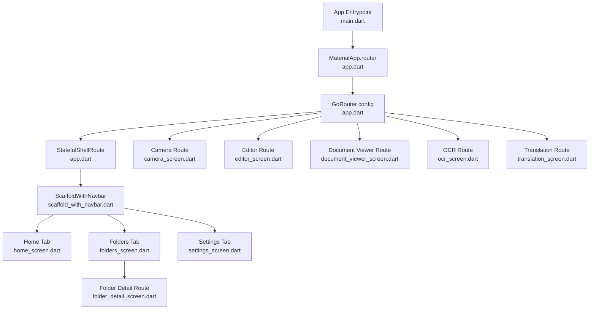
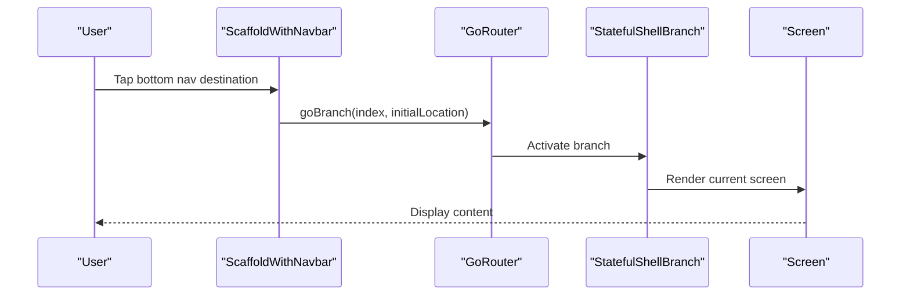
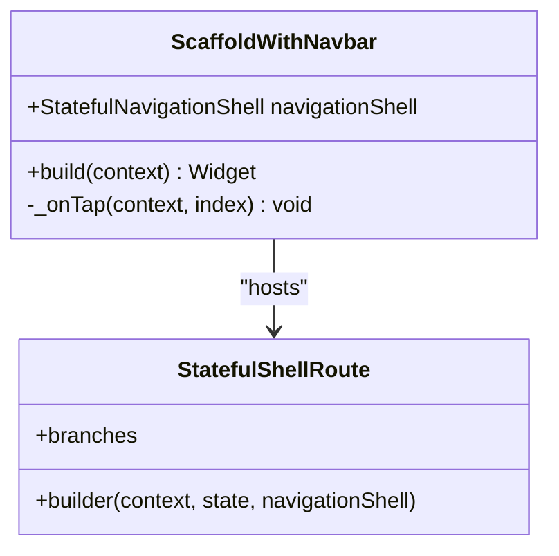
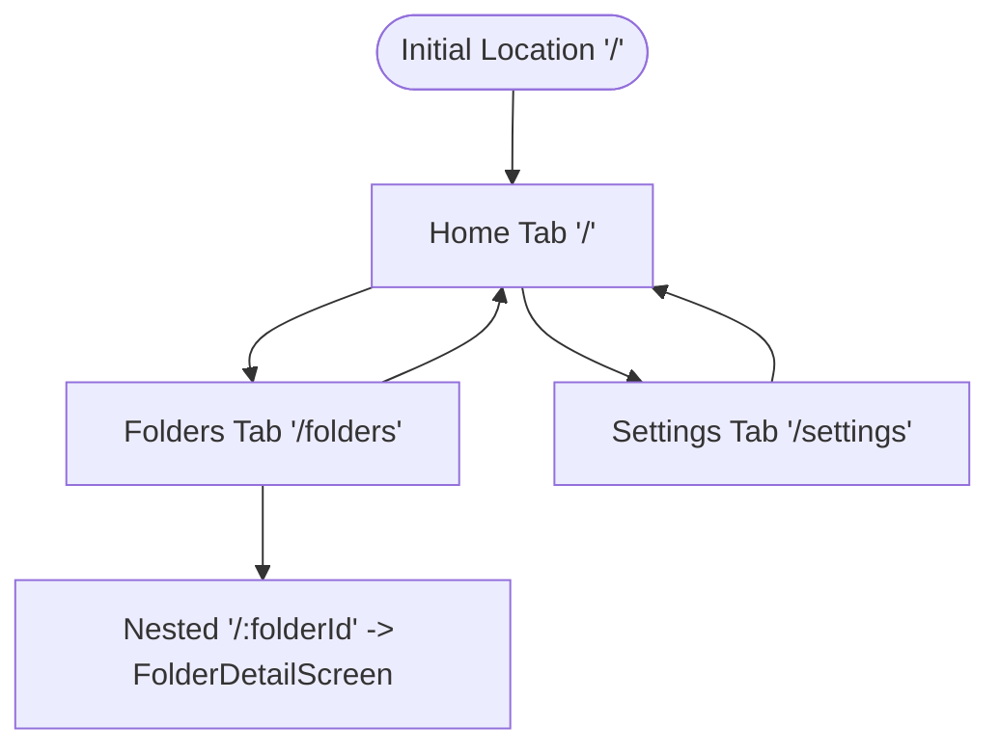
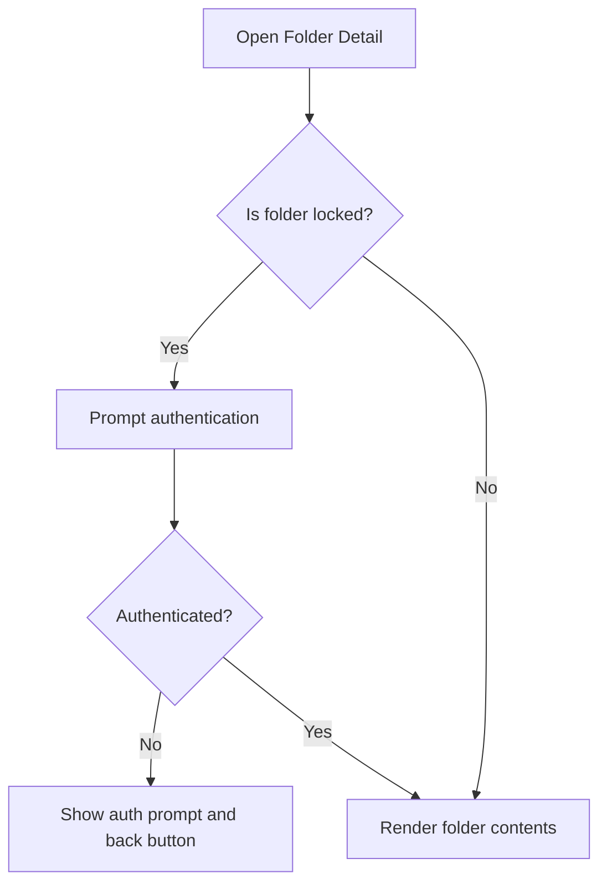
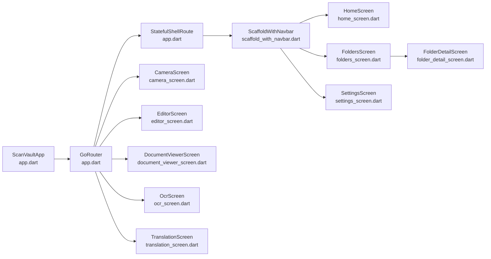

# Navigation System

<cite>
**Referenced Files in This Document**
- [app.dart](file://lib/app.dart)
- [main.dart](file://lib/main.dart)
- [scaffold_with_navbar.dart](file://lib/widgets/scaffold_with_navbar.dart)
- [home_screen.dart](file://lib/screens/home/home_screen.dart)
- [folders_screen.dart](file://lib/screens/folders/folders_screen.dart)
- [folder_detail_screen.dart](file://lib/screens/folders/folder_detail_screen.dart)
- [settings_screen.dart](file://lib/screens/settings/settings_screen.dart)
- [camera_screen.dart](file://lib/screens/camera/camera_screen.dart)
- [document_viewer_screen.dart](file://lib/screens/document_viewer/document_viewer_screen.dart)
- [editor_screen.dart](file://lib/screens/editor/editor_screen.dart)
- [ocr_screen.dart](file://lib/screens/ocr/ocr_screen.dart)
- [translation_screen.dart](file://lib/screens/translation/translation_screen.dart)
</cite>

## Table of Contents
1. [Introduction](#introduction)
2. [Project Structure](#project-structure)
3. [Core Components](#core-components)
4. [Architecture Overview](#architecture-overview)
5. [Detailed Component Analysis](#detailed-component-analysis)
6. [Dependency Analysis](#dependency-analysis)
7. [Performance Considerations](#performance-considerations)
8. [Troubleshooting Guide](#troubleshooting-guide)
9. [Conclusion](#conclusion)
10. [Appendices](#appendices)

## Introduction
This document explains ScanVault’s navigation architecture built with GoRouter. It covers the shell route implementation for persistent bottom navigation, main tab structure, nested routes, conditional flows (such as folder locking), programmatic navigation, parameter passing, transitions, responsive patterns, and accessibility. It also outlines testing strategies, performance optimization, and memory management considerations.

## Project Structure
The navigation system centers around a single-router configuration that defines:
- A stateful shell route with three main branches (Home, Folders, Settings)
- Full-screen routes for camera, editor, document viewer, OCR, and translation
- Nested routing under the Folders branch for folder detail views

**Diagram sources**
- [main.dart](file://lib/main.dart#L10-L31)
- [app.dart](file://lib/app.dart#L43-L61)
- [app.dart](file://lib/app.dart#L67-L186)
- [scaffold_with_navbar.dart](file://lib/widgets/scaffold_with_navbar.dart#L7-L53)
- [home_screen.dart](file://lib/screens/home/home_screen.dart#L20-L25)
- [folders_screen.dart](file://lib/screens/folders/folders_screen.dart#L14-L19)
- [settings_screen.dart](file://lib/screens/settings/settings_screen.dart#L13-L14)
- [camera_screen.dart](file://lib/screens/camera/camera_screen.dart#L21-L31)
- [document_viewer_screen.dart](file://lib/screens/document_viewer/document_viewer_screen.dart#L24-L34)
- [editor_screen.dart](file://lib/screens/editor/editor_screen.dart#L16-L28)
- [ocr_screen.dart](file://lib/screens/ocr/ocr_screen.dart#L11-L27)
- [translation_screen.dart](file://lib/screens/translation/translation_screen.dart#L7-L17)
- [folder_detail_screen.dart](file://lib/screens/folders/folder_detail_screen.dart#L15-L21)

**Section sources**
- [main.dart](file://lib/main.dart#L10-L31)
- [app.dart](file://lib/app.dart#L43-L61)
- [app.dart](file://lib/app.dart#L67-L186)

## Core Components
- Router configuration: Centralized in a single GoRouter instance with a root navigator key, initial location, and route definitions.
- Shell route: A stateful shell route with indexed stack to host three persistent bottom-navigation branches.
- Shell wrapper: A scaffold wrapper that hosts the navigation shell and renders the bottom navigation bar.
- Main tabs: Home, Folders, and Settings, each backed by a dedicated screen.
- Full-screen routes: Camera, Editor, Document Viewer, OCR, and Translation operate outside the shell.
- Nested routes: Folders branch includes a nested route for folder detail using a path parameter.

Key responsibilities:
- NavigationShell manages branch switching and maintains state per branch.
- Parameter passing occurs via path parameters and route extras.
- Conditional flows are implemented inside screens (e.g., folder locking).

**Section sources**
- [app.dart](file://lib/app.dart#L67-L186)
- [scaffold_with_navbar.dart](file://lib/widgets/scaffold_with_navbar.dart#L7-L53)

## Architecture Overview
The navigation architecture uses a hybrid model:
- Persistent bottom navigation via a stateful shell route
- Full-screen overlays for editing and specialized flows
- Nested routing for hierarchical data (folder → folder detail)

**Diagram sources**
- [scaffold_with_navbar.dart](file://lib/widgets/scaffold_with_navbar.dart#L15-L23)
- [app.dart](file://lib/app.dart#L72-L75)

## Detailed Component Analysis

### Shell Route and Bottom Navigation
- The shell route uses an indexed stack to preserve branch state.
- The wrapper scaffold renders the NavigationBar and delegates navigation to the shell.
- Tapping the active destination navigates to its initial location, enabling quick re-entry to the root of the current branch.

**Diagram sources**
- [scaffold_with_navbar.dart](file://lib/widgets/scaffold_with_navbar.dart#L7-L53)
- [app.dart](file://lib/app.dart#L72-L75)

**Section sources**
- [scaffold_with_navbar.dart](file://lib/widgets/scaffold_with_navbar.dart#L15-L23)
- [app.dart](file://lib/app.dart#L72-L75)

### Main Tabs and Nested Routes
- Home tab: Root path “/” renders the Home screen.
- Folders tab: Root path “/folders” renders the Folders screen; nested “:folderId” renders the Folder detail screen.
- Settings tab: Root path “/settings” renders the Settings screen.

**Diagram sources**
- [app.dart](file://lib/app.dart#L80-L84)
- [app.dart](file://lib/app.dart#L90-L102)
- [app.dart](file://lib/app.dart#L110-L114)

**Section sources**
- [app.dart](file://lib/app.dart#L80-L114)
- [folder_detail_screen.dart](file://lib/screens/folders/folder_detail_screen.dart#L99-L169)

### Full-Screen Routes and Programmatic Navigation
- Camera: Full-screen route at “/camera”; accepts a boolean extra to control batch mode.
- Editor: Full-screen route at “/editor/:pageId”; accepts an image path extra.
- Document Viewer: Full-screen route at “/document/:documentId”.
- OCR: Full-screen route at “/ocr/:documentId”; accepts imageUrl, initialText, and pageId via extra.
- Translation: Full-screen route at “/translation”; accepts initial text via extra.

Programmatic navigation patterns:
- Bottom tab activation uses navigationShell.goBranch with initialLocation support.
- Screens navigate using context.push or context.pushNamed with path parameters and extras.

Examples of programmatic navigation:
- Home screen shows scan options and navigates to “/camera” with an extra.
- Document viewer navigates to “/editor/:pageId” with an extra image path.
- OCR screen navigates to “/translation” with extra text.
- Folder grid item navigates to “/folders/:folderId” by name.

**Section sources**
- [app.dart](file://lib/app.dart#L121-L184)
- [home_screen.dart](file://lib/screens/home/home_screen.dart#L288-L319)
- [document_viewer_screen.dart](file://lib/screens/document_viewer/document_viewer_screen.dart#L408-L413)
- [ocr_screen.dart](file://lib/screens/ocr/ocr_screen.dart#L132-L136)
- [folders_screen.dart](file://lib/screens/folders/folders_screen.dart#L296-L298)

### Conditional Navigation Flows
- Folder detail screen conditionally requires authentication if the folder is locked. If unauthenticated, it displays an authentication prompt and allows returning to the previous screen.
- Authentication is performed via a service call before rendering folder contents.

**Diagram sources**
- [folder_detail_screen.dart](file://lib/screens/folders/folder_detail_screen.dart#L48-L96)

**Section sources**
- [folder_detail_screen.dart](file://lib/screens/folders/folder_detail_screen.dart#L48-L96)

### Parameter Passing Between Screens
- Path parameters:
  - “/folders/:folderId” passes the folder identifier to FolderDetailScreen.
  - “/document/:documentId” passes the document identifier to DocumentViewerScreen.
  - “/ocr/:documentId” passes the document identifier to OcrScreen.
  - “/editor/:pageId” passes the page identifier to EditorScreen.
- Extras:
  - “/camera” accepts a boolean extra to control batch mode.
  - “/editor/:pageId” accepts an image path extra.
  - “/ocr/:documentId” accepts imageUrl, initialText, and pageId extras.
  - “/translation” accepts initial text via extra.

**Section sources**
- [app.dart](file://lib/app.dart#L95-L101)
- [app.dart](file://lib/app.dart#L144-L152)
- [app.dart](file://lib/app.dart#L132-L141)
- [app.dart](file://lib/app.dart#L155-L173)
- [app.dart](file://lib/app.dart#L175-L184)

### Navigation Animations and Transitions
- The shell route uses an indexed stack, preserving branch state and avoiding rebuilds when switching tabs.
- No explicit custom transitions are configured in the router; default platform transitions apply for full-screen routes.
- Bottom navigation taps trigger branch switches without animation between tabs because the shell preserves state.

**Section sources**
- [app.dart](file://lib/app.dart#L72-L75)

### Responsive Navigation Patterns
- The bottom navigation bar adapts to device orientation and provides localized labels.
- The shell wrapper ensures the bottom navigation remains visible and usable across screen sizes.

**Section sources**
- [scaffold_with_navbar.dart](file://lib/widgets/scaffold_with_navbar.dart#L30-L50)

### Accessibility Considerations
- Navigation destinations use icons with labels for clarity.
- Bottom navigation reflects the current index, aiding orientation.
- Full-screen routes use standard app bars with titles and actions.

Recommendations:
- Ensure sufficient touch targets for bottom navigation items.
- Provide focus indicators for interactive elements in full-screen routes.
- Use semantic labels for icons where appropriate.

**Section sources**
- [scaffold_with_navbar.dart](file://lib/widgets/scaffold_with_navbar.dart#L34-L48)

## Dependency Analysis
The navigation system depends on:
- GoRouter for routing and navigation shell management
- Material App configuration for localization and theming
- Riverpod providers for state-driven navigation decisions (e.g., folders and documents)

**Diagram sources**
- [app.dart](file://lib/app.dart#L43-L61)
- [app.dart](file://lib/app.dart#L67-L186)
- [scaffold_with_navbar.dart](file://lib/widgets/scaffold_with_navbar.dart#L7-L53)
- [home_screen.dart](file://lib/screens/home/home_screen.dart#L20-L25)
- [folders_screen.dart](file://lib/screens/folders/folders_screen.dart#L14-L19)
- [settings_screen.dart](file://lib/screens/settings/settings_screen.dart#L13-L14)
- [camera_screen.dart](file://lib/screens/camera/camera_screen.dart#L21-L31)
- [document_viewer_screen.dart](file://lib/screens/document_viewer/document_viewer_screen.dart#L24-L34)
- [editor_screen.dart](file://lib/screens/editor/editor_screen.dart#L16-L28)
- [ocr_screen.dart](file://lib/screens/ocr/ocr_screen.dart#L11-L27)
- [translation_screen.dart](file://lib/screens/translation/translation_screen.dart#L7-L17)
- [folder_detail_screen.dart](file://lib/screens/folders/folder_detail_screen.dart#L15-L21)

**Section sources**
- [app.dart](file://lib/app.dart#L43-L61)
- [app.dart](file://lib/app.dart#L67-L186)

## Performance Considerations
- Indexed stack in the shell route preserves branch state, reducing rebuild overhead when switching tabs.
- Full-screen routes are isolated from the shell, minimizing unnecessary recompositions.
- Avoid heavy work in route builders; defer to screen-level initialization and state management.
- Dispose of controllers and resources in screen dispose hooks to prevent leaks.

**Section sources**
- [app.dart](file://lib/app.dart#L72-L75)
- [home_screen.dart](file://lib/screens/home/home_screen.dart#L35-L38)
- [document_viewer_screen.dart](file://lib/screens/document_viewer/document_viewer_screen.dart#L48-L51)

## Troubleshooting Guide
Common issues and resolutions:
- Navigation does not switch tabs: Ensure the bottom navigation callback invokes navigationShell.goBranch with the correct index and initialLocation flag.
- Nested route not rendering: Verify the path parameter name matches the route definition and that the screen reads it correctly.
- Full-screen route not appearing: Confirm the route is declared with a parentNavigatorKey and that the screen is reachable from the intended context.
- Authentication prompt blocking navigation: Ensure the authentication flow returns appropriately and the screen rebuilds after completion.

Testing strategies:
- Unit tests for route definitions and parameter extraction.
- Widget tests for bottom navigation interactions and branch switching.
- Integration tests for full-screen flows and nested routes.
- Accessibility tests for bottom navigation and screen transitions.

**Section sources**
- [scaffold_with_navbar.dart](file://lib/widgets/scaffold_with_navbar.dart#L15-L23)
- [folder_detail_screen.dart](file://lib/screens/folders/folder_detail_screen.dart#L48-L96)
- [app.dart](file://lib/app.dart#L121-L184)

## Conclusion
ScanVault’s navigation system leverages GoRouter’s stateful shell route to deliver a responsive, state-preserving bottom navigation experience. Full-screen routes handle specialized flows, while nested routes manage hierarchical data. The architecture balances simplicity with flexibility, enabling straightforward programmatic navigation, parameter passing, and conditional flows such as folder authentication. With careful attention to performance and accessibility, the system supports smooth user experiences across platforms.

## Appendices

### Navigation API Reference
- Shell route: StatefulShellRoute with indexed stack
- Main tabs: Home “/”, Folders “/folders”, Settings “/settings”
- Nested: Folders detail “/folders/:folderId”
- Full-screen: Camera “/camera”, Editor “/editor/:pageId”, Document “/document/:documentId”, OCR “/ocr/:documentId”, Translation “/translation”

Parameter and extra usage:
- Path parameters: :folderId, :documentId, :pageId
- Extras: batch mode (boolean), image path (string), OCR args (map), initial text (string)

**Section sources**
- [app.dart](file://lib/app.dart#L72-L184)