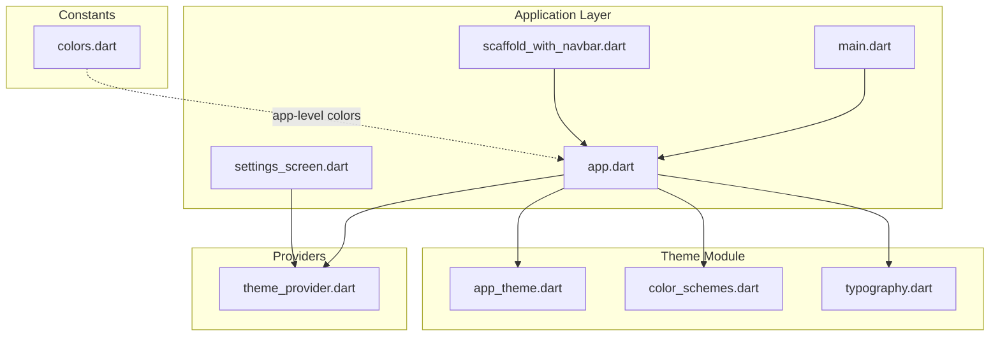
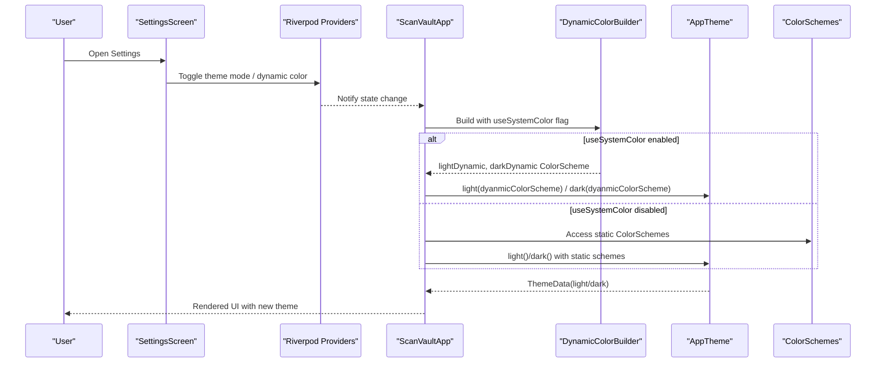
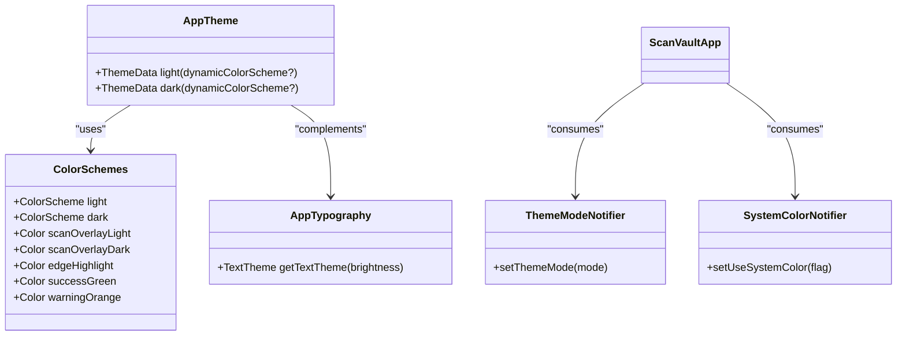
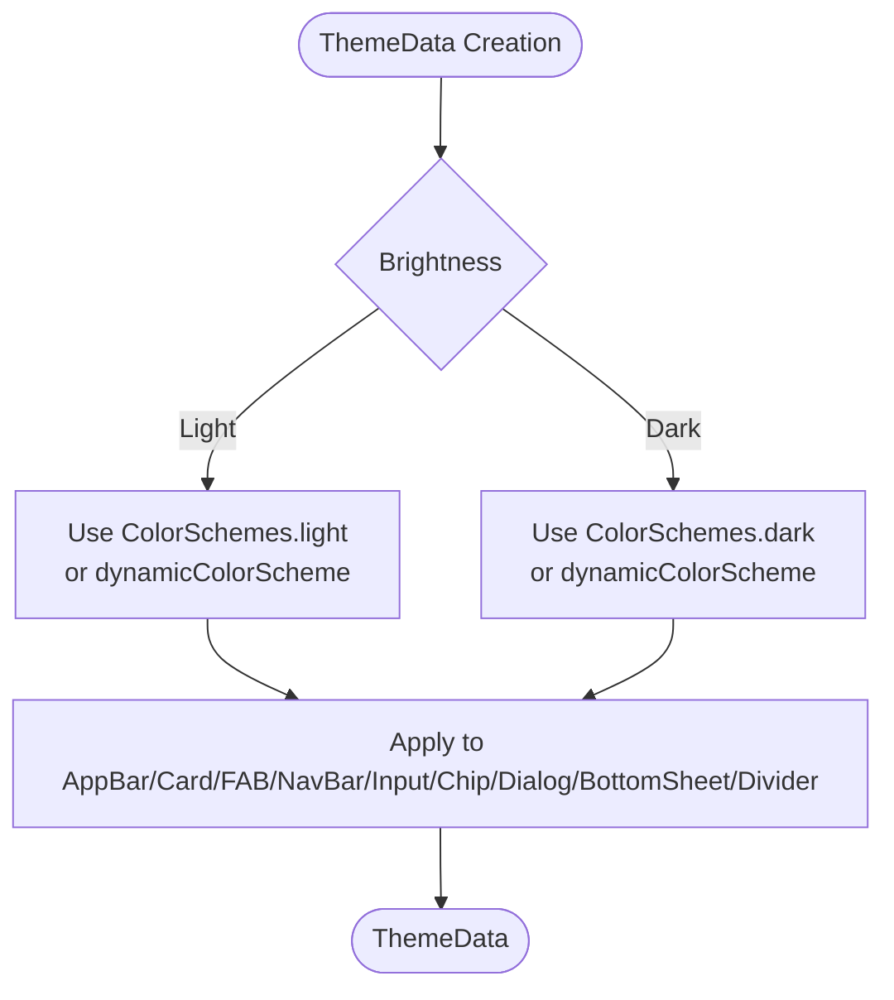
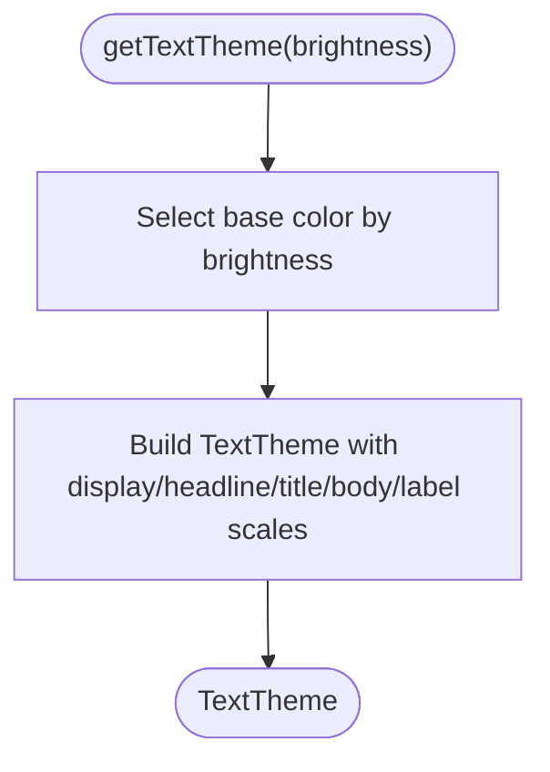
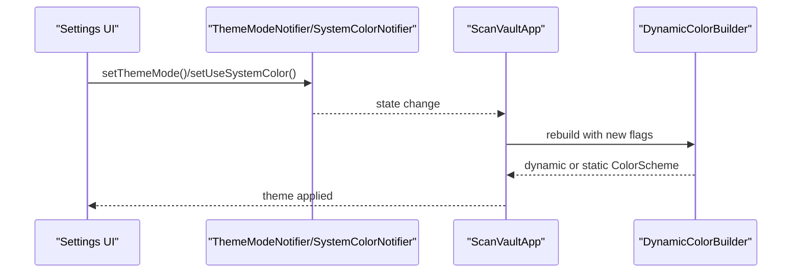
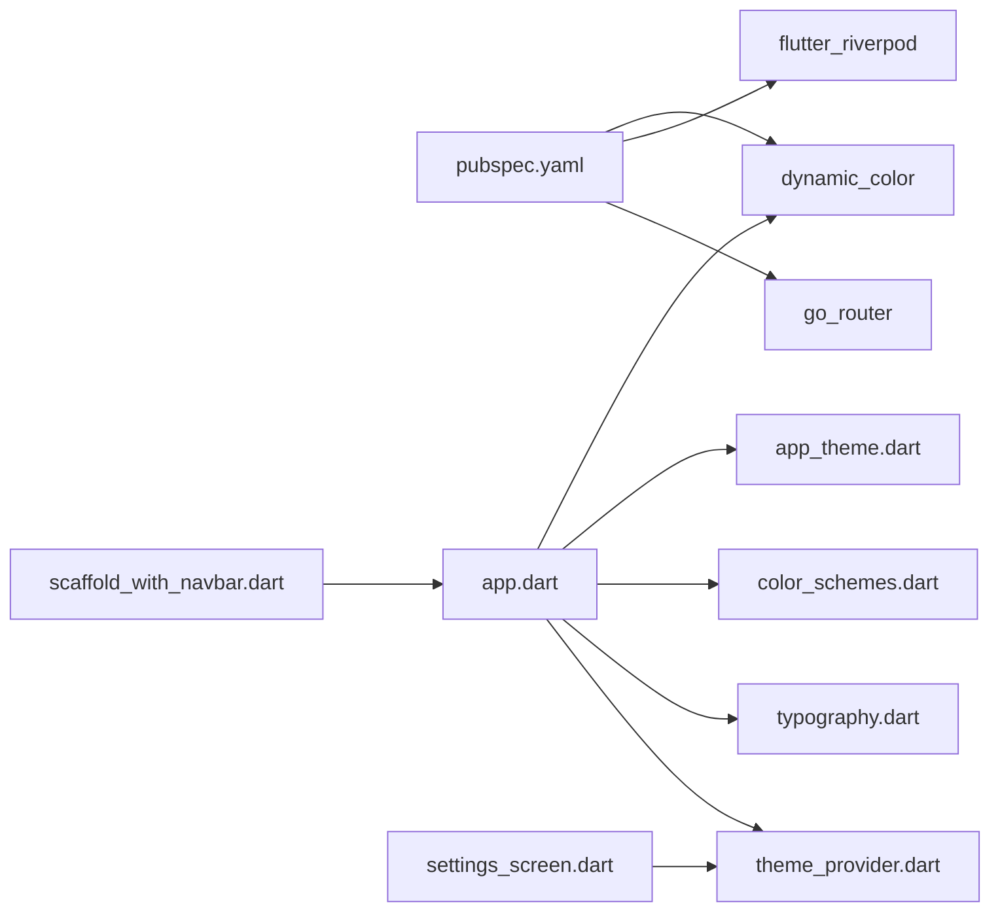

# Theming System

<cite>
**Referenced Files in This Document**
- [app.dart](file://lib/app.dart)
- [main.dart](file://lib/main.dart)
- [app_theme.dart](file://lib/theme/app_theme.dart)
- [color_schemes.dart](file://lib/theme/color_schemes.dart)
- [typography.dart](file://lib/theme/typography.dart)
- [theme_provider.dart](file://lib/providers/theme_provider.dart)
- [colors.dart](file://lib/core/constants/colors.dart)
- [settings_screen.dart](file://lib/screens/settings/settings_screen.dart)
- [scaffold_with_navbar.dart](file://lib/widgets/scaffold_with_navbar.dart)
- [pubspec.yaml](file://pubspec.yaml)
</cite>

## Table of Contents
1. [Introduction](#introduction)
2. [Project Structure](#project-structure)
3. [Core Components](#core-components)
4. [Architecture Overview](#architecture-overview)
5. [Detailed Component Analysis](#detailed-component-analysis)
6. [Dependency Analysis](#dependency-analysis)
7. [Performance Considerations](#performance-considerations)
8. [Troubleshooting Guide](#troubleshooting-guide)
9. [Conclusion](#conclusion)

## Introduction
This document explains ScanVault’s theming system built on Material Design 3 (Material You). It covers dynamic color scheme support, light and dark theme variants, color scheme customization, ThemeData configuration for key components, the color scheme system with surface and semantic colors, typography implementation, and practical examples for theme customization, dynamic color adaptation, and theme switching. It also addresses performance considerations for rendering and memory optimization in large-scale applications.

## Project Structure
ScanVault organizes theming under a dedicated theme module and integrates it into the application via a Riverpod provider. The main application widget composes the theme and exposes a settings screen for theme selection and dynamic color toggling.

**Diagram sources**
- [main.dart](file://lib/main.dart#L10-L31)
- [app.dart](file://lib/app.dart#L23-L62)
- [settings_screen.dart](file://lib/screens/settings/settings_screen.dart#L12-L120)
- [scaffold_with_navbar.dart](file://lib/widgets/scaffold_with_navbar.dart#L6-L53)
- [app_theme.dart](file://lib/theme/app_theme.dart#L4-L251)
- [color_schemes.dart](file://lib/theme/color_schemes.dart#L3-L84)
- [typography.dart](file://lib/theme/typography.dart#L3-L115)
- [theme_provider.dart](file://lib/providers/theme_provider.dart#L4-L28)
- [colors.dart](file://lib/core/constants/colors.dart#L3-L23)

**Section sources**
- [main.dart](file://lib/main.dart#L10-L31)
- [app.dart](file://lib/app.dart#L23-L62)
- [settings_screen.dart](file://lib/screens/settings/settings_screen.dart#L12-L120)
- [scaffold_with_navbar.dart](file://lib/widgets/scaffold_with_navbar.dart#L6-L53)
- [app_theme.dart](file://lib/theme/app_theme.dart#L4-L251)
- [color_schemes.dart](file://lib/theme/color_schemes.dart#L3-L84)
- [typography.dart](file://lib/theme/typography.dart#L3-L115)
- [theme_provider.dart](file://lib/providers/theme_provider.dart#L4-L28)
- [colors.dart](file://lib/core/constants/colors.dart#L3-L23)

## Core Components
- AppTheme: Provides Material 3 ThemeData instances for light and dark modes, including AppBarTheme, CardTheme, FloatingActionButtonTheme, NavigationBarTheme, InputDecorationTheme, ChipTheme, DialogTheme, BottomSheetTheme, and DividerTheme.
- ColorSchemes: Defines Material 3 color schemes with seed-based generation and explicit overrides for surface, containers, and semantic colors.
- AppTypography: Supplies a TextTheme factory that adapts text styles to brightness.
- ThemeModeNotifier and SystemColorNotifier: Riverpod providers controlling theme mode and dynamic color usage.
- SettingsScreen: UI for selecting theme mode and toggling dynamic color usage.
- ScaffoldWithNavbar: Uses NavigationBar (Material 3) with theme-aware indicators and labels.

**Section sources**
- [app_theme.dart](file://lib/theme/app_theme.dart#L4-L251)
- [color_schemes.dart](file://lib/theme/color_schemes.dart#L3-L84)
- [typography.dart](file://lib/theme/typography.dart#L3-L115)
- [theme_provider.dart](file://lib/providers/theme_provider.dart#L4-L28)
- [settings_screen.dart](file://lib/screens/settings/settings_screen.dart#L12-L161)
- [scaffold_with_navbar.dart](file://lib/widgets/scaffold_with_navbar.dart#L6-L53)

## Architecture Overview
The theming pipeline integrates dynamic color generation with a provider-driven theme mode. DynamicColorBuilder supplies seed-based color schemes when available; otherwise, the static ColorSchemes are used. The app applies the resulting ColorScheme to ThemeData and exposes theme controls in the settings screen.

**Diagram sources**
- [app.dart](file://lib/app.dart#L33-L60)
- [theme_provider.dart](file://lib/providers/theme_provider.dart#L9-L28)
- [app_theme.dart](file://lib/theme/app_theme.dart#L9-L12)
- [color_schemes.dart](file://lib/theme/color_schemes.dart#L11-L42)

**Section sources**
- [app.dart](file://lib/app.dart#L33-L60)
- [theme_provider.dart](file://lib/providers/theme_provider.dart#L9-L28)
- [app_theme.dart](file://lib/theme/app_theme.dart#L9-L12)
- [color_schemes.dart](file://lib/theme/color_schemes.dart#L11-L42)

## Detailed Component Analysis

### Material 3 Color Scheme System
- Seed-based generation: A teal seed color drives both light and dark schemes.
- Overrides: Explicit overrides refine primary, secondary, tertiary, error, and surface palette values for consistent brand identity.
- Surface containers: Extensive container tokens enable layered surfaces and elevated backgrounds.
- Semantic colors: Clear separation of primary, secondary, tertiary, and error roles for affordance and accessibility.

**Diagram sources**
- [color_schemes.dart](file://lib/theme/color_schemes.dart#L3-L84)
- [app_theme.dart](file://lib/theme/app_theme.dart#L4-L251)
- [typography.dart](file://lib/theme/typography.dart#L3-L115)
- [theme_provider.dart](file://lib/providers/theme_provider.dart#L9-L28)

**Section sources**
- [color_schemes.dart](file://lib/theme/color_schemes.dart#L7-L76)
- [app_theme.dart](file://lib/theme/app_theme.dart#L11-L42)
- [colors.dart](file://lib/core/constants/colors.dart#L7-L23)

### ThemeData Configuration
- AppBarTheme: Centered title, minimal elevation, surface background with on-surface foreground, and a readable title text style.
- CardTheme: Flat cards with anti-aliased clipping for crisp edges.
- FloatingActionButtonTheme: Elevated buttons with rounded corners, primary background, and on-primary foreground.
- BottomNavigationBarTheme: Fixed type with surface background and primary/unselected item colors.
- NavigationBarTheme (Material 3): Surface background, primary-container indicator, fixed height, always-show labels.
- InputDecorationTheme: Filled inputs with surfaceContainerHighest background, rounded borders, and primary-focused borders.
- ChipTheme: Low elevation chips with rounded shapes, surfaceContainerHighest background, primaryContainer selection, and variant text color.
- DialogTheme: Elevated dialogs with rounded corners.
- BottomSheetTheme: Elevated bottom sheets with top-rounded corners and surface background.
- DividerTheme: Variant outline for subtle dividers.

**Diagram sources**
- [app_theme.dart](file://lib/theme/app_theme.dart#L9-L128)
- [app_theme.dart](file://lib/theme/app_theme.dart#L131-L250)

**Section sources**
- [app_theme.dart](file://lib/theme/app_theme.dart#L16-L127)
- [app_theme.dart](file://lib/theme/app_theme.dart#L139-L249)

### Typography Implementation
- Brightness-aware text colors: Ensures readability across light/dark themes.
- Hierarchical scales: Display, headline, title, body, and label scales with consistent spacing and weights.
- Consistent color application: Typography adapts to theme brightness for optimal contrast.

**Diagram sources**
- [typography.dart](file://lib/theme/typography.dart#L8-L114)

**Section sources**
- [typography.dart](file://lib/theme/typography.dart#L8-L114)

### Theme Switching Mechanisms
- ThemeMode: System, light, or dark selection persisted via Riverpod.
- Dynamic Color: Toggle to use device/system colors when available; otherwise fallback to static schemes.
- Settings UI: Radio list for theme mode and a switch for dynamic color.

**Diagram sources**
- [settings_screen.dart](file://lib/screens/settings/settings_screen.dart#L122-L161)
- [theme_provider.dart](file://lib/providers/theme_provider.dart#L9-L28)
- [app.dart](file://lib/app.dart#L33-L60)

**Section sources**
- [settings_screen.dart](file://lib/screens/settings/settings_screen.dart#L122-L161)
- [theme_provider.dart](file://lib/providers/theme_provider.dart#L9-L28)
- [app.dart](file://lib/app.dart#L28-L48)

### Dynamic Color Adaptation
- DynamicColorBuilder: Provides lightDynamic and darkDynamic ColorScheme when supported by the platform.
- Conditional application: When “Use system colors” is enabled, the app prefers dynamic schemes; otherwise, it uses static ColorSchemes.

```mermaid
flowchart TD
DStart(["DynamicColorBuilder"]) --> Check{"useSystemColor?"}
Check --> |Yes| Dyn["Use lightDynamic/darkDynamic"]
Check --> |No| Static["Use ColorSchemes.light/dark"]
Dyn --> ApplyDyn["AppTheme.light()/dark()"]
Static --> ApplyStat["AppTheme.light()/dark()"]
ApplyDyn --> DEnd(["Material 3 Theme"])
ApplyStat --> DEnd
```

**Diagram sources**
- [app.dart](file://lib/app.dart#L33-L60)
- [color_schemes.dart](file://lib/theme/color_schemes.dart#L11-L76)
- [app_theme.dart](file://lib/theme/app_theme.dart#L9-L12)

**Section sources**
- [app.dart](file://lib/app.dart#L33-L60)
- [color_schemes.dart](file://lib/theme/color_schemes.dart#L11-L76)
- [app_theme.dart](file://lib/theme/app_theme.dart#L9-L12)

### Example Scenarios
- Switch to dark theme: Select “Dark” in Settings; ThemeModeNotifier updates state; ScanVaultApp rebuilds with ThemeData.dark().
- Enable dynamic colors: Toggle “Use system colors”; DynamicColorBuilder supplies system ColorScheme; AppTheme applies dynamic scheme.
- Customize primary palette: Modify the seed color in ColorSchemes; regenerate both light and dark schemes; AppTheme reflects updated ColorScheme.

**Section sources**
- [settings_screen.dart](file://lib/screens/settings/settings_screen.dart#L122-L161)
- [theme_provider.dart](file://lib/providers/theme_provider.dart#L9-L28)
- [app.dart](file://lib/app.dart#L33-L60)
- [color_schemes.dart](file://lib/theme/color_schemes.dart#L7-L8)

## Dependency Analysis
- External dependencies: dynamic_color enables system color adaptation; Riverpod manages theme state; go_router handles navigation with a persistent bottom bar.
- Internal dependencies: AppTheme depends on ColorSchemes and Typography; ScanVaultApp composes providers and passes dynamic schemes to AppTheme.

**Diagram sources**
- [pubspec.yaml](file://pubspec.yaml#L59-L59)
- [app.dart](file://lib/app.dart#L6-L11)
- [theme_provider.dart](file://lib/providers/theme_provider.dart#L1-L2)
- [app_theme.dart](file://lib/theme/app_theme.dart#L1-L2)
- [color_schemes.dart](file://lib/theme/color_schemes.dart#L1-L1)
- [typography.dart](file://lib/theme/typography.dart#L1-L1)
- [settings_screen.dart](file://lib/screens/settings/settings_screen.dart#L3-L9)
- [scaffold_with_navbar.dart](file://lib/widgets/scaffold_with_navbar.dart#L1-L2)

**Section sources**
- [pubspec.yaml](file://pubspec.yaml#L59-L59)
- [app.dart](file://lib/app.dart#L6-L11)
- [theme_provider.dart](file://lib/providers/theme_provider.dart#L1-L2)

## Performance Considerations
- Minimize rebuild scope: Use Riverpod providers to isolate theme state changes; keep theme creation lightweight by reusing ColorScheme instances.
- Avoid unnecessary recomposition: Pass ColorScheme directly to ThemeData constructors; avoid rebuilding entire subtree on theme changes.
- Memory optimization: Keep ColorScheme and TextTheme immutable; reuse static schemes where possible; defer heavy computations to initialization.
- Rendering efficiency: Prefer flat component themes (low elevation) for dense UIs; use rounded shapes sparingly to reduce overdraw.
- Large-scale apps: Consider lazy-loading theme assets and deferring expensive theme computations until after initial layout.

[No sources needed since this section provides general guidance]

## Troubleshooting Guide
- Dynamic colors not applied: Ensure “Use system colors” is enabled and the device supports dynamic color; verify DynamicColorBuilder receives non-null schemes.
- Theme mode not switching: Confirm ThemeModeNotifier updates state and triggers a rebuild; check that ScanVaultApp reads the provider correctly.
- Typography unreadable: Adjust brightness-dependent text colors in AppTypography; verify contrast ratios against surface tokens.
- NavigationBar indicator mismatch: Ensure navigationBarTheme indicatorColor aligns with primaryContainer; verify labelBehavior is set appropriately.

**Section sources**
- [app.dart](file://lib/app.dart#L33-L60)
- [theme_provider.dart](file://lib/providers/theme_provider.dart#L9-L28)
- [typography.dart](file://lib/theme/typography.dart#L8-L114)
- [app_theme.dart](file://lib/theme/app_theme.dart#L57-L63)

## Conclusion
ScanVault’s theming system leverages Material 3 with robust dynamic color support, a clean separation of concerns across ColorSchemes, AppTheme, and Typography, and a provider-driven theme mode. The settings screen offers intuitive controls for theme switching and dynamic color usage. By following the outlined patterns and performance tips, developers can extend and optimize the theming system for large-scale applications while maintaining consistency and accessibility.