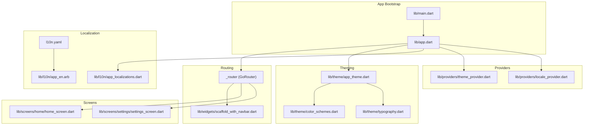
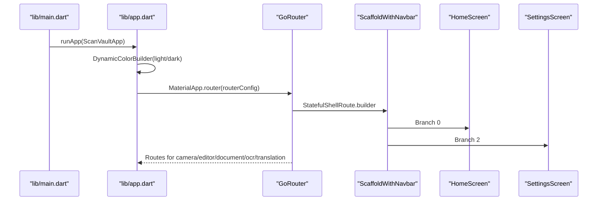
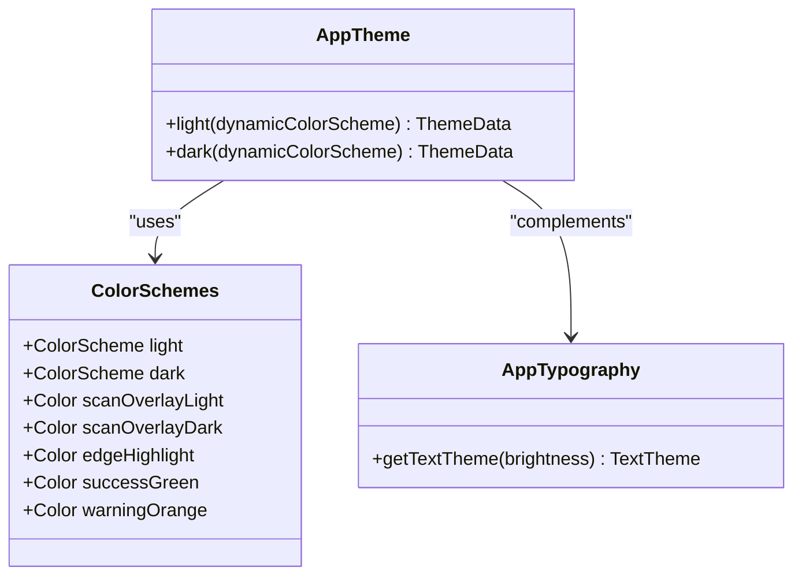
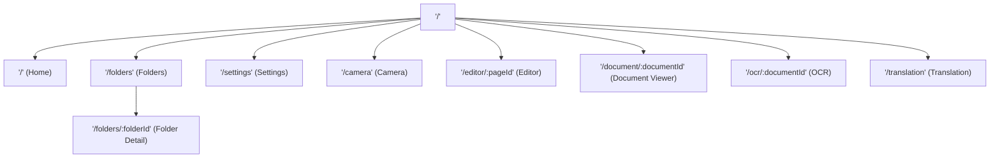
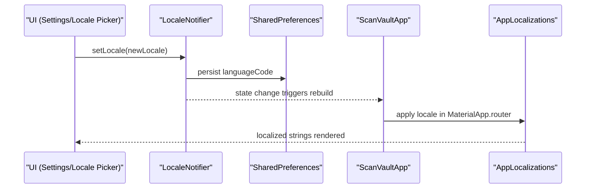
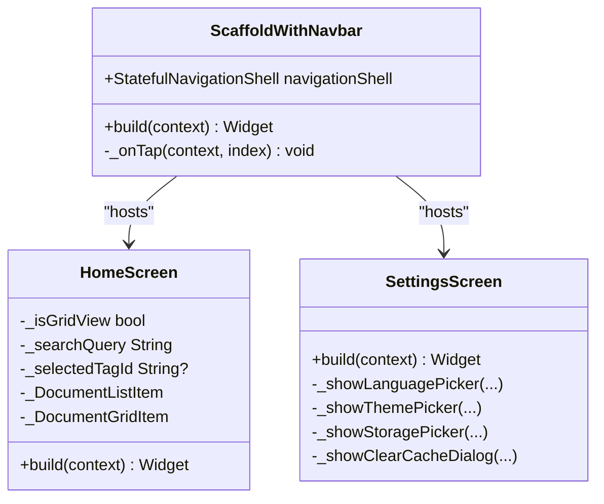
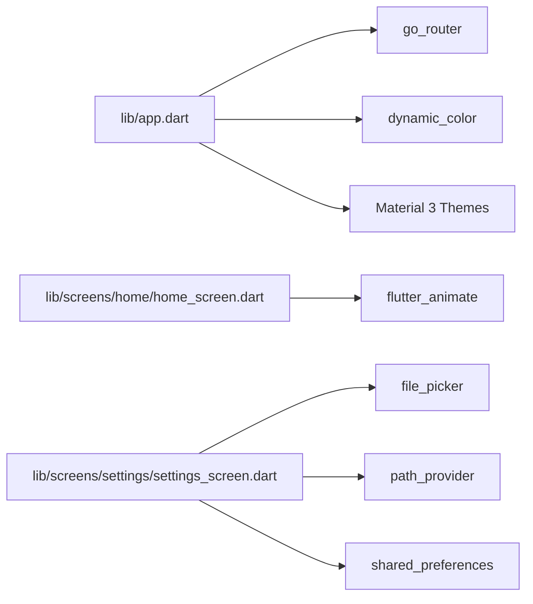

# User Interface & Components

<cite>
**Referenced Files in This Document**
- [lib/app.dart](file://lib/app.dart)
- [lib/main.dart](file://lib/main.dart)
- [lib/theme/app_theme.dart](file://lib/theme/app_theme.dart)
- [lib/theme/color_schemes.dart](file://lib/theme/color_schemes.dart)
- [lib/theme/typography.dart](file://lib/theme/typography.dart)
- [lib/widgets/scaffold_with_navbar.dart](file://lib/widgets/scaffold_with_navbar.dart)
- [lib/providers/locale_provider.dart](file://lib/providers/locale_provider.dart)
- [lib/providers/theme_provider.dart](file://lib/providers/theme_provider.dart)
- [lib/l10n/app_localizations.dart](file://lib/l10n/app_localizations.dart)
- [lib/l10n/app_localizations_bn.dart](file://lib/l10n/app_localizations_bn.dart)
- [lib/l10n/app_localizations_en.dart](file://lib/l10n/app_localizations_en.dart)
- [lib/l10n/app_localizations_gu.dart](file://lib/l10n/app_localizations_gu.dart)
- [lib/l10n/app_localizations_hi.dart](file://lib/l10n/app_localizations_hi.dart)
- [lib/l10n/app_localizations_kn.dart](file://lib/l10n/app_localizations_kn.dart)
- [lib/l10n/app_localizations_ml.dart](file://lib/l10n/app_localizations_ml.dart)
- [lib/l10n/app_localizations_mr.dart](file://lib/l10n/app_localizations_mr.dart)
- [lib/l10n/app_localizations_pa.dart](file://lib/l10n/app_localizations_pa.dart)
- [lib/l10n/app_localizations_ta.dart](file://lib/l10n/app_localizations_ta.dart)
- [lib/l10n/app_localizations_te.dart](file://lib/l10n/app_localizations_te.dart)
- [lib/l10n/app_en.arb](file://lib/l10n/app_en.arb)
- [l10n.yaml](file://l10n.yaml)
- [pubspec.yaml](file://pubspec.yaml)
- [lib/screens/home/home_screen.dart](file://lib/screens/home/home_screen.dart)
- [lib/screens/settings/settings_screen.dart](file://lib/screens/settings/settings_screen.dart)
</cite>

## Table of Contents
1. [Introduction](#introduction)
2. [Project Structure](#project-structure)
3. [Core Components](#core-components)
4. [Architecture Overview](#architecture-overview)
5. [Detailed Component Analysis](#detailed-component-analysis)
6. [Dependency Analysis](#dependency-analysis)
7. [Performance Considerations](#performance-considerations)
8. [Troubleshooting Guide](#troubleshooting-guide)
9. [Conclusion](#conclusion)
10. [Appendices](#appendices)

## Introduction
This document describes ScanVault’s user interface architecture and components. It covers Material Design 3 theming, dynamic color integration, responsive layouts, navigation with GoRouter and shell routes, localization across ten languages, custom UI elements, styling guidelines, accessibility, cross-platform adaptations, animations, and performance optimization strategies. The goal is to help developers and designers understand how UI decisions are implemented and how to extend or customize the interface effectively.

## Project Structure
ScanVault organizes UI-related code by feature and layer:
- Application bootstrap and routing live in the root application module.
- Theming is centralized under a dedicated theme package.
- Localization is managed via ARB files and generated delegates.
- Navigation uses GoRouter with shell routes for persistent bottom navigation.
- Screens implement domain-specific UIs (e.g., Home, Settings).
- Providers encapsulate global state for theme, locale, and other preferences.
- Custom widgets provide reusable UI scaffolding (e.g., bottom navigation).

**Diagram sources**
- [lib/main.dart](file://lib/main.dart#L10-L31)
- [lib/app.dart](file://lib/app.dart#L67-L186)
- [lib/theme/app_theme.dart](file://lib/theme/app_theme.dart#L1-L252)
- [lib/theme/color_schemes.dart](file://lib/theme/color_schemes.dart#L1-L85)
- [lib/theme/typography.dart](file://lib/theme/typography.dart#L1-L116)
- [lib/l10n/app_localizations.dart](file://lib/l10n/app_localizations.dart#L82-L115)
- [l10n.yaml](file://l10n.yaml#L1-L4)
- [lib/l10n/app_en.arb](file://lib/l10n/app_en.arb#L1-L118)
- [lib/providers/theme_provider.dart](file://lib/providers/theme_provider.dart#L1-L29)
- [lib/providers/locale_provider.dart](file://lib/providers/locale_provider.dart#L1-L31)
- [lib/widgets/scaffold_with_navbar.dart](file://lib/widgets/scaffold_with_navbar.dart#L1-L54)
- [lib/screens/home/home_screen.dart](file://lib/screens/home/home_screen.dart#L1-L651)
- [lib/screens/settings/settings_screen.dart](file://lib/screens/settings/settings_screen.dart#L1-L389)

**Section sources**
- [lib/main.dart](file://lib/main.dart#L10-L31)
- [lib/app.dart](file://lib/app.dart#L67-L186)

## Core Components
- Dynamic color theming with Material 3 using dynamic color palettes and fallbacks.
- Persistent bottom navigation via a shell route with three branches (Home, Folders, Settings).
- Full-screen routes for camera, editor, document viewer, OCR, and translation.
- Responsive document list/grid views with search, filtering, and tagging.
- Settings screen for theme, language, storage, and cache management.
- Localization pipeline with ARB files and runtime locale switching.

**Section sources**
- [lib/app.dart](file://lib/app.dart#L33-L60)
- [lib/app.dart](file://lib/app.dart#L67-L186)
- [lib/theme/app_theme.dart](file://lib/theme/app_theme.dart#L8-L250)
- [lib/theme/color_schemes.dart](file://lib/theme/color_schemes.dart#L7-L84)
- [lib/screens/home/home_screen.dart](file://lib/screens/home/home_screen.dart#L41-L249)
- [lib/screens/settings/settings_screen.dart](file://lib/screens/settings/settings_screen.dart#L17-L119)
- [lib/l10n/app_localizations.dart](file://lib/l10n/app_localizations.dart#L104-L115)

## Architecture Overview
The UI architecture centers around a single entry point that configures:
- DynamicColorBuilder to supply dynamic light/dark color schemes.
- MaterialApp.router with a GoRouter configuration.
- Shell routes for persistent bottom navigation and branch-specific routes.
- Riverpod providers for theme mode, system color usage, and locale.

**Diagram sources**
- [lib/main.dart](file://lib/main.dart#L23-L30)
- [lib/app.dart](file://lib/app.dart#L33-L60)
- [lib/app.dart](file://lib/app.dart#L67-L186)
- [lib/widgets/scaffold_with_navbar.dart](file://lib/widgets/scaffold_with_navbar.dart#L26-L52)

## Detailed Component Analysis

### Theme System: Material 3, Dynamic Color, and Dark Mode
- Material 3 is enabled across light and dark themes.
- Color schemes are defined centrally and optionally overridden by dynamic colors.
- Typography is configurable per brightness.
- Component themes (app bar, cards, FAB, navigation bar, inputs, chips, dialogs, bottom sheets, dividers) are unified.

**Diagram sources**
- [lib/theme/app_theme.dart](file://lib/theme/app_theme.dart#L8-L250)
- [lib/theme/color_schemes.dart](file://lib/theme/color_schemes.dart#L10-L84)
- [lib/theme/typography.dart](file://lib/theme/typography.dart#L7-L114)

Implementation highlights:
- Dynamic color is conditionally applied when platform supports it; otherwise, static schemes are used.
- ThemeMode is controlled by a provider and toggled in the Settings screen.

**Section sources**
- [lib/app.dart](file://lib/app.dart#L33-L60)
- [lib/theme/app_theme.dart](file://lib/theme/app_theme.dart#L8-L250)
- [lib/theme/color_schemes.dart](file://lib/theme/color_schemes.dart#L7-L84)
- [lib/theme/typography.dart](file://lib/theme/typography.dart#L7-L114)
- [lib/providers/theme_provider.dart](file://lib/providers/theme_provider.dart#L9-L28)

### Navigation Architecture: GoRouter, Shell Routes, and Deep Linking
- Shell route wraps the bottom navigation and maintains three branches.
- Branch 0: Home screen.
- Branch 1: Folders screen with nested detail route by folder ID.
- Branch 2: Settings screen.
- Additional full-screen routes: Camera, Editor, Document Viewer, OCR, Translation.

**Diagram sources**
- [lib/app.dart](file://lib/app.dart#L67-L186)

Navigation behavior:
- Bottom navigation uses StatefulNavigationShell to navigate branches and supports reactivating the current branch.
- Full-screen routes use parentNavigatorKey to bypass the shell.

**Section sources**
- [lib/app.dart](file://lib/app.dart#L67-L186)
- [lib/widgets/scaffold_with_navbar.dart](file://lib/widgets/scaffold_with_navbar.dart#L15-L23)

### Localization System: 10 Languages, ARB Files, and Runtime Switching
- Supported locales are declared and validated by the localization delegate.
- Template ARB is app_en.arb; translations are generated into per-locale Dart files.
- Runtime locale switching persists to SharedPreferences and rebuilds the app with the new locale.

**Diagram sources**
- [lib/providers/locale_provider.dart](file://lib/providers/locale_provider.dart#L24-L29)
- [lib/l10n/app_localizations.dart](file://lib/l10n/app_localizations.dart#L104-L115)
- [lib/app.dart](file://lib/app.dart#L49-L58)
- [l10n.yaml](file://l10n.yaml#L1-L4)

Localization coverage:
- Supported locales include Bengali, English, Gujarati, Hindi, Kannada, Malayalam, Marathi, Punjabi, Tamil, Telugu.

**Section sources**
- [lib/l10n/app_localizations.dart](file://lib/l10n/app_localizations.dart#L104-L115)
- [lib/l10n/app_en.arb](file://lib/l10n/app_en.arb#L1-L118)
- [lib/providers/locale_provider.dart](file://lib/providers/locale_provider.dart#L16-L29)
- [l10n.yaml](file://l10n.yaml#L1-L4)

### Custom UI Components
- Glass-like bottom navigation via NavigationBar with elevated, fixed type and label behavior.
- Document list/grid with search, tag filtering, and lock-folder exclusion.
- Animated empty state and floating action button with scale-in animation.
- Settings screen with theme picker, language picker, storage location, and cache clearing.

**Diagram sources**
- [lib/widgets/scaffold_with_navbar.dart](file://lib/widgets/scaffold_with_navbar.dart#L7-L53)
- [lib/screens/home/home_screen.dart](file://lib/screens/home/home_screen.dart#L20-L651)
- [lib/screens/settings/settings_screen.dart](file://lib/screens/settings/settings_screen.dart#L13-L389)

Responsive layout patterns:
- SliverAppBar with flexible space and search toggle.
- SliverGrid for two-column grid and SliverList for list view.
- Toggle between grid and list modes.

Accessibility considerations:
- Proper contrast and readable typography.
- Sufficient touch target sizes for navigation and controls.
- Semantic labeling via icons and localized text.

**Section sources**
- [lib/widgets/scaffold_with_navbar.dart](file://lib/widgets/scaffold_with_navbar.dart#L26-L52)
- [lib/screens/home/home_screen.dart](file://lib/screens/home/home_screen.dart#L47-L249)
- [lib/screens/settings/settings_screen.dart](file://lib/screens/settings/settings_screen.dart#L17-L119)

### Styling Guidelines and Component Composition
- Centralized theming via AppTheme and ColorSchemes ensures consistent color usage across components.
- Typography is derived from a brightness-aware TextTheme.
- Component-level themes (app bar, cards, chips, dialogs, bottom sheets) are configured in AppTheme.
- Use of Material 3 components (NavigationBar, NavigationDestination) for modern UX.

Composition patterns:
- Consumers read theme and colorScheme from Theme.of(context).
- Use of ThemeData properties for consistent elevation, shapes, and paddings.
- Typography helpers to maintain readability and hierarchy.

**Section sources**
- [lib/theme/app_theme.dart](file://lib/theme/app_theme.dart#L8-L250)
- [lib/theme/typography.dart](file://lib/theme/typography.dart#L7-L114)
- [lib/theme/color_schemes.dart](file://lib/theme/color_schemes.dart#L7-L84)

### Cross-Platform UI Adaptations and Animations
- Orientation lock to portrait ensures consistent scanning UX.
- Dynamic color adapts to system theme on platforms that support it.
- Animations via flutter_animate enhance feedback (e.g., FAB scale-in).
- Platform-specific resources (Android launch background) improve startup experience.

**Section sources**
- [lib/main.dart](file://lib/main.dart#L13-L17)
- [lib/app.dart](file://lib/app.dart#L33-L60)
- [lib/screens/home/home_screen.dart](file://lib/screens/home/home_screen.dart#L243-L247)

## Dependency Analysis
External libraries and their roles:
- Navigation: go_router for declarative routing and shell routes.
- State: flutter_riverpod for providers and reactive UI updates.
- UI: dynamic_color for Material 3 dynamic color, flutter_animate for animations.
- Camera/ML: camera, google_mlkit_document_scanner, google_mlkit_text_recognition, google_mlkit_translation.
- Export: pdf, printing, archive for PDF/docx/images export.
- Storage: sqflite, path_provider, shared_preferences, file_picker.
- Security: local_auth, flutter_secure_storage, encrypt.

**Diagram sources**
- [pubspec.yaml](file://pubspec.yaml#L9-L78)
- [lib/app.dart](file://lib/app.dart#L1-L11)
- [lib/screens/home/home_screen.dart](file://lib/screens/home/home_screen.dart#L4-L6)
- [lib/screens/settings/settings_screen.dart](file://lib/screens/settings/settings_screen.dart#L1-L11)

**Section sources**
- [pubspec.yaml](file://pubspec.yaml#L9-L78)

## Performance Considerations
- Use lazy lists (SliverChildBuilderDelegate) for large document sets.
- Avoid unnecessary rebuilds by watching only required providers.
- Prefer lightweight animations and disable where not essential.
- Cache thumbnails and avoid heavy image decoding on the UI thread.
- Use efficient grid delegates and limit expensive painting in grids.
- Debounce search queries to reduce filtering churn.

## Troubleshooting Guide
Common issues and resolutions:
- Dynamic color not applied: Ensure platform supports dynamic color; fallback schemes are used otherwise.
- Locale not switching: Verify persisted language code and that the app rebuilds after setting locale.
- Navigation not updating: Confirm StatefulNavigationShell currentIndex is used and reactivation logic is triggered.
- Export failures: Catch errors and present user-friendly messages via SnackBars.
- Storage write errors: Validate directory permissions and write capability before persisting custom storage path.

**Section sources**
- [lib/app.dart](file://lib/app.dart#L33-L60)
- [lib/providers/locale_provider.dart](file://lib/providers/locale_provider.dart#L24-L29)
- [lib/widgets/scaffold_with_navbar.dart](file://lib/widgets/scaffold_with_navbar.dart#L15-L23)
- [lib/screens/home/home_screen.dart](file://lib/screens/home/home_screen.dart#L446-L453)
- [lib/screens/settings/settings_screen.dart](file://lib/screens/settings/settings_screen.dart#L249-L266)

## Conclusion
ScanVault’s UI leverages Material 3 design, dynamic color theming, and a robust navigation model with shell routes. The localization system scales to ten languages with ARB files and runtime switching. Custom components like the bottom navigation and document list/grid provide a responsive, accessible experience. With Riverpod-driven state and carefully chosen animations, the app balances usability and performance across platforms.

## Appendices

### Example Usage and Customization Options
- Theme customization:
  - Adjust ColorSchemes overrides for brand colors.
  - Extend AppTheme to tweak component-level themes.
- Navigation:
  - Add new shell branches or full-screen routes in the router configuration.
  - Customize NavigationBar label behavior and indicator color.
- Localization:
  - Add new keys to the template ARB and regenerate.
  - Extend supported locales in the localization delegate.
- Components:
  - Swap grid/list in HomeScreen by toggling the grid flag.
  - Introduce new filters or sorting in the HomeScreen list pipeline.

[No sources needed since this section provides general guidance]